# AI、LLM、オントロジー、組織記憶の統合レポート

作成日: 2026-05-06  
調査方式: 実務意思決定向けの統合ナラティブレビュー  
対象: AIの歴史、LLMの原理、人間との差分、実務活用、記号接地、オントロジー、Graphiti、暗黙知、Palantir Foundry Ontology、Anthropicの方向性、MCPの射程

## 引用方針

本文では、根拠にしている文献・公式ドキュメントをできるだけ該当段落の近くに置く。長い逐語引用は避け、必要な箇所だけ短い原文句を示し、その後に日本語で解釈する。出典が公式ドキュメント、査読論文、arXiv、書籍ページのどれかも分かるようにする。

## 1. エグゼクティブサマリー

現代のLLMは「知識を持つ主体」というより、巨大な言語・コード・画像・行動ログから学習した確率的なパターン生成器であり、外部ツール、業務データ、記憶、権限、監査、フィードバックループを接続して初めて実務システムになる。したがって、AI活用の本質は「賢いモデルを選ぶこと」だけではなく、組織の現実をモデルが操作可能な形に変換する情報設計にある。

本レポートの結論は以下である。

1. AIの歴史は、記号処理、統計的機械学習、深層学習、Transformer/LLM、エージェント化という流れで理解できる。現在の転換点は、モデル単体の知能ではなく、モデルが外部環境を読み書きする運用系へ進んでいる点にある。
2. LLMの本質は、自己注意機構を中心に、文脈中の要素間関係を高次元ベクトル空間で再構成し、次にあり得る出力を生成することにある。これにより言語、コード、推論風の処理を一つのインターフェースにまとめられる。
3. 人間との差分は、意識の有無という抽象論だけでなく、身体性、目的形成、継続的経験、責任、価値判断、現場制約への接地、社会的信用の所在に見出すべきである。
4. AIに実務投入可能な情報は、単なる文書では不十分である。業務オブジェクト、属性、関係、状態、履歴、意思決定、権限、例外、暗黙の判断基準を構造化する必要がある。
5. 記号接地は「LLMに意味を理解させる」ことではなく、組織内の記号を観測、行為、結果、責任、検証可能なデータに結びつける設計問題である。
6. PalantirのOntologyは、従来のRDF/OWL的な意味論だけでなく、データ、ロジック、アクション、セキュリティを統合する operational ontology として捉えるべきである。
7. Graphitiの時間認識型ナレッジグラフは、動的な記憶、履歴、関係、根拠を扱う方向性として妥当性が高い。ただし、抽出品質、スキーマ設計、運用負荷、権限、評価設計が弱いと、もっともらしいが危険な組織記憶になる。
8. Anthropicの公表情報から見える方向性は、長文脈、高度なエージェント、業務アプリ統合、MCP、スキル、サブエージェント、監査・権限・企業導入に向かっている。詳細な将来ロードマップは公開されていないため、これは公式発表からの推定である。
9. MCPは、AIに外部データ、ツール、プロンプト、リソースを接続する標準化レイヤーとして有効である。ただし、業務意味論、権限設計、データ品質、組織ナレッジの正規化を自動で解決するものではない。

本レポートは、AI研究史、LLM研究、知識表現、認知科学、組織知識論、エージェント基盤の文献を横断する。網羅的なシステマティックレビューではないが、Dartmouth Proposal、Newell and Simon、Rumelhart et al.、Vaswani et al.、Brown et al.、Ouyang et al.、Bai et al.、Harnad、Gruber、Berners-Lee et al.、Nonaka、Graphiti/Zep、Palantir、Anthropic、MCP仕様を、実務導入の設計判断に接続する形で読む。


## 2. AIの歴史をどう捉えるべきか

AIの歴史は、単純な「人間に近づく技術の進歩」ではなく、知能をどのように機械へ実装するかを巡る複数のパラダイムの交代である。

初期AIは、推論、探索、ルール、記号操作を中心に発展した。人間の知的行為を明示的な記号と規則に分解できるという見方は、エキスパートシステムや古典的推論システムの基盤になった。しかし、現実世界の曖昧さ、例外、知識獲得コスト、環境変化に弱かった。

この時期の出発点は、McCarthy、Minsky、Rochester、Shannonによる1955年のDartmouth Proposalである。同提案は、学習や知能の諸側面を精密に記述できれば機械でシミュレートできるという研究仮説を掲げた。Newell and Simon (1976) は physical symbol system hypothesis を提示し、知能を記号と探索の計算過程として捉えた。この見方は、知識を明示ルールとして持つシステムに強い理論的支柱を与えた。

出典メモ: [Dartmouth Proposal](https://www-formal.stanford.edu/jmc/history/dartmouth/dartmouth.html) は、AI研究を「learning」や「intelligence」を機械でシミュレートする計画として提示した。Newell and Simonの記号処理観は [Computer Science as Empirical Inquiry](https://cacm.acm.org/research/computer-science-as-empirical-inquiry/) を参照。

その後、統計的機械学習は、手で規則を書く代わりに、データから規則性を学ぶ方向へ移行した。さらに深層学習は、特徴量設計そのものを学習に取り込み、画像認識、音声認識、自然言語処理を大きく進展させた。

ニューラルネットワークの復興には、Rumelhart, Hinton, and Williams (1986) の誤差逆伝播法が決定的だった。LeCun, Bengio, and Hinton (2015) は、深層学習を、表現そのものを階層的に学ぶ方法として整理した。2010年代の進展は、単に計算資源が増えたからではなく、データ、GPU、最適化、正則化、ネットワーク構造、ベンチマークが同時に成熟した結果である。

出典メモ: 誤差逆伝播は [Rumelhart, Hinton, and Williams (1986)](https://www.nature.com/articles/323533a0)、深層学習の総説は [LeCun, Bengio, and Hinton (2015)](https://www.nature.com/articles/nature14539)。後者は深層学習を、複数の表現レベルを学習する方法として整理している。

2017年のTransformerは、系列データを処理するうえで再帰や畳み込みに依存せず、注意機構によって文脈中の要素間関係を直接扱う設計を示した。これが現代LLMの中心的基盤になった。GPT-3以降は、大規模事前学習とプロンプトによる few-shot / zero-shot 的な利用が広まり、「タスクごとに個別モデルを作る」から「汎用モデルに文脈を与えて解かせる」へ重心が移った。

出典メモ: Transformerの原論文 [Attention Is All You Need](https://arxiv.org/abs/1706.03762) は、Transformerを "based solely on attention mechanisms" と説明する。GPT-3の [Language Models are Few-Shot Learners](https://arxiv.org/abs/2005.14165) は、スケール拡大によりタスク非依存の few-shot 性能が改善することを報告した。

2024年以降の実務上の焦点は、モデル単体から、エージェント、ツール利用、長文脈、外部記憶、権限、監査、業務アプリ統合へ移っている。これはAIが「回答するソフトウェア」から「業務環境内で行為するソフトウェア」へ移行していることを意味する。

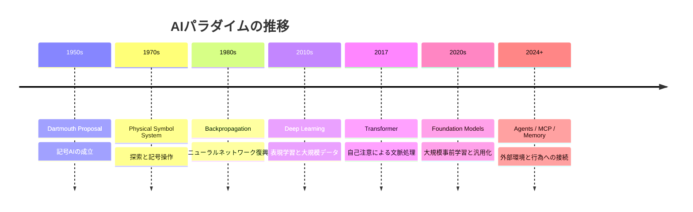

## 3. LLMの原理と構造の本質

LLMを理解する際の要点は、次の五つである。

LLMの研究文脈では、2017年のTransformerだけでなく、BERT、GPT-3、InstructGPT、Constitutional AI、Foundation Modelsの議論を合わせて読む必要がある。BERT (Devlin et al., 2018) は双方向文脈を事前学習で獲得し、GPT-3 (Brown et al., 2020) は大規模自己回帰モデルが few-shot 性能を示すことを実証した。Bommasani et al. (2021) は、これらを foundation models と呼び、能力だけでなく、バイアス、評価、法的・社会的リスクを含む基盤技術として整理した。

出典メモ: BERTは [Devlin et al. (2018)](https://arxiv.org/abs/1810.04805)、GPT-3は [Brown et al. (2020)](https://arxiv.org/abs/2005.14165)、foundation modelの概念整理は [Bommasani et al. (2021)](https://arxiv.org/abs/2108.07258)。ここでは、個別タスク用モデルから基盤モデルへ移る研究史として引用している。

### 3.1 トークン化

LLMは文字列をそのまま理解するのではなく、テキストをトークンに分割し、各トークンを数値ベクトルとして扱う。ここでの意味は、人間が持つ経験的意味ではなく、学習データ内での共起、文脈、構文、用法、推論パターンを反映した分布的な表現である。

### 3.2 自己注意

Transformerの中心は自己注意である。自己注意は、入力中の各要素が他のどの要素をどれだけ参照すべきかを学習する仕組みである。これにより、長距離依存、指示、参照、コード構造、文脈上の制約を扱いやすくなる。

Vaswani et al. (2017) の貢献は、RNNやCNNを使わずに注意機構だけで系列変換を構成できることを示した点にある。LLMでは、各層の多頭注意が異なる関係を捕捉し、フィードフォワード層がその表現を変換する。これが「意味理解」に見える振る舞いの技術的基盤である。ただし、注意重みをそのまま人間可読な説明とみなすのは危険で、解釈可能性研究でも注意と説明の関係は慎重に扱われている。

出典メモ: [Vaswani et al. (2017)](https://arxiv.org/abs/1706.03762) は、従来の系列変換モデルが recurrent / convolutional network に基づいていたのに対し、Transformerでは recurrence と convolution を捨てたと述べる。このレポートの「自己注意中心」という説明はこの設計上の差分に基づく。

### 3.3 事前学習とスケーリング

LLMは大量のテキストやコードを用いて、次のトークン、または隠されたトークンを予測するように学習する。GPT-3の論文は、モデル規模の拡大がタスク非依存の few-shot 性能を押し上げることを示した。一方で、学習コーパス由来のバイアス、古い知識、誤情報、評価汚染、推論の不安定性も同時に抱える。

### 3.4 指示追従とアライメント

基盤モデルはそのままでは業務に使いにくい。人間の指示に従い、危険な出力を抑制し、会話形式で有用な応答を返すように、教師ありファインチューニング、RLHF/RLAIF、constitutional AI などの追加訓練が行われる。

Ouyang et al. (2022) は、GPT-3を人間フィードバックで指示追従させる InstructGPT を示した。Bai et al. (2022) の Constitutional AI は、人間ラベルだけに頼らず、明示された原則に基づくAIフィードバックで有害性を下げる方向を示した。実務上は、これらの手法は「モデルに倫理を内蔵した」ことを意味しない。出力傾向を改善したにすぎず、権限、監査、承認、ログ、評価はシステム側に残る。

出典メモ: [Ouyang et al. (2022)](https://arxiv.org/abs/2203.02155) は、モデルを大きくするだけではユーザー意図への追従は保証されないとし、human feedbackで fine-tune する方法を示す。[Bai et al. (2022)](https://arxiv.org/abs/2212.08073) は、"rules or principles" によるAIフィードバックを Constitutional AI と呼んでいる。

### 3.5 推論ではなく「推論可能な圧縮」

LLMの出力は論理エンジンの証明ではない。多くの場合、膨大な言語パターンを圧縮した結果として、推論に見える振る舞いを生成する。したがって実務では、LLMの推論をそのまま信じるのではなく、外部データ、計算、ルール、監査ログ、承認フローと組み合わせて検証可能にする必要がある。

Bender et al. (2021) は、大規模言語モデルの環境負荷、データ由来のバイアス、形式だけを模倣する危険を批判した。一方で、Brown et al. (2020) 以降の結果は、統計的予測だけでは軽視できない汎用性を示した。両者は矛盾しない。LLMは人間と同じ意味理解を持つと断定できないが、外部環境と組み合わせれば高い実務価値を持つ。

出典メモ: 批判的観点は [Bender et al. (2021)](https://dl.acm.org/doi/10.1145/3442188.3445922)、能力面の実証は [Brown et al. (2020)](https://arxiv.org/abs/2005.14165)。本レポートでは、この二つを「LLMは過小評価も過大評価も避けるべき技術」と読む。

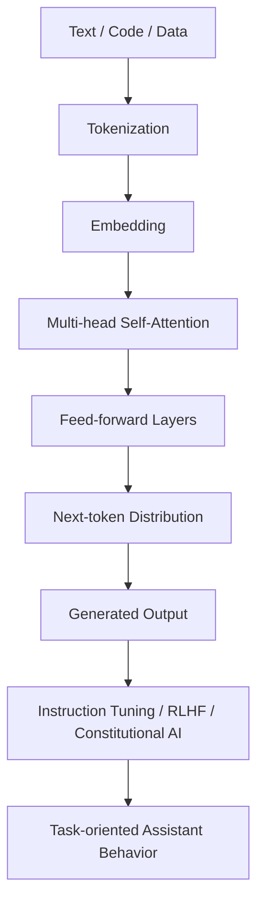

## 4. 人間との違いをどこに見出すべきか

LLMと人間の違いを「人間には心がある、AIにはない」という形で止めると、実務設計にはあまり役に立たない。実務で重要な差分は以下である。

この論点には哲学と認知科学の長い議論がある。Searle (1980) の中国語の部屋は、記号操作だけでは意味理解にならないと主張した。Dreyfusは、古典的AIが身体性、状況性、熟練、世界内存在を過小評価していると批判した。Clark and Chalmers (1998) は、認知が脳内だけでなく外部環境に拡張される可能性を論じた。Lake et al. (2017) は、人間らしい学習には、少数事例からの一般化、因果モデル、構成性、直感心理学・物理学が必要だと整理した。

出典メモ: 記号操作と理解の差は [Searle (1980)](https://www.cambridge.org/core/journals/behavioral-and-brain-sciences/article/minds-brains-and-programs/8D8E2A8A4C5A96E7C4A5385DAB3D27C1)、外部環境まで含む認知の捉え方は [Clark and Chalmers (1998)](https://academic.oup.com/analysis/article-abstract/58/1/7/153111)、人間らしい学習の要件は [Lake et al. (2017)](https://www.cambridge.org/core/product/A9535B1D745A0377E16C590E14B94993) を参照。

| 観点 | 人間 | LLM |
|---|---|---|
| 身体性 | 感覚、運動、疲労、危険、社会的制裁を経験する | 基本的にはテキスト・画像・ツール結果を入力として扱う |
| 目的 | 自分や組織の目的を形成・修正する | 与えられた目的を最適化するよう振る舞う |
| 記憶 | 連続的経験、感情、責任と結びつく | セッション、外部記憶、検索に依存する |
| 意味 | 行為、経験、社会関係、価値と接続される | データ内の用法・関係から分布的に表現される |
| 責任 | 判断責任を負う | 責任主体ではなく、責任ある運用の部品 |
| 暗黙知 | 身体化された技能、文脈判断、空気、勘を持つ | 観測・記録・フィードバックされない暗黙知にはアクセスできない |

重要なのは、AIを人間の代替として捉えるより、人間の判断を補強し、形式知化し、実行と検証を速める装置として設計することである。

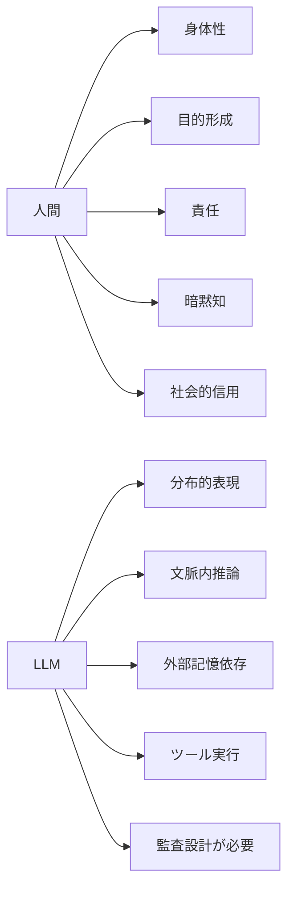

## 5. 実務でAIにインプット可能な情報

AI活用の成否は「どのモデルを使うか」よりも「何を入力可能な状態にするか」に大きく依存する。実務投入に有効な情報は以下の階層で整理できる。

この章は、RAG、知識グラフ、業務データモデリング、ワークフロー管理の交差点にある。Lewis et al. (2020) のRAGやGuu et al. (2020) のREALMは、モデル内部に全知識を持たせるのではなく、検索された外部知識を生成に接続する方向を示した。実務では、この検索対象が単なる文書コーパスに留まると、業務状態、権限、履歴、例外の扱いが弱くなる。

出典メモ: RAGは [Lewis et al. (2020)](https://arxiv.org/abs/2005.11401)、REALMは [Guu et al. (2020)](https://proceedings.mlr.press/v119/guu20a.html)。ここでは、検索拡張を「文書検索」だけで終わらせず、業務オブジェクト・状態・行為まで広げる必要があるという実務上の含意として引用している。

### 5.1 第1層: 文書

規程、マニュアル、議事録、設計書、顧客対応履歴、コード、FAQなど。これは最も導入しやすいが、文書だけでは「今どれが有効か」「誰が承認したか」「例外は何か」「実際の業務状態はどうか」が曖昧になりやすい。

### 5.2 第2層: 構造化データ

顧客、案件、契約、在庫、従業員、プロジェクト、売上、障害、問い合わせなどのテーブルデータ。LLM単体ではなく、SQL、API、BI、データ品質管理と組み合わせる必要がある。

### 5.3 第3層: 業務オブジェクト

「顧客」「案件」「請求」「プロダクト」「障害」「施策」など、業務上の名詞を明示し、属性、関係、状態、ライフサイクル、権限を持たせる。ここがオントロジー化の入り口である。

### 5.4 第4層: 行為と意思決定

承認、差戻し、発注、価格変更、顧客連絡、デプロイ、障害対応などの業務アクション。AIが実務に入るには、読むだけでなく、どの条件で何を実行できるかを定義する必要がある。

### 5.5 第5層: フィードバックと結果

AIまたは人間の判断が、どの結果を生んだかを記録する。これがないと、AI活用は単発の効率化に留まり、組織学習にならない。

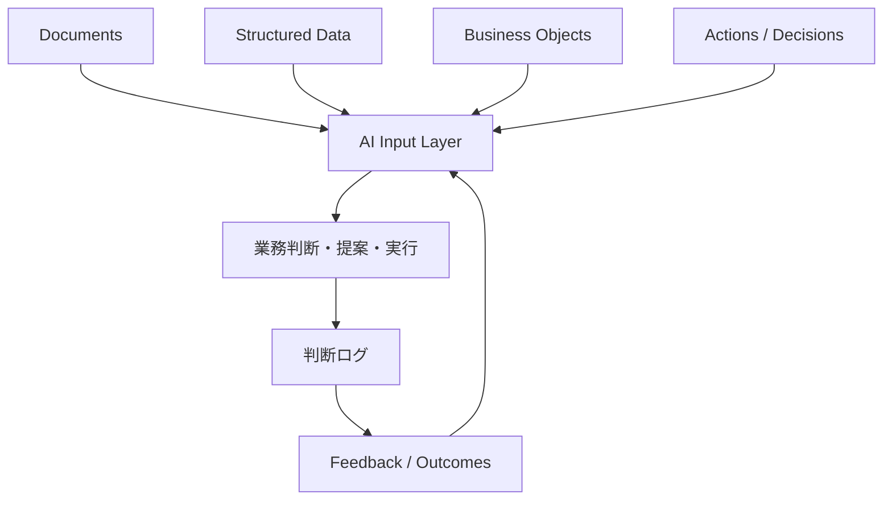

## 6. 記号接地の方法

記号接地問題は、記号が記号同士の関係だけで閉じていると、何を意味しているのかがシステム内では決まらないという問題である。Harnadは、単なる言語的入出力だけでは接地が不十分であり、感覚運動的な接続が必要だと論じた。

出典メモ: [Harnad (1990)](https://www.southampton.ac.uk/~harnad/Papers/Harnad/harnad90.sgproblem.html) の Symbol Grounding Problem がこの章の基礎である。本レポートでは、ロボット身体そのものではなく、業務対象・行為・結果・責任への接続として再解釈している。

LLM時代の記号接地は、古典的な「記号AI対コネクショニズム」の再演ではない。LLMは分布的表現により言語内の関係を強力に扱えるが、業務で問題になるのは「この顧客」「この契約」「この障害」「この承認」のような個別対象への接続である。したがって、接地は哲学的意味理解の完全解決ではなく、参照、行為、結果、責任を閉じる情報アーキテクチャとして設計する。

実務AIにおける記号接地は、必ずしもロボット身体を持たせることではない。組織内では、次の接続を作ることが現実的な接地になる。

1. **記号と対象の接続**: 「顧客A」「案件B」「リスクC」が、実データ上の一意なオブジェクトを指す。
2. **記号と状態の接続**: 「未対応」「承認済み」「障害中」「重要顧客」などの状態が、判定ルールと証跡を持つ。
3. **記号と行為の接続**: 「承認する」「送信する」「発注する」が、実際のシステム操作と結びつく。
4. **記号と結果の接続**: 行為後の売上、品質、遅延、顧客満足、リスク低減が記録される。
5. **記号と責任の接続**: 誰が判断し、誰が承認し、どの権限で実行されたかが残る。

この観点では、オントロジーは辞書ではなく、組織の現実を操作可能にする接地レイヤーである。

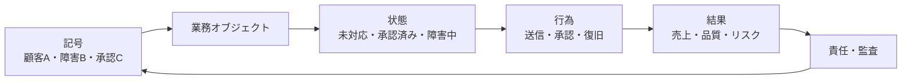

## 7. オントロジーの捉え方

オントロジーには少なくとも三つの意味がある。

Gruber (1993) は、オントロジーを概念化の明示的仕様として定義した。Guarino (1998) 以降の formal ontology は、概念の分類だけでなく、同一性、依存性、部分全体関係、役割、イベントといった基礎的区別を重視した。Berners-Lee, Hendler, and Lassila (2001) のSemantic Webは、Web上の情報を機械が処理可能な意味構造へ接続する構想だった。これらの系譜は、現代の業務AIにおいて「LLMが触る対象をどう定義するか」という問題に戻ってくる。

出典メモ: オントロジーを「明示的仕様」として扱う定義は [Gruber (1993)](https://doi.org/10.1006/knac.1993.1008)、Semantic Webの構想は [Berners-Lee, Hendler, and Lassila (2001)](https://lassila.org/publications/2001/SciAm.html)。この節では、知識表現としての系譜と、業務操作レイヤーとしての現代的用法を分けている。

1. **哲学的オントロジー**: 何が存在するのかを問う。
2. **知識表現としてのオントロジー**: 概念、関係、制約を機械可読に定義する。
3. **業務運用としてのオントロジー**: 業務上の対象、状態、行為、権限、意思決定を統合する。

AI活用に必要なのは、3番目を含むオントロジーである。単にRDF/OWLで語彙を定義しても、実務アクション、権限、監査、フィードバックがなければ業務は動かない。

Palantir FoundryのOntologyはこの点を強く押し出している。PalantirはOntologyを、データセット、仮想テーブル、モデルの上に位置し、設備、製品、注文、金融取引などの現実世界の対象に接続する operational layer と説明している。また、意味要素だけでなく、アクション、関数、動的セキュリティといった kinetic elements を含むと述べている。

出典メモ: Palantirの [Why create an Ontology?](https://www.palantir.com/docs/foundry/ontology/why-ontology) は、Ontologyを組織の "common language" として説明し、意思決定結果の capture と writeback を強調する。Action types、Functions、Permissionsの具体項目は同ドキュメントのナビゲーションおよび関連ページ群で確認できる。

この考え方は、LLM時代に非常に重要である。LLMは自然言語で多様な要求を受けられるが、その要求を安全に実務へ反映するには、「どのオブジェクトに対して、どの状態で、誰の権限で、どの行為を許すか」を明確にする必要がある。

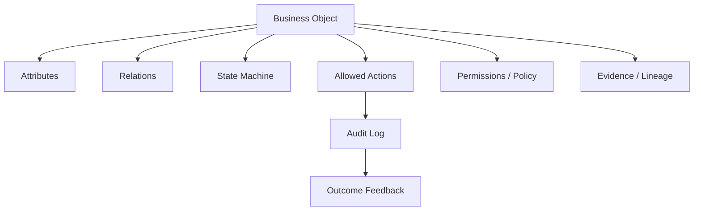

## 8. Graphitiのアプローチの是非

Graphitiは、Zepの文脈基盤の中核にある時間認識型のコンテキストグラフエンジンである。公式READMEでは、静的な知識グラフではなく、事実の時間的変化、出所、エピソード、カスタム型、ハイブリッド検索を扱うものとして説明されている。Zep論文では、Graphitiを通じて会話データと業務データを動的に統合し、履歴関係を維持するアプローチが示されている。

出典メモ: Graphiti READMEは、Graphitiを [temporal context graphs for AI agents](https://github.com/getzep/graphiti) のフレームワークと説明し、事実の変化、provenance、prescribed / learned ontologyを扱うと述べる。Zep論文は [Rasmussen et al. (2025)](https://arxiv.org/abs/2501.13956)。

Graphitiを評価するには、RAGの限界と比較するのが分かりやすい。RAGは、関連文書を検索して生成に渡す強力なパターンだが、文書断片の時系列、事実の更新、人物・案件・意思決定の関係、矛盾する証跡の扱いは実装依存になりやすい。Zep / Graphiti (Rasmussen et al., 2025) は、エージェント記憶を時間つき知識グラフとして扱うことで、この弱点を補う設計を示している。

出典メモ: [Zep論文](https://arxiv.org/abs/2501.13956) は、既存RAGを static document retrieval に限られがちだとし、Graphitiを temporally-aware knowledge graph engine として位置づける。Graphiti READMEも、古い事実を削除せず validity window で管理する設計を説明している。

### 8.1 評価できる点

Graphitiの方向性は、以下の理由で妥当性が高い。

1. **時間を扱う**: 組織知識は「現在正しいこと」だけでなく、「いつ正しかったか」「いつ上書きされたか」が重要である。
2. **出所を残す**: エージェント記憶は、根拠となる会話、文書、JSON、イベントに戻れなければ監査に耐えない。
3. **関係を扱う**: フラットなベクトル検索では、人物、案件、意思決定、例外、依存関係の構造を扱いにくい。
4. **動的更新を想定する**: 業務では顧客状態、仕様、判断基準が変化するため、バッチ再構築だけでは遅い。
5. **MCPとの親和性**: Graphiti MCP Serverにより、Claude DesktopやCursorなどのMCPクライアントから記憶ツールとして利用できる。

### 8.2 注意すべき点

ただし、Graphitiを導入すれば組織記憶が自動的に良くなるわけではない。

1. **抽出品質の問題**: LLMが会話から抽出したエンティティや関係は誤る。誤った関係が記憶されると、後続の判断を汚染する。
2. **オントロジー設計の問題**: prescribed ontology と learned ontology のバランスを誤ると、グラフが混沌化する。
3. **権限の問題**: 誰の会話から得た知識を、誰に見せてよいかを制御しなければならない。
4. **忘却の問題**: 古い情報を削除するのではなく履歴化する設計は有効だが、検索時に古い情報が混入するリスクがある。
5. **評価の問題**: 記憶が本当に業務成果に寄与したかを測るベンチマークを自社で設計する必要がある。

### 8.3 結論

Graphitiは、LLMの外部記憶として有望である。ただし、最初から全社知識基盤にするのではなく、対象を限定したPoCが望ましい。たとえば、顧客対応履歴、障害対応、技術調査、設計判断、営業提案など、時間変化と関係性が重要な領域から始めるべきである。

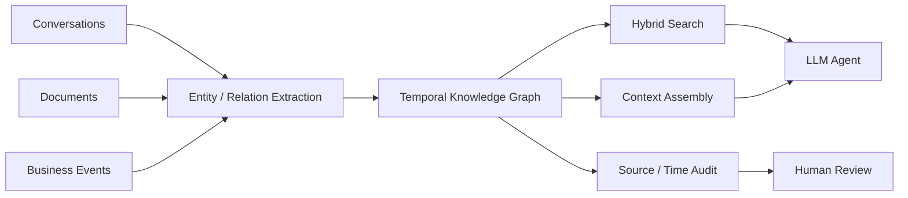

## 9. 暗黙知を組織活用する方策

暗黙知は、文書化されていない知識ではなく、経験、身体化された技能、状況判断、関係性、文脈依存の勘を含む。NonakaのSECIモデルでは、暗黙知と形式知の相互変換が組織知識創造の中心に置かれる。

Polanyi (1966) の暗黙知論は、「人は語れる以上のことを知っている」という問題を提示した。Nonaka (1994) とNonaka and Takeuchi (1995) は、暗黙知と形式知の変換を、共同化、表出化、連結化、内面化の循環として整理した。Brown and Duguid (1991) は、学習とイノベーションが公式マニュアルだけでなく、実践共同体の中で起こることを示した。AI導入では、この系譜を「暗黙知を全部テキスト化する」話に矮小化してはいけない。

出典メモ: 暗黙知の基礎は [Polanyi, The Tacit Dimension](https://openlibrary.org/books/OL5990259M/The_tacit_dimension.)、SECIモデルの源流は [Nonaka (1994)](https://pubsonline.informs.org/doi/10.1287/orsc.5.1.14) と [Nonaka and Takeuchi (1995)](https://academic.oup.com/book/52097)。実践共同体の観点は [Brown and Duguid (1991)](https://pubsonline.informs.org/doi/fpi/10.1287/orsc.2.1.40)。

AI時代の暗黙知活用は、暗黙知を完全に形式知化することではない。むしろ、暗黙知が発揮された場面を捕捉し、再利用可能な形で周辺情報と接続することである。

実務方策は以下である。

1. **判断ログを残す**: 「何を決めたか」だけでなく、「なぜそうしたか」「代替案は何だったか」「どの制約が効いたか」を残す。
2. **熟練者の思考過程を収集する**: レビューコメント、障害対応、商談準備、設計判断を、短い音声・メモ・会話ログとして残す。
3. **ケースベース化する**: 抽象マニュアルではなく、実例、例外、失敗、復旧、顧客反応を蓄積する。
4. **オントロジーに接続する**: 暗黙知を「顧客」「案件」「システム」「リスク」「判断基準」などの業務オブジェクトに紐づける。
5. **AIで外化を支援する**: LLMに、会話から論点、判断基準、未確認事項、再利用可能な手順を抽出させる。
6. **人間が承認する**: 暗黙知の外化は誤読されやすい。熟練者や責任者によるレビューが必要である。
7. **再内面化の場を作る**: AIが作った文書を読むだけでなく、ペア作業、レビュー、ロールプレイ、振り返りで人間が再び身体化する。

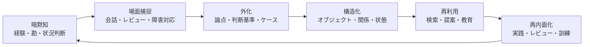

## 10. Palantirの概念との関連

Palantir Foundry Ontologyは、AI時代の業務システム設計における重要な参照点である。Palantirのドキュメントでは、Ontologyは組織の operational layer であり、データを現実世界の対象へ接続し、意思決定、アクション、セキュリティを統合すると説明されている。

出典メモ: [Palantir Ontology overview](https://www.palantir.com/docs/foundry/ontology/overview) と [Why create an Ontology?](https://www.palantir.com/docs/foundry/ontology/why-ontology) を参照。後者はOntologyを組織の "digital twin" と呼び、decision capture、writeback、action typesを通じて意思決定をデータ化すると説明している。

Palantirの特徴は、オントロジーを静的な知識表現に閉じず、業務対象、権限、アクション、意思決定を統合する運用層として扱う点にある。これはSemantic WebやOWLの伝統と矛盾しないが、重点が異なる。RDF/OWL系のオントロジーが「概念と関係の表現」を重視するのに対し、Foundry Ontologyは「現実の業務対象を安全に操作するための層」として提示されている。

この思想は、次のようにLLM活用と接続する。

| Palantirの概念 | LLM/AI実務での意味 |
|---|---|
| Object / Link | LLMが参照すべき業務上の名詞と関係 |
| Action | LLMが提案または実行できる業務操作 |
| Function / Logic | ルール、計算、モデル、ワークフロー |
| Dynamic Security | ユーザー・AIエージェントごとの権限制御 |
| Decision capture | 判断、承認、結果の記録 |
| Digital twin of organization | AIと人間が共有する業務世界モデル |

Palantir型の発想の強みは、AIを単なるチャットUIに閉じ込めず、業務世界の状態変化に接続する点である。一方で、導入には大きな設計・統合コストがかかる。自社で同様の思想を採用する場合は、最初から巨大な全社オントロジーを作るのではなく、特定ワークフローの「小さな operational ontology」から始めるべきである。

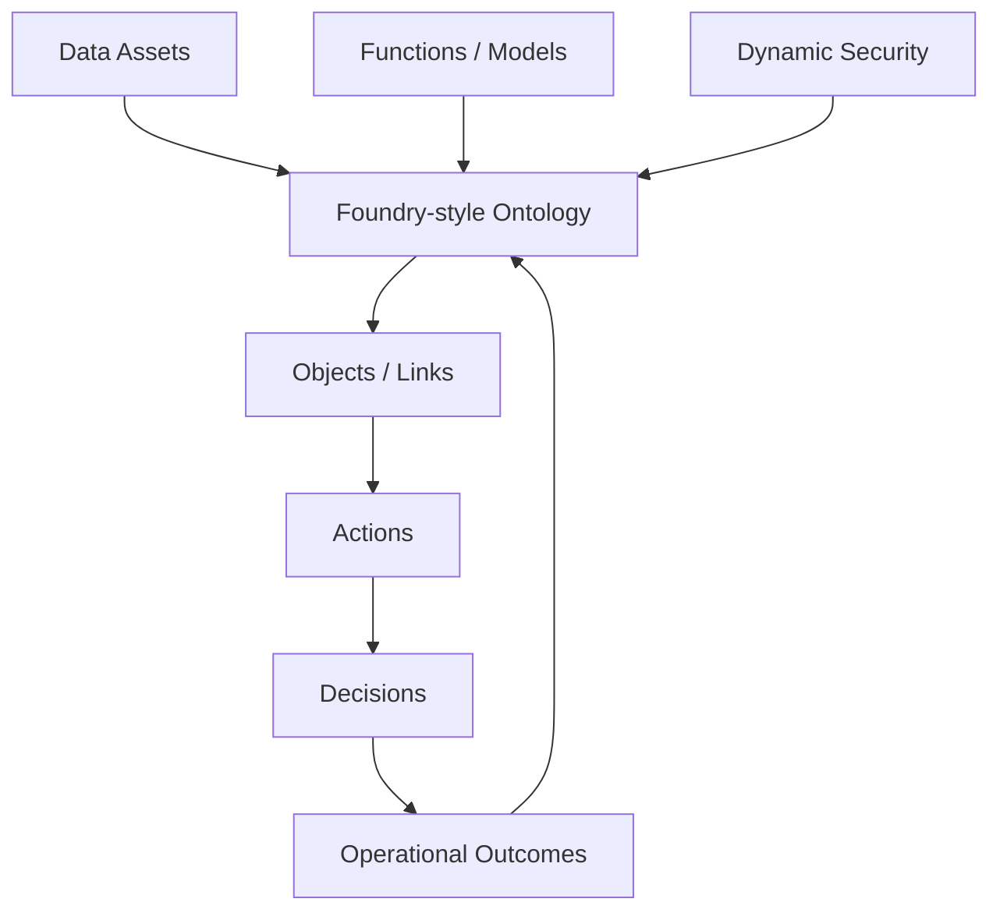

## 11. Anthropicの今後のロードマップをどう読むか

Anthropicは詳細な将来ロードマップを包括的には公開していない。したがって、ここでは2026年5月6日時点の公式発表から読み取れる方向性として整理する。

この章は、公式ロードマップの引用ではなく、Anthropicの公開済み製品・仕様・発表からの推定である。2024年11月のMCP発表、Claude CodeのMCP連携、Subagents、Skills、Opus 4.6の1M context betaとagent teams、Labs、金融向けagent templatesは、同じ方向を示している。つまり、Anthropicは「単発応答のLLM」から「長時間タスクを分解し、外部ツールを使い、組織の権限下で実行するエージェント基盤」へ重心を移している。

出典メモ: MCP発表は [Anthropic, Introducing the Model Context Protocol](https://www.anthropic.com/news/model-context-protocol)。Opus 4.6の1M token context、context compaction、agent teamsは [Claude Opus 4.6](https://www.anthropic.com/news/claude-opus-4-6) に基づく。ここでの「方向性」は公式ロードマップではなく、公表済み機能からの推定である。

### 11.1 公表情報から見える方向性

1. **エージェント化**: Claude Code、Cowork、Managed Agents、金融向け agent templates など、回答ではなく作業を実行する方向へ進んでいる。
2. **業務アプリ統合**: Excel、PowerPoint、Word、Outlook、金融データプロバイダ、企業システムとの接続を強めている。
3. **MCP中心の接続戦略**: MCPをAIと外部データ・ツールを接続する標準として位置づけ、APIやClaude Code、Claude.aiで利用可能にしている。
4. **長時間・長文脈作業**: Opus 4.6では1M token context beta、compaction、長時間タスク、agent teamsが示されている。
5. **企業統制**: 権限、認証、監査ログ、コンプライアンス、クラウド基盤、パートナーエコシステムを強化している。
6. **計算資源拡大**: AWSとの追加提携により、学習・推論能力の拡張を進めている。
7. **実験と製品化の分離**: Labsを通じて、研究プレビュー、実験的機能、プロダクト化を分けて進める体制を示している。

### 11.2 実務上の読み

Anthropicの方向性は、モデル単体の性能競争から、業務エージェント基盤、ツール接続、組織導入、監査可能な自律作業へ移っている。MCP、Skills、Subagents、長文脈、office連携、Claude Code/Coworkは同じ方向を向いている。

ただし、「Anthropicが今後必ずこうする」という断定は避けるべきである。ロードマップとして使うなら、「公表済み機能から見た実務導入上の仮説」として扱うのが妥当である。

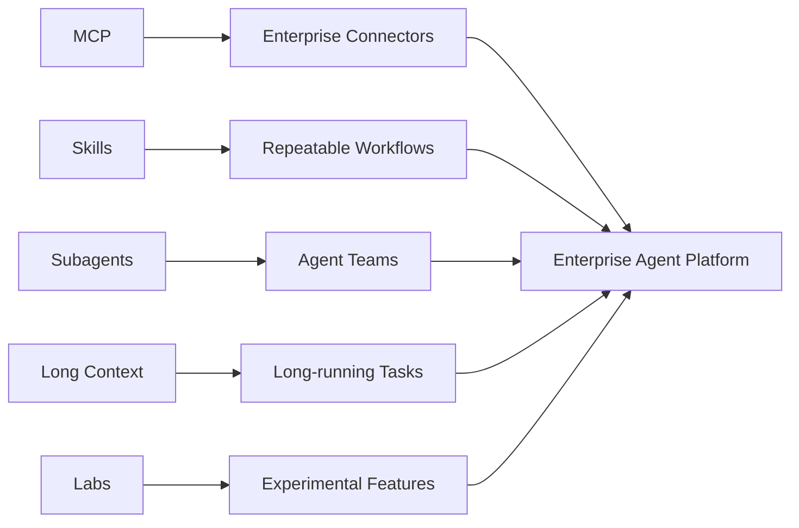

## 12. MCPでどこまで対応可能か

MCPは、AIアプリケーションと外部システムを接続する標準プロトコルである。AnthropicはMCPを、データソースやツールをAIに接続するための標準として説明している。公式仕様では、Tools、Resources、Prompts、Sampling、Roots、Elicitation、Authorization などが扱われる。

出典メモ: AnthropicのMCP発表は、MCPを "open standard" として、AI assistants と data sources を接続するものと説明している。MCP公式の [What is MCP?](https://modelcontextprotocol.io/docs/getting-started/intro) も、AI applicationsを external systems に接続する標準と説明する。

MCPの位置づけは、HTTPやSQLのように万能な意味論ではなく、接続の共通インターフェースである。公式仕様では、server features として Resources、Prompts、Tools、client features として Sampling、Roots などが定義される。2025年以降の仕様では、認可やセキュリティ考慮も整備されている。実務では、MCP serverを作ること自体より、どの操作を公開し、どの権限で実行し、どのログを残すかが本質になる。

出典メモ: MCP serverの基本機能は [Understanding MCP servers](https://modelcontextprotocol.io/docs/learn/server-concepts)。同ページはTools、Resources、Promptsを三つのbuilding blocksとして説明し、toolsはモデルが呼び出す操作、resourcesは文脈情報、promptsはテンプレートと位置づける。

### 12.1 MCPでできること

1. **ツール実行**: API呼び出し、DB検索、計算、ファイル操作、業務システム操作をAIに公開する。
2. **リソース提供**: ファイル、DB、API、文書などをURI付きの文脈として公開する。
3. **プロンプトテンプレート**: 業務ワークフローに沿った再利用可能な指示テンプレートを提供する。
4. **ユーザー確認**: 実装次第で、危険操作に対する確認UIや承認を挟める。
5. **既存システム統合**: Slack、GitHub、Google Drive、DB、社内APIなどの接続を標準化しやすい。
6. **Graphitiのような記憶ツール連携**: MCP server化された記憶・ナレッジグラフを、複数のAIクライアントから利用できる。

### 12.2 MCPだけではできないこと

1. **意味設計の自動化**: MCPはプロトコルであり、業務オントロジーを自動で作らない。
2. **データ品質保証**: 古いデータ、矛盾、重複、誤入力は別途管理が必要である。
3. **責任設計**: 誰が承認し、誰が責任を負うかはMCPの外側の業務設計で決める。
4. **権限・監査の完全解決**: 仕様にセキュリティ考慮はあるが、実装と運用が重要である。
5. **記号接地そのもの**: MCPは接続経路を提供するが、記号と現実対象・行為・結果を対応づける設計は別に必要である。

### 12.3 推奨アーキテクチャ

実務では、MCPを以下のように位置づけるのがよい。

```text
LLM / Agent
  ↓
MCP Client
  ↓
MCP Servers
  ├─ Document / Search Server
  ├─ Database / BI Server
  ├─ Workflow / Ticket / CRM Server
  ├─ Graphiti / Memory Server
  └─ Approval / Audit Server
  ↓
Operational Ontology
  ├─ Objects
  ├─ Relations
  ├─ States
  ├─ Actions
  ├─ Permissions
  └─ Feedback
```

MCPは「接続の標準」であり、Operational Ontologyは「接続されたものの意味と行為可能性を定義する層」である。この二つを分けて設計することが重要である。

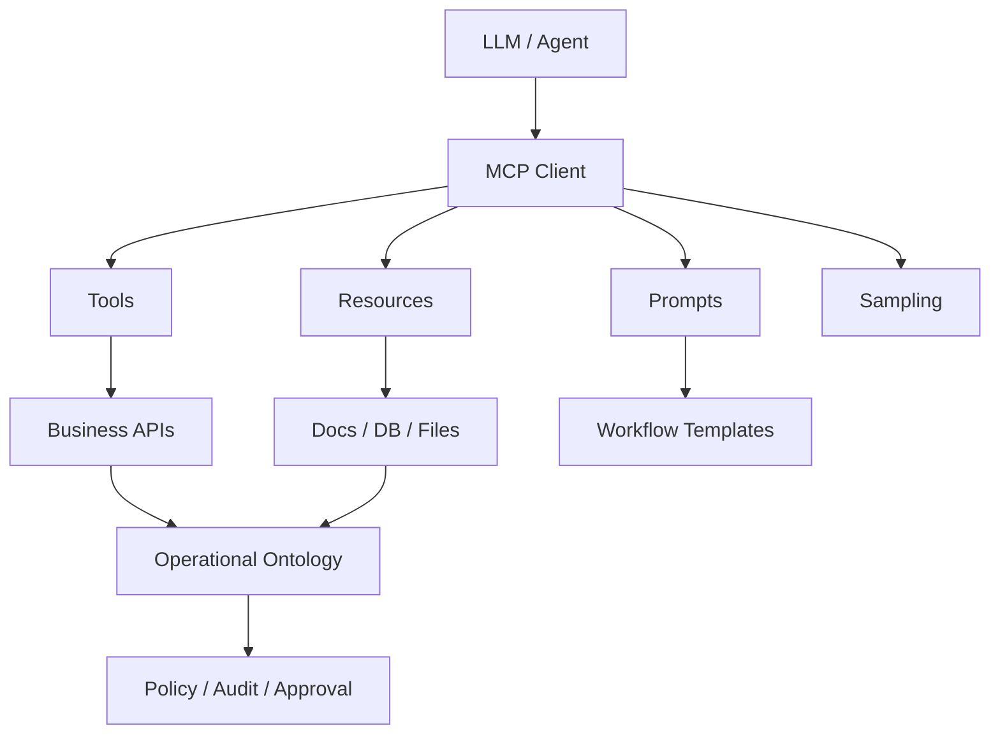

## 13. 実務導入の推奨方針

### 13.1 最初に作るべきもの

最初に作るべきものは、全社AI基盤ではなく、限定領域の「業務記憶プロジェクト」である。

導入研究としては、RAG単体、知識グラフ単体、エージェント単体を比較するのではなく、業務成果に対する寄与で評価するべきである。たとえば、技術調査なら「過去判断の再発見率」「出典付き回答率」「レビュー修正率」「古い情報の混入率」を測る。顧客対応なら「応答準備時間」「誤案内率」「承認差戻し率」を測る。障害対応なら「類似障害検索成功率」「復旧判断の根拠提示率」「事後レビューの再利用率」を測る。

候補は以下である。

1. 技術調査・設計判断の記憶
2. 顧客対応・商談準備の記憶
3. 障害対応・運用判断の記憶
4. 社内ナレッジ・FAQ・規程の検索
5. プロジェクト意思決定ログ

この中では、技術調査・設計判断が最も始めやすい。個人情報や機密リスクを制御しやすく、成果物も文書、ADR、タスク、レビューとして残しやすい。

### 13.2 最小構成

最小構成は以下でよい。

1. **Research Log**: 調査テーマ、問い、仮説、ソース、判断を残す。
2. **Decision Log / ADR**: 採用・不採用の理由を残す。
3. **Ontology Lite**: 対象、関係、状態、制約、アクションを小さく定義する。
4. **Memory Layer**: Graphitiまたは同等の temporal knowledge graph をPoCする。
5. **MCP Layer**: 文書検索、GitHub、チケット、DB、記憶ツールをMCP経由で接続する。
6. **Human Review**: 重要判断は必ず人間が承認する。

### 13.3 評価指標

導入効果は、単なる回答品質ではなく以下で測る。

1. 調査時間の短縮
2. 判断根拠の再利用率
3. 過去の意思決定の検索成功率
4. 新メンバーのオンボーディング時間
5. 誤った記憶・古い記憶の混入率
6. 人間レビューでの修正率
7. 監査可能性
8. セキュリティインシデントゼロ


## 14. 最終提言

AI活用の本質は、LLMを「知能ある人間の代用品」として扱うことではない。組織の現実を、モデルが参照し、推論し、行為し、検証できる形に変換することである。

そのための中核概念は、次の三つである。

1. **Operational Ontology**: 業務世界の対象、状態、関係、行為、権限を定義する。
2. **Temporal Memory**: 何がいつ正しく、どの根拠から得られ、いつ上書きされたかを保持する。
3. **Governed Tooling**: MCPなどを使ってAIにツールを接続しつつ、権限、承認、監査を徹底する。

GraphitiはTemporal Memoryの候補として有望であり、PalantirのOntology思想はOperational Ontologyの参照モデルになる。MCPはGoverned Toolingの標準化レイヤーとして使える。Anthropicの方向性も、この三つを統合した業務エージェントへ向かっている。

短期的には、技術調査・設計判断・ADRを対象に、MCP + 文書検索 + 小さなオントロジー + Graphiti PoCを実施するのが現実的である。中長期的には、顧客、案件、システム、意思決定、業務アクションを接続し、AIが人間と同じ業務世界モデルを参照できる状態を目指すべきである。

この提言は、LLMを過小評価しないためのものでもあり、過大評価しないためのものでもある。LLMは、言語・コード・知識断片を横断する強力な圧縮器であり、指示追従モデルとしては十分に実用的である。しかし、組織の事実、権限、責任、履歴、結果はモデル内部には存在しない。実務AIの設計は、その外側をどう構造化するかで決まる。

## 参考情報

- Palantir, "Why create an Ontology?" https://www.palantir.com/docs/foundry/ontology/why-ontology
- Palantir, "Overview - Ontology" https://www.palantir.com/docs/foundry/ontology/overview
- Palantir, "The Ontology system" https://www.palantir.com/docs/foundry/architecture-center/ontology-system
- Vaswani et al., "Attention Is All You Need" https://arxiv.org/abs/1706.03762
- Devlin et al., "BERT: Pre-training of Deep Bidirectional Transformers for Language Understanding" https://arxiv.org/abs/1810.04805
- Brown et al., "Language Models are Few-Shot Learners" https://arxiv.org/abs/2005.14165
- Ouyang et al., "Training language models to follow instructions with human feedback" https://arxiv.org/abs/2203.02155
- Bai et al., "Constitutional AI: Harmlessness from AI Feedback" https://arxiv.org/abs/2212.08073
- Bommasani et al., "On the Opportunities and Risks of Foundation Models" https://arxiv.org/abs/2108.07258
- Bender et al., "On the Dangers of Stochastic Parrots" https://dl.acm.org/doi/10.1145/3442188.3445922
- Rumelhart, Hinton, and Williams, "Learning representations by back-propagating errors" https://www.nature.com/articles/323533a0
- LeCun, Bengio, and Hinton, "Deep learning" https://www.nature.com/articles/nature14539
- Newell and Simon, "Computer Science as Empirical Inquiry: Symbols and Search" https://cacm.acm.org/research/computer-science-as-empirical-inquiry/
- McCarthy et al., "A Proposal for the Dartmouth Summer Research Project on Artificial Intelligence" https://www-formal.stanford.edu/jmc/history/dartmouth/dartmouth.html
- Harnad, "The Symbol Grounding Problem" https://www.southampton.ac.uk/~harnad/Papers/Harnad/harnad90.sgproblem.html
- Searle, "Minds, Brains, and Programs" https://www.cambridge.org/core/journals/behavioral-and-brain-sciences/article/minds-brains-and-programs/8D8E2A8A4C5A96E7C4A5385DAB3D27C1
- Clark and Chalmers, "The Extended Mind" https://academic.oup.com/analysis/article-abstract/58/1/7/153111
- Lake et al., "Building Machines That Learn and Think Like People" https://www.cambridge.org/core/product/A9535B1D745A0377E16C590E14B94993
- Gruber, "A Translation Approach to Portable Ontology Specifications" https://doi.org/10.1006/knac.1993.1008
- Berners-Lee, Hendler, and Lassila, "The Semantic Web" https://lassila.org/publications/2001/SciAm.html
- Lewis et al., "Retrieval-Augmented Generation for Knowledge-Intensive NLP Tasks" https://arxiv.org/abs/2005.11401
- Guu et al., "REALM: Retrieval-Augmented Language Model Pre-Training" https://proceedings.mlr.press/v119/guu20a.html
- Stanford AI100, "Gathering Strength, Gathering Storms" https://ai100.stanford.edu/gathering-strength-gathering-storms-one-hundred-year-study-artificial-intelligence-ai100-2021-study
- Zep / Graphiti, "Graphiti README" https://github.com/getzep/graphiti
- Rasmussen et al., "Zep: A Temporal Knowledge Graph Architecture for Agent Memory" https://arxiv.org/abs/2501.13956
- Graphiti Documentation https://help.getzep.com/graphiti/getting-started/welcome
- Anthropic, "Introducing Labs" https://www.anthropic.com/news/introducing-anthropic-labs
- Anthropic, "Claude Opus 4.6" https://www.anthropic.com/news/claude-opus-4-6
- Anthropic, "Agents for financial services" https://www.anthropic.com/news/finance-agents
- Anthropic, "Anthropic and Amazon expand collaboration for up to 5 gigawatts of new compute" https://www.anthropic.com/news/anthropic-amazon-compute
- Anthropic, "Model Context Protocol" https://docs.anthropic.com/en/docs/mcp
- Model Context Protocol, "Tools" https://modelcontextprotocol.io/specification/2025-06-18/server/tools
- Model Context Protocol, "Understanding MCP servers" https://modelcontextprotocol.io/docs/learn/server-concepts
- Model Context Protocol, "Security Best Practices" https://modelcontextprotocol.io/docs/tutorials/security/security_best_practices
- Nonaka, "A Dynamic Theory of Organizational Knowledge Creation" https://pubsonline.informs.org/doi/10.1287/orsc.5.1.14
- Nonaka and Takeuchi, "The Knowledge-Creating Company" https://academic.oup.com/book/52097
- Polanyi, "The Tacit Dimension" https://openlibrary.org/books/OL5990259M/The_tacit_dimension.
- Brown and Duguid, "Organizational Learning and Communities-of-Practice" https://pubsonline.informs.org/doi/fpi/10.1287/orsc.2.1.40
