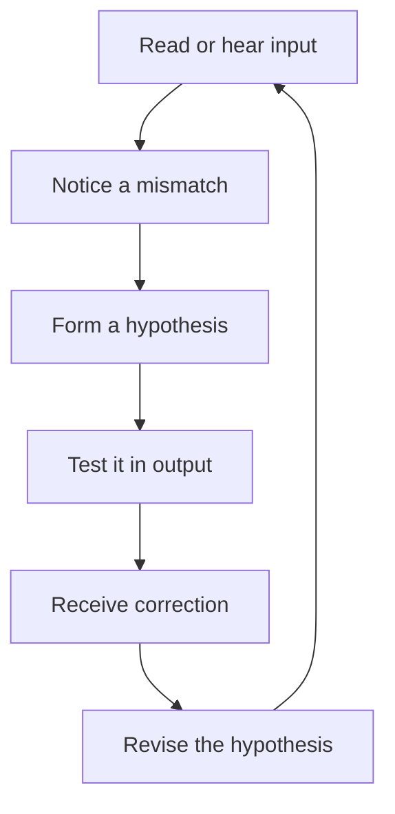

# Abduction in Second Language Learning

## 1. Executive Summary

Second language learning is not just a matter of exposure. Learners receive input, encounter unfamiliar words or structures, form a tentative explanation, test it in speech or writing, and revise it after feedback or more input. Read through Peirce's notion of abduction, this loop makes learner reasoning visible.

The main claims of this report are:

1. Peircean abduction is inference to a hypothesis that explains a surprising fact. In L2 learning, it is especially useful for guessing vocabulary meaning, hypothesizing grammar rules, and inferring pragmatic intent. <SourceNote>SEP's [Abduction](https://plato.stanford.edu/entries/abduction/) and [Peirce’s Theory of Abduction](https://plato.stanford.edu/entries/abduction/#PeiTheAbd) provide the core conceptual framing. The educational reading in this report is a practical inference from that framing.</SourceNote>
2. Vocabulary learning is the clearest abductive case: learners infer meaning from context. Grammar learning uses abductive hypotheses about structure, then deductive checking and inductive consolidation. Pragmatics depends on abductive interpretation of speaker intent. <SourceNote>Jovanovic's [Abduction and Second Language Learning](https://www.academypublication.com/issues/past/jltr/vol03/02/jltr0302.pdf) discusses meaning inference and hypothesis formation in beginners. Peirce-based abduction and SLA interaction studies together support the pragmatic reading used here.</SourceNote>
3. Deduction checks rules, induction generalizes from many examples, and abduction proposes the best explanation for limited evidence. Treating them separately helps diagnose where learners are overgeneralizing, undergeneralizing, or merely testing a rule.
4. Meaning negotiation and corrective feedback are what turn abductive guesses into learning. Clarification requests, reformulations, recasts, and explicit correction expose whether a hypothesis holds. <SourceNote>Long-style interaction theory is summarized in [Interaction and instructed second language acquisition](https://www.cambridge.org/core/journals/language-teaching/article/interaction-and-instructed-second-language-acquisition/78A156EE200F744F5978F99BFB073DBE). Grammar feedback is reviewed in [Implicit and explicit corrective feedback and the acquisition of L2 grammar](https://www.cambridge.org/core/journals/studies-in-second-language-acquisition/article/implicit-and-explicit-corrective-feedback-and-the-acquisition-of-l2-grammar/CDE67D4A4E286921DA4BE9C40BAD9FE6) and [Written corrective feedback](https://www.cambridge.org/core/books/cambridge-handbook-of-corrective-feedback-in-second-language-learning-and-teaching/written-corrective-feedback/11FC3A1C544105E3D6A3509032A72F81).</SourceNote>
5. For self-study, the useful unit is not "getting the right answer" but "forming a revisable hypothesis." Write down the guess, the evidence, the test, and the revision.

## 2. What Peirce Meant by Abduction

For Peirce, abduction is the inference that introduces a possible explanation for a surprising fact. Deduction derives implications from a rule. Induction tests a rule against examples. Abduction proposes the rule in the first place. In language learning, that is the moment of tentative understanding when a learner says, in effect, "This is probably what is going on." <SourceNote>SEP's [Abduction](https://plato.stanford.edu/entries/abduction/) and [Peirce’s Theory of Abduction](https://plato.stanford.edu/entries/abduction/#PeiTheAbd) are the cleanest public entry points. The learning-oriented reading is an inference from those sources.</SourceNote>

The point is not to guess correctly on the first try. The point is to form the most economical explanation available from limited evidence. In L2 learning, the value lies in the quality of the hypothesis and the willingness to revise it. <SourceNote>Jovanovic's [Abduction and Second Language Learning](https://www.academypublication.com/issues/past/jltr/vol03/02/jltr0302.pdf) is useful here because it connects meaning inference with learners' prior knowledge and context.</SourceNote>

## 3. Deduction, Induction, and Abduction

| Reasoning | Core question                              | Strong use case in L2 learning                           | Main weakness                              |
| --------- | ------------------------------------------ | -------------------------------------------------------- | ------------------------------------------ |
| Deduction | If the rule is true, what follows?         | Checking grammar against a known rule                    | It does not create new meaning             |
| Induction | What pattern appears across many examples? | Generalizing collocations, morphology, or word order     | It can overfit when examples are few       |
| Abduction | What best explains this surprise?          | Guessing vocabulary, diagnosing errors, inferring intent | It can produce plausible but wrong guesses |

Deduction is useful once a rule is known. Induction is useful when many examples are available. Abduction matters when evidence is partial and the learner must act before full certainty is available.

## 4. Vocabulary, Grammar, and Pragmatics

| Domain     | Role of abduction                                   | Role of induction                           | Role of deduction                               |
| ---------- | --------------------------------------------------- | ------------------------------------------- | ----------------------------------------------- |
| Vocabulary | Infer meaning from context, images, and known words | Narrow meaning from repeated usage          | Apply a dictionary definition or explicit gloss |
| Grammar    | Form a rule hypothesis from one or a few examples   | Generalize a structure across many examples | Check a sentence against a taught rule          |
| Pragmatics | Infer speaker intent, implicature, or politeness    | Learn recurrent interaction patterns        | Follow explicit conversation conventions        |

Vocabulary learning is the most obvious abductive case. A learner sees an unknown word and uses surrounding words, the flow of the sentence, topic cues, and prior knowledge to propose a meaning. Jovanovic's study supports this sort of inference in beginner learners. <SourceNote>Jovanovic, [Abduction and Second Language Learning](https://www.academypublication.com/issues/past/jltr/vol03/02/jltr0302.pdf), discusses vocabulary meaning inference and the role of cross-linguistic knowledge in beginners.</SourceNote>

Grammar learning is also abductive at the start. Learners notice a mismatch, propose a rule, and then refine it with feedback or more examples. Consolidation is inductive, and explicit checking is deductive. <SourceNote>Grammar feedback is discussed in [Implicit and explicit corrective feedback and the acquisition of L2 grammar](https://www.cambridge.org/core/journals/studies-in-second-language-acquisition/article/implicit-and-explicit-corrective-feedback-and-the-acquisition-of-l2-grammar/CDE67D4A4E286921DA4BE9C40BAD9FE6) and [Written corrective feedback](https://www.cambridge.org/core/books/cambridge-handbook-of-corrective-feedback-in-second-language-learning-and-teaching/written-corrective-feedback/11FC3A1C544105E3D6A3509032A72F81). The "first notice" framing is an instructional interpretation of that literature.</SourceNote>

Pragmatics matters because meaning often exceeds literal form. Learners have to infer whether an utterance is a request, a suggestion, irony, or something else. In that space, interaction and negotiation make the hypothesis testable. <SourceNote>[Interaction and instructed second language acquisition](https://www.cambridge.org/core/journals/language-teaching/article/interaction-and-instructed-second-language-acquisition/78A156EE200F744F5978F99BFB073DBE) summarizes the interaction hypothesis and its focus on meaning negotiation.</SourceNote>

## 5. The Input-to-Revision Loop

This is the smallest useful model of second language learning as hypothesis revision. Input does not become knowledge by itself. The learner has to notice something surprising, propose an explanation, try it out, and then revise it. <SourceNote>The loop above is a synthesis of Peircean abduction with SLA interaction and feedback research. The practical anchors are [Interaction and instructed second language acquisition](https://www.cambridge.org/core/journals/language-teaching/article/interaction-and-instructed-second-language-acquisition/78A156EE200F744F5978F99BFB073DBE) and [corrective feedback](https://www.cambridge.org/core/books/cambridge-handbook-of-corrective-feedback-in-second-language-learning-and-teaching/written-corrective-feedback/11FC3A1C544105E3D6A3509032A72F81).</SourceNote>

Meaning negotiation makes the loop visible. A partner asks for clarification, rephrases, gives a recast, or corrects a form. That reaction tells the learner whether the hypothesis was useful or mistaken.

## 6. Practical Study Method

1. Make one hypothesis per session. Separate vocabulary, grammar, and pragmatics instead of trying to guess everything at once.
2. Write down the evidence. Note which words, which context, which prior knowledge, and which analogy led to the guess.
3. Test quickly. Use a dictionary, a search for more examples, speaking, writing, or a partner check.
4. Treat errors as data. Record why the wrong guess was still plausible.
5. Write the revised rule in one sentence so that you can reuse it later.
6. Revisit it after a delay. The goal is to reduce recurring mistakes, not to win the first guess.

The practical goal is not intuition for its own sake. It is a habit of forming hypotheses that can be revised.

## 7. Limits and Risks

First, abduction depends on prior knowledge. If the learner has too little context, there is nothing useful to infer from. Jovanovic's study points in that direction: even beginner inference relies on what the learner already knows. <SourceNote>Jovanovic's [Abduction and Second Language Learning](https://www.academypublication.com/issues/past/jltr/vol03/02/jltr0302.pdf) suggests that context and existing knowledge shape whether inference succeeds. The "too little context" statement is an applied interpretation of that result.</SourceNote>

Second, plausible wrong guesses can fossilize if they are never checked. That is why feedback matters. Correction is not just about marking something wrong; it is about forcing the learner's hypothesis to face evidence from outside the learner's head. <SourceNote>See [Implicit and explicit corrective feedback and the acquisition of L2 grammar](https://www.cambridge.org/core/journals/studies-in-second-language-acquisition/article/implicit-and-explicit-corrective-feedback-and-the-acquisition-of-l2-grammar/CDE67D4A4E286921DA4BE9C40BAD9FE6) and [Written corrective feedback](https://www.cambridge.org/core/books/cambridge-handbook-of-corrective-feedback-in-second-language-learning-and-teaching/written-corrective-feedback/11FC3A1C544105E3D6A3509032A72F81).</SourceNote>

Third, meaning negotiation is not always sufficient. A learner may not yet have enough language to understand the correction, or may already know the answer and not need the cue. Abduction works best when the input is slightly above current certainty but still close enough to test.

## 8. Conclusion

Reading second language learning through abduction shifts the focus from passive exposure to active hypothesis work. Vocabulary, grammar, and pragmatics each involve different mixes of abduction, induction, and deduction, but the common pattern is the same: notice, guess, test, revise.

That framing gives learners a practical habit: do not only track what you learned, track how you inferred it and how you corrected it. In that sense, language learning becomes a disciplined form of reasoning. <SourceNote>This conclusion synthesizes Peircean abduction, Jovanovic's vocabulary inference work, interaction theory, and corrective feedback research. The main entry points are [SEP: Abduction](https://plato.stanford.edu/entries/abduction/), [Abduction and Second Language Learning](https://www.academypublication.com/issues/past/jltr/vol03/02/jltr0302.pdf), and [Interaction and instructed second language acquisition](https://www.cambridge.org/core/journals/language-teaching/article/interaction-and-instructed-second-language-acquisition/78A156EE200F744F5978F99BFB073DBE).</SourceNote>
