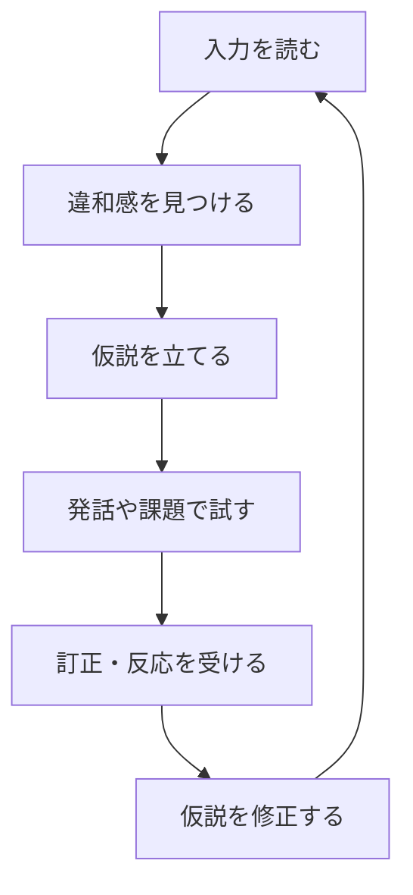

# 第二言語学習におけるアブダクション理論

## 1. エグゼクティブサマリー

第二言語学習は、単に「たくさん触れれば身につく」過程ではない。学習者は入力を受け取り、未知の語や構文に遭遇し、いったんもっともらしい仮説を立て、発話や課題遂行で試し、フィードバックや再入力で更新する。この循環を、Peirce の意味でのアブダクションとして読むと、学習者がどの時点で何を推論しているかが見えやすくなる。

本稿の要点は次の通りである。

1. Peirce のアブダクションは、驚くべき事実を説明する仮説を立てる推論であり、演繹や帰納とは役割が異なる。第二言語学習では、未知語の意味推測、文法規則の暫定化、語用論的意図の解釈に特に効く。<SourceNote>Peirce の abduction は Stanford Encyclopedia of Philosophy の [Peirce’s Theory of Abduction](https://plato.stanford.edu/entries/abduction/#PeiTheAbd) と [The Logic of Abduction](https://plato.stanford.edu/entries/abduction/) に整理がある。ここでの教育・言語学習への読み替えは、その概念整理を踏まえた学習設計上の推定である。</SourceNote>
2. 語彙学習では、アブダクションは「文脈から意味を当てる」推論として働く。文法学習では、少数の例と誤り訂正から規則を仮説化する。語用論では、発話の字義と話し手意図のずれを埋めるために働く。<SourceNote>語彙の推測と仮説形成は Jovanovic の [Abduction and Second Language Learning](https://www.academypublication.com/issues/past/jltr/vol03/02/jltr0302.pdf) が、意味推測と既有知識の相互作用を扱う。語用論的解釈としての abduction は Peirce 系の abduction 解説と、会話での意味交渉を扱う SLA 文献を合わせると理解しやすい。</SourceNote>
3. 帰納は「多くの例から共通性を抜く」こと、演繹は「既知の規則を適用して整合性を確かめる」こと、アブダクションは「もっとも説明力の高い仮説を置く」ことである。学習実践では、この三つを切り分けると、どこで学習者が早合点しているか、どこで規則が定着していないかを診断しやすい。
4. 意味交渉と誤り修正は、アブダクションを学習として成立させる装置である。理解不能な入力を放置すると仮説は更新されないが、確認要求、言い換え、再発話、明示訂正があると仮説の当たり外れが検証される。<SourceNote>意味交渉は Long 系の interaction hypothesis を概説する [Interaction and instructed second language acquisition](https://www.cambridge.org/core/journals/language-teaching/article/interaction-and-instructed-second-language-acquisition/78A156EE200F744F5978F99BFB073DBE) が要点をまとめる。誤り訂正は、[Implicit and explicit corrective feedback and the acquisition of L2 grammar](https://www.cambridge.org/core/journals/studies-in-second-language-acquisition/article/implicit-and-explicit-corrective-feedback-and-the-acquisition-of-l2-grammar/CDE67D4A4E286921DA4BE9C40BAD9FE6) と、[Written corrective feedback](https://www.cambridge.org/core/books/cambridge-handbook-of-corrective-feedback-in-second-language-learning-and-teaching/written-corrective-feedback/11FC3A1C544105E3D6A3509032A72F81) が実務に近い。</SourceNote>
5. 実践では、1回の学習で扱う仮説を小さくし、仮説の根拠、検証方法、修正後のルールを明示的に残すのがよい。アブダクションを「当てる力」ではなく「更新可能な仮説を作る力」として扱うと、独学でも再現性が上がる。

## 2. パースのアブダクションとは何か

Peirce にとってアブダクションは、驚くべき事実に対して説明仮説を立てる推論である。演繹は既知の規則から結論を導く。帰納は観察された例から規則の妥当性を高める。アブダクションはそのどちらでもなく、「この現象を一番うまく説明する仮説は何か」を置く段階である。学習の文脈では、これは新しい言語表現に出会った瞬間の「暫定理解」に相当する。<SourceNote>Peirce の abduction は [SEP: Peirce’s Theory of Abduction](https://plato.stanford.edu/entries/abduction/#PeiTheAbd) と [SEP: Abduction](https://plato.stanford.edu/entries/abduction/) が整理している。ここでの学習への読み替えは、公表理論からの推定である。</SourceNote>

重要なのは、アブダクションが「正しい答えを一発で当てること」ではない点である。むしろ、手元の証拠に対して最小限の説明を与える仮説を作ることに価値がある。第二言語学習では、まだ十分な知識がない段階ほど、正解そのものより「仮説の質」が学習の進み方を左右する。<SourceNote>Jovanovic の [Abduction and Second Language Learning](https://www.academypublication.com/issues/past/jltr/vol03/02/jltr0302.pdf) は、初心者学習者が未知語の意味を文脈や既有知識から推測する過程を扱う。ここでの「仮説の質」という表現は、同論文と Peirce 系文献を合わせた学習設計上の解釈である。</SourceNote>

## 3. 帰納・演繹・アブダクションの違い

三つの推論は、学習場面での使いどころが少しずつ違う。

| 推論           | 典型的な問い                           | 第二言語学習で強い場面                   | 弱点                             |
| -------------- | -------------------------------------- | ---------------------------------------- | -------------------------------- |
| 演繹           | ルールが正しければ、この文はどうなるか | 既習文法の適用、例文の整合確認           | 新しい意味を生み出しにくい       |
| 帰納           | 多くの例に共通する規則は何か           | 頻出表現、語形変化、語順パターンの一般化 | 例が少ないと過学習しやすい       |
| アブダクション | この驚きは何で説明できるか             | 未知語の意味、誤りの原因、意図の解釈     | もっともらしい誤推測を作りやすい |

演繹は、学習済みの規則を使うときに便利である。たとえば、現在完了のルールを知っていれば、例文がその規則に合うかを確認できる。帰納は、多数の例を見て共通性を抽出するときに向く。語彙のコロケーションや形態変化の学習は、この側面が強い。アブダクションは、例が少ない、あるいは情報が不完全な場面で、いったん説明仮説を置くときに働く。<SourceNote>語彙・意味推測に関する abduction の位置づけは Jovanovic の [Abduction and Second Language Learning](https://www.academypublication.com/issues/past/jltr/vol03/02/jltr0302.pdf) が参考になる。誤り訂正と文法学習では、[corrective feedback のレビュー](https://www.cambridge.org/core/books/cambridge-handbook-of-corrective-feedback-in-second-language-learning-and-teaching/written-corrective-feedback/11FC3A1C544105E3D6A3509032A72F81) と [implicit/explicit feedback の研究](https://www.cambridge.org/core/journals/studies-in-second-language-acquisition/article/implicit-and-explicit-corrective-feedback-and-the-acquisition-of-l2-grammar/CDE67D4A4E286921DA4BE9C40BAD9FE6) が役立つ。</SourceNote>

## 4. 語彙・文法・語用論で何が違うのか

| 領域   | アブダクションの役割                 | 帰納の役割                           | 演繹の役割                       |
| ------ | ------------------------------------ | ------------------------------------ | -------------------------------- |
| 語彙   | 文脈、画像、既知語から意味を推測する | 複数の使用例から意味の幅を絞る       | 辞書定義や明示説明を適用する     |
| 文法   | 1つか少数の例から規則の仮説を立てる  | 多数の例から統語パターンを一般化する | 規則を例文に当てて誤りを検出する |
| 語用論 | 発話意図、婉曲表現、含みを推測する   | 会話経験から定型のやり取りを学ぶ     | 明示された会話ルールや役割に従う |

語彙学習では、アブダクションは最も分かりやすい。知らない単語が出たとき、学習者は周辺の語、文の流れ、画像、話題から「おそらくこういう意味だろう」と仮説を立てる。Jovanovic の研究は、初心者学習者でも既有知識や母語の手がかりを使って意味推測を行うことを示している。<SourceNote>Jovanovic, [Abduction and Second Language Learning](https://www.academypublication.com/issues/past/jltr/vol03/02/jltr0302.pdf) は、初級学習者の意味推測が、文脈と既有知識に支えられることを論じる。ここでの「母語の手がかり」は、同論文が扱う cross-linguistic influence を指す。</SourceNote>

文法学習では、アブダクションは「今見た誤りは、どの規則で説明できるか」という形で働く。学習者はたとえば動詞形や語順の違和感に気づき、仮説を立てる。その後、明示的な説明や訂正で規則を修正する。文法の定着は帰納と演繹の両方が必要だが、最初の気づきはアブダクションに近い。<SourceNote>文法習得における feedback の役割は [Implicit and explicit corrective feedback and the acquisition of L2 grammar](https://www.cambridge.org/core/journals/studies-in-second-language-acquisition/article/implicit-and-explicit-corrective-feedback-and-the-acquisition-of-l2-grammar/CDE67D4A4E286921DA4BE9C40BAD9FE6) と、[Written corrective feedback](https://www.cambridge.org/core/books/cambridge-handbook-of-corrective-feedback-in-second-language-learning-and-teaching/written-corrective-feedback/11FC3A1C544105E3D6A3509032A72F81) が学習設計の入口として有効である。ここでの「最初の気づき」は、公表研究を踏まえた学習設計上の解釈である。</SourceNote>

語用論では、アブダクションはさらに重要になる。話し手が直接言っていないこと、婉曲的に示したこと、場面依存の含みは、字義だけでは取れない。学習者は、文法が合っているかだけでなく、「この発話は依頼なのか、提案なのか、皮肉なのか」を推測しなければならない。ここでは、意味交渉が起きると仮説の更新が速くなる。<SourceNote>Long 系の interaction hypothesis は [Interaction and instructed second language acquisition](https://www.cambridge.org/core/journals/language-teaching/article/interaction-and-instructed-second-language-acquisition/78A156EE200F744F5978F99BFB073DBE) に要点がある。語用論的な意味推測は、Peirce 系の abduction 解説を会話の意味交渉に読み替えた公表情報からの推定である。</SourceNote>

## 5. 入力から仮説更新までの流れ

この循環は、第二言語学習を「入力の蓄積」ではなく「仮説の反復更新」として理解するための最小モデルである。入力はそのまま知識にならない。まず、学習者は違和感や不一致を見つける必要がある。次に、何が起きているのかについて暫定仮説を立てる。最後に、発話、作文、復唱、確認質問などで試し、反応によって修正する。<SourceNote>この流れは Peirce の abduction と、SLA の interaction / corrective feedback 文献をつないだ公表情報からの推定である。学習者が仮説を明示的に更新する枠組みとしては、[Interaction and instructed second language acquisition](https://www.cambridge.org/core/journals/language-teaching/article/interaction-and-instructed-second-language-acquisition/78A156EE200F744F5978F99BFB073DBE) と [corrective feedback の研究](https://www.cambridge.org/core/books/cambridge-handbook-of-corrective-feedback-in-second-language-learning-and-teaching/written-corrective-feedback/11FC3A1C544105E3D6A3509032A72F81) が実用的である。</SourceNote>

意味交渉の実例では、相手が聞き返す、言い換える、例を足す、発音や語形を訂正する、といった動きが入る。この反応は、学習者の仮説が当たっていたか外れていたかを露出させる。したがって、意味交渉は単なる会話上の妥協ではなく、アブダクションの検証装置として働く。

## 6. 実践に落とす手順

第二言語学習をアブダクションとして設計するなら、次の手順が扱いやすい。

1. 1回の学習につき、仮説は1つだけ立てる。未知語、文法、語用論のうち、どれを推測しているのかを分ける。
2. 仮説の根拠をメモする。どの語、どの文脈、どの母語知識、どの類推が効いたかを残す。
3. すぐ検証する。辞書、例文検索、音読、会話、書き換えのどれかで仮説を試す。
4. 反証を歓迎する。間違いを見つけたら、正解よりも「なぜその仮説がもっともらしかったか」を書く。
5. 修正後のルールを短文で書く。「この表現は X ではなく Y で使う」のように、次回の参照点を残す。
6. 反復する。仮説・検証・修正を間隔をあけて再訪し、例外を減らす。

この手順の狙いは、当て勘を鍛えることではない。むしろ、学習者が自分の誤推測を可視化し、同じ誤りを再利用しないようにすることにある。アブダクションは、当たるまで試す推測ゲームではなく、外れを学習資産に変えるための形式である。

## 7. 限界と注意点

第一に、アブダクションは背景知識を必要とする。知識が少なすぎると、仮説そのものが立たない。語彙の文脈推測が成立するのは、周辺の手がかりを読むための最低限の知識があるからである。<SourceNote>Jovanovic の [Abduction and Second Language Learning](https://www.academypublication.com/issues/past/jltr/vol03/02/jltr0302.pdf) は、初心者でも推測は行うが、その成功は既有知識に依存することを示唆する。ここでの「最低限の知識」は、その研究を踏まえた学習設計上の推定である。</SourceNote>

第二に、もっともらしい誤推測が固定化すると、いわゆる fossilization の入り口になる。特に独学では、検証せずに「意味が通ったから正しい」と思い込みやすい。誤り訂正が重要なのは、仮説の妥当性を外部からずらしてくれるからである。<SourceNote>corrective feedback の意義は [Implicit and explicit corrective feedback and the acquisition of L2 grammar](https://www.cambridge.org/core/journals/studies-in-second-language-acquisition/article/implicit-and-explicit-corrective-feedback-and-the-acquisition-of-l2-grammar/CDE67D4A4E286921DA4BE9C40BAD9FE6) と [Written corrective feedback](https://www.cambridge.org/core/books/cambridge-handbook-of-corrective-feedback-in-second-language-learning-and-teaching/written-corrective-feedback/11FC3A1C544105E3D6A3509032A72F81) が補強する。</SourceNote>

第三に、意味交渉は万能ではない。学習者が未熟すぎると、修正の内容を理解できないことがあるし、逆に熟達しすぎると、相手の修正をすでに知っているため学習効率が下がることもある。アブダクションは、常に最適というより、適切な情報量と適切なフィードバックがあるときに機能する。

## 8. まとめ

第二言語学習をアブダクションで見る利点は、学習者を「受け身の入力処理装置」ではなく、「仮説を作って更新する推論主体」として扱えることにある。語彙では意味推測、文法では規則仮説、語用論では意図推定が前面に出る。そこに意味交渉と誤り修正が入ると、仮説はより速く、より安全に更新される。

学習記録としては、学習者は「何を覚えたか」だけでなく、「何をどう推測し、何で検証し、どう直したか」を記録するとよい。これができると、第二言語学習は単なる反復ではなく、検証可能な推論の訓練になる。<SourceNote>本稿の結論は、Peirce の abduction、Jovanovic の語彙推測研究、interaction hypothesis、corrective feedback 研究を統合した公表情報からの推定である。主要な入口は [SEP: Abduction](https://plato.stanford.edu/entries/abduction/)、[Abduction and Second Language Learning](https://www.academypublication.com/issues/past/jltr/vol03/02/jltr0302.pdf)、[Interaction and instructed second language acquisition](https://www.cambridge.org/core/journals/language-teaching/article/interaction-and-instructed-second-language-acquisition/78A156EE200F744F5978F99BFB073DBE) である。</SourceNote>
