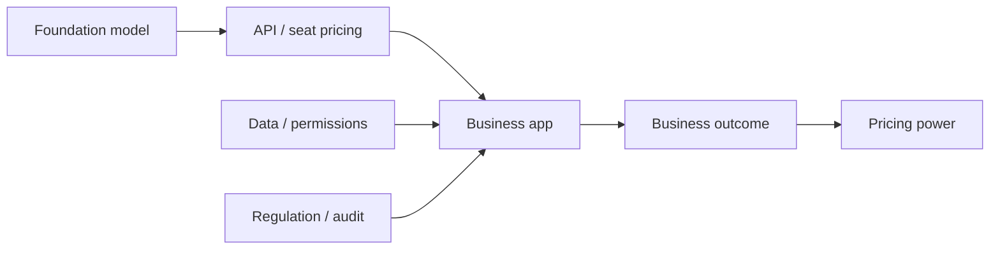

## 1. Executive Summary

The generative AI application layer is more likely to capture value when the company owns workflow context, permissions, data, and distribution, not when it only sells model access. Model companies monetize inference through APIs and seat plans, while application companies monetize business outcomes, retention, managed data, and approval flows. <SourceNote>OpenAI's API Pricing is token-based, and ChatGPT is offered as separate Business and Enterprise plans [OpenAI API Pricing](https://openai.com/api/pricing/) [OpenAI ChatGPT Pricing](https://openai.com/chatgpt/pricing/). Anthropic also separates Pro / Max / Team plans from API access [Anthropic Pricing](https://www.anthropic.com/pricing).</SourceNote>

For investors, the near-term profit pools are more likely to sit in horizontal workflow layers such as business automation, developer tools, and CRM. Regulated sectors such as healthcare, finance, and legal are harder to enter, but once they are won, the installed base tends to be stickier and the pricing can be higher. Ads and education are large markets, but monetization is constrained by privacy, distribution, procurement, and willingness to pay.

Three conclusions matter most.

1. Generative AI has very different economics at the foundation-model layer and the application layer.
2. Incumbent SaaS vendors gain pricing power when AI is attached to a system of record, a workflow, an approval path, or an audit trail.
3. Among sectors, developer tools and CRM are the clearest early wins, followed by business automation and then regulated vertical workflows in finance, healthcare, and legal.

The diagram shows that value capture does not depend on model intelligence alone. If context, data, permissions, and audit are weak, AI becomes a polished feature with weak economics. If AI is embedded in the workflow, pricing can expand from seats to usage, actions, and outcome-linked billing.

## 2. Revenue Structure: Model Companies vs Application Companies

Foundation-model companies usually monetize through inference usage, developer APIs, enterprise seats, and premium plans. Application companies usually monetize through existing seats, add-ons, workflow usage, feature bundles, or outcome-adjacent billing. Public pricing already shows a hybrid pattern: even pure model vendors now combine usage-based access with subscription plans. <SourceNote>OpenAI publishes token-based API prices and separates Plus / Pro / Business / Enterprise plans in ChatGPT [OpenAI API Pricing](https://openai.com/api/pricing/) [OpenAI ChatGPT Pricing](https://openai.com/chatgpt/pricing/). Anthropic likewise offers Pro / Max / Team / Enterprise alongside API access [Anthropic Pricing](https://www.anthropic.com/pricing).</SourceNote>

That difference matters for valuation. Foundation-model businesses have a wide market, but their differentiation is thinner and their margins are more exposed to inference costs and price competition. Application businesses may look narrower, but if they sit inside the workflow, manage permissions, and connect to the records system, they can defend gross margin and retention much more easily. The real question is not who gets the model call fee. It is who owns the front door of work and the origin of the invoice.

Incumbent SaaS vendors gain AI pricing power only when four conditions are met.

1. The AI is inside an existing system of record.
2. The output triggers a decision, an approval, an update, or a distribution event.
3. Customers are reluctant to give up a learned workflow.
4. The vendor can charge by seat, usage, or action.

Microsoft 365 Copilot and Salesforce Agentforce are useful examples. Microsoft positions Copilot as an add-on to commercial plans, while Salesforce offers Flex Credits, Conversation, and per-user licensing. The implication is simple: AI can be a free feature in some cases, but when it is deeply embedded in workflow it becomes an upcharge product. <SourceNote>Microsoft 365 Copilot pricing describes an add-on seat model and the treatment of Copilot Chat, while Salesforce Agentforce shows multiple charging models [Microsoft 365 Copilot Pricing](https://www.microsoft.com/en-us/microsoft-365/copilot/pricing) [Agentforce Pricing](https://www.salesforce.com/agentforce/pricing/).</SourceNote>

## 3. Sector Comparison

The table below is a synthesis from public information. It compares sectors on regulation, data advantage, switching costs, and the likely billing unit. The regulatory baseline comes from NIST AI RMF, FDA guidance on AI/ML software, HHS HIPAA de-identification guidance, FERPA, Federal Reserve SR 11-7, and ABA Formal Opinion 512. <SourceNote>NIST AI RMF frames AI risk management as Govern / Map / Measure / Manage, FDA discusses AI/ML medical software risk and change management, and HHS explains HIPAA de-identification [NIST AI RMF](https://www.nist.gov/itl/ai-risk-management-framework) [FDA AI/ML Software as a Medical Device](https://www.fda.gov/medical-devices/software-medical-device-samd/artificial-intelligence-and-machine-learning-software-medical-device) [HHS HIPAA De-identification](https://www.hhs.gov/hipaa/for-professionals/privacy/special-topics/de-identification/index.html). FERPA constrains student records, SR 11-7 governs model risk in finance, and ABA Formal Opinion 512 covers lawyer responsibility when using generative AI [FERPA](https://studentprivacy.ed.gov/ferpa) [SR 11-7](https://www.federalreserve.gov/supervisionreg/srletters/sr1107.htm) [ABA Formal Opinion 512](https://www.americanbar.org/groups/professional_responsibility/publications/ethics_opinions/2024/formal-opinion-512/).</SourceNote>

| Sector | Core demand | Entry barrier | Data advantage | Switching cost | Pricing shape | Investment view |
| --- | --- | --- | --- | --- | --- | --- |
| Business automation | Internal workflows, tickets, documents | Medium | Medium | Medium | Seat + usage | Broad, but feature competition is fast |
| Developer tools | Code generation, review, tests, repair | Medium | High | High | Seat + usage | Easy to measure and sticky when embedded |
| CRM | Sales, CS, pipeline, renewal workflows | Medium-high | High | Very high | Premium tier + add-ons | The clearest incumbent upsell path |
| Ads | Targeting, measurement, optimization | High | High | High | Outcome-linked + data integration | Strong if the vendor owns data and distribution |
| Education | Teaching prep, tutoring, admin | High | Medium | Medium | Low-price seat | Socially important, but monetization is slower |
| Healthcare | Documentation, triage, operations | Very high | High | Very high | Facility + workflow pricing | Valuable, but validation is heavy |
| Legal | Research, drafting, review, e-discovery | High | High | High | Seat + document pricing | High willingness to pay, but accountability matters |
| Finance | AML, KYC, risk, compliance, service | Very high | High | Very high | Seat + throughput pricing | High ACV, but model-risk governance is decisive |

### 3.1 Business Automation

Business automation is the broadest horizontal category. It can sit across finance, procurement, support, operations, and administration. But generic chat features do not create durable value by themselves. The value appears when permissions, approvals, exceptions, and audit are embedded in the workflow. That makes repeated work such as form filling, ticket routing, approval forwarding, and standard document generation the most investable use cases.

### 3.2 Developer Tools

Developer tools are one of the easiest AI application themes to measure. Code changes, tests, reviews, and fixes provide clear feedback loops. The deeper the integration with the development stack, the higher the switching cost. As model differences compress, the decisive layer moves to the editor, repository, CI system, permissions, and agent runtime.

### 3.3 CRM

CRM is one of the clearest places where generative AI can gain pricing power. Customer records, sales history, renewal probability, support history, and workflow are already in one system, so AI suggestions can translate directly into the next action. Established platforms such as Salesforce can therefore sell AI as an upsell or an add-on instead of as a separate product. In CRM, record consistency and execution paths matter more than model cleverness. <SourceNote>Salesforce Agentforce pricing and Microsoft 365 Copilot pricing both show that AI can be monetized as an add-on to an installed base [Agentforce Pricing](https://www.salesforce.com/agentforce/pricing/) [Microsoft 365 Copilot Pricing](https://www.microsoft.com/en-us/microsoft-365/copilot/pricing).</SourceNote>

### 3.4 Ads

Ads can benefit enormously from generative AI, but the market is winner-take-most. Measurement, delivery, creative production, bidding, and conversion prediction all need some form of data advantage, while privacy and browser constraints keep changing the rules. Google Ads Data Hub is a good example of a market that is moving toward first-party data and privacy-constrained measurement. <SourceNote>Google Ads Data Hub is built around first-party data activation and policy-constrained measurement, which shows why adtech economics are increasingly about data handling, not just model quality [Ads Data Hub](https://support.google.com/ads-data-hub/answer/2921213?hl=en) [Google Ads policy on data use](https://support.google.com/adspolicy/answer/6242605?hl=en).</SourceNote>

### 3.5 Education

Education has high social importance but weaker willingness to pay and slower procurement cycles. Student data, age restrictions, parental consent, and public-sector purchasing all matter. The most realistic entry path is often administrative support or institution-level tutoring rather than direct consumer chat products. AI value exists here, but monetization is structurally slower.

### 3.6 Healthcare

Healthcare can produce some of the highest operational gains, but it is also one of the heaviest validation environments. HIPAA, de-identification, medical-software change control, hospital governance, and patient safety all matter. That is why the first large-value use cases tend to be documentation, admin, triage, scheduling, billing, and information retrieval rather than diagnosis replacement. The strongest companies are usually the ones that own the workflow, not just the data. <SourceNote>HHS HIPAA de-identification and FDA AI/ML software guidance show why healthcare AI requires data control, change control, and explainability [HHS HIPAA De-identification](https://www.hhs.gov/hipaa/for-professionals/privacy/special-topics/de-identification/index.html) [FDA AI/ML Software as a Medical Device](https://www.fda.gov/medical-devices/software-medical-device-samd/artificial-intelligence-and-machine-learning-software-medical-device).</SourceNote>

### 3.7 Legal

Legal is a high-value AI market, but one that demands responsibility by design. Research, contract review, clause comparison, e-discovery, and draft generation are all automatable, but the responsibility for the final decision remains with the lawyer. Strong products therefore need sources, citations, versioning, and logs, not just generated text. In legal AI, the product is judged by evidence quality as much as by prose quality. <SourceNote>ABA Formal Opinion 512 explains the obligations lawyers face when using generative AI, including confidentiality, supervision, and accountability [ABA Formal Opinion 512](https://www.americanbar.org/groups/professional_responsibility/publications/ethics_opinions/2024/formal-opinion-512/).</SourceNote>

### 3.8 Finance

Finance is one of the best commercial opportunities for AI and one of the hardest execution environments. KYC, AML, fraud detection, underwriting, sales support, risk reporting, and compliance all justify high ACV, but they also require model-risk management, audit trails, explainability, and data governance. In finance, the value is not speed by itself. The value is speed with controlled failure modes. <SourceNote>Federal Reserve SR 11-7 sets out model risk management expectations and makes clear that financial institutions must validate, supervise, and document model use [SR 11-7](https://www.federalreserve.gov/supervisionreg/srletters/sr1107.htm).</SourceNote>

## 4. Marketing Segmentation Table

This table is a practical segmentation tool for investors and business development teams. Before estimating TAM, you need to know who buys, what budget the product connects to, and where churn is likely to happen.

| Segment | Main buyer | Typical reason to buy | Best sales message | Initial barrier | Retention driver |
| --- | --- | --- | --- | --- | --- |
| AI-native engineering teams | CTO, productivity lead | Reduce PR cycle time and fix rate | Fewer reviews and faster test repair | Strong technical evaluation | Deep repo and CI integration |
| CRM-heavy sales teams | VP Sales, RevOps | Raise renewals and next-step quality | Recommend the next action automatically | Data hygiene and permission design | Unified customer record |
| Back-office automation | CFO, ops center | Reduce repetitive work | Shorten processes including exceptions | Complex exception handling | Embedded approval flow |
| Regulated operations | Risk, audit, legal, quality | Need auditable automation | Automate while preserving logs and evidence | Heavy internal review | Proof and responsibility split |
| Ads and marketing operations | CMO, growth, measurement lead | Improve targeting and measurement | Use first-party data to improve outcomes | Privacy constraints | Connected delivery and measurement |
| Public and healthcare institutions | CIO, admin, quality | Reduce admin load and wait time | Safe operational assistance | Procurement and audit friction | Operational standardization |

The main lesson is that the market is not defined by industry name alone. A CRM tool for sales and a CRM tool for legal review need different data, metrics, sales cycles, and accountability structures. In practice, the best market cut is the budget line, not the industry label.

## 5. Risks and Limits

First, as model differences narrow, the real differentiator moves to workflow design and data connections. AI features that look similar on the surface are easy to copy, so a thin chat UI is rarely enough on its own.

Second, in regulated sectors, a successful pilot is not the same thing as a successful rollout. Healthcare, finance, education, and legal all require approvals, audit, legal review, and responsibility design before the product can scale.

Third, data advantage is not permanent. In ads, even a first-party-data strategy can lose its edge if platform rules or measurement constraints change. <SourceNote>Google's ads-related documentation shows why first-party data and policy-constrained data use are central to the adtech stack [Ads Data Hub](https://support.google.com/ads-data-hub/answer/2921213?hl=en) [Google Ads policy on data use](https://support.google.com/adspolicy/answer/6242605?hl=en).</SourceNote>

Fourth, AI responsibility ultimately stays with the user organization. NIST AI RMF makes clear that AI risk management is continuous, and finance regulation shows that model governance is not optional. <SourceNote>NIST AI RMF and SR 11-7 both show that AI cannot be treated as a one-time deployment problem [NIST AI RMF](https://www.nist.gov/itl/ai-risk-management-framework) [SR 11-7](https://www.federalreserve.gov/supervisionreg/srletters/sr1107.htm).</SourceNote>

## 6. Extrapolation from Public Information

There is no official roadmap here, so the following is an extrapolation from public information. Based on current pricing and product packaging, the likely value capture order looks like this.

1. AI extensions for incumbent SaaS that already own the workflow.
2. Developer tools with frequent usage and easy-to-measure ROI.
3. CRM, customer service, and sales automation where seats and outcomes can both be monetized.
4. Finance, healthcare, and legal, where unit economics can be excellent but validation costs are heavy.
5. Ads, where data advantage is strong but platform changes can move the goalposts.
6. Education, where the social need is large but payment ability and procurement are constrained.

This order is not the same as market size. It is more about whether the product can attach to an existing budget, convert AI into seat or usage pricing, and build switching costs. <SourceNote>OpenAI, Anthropic, Microsoft, and Salesforce all show that AI pricing now extends across seat pricing, usage pricing, and outcome-adjacent pricing [OpenAI ChatGPT Pricing](https://openai.com/chatgpt/pricing/) [Anthropic Pricing](https://www.anthropic.com/pricing) [Microsoft 365 Copilot Pricing](https://www.microsoft.com/en-us/microsoft-365/copilot/pricing) [Agentforce Pricing](https://www.salesforce.com/agentforce/pricing/).</SourceNote>

## 7. Recommended Policy

For investors, the important question is not which model is strongest. It is which business can charge for a workflow, from which budget, and in what recurring form. When evaluating the application layer, these five questions are practical.

1. Does the product enter an existing workflow?
2. Is it connected to customer data, permissions, and audit?
3. Can it charge by outcome or by seat, not only by usage?
4. Would the customer lose operational knowledge, not just data, if it churned?
5. Will the margin survive model price compression and regulatory change?

The short-term themes are likely to remain horizontal workflow layers and CRM. In the medium term, regulated sectors such as healthcare, finance, and legal can produce strong stickiness for the companies that can actually execute. In the long term, the winners are likely to be the companies that control data, permissions, distribution, and audit more than the model itself.

## References

- [OpenAI API Pricing](https://openai.com/api/pricing/)
- [OpenAI ChatGPT Pricing](https://openai.com/chatgpt/pricing/)
- [Anthropic Pricing](https://www.anthropic.com/pricing)
- [Microsoft 365 Copilot Pricing](https://www.microsoft.com/en-us/microsoft-365/copilot/pricing)
- [Agentforce Pricing](https://www.salesforce.com/agentforce/pricing/)
- [NIST AI RMF](https://www.nist.gov/itl/ai-risk-management-framework)
- [FDA AI/ML Software as a Medical Device](https://www.fda.gov/medical-devices/software-medical-device-samd/artificial-intelligence-and-machine-learning-software-medical-device)
- [HHS HIPAA De-identification](https://www.hhs.gov/hipaa/for-professionals/privacy/special-topics/de-identification/index.html)
- [FERPA](https://studentprivacy.ed.gov/ferpa)
- [SR 11-7](https://www.federalreserve.gov/supervisionreg/srletters/sr1107.htm)
- [ABA Formal Opinion 512](https://www.americanbar.org/groups/professional_responsibility/publications/ethics_opinions/2024/formal-opinion-512/)
