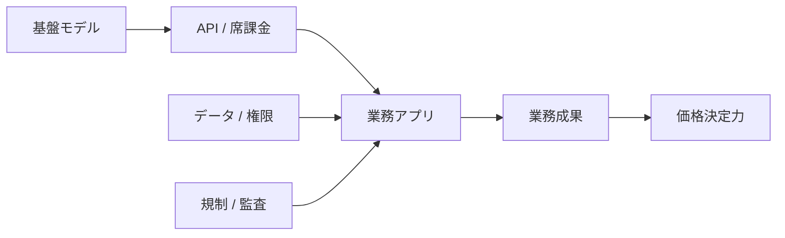

## 1. エグゼクティブサマリー

生成AIのアプリケーション層で価値が残りやすいのは、モデルを単体で売る企業ではなく、既存業務の文脈、権限、データ、配布経路を押さえる企業である。モデル企業は推論能力そのものをAPIや席課金で売るが、アプリ企業は業務成果、継続利用、管理対象データ、承認フローを収益化する。<SourceNote>OpenAI は API Pricing をトークン従量課金で公開し、ChatGPT は Business / Enterprise を別プランで提供している [OpenAI API Pricing](https://openai.com/api/pricing/) [OpenAI ChatGPT Pricing](https://openai.com/chatgpt/pricing/)。Anthropic も Pro / Max / Team と API を別建てで提供している [Anthropic Pricing](https://www.anthropic.com/pricing)。</SourceNote>

投資テーマとしては、短期の利益捕捉は「業務自動化」「開発支援」「CRM」のような横断ワークフロー層に寄りやすい。一方で、医療、金融、法務のような規制産業は導入障壁が高いぶん、導入できた企業の粘着性と単価は高くなりやすい。広告と教育は市場は大きいが、プライバシー、配信経路、調達、支払意思の制約で収益化の難度が上がる。

要点は三つである。

1. 生成AIの収益構造は、基盤モデル層の従量課金と、アプリ層の席課金・成果課金・利用課金で大きく異なる。
2. 既存SaaSがAIで価格決定力を得る条件は、AIを単なる機能追加ではなく、システム・オブ・レコード、ワークフロー、監査、権限に結びつけることにある。
3. 業界別では、開発支援とCRMが最も分かりやすい近道で、次に業務自動化と金融・医療・法務の規制業務が続く。広告はデータ優位がある企業に集中しやすく、教育は公共性の高さの割に収益化が難しい。

この図が示すのは、価値捕捉の中心が「賢いモデル」だけではないという点である。文脈、データ、権限、監査が弱いと、AIは見栄えのよい機能で終わる。逆に、業務フローに深く入ると、価格は席課金だけでなく、利用量、アクション数、成果連動に広がる。

## 2. 収益構造: モデル企業とアプリ企業の違い

基盤モデル企業は、主に推論の利用量、開発者向け API、法人向け席課金、上位プランで収益化する。これに対してアプリ企業は、既存の業務席、アドオン、ワークフロー利用量、機能バンドル、成果に近い課金で収益化する。公表価格を見ると、OpenAI と Anthropic はすでに「API 従量課金」と「席課金」を併用しており、純粋なモデル企業でも収益モデルがハイブリッド化している。<SourceNote>OpenAI の API Pricing はモデル別のトークン単価を示し、ChatGPT Pricing は Plus / Pro / Business / Enterprise を分けている [OpenAI API Pricing](https://openai.com/api/pricing/) [OpenAI ChatGPT Pricing](https://openai.com/chatgpt/pricing/)。Anthropic も Pro / Max / Team / Enterprise と API を別に提供している [Anthropic Pricing](https://www.anthropic.com/pricing)。</SourceNote>

この差は投資判断に直結する。基盤モデル層は市場が広いが、差別化が相対的に薄く、推論コストと価格競争の影響を受けやすい。アプリ層は市場が狭く見えても、ワークフロー、データ接続、導入支援、監査機能が積み上がると、粗利と継続率を守りやすい。投資家が見るべきなのは、どの会社が「モデルの呼び出し料金」を受け取るかではなく、どの会社が「業務の入口」と「請求書の起点」を握るかである。

既存SaaSのAI機能が価格決定力を持つかどうかは、次の四条件でかなり判別できる。

1. そのAIが既存のシステム・オブ・レコードに入っている。
2. 出力が意思決定、承認、更新、配信のどれかに直結する。
3. 顧客が学習済みのワークフローを手放しにくい。
4. ベンダーが利用量、アクション数、または部門単位の席で課金できる。

Microsoft 365 Copilot や Salesforce Agentforce は、この条件の実例として分かりやすい。Microsoft は Copilot を既存の商用プランに追加する席課金として位置づけ、Salesforce は Flex Credits、Conversation、per-user licensing を用意している。ここから分かるのは、AI が「無料の付加価値」になるケースもある一方、ワークフローに深く入ると「追加単価を取りやすい製品」に変わるということである。<SourceNote>Microsoft 365 Copilot の pricing は商用プラン向け追加席課金と Copilot Chat の扱いを示し、Salesforce Agentforce は複数の課金方式を示している [Microsoft 365 Copilot Pricing](https://www.microsoft.com/en-us/microsoft-365/copilot/pricing) [Agentforce Pricing](https://www.salesforce.com/agentforce/pricing/)。</SourceNote>

## 3. 業界別比較

下の整理は、公表情報からの推定である。各業界の導入障壁と価格決定力を比べるため、規制、データ優位性、スイッチングコスト、販売単位を同じ物差しで見ている。規制や統制の前提は、NIST AI RMF、FDA の医療ソフトウェア指針、HHS の HIPAA de-identification、教育分野の FERPA、金融分野のモデル・リスク管理、法務分野の ABA の生成AI倫理指針を参照した。<SourceNote>NIST AI RMF は AI リスク管理を Govern / Map / Measure / Manage の継続プロセスとして扱い、FDA は AI/ML を使う医療機器ソフトウェアのリスクと変更管理を論じ、HHS は HIPAA の de-identification を説明している [NIST AI RMF](https://www.nist.gov/itl/ai-risk-management-framework) [FDA AI/ML Software as a Medical Device](https://www.fda.gov/medical-devices/software-medical-device-samd/artificial-intelligence-and-machine-learning-software-medical-device) [HHS HIPAA De-identification](https://www.hhs.gov/hipaa/for-professionals/privacy/special-topics/de-identification/index.html)。教育では FERPA が学生記録の取扱いを制約し、金融では SR 11-7 がモデル・リスク管理を求め、法務では ABA Formal Opinion 512 が生成AI利用時の責任を整理している [FERPA](https://studentprivacy.ed.gov/ferpa) [SR 11-7](https://www.federalreserve.gov/supervisionreg/srletters/sr1107.htm) [ABA Formal Opinion 512](https://www.americanbar.org/groups/professional_responsibility/publications/ethics_opinions/2024/formal-opinion-512/)。</SourceNote>

| 業界 | 需要の中心 | 導入障壁 | データ優位 | スイッチングコスト | 価格の取り方 | 投資上の見方 |
| --- | --- | --- | --- | --- | --- | --- |
| 業務自動化 | 社内ワークフロー、問い合わせ、文書処理 | 中 | 中 | 中 | 席課金 + 利用課金 | 横断的だが機能競争が速い |
| 開発支援 | コード生成、レビュー、テスト、修正 | 中 | 高 | 高 | 席課金 + 使用量課金 | ROI が見えやすく、高頻度利用で粘着化しやすい |
| CRM | 営業、CS、見込み顧客、更新管理 | 中-高 | 高 | 非常に高い | 上位プラン + アドオン | 既存SaaSが最も値上げしやすい |
| 広告 | 需要予測、配信最適化、計測 | 高 | 高 | 高 | 成果連動 + データ連携 | データと配信経路を持つ企業が強い |
| 教育 | 授業準備、個別学習、校務 | 高 | 中 | 中 | 低単価席課金 | 収益化は遅いが広い |
| 医療 | 診療補助、記録、トリアージ、事務 | 非常に高い | 高 | 非常に高い | 施設課金 + 業務課金 | 導入できれば堅いが、検証が重い |
| 法務 | リサーチ、契約、レビュー、e-discovery | 高 | 高 | 高 | 席課金 + 文書量課金 | 高単価だが責任設計が必須 |
| 金融 | AML、KYC、リスク、営業支援 | 非常に高い | 高 | 非常に高い | 席課金 + 処理件数課金 | 規制対応と監査で勝負が決まる |

### 3.1 業務自動化

業務自動化は、導入対象が広く、営業、生産管理、経理、サポート、調達、バックオフィスまで横断できる。だが、汎用チャットをそのまま入れても価値は残りにくい。価値が出るのは、権限、承認、例外処理、監査を業務フローに埋め込めたときである。ここでは、単なる要約よりも、フォーム入力、チケット処理、承認転送、定型文書生成のような反復作業が投資テーマになりやすい。

### 3.2 開発支援

開発支援は、最も測定しやすいAIアプリテーマの一つである。コード変更、テスト、レビュー、修正という単位で効果が分かるからだ。既存の開発ツールに深く統合されるほど、文脈の移植コストが上がり、スイッチングコストが強くなる。逆に、モデル差が縮むと、勝負はエディタ、リポジトリ、CI、権限、エージェント実行環境の設計に移る。

### 3.3 CRM

CRM は、生成AIの価格決定力が最も出やすい領域の一つである。顧客データ、営業履歴、更新確率、サポート履歴、ワークフローが一つのシステムにあるため、AI の提案がそのまま次の行動に結びつきやすい。Salesforce のような既存プラットフォームは、AI を別製品として売るより、既存席のアップセルやアドオンとして値上げしやすい。ここでは、モデルの賢さより、記録の一貫性と実行経路が重要になる。<SourceNote>Salesforce Agentforce の課金設計と Microsoft 365 Copilot の追加席課金は、CRM あるいは業務アプリが AI を追加単価に変えられることを示している [Agentforce Pricing](https://www.salesforce.com/agentforce/pricing/) [Microsoft 365 Copilot Pricing](https://www.microsoft.com/en-us/microsoft-365/copilot/pricing)。</SourceNote>

### 3.4 広告

広告は、生成AIの恩恵が大きい一方、勝者総取りになりやすい。測定、配信、クリエイティブ、入札、CV 推定のどこかでデータ優位が必要で、しかも個人情報保護とブラウザ制約の影響を強く受ける。Google の Ads Data Hub のように、first-party data を前提にした計測・活用基盤へ寄るほど、広告AIは「モデルの良さ」より「データの持ち方」で差が出る。<SourceNote>Google Ads Data Hub は first-party data の取り込みと活用を前提にしており、広告運用がプライバシー制約下のデータ連携へ寄っていることを示している [Ads Data Hub](https://support.google.com/ads-data-hub/answer/2921213?hl=en) [Google Ads policy on data use](https://support.google.com/adspolicy/answer/6242605?hl=en)。</SourceNote>

### 3.5 教育

教育は社会的な関心は高いが、支払い能力と調達サイクルが厳しい。学生データ、年齢、保護者同意、自治体や学校法人の調達手続きが絡むため、B2C 的な広がりより、校務支援や学習補助の B2B2G 的な導入が現実的である。AI の価値はあるが、収益化は制度依存で、投資回収は遅くなりやすい。

### 3.6 医療

医療は、AI が最も大きな業務改善を生みやすい一方、最も検証コストが重い。HIPAA、de-identification、医療機器ソフトウェアの変更管理、院内統制、患者安全が絡むからである。したがって、医療AI は「診断の代替」より「記録、事務、トリアージ、予約、請求、情報検索」のような周辺業務から入りやすい。ここで強いのは、データを持つだけの企業ではなく、病院の業務フローを深く持つ企業である。<SourceNote>HHS HIPAA de-identification と FDA の AI/ML 医療ソフトウェア資料は、医療AI におけるデータ管理、変更管理、リスク説明の重要性を示している [HHS HIPAA De-identification](https://www.hhs.gov/hipaa/for-professionals/privacy/special-topics/de-identification/index.html) [FDA AI/ML Software as a Medical Device](https://www.fda.gov/medical-devices/software-medical-device-samd/artificial-intelligence-and-machine-learning-software-medical-device)。</SourceNote>

### 3.7 法務

法務は、生成AIの価値が高いが、責任設計が不可欠な領域である。リサーチ、契約レビュー、条文比較、e-discovery、ドラフト生成は自動化しやすいが、最終判断の責任は弁護士側に残る。したがって、強い製品は単に文を作るのではなく、根拠、引用、版管理、検証ログを持つ。ここでも、アプリの差は「何を出すか」ではなく「どの証拠で返せるか」にある。<SourceNote>ABA Formal Opinion 512 は、弁護士が生成AIを使う際の機密保持、監督、補助者管理、請求上の説明責任を整理している [ABA Formal Opinion 512](https://www.americanbar.org/groups/professional_responsibility/publications/ethics_opinions/2024/formal-opinion-512/)。</SourceNote>

### 3.8 金融

金融は、AI の導入先として最もおいしい部類に入るが、同時に最も厳しい。KYC、AML、不正検知、与信、営業支援、リスクレポート、コンプライアンスは、どれも高い単価を正当化しやすいが、モデル・リスク管理、監査証跡、説明可能性、データ統制が必要になる。金融では、AI が速いことより、誤りをどう止めるかが価値になる。<SourceNote>Federal Reserve の SR 11-7 はモデル・リスク管理の枠組みを明示しており、金融機関がモデル利用を検証、監督、文書化しなければならないことを示している [SR 11-7](https://www.federalreserve.gov/supervisionreg/srletters/sr1107.htm)。</SourceNote>

## 4. マーケティング分析用セグメント表

この表は、投資家や事業開発が「どの市場を狙うべきか」を切るための実務用セグメントである。TAM の数字を置く前に、誰が買うのか、何に予算を出すのか、どこで解約が起きるのかを決める必要がある。

| セグメント | 主な買い手 | 典型的な導入理由 | 有効な販売文句 | 初期導入障壁 | 継続利用の鍵 |
| --- | --- | --- | --- | --- | --- |
| 生成AIネイティブな開発チーム | CTO, 開発生産性責任者 | テスト・レビュー・修正を短縮したい | 1 日あたりの PR 数と修正回数を減らす | 高い技術評価基準 | repo と CI に入り込むこと |
| CRM 拡張を求める営業組織 | VP Sales, RevOps | 既存顧客の更新率を上げたい | 案件の次アクションを自動で提案する | データ整備と権限設計 | 顧客記録への一体化 |
| バックオフィス自動化 | CFO, COE, 事業部運営 | 定型作業を減らしたい | 例外処理を含めて業務を短縮する | 例外が多く設計が難しい | 承認フローへの埋め込み |
| 規制産業の運用部門 | リスク、監査、法務、品質 | 監査可能な自動化が必要 | ログと証跡を残しながら自動化する | 社内審査が重い | 証跡と責任分界 |
| 広告・マーケティング運用 | CMO, Growth, 測定責任者 | 配信と計測を改善したい | first-party data で成果を高める | プライバシー制約 | 配信面と計測面の接続 |
| 医療・公共機関 | CIO, 事務統括, 品質管理 | 事務負荷と待ち時間を減らしたい | 安全に使える業務補助 | 調達と監査が重い | 施設内の運用定着 |

この表から見えるのは、投資対象は「業界」だけでは決まらないということだ。同じ CRM でも、営業チーム向けのアクション提案と、法務向けの契約レビューでは、必要なデータ、評価指標、販売サイクル、責任分界が違う。投資やマーケティングでは、業界名よりも、どの業務予算に接続するかで区切る方が当たりやすい。

## 5. リスク・限界

第一に、モデル差が縮むと、アプリ層の差はワークフロー設計とデータ接続に移る。見た目が似た AI 機能はすぐに模倣されるため、単なるチャット UI だけでは防御力が弱い。

第二に、規制産業では PoC の成功と本番導入の成功は別物である。医療、金融、教育、法務では、承認、監査、法務レビュー、責任分界を組み込まないと、営業段階で止まりやすい。

第三に、データ優位は永続ではない。広告のように first-party data が重要な市場でも、プラットフォーム側のルール変更や計測制約で前提が変わる。<SourceNote>Google の広告関連ドキュメントは、first-party data を前提にしたデータ活用とデータポリシーの重要性を示している [Ads Data Hub](https://support.google.com/ads-data-hub/answer/2921213?hl=en) [Google Ads policy on data use](https://support.google.com/adspolicy/answer/6242605?hl=en)。</SourceNote>

第四に、AI の責任は最終的に利用者に残る。NIST AI RMF が示すように、AI は継続的に Govern / Map / Measure / Manage されるべきであり、金融のような領域ではモデル・リスク管理が必須になる。<SourceNote>NIST AI RMF と SR 11-7 は、AI を一度導入して終わりにできないことを示している [NIST AI RMF](https://www.nist.gov/itl/ai-risk-management-framework) [SR 11-7](https://www.federalreserve.gov/supervisionreg/srletters/sr1107.htm)。</SourceNote>

## 6. 公表情報からの推定

公式ロードマップがあるわけではないので、ここは公表情報からの推定である。現在の価格設計と製品の出し方を見る限り、価値が残りやすい順序は次のように読むのが自然だ。

1. 既存ワークフローを握る横断 SaaS の AI 拡張
2. 開発支援のように利用頻度が高く、効果測定がしやすい領域
3. CRM、CS、営業自動化のように席数と業務成果を両立できる領域
4. 金融、医療、法務のように高単価だが検証コストが重い規制産業
5. 広告のようにデータ優位が強いが、プラットフォーム変更の影響を受けやすい領域
6. 教育のように社会的意義は大きいが、支払い能力と調達制約が強い領域

この順序は、必ずしも市場規模の大きさ順ではない。むしろ「既存予算を取り込めるか」「AI を席課金や利用課金に変えられるか」「スイッチングコストを作れるか」の順である。<SourceNote>OpenAI、Anthropic、Microsoft、Salesforce の公表価格は、AI が席課金、利用課金、成果に近い課金へ拡張していることを示している [OpenAI ChatGPT Pricing](https://openai.com/chatgpt/pricing/) [Anthropic Pricing](https://www.anthropic.com/pricing) [Microsoft 365 Copilot Pricing](https://www.microsoft.com/en-us/microsoft-365/copilot/pricing) [Agentforce Pricing](https://www.salesforce.com/agentforce/pricing/)。</SourceNote>

## 7. 推奨方針

投資家にとって重要なのは、「どのモデルが強いか」より「どの業務で、どの予算から、どの形で継続課金を取れるか」である。AI アプリケーション層を評価するときは、次の問いで絞るのが評価上有効である。

1. その製品は既存ワークフローに入るか。
2. 顧客データ、権限、監査に結びついているか。
3. 利用量ではなく、成果または席に課金できるか。
4. 解約時にデータだけでなく運用知識も失うか。
5. 規制変更やモデル価格低下が来ても利益が残るか。

結論として、短期の投資テーマは横断ワークフロー層と CRM に寄りやすい。中期では、医療、金融、法務のような高規制領域で、実装できる企業に高い粘着性が残る。長期では、モデルの差より、データ、権限、配布経路、監査を握るアプリ企業が優位に立つ可能性が高い。

## 参考情報

- [OpenAI API Pricing](https://openai.com/api/pricing/)
- [OpenAI ChatGPT Pricing](https://openai.com/chatgpt/pricing/)
- [Anthropic Pricing](https://www.anthropic.com/pricing)
- [Microsoft 365 Copilot Pricing](https://www.microsoft.com/en-us/microsoft-365/copilot/pricing)
- [Agentforce Pricing](https://www.salesforce.com/agentforce/pricing/)
- [NIST AI RMF](https://www.nist.gov/itl/ai-risk-management-framework)
- [FDA AI/ML Software as a Medical Device](https://www.fda.gov/medical-devices/software-medical-device-samd/artificial-intelligence-and-machine-learning-software-medical-device)
- [HHS HIPAA De-identification](https://www.hhs.gov/hipaa/for-professionals/privacy/special-topics/de-identification/index.html)
- [FERPA](https://studentprivacy.ed.gov/ferpa)
- [SR 11-7](https://www.federalreserve.gov/supervisionreg/srletters/sr1107.htm)
- [ABA Formal Opinion 512](https://www.americanbar.org/groups/professional_responsibility/publications/ethics_opinions/2024/formal-opinion-512/)
