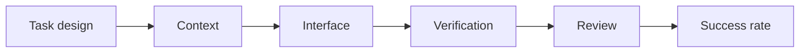
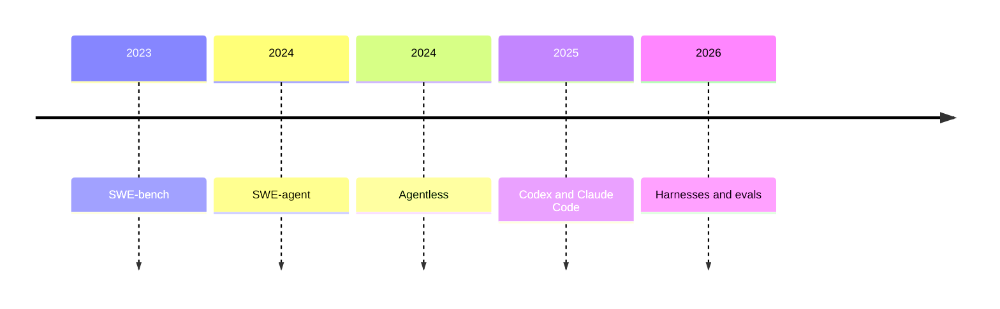
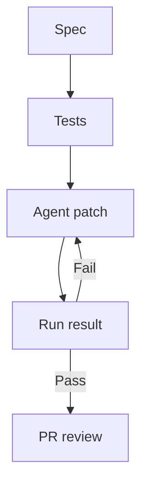

## 1. Executive Summary

LLM-based AI coding is more useful when it is treated as a development system for increasing the probability that a software change finishes correctly, rather than as a technology that simply replaces a human developer. The success probability is not determined by model capability alone. Task design, repository context, the agent-computer interface, verification, permission boundaries, and review workflow all compound.

<SourceNote>Anthropic argues that successful agentic systems often rely on simple, composable patterns rather than complex frameworks [Building effective agents](https://www.anthropic.com/engineering/building-effective-agents). OpenAI describes Codex as a software engineering agent that reads repositories, edits files, runs tests, and can turn work into pull requests [Introducing Codex](https://openai.com/index/introducing-codex/).</SourceNote>

The report's core conclusions are:

1. The objective of AI coding is not one-shot generation accuracy. It is the probability that a requested change is completed, verified, and left as a reviewable diff.
2. Success depends heavily on environment, context design, tool design, tests, CI, PR workflow, and rollback mechanisms.
3. Good practice does not mean giving the agent unlimited freedom. It means defining where the agent can explore, edit, verify, and leave evidence.
4. The longer the task, the more important it becomes to treat repository state, task lists, tests, commits, and logs as the source of truth instead of the chat transcript.
5. Public benchmarks are useful, but local success probability should be measured with evaluation sets and operational logs that reflect your own codebase.

The point of the diagram is that one strong layer is not enough. A stronger model will still produce plausible but wrong diffs if tests are missing. A detailed instruction file will not help if the task itself is ambiguous. Broad permissions may increase speed, but without rollback and auditability the cost of failure increases as well.

## 2. Why AI Coding Becomes Probability Engineering

In AI coding, an AI agent observes an environment, uses tools, changes state, and pursues an objective across multiple turns. In software development, this can include repository exploration, planning, implementation, test execution, reading failure logs, revising the patch, and writing a PR description. This is broader than traditional code completion.

That breadth creates more failure modes. An agent may inspect the wrong file, trust stale assumptions, skip tests, misunderstand what a passing test proves, over-abstract the solution, or lose context midway through a task. Therefore, the engineering target is not just the prompt. It is the development environment in which the agent is likely to succeed.

<SourceNote>Anthropic's Claude Code best practices emphasize giving the agent ways to verify its work and managing context aggressively because agentic coding involves reading files, running commands, and making changes [Claude Code: Best practices for agentic coding](https://www.anthropic.com/engineering/claude-code-best-practices). OpenAI's Codex system card addendum describes Codex as able to edit files, run tests, lint, typecheck, and leave verifiable evidence through terminal logs and files [Codex system card addendum](https://openai.com/index/o3-o4-mini-codex-system-card-addendum/).</SourceNote>

In this framing, AI coding maturity is not measured by how autonomous the system is. It is measured by how small failures become and how reproducible successes become.

| Layer        | Question                                        | What to Prepare                                   |
| ------------ | ----------------------------------------------- | ------------------------------------------------- |
| Task design  | Is the task small enough for one agent run?     | Issues, acceptance criteria, work units           |
| Context      | Can the agent find the right knowledge quickly? | AGENTS.md, architecture docs, ADRs, progress logs |
| Interface    | Can the agent take correct actions cheaply?     | CLIs, scripts, MCP tools, structured output       |
| Verification | Can the agent judge whether it succeeded?       | Tests, lint, type checks, screenshots             |
| Control      | Can failures be stopped and reviewed?           | Permissions, sandboxing, PRs, rollback, review    |

## 3. Research Background and Current Direction

Software engineering agents have moved from single-shot code generation toward repository-level issue resolution. SWE-bench evaluates whether a model can solve tasks derived from real GitHub issues and pull requests. SWE-agent showed that, even with a fixed language model, designing the agent-computer interface can improve the agent's ability to navigate repositories, edit files, and run tests.

<SourceNote>SWE-bench introduced 2,294 software engineering problems drawn from real GitHub issues and corresponding pull requests [SWE-bench paper](https://arxiv.org/abs/2310.06770). SWE-agent reports that an Agent-Computer Interface improves repository navigation, code editing, and test execution [SWE-agent paper](https://arxiv.org/abs/2405.15793).</SourceNote>

At the same time, more agentic is not always better. Agentless showed that a relatively simple two-phase process, localization followed by repair, can be a strong baseline without giving the model a long autonomous tool-use loop. The practical lesson is important: agentic autonomy is valuable only when it raises the probability of success. For predictable tasks, a workflow may outperform a free-form agent.

<SourceNote>Agentless questions the necessity of complex tool-use loops by using localization and repair as a simpler approach to LLM-based software engineering [Agentless paper](https://arxiv.org/abs/2407.01489). Anthropic similarly distinguishes workflows from agents and recommends choosing the simpler pattern when the task is predictable [Building effective agents](https://www.anthropic.com/engineering/building-effective-agents).</SourceNote>

Since 2025, practical guidance has shifted from model-only thinking toward harness design. OpenAI explains the Codex agent loop as the orchestration logic connecting user, model, and tools. Anthropic describes long-running agent harnesses that use an initializer agent, feature lists, progress notes, basic tests, and commits to preserve progress across sessions.

<SourceNote>OpenAI describes the Codex CLI agent loop as the core logic that orchestrates the user, model, and tools [Unrolling the Codex agent loop](https://openai.com/index/unrolling-the-codex-agent-loop). Anthropic's long-running agent harness uses feature lists, progress notes, init scripts, self-verification, and commits to make progress across many context windows [Effective harnesses for long-running agents](https://www.anthropic.com/engineering/effective-harnesses-for-long-running-agents).</SourceNote>

## 4. Five Layers for Raising Success Probability

### 4.1 Convert Tasks into Success Conditions

Agents should not receive vague instructions such as "fix this nicely." They need a target, constraints, acceptance criteria, verification steps, allowed scope, and forbidden scope. This resembles good issue writing for humans, but it matters more for agents because they will try to fill ambiguity.

| Scope            | Agent Fit   | Example                                               |
| ---------------- | ----------- | ----------------------------------------------------- |
| 5-20 minutes     | High        | Small bug fix, test addition, copy change             |
| 30-90 minutes    | Medium      | Single feature, existing UI pattern, local refactor   |
| Half day or more | Conditional | Migration, cross-cutting design change, long research |
| Multiple days    | Must split  | New product, multi-boundary redesign                  |

For long tasks, repository artifacts such as feature lists, acceptance criteria, progress notes, and verification commands are more reliable than a plan that exists only in the conversation.

### 4.2 Split Context into a Short Index and Deep Sources of Truth

Putting everything into AGENTS.md or CLAUDE.md bloats context and buries the important instructions. A better pattern is to make the top-level agent file a map, then store details in architecture docs, runbooks, ADRs, and testing guides. The agent should know what to read, not be forced to read everything at startup.

<SourceNote>OpenAI's harness engineering article treats AGENTS.md as a table of contents rather than an encyclopedia, with the source of truth in structured docs [Harness engineering](https://openai.com/index/harness-engineering/). Anthropic frames context engineering as the natural progression of prompt engineering for agents [Effective context engineering for AI agents](https://www.anthropic.com/engineering/effective-context-engineering-for-ai-agents).</SourceNote>

Context design is not about maximizing context volume. It is about helping the agent reach the information required for a decision, distinguish stale from current knowledge, and avoid irrelevant material.

### 4.3 Design the Agent-Computer Interface

SWE-agent's key lesson is that agent capability depends on the interface the agent uses. Human-oriented CLIs and huge logs are not always agent-friendly. Better interfaces provide short commands, structured output, clear errors, idempotent scripts, and targeted tests.

<SourceNote>Anthropic argues that agent performance depends on tool quality, including tool descriptions, specs, and evaluation [Writing effective tools for agents](https://www.anthropic.com/engineering/writing-tools-for-agents). SWE-agent provides empirical support that the agent-computer interface affects software engineering performance [SWE-agent paper](https://arxiv.org/abs/2405.15793).</SourceNote>

Agent-friendly tools usually have five properties:

1. Inputs are short and choices are explicit.
2. Output distinguishes success, failure, and warnings.
3. Failure output points to the next log or command.
4. Destructive operations have dry-run, confirmation, or sandboxing.
5. Re-running the command is unlikely to corrupt state.

### 4.4 Design Verification First

The highest-value feedback for an agent is executable verification. Unit tests, integration tests, type checks, lint, snapshots, browser screenshots, API smoke tests, and CI logs all provide signals the agent can use to repair its work. Without verification, agents tend to stop when an answer looks plausible.

<SourceNote>Anthropic's agent evals article distinguishes tasks, trials, graders, and transcripts, and notes that coding-agent evals require well-specified tasks, stable test environments, and thorough tests [Demystifying evals for AI agents](https://www.anthropic.com/engineering/demystifying-evals-for-ai-agents). Claude Code best practices also emphasize tests, screenshots, and expected outputs as high-leverage verification [Claude Code best practices](https://www.anthropic.com/engineering/claude-code-best-practices).</SourceNote>

No single evaluation layer is enough. Unit tests are fast but do not catch every UX problem. LLM judges are flexible but noisy and costly. Human review is strong but slow. The practical approach is to combine deterministic tests, logs, screenshots, and human review according to task risk.

### 4.5 Use Controls to Move Safely, Not to Block Work

Permission boundaries are not there to make the agent weak. They reduce loss when the agent fails and ensure that only successful diffs are merged. Sandboxing, network controls, secret isolation, PR review, approvals for privileged commands, and git-based diff management make agents more suitable for production development.

<SourceNote>OpenAI describes Codex as running in an isolated environment with the repository and user-defined development setup, while leaving verifiable evidence through files and terminal logs [Codex system card addendum](https://openai.com/index/o3-o4-mini-codex-system-card-addendum/). Anthropic describes human control, approval of actions, and distinguishing safe from risky actions as part of Claude Code's agent safety approach [Claude Code product](https://www.anthropic.com/product/claude-code).</SourceNote>

## 5. Practical Practices

### 5.1 Make AGENTS.md a Working Map

AGENTS.md should contain where the agent should start, common verification commands, forbidden operations, branch and PR rules, and failure-handling guidance. Detailed design rationale should live in docs. Information intended for agents should be discoverable through filenames and headings.

| File                   | Role                                          |
| ---------------------- | --------------------------------------------- |
| `AGENTS.md`            | Work map, verification commands, prohibitions |
| `docs/architecture.md` | Boundaries and major data flows               |
| `docs/testing.md`      | Test types, local commands, CI behavior       |
| `docs/runbooks/*.md`   | Diagnostic procedures                         |
| `docs/decisions/*.md`  | Design decision history                       |

### 5.2 Separate Exploration, Implementation, and Verification

If one prompt asks the agent to investigate, design, implement, and fix everything, success criteria often drift. Separate exploration tasks, implementation tasks, and verification tasks. In exploration, avoid creating diffs. In implementation, limit scope. In verification, state commands and expected results.

### 5.3 Treat Test Failures as Messages to the Agent

Agents repair code by reading failures, so test output is now both developer-facing and agent-facing. A good failure states what was expected, what actually happened, and where to inspect next. Huge snapshot diffs and flaky environment failures can mislead the agent.

### 5.4 Persist Long-Running Work in the Repository

Long work should not depend only on conversation history. Keep progress notes, feature lists, completion criteria, unresolved failures, and recent commits in the repository. Each session should begin by reading logs and running a basic test, then end with a commit and progress update.

<SourceNote>Anthropic's long-running agents article recommends feature lists, progress notes, basic tests, commits, and progress updates to enable work across many context windows [Effective harnesses for long-running agents](https://www.anthropic.com/engineering/effective-harnesses-for-long-running-agents).</SourceNote>

### 5.5 Treat Agent Output as a Pull Request

Agent output should be handled as a PR, not as a chat answer. A PR records the purpose, changes, verification, known limits, and review focus. Completion should be judged by the diff, tests, CI, and reviewability rather than by the agent saying it is done.

## 6. Risks and Limits

### 6.1 Benchmarks Do Not Guarantee Local Success

Benchmarks such as SWE-bench Verified matter, but they do not directly measure success in your repository. In 2026, OpenAI argued that SWE-bench Verified was no longer suitable for measuring frontier coding capability because of contamination and test-quality issues. The lesson is not that benchmarks are useless. It is that teams need local evaluation sets that reflect their own failure modes.

<SourceNote>OpenAI states that SWE-bench Verified has become less suitable for frontier launch measurement due to contamination and flawed tests, and recommends SWE-bench Pro [Why SWE-bench Verified no longer measures frontier coding capabilities](https://openai.com/index/why-we-no-longer-evaluate-swe-bench-verified/). For the initial purpose and structure of SWE-bench Verified, see [Introducing SWE-bench Verified](https://openai.com/index/introducing-swe-bench-verified/).</SourceNote>

### 6.2 Work That Cannot Be Verified Is Hard to Stabilize

When the specification is ambiguous, the correct answer depends strongly on taste, and no tests or observable checks exist, agents produce plausible outputs more easily than reliably correct ones. Agents can still help with design, writing, strategy, and research, but review criteria and claims to falsify must be explicit.

### 6.3 More Autonomy Increases Blast Radius

Giving an agent network access, secrets, production operations, paid APIs, or external writes may increase speed, but it also increases the cost of failure. Autonomy should be staged by task type.

| Level | Allowed                               | Suitable Work              |
| ----- | ------------------------------------- | -------------------------- |
| L1    | Read and propose                      | Design discussion, review  |
| L2    | Local edits and local tests           | Small fixes, tests         |
| L3    | Branches, PRs, CI checks              | Ordinary development       |
| L4    | External APIs, deploys, workflow runs | Operations with runbooks   |
| L5    | Autonomous production changes         | Only after strict approval |

## 7. Recommended Direction

To treat AI coding as probability engineering, do not start by adding more tools. Start by reshaping the development workflow so agents can succeed.

In the short term:

1. Make `AGENTS.md` a short working map with verification commands and prohibitions.
2. Convert recurring work into issue templates with acceptance criteria.
3. Provide fast tests and smoke tests that the agent can run by itself.
4. Write runbooks for CI failures, local startup, and deployment checks.
5. Treat agent work as PR work, with diffs, logs, verification, and residual risks.

In the medium term, maintain an agent evaluation set. Collect 20-50 tasks from past failures, common fixes, UI regressions, migrations, and CI failures. Re-run them when changing models, prompts, or tools. This does not need to be a large research benchmark. The value is reproducing failures that matter to your own development organization.

<SourceNote>Anthropic recommends starting agent evals early, noting that 20-50 tasks drawn from real failures can be enough at the beginning, and that evals clarify success criteria, prevent regressions, and support model-upgrade decisions [Demystifying evals for AI agents](https://www.anthropic.com/engineering/demystifying-evals-for-ai-agents).</SourceNote>

Ultimately, AI coding maturity is not measured by how little code humans type. It is whether the team can explain which tasks succeed under which conditions, with which verification, and at what probability. Adding AI coding to a development workflow is not mainly about accumulating prompt tricks. It is about embedding a system for raising success probability into the repository, tests, CI, documentation, and PR workflow.

## References

- Anthropic, [Building effective agents](https://www.anthropic.com/engineering/building-effective-agents), 2024-12-19.
- Anthropic, [Claude Code: Best practices for agentic coding](https://www.anthropic.com/engineering/claude-code-best-practices), 2025-04-18.
- Anthropic, [Writing effective tools for agents](https://www.anthropic.com/engineering/writing-tools-for-agents), 2025-09-11.
- Anthropic, [Effective context engineering for AI agents](https://www.anthropic.com/engineering/effective-context-engineering-for-ai-agents), 2025-09-29.
- Anthropic, [Effective harnesses for long-running agents](https://www.anthropic.com/engineering/effective-harnesses-for-long-running-agents), 2025-11-26.
- Anthropic, [Demystifying evals for AI agents](https://www.anthropic.com/engineering/demystifying-evals-for-ai-agents), 2026-01-09.
- OpenAI, [Introducing Codex](https://openai.com/index/introducing-codex/), 2025-05-16.
- OpenAI, [Addendum to OpenAI o3 and o4-mini system card: Codex](https://openai.com/index/o3-o4-mini-codex-system-card-addendum/), 2025-05-16.
- OpenAI, [Harness engineering: leveraging Codex in an agent-first world](https://openai.com/index/harness-engineering/), 2026.
- OpenAI, [Unrolling the Codex agent loop](https://openai.com/index/unrolling-the-codex-agent-loop), 2026-01-23.
- OpenAI, [Why SWE-bench Verified no longer measures frontier coding capabilities](https://openai.com/index/why-we-no-longer-evaluate-swe-bench-verified/), 2026-02-23.
- Jimenez et al., [SWE-bench: Can Language Models Resolve Real-World GitHub Issues?](https://arxiv.org/abs/2310.06770), ICLR 2024.
- Yang et al., [SWE-agent: Agent-Computer Interfaces Enable Automated Software Engineering](https://arxiv.org/abs/2405.15793), NeurIPS 2024.
- Xia et al., [Agentless: Demystifying LLM-based Software Engineering Agents](https://arxiv.org/abs/2407.01489), 2024.
