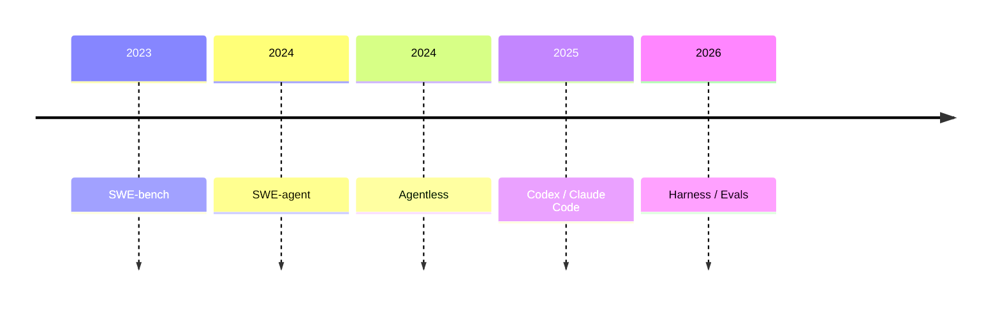
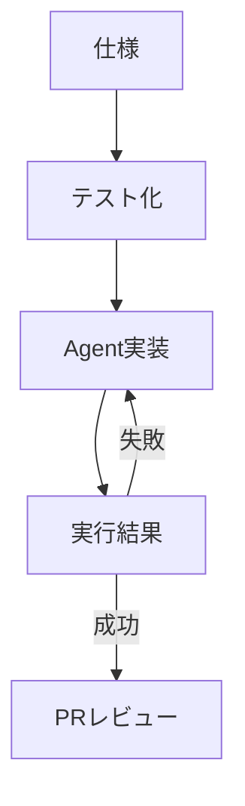

## 1. エグゼクティブサマリー

LLMを用いたAI Codingは、「人間の代わりに全部作る」技術として見るより、「ソフトウェア変更が正しく終わる確率を上げる」ための開発システムとして整備する方が実務に合う。成功確率はモデル性能だけで決まらない。タスク分割、リポジトリ内の文脈、Agentが使う操作面、検証手段、権限境界、レビューの入れ方が掛け算で効く。

<SourceNote>Anthropicは、成功したagentic systemは複雑なフレームワークより simple, composable patterns を使うことが多いと整理している [Building effective agents](https://www.anthropic.com/engineering/building-effective-agents)。OpenAIはCodexを、リポジトリを読み、ファイル編集とテスト実行を行い、差分をPR化できるsoftware engineering agentとして説明している [Introducing Codex](https://openai.com/index/introducing-codex/)。</SourceNote>

本レポートの結論は次の通りである。

1. AI Codingの目的は、単発の生成精度ではなく、変更が意図通りに完了し、検証され、レビュー可能な差分として残る確率を上げることである。
2. 成功確率は「モデル能力」よりも、実行環境、文脈設計、ツール設計、テスト、CI、PR運用、失敗時の巻き戻しによって大きく変わる。
3. 良いプラクティスは、Agentを自由にすることではなく、Agentが探索し、編集し、検証し、証拠を残せる範囲を明確にすることである。
4. 長い作業ほど、セッション内の会話より、リポジトリ内の状態ファイル、タスクリスト、テスト、コミット、ログを正本にする必要がある。
5. ベンチマークの点数は参考になるが、自分のコードベースでの成功確率は、ローカルの評価セットと運用ログで測るべきである。

この図で重要なのは、どこか1つを強くしても全体は安定しない点である。高性能モデルを使っても、テストがなければ「うまく見える差分」が通る。詳細なAGENTS.mdを書いても、タスクが曖昧なら探索が散る。Agentに広い権限を渡しても、巻き戻しと監査がなければ失敗時の損失が大きくなる。

## 2. 背景: AI Codingはなぜ確率の工学になるのか

AI Codingで使うAI Agentは、LLMが複数ターンにわたって環境を観察し、ツールを使い、状態を変えながら目的を達成しようとする仕組みである。ソフトウェア開発では、リポジトリ探索、変更方針の立案、実装、テスト実行、失敗ログの読解、修正、PR説明の作成までが対象になる。これは従来のコード補完より広い。

しかし、広いということは失敗面も広い。Agentは、間違ったファイルを読む、古い前提を信じる、テストを実行しない、通ったテストの意味を誤解する、過剰に抽象化する、作業途中で文脈を失う、といった失敗を起こす。したがって、開発者が整備すべき対象は「プロンプト」だけではない。Agentが成功しやすい環境そのものを設計する必要がある。

<SourceNote>AnthropicのClaude Code best practicesは、Agentic codingではファイル読み取り、コマンド実行、変更作成を行えるため、特に「検証手段を与えること」と「文脈管理」が重要だと述べている [Claude Code: Best practices for agentic coding](https://www.anthropic.com/engineering/claude-code-best-practices)。OpenAIのCodex system card addendumも、Codexがファイル編集、テスト、lint、type checkを実行し、端末ログとファイルによる検証可能な証拠を残す設計であると説明している [Codex system card addendum](https://openai.com/index/o3-o4-mini-codex-system-card-addendum/)。</SourceNote>

この見方では、AI Codingの成熟度は「どれだけ自律させたか」ではなく、「失敗を小さくし、成功を再現可能にしたか」で測る。成功確率は、次の5つの掛け算で考えられる。

| 要素       | 問い                               | 整備するもの                             |
| ---------- | ---------------------------------- | ---------------------------------------- |
| タスク設計 | Agentが一度に扱える大きさか        | issue、受け入れ条件、作業単位            |
| 文脈       | 必要な知識へ迷わず到達できるか     | AGENTS.md、設計文書、ADR、状態ログ       |
| 操作面     | 正しい操作を低コストで実行できるか | CLI、スクリプト、MCP、専用ツール         |
| 検証       | Agent自身が成否を判定できるか      | テスト、lint、型検査、スクリーンショット |
| 統制       | 失敗しても止められるか             | 権限、sandbox、PR、レビュー、巻き戻し    |

## 3. 研究史と現在地

ソフトウェア開発Agentの研究は、単発のコード生成から、リポジトリ全体を対象にした課題解決へ移った。SWE-benchは、実際のGitHub issueと対応するPRから構成される課題を使い、LLMがコードベースを変更して問題を解けるかを評価した。SWE-agentは、モデル自体を変えずに、Agentがコンピュータとやり取りするインターフェースを設計することで性能を上げられることを示した。

<SourceNote>SWE-benchは2,294件の実GitHub issue由来の課題で、コードベースとissue記述からパッチ生成を求める評価として提案された [SWE-bench paper](https://arxiv.org/abs/2310.06770)。SWE-agentは、Agent-Computer Interfaceの設計がリポジトリ探索、編集、テスト実行に効くと報告している [SWE-agent paper](https://arxiv.org/abs/2405.15793)。</SourceNote>

一方で、Agentが複雑であるほど良いとは限らない。Agentlessは、LLMに長い自律ループを任せるのではなく、問題箇所の特定と修正生成という単純な二段階に分けても強いベースラインになることを示した。これは実務にも重要である。Agenticであること自体に価値があるのではなく、成功確率が上がるなら、手続き的なworkflowの方が良い場合がある。

<SourceNote>Agentlessは、複雑なtool-use loopを持たないlocalizationとrepairの二段階方式で、LLM-based software engineering agentの必要条件を問い直した研究である [Agentless paper](https://arxiv.org/abs/2407.01489)。Anthropicも、workflowとagentを区別し、予測可能なタスクではworkflow、柔軟な探索が必要なタスクではagentが向くと整理している [Building effective agents](https://www.anthropic.com/engineering/building-effective-agents)。</SourceNote>

2025年以降の実務情報は、AI Codingの焦点が「モデル単体」から「harness」に移っていることを示す。OpenAIはCodexのagent loopを、ユーザー、モデル、ツールを束ねる中核ロジックとして説明している。Anthropicは、長時間作業ではinitializer agent、feature list、progress notes、基本テスト、コミットを使って、セッションをまたぐ進捗管理を行う設計を示している。

<SourceNote>OpenAIはCodex CLIの中核をagent loopとして説明し、モデルとツール呼び出しを組み合わせて作業を進める仕組みを解説している [Unrolling the Codex agent loop](https://openai.com/index/unrolling-the-codex-agent-loop)。Anthropicは長時間Agentで、feature list、progress notes、init script、自己検証、コミットを組み合わせるharnessを示している [Effective harnesses for long-running agents](https://www.anthropic.com/engineering/effective-harnesses-for-long-running-agents)。</SourceNote>

## 4. 基本原理: 成功確率を上げる5層

### 4.1 タスクを「成功条件」に変換する

Agentに渡すべきなのは「いい感じに直して」ではなく、「どの状態になれば成功か」である。良い依頼には、対象、制約、受け入れ条件、実行すべき検証、変更してよい範囲、変更してはいけない範囲が含まれる。これは人間のエンジニアに対するissue設計と同じだが、Agentではさらに重要になる。Agentは曖昧さを埋めようとするため、曖昧な依頼は過剰実装や横道探索を誘発する。

実務では、タスクを次の粒度に分けるとよい。

| 粒度     | Agent適性 | 例                                             |
| -------- | --------- | ---------------------------------------------- |
| 5〜20分  | 高い      | 小さなバグ修正、テスト追加、文言修正           |
| 30〜90分 | 中        | 単一機能、既存パターンに沿うUI、局所リファクタ |
| 半日以上 | 条件付き  | migration、横断的設計変更、長時間調査          |
| 数日以上 | 分割必須  | 新規プロダクト、複数境界をまたぐ再設計         |

長いタスクは、最初に計画Agentを使うよりも、feature list、acceptance criteria、progress notes、検証コマンドをリポジトリに置く方が安定する。セッション内会話は失われたり圧縮されたりするが、リポジトリ内の状態は次のAgentも読めるからである。

### 4.2 文脈を「短い索引」と「深い正本」に分ける

AGENTS.mdやCLAUDE.mdにすべてを書くと、文脈が膨らみ、かえって重要な指示が埋もれる。実務では、トップレベルのAgent指示は目次に近い役割にし、詳細はdocs、architecture、runbook、ADR、testing guideに分ける方がよい。Agentには「何を読むべきか」を示し、必要に応じて深い文書へ進ませる。

<SourceNote>OpenAIのHarness engineering記事は、AGENTS.mdを百科事典ではなくtable of contentsとして扱い、正本は構造化されたdocsに置く設計を紹介している [Harness engineering](https://openai.com/index/harness-engineering/)。Anthropicのcontext engineering記事も、context engineeringをprompt engineeringの自然な発展として位置づけ、Agentが使う文脈の構成を設計対象として扱っている [Effective context engineering for AI agents](https://www.anthropic.com/engineering/effective-context-engineering-for-ai-agents)。</SourceNote>

文脈設計の要点は、量を増やすことではない。Agentが判断に必要な情報へ早く到達できること、古い情報と新しい情報を区別できること、作業に関係ない情報を読まなくてよいことが重要である。

### 4.3 操作面をAgent向けに整える

SWE-agentの示唆は、Agentの能力はモデルだけでなく、Agentが触るインターフェースに依存するという点にある。人間向けのCLIや巨大なログは、Agentにとって必ずしも扱いやすくない。Agentが失敗しにくい操作面には、短いコマンド、構造化出力、明確なエラー、冪等なスクリプト、対象範囲を絞ったテストがある。

<SourceNote>Anthropicは、Agentの性能はツールの品質に依存し、tool descriptions、spec、評価をAgent向けに設計する必要があると述べている [Writing effective tools for agents](https://www.anthropic.com/engineering/writing-tools-for-agents)。SWE-agentのAgent-Computer Interfaceも、操作面の設計が性能向上に効くという実証的な根拠を与える [SWE-agent paper](https://arxiv.org/abs/2405.15793)。</SourceNote>

良いAgent向けツールは、次の性質を持つ。

1. 入力が短く、取り得る選択肢が明確である。
2. 出力が構造化され、成功、失敗、警告を区別できる。
3. 失敗時に次に読むべきログやコマンドを示す。
4. 破壊的操作はdry-run、確認、sandboxを持つ。
5. 同じコマンドを再実行しても状態が壊れにくい。

### 4.4 検証を最初から設計する

Agentに最も効くフィードバックは、自然言語の評価ではなく実行可能な検証である。単体テスト、統合テスト、type check、lint、snapshot、ブラウザスクリーンショット、API smoke test、CIログは、Agentが自分の作業を修正するための信号になる。逆に、検証がないタスクでは、Agentは見た目やもっともらしさで終了を判断しやすい。

<SourceNote>AnthropicのAgent evals記事は、Agent評価ではtask、trial、grader、transcriptを分け、coding agentでは安定したテスト環境と実行可能なテストが重要だと整理している [Demystifying evals for AI agents](https://www.anthropic.com/engineering/demystifying-evals-for-ai-agents)。Claude Code best practicesも、Agentにtests、screenshots、expected outputsを与えることを高レバレッジな実践としている [Claude Code best practices](https://www.anthropic.com/engineering/claude-code-best-practices)。</SourceNote>

ここで注意すべきなのは、評価は1種類では足りないことである。Unit testは速いが、UI崩れや実運用の使い勝手は見ない。LLM judgeは柔軟だが、揺らぎとコストがある。人間レビューは強いが遅い。成功確率を上げるには、タスクの性質に合わせて、決定的なテスト、ログ検査、スクリーンショット、人間レビューを組み合わせる。

### 4.5 統制は「止める」ではなく「安全に進める」ために置く

権限を絞る目的は、Agentを弱くすることではない。失敗時の損失を小さくし、成功した差分だけを取り込めるようにすることである。sandbox、ネットワーク制御、secretの非公開、PR単位のレビュー、権限付きコマンドの承認、gitによる差分管理は、Agentを本番開発に近づけるための安全装置である。

<SourceNote>OpenAIはCodexの実行環境を、リポジトリとユーザー定義の開発環境を持つ隔離コンテナとして説明し、ファイルと端末ログによって検証可能な証拠を残すとしている [Codex system card addendum](https://openai.com/index/o3-o4-mini-codex-system-card-addendum/)。AnthropicもClaude Codeの製品説明で、操作ごとの承認、safe/risky actionの区別、human controlをAgent safetyの要素として説明している [Claude Code product](https://www.anthropic.com/product/claude-code)。</SourceNote>

## 5. 実務プラクティス

### 5.1 AGENTS.mdは行動規範ではなく作業ナビにする

AGENTS.mdには、長い設計思想より、Agentが最初に読むべき場所、よく使う検証コマンド、禁止事項、ブランチ/PRルール、失敗時の対処を置く。詳細な設計判断はdocsに分ける。Agentに読ませたい情報は、ファイル名と見出しで発見可能にする。

推奨構成は次の通りである。

| ファイル               | 役割                                     |
| ---------------------- | ---------------------------------------- |
| `AGENTS.md`            | 作業開始時の索引、検証コマンド、禁止事項 |
| `docs/architecture.md` | システム境界と主要データフロー           |
| `docs/testing.md`      | テスト種別、ローカル実行、CI差分         |
| `docs/runbooks/*.md`   | 失敗時の診断手順                         |
| `docs/decisions/*.md`  | 重要な設計判断の履歴                     |

### 5.2 Agentに渡すタスクは「探索」「実装」「検証」を分ける

1つの依頼で「調査して、設計して、実装して、全部直して」と渡すと、Agentは途中で成功条件を失いやすい。実務では、探索タスク、実装タスク、検証タスクを分ける。探索では差分を作らせず、実装では対象範囲を限定し、検証では実行コマンドと期待結果を明示する。

ただし、細かく分けすぎると人間の調整コストが増える。おすすめは、リスクが低い既存パターンの作業は1Agentに任せ、境界をまたぐ設計変更やデータ移行は、計画、実装、レビューを分けることである。

### 5.3 テストは「Agentが読むエラーメッセージ」まで設計する

Agentは失敗ログを読んで修正するため、テストの失敗メッセージは開発者向けであると同時にAgent向けでもある。何が期待され、何が実際に起き、どのファイルを見ればよいかが分かる失敗は、Agentの自己修正を助ける。逆に、巨大なsnapshot差分や環境依存のflakeは、Agentを誤誘導する。

実務上は、Agent作業向けに次を用意すると効果が高い。

1. 変更対象に近い高速テスト。
2. 失敗理由が短く出るassertion。
3. UI作業ではスクリーンショットまたはDOM検査。
4. migrationではdry-runと差分確認。
5. CI失敗時に再現コマンドを示すrunbook。

### 5.4 長時間作業はリポジトリ内の状態でつなぐ

長時間作業では、会話履歴だけに依存しない。Agentが次回読むべきprogress notes、feature list、完了条件、未解決の失敗、直近コミットをリポジトリに残す。作業単位ごとにコミットし、次のAgentは最初にログとテストを読む。これにより、文脈圧縮やセッション切断による劣化を減らせる。

<SourceNote>Anthropicのlong-running agents記事は、作業開始時にfeature listやprogress notesを用意し、各セッションでテスト、コミット、進捗更新を行うことで、複数context windowをまたぐ進捗を可能にする設計を示している [Effective harnesses for long-running agents](https://www.anthropic.com/engineering/effective-harnesses-for-long-running-agents)。</SourceNote>

### 5.5 Agentの成果物はPRとして扱う

Agentが作った差分は、チャット回答ではなくPRとして扱うべきである。PRには、目的、変更点、検証、既知の限界、レビュー観点を残す。Agentが「完了」と言ったかではなく、差分、テスト、CI、レビュー可能性で判断する。

## 6. リスクと限界

### 6.1 ベンチマークは自社成功率を保証しない

SWE-bench Verifiedのようなベンチマークは重要だが、実務の成功確率をそのまま表すものではない。OpenAIは2026年に、SWE-bench Verifiedがfrontier coding capabilityを測る指標としては限界に来ており、汚染やテスト品質の問題があると説明した。これは、公開ベンチマークが不要という意味ではない。むしろ、自分のコードベースに近い評価セットが必要だという意味である。

<SourceNote>OpenAIは、SWE-bench Verifiedについて、frontier launches向けの進捗測定には不適になりつつあり、contaminationとテスト品質の問題があるとしてSWE-bench Proを推奨している [Why SWE-bench Verified no longer measures frontier coding capabilities](https://openai.com/index/why-we-no-longer-evaluate-swe-bench-verified/)。SWE-bench Verifiedの初期目的と構成は [Introducing SWE-bench Verified](https://openai.com/index/introducing-swe-bench-verified/) を参照。</SourceNote>

### 6.2 検証できない仕事は成功確率を上げにくい

仕様が曖昧で、正解が人間の感覚に強く依存し、テストや観測がない仕事では、Agentはもっともらしい成果を出しやすい。デザイン、文章、戦略、研究整理でもAgentは有用だが、評価軸、レビュー観点、反証すべき主張を明示しないと品質が安定しない。

### 6.3 自律性を上げるほどblast radiusも上がる

Agentにネットワーク、secret、production操作、課金API、外部書き込みを許すと、成功時の速度は上がるが失敗時の損失も大きくなる。したがって、自律性は一律に上げるのではなく、作業タイプごとに段階化する必要がある。

| レベル | 許可すること                  | 向く作業                |
| ------ | ----------------------------- | ----------------------- |
| L1     | 読み取り、提案のみ            | 設計相談、レビュー      |
| L2     | ローカル編集、ローカルテスト  | 小さな修正、テスト追加  |
| L3     | ブランチ作成、PR作成、CI確認  | 通常の開発作業          |
| L4     | 外部API、deploy、workflow実行 | 明確なrunbookがある運用 |
| L5     | 本番変更の自律実行            | 原則として厳格な承認後  |

## 7. 推奨方針

AI Codingを成功確率の工学として整備するなら、最初にやるべきことはツールを増やすことではない。現在の開発フローを、Agentが成功しやすい形に変えることである。

短期的には、次の5つを優先する。

1. `AGENTS.md`を短い作業ナビにし、検証コマンドと禁止事項を明記する。
2. よく依頼する作業を、受け入れ条件付きのissueテンプレートにする。
3. Agentが自分で実行できる高速テストとsmoke testを整える。
4. CI失敗、ローカル起動、deploy確認のrunbookを作る。
5. Agent作業をPR単位で扱い、差分、ログ、検証、残課題を残す。

中期的には、Agent用の評価セットを持つべきである。過去の失敗、よくある修正、UI崩れ、migration、CI失敗を20〜50件集め、モデルやプロンプトやツールを変えたときに再実行する。これは大規模な研究評価である必要はない。自分の開発組織にとって重要な失敗を再現できることが価値である。

<SourceNote>AnthropicはAgent evalsについて、初期には20〜50件の実失敗由来タスクから始めてもよく、evalは成功条件の明確化、回帰防止、モデル更新判断に効くと説明している [Demystifying evals for AI agents](https://www.anthropic.com/engineering/demystifying-evals-for-ai-agents)。</SourceNote>

最終的に、AI Codingの成熟度は「どれだけ人間が手を動かさなくなったか」ではなく、「どの種類の仕事なら、どの条件で、どの検証を通して、どの程度の確率で成功するか」を説明できるかで決まる。AI Codingを開発チームのワークフローに入れるとは、個人の勘に頼ったプロンプト術を増やすことではない。成功確率を上げる開発システムを、リポジトリ、テスト、CI、ドキュメント、PR運用の中に埋め込むことである。

## 参考情報

- Anthropic, [Building effective agents](https://www.anthropic.com/engineering/building-effective-agents), 2024-12-19.
- Anthropic, [Claude Code: Best practices for agentic coding](https://www.anthropic.com/engineering/claude-code-best-practices), 2025-04-18.
- Anthropic, [Writing effective tools for agents](https://www.anthropic.com/engineering/writing-tools-for-agents), 2025-09-11.
- Anthropic, [Effective context engineering for AI agents](https://www.anthropic.com/engineering/effective-context-engineering-for-ai-agents), 2025-09-29.
- Anthropic, [Effective harnesses for long-running agents](https://www.anthropic.com/engineering/effective-harnesses-for-long-running-agents), 2025-11-26.
- Anthropic, [Demystifying evals for AI agents](https://www.anthropic.com/engineering/demystifying-evals-for-ai-agents), 2026-01-09.
- OpenAI, [Introducing Codex](https://openai.com/index/introducing-codex/), 2025-05-16.
- OpenAI, [Addendum to OpenAI o3 and o4-mini system card: Codex](https://openai.com/index/o3-o4-mini-codex-system-card-addendum/), 2025-05-16.
- OpenAI, [Harness engineering: leveraging Codex in an agent-first world](https://openai.com/index/harness-engineering/), 2026.
- OpenAI, [Unrolling the Codex agent loop](https://openai.com/index/unrolling-the-codex-agent-loop), 2026-01-23.
- OpenAI, [Why SWE-bench Verified no longer measures frontier coding capabilities](https://openai.com/index/why-we-no-longer-evaluate-swe-bench-verified/), 2026-02-23.
- Jimenez et al., [SWE-bench: Can Language Models Resolve Real-World GitHub Issues?](https://arxiv.org/abs/2310.06770), ICLR 2024.
- Yang et al., [SWE-agent: Agent-Computer Interfaces Enable Automated Software Engineering](https://arxiv.org/abs/2405.15793), NeurIPS 2024.
- Xia et al., [Agentless: Demystifying LLM-based Software Engineering Agents](https://arxiv.org/abs/2407.01489), 2024.
