## 1. Executive Summary

Rather than being a "knowledgeable entity," modern LLMs are probabilistic pattern generators that learn from large volumes of language, code, images, and behavior logs, and become operational systems only by connecting external tools, business data, memory, authority, auditing, and feedback loops. Therefore, the essence of using AI lies not only in "selecting smart models," but also in information design that converts organizational reality into a form that can be manipulated by models.
The conclusions of this report are as follows.

1. The history of AI can be understood in terms of symbolic processing, statistical machine learning, deep learning, Transformer/LLM, and agentization. The current turning point is that models are moving away from the intelligence of a standalone model to an operational system where models read and write the external environment.
2. The essence of LLM is to reconstruct the relationships between elements in a context in a high-dimensional vector space, centering on the self-attention mechanism, and generate the next possible output. This allows language, code, and reasoning-like processing to be combined into one interface.
3. Differences from humans should be found not only in the abstract theory of the presence or absence of consciousness, but also in physicality, purpose formation, continuous experience, responsibility, value judgment, grounding in field constraints, and social trust.
4. Mere documentation is insufficient for information that can be put into practical use by AI. Business objects, attributes, relationships, states, history, decisions, permissions, exceptions, and implicit criteria need to be structured.
5. Symbol grounding is not a matter of “making sense to the LLM” but a design problem that connects symbols within an organization to observations, actions, results, responsibilities, and verifiable data.
6. Palantir's ontology should be viewed as an operational ontology that integrates data, logic, action, and security, as well as traditional RDF/OWL semantics.
7. Graphiti's time-aware knowledge graph is a highly relevant direction for dealing with dynamic memory, history, relationships, and evidence. However, weak extraction quality, schema design, operational load, authority, and evaluation design result in plausible but dangerous organizational memory.
8. The direction that Anthropic's public information appears to be is towards long context, advanced agents, business application integration, MCP, skills, sub-agents, audit/authorization/corporate implementation. This is an estimate based on official announcements, as a detailed future roadmap has not been made public.
9. MCP is useful as a standardization layer to connect external data, tools, prompts, and resources to AI. However, it does not automatically solve business semantics, authority design, data quality, and normalization of organizational knowledge.
   This report crosses the literature on AI research history, LLM research, knowledge representation, cognitive science, organizational knowledge theory, and agent-based literature. Although not an exhaustive systematic review, we will read the Dartmouth Proposal, Newell and Simon, Rumelhart et al., Vaswani et al., Brown et al., Ouyang et al., Bai et al., Harnad, Gruber, Berners-Lee et al., Nonaka, Graphiti/Zep, Palantir, Anthropic, and MCP specifications in a way that connects them to design decisions for practical implementation.

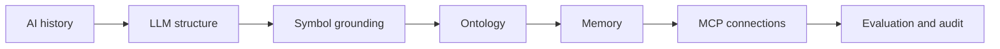

## 2. How should we understand the history of AI?

The history of AI is not simply a matter of technological progress that approaches humans, but rather a shift in paradigms regarding how to implement intelligence into machines.
Early AI developed around inference, exploration, rules, and symbolic manipulation. The view that human intelligence can be broken down into explicit symbols and rules became the basis for expert systems and classical reasoning systems. However, they were vulnerable to real-world ambiguity, exceptions, knowledge acquisition costs, and environmental changes.
The starting point for this period was the 1955 Dartmouth Proposal by McCarthy, Minsky, Rochester, and Shannon. The proposal posited the research hypothesis that if various aspects of learning and intelligence could be precisely described, they could be simulated by machines. Newell and Simon (1976) presented the physical symbol system hypothesis, viewing intelligence as a computational process of symbols and exploration. This view gave strong theoretical support to systems that have knowledge as explicit rules.
Source note: [Dartmouth Proposal](https://www-formal.stanford.edu/jmc/history/dartmouth/dartmouth.html) presented AI research as a plan to simulate "learning" and "intelligence" with machines. For Newell and Simon's view of symbolic processing, see [Computer Science as Empirical Inquiry](https://cacm.acm.org/research/computer-science-as-empirical-inquiry/).
After that, statistical machine learning moved toward learning regularities from data instead of writing rules by hand. Furthermore, deep learning incorporates the feature design itself into learning, making great progress in image recognition, speech recognition, and natural language processing.
The error backpropagation method of Rumelhart, Hinton, and Williams (1986) was decisive for the reconstruction of neural networks. LeCun, Bengio, and Hinton (2015) organized deep learning as a method for learning representations themselves in a hierarchical manner. The progress made in the 2010s is not simply due to an increase in computational resources, but the simultaneous maturation of data, GPUs, optimization, regularization, network structures, and benchmarks.
Source note: [Rumelhart, Hinton, and Williams (1986)](https://www.nature.com/articles/323533a0) for error backpropagation, [LeCun, Bengio, and Hinton (2015)](https://www.nature.com/articles/nature14539) for an overview of deep learning. The latter organizes deep learning as a method for learning multiple levels of representation.
The 2017 Transformer demonstrated a design that does not rely on recursion or convolution to process sequence data, but instead uses an attention mechanism to directly handle relationships between elements in context. This became the central foundation of the modern LLM. After GPT-3, large-scale pre-training and few-shot/zero-shot use of prompts became widespread, and the focus shifted from "creating an individual model for each task" to "giving context to a general-purpose model and letting it solve."
Source note: The original Transformer paper [Attention Is All You Need](https://arxiv.org/abs/1706.03762) describes Transformer as "based solely on attention mechanisms". GPT-3's [Language Models are Few-Shot Learners](https://arxiv.org/abs/2005.14165) reported that task-independent few-shot performance improves with scaling.
The focus in practice after 2024 will shift from a single model to agents, tool usage, long context, external storage, permissions, auditing, and business application integration. This means that AI is moving from "software that answers" to "software that acts within a work environment."

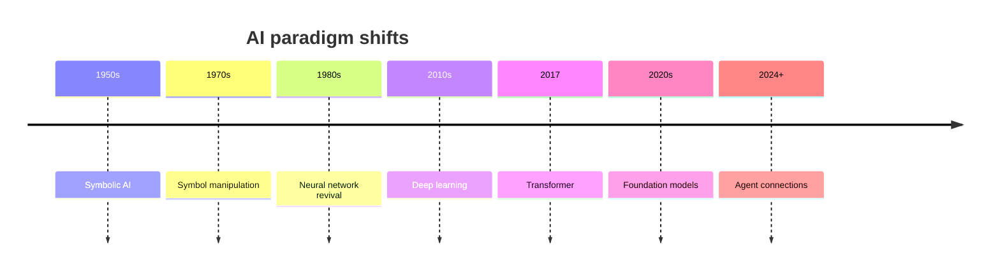

## 3. Essence of LLM principle and structure

There are five key points to understand when understanding LLM:
In the context of LLM research, it is necessary to read not only the 2017 Transformer, but also the discussions of BERT, GPT-3, InstructGPT, Constitutional AI, and Foundation Models. BERT (Devlin et al., 2018) acquires bidirectional context through pre-training, and GPT-3 (Brown et al., 2020) demonstrated that large-scale autoregressive models exhibit few-shot performance. Bommasani et al. (2021) called these foundation models and organized them as fundamental technologies that include not only capabilities but also bias, evaluation, and legal and social risks.
Source memo: BERT is [Devlin et al. (2018)](https://arxiv.org/abs/1810.04805), GPT-3 is [Brown et al. (2020)](https://arxiv.org/abs/2005.14165), foundation model conceptual organization is [Bommasani et al. (2021)](https://arxiv.org/abs/2108.07258). It is cited here as a history of research that moved from models for individual tasks to basic models.

### 3.1 Tokenization

Rather than understanding strings literally, LLM splits text into tokens and treats each token as a vector of numbers. The meaning here is not an empirical meaning that humans have, but a distributed expression that reflects co-occurrence, context, syntax, usage, and inference patterns within the learning data.

### 3.2 Self-care

At the heart of Transformer is self-attention. Self-attention is a mechanism by which each element in the input learns which and how many other elements it should refer to. This makes it easier to handle long-range dependencies, instructions, references, code structure, and contextual constraints.
The contribution of Vaswani et al. (2017) is that they showed that sequence transformation can be constructed using only the attention mechanism without using RNN or CNN. In LLM, the multi-headed attention in each layer captures different relationships, and the feedforward layer transforms the representation. This is the technical basis for behavior that appears to be "semantic understanding". However, it is dangerous to treat attention weights as a human-readable explanation, and the relationship between attention and explanation is treated with caution in interpretability research.
Source note: [Vaswani et al. (2017)](https://arxiv.org/abs/1706.03762) states that while traditional series transformation models were based on recurrent / convolutional networks, Transformer discards recurrence and convolution. This report's "self-attention-centered" explanation is based on this design difference.

### 3.3 Pretraining and scaling

LLM uses large amounts of text and code to learn to predict the next or hidden token. The GPT-3 paper showed that increasing model size boosts task-independent few-shot performance. On the other hand, it also suffers from biases derived from the learning corpus, outdated knowledge, misinformation, evaluation contamination, and instability of inferences.

### 3.4 Direction following and alignment

The basic model is difficult to use for business as it is. Additional training, including supervised fine-tuning, RLHF/RLAIF, and constitutional AI, will be used to follow human instructions, suppress dangerous output, and provide conversational and useful responses.
Ouyang et al. (2022) demonstrated InstructGPT, which allows GPT-3 to follow instructions using human feedback. Bai et al.'s (2022) Constitutional AI does not rely solely on human labels, but instead shows a direction toward reducing harm through AI feedback based on clearly stated principles. In practice, these methods do not mean that the model has ethics built into it. It merely improves the output trends; permissions, audits, approvals, logs, and evaluations remain on the system side.
Source note: [Ouyang et al. (2022)](https://arxiv.org/abs/2203.02155) argues that simply increasing the size of the model does not guarantee that it will follow the user's intentions, and shows how to fine-tune it using human feedback. [Bai et al. (2022)](https://arxiv.org/abs/2212.08073) calls AI feedback based on "rules or principles" Constitutional AI.

### 3.5 “Inferable compression” instead of inference

The output of an LLM is not a proof of the logic engine. In many cases, the result of compressing large numbers of language patterns is to produce behavior that looks like inference. Therefore, in practice, rather than relying on LLM reasoning as is, it is necessary to make it verifiable by combining it with external data, calculations, rules, audit logs, and approval flows.
Bender et al. (2021) criticized the environmental burden of large-scale language models, data-derived bias, and the danger of imitating only the form. On the other hand, the results after Brown et al. (2020) showed the versatility of statistical prediction alone, which cannot be underestimated. The two are not contradictory. Although it cannot be concluded that LLM has the same semantic understanding as humans, it has high practical value when combined with the external environment.
Source note: [Bender et al. (2021)](https://dl.acm.org/doi/10.1145/3442188.3445922) for critical perspective, [Brown et al. (2020)](https://arxiv.org/abs/2005.14165) for demonstration of competency. In this report, we read these two as "LLM is a technology that should be avoided both underestimation and overestimation."

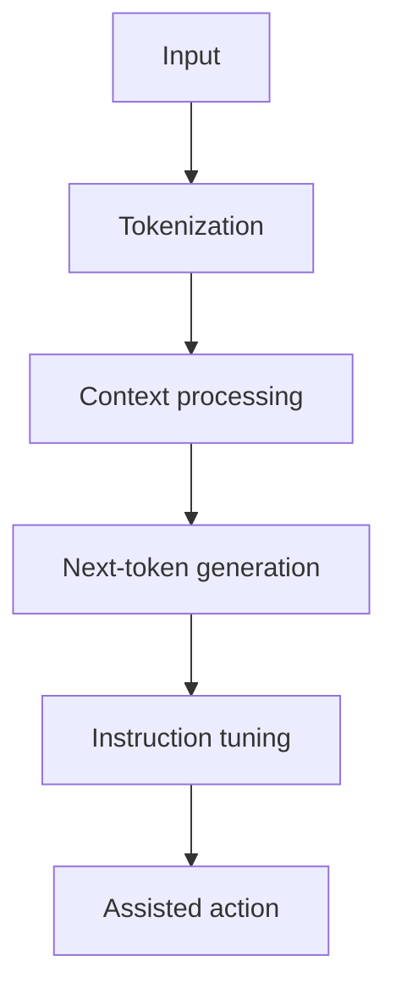

## 4. Where should we find the difference with humans?

If we limit the difference between LLMs and humans to "humans have minds, and AIs do not," it will not be of much use in practical design. The important differences in practice are as follows.
There is a long debate in philosophy and cognitive science about this issue. Searle's (1980) Chinese room argued that symbolic manipulation alone does not lead to semantic understanding. Dreyfus criticized classical AI for underestimating physicality, situationality, mastery, and being-in-the-world. Clark and Chalmers (1998) discussed the possibility that cognition extends beyond the brain to the external environment. Lake et al. (2017) summarized that human-like learning requires generalization from a small number of cases, causal models, constructivity, and intuitive psychology and physics.
Source note: See [Searle (1980)](https://www.cambridge.org/core/journals/behavioral-and-brain-sciences/article/minds-brains-and-programs/8D8E2A8A4C5A96E7C4A5385DAB3D27C1) for the difference between symbol manipulation and understanding, [Clark and Chalmers (1998)](https://academic.oup.com/analysis/article-abstract/58/1/7/153111) for how to grasp cognition including the external environment, and [Lake et al. (2017)](https://www.cambridge.org/core/product/A9535B1D745A0377E16C590E14B94993) for the requirements for human-like learning.
| Perspective | Human | LLM |
| ------ | -------------------------------------------- | ------------------------------------------------------------ |
| Embodiment | Experiencing sensation, movement, fatigue, danger, and social sanctions | Basically, text, images, and tool results are treated as input |
| Purpose | Forming and modifying the purpose of oneself and the organization | Acting to optimize the given purpose |
| Memory | Associated with sequential experiences, emotions, and responsibilities | Depends on sessions, external memory, and retrieval |
| Meaning | Connected to actions, experiences, social relationships, and values | Distributedly expressed from usage and relationships within data |
| Responsibility | Responsible for judgment | Not the responsible entity, but a component of responsible operation |
| Tacit knowledge | Having embodied skills, contextual judgment, atmosphere, and intuition | Tacit knowledge that is not observed, recorded, and fed back cannot be accessed |
Rather than viewing AI as a replacement for humans, it is important to design it as a device that augments human judgment, turns it into explicit knowledge, and speeds up execution and verification.

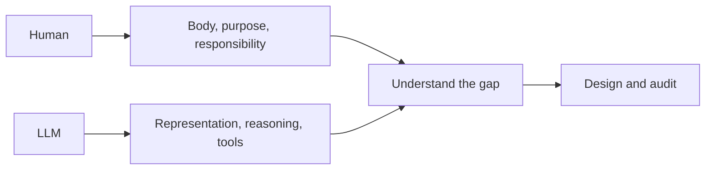

## 5. Information that can be input to AI in practice

The success or failure of AI utilization depends more on "what to make available for input" than "which model to use." Information useful for practical input can be organized in the following hierarchy.
This chapter is at the intersection of RAGs, knowledge graphs, operational data modeling, and workflow management. Lewis et al. (2020)'s RAG and Guu et al. (2020)'s REALM pointed toward connecting searched external knowledge to generation, rather than keeping all knowledge within the model. In practice, if the search target remains a mere document corpus, handling of business status, authority, history, and exceptions becomes weak.
Source note: RAG is [Lewis et al. (2020)](https://arxiv.org/abs/2005.11401), REALM is [Guu et al. (2020)](https://proceedings.mlr.press/v119/guu20a.html). Here, it is cited to show the design consequence that search expansion needs to include business objects, states, and actions, not just "document search."

### 5.1 Layer 1: Documents

Regulations, manuals, minutes, design documents, customer correspondence history, codes, FAQs, etc. This is the easiest to implement, but documents alone tend to make it unclear what is currently valid, who approved it, what are the exceptions, and what the actual business status is.

### 5.2 Layer 2: Structured Data

Table data such as customers, opportunities, contracts, inventory, employees, projects, sales, obstacles, inquiries, etc. LLM should not be used alone, but in combination with SQL, API, BI, and data quality management.

### 5.3 Third layer: Business objects

Clarify business nouns such as "customer," "project," "billing," "product," "failure," and "measure," and give them attributes, relationships, status, life cycle, and authority. This is the entrance to ontology.

### 5.4 Layer 4: Actions and Decisions

Business actions such as approval, rejection, order placement, price change, customer contact, deployment, and troubleshooting. For AI to enter into practice, it is necessary not only to read, but also to define what it can do and under what conditions.

### 5.5 Layer 5: Feedback and Results

Record which results were produced by AI or human decisions. Without this, AI utilization will remain as a one-off efficiency improvement and will not lead to organizational learning.

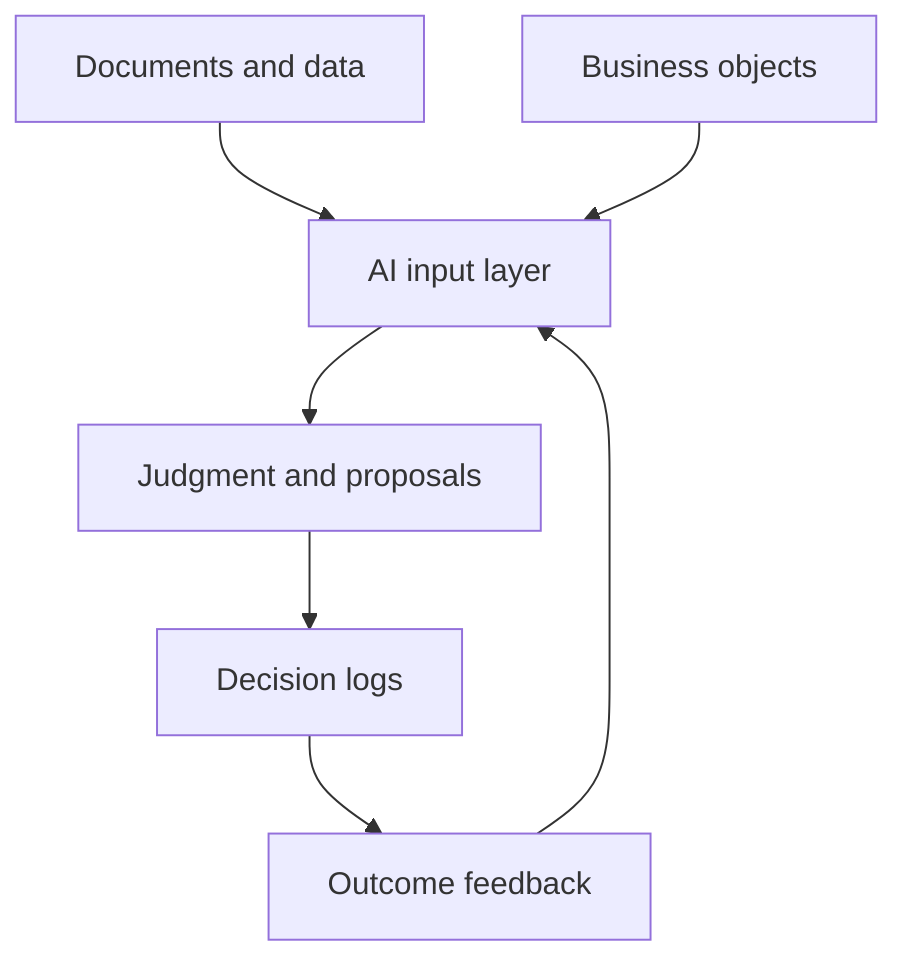

## 6. Symbol grounding method

The symbol grounding problem is a problem in which if symbols are closed only by the relationships between them, what they mean cannot be determined within the system. Harnad argued that mere linguistic input and output is insufficient for grounding, and sensorimotor connections are needed.
Source note: [Harnad (1990)](https://www.southampton.ac.uk/~harnad/Papers/Harnad/harnad90.sgproblem.html)'s Symbol Grounding Problem is the basis of this chapter. In this report, we reinterpret it not as a robot body itself, but as a connection to work objects, actions, results, and responsibilities.
Symbolic grounding in the LLM era is not a retelling of the classic "symbolic AI versus connectionism". LLM can powerfully handle relationships within the language through distributed expressions, but the problem in business is connecting to individual objects such as "this customer," "this contract," "this failure," and "this approval." Therefore, grounding is not a complete solution to philosophical meaning understanding, but is designed as an information architecture that closes reference, action, result, and responsibility.
Symbolic grounding in practical AI does not necessarily mean having a robot body. Within an organization, making connections is a practical grounding.

1. **Connection of symbols and objects**: "Customer A", "Project B", and "Risk C" refer to unique objects in the actual data.
2. **Connection of symbols and states**: Statuses such as "Not supported", "Approved", "Difficult", and "Important customer" have judgment rules and trails.
3. **Connection of symbols and actions**: "Approve," "Send," and "Place an order" are connected to actual system operations.
4. **Connection of symbols and results**: Post-action sales, quality, delays, customer satisfaction, and risk reduction are recorded.
5. **Connection of symbol and responsibility**: Who made the decision, who approved it, and with what authority it was carried out remains.
   In this perspective, ontology is not a dictionary but a grounding layer that operationalizes organizational reality.

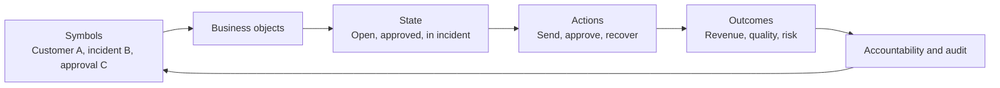

## 7. How to understand ontology

Ontology has at least three meanings.
Gruber (1993) defined ontology as an explicit specification of conceptualization. Formal ontology after Guarino (1998) emphasized not only the classification of concepts but also basic distinctions such as identity, dependence, part-whole relationships, roles, and events. Berners-Lee, Hendler, and Lassila's (2001) Semantic Web was a vision for connecting information on the Web into semantic structures that can be processed by machines. These lineages come back to the question of "how to define what LLM touches" in modern business AI.
Source note: The definition that treats ontologies as "explicit specifications" is [Gruber (1993)](https://doi.org/10.1006/knac.1993.1008), and the Semantic Web initiative is [Berners-Lee, Hendler, and Lassila (2001)](https://lassila.org/publications/2001/SciAm.html). This section distinguishes between genealogy as a knowledge expression and its modern usage as a business operations layer.

1. **Philosophical Ontology**: Asking what exists.
2. **Ontology as knowledge representation**: Define concepts, relationships, and constraints in a machine-readable manner.
3. **Ontology as business operations**: Integrates business objects, states, actions, authorities, and decisions.
   What is needed for AI utilization is an ontology that includes the third one. Simply defining a vocabulary in RDF/OWL will not move the business unless there are practical actions, authorities, audits, and feedback.
   Palantir Foundry's Ontology strongly emphasizes this point. Palantir describes Ontology as an operational layer that sits on top of datasets, virtual tables, and models and connects to real-world objects such as equipment, products, orders, and financial transactions. It also states that it includes not only semantic elements but also kinetic elements such as actions, functions, and dynamic security.
   Source note: Palantir's [Why create an Ontology?](https://www.palantir.com/docs/foundry/ontology/why-ontology) describes Ontology as the "common language" of an organization, emphasizing the capture and writeback of decision results. Specific items for Action types, Functions, and Permissions can be found in the navigation and related pages of the same document.
   This idea is very important in the LLM era. LLM can receive a variety of requests using natural language, but in order to safely reflect those requests in practice, it is necessary to clarify "which object, in what state, with whose authority, and which actions are permitted."

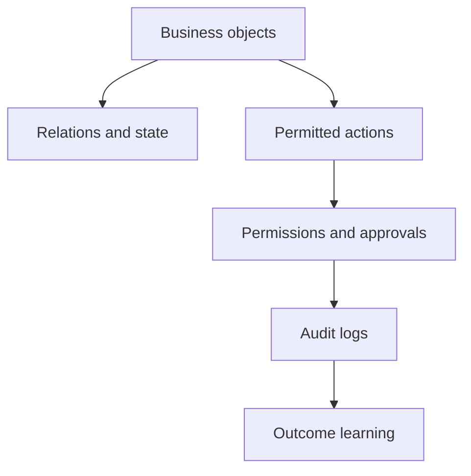

## 8. Pros and cons of Graphiti's approach

Graphiti is a time-aware context graph engine at the core of Zep's context infrastructure. The official README describes it as handling changes in facts over time, provenance, episodes, custom types, and hybrid search, rather than a static knowledge graph. The Zep paper presents an approach to dynamically integrate conversational and business data through Graphiti and maintain historical relationships.
Source note: The Graphiti README describes Graphiti as a framework for [temporal context graphs for AI agents](https://github.com/getzep/graphiti), dealing with factual variation, provenance, and prescribed/learned ontology. The Zep paper is [Rasmussen et al. (2025)](https://arxiv.org/abs/2501.13956).
An easy way to evaluate Graphiti is to compare it with the limits of RAG. RAG is a powerful pattern that searches for related documents and passes them on to generation, but the chronology of document fragments, fact updates, relationships between people, cases, and decisions, and the handling of contradictory trails tend to be implementation-dependent. Zep/Graphiti (Rasmussen et al., 2025) presents a design that compensates for this weakness by treating agent memory as a timed knowledge graph.
Source note: [Zep論文](https://arxiv.org/abs/2501.13956) argues that existing RAGs tend to be limited to static document retrieval, and positions Graphiti as a temporally-aware knowledge graph engine. The Graphiti README also explains the design of managing old facts with a validity window without deleting them.

### 8.1 Points that can be evaluated

Graphiti's direction is highly relevant for the following reasons.

1. **Managing time**: Organizational knowledge is not only about what is currently correct, but also about when it was correct and when it was overwritten.
2. **Leave provenance**: Agent memory cannot withstand audits without being able to go back to the underlying conversation, document, JSON, or event.
3. **Handling relationships**: Flat vector searches have difficulty handling structures of people, issues, decisions, exceptions, and dependencies.
4. **Assuming dynamic updates**: In business, customer conditions, specifications, and decision criteria change, so batch rebuilding alone is slow.
5. **Compatibility with MCP**: Graphiti MCP Server allows it to be used as a storage tool from MCP clients such as Claude Desktop and Cursor.

### 8.2 Points to note

However, implementing Graphiti does not automatically improve organizational memory.

1. **Extraction quality issue**: LLM extracts incorrect entities and relationships from conversations. If incorrect relationships are memorized, they contaminate subsequent judgments.
2. **Ontology design issues**: If the balance between prescribed ontology and learned ontology is incorrect, the graph will become chaotic.
3. **Authority issues**: You must control who can see the knowledge gained from whose conversations.
4. **The problem of forgetting**: Designing historical information rather than deleting old information is effective, but there is a risk that old information will be mixed in when searching.
5. **Evaluation issue**: Your company needs to design a benchmark to measure whether memory really contributes to work results.

### 8.3 Conclusion

Graphiti is promising as an external memory for LLM. However, rather than creating a company-wide knowledge base from the beginning, it is preferable to have a PoC with a limited scope. For example, you should start with areas where time change and relationships are important, such as customer service history, troubleshooting, technical research, design decisions, and sales proposals.

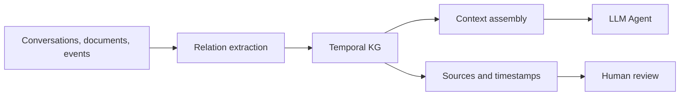

## 9. Strategies for utilizing tacit knowledge in organizations

Tacit knowledge is not undocumented knowledge, but includes experience, embodied skills, situational judgment, relationships, and context-dependent intuition. Nonaka's SECI model places the mutual transformation of tacit and explicit knowledge at the center of organizational knowledge creation.
Polanyi's (1966) theory of tacit knowledge posed the problem that "people know more than they can say." Nonaka (1994) and Nonaka and Takeuchi (1995) organized the conversion of tacit and explicit knowledge as a cycle of communalization, externalization, connection, and internalization. Brown and Duguid (1991) showed that learning and innovation occur within communities of practice, not just formal manuals. When introducing AI, this lineage should not be reduced to a matter of "transforming all tacit knowledge into text".
Source note: The basis of tacit knowledge is [Polanyi, The Tacit Dimension](https://openlibrary.org/books/OL5990259M/The_tacit_dimension.), and the source of the SECI model is [Nonaka (1994)](https://pubsonline.informs.org/doi/10.1287/orsc.5.1.14) and [Nonaka and Takeuchi (1995)](https://academic.oup.com/book/52097). The community of practice perspective is [Brown and Duguid (1991)](https://pubsonline.informs.org/doi/fpi/10.1287/orsc.2.1.40).
Utilizing tacit knowledge in the AI ​​era does not mean completely converting tacit knowledge into explicit knowledge. Rather, it is about capturing situations where tacit knowledge is demonstrated and connecting it to surrounding information in a reusable form.
The practical measures are as follows.

1. **Leave a decision log**: Record not only "what was decided," but also "why," "what were the alternatives," and "which constraints were effective."
2. **Collect the thought process of experts**: Record review comments, troubleshooting, negotiation preparation, and design decisions as short audio/memo/conversation logs.
3. **Make it case-based**: Instead of an abstract manual, accumulate examples, exceptions, failures, recoveries, and customer responses.
4. **Connect to ontology**: Link tacit knowledge to business objects such as "customers," "projects," "systems," "risks," and "judgment criteria."
5. **Support externalization with AI**: Have LLM extract points of contention, decision criteria, unconfirmed matters, and reusable procedures from conversations.
6. **Human Approval**: Externalization of tacit knowledge is easily misinterpreted. A review by an expert or a responsible person is required.
7. **Create a space for re-internalization**: Humans will re-embodi themselves not only through reading documents created by AI, but also through pair work, reviews, role-plays, and reflections.

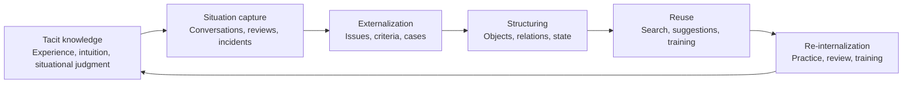

## 10. Connection with the concept of Palantir

Palantir Foundry Ontology is an important reference point for business system design in the AI ​​era. Palantir's documentation describes Ontology as an organization's operational layer, connecting data to real-world objects and integrating decision-making, action, and security.
Source note: See [Palantir Ontology overview](https://www.palantir.com/docs/foundry/ontology/overview) and [Why create an Ontology?](https://www.palantir.com/docs/foundry/ontology/why-ontology). The latter calls Ontology the "digital twin" of an organization and explains that it turns decisions into data through decision capture, writeback, and action types.
Palantir's feature is that it does not limit ontology to a static knowledge representation, but treats it as an operational layer that integrates business objects, authorities, actions, and decision-making. This is consistent with the Semantic Web and OWL traditions, but the emphasis is different. While RDF/OWL-based ontologies emphasize "expression of concepts and relationships," Foundry Ontology is presented as "a layer for safely manipulating real business objects."
This idea is connected to LLM utilization as follows.
| Concept of Palantir | Meaning in LLM/AI practice |
| ---------------------------- | ------------------------------------- |
| Object / Link | Business nouns and relationships that LLM should refer to |
| Action | Business operations that LLM can suggest or perform |
| Function / Logic | Rules, calculations, models, workflows |
| Dynamic Security | Permission control for each user and AI agent |
| Decision capture | Judgment, approval, and record of results |
| Digital twin of organization | Business world model shared by AI and humans |
The strength of Palantir-type thinking is that it connects AI to changes in the state of the business world, rather than confining it to a simple chat UI. On the other hand, implementation requires large design and integration costs. If your company adopts a similar philosophy, you should start with a "small operational ontology" for specific workflows, rather than creating a huge company-wide ontology from the beginning.

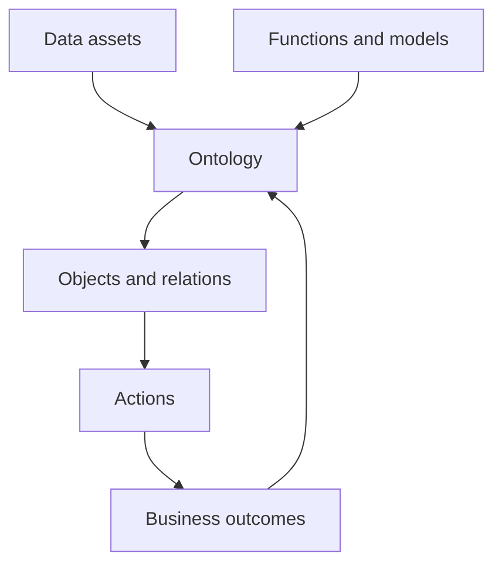

## 11. How do you read Anthropic's future roadmap?

Anthropic has not comprehensively released a detailed future roadmap. Therefore, we will summarize the direction that can be seen from the official announcement as of May 6, 2026.
This chapter is not a quotation from the official roadmap, but rather an extrapolation from Anthropic's published products, specifications, and announcements. The November 2024 MCP announcement, Claude Code's MCP integration, Subagents, Skills, Opus 4.6's 1M context beta and agent teams, Labs, and agent templates for finance are pointing in the same direction. In other words, Anthropic is shifting its focus from "one-shot LLM" to "an agent platform that breaks down long-running tasks, uses external tools, and executes them under the authority of the organization."
Source note: MCP announcement is [Anthropic, Introducing the Model Context Protocol](https://www.anthropic.com/news/model-context-protocol). Opus 4.6's 1M token context, context compaction, and agent teams are based on [Claude Opus 4.6](https://www.anthropic.com/news/claude-opus-4-6). The "direction" here is not an official roadmap, but an estimate from published features.

### 11.1 Direction seen from published information

1. **Agentization**: Claude Code, Cowork, Managed Agents, financial agent templates, etc. are moving towards doing work rather than answers.
2. **Business application integration**: Increasing connectivity with Excel, PowerPoint, Word, Outlook, financial data providers, and corporate systems.
3. **MCP-centric connectivity strategy**: Positioning MCP as the standard for connecting AI and external data tools, making it available through APIs, Claude Code, and Claude.ai.
4. **Long-term/long-context work**: Opus 4.6 shows 1M token context beta, compaction, long-running tasks, and agent teams.
5. **Corporate Controls**: Strengthening permissions, authentication, audit logs, compliance, cloud infrastructure, and partner ecosystem.
6. **Expansion of computing resources**: We are expanding our learning and inference capabilities through additional collaboration with AWS.
7. **Separation of experimentation and commercialization**: This shows a system in which research previews, experimental functions, and productization are promoted separately through Labs.

### 11.2 Implementation reading

Anthropic's direction has shifted from competition in the performance of individual models to a business agent platform, tool connectivity, organizational implementation, and auditable autonomous work. MCP, Skills, Subagents, long context, office collaboration, and Claude Code/Cowork are heading in the same direction.
However, you should avoid making a definitive statement that "Anthropic will definitely do this in the future." If used as a roadmap, it would be appropriate to treat it as a "hypothesis for practical implementation based on published functions".

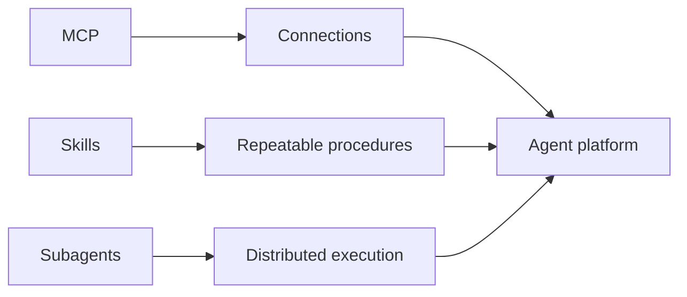

## 12. To what extent can MCP be used?

MCP is a standard protocol for connecting AI applications and external systems. Anthropic describes MCP as a standard for connecting data sources and tools to AI. The official specifications cover Tools, Resources, Prompts, Sampling, Roots, Elicitation, Authorization, etc.
Source note: Anthropic's MCP announcement describes MCP as an "open standard" for connecting AI assistants and data sources. MCP's official [What is MCP?](https://modelcontextprotocol.io/docs/getting-started/intro) is also described as a standard for connecting AI applications to external systems.
MCP is positioned as a common interface for connections, rather than having universal semantics like HTTP or SQL. In the official specifications, server features such as Resources, Prompts, and Tools, and client features such as Sampling and Roots are defined. The specifications for 2025 and beyond also include authorization and security considerations. In practice, rather than creating an MCP server, the essence is deciding which operations to make public, what privileges to execute them, and which logs to leave.
Source note: The basic function of MCP server is [Understanding MCP servers](https://modelcontextprotocol.io/docs/learn/server-concepts). The same page explains Tools, Resources, and Prompts as three building blocks, with tools being operations that models call, resources being context information, and prompts being templates.

### 12.1 What you can do with MCP

1. **Tool execution**: Expose API calls, DB searches, calculations, file operations, and business system operations to AI.
2. **Resource provision**: Expose files, DBs, APIs, documents, etc. as contexts with URIs.
3. **Prompt templates**: Provide reusable instruction templates that follow business workflows.
4. **User confirmation**: Depending on implementation, confirmation UI or approval for dangerous operations can be included.
5. **Existing system integration**: Easy to standardize connections such as Slack, GitHub, Google Drive, DB, internal API, etc.
6. **Coordination with memory tools like Graphiti**: Memory/knowledge graphs hosted on the MCP server can be used by multiple AI clients.

### 12.2 What MCP alone cannot do

1. **Automation of semantic design**: MCP is a protocol and does not automatically create business ontology.
2. **Data Quality Assurance**: Old data, inconsistencies, duplication, and incorrect entries require separate management.
3. **Responsibility design**: Who gives approval and who is responsible is determined by business design outside the MCP.
4. **Complete resolution of authority/auditing**: Security considerations are included in the specifications, but implementation and operation are important.
5. **Symbol grounding itself**: MCP provides a connection path, but a separate design is required to associate symbols with real objects, actions, and results.

### 12.3 Recommended architecture

In practice, it is best to position MCP as follows.

```text
LLM / Agent
  ↓
MCP Client
  ↓
MCP Servers
  ├─ Document / Search Server
  ├─ Database / BI Server
  ├─ Workflow / Ticket / CRM Server
  ├─ Graphiti / Memory Server
  └─ Approval / Audit Server
  ↓
Operational Ontology
  ├─ Objects
  ├─ Relations
  ├─ States
  ├─ Actions
  ├─ Permissions
  └─ Feedback
```

MCP is a "standard for connectivity" and Operational Ontology is "a layer that defines the meaning and actionability of connected things." It is important to design these two separately.

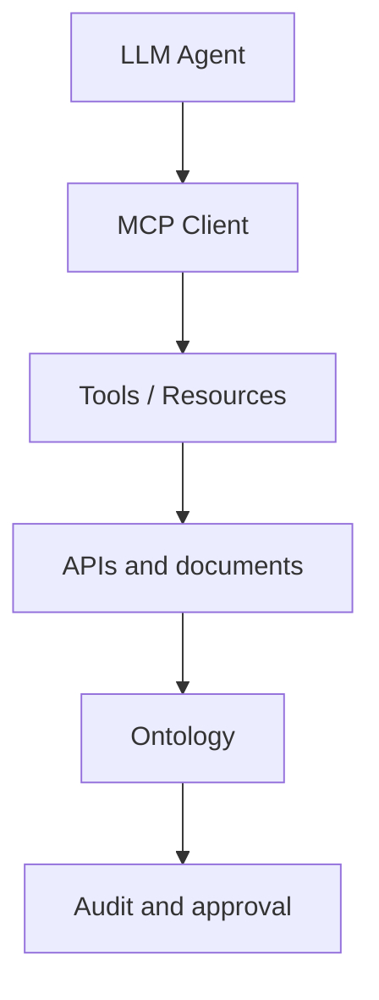

## 13. Recommended policy for practical implementation

### 13.1 What to make first

The first thing that should be created is not a company-wide AI infrastructure, but a limited area "business memory project."
Introductory research should not compare RAG alone, knowledge graph alone, or agent alone, but should be evaluated based on their contribution to business results. For example, in the case of technical research, we measure the "rediscovery rate of past judgments," "response rate with citations," "review revision rate," and "contamination rate of old information." When dealing with customers, measure "response preparation time," "misdirection rate," and "approval rejection rate." When dealing with failures, measure the "success rate of searching for similar failures," "rate of providing evidence for recovery decisions," and "reuse rate of post-mortem reviews."
The candidates are as follows.

1. Memorization of technical research and design decisions
2. Memorization of customer service and preparation for business negotiations
3. Memorization of failure response/operation decisions
4. Search internal knowledge, FAQs, and regulations
5. Project decision log
   Of these, technical research and design judgment are the easiest to start with. It is easy to control personal information and confidentiality risks, and it is easy to record deliverables as documents, ADR, tasks, and reviews.

### 13.2 Minimum configuration

The minimum configuration is as follows.

1. **Research Log**: Record the research theme, questions, hypotheses, sources, and judgments.
2. **Decision Log / ADR**: Leave the reason for adoption/rejection.
3. **Ontology Lite**: Define objects, relationships, states, constraints, and actions in a small way.
4. **Memory Layer**: PoC Graphiti or equivalent temporal knowledge graph.
5. **MCP Layer**: Connect document search, GitHub, tickets, DB, and storage tools via MCP.
6. **Human Review**: Important decisions are always approved by humans.

### 13.3 Evaluation metrics

The effectiveness of the introduction will be measured not only by the quality of responses but also by the following:

1. Reducing investigation time
2. Reuse rate of decision bases
3. Search success rate for past decisions
4. New member onboarding time
5. Contamination rate of false memories and old memories
6. Revision rate by human review
7. Auditability
8. Zero security incidents

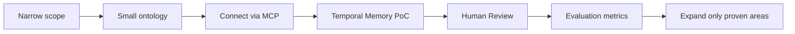

## 14. Final recommendation

The essence of utilizing AI is not to treat LLM as a "substitute for intelligent humans." It is about transforming organizational reality into a form that models can reference, reason about, act on, and test.
The three core concepts for this purpose are:

1. **Operational Ontology**: Defines objects, states, relationships, actions, and authorities in the business world.
2. **Temporal Memory**: Retains what is correct, when it was obtained, from what source, and when it was overwritten.
3. **Governed Tooling**: Connect tools to AI using things like MCP while ensuring permissions, approvals, and audits.
   Graphiti is a promising candidate for Temporal Memory, and Palantir's ontology idea becomes a reference model for Operational Ontology. MCP can be used as a standardization layer for Governed Tooling. Anthropic is also moving towards a business agent that integrates these three.
   In the short term, it is realistic to implement MCP + document search + small ontology + Graphiti PoC for technical research, design decisions, and ADR. In the medium to long term, we should aim for a state where AI can refer to the same business world model as humans by connecting customers, projects, systems, decisions, and business actions.
   This recommendation is both to avoid underestimating LLM and to avoid overestimating it. LLM is a powerful compressor that traverses languages, codes, and knowledge fragments, making it fully practical as an instruction-following model. However, organizational facts, authorities, responsibilities, history, and results do not exist within the model. The design of practical AI is determined by how the outside is structured.

## Reference information

- Palantir, "Why create an Ontology?" https://www.palantir.com/docs/foundry/ontology/why-ontology
- Palantir, "Overview - Ontology" https://www.palantir.com/docs/foundry/ontology/overview
- Palantir, "The Ontology system" https://www.palantir.com/docs/foundry/architecture-center/ontology-system
- Vaswani et al., "Attention Is All You Need" https://arxiv.org/abs/1706.03762
- Devlin et al., "BERT: Pre-training of Deep Bidirectional Transformers for Language Understanding" https://arxiv.org/abs/1810.04805
- Brown et al., "Language Models are Few-Shot Learners" https://arxiv.org/abs/2005.14165
- Ouyang et al., "Training language models to follow instructions with human feedback" https://arxiv.org/abs/2203.02155
- Bai et al., "Constitutional AI: Harmlessness from AI Feedback" https://arxiv.org/abs/2212.08073
- Bommasani et al., "On the Opportunities and Risks of Foundation Models" https://arxiv.org/abs/2108.07258
- Bender et al., "On the Dangers of Stochastic Parrots" https://dl.acm.org/doi/10.1145/3442188.3445922
- Rumelhart, Hinton, and Williams, "Learning representations by back-propagating errors" https://www.nature.com/articles/323533a0
- LeCun, Bengio, and Hinton, "Deep learning" https://www.nature.com/articles/nature14539
- Newell and Simon, "Computer Science as Empirical Inquiry: Symbols and Search" https://cacm.acm.org/research/computer-science-as-empirical-inquiry/
- McCarthy et al., "A Proposal for the Dartmouth Summer Research Project on Artificial Intelligence" https://www-formal.stanford.edu/jmc/history/dartmouth/dartmouth.html
- Harnad, "The Symbol Grounding Problem" https://www.southampton.ac.uk/~harnad/Papers/Harnad/harnad90.sgproblem.html
- Searle, "Minds, Brains, and Programs" https://www.cambridge.org/core/journals/behavioral-and-brain-sciences/article/minds-brains-and-programs/8D8E2A8A4C5A96E7C4A5385DAB3D27C1
- Clark and Chalmers, "The Extended Mind" https://academic.oup.com/analysis/article-abstract/58/1/7/153111
- Lake et al., "Building Machines That Learn and Think Like People" https://www.cambridge.org/core/product/A9535B1D745A0377E16C590E14B94993
- Gruber, "A Translation Approach to Portable Ontology Specifications" https://doi.org/10.1006/knac.1993.1008
- Berners-Lee, Hendler, and Lassila, "The Semantic Web" https://lassila.org/publications/2001/SciAm.html
- Lewis et al., "Retrieval-Augmented Generation for Knowledge-Intensive NLP Tasks" https://arxiv.org/abs/2005.11401
- Guu et al., "REALM: Retrieval-Augmented Language Model Pre-Training" https://proceedings.mlr.press/v119/guu20a.html
- Stanford AI100, "Gathering Strength, Gathering Storms" https://ai100.stanford.edu/gathering-strength-gathering-storms-one-hundred-year-study-artificial-intelligence-ai100-2021-study
- Zep / Graphiti, "Graphiti README" https://github.com/getzep/graphiti
- Rasmussen et al., "Zep: A Temporal Knowledge Graph Architecture for Agent Memory" https://arxiv.org/abs/2501.13956
- Graphiti Documentation https://help.getzep.com/graphiti/getting-started/welcome
- Anthropic, "Introducing Labs" https://www.anthropic.com/news/introducing-anthropic-labs
- Anthropic, "Claude Opus 4.6" https://www.anthropic.com/news/claude-opus-4-6
- Anthropic, "Agents for financial services" https://www.anthropic.com/news/finance-agents
- Anthropic, "Anthropic and Amazon expand collaboration for up to 5 gigawatts of new compute" https://www.anthropic.com/news/anthropic-amazon-compute
- Anthropic, "Model Context Protocol" https://docs.anthropic.com/en/docs/mcp
- Model Context Protocol, "Tools" https://modelcontextprotocol.io/specification/2025-06-18/server/tools
- Model Context Protocol, "Understanding MCP servers" https://modelcontextprotocol.io/docs/learn/server-concepts
- Model Context Protocol, "Security Best Practices" https://modelcontextprotocol.io/docs/tutorials/security/security_best_practices
- Nonaka, "A Dynamic Theory of Organizational Knowledge Creation" https://pubsonline.informs.org/doi/10.1287/orsc.5.1.14
- Nonaka and Takeuchi, "The Knowledge-Creating Company" https://academic.oup.com/book/52097
- Polanyi, "The Tacit Dimension" https://openlibrary.org/books/OL5990259M/The_tacit_dimension.
- Brown and Duguid, "Organizational Learning and Communities-of-Practice" https://pubsonline.informs.org/doi/fpi/10.1287/orsc.2.1.40
