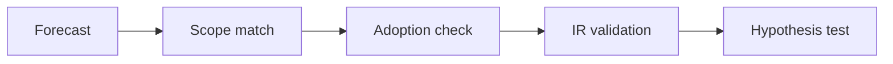

# AI Market Narrative Validation: Strong vs. Uncertain

## 1. Executive Summary

The AI market is often discussed as if everyone were measuring the same thing, but the sources do not measure the same layer. Gartner measures total AI spend, IDC measures AI infrastructure spend, Goldman Sachs frames the AI investment cycle, McKinsey measures adoption and value capture, and cloud-company IR tells us what is actually happening in capex and monetization. That means the first task is not comparing headline numbers, but normalizing scope, horizon, and denominator. <SourceNote>[Gartner's 2026 forecast](https://www.gartner.com/en/newsroom/press-releases/2026-05-19-gartner-forecasts-worldwide-ai-spending-to-grow-47-percent-in-2026) describes global AI spending, [IDC's 2026 outlook](https://www.idc.com/resource-center/blog/ai-infrastructure-spending-caps-historic-year-at-90-billion-in-q4-2025-2029-spending-to-eclipse-1-trillion/) describes AI infrastructure spend, [Goldman Sachs](https://www.goldmansachs.com/insights/articles/why-ai-companies-may-invest-more-than-500-billion-in-2026) frames the investment cycle, and [McKinsey](https://www.mckinsey.com/capabilities/quantumblack/our-insights/the-state-of-ai) focuses on adoption and value realization.</SourceNote>

The core conclusion is threefold. First, AI spending is real and still rising. Second, the spending remains concentrated in a small number of supply-side and infrastructure layers rather than spreading evenly across the whole economy. Third, it is risky to translate TAM or market-value estimates directly into profit opportunity. In practice, capex, RPO, backlog, AI revenue run rate, and retention are stronger signals than large market-size forecasts. <SourceNote>[Microsoft](https://www.microsoft.com/en-us/Investor/earnings/FY-2026-Q3/press-release-webcast), [Amazon](https://ir.aboutamazon.com/news-release/news-release-details/2026/Amazon.com-Announces-First-Quarter-Results/default.aspx), [Meta](https://investor.atmeta.com/investor-news/press-release-details/2026/Meta-Reports-First-Quarter-2026-Results/default.aspx), and [Alphabet](https://abc.xyz/investor/news/2026/alphabets-q1-2026-results/) show that AI spending is continuing as actual capital expenditure.</SourceNote>

1. Market-size numbers can look similar while meaning very different things.
2. Strong hypotheses are the ones confirmed by spending and adoption data in public disclosures.
3. Weak hypotheses are the ones that treat TAM size as a proxy for profit size.
4. To read the real story, prioritize capex, backlog, RPO, and retention over revenue slogans.
5. The most uncertain question is not whether AI will be used broadly, but whether it will be monetized broadly.

The diagram shows the basic workflow: do not accept a forecast as-is. Match definitions, check actual adoption, and then validate the claim against company reporting.

## 2. What Is Being Compared

Gartner, IDC, McKinsey, and Goldman Sachs are each looking at a different layer. Gartner's 2026 forecast puts worldwide AI spending at $2.59 trillion, up 47% year over year. IDC expects AI infrastructure spending to reach $487 billion in 2026 and to exceed $1 trillion by 2029, which is much closer to the physical stack of servers, storage, networking, and data centers. Goldman Sachs argues that AI company investment could exceed $500 billion in 2026 and that the next leg of the trade is more likely to be AI platform stocks and productivity beneficiaries than model names alone. <SourceNote>[Gartner](https://www.gartner.com/en/newsroom/press-releases/2026-05-19-gartner-forecasts-worldwide-ai-spending-to-grow-47-percent-in-2026) covers total spend, [IDC](https://www.idc.com/resource-center/blog/ai-infrastructure-spending-caps-historic-year-at-90-billion-in-q4-2025-2029-spending-to-eclipse-1-trillion/) covers infrastructure spend, and [Goldman Sachs](https://www.goldmansachs.com/insights/articles/why-ai-companies-may-invest-more-than-500-billion-in-2026) covers the investment cycle.</SourceNote>

McKinsey is different again. It is not a market-size forecast. It measures adoption and value realization. In its 2025 survey, 88% of organizations said they use AI in at least one function, 71% said they use generative AI, and 94% said they are not yet seeing significant value from their AI investments. In other words, adoption is broad, but monetization is still thin. That is the key fork in the narrative. <SourceNote>[McKinsey's State of AI](https://www.mckinsey.com/capabilities/quantumblack/our-insights/the-state-of-ai) separates adoption from value capture and shows how wide the value gap still is.</SourceNote>

The table below is a practical way to align these sources. It is a synthesis from public information, not an official industry taxonomy. <SourceNote>This comparison is synthesized from [Gartner](https://www.gartner.com/en/newsroom/press-releases/2026-05-19-gartner-forecasts-worldwide-ai-spending-to-grow-47-percent-in-2026), [IDC](https://www.idc.com/resource-center/blog/ai-infrastructure-spending-caps-historic-year-at-90-billion-in-q4-2025-2029-spending-to-eclipse-1-trillion/), [Goldman Sachs](https://www.goldmansachs.com/insights/articles/why-ai-companies-may-invest-more-than-500-billion-in-2026), [McKinsey](https://www.mckinsey.com/capabilities/quantumblack/our-insights/the-state-of-ai), and cloud-company IR.</SourceNote>

| Source | What it measures | Best use | Main caution |
| --- | --- | --- | --- |
| Gartner | Worldwide AI spending | Macro demand read | Broad scope does not equal profit pool |
| IDC | AI infrastructure spend | Physical buildout and bottlenecks | It underweights the service layer |
| Goldman Sachs | AI investment cycle | Capex and market narrative | Investment is not the same as earnings |
| McKinsey | Adoption and value realization | Enterprise reality check | Value capture is lagging adoption |
| Cloud-company IR | Actual capex and revenue | Highest-conviction evidence | Definitions differ by company |

## 3. Strong Hypotheses and Weak Hypotheses

The strongest hypothesis is that AI is an infrastructure-and-adoption cycle with real spending behind it. Gartner's total-spend forecast, IDC's infrastructure outlook, and the capex growth disclosed by major cloud companies all point in the same direction: the supply side is still investing. Microsoft said its AI business reached a $37 billion annualized revenue run rate in Q3 FY2026. Amazon said it secured more than 2.1 million AI chips over the past 12 months and plans to deploy more than 1 million NVIDIA GPUs starting in 2026. Alphabet raised its 2026 capex outlook to $180-190 billion, and Meta guided 2026 capex to $125-145 billion. <SourceNote>[Microsoft](https://www.microsoft.com/en-us/Investor/earnings/FY-2026-Q3/press-release-webcast) shows the AI revenue run rate, [Amazon](https://ir.aboutamazon.com/news-release/news-release-details/2026/Amazon-com-Announces-First-Quarter-Results/default.aspx) shows chip accumulation and GPU deployment, and [Alphabet](https://abc.xyz/investor/news/2026/alphabets-q1-2026-results/) plus [Meta](https://investor.atmeta.com/investor-news/press-release-details/2026/Meta-Reports-First-Quarter-2026-Results/default.aspx) show expanding capex.</SourceNote>

The weaker hypothesis is that large market-size figures can be read directly as profit opportunity. Gartner's $2.59 trillion and IDC's $1 trillion-plus outlook both matter, but they do not become public-company profits in a one-to-one way. Spend can rise while the margin pool still concentrates in cloud, chips, power equipment, or software. Goldman Sachs' emphasis on AI platform stocks and productivity beneficiaries is implicitly a recognition of that concentration. <SourceNote>[Gartner](https://www.gartner.com/en/newsroom/press-releases/2026-05-19-gartner-forecasts-worldwide-ai-spending-to-grow-47-percent-in-2026), [IDC](https://www.idc.com/resource-center/blog/ai-infrastructure-spending-caps-historic-year-at-90-billion-in-q4-2025-2029-spending-to-eclipse-1-trillion/), and [Goldman Sachs](https://www.goldmansachs.com/insights/articles/why-ai-companies-may-invest-more-than-500-billion-in-2026) together show both the size of the spend and the unevenness of the profit pool.</SourceNote>

An even weaker hypothesis is that high adoption automatically means strong monetization. McKinsey's survey says many organizations have started using AI, but very few are seeing significant value yet. That means AI usage and AI profit are still different questions. Mixing them up leads to overestimating the durability of demand. <SourceNote>[McKinsey](https://www.mckinsey.com/capabilities/quantumblack/our-insights/the-state-of-ai) shows the gap between usage and realized value.</SourceNote>

## 4. Demand Signals vs. Overhyped Signals

For decision-making, it is better to prioritize indicators that show actual usage and payback than to focus on flashy TAM numbers. In AI, benchmark scores and user counts are often highlighted, but they do not tell you whether revenue is durable. The metrics to watch are capex, RPO, backlog, AI revenue run rate, inference usage, and retention. <SourceNote>This indicator split follows the public disclosures from [Microsoft](https://www.microsoft.com/en-us/Investor/earnings/FY-2026-Q3/press-release-webcast), [Amazon](https://ir.aboutamazon.com/news-release/news-release-details/2026/Amazon-com-Announces-First-Quarter-Results/default.aspx), [Alphabet](https://abc.xyz/investor/news/2026/alphabets-q1-2026-results/), [Meta](https://investor.atmeta.com/investor-news/press-release-details/2026/Meta-Reports-First-Quarter-2026-Results/default.aspx), and [McKinsey](https://www.mckinsey.com/capabilities/quantumblack/our-insights/the-state-of-ai).</SourceNote>

| Overhyped signal | Demand signal |
| --- | --- |
| TAM | Capex |
| Model benchmarks | RPO / backlog |
| Demo quality | AI revenue run rate |
| Raw generation volume | Retention / stickiness |
| "AI-enabled" labeling | Payback period |

The point is simple: a large market is not the same thing as a profitable market. In AI market research, you should start with the indicators that connect directly to revenue and profit.

## 5. Bull Case and Bear Case

In the bull case, AI spending continues to compound as capex. Cloud companies keep investing in data centers, GPUs, networking, and power, while rising inference usage turns into higher monetization. Microsoft's AI revenue run rate, Amazon's chip accumulation, and the capex expansion at Alphabet and Meta are all consistent with that path. <SourceNote>[Microsoft](https://www.microsoft.com/en-us/Investor/earnings/FY-2026-Q3/press-release-webcast), [Amazon](https://ir.aboutamazon.com/news-release/news-release-details/2026/Amazon.com-Announces-First-Quarter-Results/default.aspx), [Alphabet](https://abc.xyz/investor/news/2026/alphabets-q1-2026-results/), and [Meta](https://investor.atmeta.com/investor-news/press-release-details/2026/Meta-Reports-First-Quarter-2026-Results/default.aspx) show that the supply side has not stopped investing.</SourceNote>

In the bear case, adoption broadens but monetization lags. McKinsey's survey suggests that many organizations are already using AI, but not many are realizing significant value. If that persists, the profits may remain concentrated in hardware suppliers and cloud operators while much of the application layer fails to generate the margins investors expect. Goldman Sachs' framing around AI platform stocks and productivity beneficiaries is already a sign that profit capture may be uneven. <SourceNote>[McKinsey](https://www.mckinsey.com/capabilities/quantumblack/our-insights/the-state-of-ai) shows the lag in value capture, and [Goldman Sachs](https://www.goldmansachs.com/insights/articles/why-ai-companies-may-invest-more-than-500-billion-in-2026) implies concentration in the winning layers.</SourceNote>

So the real bull-vs-bear divide is not whether AI will be used. It is which layer captures the profit. When you read market reports, the right question is not how large the forecast number is, but which layer of the stack the evidence actually supports.

## 6. Reading the evidence correctly

The least misleading way to read this theme is to do it in order.

1. First, check the definition. Market value, spending, and capex are not interchangeable.
2. Second, align the horizon. Do not compare a one-year forecast with a three-year estimate as if they were the same thing.
3. Third, look for evidence in company reporting. Capex, RPO, backlog, AI revenue, and retention are stronger than narrative claims.
4. Finally, assume profit concentration. The market can be large while profits remain concentrated in a small number of firms. <SourceNote>That reading follows naturally when [Gartner](https://www.gartner.com/en/newsroom/press-releases/2026-05-19-gartner-forecasts-worldwide-ai-spending-to-grow-47-percent-in-2026), [IDC](https://www.idc.com/resource-center/blog/ai-infrastructure-spending-caps-historic-year-at-90-billion-in-q4-2025-2029-spending-to-eclipse-1-trillion/), [McKinsey](https://www.mckinsey.com/capabilities/quantumblack/our-insights/the-state-of-ai), and [Goldman Sachs](https://www.goldmansachs.com/insights/articles/why-ai-companies-may-invest-more-than-500-billion-in-2026) are read together.</SourceNote>

The common mistake is to turn rising AI spend into a universal winner-take-all story. In practice, the strongest economics tend to sit either on the supply-constrained side or at the entry point of the workflow. For investors and operators, payback, adoption depth, and capital efficiency matter more than TAM.

## 7. Risks and Limits

This report is not investment advice. The classification here is a synthesis from public information, not an official roadmap. The AI market can change quickly because of falling model prices, overcapacity, power constraints, export controls, tighter regulation, or slower customer adoption. Even large capex numbers do not guarantee profits if payback is delayed. <SourceNote>The scale-and-concentration story needs to be read with [Gartner](https://www.gartner.com/en/newsroom/press-releases/2026-05-19-gartner-forecasts-worldwide-ai-spending-to-grow-47-percent-in-2026), [IDC](https://www.idc.com/resource-center/blog/ai-infrastructure-spending-caps-historic-year-at-90-billion-in-q4-2025-2029-spending-to-eclipse-1-trillion/), and [McKinsey](https://www.mckinsey.com/capabilities/quantumblack/our-insights/the-state-of-ai) together.</SourceNote>

Company disclosures also use different definitions. AI revenue run rate, capex, RPO, and backlog are useful, but they are not the same denominator. So the most important task is not ranking the companies' numbers, but understanding which layer of the economics each number is actually describing.

## References

- [Gartner, worldwide AI spending forecast for 2026](https://www.gartner.com/en/newsroom/press-releases/2026-05-19-gartner-forecasts-worldwide-ai-spending-to-grow-47-percent-in-2026)
- [IDC, AI infrastructure spending outlook for 2026 and 2029](https://www.idc.com/resource-center/blog/ai-infrastructure-spending-caps-historic-year-at-90-billion-in-q4-2025-2029-spending-to-eclipse-1-trillion/)
- [Goldman Sachs, AI investment outlook for 2026](https://www.goldmansachs.com/insights/articles/why-ai-companies-may-invest-more-than-500-billion-in-2026)
- [McKinsey, The state of AI](https://www.mckinsey.com/capabilities/quantumblack/our-insights/the-state-of-ai)
- [Microsoft Q3 FY2026 results](https://www.microsoft.com/en-us/Investor/earnings/FY-2026-Q3/press-release-webcast)
- [Amazon Q1 2026 results](https://ir.aboutamazon.com/news-release/news-release-details/2026/Amazon-com-Announces-First-Quarter-Results/default.aspx)
- [Meta Q1 2026 results](https://investor.atmeta.com/investor-news/press-release-details/2026/Meta-Reports-First-Quarter-2026-Results/default.aspx)
- [Alphabet Q1 2026 results](https://abc.xyz/investor/news/2026/alphabets-q1-2026-results/)
