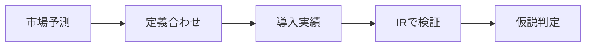

# AI市場調査のナラティブ検証: 強い仮説と不確実性

## 1. エグゼクティブサマリー

生成AIをめぐる市場レポートは、同じ「AI市場」を見ているようで、実は測っているものが違う。Gartnerは世界全体のAI支出、IDCはAIインフラ支出、Goldman SachsはAI投資サイクル、McKinseyは導入と価値実現、主要クラウド企業のIRは実際のcapexと収益化を見ている。したがって、数字の大小だけを並べても比較にはならない。まず、対象範囲、期間、分母をそろえる必要がある。<SourceNote>[Gartnerの2026年予測](https://www.gartner.com/en/newsroom/press-releases/2026-05-19-gartner-forecasts-worldwide-ai-spending-to-grow-47-percent-in-2026) は世界AI支出の見通しを示し、[IDCの2026年見通し](https://www.idc.com/resource-center/blog/ai-infrastructure-spending-caps-historic-year-at-90-billion-in-q4-2025-2029-spending-to-eclipse-1-trillion/) はAIインフラ支出を示す。[Goldman Sachs](https://www.goldmansachs.com/insights/articles/why-ai-companies-may-invest-more-than-500-billion-in-2026) は投資サイクルを、[McKinsey](https://www.mckinsey.com/capabilities/quantumblack/our-insights/the-state-of-ai) は導入と価値実現を確認している。</SourceNote>

本稿の結論は三つある。第一に、AI支出そのものは実在し、しかも増えている。第二に、ただしその支出は少数の供給側とインフラ側に濃く残りやすく、企業全体に均等には広がっていない。第三に、TAMや市場価値の話をそのまま利益機会と読み替えるのは危険である。実務では、capex、RPO、バックログ、AI収益、利用継続率の方が、派手な市場規模予測よりも強いシグナルになる。<SourceNote>[Microsoft](https://www.microsoft.com/en-us/Investor/earnings/FY-2026-Q3/press-release-webcast)、[Amazon](https://ir.aboutamazon.com/news-release/news-release-details/2026/Amazon-com-Announces-First-Quarter-Results/default.aspx)、[Meta](https://investor.atmeta.com/investor-news/press-release-details/2026/Meta-Reports-First-Quarter-2026-Results/default.aspx)、[Alphabet](https://abc.xyz/investor/news/2026/alphabets-q1-2026-results/) の各IRは、AI支出が実際の設備投資として続いていることを示す。</SourceNote>

1. 市場規模の数字は、同じ単位に見えても同じ意味ではない。
2. 強い仮説は、支出と導入がIRや公的資料で裏づけられるものだけである。
3. 弱い仮説は、TAMの大きさをそのまま利益の大きさとみなす読み方である。
4. 企業の本音を読むなら、売上よりもcapex、受注残、RPO、利用定着を優先して見るべきだ。
5. もっとも不確実なのは、AIが広く使われることではなく、広く利益化されるかどうかである。

この図は、予測値をそのまま受け取らず、定義合わせと実需確認を経て判断するための手順を示す。AI市場の議論では、ここを飛ばすと見かけの数字に引っ張られやすい。

## 2. 何を比べるのか

Gartner、IDC、McKinsey、Goldman Sachsは、それぞれ別のレイヤーを見ている。Gartnerの2026年予測は世界AI支出が2.59兆ドルに達し、前年比47%増になるというものだが、これはAIソフトウェア、サービス、インフラなどを含む広い支出の話である。IDCはAIインフラ支出が2026年に4,870億ドル、2029年に1兆ドル超になるとみており、こちらはサーバー、ストレージ、ネットワーク、データセンター系の物理層に近い。Goldman SachsはAI企業の投資が2026年に5000億ドル超に達しうると論じ、投資家が次に見るべき局面は、モデルそのものよりAIプラットフォーム株と生産性の受益者だと整理している。<SourceNote>[Gartner](https://www.gartner.com/en/newsroom/press-releases/2026-05-19-gartner-forecasts-worldwide-ai-spending-to-grow-47-percent-in-2026) は総支出、[IDC](https://www.idc.com/resource-center/blog/ai-infrastructure-spending-caps-historic-year-at-90-billion-in-q4-2025-2029-spending-to-eclipse-1-trillion/) はインフラ支出、[Goldman Sachs](https://www.goldmansachs.com/insights/articles/why-ai-companies-may-invest-more-than-500-billion-in-2026) は投資サイクルを扱っている。</SourceNote>

McKinseyはさらに違う。市場規模ではなく、導入率と価値実現を見ている。2025年の調査では、組織の88%が少なくとも1つの機能でAIを使い、71%が生成AIを使っている一方、94%はAI投資から有意な価値をまだ感じていない。別の言い方をすれば、導入は広がったが、利益化はまだ細い。ここが、投資ナラティブの最重要な分岐点だ。<SourceNote>[McKinseyのState of AI](https://www.mckinsey.com/capabilities/quantumblack/our-insights/the-state-of-ai) は導入率と価値実現を整理し、価値ギャップの大きさを示している。</SourceNote>

以下の表は、同じ「AI市場」でも、どのソースが何を測っているかを揃えるための比較である。これは公式な業界分類ではなく、公表情報からの推定である。<SourceNote>以下の分類は [Gartner](https://www.gartner.com/en/newsroom/press-releases/2026-05-19-gartner-forecasts-worldwide-ai-spending-to-grow-47-percent-in-2026)、[IDC](https://www.idc.com/resource-center/blog/ai-infrastructure-spending-caps-historic-year-at-90-billion-in-q4-2025-2029-spending-to-eclipse-1-trillion/)、[Goldman Sachs](https://www.goldmansachs.com/insights/articles/why-ai-companies-may-invest-more-than-500-billion-in-2026)、[McKinsey](https://www.mckinsey.com/capabilities/quantumblack/our-insights/the-state-of-ai)、各社IR を統合した整理である。</SourceNote>

| ソース | 何を測るか | 使いどころ | 注意点 |
| --- | --- | --- | --- |
| Gartner | 世界のAI支出 | マクロの需要感 | 広いので利益機会と直結しない |
| IDC | AIインフラ支出 | 物理設備と供給制約 | サービス層は薄くなる |
| Goldman Sachs | AI投資サイクル | capexと株式市場の物語 | 投資額と利益額は別物 |
| McKinsey | 導入率と価値実現 | 企業の採用実態 | 価値化は遅い |
| 主要クラウド企業 | 実際のcapexと売上 | 供給側の確度 | 会社ごとに定義が違う |

## 3. 強い仮説と弱い仮説

強い仮説は、AIが「支出を伴うインフラ・導入サイクル」だという見方である。Gartnerのような総支出予測、IDCのようなインフラ予測、そして各社IRのcapex増加は、少なくとも供給側の投資が続いていることを示している。MicrosoftはQ3 FY2026時点でAI事業の年率換算売上が370億ドルに達したとし、Amazonは過去12か月で210万台超のAIチップを確保し、2026年から100万台超のNVIDIA GPU展開を計画している。Alphabetは2026年のcapex見通しを1800億〜1900億ドルに引き上げ、Metaも2026年capexを1250億〜1450億ドルと案内している。<SourceNote>[Microsoft](https://www.microsoft.com/en-us/Investor/earnings/FY-2026-Q3/press-release-webcast) はAI事業の売上ランレートを示し、[Amazon](https://ir.aboutamazon.com/news-release/news-release-details/2026/Amazon.com-Announces-First-Quarter-Results/default.aspx) はAIチップ確保とGPU展開を示し、[Alphabet](https://abc.xyz/investor/news/2026/alphabets-q1-2026-results/) と [Meta](https://investor.atmeta.com/investor-news/press-release-details/2026/Meta-Reports-First-Quarter-2026-Results/default.aspx) はcapex拡大を示す。</SourceNote>

弱い仮説は、広い市場規模の数字をそのまま利益機会とみなす読み方である。たとえばGartnerの2.59兆ドルやIDCの1兆ドル超は、いずれもAIの重要性を示すが、そのまま上場企業の利益総額にはならない。支出が増えても、利益はクラウド、半導体、電力設備、ソフトウェアのどこかに偏る。Goldman Sachsが投資家の次の局面を「AIプラットフォーム株」と「生産性の受益者」に置いているのは、この偏在を前提にしている。<SourceNote>[Gartner](https://www.gartner.com/en/newsroom/press-releases/2026-05-19-gartner-forecasts-worldwide-ai-spending-to-grow-47-percent-in-2026)、[IDC](https://www.idc.com/resource-center/blog/ai-infrastructure-spending-caps-historic-year-at-90-billion-in-q4-2025-2029-spending-to-eclipse-1-trillion/)、[Goldman Sachs](https://www.goldmansachs.com/insights/articles/why-ai-companies-may-invest-more-than-500-billion-in-2026) を並べると、支出の拡大と利益の偏在が同時に見える。</SourceNote>

さらに弱い仮説は、導入率の高さがそのまま収益化を意味するという読み方である。McKinseyの調査は、組織の導入が進んでも、価値がまだ十分に取れていないことを示している。つまり、AIが使われることと、AIで稼げることは別問題である。ここを混同すると、実需の強さを過大評価しやすい。<SourceNote>[McKinsey](https://www.mckinsey.com/capabilities/quantumblack/our-insights/the-state-of-ai) は導入と価値実現のギャップを示している。</SourceNote>

## 4. 実需を示す指標と誇張されやすい指標

投資判断では、派手なTAMよりも、実際の利用と回収が見える指標を優先した方がよい。特にAIでは、モデルのベンチマークやユーザー数が強調されがちだが、それだけでは売上化の強さは分からない。見るべきなのは、capex、RPO、バックログ、AI売上ランレート、推論利用、継続率である。<SourceNote>この指標の切り分けは [Microsoft](https://www.microsoft.com/en-us/Investor/earnings/FY-2026-Q3/press-release-webcast)、[Amazon](https://ir.aboutamazon.com/news-release/news-release-details/2026/Amazon.com-Announces-First-Quarter-Results/default.aspx)、[Alphabet](https://abc.xyz/investor/news/2026/alphabets-q1-2026-results/)、[Meta](https://investor.atmeta.com/investor-news/press-release-details/2026/Meta-Reports-First-Quarter-2026-Results/default.aspx)、[McKinsey](https://www.mckinsey.com/capabilities/quantumblack/our-insights/the-state-of-ai) の読み合わせから得られる。</SourceNote>

| 誇張されやすい指標 | 実需を示す指標 |
| --- | --- |
| TAM | capex |
| モデルのベンチマーク | RPO / バックログ |
| デモの印象 | AI売上ランレート |
| 生成数や利用回数 | 継続率 / 定着率 |
| 「AI対応」表現 | 利用料の回収期間 |

この表の要点は単純である。大きい市場があることと、そこで儲かることは別である。AI市場の研究では、売上や利益に直接つながる実需指標を先に置くべきだ。

## 5. 強気シナリオと弱気シナリオ

強気シナリオでは、AI支出は引き続きcapexとして積み上がる。クラウド企業はデータセンター、GPU、ネットワーク、電力に投資を続け、推論利用の増加が収益化を押し上げる。MicrosoftのAI事業ランレート、AmazonのAIチップ確保、AlphabetとMetaのcapex拡大は、このシナリオと整合的である。<SourceNote>[Microsoft](https://www.microsoft.com/en-us/Investor/earnings/FY-2026-Q3/press-release-webcast)、[Amazon](https://ir.aboutamazon.com/news-release/news-release-details/2026/Amazon.com-Announces-First-Quarter-Results/default.aspx)、[Alphabet](https://abc.xyz/investor/news/2026/alphabets-q1-2026-results/)、[Meta](https://investor.atmeta.com/investor-news/press-release-details/2026/Meta-Reports-First-Quarter-2026-Results/default.aspx) は、少なくとも供給側が投資を止めていないことを示す。</SourceNote>

弱気シナリオでは、導入は広がっても利益化が遅れる。McKinseyの調査が示すように、多くの組織は使い始めていても、有意な価値はまだ取れていない。もしこの状態が長引けば、AI支出は大きくても、利益は一部のハードウェア供給者とクラウド事業者に集中し、アプリ層の多くは期待ほどの粗利を残せない。Goldman Sachsの読みが「AIプラットフォーム株」と「生産性の受益者」に収束しているのは、まさにこの偏りを前提にしている。<SourceNote>[McKinsey](https://www.mckinsey.com/capabilities/quantumblack/our-insights/the-state-of-ai) は価値実現の遅れを示し、[Goldman Sachs](https://www.goldmansachs.com/insights/articles/why-ai-companies-may-invest-more-than-500-billion-in-2026) は利益捕捉の集中を示唆している。</SourceNote>

つまり、強気か弱気かは「AIが普及するか」ではなく、「どの層が利益を取るか」で分かれる。市場レポートを読むときは、予測値の大きさではなく、どのレイヤーの仮説が実績で裏づくかを見るべきだ。

## 6. 推奨方針

実務では、次の順で読むと誤読を減らせる。

1. まず、数字の定義を確認する。市場価値、支出、capex、価値実現は同じではない。
2. 次に、期間をそろえる。1年予測と3年予測、あるいは長期の価値推定を同列に置かない。
3. その次に、IRで実需を確認する。capex、RPO、バックログ、AI売上、利用継続を優先する。
4. 最後に、利益の偏在を前提にする。市場は大きくても、利益は少数の企業に集まりやすい。<SourceNote>この読み方は [Gartner](https://www.gartner.com/en/newsroom/press-releases/2026-05-19-gartner-forecasts-worldwide-ai-spending-to-grow-47-percent-in-2026)、[IDC](https://www.idc.com/resource-center/blog/ai-infrastructure-spending-caps-historic-year-at-90-billion-in-q4-2025-2029-spending-to-eclipse-1-trillion/)、[McKinsey](https://www.mckinsey.com/capabilities/quantumblack/our-insights/the-state-of-ai)、[Goldman Sachs](https://www.goldmansachs.com/insights/articles/why-ai-companies-may-invest-more-than-500-billion-in-2026) を並べたときに自然に導かれる。</SourceNote>

このテーマで誤りやすいのは、AI支出の増加をそのまま広範な勝者総取りのシナリオにしてしまうことだ。実際には、勝ち筋は供給制約を握る側、あるいはワークフローの入口を握る側に偏りやすい。したがって、投資家や事業担当者は、TAMよりも回収可能性、導入の深さ、資本効率を重視した方がよい。

## 7. リスク・限界

本稿は投資助言ではない。また、ここでの分類は公式ロードマップではなく、公表情報からの推定である。AI市場は、モデル価格の低下、供給過剰、電力制約、輸出規制、規制強化、顧客の導入失速で簡単に姿を変える。特に、capexが大きくても、回収が遅れれば利益は残らない。<SourceNote>AI市場の支出拡大と価値の偏在については [Gartner](https://www.gartner.com/en/newsroom/press-releases/2026-05-19-gartner-forecasts-worldwide-ai-spending-to-grow-47-percent-in-2026)、[IDC](https://www.idc.com/resource-center/blog/ai-infrastructure-spending-caps-historic-year-at-90-billion-in-q4-2025-2029-spending-to-eclipse-1-trillion/)、[McKinsey](https://www.mckinsey.com/capabilities/quantumblack/our-insights/the-state-of-ai) をあわせて読む必要がある。</SourceNote>

また、企業IRの数値も定義がばらつく。AI売上ランレート、capex、RPO、バックログは便利だが、同じ土俵ではない。したがって、各社の数字を順位づけするより、どのレイヤーの経済性を見ているかを理解する方が重要である。

## 参考情報

- [Gartner, worldwide AI spending forecast for 2026](https://www.gartner.com/en/newsroom/press-releases/2026-05-19-gartner-forecasts-worldwide-ai-spending-to-grow-47-percent-in-2026)
- [IDC, AI infrastructure spending outlook for 2026 and 2029](https://www.idc.com/resource-center/blog/ai-infrastructure-spending-caps-historic-year-at-90-billion-in-q4-2025-2029-spending-to-eclipse-1-trillion/)
- [Goldman Sachs, AI investment outlook for 2026](https://www.goldmansachs.com/insights/articles/why-ai-companies-may-invest-more-than-500-billion-in-2026)
- [McKinsey, The state of AI](https://www.mckinsey.com/capabilities/quantumblack/our-insights/the-state-of-ai)
- [Microsoft Q3 FY2026 results](https://www.microsoft.com/en-us/Investor/earnings/FY-2026-Q3/press-release-webcast)
- [Amazon Q1 2026 results](https://ir.aboutamazon.com/news-release/news-release-details/2026/Amazon-com-Announces-First-Quarter-Results/default.aspx)
- [Meta Q1 2026 results](https://investor.atmeta.com/investor-news/press-release-details/2026/Meta-Reports-First-Quarter-2026-Results/default.aspx)
- [Alphabet Q1 2026 results](https://abc.xyz/investor/news/2026/alphabets-q1-2026-results/)
