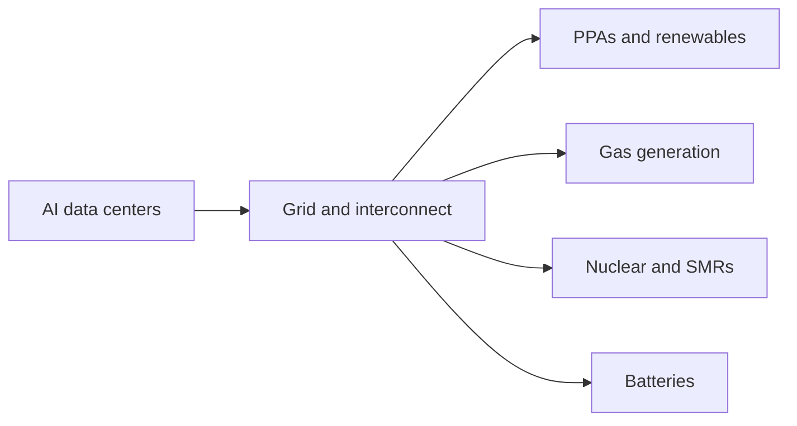

# Where AI Power and Energy Constraints Bite First

## 1. Executive Summary

AI power risk is not just a question of whether enough electricity exists. The real bottlenecks are the grid, substations, connection queues, cooling, operating rules, and power contracts that determine whether new load can actually come online. The IEA said in 2025 that data center electricity demand had already become a material share of global electricity demand, and it updated the picture in 2026 by saying demand surged again in 2025. In the United States, the EIA says large computing facilities will be a major driver of power demand growth through 2027. <SourceNote>[IEA, Energy and AI](https://www.iea.org/reports/energy-and-ai), [IEA, Data centre electricity use surged in 2025 even with tightening bottlenecks](https://www.iea.org/news/data-centre-electricity-use-surged-in-2025-even-with-tightening-bottlenecks-driving-a-scramble-for-solutions), and [U.S. EIA, electricity demand forecast 2026](https://www.eia.gov/outlooks/steo/) support this reading.</SourceNote>

The practical sequence is simple.

1. Grid and interconnection queues bite first.
2. Cooling and electrical equipment follow.
3. Then PPAs, renewables, nuclear, gas, and batteries come into play on different timelines.
4. The key question is therefore not which power source is best in the abstract, but which constraint each tool can solve, and when.

This report compares demand forecasts, regional grid constraints, PPAs, nuclear, gas, and storage so that AI companies, cloud providers, utilities, and policymakers can make decisions against a current evidence base. As a public-information inference, the near term favors grid gear, interconnection, cooling, and flexibility; the medium term favors PPAs and batteries; and the long term favors nuclear and large-scale transmission buildout. <SourceNote>[IEA, Powering Data Centres in the Age of AI](https://www.iea.org/reports/powering-data-centres-in-the-age-of-ai) and [IEA, Energy and AI](https://www.iea.org/reports/energy-and-ai) show that data center growth is a whole power-system issue. This is a public-information inference rather than an official roadmap.</SourceNote>

## 2. Demand Forecasts: How Fast Is Demand Rising?

The latest primary sources agree on direction even if their scopes differ. In 2025, the IEA estimated that global data center electricity demand was about 415 TWh in 2024, with scenarios that could push it above 1,000 TWh by 2030. In its 2026 update, the IEA said data center electricity use rose 17% in 2025 and that AI-oriented data center demand could roughly triple by 2030. <SourceNote>[IEA, Energy and AI](https://www.iea.org/reports/energy-and-ai) and [IEA, Data centre electricity use surged in 2025 even with tightening bottlenecks](https://www.iea.org/news/data-centre-electricity-use-surged-in-2025-even-with-tightening-bottlenecks-driving-a-scramble-for-solutions) are the underlying sources.</SourceNote>

For the United States, Lawrence Berkeley National Laboratory estimated that data centers consumed 176 TWh in 2023 and could reach 325 to 580 TWh by 2028. The EIA likewise says the strongest four-year growth in U.S. electricity demand since the early 2000s is being driven in large part by data centers and other large computing loads. This does not mean every country will look like the U.S., but that the U.S. is the clearest stress test for the current AI load cycle. <SourceNote>[LBNL, 2024 United States Data Center Energy Usage Report](https://eta-publications.lbl.gov/sites/default/files/2024-12/lbnl-2024-united-states-data-center-energy-usage-report_1.pdf) and [U.S. EIA, electricity demand forecast 2026](https://www.eia.gov/outlooks/steo/) support this comparison.</SourceNote>

| Source | Scope | Main signal |
| --- | --- | --- |
| IEA, Energy and AI | Global | Data center electricity demand was about 415 TWh in 2024 and could exceed 1,000 TWh by 2030. |
| IEA 2026 update | Global | Data center electricity use rose 17% in 2025, and AI data center demand could triple by 2030. |
| LBNL U.S. report | United States | U.S. data center electricity use was 176 TWh in 2023 and could reach 325 to 580 TWh by 2028. |
| EIA outlook | United States | A large share of near-term U.S. demand growth is tied to data centers and large computing facilities. |

These estimates are not directly comparable because the definitions differ. Still, they point in the same direction: AI demand keeps rising even when model efficiency improves, because usage, inference volume, agentic workloads, and data retention can offset gains. Efficiency helps, but it does not automatically cancel the total load story. <SourceNote>[IEA, Data centre electricity use surged in 2025 even with tightening bottlenecks](https://www.iea.org/news/data-centre-electricity-use-surged-in-2025-even-with-tightening-bottlenecks-driving-a-scramble-for-solutions) makes that point explicitly.</SourceNote>

## 3. What Actually Bottlenecks First

The center of gravity is the grid connection point, not the power plant. To add new AI load, a site needs transmission capacity, substations, transformers, protective equipment, permits, and community acceptance. NERC warned in 2025 that emerging large loads create new reliability risks for planning and operations. In ERCOT, large-load interconnection requests have grown so fast that the queue became a system-level issue. <SourceNote>[NERC, Characteristics and Risks of Emerging Large Loads](https://www.nerc.com/globalassets/who-we-are/standing-committees/rstc/3_doc_white-paper-characteristics-and-risks-of-emerging-large-loads.pdf) and [NERC, 2025 Long-Term Reliability Assessment](https://www.nerc.com/pa/RAPA/ra/Reliability%20Assessments%20DL/NERC_LTRA_2025.pdf) are the main references.</SourceNote>

IEA grid work says the bottleneck is now grid expansion itself: permitting is slow, build times are long, and power-system investment has to keep up with electrification, renewables, and data centers at the same time. In other words, even if new generation exists somewhere on the map, it may not be deliverable where AI demand is forming. The problem is physical deliverability, not just nameplate generation. <SourceNote>[IEA, Electricity 2026](https://www.iea.org/reports/electricity-2026) and [IEA, grids and secure energy transitions](https://www.iea.org/reports/grids-and-secure-energy-transitions) support this interpretation.</SourceNote>

Cooling matters for the same reason. High-density racks require liquid cooling, CDUs, and more localized redundancy. If the grid cannot energize the building, cooling upgrades do not matter; if the facility can be energized but cannot remove heat safely, the load still cannot run. Power risk is therefore closer to "power cannot be delivered in usable form" than to a simple shortage of generation. <SourceNote>[U.S. Department of Energy, DOE announces more efficient cooling for data centers](https://www.energy.gov/articles/doe-announces-40-million-more-efficient-cooling-data-centers) and [NREL, Warm-Water Liquid Cooling](https://www.nrel.gov/computational-science/warm-water-liquid-cooling.html) show why cooling becomes critical at high density.</SourceNote>

## 4. Regional Patterns

Regional patterns differ sharply. In the United States, the fastest growth is concentrated in existing large-load regions such as PJM, Virginia, and Texas. EIA expects data centers to account for a large share of near-term power demand growth, while NERC treats large-load interconnection as a reliability issue rather than a purely commercial one. <SourceNote>[U.S. EIA, electricity demand forecast 2026](https://www.eia.gov/outlooks/steo/) and [NERC, 2025 Long-Term Reliability Assessment](https://www.nerc.com/pa/RAPA/ra/Reliability%20Assessments%20DL/NERC_LTRA_2025.pdf) support that framing.</SourceNote>

Japan is responding differently. METI and MIC have been promoting "watt-bit" coordination, which treats power and communications planning as one integrated problem. A 2025 METI press release and 2026 ENECHO material both point to the same direction: siting, efficiency, and grid planning have to be designed together rather than handled separately. The point for Japan is not just to add electricity, but to redesign the geography of electricity and connectivity together. <SourceNote>[METI, Japan and U.S. agreed to launch the AI initiative by the next Leaders' Summit](https://www.meti.go.jp/english/press/2025/0612_001.html) and [ENECHO, data center electricity demand](https://www.enecho.meti.go.jp/about/special/johoteikyo/data_center2026.html) support this point.</SourceNote>

Europe is less homogeneous, but the same basic constraint appears there too: transmission capacity, permits, and siting are often harder than buying electricity on paper. The exact policy mix varies by country, but the common denominator is that connection is the scarce asset. <SourceNote>[IEA, Electricity 2026](https://www.iea.org/reports/electricity-2026) is the basis for this regional inference.</SourceNote>

## 5. Supply-Side Options: PPAs, Nuclear, Gas, and Batteries

### 5-1. PPAs and Renewables

The fastest mainstream answer is a renewable PPA, because it can finance new supply and help a buyer meet emissions goals. The IEA says renewables will provide a large share of the new electricity needed for data centers, and that technology companies made up a major share of corporate renewable PPAs in 2025. Google and Microsoft disclosures also show that long-term power procurement is now part of the data center growth model. <SourceNote>[IEA, Data centre electricity use surged in 2025 even with tightening bottlenecks](https://www.iea.org/news/data-centre-electricity-use-surged-in-2025-even-with-tightening-bottlenecks-driving-a-scramble-for-solutions), [Google, Responsible energy growth for our data centers](https://blog.google/outreach-initiatives/sustainability/responsible-energy-growth-for-our-data-centers/), and [Microsoft, Carbon negative by 2030 and data center energy procurement](https://blogs.microsoft.com/blog/2026/02/18/a-milestone-achievement-in-our-journey-to-carbon-negative/) support this section.</SourceNote>

PPAs are necessary, but they do not eliminate physical grid limits. A contract can be signed before a line is built, but the megawatts still have to travel through real wires. In that sense, PPAs solve procurement and financing, not interconnection by themselves. <SourceNote>[IEA, grids and secure energy transitions](https://www.iea.org/reports/grids-and-secure-energy-transitions) supports this distinction.</SourceNote>

### 5-2. Nuclear

Nuclear is being re-evaluated as long-duration firm power rather than as a quick fix. The IEA says the AI boom is reviving interest in nuclear, including life extensions, restarts, and SMRs. Google and Microsoft have both publicly linked advanced nuclear or restarted nuclear assets to the need for 24/7 clean power. <SourceNote>[IEA, Data centre electricity use surged in 2025 even with tightening bottlenecks](https://www.iea.org/news/data-centre-electricity-use-surged-in-2025-even-with-tightening-bottlenecks-driving-a-scramble-for-solutions), [Google, First advanced nuclear reactor project](https://blog.google/outreach-initiatives/sustainability/), and [Microsoft, carbon negative journey and nuclear energy](https://blogs.microsoft.com/blog/2026/02/18/a-milestone-achievement-in-our-journey-to-carbon-negative/) support this claim.</SourceNote>

The limitation is obvious: nuclear is slow. Permitting, construction, fuel, and politics all take time. That makes it a 2030s supply option, not a 2026 load-serving answer. In Japan, nuclear is therefore better understood as part of system-wide reliability and decarbonization planning than as a dedicated AI data center supply switch. <SourceNote>[IEA, Electricity 2026](https://www.iea.org/reports/electricity-2026) and [ENECHO, data center electricity demand](https://www.enecho.meti.go.jp/about/special/johoteikyo/data_center2026.html) support this interpretation.</SourceNote>

### 5-3. Gas Generation

Gas remains the fastest path to dispatchable power in many markets. The EIA says natural gas supply remains a critical input as data center demand expands in the U.S., and many AI-related backup or bridge projects still rely on gas because it can be deployed faster than large transmission or nuclear projects. The tradeoff is emissions, fuel-price exposure, and the risk that a bridge asset becomes stranded if policy tightens. <SourceNote>[U.S. EIA, electricity demand forecast 2026](https://www.eia.gov/outlooks/steo/) supports this reading.</SourceNote>

As a public-information inference, gas is most likely to be used as a bridge: it can help a site start operating before the clean firm supply stack is ready, but it is unlikely to be the long-term answer for every load center. <SourceNote>This is a public-information inference from [IEA, Energy and AI](https://www.iea.org/reports/energy-and-ai) and [IEA, Data centre electricity use surged in 2025 even with tightening bottlenecks](https://www.iea.org/news/data-centre-electricity-use-surged-in-2025-even-with-tightening-bottlenecks-driving-a-scramble-for-solutions).</SourceNote>

### 5-4. Batteries

Batteries are not a standalone solution for multi-day AI power demand, but they are useful for peak smoothing, short-duration backup, congestion relief, and demand-response integration. The IEA treats battery storage as a critical flexibility tool that can help balance renewables and large new loads. For AI data centers, the practical role is less "replace the grid" and more "buy time and flexibility." <SourceNote>[IEA, Electricity 2026](https://www.iea.org/reports/electricity-2026) and [IEA, Data centre electricity use surged in 2025 even with tightening bottlenecks](https://www.iea.org/news/data-centre-electricity-use-surged-in-2025-even-with-tightening-bottlenecks-driving-a-scramble-for-solutions) support this section.</SourceNote>

Batteries also have a limit: they are good at seconds, minutes, and sometimes hours, but not at replacing firm generation for continuous heavy loads. That means they should be read as the flexibility layer around the AI load stack, not as the core energy source. <SourceNote>[IEA, grids and secure energy transitions](https://www.iea.org/reports/grids-and-secure-energy-transitions) supports this limitation.</SourceNote>

## 6. What It Means for AI Companies, Cloud Providers, and Policymakers

For AI companies, the competitive issue is no longer just model quality. It is where to site data centers, how to sequence interconnections, when to sign PPAs, whether to add on-site power, and how much load flexibility can be engineered into the stack. For cloud providers, GPU procurement has to be managed together with transmission, land, cooling, and power contracts. <SourceNote>[IEA, Electricity 2026](https://www.iea.org/reports/electricity-2026) and [NERC, Characteristics and Risks of Emerging Large Loads](https://www.nerc.com/globalassets/who-we-are/standing-committees/rstc/3_doc_white-paper-characteristics-and-risks-of-emerging-large-loads.pdf) support this section.</SourceNote>

For policymakers, three issues matter most. First, interconnection queues need to be transparent and predictable. Second, flexible supply near demand centers has to expand, including batteries and other dispatchable resources. Third, data centers should not be handled as a standalone industrial category; they are infrastructure that interacts with telecom, land use, environmental permitting, and power policy at the same time. Japan's watt-bit coordination is a useful example of that integrated approach. <SourceNote>[METI, Japan and U.S. agreed to launch the AI initiative by the next Leaders' Summit](https://www.meti.go.jp/english/press/2025/0612_001.html) and [ENECHO, data center electricity demand](https://www.enecho.meti.go.jp/about/special/johoteikyo/data_center2026.html) support this point.</SourceNote>

## 7. The Overheated-Theme Risk

This theme can overheat easily. The reason is straightforward: power demand stories are vivid, but revenue from the necessary infrastructure arrives only after long delays. Markets can run ahead of the actual sequence of substations, lines, permits, construction, and fuel contracts. One common mistake is to treat announced capex as if it were already connected load. <SourceNote>[IEA, Data centre electricity use surged in 2025 even with tightening bottlenecks](https://www.iea.org/news/data-centre-electricity-use-surged-in-2025-even-with-tightening-bottlenecks-driving-a-scramble-for-solutions) and [U.S. EIA, electricity demand forecast 2026](https://www.eia.gov/outlooks/steo/) support that caution.</SourceNote>

Another risk is underestimating efficiency. Better model efficiency, inference optimization, liquid cooling, heat recovery, and demand response can all reduce electricity per task. But total energy use can still rise if demand grows faster than those gains. The theme is real, but the trade can still be crowded if investors and policymakers price in the story before the infrastructure is actually deliverable. <SourceNote>[IEA, Data centre electricity use surged in 2025 even with tightening bottlenecks](https://www.iea.org/news/data-centre-electricity-use-surged-in-2025-even-with-tightening-bottlenecks-driving-a-scramble-for-solutions) supports this point.</SourceNote>

## 8. Indicators to Watch

In practice, these indicators matter more than GPU counts or model announcements.

1. Substation and transmission build orders.
2. Interconnection queue changes and queue reform.
3. PPA tenor, price, additionality, and deliverability.
4. Nuclear restarts, life extensions, and SMR pilot progress.
5. Gas permitting and fuel contracts.
6. Battery and demand-response adoption.

If those move first, the AI boom is truly becoming a power infrastructure cycle. If only GPU procurement is strong and the power side does not move, the theme has not yet turned into deployable capacity. <SourceNote>[IEA, Powering Data Centres in the Age of AI](https://www.iea.org/reports/powering-data-centres-in-the-age-of-ai) and [NERC, 2025 Long-Term Reliability Assessment](https://www.nerc.com/pa/RAPA/ra/Reliability%20Assessments%20DL/NERC_LTRA_2025.pdf) support this final takeaway.</SourceNote>

## References

- [IEA, Energy and AI](https://www.iea.org/reports/energy-and-ai)
- [IEA, Data centre electricity use surged in 2025 even with tightening bottlenecks](https://www.iea.org/news/data-centre-electricity-use-surged-in-2025-even-with-tightening-bottlenecks-driving-a-scramble-for-solutions)
- [IEA, Electricity 2026](https://www.iea.org/reports/electricity-2026)
- [IEA, Powering Data Centres in the Age of AI](https://www.iea.org/reports/powering-data-centres-in-the-age-of-ai)
- [IEA, grids and secure energy transitions](https://www.iea.org/reports/grids-and-secure-energy-transitions)
- [LBNL, 2024 United States Data Center Energy Usage Report](https://eta-publications.lbl.gov/sites/default/files/2024-12/lbnl-2024-united-states-data-center-energy-usage-report_1.pdf)
- [U.S. EIA, outlooks](https://www.eia.gov/outlooks/steo/)
- [NERC, Characteristics and Risks of Emerging Large Loads](https://www.nerc.com/globalassets/who-we-are/standing-committees/rstc/3_doc_white-paper-characteristics-and-risks-of-emerging-large-loads.pdf)
- [NERC, 2025 Long-Term Reliability Assessment](https://www.nerc.com/pa/RAPA/ra/Reliability%20Assessments%20DL/NERC_LTRA_2025.pdf)
- [METI, Japan and U.S. agreed to launch the AI initiative by the next Leaders' Summit](https://www.meti.go.jp/english/press/2025/0612_001.html)
- [ENECHO, data center electricity demand](https://www.enecho.meti.go.jp/about/special/johoteikyo/data_center2026.html)
- [Google, sustainability and data centers](https://blog.google/outreach-initiatives/sustainability/)
