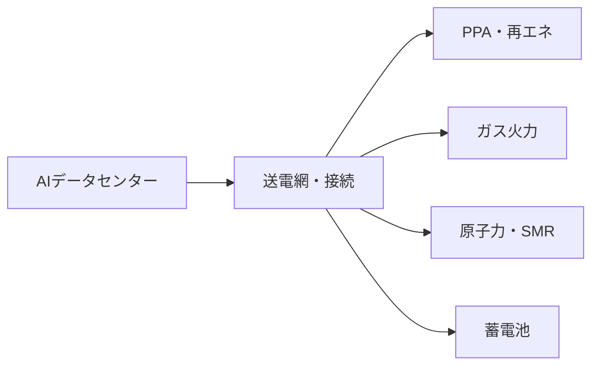

# AIブームにおける電力・エネルギー制約はどこで詰まるか

## 1. エグゼクティブサマリー

AIブームの電力問題は、単純に「発電量が足りるか」だけではない。実際には、送電網、変電設備、接続許認可、冷却、系統運用、電源の契約条件が同時に制約になる。IEA は 2025 年の時点で、データセンターの電力需要がすでに世界電力需要の意味ある割合になっており、2025 年にはさらに加速したと整理した。米国では EIA が、データセンターと大規模計算施設が 2027 年までの電力需要増加の主因になると見ている。<SourceNote>[IEA, Energy and AI](https://www.iea.org/reports/energy-and-ai)、[IEA, Data centre electricity use surged in 2025 even with tightening bottlenecks](https://www.iea.org/news/data-centre-electricity-use-surged-in-2025-even-with-tightening-bottlenecks-driving-a-scramble-for-solutions)、[U.S. EIA, electricity demand forecast 2026](https://www.eia.gov/outlooks/steo/) を参照した。</SourceNote>

結論を先に言うと、AI データセンターのエネルギー制約は次の順で現れやすい。

1. 送電網と接続待ちが最初に詰まる。
2. 次に、冷却と受電設備が追いつかなくなる。
3. その後、PPA で確保した再エネ、原子力の再評価、ガス火力、蓄電がそれぞれ別の時間軸で必要になる。
4. したがって、「何が一番良い電源か」ではなく、「どの制約を、いつ、どの手段で解くか」が実務上の論点になる。

このレポートは、AI 企業、クラウド事業者、電力会社、政策当局の意思決定を助けるために、需要見通し、地域別の送電網制約、PPA、原子力、ガス火力、蓄電を比較する。公表情報からの推定としては、短期は送電網・受電・冷却、 中期は PPA と蓄電、長期は原子力と大規模系統増強が効きやすい。<SourceNote>[IEA, Powering Data Centres in the Age of AI](https://www.iea.org/reports/powering-data-centres-in-the-age-of-ai) と [IEA, Energy and AI](https://www.iea.org/reports/energy-and-ai) は、データセンター需要の増加が電力システム全体の問題だと示している。これは公表情報からの推定であり、公式ロードマップではない。</SourceNote>

## 2. 需要見通し: 何がどのくらい増えるか

最新の一次情報を並べると、AI 関連の電力需要は「増えるかどうか」ではなく「どの速さで増えるか」が論点になっている。IEA は 2025 年のレポートで、世界のデータセンター電力需要が 2024 年に約 415 TWh だったと示し、2030 年には 1,000 TWh を超えるシナリオを提示した。2026 年の IEA の更新では、データセンター電力使用が 2025 年に 17% 増え、AI 向け施設の需要は 2030 年までにおよそ 3 倍になるとされた。<SourceNote>[IEA, Energy and AI](https://www.iea.org/reports/energy-and-ai) と [IEA, Data centre electricity use surged in 2025 even with tightening bottlenecks](https://www.iea.org/news/data-centre-electricity-use-surged-in-2025-even-with-tightening-bottlenecks-driving-a-scramble-for-solutions) に基づく。</SourceNote>

米国については、LBNL が 2024 年末に公表したレポートで、2023 年のデータセンター電力消費を 176 TWh と推定し、2028 年には 325 〜 580 TWh に達しうるとした。EIA も、2026 年の電力見通しで、今後の需要増のかなりの部分がデータセンターと大規模計算施設に由来すると見ている。つまり、地域によって差はあるが、少なくとも米国ではデータセンターが系統計画の主役になりつつある。<SourceNote>[LBNL, 2024 United States Data Center Energy Usage Report](https://eta-publications.lbl.gov/sites/default/files/2024-12/lbnl-2024-united-states-data-center-energy-usage-report_1.pdf) と [U.S. EIA, electricity demand forecast 2026](https://www.eia.gov/outlooks/steo/) を参照した。</SourceNote>

| 資料 | スコープ | 主な示唆 |
| --- | --- | --- |
| IEA, Energy and AI | 世界 | 2024 年のデータセンター需要は約 415 TWh。2030 年は 1,000 TWh 超の可能性。 |
| IEA, 2026 update | 世界 | 2025 年のデータセンター電力使用は 17% 増。AI 向け需要は 2030 年までに約 3 倍。 |
| LBNL, 2024 U.S. report | 米国 | 2023 年は 176 TWh。2028 年には 325 〜 580 TWh。 |
| EIA, 2026 outlook | 米国 | 今後の需要増の大きな部分をデータセンターが占める。 |

これらの数字は前提と定義が違うので、単純比較はできない。ただし方向は一致している。AI の電力需要は、モデル効率が改善しても、利用量、推論回数、エージェント実行、データ保持の増加で相殺されやすい。したがって、効率改善だけで問題が自然解決する前提は危うい。<SourceNote>[IEA, Data centre electricity use surged in 2025 even with tightening bottlenecks](https://www.iea.org/news/data-centre-electricity-use-surged-in-2025-even-with-tightening-bottlenecks-driving-a-scramble-for-solutions) は、効率改善が進んでも総需要はなお増えうると示している。</SourceNote>

## 3. どこで詰まるか: 送電網、変電、接続、冷却

電力制約の中心は発電所ではなく、系統接続の現場にある。新しい負荷を接続するには、送電線、変電所、変圧器、保護装置、許認可、そして地域の住民合意が必要になる。NERC は 2025 年の Emerging Large Loads に関する白書で、大規模負荷の接続が系統運用と計画の両面で新しいリスクになると警告した。ERCOT では大規模負荷の接続申請が急増し、2025 年春時点で非常に大きな待ち行列が形成されている。<SourceNote>[NERC, Characteristics and Risks of Emerging Large Loads](https://www.nerc.com/globalassets/who-we-are/standing-committees/rstc/3_doc_white-paper-characteristics-and-risks-of-emerging-large-loads.pdf) と [NERC, 2025 Long-Term Reliability Assessment](https://www.nerc.com/pa/RAPA/ra/Reliability%20Assessments%20DL/NERC_LTRA_2025.pdf) を参照した。</SourceNote>

IEA のグリッド報告は、送電網の拡張が再エネ、産業電化、データセンター、EV を同時に支える必要がある一方、許認可と建設が遅いことを問題の核心に挙げている。要するに、AI 向け需要が増えても、すぐに新しい受電点は増えない。これは発電量の問題ではなく、物理的な接続能力の問題である。<SourceNote>[IEA, Electricity 2026](https://www.iea.org/reports/electricity-2026) と [IEA, grids and secure energy transitions](https://www.iea.org/reports/grids-and-secure-energy-transitions) に基づく。</SourceNote>

冷却も同じくらい重要だ。高密度ラックでは空冷だけでなく、液冷、CDU、熱交換器、局所的な冗長化が必要になる。送電網が足りなければ何も動かず、冷却が足りなければ動かせるはずの設備も停止する。電力制約は「発電が足りない」より、「使える形で届かない」ことに近い。<SourceNote>[U.S. Department of Energy, DOE announces more efficient cooling for data centers](https://www.energy.gov/articles/doe-announces-40-million-more-efficient-cooling-data-centers) と [NREL, Warm-Water Liquid Cooling](https://www.nrel.gov/computational-science/warm-water-liquid-cooling.html) は、高密度データセンターで冷却効率が主要課題になることを示している。</SourceNote>

## 4. 地域別の制約

地域差は大きい。米国では、需要の急増がまず既存の大負荷地域に集中する。特に PJM、Virginia、Texas では、電力需要の伸びがデータセンターの立地と重なりやすく、送電網と変電設備のボトルネックが前面に出る。EIA は、米国の電力需要増のかなりの部分がこうした大規模計算負荷に由来すると見ており、NERC も大規模負荷の接続を信頼度リスクとして扱っている。<SourceNote>[U.S. EIA, electricity demand forecast 2026](https://www.eia.gov/outlooks/steo/) と [NERC, 2025 Long-Term Reliability Assessment](https://www.nerc.com/pa/RAPA/ra/Reliability%20Assessments%20DL/NERC_LTRA_2025.pdf) を参照した。</SourceNote>

日本では、経産省と総務省が進める「ワット・ビット連携」が象徴的である。2025 年の METI 英文発表は、データセンターと通信を一体で考える政策枠組みを示した。2026 年の経産省紹介記事では、データセンターの省エネや立地分散の重要性が改めて強調されている。日本の含意は、電源を単独で増やすより、需要地・通信網・送電線をまとめて設計する必要がある、という点にある。<SourceNote>[METI, Japan and U.S. agreed to launch the AI initiative by the next Leaders' Summit](https://www.meti.go.jp/english/press/2025/0612_001.html) と [ENECHO, データセンターの電力需要](https://www.enecho.meti.go.jp/about/special/johoteikyo/data_center2026.html) を参照した。</SourceNote>

欧州では、需要の伸びは米国ほど急ではない地域もあるが、送電容量不足、許認可、立地制約はより早く顕在化しやすい。EU や英国では、新設発電よりもまず、系統増強、需要応答、蓄電、既存負荷との調整が優先されやすい。ここでは各国の電源構成が違うため一枚岩ではないが、「電力があるか」より「接続できるか」が共通の制約である。<SourceNote>[IEA, Electricity 2026](https://www.iea.org/reports/electricity-2026) に基づく地域別の整理である。</SourceNote>

## 5. 供給側の選択肢: PPA、原子力、ガス火力、蓄電

### 5-1. PPA と再エネ

最も実務的なのは、再エネの PPA を使って新規電源を呼び込む方法である。IEA は 2026 年の更新で、データセンター需要の増加分のかなりの部分を再エネが賄う見込みを示し、技術企業が企業向け再エネ PPA の大きな割合を占めると整理した。Google や Microsoft の公開情報も、長期の電力調達契約がデータセンターの成長条件になっていることを裏づける。<SourceNote>[IEA, Data centre electricity use surged in 2025 even with tightening bottlenecks](https://www.iea.org/news/data-centre-electricity-use-surged-in-2025-even-with-tightening-bottlenecks-driving-a-scramble-for-solutions)、[Google, Responsible energy growth for our data centers](https://blog.google/outreach-initiatives/sustainability/responsible-energy-growth-for-our-data-centers/)、[Microsoft, Carbon negative by 2030 and data center energy procurement](https://blogs.microsoft.com/blog/2026/02/18/a-milestone-achievement-in-our-journey-to-carbon-negative/) を参照した。</SourceNote>

ただし、PPA は会計上の再エネ調達を助けても、送電網の物理制約は消さない。電源は契約できても、同じ地域に送る線がなければ動かない。したがって、PPA は必要条件であって十分条件ではない。<SourceNote>[IEA, grids and secure energy transitions](https://www.iea.org/reports/grids-and-secure-energy-transitions) に基づく。</SourceNote>

### 5-2. 原子力

原子力は、データセンターにとって「すぐ使える電源」ではないが、「長期の firm power」として再評価されている。IEA は 2026 年の更新で、AI ブームが原子力の再評価を促しているとし、SMR や既存炉の再稼働・延命が議論の中心になっていると述べた。Google や Microsoft の公開情報は、企業側が 24 時間 365 日の脱炭素電源を求めていることを示す。<SourceNote>[IEA, Data centre electricity use surged in 2025 even with tightening bottlenecks](https://www.iea.org/news/data-centre-electricity-use-surged-in-2025-even-with-tightening-bottlenecks-driving-a-scramble-for-solutions)、[Google, First advanced nuclear reactor project](https://blog.google/outreach-initiatives/sustainability/)、[Microsoft, carbon negative journey and nuclear energy](https://blogs.microsoft.com/blog/2026/02/18/a-milestone-achievement-in-our-journey-to-carbon-negative/) を参照した。</SourceNote>

ただし、原子力は立地、許認可、建設、燃料調達、政治リスクのどれを取っても時間がかかる。短期の電力不足を埋める手段というより、2030 年代を見た供給確保の選択肢である。日本でも、原子力は需要地の近くに新設するというより、既存設備の活用と系統全体の安定化の文脈で再評価される。<SourceNote>[IEA, Electricity 2026](https://www.iea.org/reports/electricity-2026) と [ENECHO, データセンターの電力需要](https://www.enecho.meti.go.jp/about/special/johoteikyo/data_center2026.html) を参照した。</SourceNote>

### 5-3. ガス火力

ガス火力は、最も速く firm な電力を追加しやすい手段として残る。EIA は、米国の需要増の中で天然ガス供給の重要性を改めて指摘している。データセンター企業の中には、系統接続待ちを回避するためにオンサイト発電やガス設備を検討する例があるが、燃料価格、排出、許認可、長期契約の重さがある。<SourceNote>[U.S. EIA, electricity demand forecast 2026](https://www.eia.gov/outlooks/steo/) に基づく。</SourceNote>

公表情報からの推定として、ガスは「つなぐまでの橋」として使われやすいが、永続解ではない。AI 需要が長期にわたって伸びるほど、ガスだけで全部を賄うのは政策的にも市場的にも難しくなる。<SourceNote>これは [IEA, Energy and AI](https://www.iea.org/reports/energy-and-ai) と [IEA, Data centre electricity use surged in 2025 even with tightening bottlenecks](https://www.iea.org/news/data-centre-electricity-use-surged-in-2025-even-with-tightening-bottlenecks-driving-a-scramble-for-solutions) からの公表情報からの推定である。</SourceNote>

### 5-4. 蓄電

蓄電は、単独でデータセンター全体を支えるというより、接続待ちの緩和、短時間のピーク平滑化、需給調整、停電対策に効く。IEA は、蓄電池が再エネと需要増をつなぐ中間的な役割を持ちうると整理している。AI データセンターでは、短時間の UPS だけでは足りず、系統側の蓄電や需要応答と組み合わせる方向が強まる。<SourceNote>[IEA, Electricity 2026](https://www.iea.org/reports/electricity-2026) と [IEA, Data centre electricity use surged in 2025 even with tightening bottlenecks](https://www.iea.org/news/data-centre-electricity-use-surged-in-2025-even-with-tightening-bottlenecks-driving-a-scramble-for-solutions) を参照した。</SourceNote>

蓄電の限界も明確である。短時間の平滑化には強いが、数日単位の連続運転を代替するには高コストで、エネルギー密度も足りない。したがって、蓄電は単体の電源というより、再エネ、ガス、送電網の調整弁として読む方が正しい。<SourceNote>[IEA, grids and secure energy transitions](https://www.iea.org/reports/grids-and-secure-energy-transitions) に基づく。</SourceNote>

## 6. AI企業・クラウド・政策が見るべき制約

AI 企業にとって重要なのは、モデル性能そのものより、電力の確保方法である。具体的には、どの地域に建てるか、どの接続順序で増やすか、PPA をいつ締結するか、オンサイト電源を入れるか、負荷をどこまで平準化できるかが競争力になる。クラウド事業者は、GPU 調達だけでなく、送電網、用地、冷却、電力契約を一体で管理する必要がある。<SourceNote>[IEA, Electricity 2026](https://www.iea.org/reports/electricity-2026) と [NERC, Characteristics and Risks of Emerging Large Loads](https://www.nerc.com/globalassets/who-we-are/standing-committees/rstc/3_doc_white-paper-characteristics-and-risks-of-emerging-large-loads.pdf) を参照した。</SourceNote>

政策当局にとっての論点は三つある。第一に、系統接続の透明化と順番待ちの可視化である。第二に、需要地の近くで使える柔軟な電源と蓄電を増やすことである。第三に、データセンターを通信網、土地利用、環境規制、産業政策と分けて考えず、統合して扱うことである。日本の「ワット・ビット連携」は、この統合設計の方向を示している。<SourceNote>[METI, Japan and U.S. agreed to launch the AI initiative by the next Leaders' Summit](https://www.meti.go.jp/english/press/2025/0612_001.html) と [ENECHO, データセンターの電力需要](https://www.enecho.meti.go.jp/about/special/johoteikyo/data_center2026.html) を参照した。</SourceNote>

## 7. 過熱テーマとしてのリスク

このテーマは過熱しやすい。理由は単純で、電力需要の話は派手だが、実際に売上になるまでの時間差が長いからである。市場では「AI データセンター需要が増える」というストーリーが先に走り、変電設備、送電網増強、許認可、建設、燃料手当てが後から追いかける。ここで投資家が見誤りやすいのは、発表された capex と実際に接続された負荷を同一視することだ。<SourceNote>[IEA, Data centre electricity use surged in 2025 even with tightening bottlenecks](https://www.iea.org/news/data-centre-electricity-use-surged-in-2025-even-with-tightening-bottlenecks-driving-a-scramble-for-solutions) と [EIA, electricity demand forecast 2026](https://www.eia.gov/outlooks/steo/) を参照した。</SourceNote>

もう一つのリスクは、効率改善を過小評価することだ。モデル効率、推論最適化、スケジューリング、液冷、熱回収、需要応答が進めば、単位計算あたりの電力は下がる。ただし、総使用量は別問題であり、利用者が増えれば全体はまだ伸びうる。だから、テーマとしては強いが、足元の株価や政策期待が先行しすぎると危険である。<SourceNote>[IEA, Data centre electricity use surged in 2025 even with tightening bottlenecks](https://www.iea.org/news/data-centre-electricity-use-surged-in-2025-even-with-tightening-bottlenecks-driving-a-scramble-for-solutions) に基づく。</SourceNote>

## 8. 監視すべき指標

実務では、GPU 台数やモデルの発表より、以下を追う方が早い。

1. 変電所、変圧器、送電線の発注と工事進捗
2. 接続待ちリストと系統接続ルールの変更
3. PPA の長さ、価格、追加性、送電距離
4. 原子力の再稼働、延命、SMR の実証進捗
5. ガス設備の許認可と燃料契約
6. 蓄電池と需要応答の採用状況

これらが先に動けば、AI ブームは「計算需要」から「電力インフラ需要」へと本当に変わり始めていると読める。逆に、GPU 調達だけが盛り上がって接続と電源が動かないなら、テーマはまだ実需化していない。<SourceNote>[IEA, Powering Data Centres in the Age of AI](https://www.iea.org/reports/powering-data-centres-in-the-age-of-ai) と [NERC, 2025 Long-Term Reliability Assessment](https://www.nerc.com/pa/RAPA/ra/Reliability%20Assessments%20DL/NERC_LTRA_2025.pdf) に基づく。</SourceNote>

## 参考情報

- [IEA, Energy and AI](https://www.iea.org/reports/energy-and-ai)
- [IEA, Data centre electricity use surged in 2025 even with tightening bottlenecks](https://www.iea.org/news/data-centre-electricity-use-surged-in-2025-even-with-tightening-bottlenecks-driving-a-scramble-for-solutions)
- [IEA, Electricity 2026](https://www.iea.org/reports/electricity-2026)
- [IEA, Powering Data Centres in the Age of AI](https://www.iea.org/reports/powering-data-centres-in-the-age-of-ai)
- [IEA, grids and secure energy transitions](https://www.iea.org/reports/grids-and-secure-energy-transitions)
- [LBNL, 2024 United States Data Center Energy Usage Report](https://eta-publications.lbl.gov/sites/default/files/2024-12/lbnl-2024-united-states-data-center-energy-usage-report_1.pdf)
- [U.S. EIA, outlooks](https://www.eia.gov/outlooks/steo/)
- [NERC, Characteristics and Risks of Emerging Large Loads](https://www.nerc.com/globalassets/who-we-are/standing-committees/rstc/3_doc_white-paper-characteristics-and-risks-of-emerging-large-loads.pdf)
- [NERC, 2025 Long-Term Reliability Assessment](https://www.nerc.com/pa/RAPA/ra/Reliability%20Assessments%20DL/NERC_LTRA_2025.pdf)
- [METI, Japan and U.S. agreed to launch the AI initiative by the next Leaders' Summit](https://www.meti.go.jp/english/press/2025/0612_001.html)
- [ENECHO, データセンターの電力需要](https://www.enecho.meti.go.jp/about/special/johoteikyo/data_center2026.html)
- [Google, sustainability and data centers](https://blog.google/outreach-initiatives/sustainability/)
