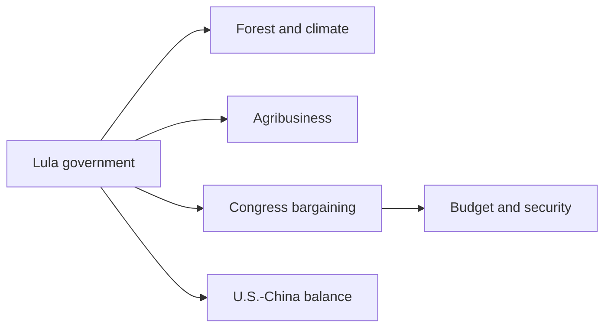
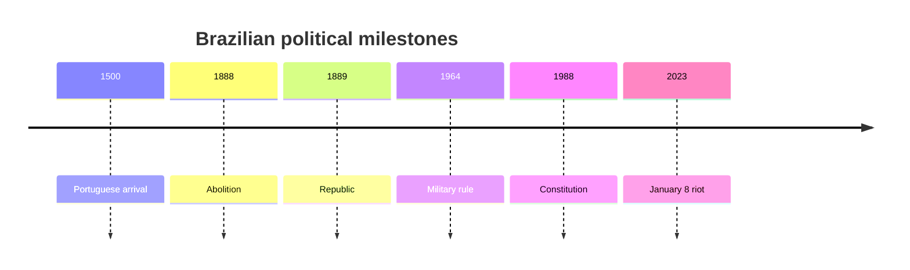
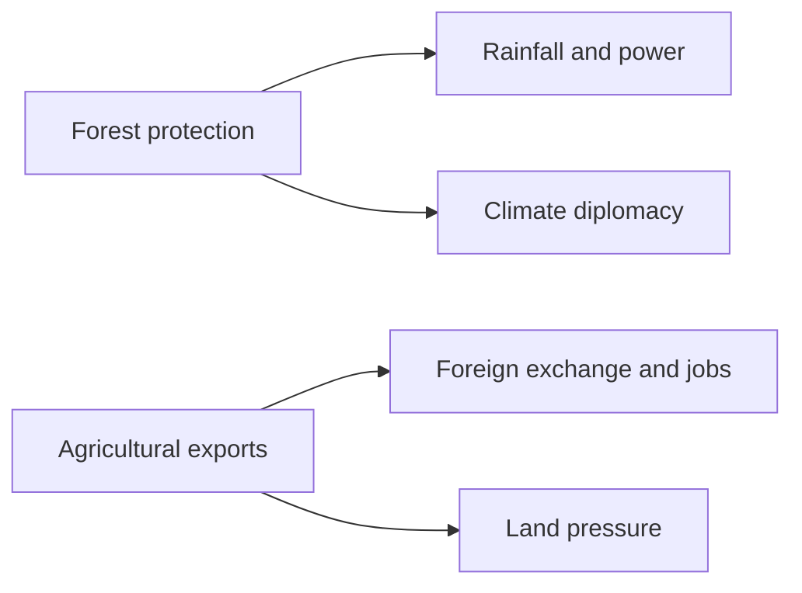
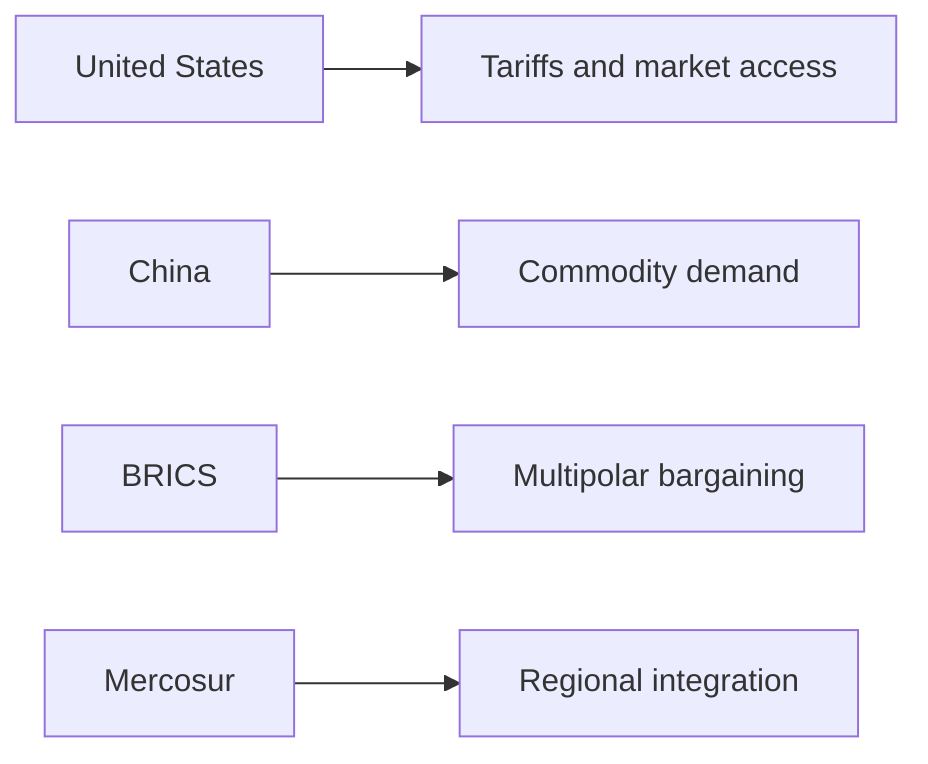

# Between Forest and Granary: Brazil Geopolitical Profile 2026

## 1. Executive Summary

Brazil is a federal presidential state of more than 205.3 million people and more than 8.5 million square kilometres, where Amazon protection, agribusiness, BRICS diplomacy, and urban security all sit on the same cabinet agenda. <SourceNote>[World Bank, Brazil overview](https://www.worldbank.org/en/country/brazil/overview) and [President of Brazil](https://en.wikipedia.org/wiki/President_of_Brazil)</SourceNote>

Lula’s government speaks the language of climate diplomacy and social inclusion, but a fragmented Congress, a strong judiciary, military memory, and deep inequality keep cutting back what the executive can do. <SourceNote>[Brazilian National Congress](https://en.wikipedia.org/wiki/National_Congress_of_Brazil), [Supreme Federal Court](https://en.wikipedia.org/wiki/Supreme_Federal_Court), and [January 8 attack on the Brazilian Congress, Planalto Palace and Supreme Federal Court](https://apnews.com/article/brazil-riot-jair-bolsonaro-lula-51b4d67f7b5e5ad0c9a0d4bb1f6d24b3)</SourceNote>

Do not read Brazil as if it were only a left-wing government.

Forest, grain, minerals, ports, urban violence, and the federal budget all interact, and they shape how Brasília handles the United States, China, and South America.

## 2. Historical and Institutional Frame

The current order sits on top of colonisation, empire, slavery, abolition in 1888, the republic in 1889, the 1964 military coup, the 1988 constitution, and the January 8, 2023 riot. <SourceNote>[Brazil](https://en.wikipedia.org/wiki/Brazil) and [Lei Áurea](https://en.wikipedia.org/wiki/Lei_%C3%81urea)</SourceNote>

That memory left trust in the state and suspicion of the state at the same time.

Brazil’s political history is also a history of a strong state living with deep inequality.

Abolition did not mean a quick social reset.

Racial hierarchy, land concentration, urban peripheries, and the gap between the northeast and the southeast still bend the electoral map.

## 3. Political System and Power Balance

Brazil’s political system is built around a directly elected president, a bicameral National Congress, a Supreme Federal Court that acts as a constitutional court, and a federation split into states and a federal district. <SourceNote>[Brazilian National Congress](https://en.wikipedia.org/wiki/National_Congress_of_Brazil), [Supreme Federal Court](https://en.wikipedia.org/wiki/Supreme_Federal_Court), and [Brazilian federal government](https://en.wikipedia.org/wiki/Federal_government_of_Brazil)</SourceNote>

The president has agenda-setting power, but laws, budgets, appointments, and executive implementation all need some level of legislative and judicial consent.

By 2026, Lula’s government is negotiating with a legislature that has weak party discipline and has to face the farm bloc, religious conservatives, security hawks, and fiscal hardliners at the same time. <SourceNote>[President of Brazil](https://en.wikipedia.org/wiki/President_of_Brazil) and [Politics of Brazil](https://en.wikipedia.org/wiki/Politics_of_Brazil)</SourceNote>

The governing partner is not a single party, but a shifting mix of centrist lawmakers and state-level interests.

It is a shifting mix of centrist lawmakers and state-level interests.

The Supreme Federal Court is seen as the last line of defence for elections and democracy, but the more politics judicialises, the more conflicts move into the court.

After January 8, 2023, the military became more cautious about returning to the centre of politics. <SourceNote>[AP, January 8 attack on the Brazilian Congress, Planalto Palace and Supreme Federal Court](https://apnews.com/article/brazil-riot-jair-bolsonaro-lula-51b4d67f7b5e5ad0c9a0d4bb1f6d24b3) and [Brazilian military government](https://en.wikipedia.org/wiki/Brazilian_military_government)</SourceNote>

| Actor | Reading |
| --- | --- |
| Lula government | Leads climate, social policy, and foreign policy, but cannot move alone |
| National Congress | Filters budgets, tax reform, appointments, and security bills |
| Supreme Federal Court | Judicialises disputes over elections, speech, and democracy |
| State governments | Control policing, education, infrastructure, and local finances |
| Military | The memory of 1964-85 still shapes political instincts |
| Agribusiness bloc | Supports exports and jobs, but resists forest rules |

In Brazil, policy success is decided less by passing a bill than by getting it implemented quickly.

## 4. Amazon, Climate Diplomacy, Indigenous Rights, Agribusiness

The World Bank says about three quarters of Brazil’s greenhouse gas emissions come from land-use change and agriculture, and it warns that the Amazon is nearing an ecological tipping point. <SourceNote>[World Bank, Brazil overview](https://www.worldbank.org/en/country/brazil/overview)</SourceNote>

The same page sets a target of zero illegal deforestation by 2030.

That makes forest protection less a moral climate story than an industrial policy that shapes rainfall, farming, hydropower, the power grid, and foreign exchange earnings.

Indigenous land demarcation is a constitutional right, but in practice it slows under pressure from illegal logging, mining, land speculation, and agribusiness. <SourceNote>[World Bank, Brazil overview](https://www.worldbank.org/en/country/brazil/overview) and [Indigenous territories in Brazil](https://en.wikipedia.org/wiki/Indigenous_territories_in_Brazil)</SourceNote>

Brazil therefore lives with a direct clash between a state goal to protect the Amazon and a farm lobby that wants more grain and beef output.

Brazil’s climate diplomacy does not end with a moral case for forests.

It is about state design for food, energy, land, exports, and Indigenous rights at the same time.

## 5. BRICS, the United States, China, and South American Integration

Brazil’s external relations move on several tracks at once: friction with the United States, interdependence with China, a multipolar tilt through BRICS, and regionalism through Mercosur and CELAC. <SourceNote>[Brazil–China relations](https://en.wikipedia.org/wiki/Brazil%E2%80%93China_relations), [Brazil–United States relations](https://en.wikipedia.org/wiki/Brazil%E2%80%93United_States_relations), [BRICS](https://en.wikipedia.org/wiki/BRICS), and [Mercosur](https://en.wikipedia.org/wiki/Mercosur)</SourceNote>

The 2025 trade and political dispute with the United States showed that, when Brazil tries to defend sovereignty and market access at the same time, Washington can use tariffs and legal issues as pressure points. <SourceNote>[2025 Brazil–United States diplomatic dispute](https://en.wikipedia.org/wiki/2025_Brazil%E2%80%93United_States_diplomatic_dispute)</SourceNote>

China has been Brazil’s largest trading partner since 2009, and demand for grain, ore, energy, and infrastructure investment expands Brasília’s room for manoeuvre even as it raises concern about dependence on China. <SourceNote>[Brazil–China relations](https://en.wikipedia.org/wiki/Brazil%E2%80%93China_relations)</SourceNote>

For Brazil, BRICS is a space to preserve bargaining room, not a way to become subordinate to the United States or aligned with China.

But BRICS is not a substitute for Western capital markets, technology, or dollar settlement.

South American integration matters too, but Mercosur’s institutional strength is weaker than the political heat that crosses its borders.

Brazilian diplomacy is less about picking a camp than about adjusting distance so it can keep options open.

## 6. Security, Inequality, and Urban Politics

The core security issue is not foreign war but urban violence, organised crime, police violence, and prison overcrowding. <SourceNote>[Crime in Brazil](https://en.wikipedia.org/wiki/Crime_in_Brazil)</SourceNote>

Security problems vary sharply by state, and the differences between São Paulo and the northeast, and between city centres and peripheries, localise electoral conflict.

The World Bank puts Brazil’s Human Capital Index at 55 percent, or 33 percent when unemployment is taken into account. <SourceNote>[World Bank, Brazil overview](https://www.worldbank.org/en/country/brazil/overview)</SourceNote>

The 2024 poverty rate fell to 20.9 percent at the $6.85-a-day line, but regional gaps and fiscal constraints remain. <SourceNote>[World Bank, Brazil overview](https://www.worldbank.org/en/country/brazil/overview)</SourceNote>

Brazil’s social problem is therefore less a shortage of growth than a shortage of distribution and state execution.

Citizen sentiment cannot be reduced to pro-Lula versus anti-Lula.

Evangelicals, Catholics, Black Brazilians, Indigenous communities, whites, the middle class, peripheral urban neighbourhoods, and rural areas all ask different things from the state.

## 7. What Brazil Means for Japan and East Asia

For Japan, Brazil matters as a partner on food, biofuels, minerals, aircraft, and decarbonisation investment.

Because both China demand and U.S. policy can move Brazil’s exports and tariffs, Japanese firms need to treat Brazil as a supply base where global commodity markets and geopolitics meet.

The Japanese-Brazilian community matters, but the practical diplomatic weight comes from Brazil’s role in G20 talks, BRICS, and climate negotiations across the Global South. <SourceNote>[Japan–Brazil relations](https://en.wikipedia.org/wiki/Japan%E2%80%93Brazil_relations), [BRICS](https://en.wikipedia.org/wiki/BRICS), and [G20](https://en.wikipedia.org/wiki/G20)</SourceNote>

Brazil is not a distant Latin American country for Japan.

It should be read as a junction of food security, resources, decarbonisation, and diplomatic norms.

## 8. Watchpoints

There are four watchpoints.

First, can Lula’s government keep forest protection and the agribusiness bloc together.

Second, how much will congressional bargaining slow tax policy, the budget, and security policy.

Third, will the 2026 election cycle pull the judiciary and the military closer into politics again.

Fourth, how far will pressure from the United States and China narrow Brazil’s room for autonomous diplomacy.

When you read Brazil, remember that Amazon and grain land, cities and the interior, and sovereignty and market access all sit on the same map.

## References

- [World Bank, Brazil overview](https://www.worldbank.org/en/country/brazil/overview)
- [President of Brazil](https://en.wikipedia.org/wiki/President_of_Brazil)
- [Brazilian National Congress](https://en.wikipedia.org/wiki/National_Congress_of_Brazil)
- [Supreme Federal Court](https://en.wikipedia.org/wiki/Supreme_Federal_Court)
- [Brazil–China relations](https://en.wikipedia.org/wiki/Brazil%E2%80%93China_relations)
- [Brazil–United States relations](https://en.wikipedia.org/wiki/Brazil%E2%80%93United_States_relations)
