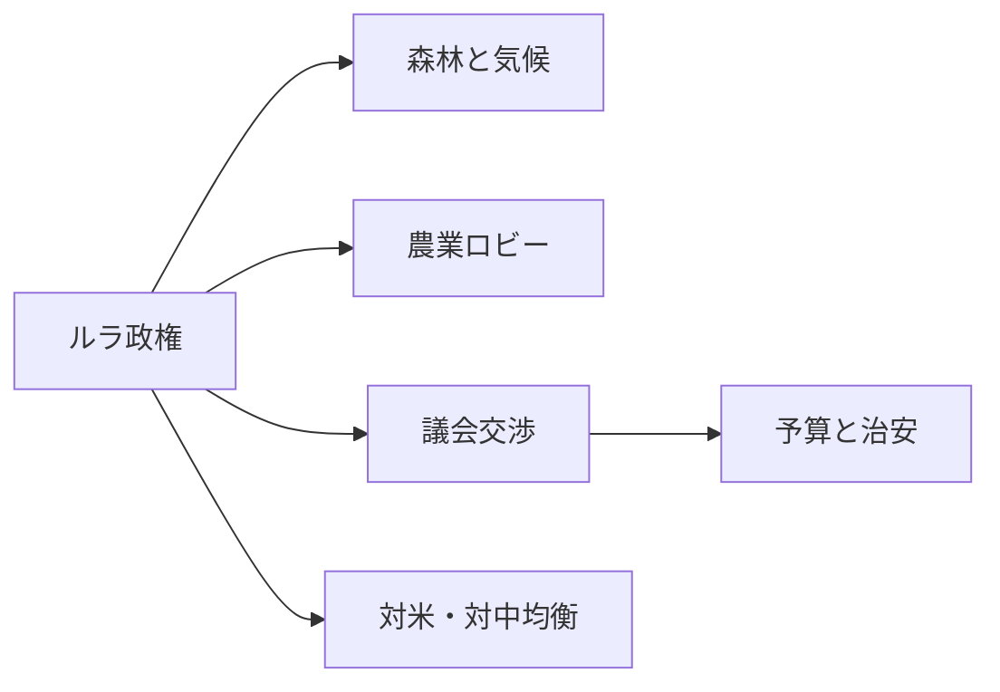
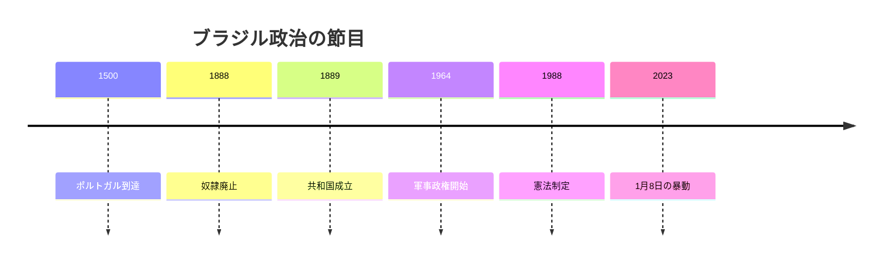
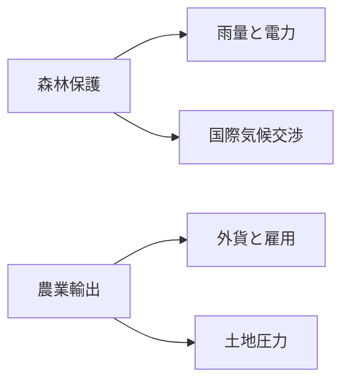
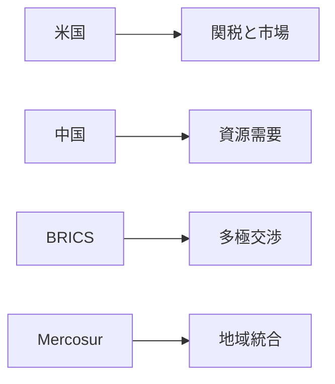

# 森と穀倉のあいだで: ブラジル国際政治プロファイル 2026年版

## 1. エグゼクティブサマリー

ブラジルは、2億530万人、850万平方キロ超の連邦大統領制国家であり、アマゾン保護、農業輸出、BRICS外交、都市治安が同じ内閣の議題に載る国である。<SourceNote>[World Bank, Brazil overview](https://www.worldbank.org/en/country/brazil/overview) と [President of Brazil](https://en.wikipedia.org/wiki/President_of_Brazil) を参照した。</SourceNote>

ルラ政権は気候外交と社会包摂を掲げるが、分断した議会、強い司法、軍の記憶、そして高い格差が、政策の速度と射程を毎回削る。<SourceNote>[Brazilian National Congress](https://en.wikipedia.org/wiki/National_Congress_of_Brazil)、[Supreme Federal Court](https://en.wikipedia.org/wiki/Supreme_Federal_Court)、[January 8 attack on the Brazilian Congress, Planalto Palace and Supreme Federal Court](https://apnews.com/article/brazil-riot-jair-bolsonaro-lula-51b4d67f7b5e5ad0c9a0d4bb1f6d24b3) を参照した。</SourceNote>

ブラジルを「左派政権の国」とだけ見ると、実際の制約を見落とす。

実際には、森林、穀物、鉱物、港湾、都市暴力、連邦予算が互いに絡み、対米、対中、対南米の立ち回りを決めている。

## 2. 歴史と制度の骨格

現在の体制は、植民地化、帝国、奴隷制、1888年の奴隷廃止、1889年の共和国、1964年の軍事クーデター、1988年憲法、2023年1月8日の暴動という層の上に立っている。<SourceNote>[Brazil](https://en.wikipedia.org/wiki/Brazil) と [Lei Áurea](https://en.wikipedia.org/wiki/Lei_%C3%81urea) を参照した。</SourceNote>

この記憶は、国家に対する信頼と不信を同時に残した。

ブラジルの政治史は、強い国家と深い不平等が同居してきた歴史でもある。

奴隷制の廃止は早い近代化を意味しなかった。

人種階層、土地集中、都市周縁、そして北東部と南東部の差は、いまも選挙の地図を歪める。

## 3. 現在の政治体制と権力配置

ブラジルの政治制度は、直接選挙の大統領、二院制の国民会議、憲法裁判所として機能する連邦最高裁、そして州と連邦区に分かれた連邦制でできている。<SourceNote>[Brazilian National Congress](https://en.wikipedia.org/wiki/National_Congress_of_Brazil)、[Supreme Federal Court](https://en.wikipedia.org/wiki/Supreme_Federal_Court)、[Brazilian federal government](https://en.wikipedia.org/wiki/Federal_government_of_Brazil) を参照した。</SourceNote>

大統領は議題設定力を持つが、法律、予算、人事、命令の実装には議会と司法の合意が要る。

2026年時点のルラ政権は、政党規律の弱い議会と交渉しながら、農業、宗教、治安、財政の各ブロックに同時に向き合っている。<SourceNote>[President of Brazil](https://en.wikipedia.org/wiki/President_of_Brazil) と [Politics of Brazil](https://en.wikipedia.org/wiki/Politics_of_Brazil) を参照した。</SourceNote>

連立の相手は一つの政党ではなく、中央派の議員群と州レベルの利害の寄せ集めである。

最高裁は選挙と民主主義を守る最後の砦として見られる一方、司法化が進むほど政治対立は裁判所へ移る。

軍は2023年1月8日以後、政治の表舞台に戻ることへの警戒を強めた。<SourceNote>[AP, January 8 attack on the Brazilian Congress, Planalto Palace and Supreme Federal Court](https://apnews.com/article/brazil-riot-jair-bolsonaro-lula-51b4d67f7b5e5ad0c9a0d4bb1f6d24b3) と [Brazilian military government](https://en.wikipedia.org/wiki/Brazilian_military_government) を参照した。</SourceNote>

| アクター | 読み方 |
| --- | --- |
| ルラ政権 | 気候、社会政策、外交の主導権を握るが、単独では進めない |
| 国民会議 | 予算、税制、人事、治安法案の関門になる |
| 連邦最高裁 | 選挙、表現、民主主義の争点を裁判化する |
| 州政府 | 警察、教育、インフラ、地方財政の実装を握る |
| 軍 | 1964年から1985年までの記憶がいまも政治感覚に影を落とす |
| 農業ロビー | 輸出と雇用を支える一方で森林規制に抵抗する |

ブラジルでは、政策の成否は法案通過より実装速度で決まる。

## 4. アマゾン、気候外交、先住民権利、農業輸出

世界銀行は、ブラジルの温室効果ガス排出の4分の3が土地利用変化と農業に由来すると説明し、アマゾンは生態学的転換点に近づいていると警告する。<SourceNote>[World Bank, Brazil overview](https://www.worldbank.org/en/country/brazil/overview) を参照した。</SourceNote>

同じページは、違法森林破壊を2030年までにゼロにする目標を挙げている。

このため、森林保護は環境政策ではなく、雨量、農業、水力発電、電力系統、外貨獲得をまとめて左右する産業政策になった。

先住民の土地区画指定は憲法上の権利だが、実務では違法伐採、鉱山、土地投機、農牧業の圧力で遅れやすい。<SourceNote>[World Bank, Brazil overview](https://www.worldbank.org/en/country/brazil/overview) と [Indigenous territories in Brazil](https://en.wikipedia.org/wiki/Indigenous_territories_in_Brazil) を参照した。</SourceNote>

ブラジルでは、アマゾンを守る国家目的と、穀物と牛肉を増やしたい農業ロビーの目的が衝突する。

ブラジルの気候外交は、道徳的な森林保護の話では終わらない。

それは、食料、エネルギー、土地、輸出、先住民権利を同時に扱う国家設計の話である。

## 5. BRICS、対米・対中関係、南米統合

対外関係では、米国との摩擦、中国との相互依存、BRICSでの多極志向、MercosurとCELACでの地域主義が同時に動く。<SourceNote>[Brazil–China relations](https://en.wikipedia.org/wiki/Brazil%E2%80%93China_relations)、[Brazil–United States diplomatic relations](https://en.wikipedia.org/wiki/Brazil%E2%80%93United_States_relations)、[BRICS](https://en.wikipedia.org/wiki/BRICS)、[Mercosur](https://en.wikipedia.org/wiki/Mercosur) を参照した。</SourceNote>

2025年の米国との通商・政治対立は、ブラジルが主権と市場アクセスを同時に守ろうとすると、ワシントンが関税と司法問題を結びつけて圧力をかけうることを示した。<SourceNote>[2025 Brazil–United States diplomatic dispute](https://en.wikipedia.org/wiki/2025_Brazil%E2%80%93United_States_diplomatic_dispute) を参照した。</SourceNote>

中国は2009年以来ブラジルの最大貿易相手であり、穀物、鉱石、エネルギー、インフラ投資の需要がブラジルの外交余地を広げる一方で、対中依存への警戒も生む。<SourceNote>[Brazil–China relations](https://en.wikipedia.org/wiki/Brazil%E2%80%93China_relations) を参照した。</SourceNote>

BRICSはブラジルにとって、米国への従属でも中国への同調でもない、交渉余地を残すための場である。

ただし、BRICSは西側資本市場、技術、ドル決済の代替にはならない。

南米統合も重要だが、Mercosurの制度力は国境を越える政治の熱量より弱い。

ブラジル外交の本質は、陣営選択ではなく、選択肢を残すための距離感の調整にある。

## 6. 治安、格差、都市問題

安全保障の中心は、対外戦争ではなく都市暴力、組織犯罪、警察暴力、刑務所の過密である。<SourceNote>[Crime in Brazil](https://en.wikipedia.org/wiki/Crime_in_Brazil) を参照した。</SourceNote>

ブラジルの治安は州ごとの差が大きく、サンパウロと北東部、都市中心部と周縁の違いが、選挙の争点をそのまま地域化する。

世界銀行は、ブラジルの人間開発係数を55%とし、失業を考慮すると33%に下がると示す。<SourceNote>[World Bank, Brazil overview](https://www.worldbank.org/en/country/brazil/overview) を参照した。</SourceNote>

2024年の貧困率は6.85ドル/日基準で20.9%まで下がったが、地域格差と財政制約はなお残る。<SourceNote>[World Bank, Brazil overview](https://www.worldbank.org/en/country/brazil/overview) を参照した。</SourceNote>

ブラジルの社会問題は成長の不足というより、成長の分配と国家実装の不足にある。

市民感情は、親ルラ対反ルラの二分法だけでは読めない。

福音派、カトリック、黒人、先住民、白人、中間層、都市周縁、農村のあいだで、国家に求めるものは違う。

## 7. 日本と東アジアへの含意

日本から見ると、ブラジルは食料、バイオ燃料、鉱物、航空機、脱炭素投資の相手国である。

中国需要と米国政策の両方がブラジルの輸出と関税を揺らすため、日本企業はブラジルを単独市場ではなく、世界商品市況と地政学が交差する供給拠点として扱う必要がある。

日系社会の存在も重要だが、外交の実務で効くのは、ブラジルがG20、BRICS、気候交渉で南半球の交渉軸を動かすことである。<SourceNote>[Japan-Brazil relations](https://en.wikipedia.org/wiki/Japan%E2%80%93Brazil_relations)、[BRICS](https://en.wikipedia.org/wiki/BRICS)、[G20](https://en.wikipedia.org/wiki/G20) を参照した。</SourceNote>

ブラジルは、日本にとって遠い中南米の一国ではない。

食料安全保障、資源、脱炭素、外交標準の交差点として読む必要がある。

## 8. 注視点

今後の注視点は四つある。

第一に、ルラ政権が森林保護と農業ロビーを同時に維持できるか。

第二に、議会交渉が税制、予算、治安政策をどこまで遅らせるか。

第三に、2026年の選挙サイクルが、司法と軍の距離を再び詰めるか。

第四に、米中の圧力がブラジルの自主外交をどこまで狭めるか。

この国を読むときは、アマゾンと穀倉地帯、都市と内陸、主権と市場が同じ地図に重なっていることを忘れない方がよい。

## 参考情報

- [World Bank, Brazil overview](https://www.worldbank.org/en/country/brazil/overview)
- [President of Brazil](https://en.wikipedia.org/wiki/President_of_Brazil)
- [Brazilian National Congress](https://en.wikipedia.org/wiki/National_Congress_of_Brazil)
- [Supreme Federal Court](https://en.wikipedia.org/wiki/Supreme_Federal_Court)
- [Brazil–China relations](https://en.wikipedia.org/wiki/Brazil%E2%80%93China_relations)
- [Brazil–United States relations](https://en.wikipedia.org/wiki/Brazil%E2%80%93United_States_relations)
