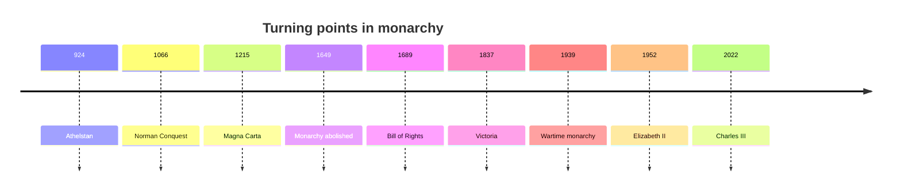

## 1. Executive Summary

The history of the British monarchy is both a story of royal power becoming stronger and a story of that power being transferred into law, Parliament, empire, media, and public service. The monarch is still Head of State, but legislation belongs to an elected Parliament. The Crown now functions less as executive power and more as continuity, ceremony, appointment, honours, diplomatic ritual, national identity, and Commonwealth symbolism. <SourceNote>[The Royal Family, The role of the Monarchy](https://www.royal.uk/the-role-of-the-monarchy) describes the UK as a constitutional monarchy in which the ability to make and pass legislation resides with elected Parliament.</SourceNote>

Three turns matter most. First, Anglo-Saxon kingship and the Norman Conquest created a stronger monarchy built around land, war, taxation, and the Church. Second, Magna Carta, Parliament, civil war, the Glorious Revolution, and the Bill of Rights constrained royal power under law and parliamentary authority. Third, from the Victorian period onward, the monarch became less a direct ruler and more a symbol of empire, national unity, wartime endurance, welfare-state continuity, and the postwar Commonwealth.

## 2. Origins

The British monarchy did not begin as the modern United Kingdom. Its early foundation lies in the gradual consolidation of Anglo-Saxon kingdoms. The Royal Family's historical material places Athelstan in the line of kings from 924 to 939. At this stage, kingship was not modern headship of state; it was military leadership, landholding, church patronage, tribute, and justice. <SourceNote>[The Royal Family, Anglo Saxon Kings](https://www.royal.uk/anglo-saxon-kings) summarizes the early English royal line through the Anglo-Saxon kings.</SourceNote>

The Norman Conquest in 1066 changed the character of monarchy. William I used confiscated land, castles, feudal military obligations, church appointments, and the Domesday survey to build a regime in which the king controlled land, force, and fiscal information. This was not merely a change of dynasty; it was a redesign of government. <SourceNote>[The Royal Family, William I 'The Conqueror'](https://www.royal.uk/william-the-conqueror) covers William's coronation, castle-building, land redistribution, Domesday Book, and the Salisbury oath.</SourceNote>

## 3. The Rise of Royal Power

Medieval royal power grew through war, land, justice, taxation, and the Church. But strong monarchy also produced resistance. Magna Carta in 1215 put into writing the principle that the king and his government were not above the law. It was not modern democracy, but it made the limiting of royal power by law part of the constitutional tradition. <SourceNote>[UK Parliament, Magna Carta](https://www.parliament.uk/magnacarta/) describes Magna Carta as the first document to put into writing the principle that the king and his government were not above the law.</SourceNote>

Parliament then developed through taxation consent, petition, aristocratic and clerical councils, and representatives of towns and counties. By the fourteenth century, Commons and Lords had emerged as separate houses. In the seventeenth century, conflict between king and Parliament became civil war. In 1649, monarchy and the House of Lords were abolished; in 1660, monarchy was restored. British monarchy therefore has a history not only of continuity, but of interruption. <SourceNote>[UK Parliament, History of the House of Lords](https://www.parliament.uk/business/lords/lords-history/history-of-the-lords/) summarizes the emergence of two Houses, the abolition of monarchy and the Lords in 1649, restoration in 1660, and parliamentary authority in 1689.</SourceNote>

## 4. Constitutional Monarchy

The Bill of Rights 1689 is central to modern British monarchy. It established principles of frequent Parliaments, free elections, freedom of speech within Parliament, no taxation without Parliament's agreement, freedom from government interference, the right of petition, and just treatment by courts. It placed monarchy inside parliamentary authority. <SourceNote>[UK Parliament, Bill of Rights 1689](https://www.parliament.uk/about/living-heritage/evolutionofparliament/parliamentaryauthority/revolution/collections1/collections-glorious-revolution/billofrights/)</SourceNote>

The monarchy did not move toward absolutism. It was forced into a constitutional path linked to parliamentary sovereignty. The Acts of Union in 1707 created Great Britain, and the 1800 Union with Ireland created the United Kingdom framework. The monarch became the Crown of a union state, while real governing authority moved toward Parliament, Cabinet, and party government. <SourceNote>[UK Parliament, History of the House of Lords](https://www.parliament.uk/business/lords/lords-history/history-of-the-lords/) notes the 1707 and 1800 unions and their parliamentary consequences.</SourceNote>

## 5. Empire and National Integration

Under Victoria, the monarchy lost direct political power while gaining symbolic reach. Victoria came to the throne in 1837 and became associated with industrial expansion, economic growth, and empire. The Royal Family's account says direct political power moved away from the sovereign during her reign, but a monarch with prestige and mastery of political detail could still exert influence. <SourceNote>[The Royal Family, Victoria (r. 1837-1901)](https://www.royal.uk/encyclopedia/victoria-r-1837-1901)</SourceNote>

Victoria was also an imperial symbol. She became Empress of India in 1877, and the jubilees of 1887 and 1897 became imperial ceremonies. The Crown was no longer the seat of daily government, but it became a visible center for industrial society, empire, and national ritual.

## 6. Wartime Monarchy

The two world wars recast monarchy as an institution that shared national hardship. George VI is especially important. He became king in 1936 after Edward VIII's abdication. During the Second World War, he remained for much of the war at Buckingham Palace, which was bombed nine times. The King and Queen visited heavily bombed areas, including the East End of London, and built a close working relationship with Winston Churchill. <SourceNote>[The Royal Family, George VI](https://www.royal.uk/george-vi) records the wartime bombing of Buckingham Palace, royal visits to bombed areas, the Churchill relationship, and Buckingham Palace as a VE Day focal point.</SourceNote>

The meaning of wartime monarchy was not that the king directly commanded policy. It was that monarchy connected parliamentary democracy with total war symbolically. By staying visible, visiting soldiers and bombed areas, and sustaining national ritual, the monarchy became a symbol of national endurance rather than only a decorative elite institution.

## 7. Postwar Monarchy

After the war, monarchy moved from empire to Commonwealth, and from direct imperial allegiance to symbolic association. In 1947, India and Pakistan became independent, and George VI ceased to be Emperor of India. The Commonwealth link shifted from common allegiance to the Crown to recognition of the sovereign as Head of the Commonwealth. <SourceNote>[The Royal Family, George VI](https://www.royal.uk/george-vi)</SourceNote>

Elizabeth II acceded in 1952, and her 1953 coronation was the first televised coronation. The Royal Family says about 27 million people in Britain watched it on television and 11 million listened on radio. Monarchy became both sacred ceremony and mass-media national experience. <SourceNote>[The Royal Family, Queen Elizabeth II's Accession and Coronation](https://www.royal.uk/queen-elizabeth-iis-accession-and-coronation)</SourceNote>

Postwar monarchy passed through the welfare state, decolonization, the Cold War, television, scandals, polling, and social media. It has almost no direct executive power, but it maintains institutional presence through prime-ministerial appointment, State Opening, Royal Assent, honours, diplomatic ritual, charitable support, mourning, and celebration.

## 8. Modern Pressures on the Monarchy

Modern monarchy is judged not only through ceremony but also through finance, transparency, generational support, the behaviour of royal family members, health, and media conditions. Elizabeth II's death was announced by Royal Communications on September 8, 2022, and Charles III was formally proclaimed at the Accession Council on September 10. This shows the modern monarchy's combination of automatic hereditary succession and public constitutional ritual. <SourceNote>[The Royal Family, Announcement of the death of The Queen](https://www.royal.uk/announcement-death-queen), [The Royal Family, The Accession Council and Principal Proclamation](https://www.royal.uk/accession-council-and-principal-proclamation-0)</SourceNote>

Charles III's 2023 coronation was both a restaging of tradition and a performance of modern service and plural society. The Royal Family's official material describes the May 6, 2023 Westminster Abbey coronation as a solemn religious service and an occasion for celebration and pageantry. The monarchy used a medieval form while speaking the language of service, continuity, and modern Britain. <SourceNote>[The Royal Family, Coronation Weekend plans announced](https://www.royal.uk/coronation-weekend-plans-announced), [The Royal Family, The Coronation](https://www.royal.uk/coronation)</SourceNote>

Maintaining monarchy also requires money and accountability. The Royal Household's 2024-25 financial material says the Sovereign Grant remained at £86.3 million for the fourth consecutive year, made up of £51.8 million for the Core Sovereign Grant and £34.5 million for the Buckingham Palace Reservicing Programme. The House of Commons Library notes that the Sovereign Grant rose to £137.9 million in 2026/27 and that the government intends to introduce a Sovereign Grant Bill 2026-27 to lower the Grant after the Buckingham Palace works end. <SourceNote>[The Royal Family, Financial reports 2024-25](https://www.royal.uk/media-pack/financial-reports-2024-25), [House of Commons Library, Finances of the Monarchy](https://commonslibrary.parliament.uk/research-briefings/cbp-9807/)</SourceNote>

Public opinion remains broadly supportive, but not uniformly so. YouGov's January 2026 tracker found that 60% of Britons had a positive opinion of Charles III, compared with 31% negative, and that 64% thought the UK should continue to have a monarchy. At the same time, ratings for Harry, Meghan, and Andrew were much weaker, showing that institutional support can be affected by the conduct and media presence of individual family members. <SourceNote>[YouGov, Royal family favourability trackers, January 2026](https://yougov.com/en-gb/articles/53895-royal-family-favourability-trackers-january-2026)</SourceNote>

The Sussex departure shows the dual nature of monarchy as both family and public institution. The Royal Family's official page states that the Duke and Duchess of Sussex stepped back as working members of the Royal Family in January 2020. This was not only a family dispute; it was a boundary question about who carries public funding, title, duty, and media exposure. <SourceNote>[The Royal Family, Buckingham Palace statement on The Duke and Duchess of Sussex](https://www.royal.uk/buckingham-palace-statement-duke-and-duchess-sussex)</SourceNote>

The 2024-25 period also showed the vulnerability of a monarchy that depends heavily on a small number of visible working royals. The Royal Household's financial material notes that the King and the Princess of Wales began phased returns to public-facing duties following treatment for cancer during the April 2024 to March 2025 reporting period. The institution continues constitutionally, but its public visibility depends on the health and availability of specific people. <SourceNote>[The Royal Family, Financial reports 2024-25](https://www.royal.uk/media-pack/financial-reports-2024-25)</SourceNote>

## 9. How to Understand the Modern Crown

The modern Crown rests on a paradox: the monarchy is stronger when it stays away from party politics, and it is needed ceremonially because it stays away from party politics. It does not decide policy. But it makes visible that the state continues when governments change, that the United Kingdom has shared rituals, and that the Commonwealth relationship still has a symbolic center.

It is therefore not enough to say royal power disappeared. It changed form: from land and military command, to a headship of state constrained by law and Parliament, to an imperial and national symbol, to wartime endurance, to postwar public service mediated by mass media. That capacity for transformation is why the monarchy survived.

## References

- [The Royal Family, The role of the Monarchy](https://www.royal.uk/the-role-of-the-monarchy)
- [The Royal Family, Anglo Saxon Kings](https://www.royal.uk/anglo-saxon-kings)
- [The Royal Family, William I 'The Conqueror'](https://www.royal.uk/william-the-conqueror)
- [UK Parliament, Magna Carta](https://www.parliament.uk/magnacarta/)
- [UK Parliament, Bill of Rights 1689](https://www.parliament.uk/about/living-heritage/evolutionofparliament/parliamentaryauthority/revolution/collections1/collections-glorious-revolution/billofrights/)
- [UK Parliament, History of the House of Lords](https://www.parliament.uk/business/lords/lords-history/history-of-the-lords/)
- [The Royal Family, Victoria (r. 1837-1901)](https://www.royal.uk/encyclopedia/victoria-r-1837-1901)
- [The Royal Family, George VI](https://www.royal.uk/george-vi)
- [The Royal Family, Queen Elizabeth II's Accession and Coronation](https://www.royal.uk/queen-elizabeth-iis-accession-and-coronation)
- [The Royal Family, Announcement of the death of The Queen](https://www.royal.uk/announcement-death-queen)
- [The Royal Family, The Accession Council and Principal Proclamation](https://www.royal.uk/accession-council-and-principal-proclamation-0)
- [The Royal Family, Coronation Weekend plans announced](https://www.royal.uk/coronation-weekend-plans-announced)
- [The Royal Family, Financial reports 2024-25](https://www.royal.uk/media-pack/financial-reports-2024-25)
- [House of Commons Library, Finances of the Monarchy](https://commonslibrary.parliament.uk/research-briefings/cbp-9807/)
- [YouGov, Royal family favourability trackers, January 2026](https://yougov.com/en-gb/articles/53895-royal-family-favourability-trackers-january-2026)
- [The Royal Family, Buckingham Palace statement on The Duke and Duchess of Sussex](https://www.royal.uk/buckingham-palace-statement-duke-and-duchess-sussex)
