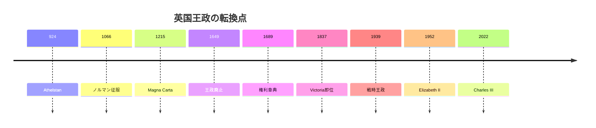

## 1. エグゼクティブサマリー

イギリス王政の歴史は、「王が強くなった歴史」であると同時に、「王が自分の権力を法律、議会、帝国、メディア、公共奉仕へ移し替えて生き残った歴史」でもある。現在の英国王は国家元首だが、立法権は選挙で選ばれる議会にある。王政は行政権力そのものではなく、国家の継続性、儀礼、任命、栄典、外交儀礼、連合王国とCommonwealthの象徴として機能している。<SourceNote>[The Royal Family, The role of the Monarchy](https://www.royal.uk/the-role-of-the-monarchy) は、英国王政をconstitutional monarchyと説明し、立法権は選挙で選ばれた議会にあるとしている。</SourceNote>

王政を理解する鍵は、三つの転換である。第一に、アングロ・サクソン諸王国からノルマン征服を経て、軍事・土地・課税・教会を握る強い王権が形成された。第二に、Magna Carta、議会、内戦、名誉革命、Bill of Rightsによって、王権が法と議会に制約された。第三に、Victoria期以降、王は直接統治者から、帝国・国民統合・福祉国家・戦時耐久・戦後Commonwealthの象徴へ変わった。

## 2. 王政の誕生

「イギリス王政」は最初から現在の連合王国として生まれたわけではない。初期の基層は、アングロ・サクソン諸王国が統合されていく過程にある。The Royal Familyの王室史は、Athelstanを924-939年の王として位置づけ、その後のイングランド王統へつなげている。ここでは、王はまだ近代国家の元首ではなく、軍事指導者、土地支配者、教会保護者、貢納と裁判の中心だった。<SourceNote>[The Royal Family, Anglo Saxon Kings](https://www.royal.uk/anglo-saxon-kings) は、初期イングランド王統をアングロ・サクソン諸王から整理している。</SourceNote>

1066年のノルマン征服は、王政の性格を決定的に変えた。William Iは征服後、土地没収、城郭建設、封建的軍役、教会人事、Domesday調査を通じて、王が土地・軍事・課税情報を握る体制を作った。これは単なる王朝交代ではなく、統治装置の再設計だった。<SourceNote>[The Royal Family, William I 'The Conqueror'](https://www.royal.uk/william-the-conqueror) は、1066年の戴冠、城郭建設、土地配分、Domesday Book、Salisbury oathを王権強化の一部として説明している。</SourceNote>

## 3. 王権の興隆

中世の王権は、軍事、土地、裁判、課税、教会との関係を通じて強まった。だが、強い王権は同時に抵抗も生む。1215年のMagna Cartaは、王と政府が法の上にいないという原理を文書化した。これは近代民主主義そのものではないが、王権が「法律によって制限されうる」ことを制度史に刻んだ。<SourceNote>[UK Parliament, Magna Carta](https://www.parliament.uk/magnacarta/) は、Magna Cartaを「king and his government was not above the law」という原理を書面化したものと説明している。</SourceNote>

その後、議会は課税同意、請願、貴族・聖職者・都市・州代表の集まりとして発展した。14世紀にはCommonsとLordsが分かれ、17世紀には内戦を通じて王と議会の主権争いが爆発する。1649年には王政とHouse of Lordsが廃止され、1660年に王政復古が起きた。つまり、英国王政は一度「終わった」経験を持つ。<SourceNote>[UK Parliament, History of the House of Lords](https://www.parliament.uk/business/lords/lords-history/history-of-the-lords/) は、14世紀の二院分化、1649年の王政・上院廃止、1660年の復古、1689年の議会権威確立を整理している。</SourceNote>

## 4. 立憲化

1689年のBill of Rightsは、近代英国王政を理解する中心文書である。頻繁な議会、自由選挙、議会内言論の自由、課税に議会同意が必要であること、政府干渉からの自由、請願権、裁判上の公正などを含み、王権を議会権威の内側へ置いた。<SourceNote>[UK Parliament, Bill of Rights 1689](https://www.parliament.uk/about/living-heritage/evolutionofparliament/parliamentaryauthority/revolution/collections1/collections-glorious-revolution/billofrights/) は、Bill of Rightsがfrequent parliaments、free elections、freedom of speech within Parliament、no taxation without Parliament's agreementなどを確立したと説明している。</SourceNote>

ここで王政は、絶対王政へ向かう道ではなく、議会主権と結びつく道を選ばされる。1707年のActs of UnionはイングランドとスコットランドをGreat Britainに統合し、1800年のUnion with IrelandはUnited Kingdomを形成した。王は連合国家の冠となるが、実際の統治は議会・内閣・政党政治へ移る。<SourceNote>[UK Parliament, History of the House of Lords](https://www.parliament.uk/business/lords/lords-history/history-of-the-lords/) は、1707年と1800年のUnionが単一議会を形成したと説明している。</SourceNote>

## 5. 帝国と国民統合の王政

Victoria期には、王政は直接権力を失いながら、象徴力を強めた。Victoriaは1837年に即位し、産業拡大、経済発展、帝国の時代と結びついた。The Royal Familyの説明では、彼女の時代に主権者の直接政治権力は低下したが、高い威信と政治細部への理解を持つ君主は重要な影響力を行使できた。<SourceNote>[The Royal Family, Victoria (r. 1837-1901)](https://www.royal.uk/encyclopedia/victoria-r-1837-1901) は、Victoria期にmodern idea of the constitutional monarchが発展したと説明している。</SourceNote>

Victoriaは、帝国の象徴でもあった。1877年にEmpress of Indiaとなり、1887年と1897年のJubileeは帝国規模の儀礼となった。ここで王政は、議会政府の上に君臨する支配者ではなく、産業国家・帝国・国民儀礼を束ねる視覚的中心になった。

## 6. 戦時中の王政

第一次世界大戦と第二次世界大戦は、王政を「国民と苦難を共有する制度」として再構成した。とくにGeorge VIの時代が重要である。彼はEdward VIIIの退位を受けて1936年に即位し、第二次世界大戦中は多くの期間をBuckingham Palaceに留まり、宮殿は9回爆撃された。国王夫妻はロンドンEast Endなど爆撃被害地を訪れ、Winston Churchillと緊密に協力した。<SourceNote>[The Royal Family, George VI](https://www.royal.uk/george-vi) は、Buckingham Palaceが戦時中9回爆撃されたこと、国王夫妻が被爆地を訪問したこと、Churchillとの関係、VE Dayで宮殿が祝賀の中心となったことを記す。</SourceNote>

戦時王政の意味は、王が軍を直接指揮したことではない。むしろ、議会制民主主義と総力戦を象徴的に結びつけたことにある。王室が避難せず、被災地を訪れ、兵士を訪問し、国家儀礼を維持したことで、王政は「支配階級の飾り」ではなく「国民的耐久の象徴」として再評価された。

## 7. 戦後の王政

戦後、王政は帝国からCommonwealthへ、直接支配から象徴的連携へ移った。George VIの時代には、1947年にIndiaとPakistanが独立し、彼はEmperor of Indiaではなくなった。Commonwealthの結びつきも、Crownへの共通忠誠から、SovereignをHead of the Commonwealthとして認める関係へ変化した。<SourceNote>[The Royal Family, George VI](https://www.royal.uk/george-vi) は、1947年のIndia and Pakistan独立後、Commonwealthの結びつきが共通忠誠ではなくHead of the Commonwealth承認へ変わったと説明している。</SourceNote>

Elizabeth IIは1952年に即位し、1953年の戴冠式は初めてテレビで放送された。英国だけで約2700万人がテレビで視聴し、1100万人がラジオで聞いたとされる。ここで王政は、神聖な儀式であると同時に、マスメディア上の国民的経験になった。<SourceNote>[The Royal Family, Queen Elizabeth II's Accession and Coronation](https://www.royal.uk/queen-elizabeth-iis-accession-and-coronation) は、1952年即位、1953年戴冠、初のテレビ放送、英国での視聴規模を説明している。</SourceNote>

戦後王政は、福祉国家、脱植民地化、冷戦、テレビ、スキャンダル、世論調査、SNSをくぐり抜けた。直接権力はほぼ持たないが、首相任命、State Opening、Royal Assent、栄典、外交儀礼、慈善支援、追悼と祝賀の国家儀礼を通じて、制度的存在感を維持している。

## 8. 現代の王政をどう見るか

現代の英国王政は、強いほど政治から離れ、政治から離れるほど国家儀礼で必要とされるという逆説の上にある。王が政策を決める制度ではない。だが、政府が変わっても国家が続くこと、連合王国が一つの政治共同体として儀礼を持つこと、Commonwealthと歴史的関係を維持することを可視化する制度である。

したがって、英国王政を理解するには、王の権力が消えたと見るだけでは不十分である。王権は、土地と軍事の支配から、法と議会に制限された国家元首へ、さらに帝国と国民統合の象徴へ、戦時の耐久の象徴へ、戦後のメディア化された公共奉仕へと姿を変えた。その変身能力こそが、王政が今に至った理由である。

## 参考情報

- [The Royal Family, The role of the Monarchy](https://www.royal.uk/the-role-of-the-monarchy)
- [The Royal Family, Anglo Saxon Kings](https://www.royal.uk/anglo-saxon-kings)
- [The Royal Family, William I 'The Conqueror'](https://www.royal.uk/william-the-conqueror)
- [UK Parliament, Magna Carta](https://www.parliament.uk/magnacarta/)
- [UK Parliament, Bill of Rights 1689](https://www.parliament.uk/about/living-heritage/evolutionofparliament/parliamentaryauthority/revolution/collections1/collections-glorious-revolution/billofrights/)
- [UK Parliament, History of the House of Lords](https://www.parliament.uk/business/lords/lords-history/history-of-the-lords/)
- [The Royal Family, Victoria (r. 1837-1901)](https://www.royal.uk/encyclopedia/victoria-r-1837-1901)
- [The Royal Family, George VI](https://www.royal.uk/george-vi)
- [The Royal Family, Queen Elizabeth II's Accession and Coronation](https://www.royal.uk/queen-elizabeth-iis-accession-and-coronation)
