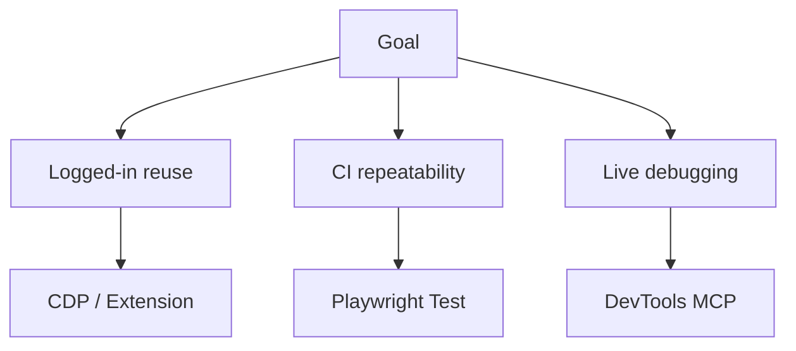
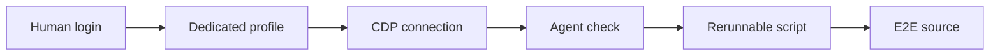

# MCP and Agent Skills for Browser E2E Testing

## 1. Executive Summary

As of May 2026, the right way to let an AI agent run browser E2E checks is not simply "add a browser MCP server." The current landscape has several layers: Microsoft offers `@playwright/mcp`, `@playwright/cli`, and the newer `microsoft/Webwright`; Google offers `chrome-devtools-mcp`; Browserbase/Stagehand and browser-use focus on cloud browsers and natural-language browser automation.

<SourceNote>
	Sources checked include Microsoft [Playwright MCP](https://github.com/microsoft/playwright-mcp),
	[Playwright CLI](https://github.com/microsoft/playwright-cli),
	[Webwright](https://github.com/microsoft/Webwright), Google's [Chrome DevTools MCP
	announcement](https://developer.chrome.com/blog/chrome-devtools-mcp) and
	[chrome-devtools-mcp](https://github.com/ChromeDevTools/chrome-devtools-mcp), Browserbase [MCP
	Server docs](https://docs.browserbase.com/integrations/mcp/introduction), Stagehand
	[Introduction](https://docs.stagehand.dev/v3/first-steps/introduction), and
	[browser-use](https://github.com/browser-use/browser-use).
</SourceNote>

The practical conclusion is:

1. If reusing a logged-in local browser session is important, prioritize Chrome DevTools MCP `autoConnect`, Playwright MCP `--extension`, and Webwright `local_cdp`. These are powerful but expose sensitive browser state.
2. If the goal is repeatable CI E2E, keep Playwright Test as the source of truth. Let agents help reproduce failures, inspect screenshots, and draft tests.
3. If the goal is exploratory agent browsing, Playwright MCP is the easiest default. It uses accessibility snapshots, but long tasks can become expensive in model context.
4. If the goal is live debugging with console, network, traces, and LCP, Chrome DevTools MCP is the strongest fit.
5. Webwright is not a browser MCP server. It is an Agent Skill / plugin approach that turns browser work into rerunnable Playwright scripts with screenshots and logs.
6. Browserbase/Stagehand and browser-use are stronger for external web tasks, cloud execution, scraping, workflow automation, proxies, recording, and scaling than for deterministic in-repo regression E2E.

<SourceNote>
	NPM versions checked during this research: `@playwright/mcp` `0.0.75` on May 26, 2026,
	`chrome-devtools-mcp` `1.1.0` on May 26, 2026, `@playwright/cli` `0.1.13` on May 7, 2026, and
	`@browserbasehq/mcp` `3.0.0` on March 31, 2026. See
	[@playwright/mcp](https://www.npmjs.com/package/@playwright/mcp),
	[chrome-devtools-mcp](https://www.npmjs.com/package/chrome-devtools-mcp),
	[@playwright/cli](https://www.npmjs.com/package/@playwright/cli), and
	[@browserbasehq/mcp](https://www.npmjs.com/package/@browserbasehq/mcp).
</SourceNote>

## 2. The Core Difference

The confusion comes from mixing layers. MCP is a protocol for exposing tools to agents. Agent Skills package repeatable workflows, instructions, scripts, and references. Playwright Test is an E2E test framework whose artifacts can be reviewed by humans and CI.

<SourceNote>
	OpenAI's Agent Skills documentation defines a skill as a `SKILL.md` file with optional `scripts/`,
	`references/`, `assets/`, and optional tool dependencies. See [OpenAI Agent
	Skills](https://developers.openai.com/codex/skills).
</SourceNote>

| Type             | Examples                                 | Main state                      | Strong fit                          | Weak fit                                            |
| ---------------- | ---------------------------------------- | ------------------------------- | ----------------------------------- | --------------------------------------------------- |
| Browser MCP      | Playwright MCP, Chrome DevTools MCP      | Browser session                 | Exploration, live checks, debugging | Source of truth for large CI suites                 |
| CLI + Skill      | Playwright CLI, Webwright                | Workspace, logs, scripts        | Token efficiency, reruns, evidence  | Deep DevTools inspection                            |
| Conventional E2E | Playwright Test                          | Test code, trace, storage state | CI regression checks                | Unknown UI exploration                              |
| Cloud browser    | Browserbase/Stagehand, browser-use Cloud | Cloud sessions                  | External web tasks and scaling      | Immediate reuse of a local logged-in Chrome session |

## 3. Major Options

### 3.1 Playwright MCP

`@playwright/mcp` exposes Playwright browser automation through MCP. The official docs describe an accessibility-snapshot-centered workflow: the agent sees roles and text rather than only pixels, then clicks, fills, selects, navigates, takes screenshots, and can inspect network or storage.

<SourceNote>
	See [Playwright MCP docs](https://playwright.dev/docs/getting-started-mcp) and
	[microsoft/playwright-mcp](https://github.com/microsoft/playwright-mcp).
</SourceNote>

For logged-in sessions, Playwright MCP has three important modes: a default persistent profile, isolated sessions with `--isolated`, and connection to existing browser tabs through the Playwright Extension with `--extension`.

<SourceNote>
	The Playwright MCP user profile section documents persistent, isolated, and browser extension
	modes. See [Playwright MCP - User
	profile](https://playwright.dev/docs/getting-started-mcp#user-profile).
</SourceNote>

The limitation is context cost. MCP tools and page snapshots can occupy model context during long tasks. The Playwright MCP README itself points coding agents toward CLI + Skills when that is a better fit.

<SourceNote>
	[microsoft/playwright-mcp](https://github.com/microsoft/playwright-mcp) says coding agents may
	benefit from CLI+SKILLS. [microsoft/playwright-cli](https://github.com/microsoft/playwright-cli)
	explains the token-efficiency rationale.
</SourceNote>

### 3.2 Chrome DevTools MCP

`chrome-devtools-mcp` is a Google Chrome DevTools MCP server. It is strongest when the agent needs DevTools-grade evidence: console messages, network requests, screenshots, source-mapped stack traces, performance traces, and LCP-related investigation.

<SourceNote>
	Google announced Chrome DevTools MCP as a public preview on September 23, 2025. See [Chrome
	DevTools MCP for your AI agent](https://developer.chrome.com/blog/chrome-devtools-mcp) and
	[ChromeDevTools/chrome-devtools-mcp](https://github.com/ChromeDevTools/chrome-devtools-mcp).
</SourceNote>

For logged-in browser work, its `autoConnect` path matters. The README describes connecting to a running Chrome instance and asking the user for permission. This is useful for local reproduction but risky because the MCP client can inspect and modify browser contents.

<SourceNote>
	The Chrome DevTools MCP README warns that MCP clients can inspect, debug, and modify browser data,
	and describes the `autoConnect` flow. See
	[chrome-devtools-mcp](https://github.com/ChromeDevTools/chrome-devtools-mcp).
</SourceNote>

### 3.3 Playwright CLI + Skills

`@playwright/cli` exposes browser operations as shell commands. It saves snapshots and screenshots to files instead of pushing all page state into the model context. Microsoft positions this as a better fit for many coding-agent workflows.

<SourceNote>
	[microsoft/playwright-cli](https://github.com/microsoft/playwright-cli) explains that CLI + Skills
	can be more token-efficient for coding agents because large schemas and accessibility trees do not
	have to stay in model context.
</SourceNote>

For logged-in work, the important features are sessions, persistent profiles, CDP attach, and extension attach. It is useful as a bridge: explore with a logged-in browser, then turn the result into a script or Playwright Test.

### 3.4 Webwright

`microsoft/Webwright` is the Microsoft tool that prompted this report. It is not an MCP server. It is a Codex/Claude Code style plugin and Agent Skill that asks the coding agent to solve a web task by writing Playwright scripts, running them, saving screenshots, and producing a rerunnable `final_script.py`.

<SourceNote>
	[microsoft/Webwright](https://github.com/microsoft/Webwright) lists May 4, 2026 as the initial
	public release, May 6 as the Codex and Claude Code plugin manifest addition, and May 11 as Task2UI
	support. It describes "workspace-as-state" rather than "browser-as-state."
</SourceNote>

That design is valuable for long tasks. The artifact is code and evidence, not a hidden interaction history. Webwright reports strong benchmark results on Online-Mind2Web and Odysseys, but these should be treated as project claims until independently reproduced.

<SourceNote>
	The benchmark numbers are from [microsoft/Webwright](https://github.com/microsoft/Webwright) and
	linked Microsoft project material, not an independently audited benchmark in this report.
</SourceNote>

Logged-in session support needs nuance. Webwright has `local_browser.yaml`, where `browser_mode: local_cdp` is described as real Chrome/Edge over CDP and recommended for manual Google login. Some bundled skill instructions, however, describe fresh Firefox runs with no persistent state. In practice, teams must verify that the installed Webwright skill and configuration actually use `local_cdp` when login reuse is the requirement.

<SourceNote>
	Webwright's `src/webwright/config/local_browser.yaml` describes `local_cdp` as "real Chrome/Edge
	over CDP, recommended for manual Google login." The bundled skill instructions also include
	fresh-Firefox local execution paths. See
	[microsoft/Webwright](https://github.com/microsoft/Webwright).
</SourceNote>

### 3.5 Browserbase / Stagehand MCP

Browserbase MCP provides a browser to MCP clients through Browserbase infrastructure and Stagehand. Stagehand offers `act`, `extract`, `observe`, and `agent` primitives for mixing natural language and code.

<SourceNote>
	[Browserbase MCP Server docs](https://docs.browserbase.com/integrations/mcp/introduction) describe
	hosted Streamable HTTP, natural language automation, session lifecycle, recording, proxy support,
	and browser identity. [Stagehand
	introduction](https://docs.stagehand.dev/v3/first-steps/introduction) describes `act`, `extract`,
	`observe`, and `agent`.
</SourceNote>

This is a strong fit for external websites, cloud scaling, and workflow automation. It is not the most direct answer when the requirement is "use the Chrome session I already logged into locally."

### 3.6 browser-use

browser-use is an AI browser-agent framework with a Python library, CLI, cloud product, and Claude Code Skill. It emphasizes form filling, shopping, research, cloud browsers, stealth, proxy rotation, CAPTCHA handling, and persistent cloud state.

<SourceNote>
	[browser-use README](https://github.com/browser-use/browser-use) documents the Python library,
	CLI, Cloud, Claude Code Skill, and cloud features such as stealth, proxy rotation, and CAPTCHA
	support.
</SourceNote>

It is better understood as a web-agent platform than as a deterministic E2E testing framework.

## 4. Reusing Logged-In Sessions

Logged-in session reuse is often the decisive requirement. SSO, MFA, corporate IdPs, IP restrictions, device posture checks, CAPTCHA, and bot mitigation can make it unrealistic to run all browser checks from a clean CI account.

The same capability creates risk. A tool connected to a logged-in browser can access emails, internal admin pages, customer data, cookies, localStorage, CSRF tokens, and sensitive network traffic. Use a dedicated browser profile and keep the agent's target surface narrow.

<SourceNote>
	Chrome DevTools MCP warns that MCP clients can inspect and modify browser contents. Playwright MCP
	states that it is not a security boundary. See
	[chrome-devtools-mcp](https://github.com/ChromeDevTools/chrome-devtools-mcp) and
	[playwright-mcp](https://github.com/microsoft/playwright-mcp).
</SourceNote>

| Method                            | Logged-in reuse                   | Best fit                                  | Caution                           |
| --------------------------------- | --------------------------------- | ----------------------------------------- | --------------------------------- |
| Chrome DevTools MCP `autoConnect` | Connects to a running Chrome      | Local reproduction and DevTools debugging | Profile exposure                  |
| Playwright MCP `--extension`      | Connects to existing browser tabs | Agent exploration                         | Extension permissions             |
| Playwright MCP persistent profile | Saves auth in a dedicated profile | Iterative checks                          | Separate from daily Chrome        |
| Webwright `local_cdp`             | Chrome/Edge over CDP              | Long task scripting                       | Confirm the selected skill config |
| Playwright Test `storageState`    | Saved test auth state             | CI regression                             | Expiry and secret handling        |
| Browserbase/Stagehand             | Cloud session state               | External web tasks at scale               | Not local Chrome reuse            |

## 5. Adoption Strategy

The cleanest architecture is three-layered:

1. Investigation: use Chrome DevTools MCP, Playwright MCP, or Webwright `local_cdp` with a dedicated logged-in profile.
2. Evidence and scripting: use Webwright or Playwright CLI to leave screenshots, logs, and a final script.
3. Regression: convert the result to Playwright Test and run it in CI with test accounts and managed `storageState`.

Do not treat a human's logged-in browser profile as a CI credential. For CI, use test accounts, generated storage state, a test IdP tenant, or an explicit auth bypass designed for non-production environments.

<SourceNote>
	This recommendation is an operational inference from the tool security models and the fact that
	MCP browser tools are not security boundaries. See [Playwright
	MCP](https://github.com/microsoft/playwright-mcp) and [Chrome DevTools
	MCP](https://github.com/ChromeDevTools/chrome-devtools-mcp).
</SourceNote>

## 6. Recommendation

For small teams, start with:

1. Playwright Test for regression E2E.
2. Chrome DevTools MCP for local visual, console, network, and performance debugging.
3. Playwright MCP for exploratory agent browsing.
4. Webwright when a long web task should become a rerunnable script with evidence.

For enterprise use, add these controls:

1. Use a dedicated Chrome or Edge profile, not a daily personal profile.
2. Keep only the target app logged into that profile.
3. Store screenshots and logs outside committed paths or under ignored folders.
4. Limit destructive operations through environment and account permissions.
5. Convert local logged-in exploration to Playwright Test storage state for CI.

## 7. Bottom Line

The tool you pointed to, `microsoft/Webwright`, is indeed the new Microsoft project to include in this comparison. It is not a replacement for Playwright MCP. It is a different layer: MCP opens browser state to the agent, while Webwright turns browser exploration into code and evidence. If logged-in sessions matter, compare Webwright `local_cdp`, Chrome DevTools MCP `autoConnect`, and Playwright MCP `--extension`, then promote stable flows into Playwright Test.

## References

- [microsoft/Webwright](https://github.com/microsoft/Webwright)
- [microsoft/playwright-mcp](https://github.com/microsoft/playwright-mcp)
- [Playwright MCP docs](https://playwright.dev/docs/getting-started-mcp)
- [microsoft/playwright-cli](https://github.com/microsoft/playwright-cli)
- [Chrome DevTools MCP announcement](https://developer.chrome.com/blog/chrome-devtools-mcp)
- [ChromeDevTools/chrome-devtools-mcp](https://github.com/ChromeDevTools/chrome-devtools-mcp)
- [Browserbase MCP Server docs](https://docs.browserbase.com/integrations/mcp/introduction)
- [Stagehand introduction](https://docs.stagehand.dev/v3/first-steps/introduction)
- [browser-use/browser-use](https://github.com/browser-use/browser-use)
- [OpenAI Agent Skills](https://developers.openai.com/codex/skills)
