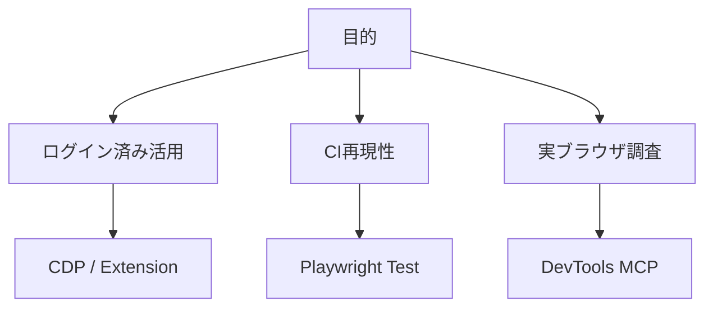
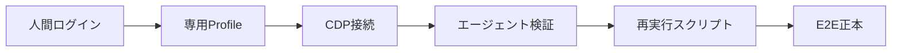

# ブラウザE2E向けMCPとAgent Skillsの最新比較

## 1. エグゼクティブサマリー

2026年5月時点で、ブラウザを使ったE2E検証をAIエージェントに任せる選択肢は「MCPサーバーを足す」だけでは整理できない。Microsoft系では、`@playwright/mcp` と `@playwright/cli` に加えて、`microsoft/Webwright` が出てきた。Google側は `chrome-devtools-mcp` を公開し、Vercel Labsの `agent-browser`、Browserbase/Stagehand、browser-use はCLI、Skill、クラウドブラウザ、自然言語操作を前面に出している。

<SourceNote>Microsoftの [Playwright MCP](https://github.com/microsoft/playwright-mcp)、[Playwright CLI](https://github.com/microsoft/playwright-cli)、[Webwright](https://github.com/microsoft/Webwright)、Googleの [Chrome DevTools MCP発表](https://developer.chrome.com/blog/chrome-devtools-mcp) と [chrome-devtools-mcp](https://github.com/ChromeDevTools/chrome-devtools-mcp)、Vercel Labsの [agent-browser](https://github.com/vercel-labs/agent-browser)、Browserbaseの [MCP Server docs](https://docs.browserbase.com/integrations/mcp/introduction)、Stagehandの [Introduction](https://docs.stagehand.dev/v3/first-steps/introduction)、browser-useの [README](https://github.com/browser-use/browser-use) を確認した。</SourceNote>

結論は次の通りである。

1. 既存のログイン済みブラウザセッションを活かしたいなら、最優先で見るべきは `Chrome DevTools MCP` の `autoConnect` 系、`Playwright MCP` の `--extension`、Webwright の `local_cdp`、AgentBrowser の `--profile` / `--auto-connect` / `--state` である。いずれも権限と秘密情報の扱いが重くなる。
2. 通常のアプリE2EをCIで再現したいなら、MCPより Playwright Test を正本にし、エージェントは失敗再現、スクリーンショット確認、テスト生成の補助に置くべきである。
3. エージェントに探索させたいなら `Playwright MCP` は導入が簡単で、アクセシビリティツリー中心に操作できる。ただしページ状態やツールスキーマをモデル文脈へ流しやすく、長い作業ではトークン効率が悪くなる。
4. ライブデバッグ、console/network/performance/LCP まで見たいなら `Chrome DevTools MCP` が強い。Chrome実体への接続とDevTools機能に寄っており、UI操作だけでなく原因調査向きである。
5. Microsoftの `Webwright` はMCPサーバーではなく、Agent Skills / plugin として「ブラウザ操作を再実行可能なPlaywrightコードにする」設計である。長いWebタスク、探索、証跡付き自動化には有望だが、通常の回帰E2Eの代替ではない。
6. Vercel Labsの `agent-browser` は、MCPではなくRust製CLIとbundled Skillで、accessibility snapshot、`@eN` refs、状態保存、diff、network、React/Web Vitals、dashboardをまとめる。既存Chrome profileの読み取りコピーを使える点がログイン済み検証では強い。
7. Browserbase/Stagehand や browser-use は、社外サイト、スクレイピング、業務Web操作、クラウド実行、スケール、プロキシ、セッション録画に強い。自社アプリの決定的E2Eでは過剰になることがある。

<SourceNote>`@playwright/mcp` の npm 最新は 2026年5月26日時点で `0.0.75`、`chrome-devtools-mcp` は同日 `1.1.0`、`@playwright/cli` は 2026年5月7日時点で `0.1.13`、`agent-browser` は 2026年5月18日時点で `0.27.0`、`@browserbasehq/mcp` は 2026年3月31日時点で `3.0.0` と確認した。npmの [@playwright/mcp](https://www.npmjs.com/package/@playwright/mcp)、[chrome-devtools-mcp](https://www.npmjs.com/package/chrome-devtools-mcp)、[@playwright/cli](https://www.npmjs.com/package/@playwright/cli)、[agent-browser](https://www.npmjs.com/package/agent-browser)、[@browserbasehq/mcp](https://www.npmjs.com/package/@browserbasehq/mcp) を参照。</SourceNote>

## 2. 何が違うのか

この領域の混乱は、名前が似ていても抽象レイヤーが違うところから来る。MCPはエージェントが外部ツールを呼ぶプロトコルであり、E2Eテストフレームワークではない。Agent Skillsは、特定のワークフローをエージェントに安定して実行させるための手順、スクリプト、参照資料のパッケージである。Playwright Testは人間とCIが実行するテストコードの正本である。

<SourceNote>OpenAI CodexのAgent Skillsドキュメントは、Skillを `SKILL.md`、任意の `scripts/`、`references/`、`assets/` で構成し、必要に応じてMCP依存を宣言できるものとして説明している。参照: [OpenAI Agent Skills](https://developers.openai.com/codex/skills)。</SourceNote>

| 種別             | 代表例                                   | 主な状態                           | 強い用途                         | 弱い用途                   |
| ---------------- | ---------------------------------------- | ---------------------------------- | -------------------------------- | -------------------------- |
| MCPブラウザ操作  | Playwright MCP、Chrome DevTools MCP      | ブラウザセッション                 | 対話的探索、ライブ検証、デバッグ | 大規模CIの正本             |
| CLI + Skill      | Playwright CLI、Webwright、AgentBrowser  | ワークスペース、ログ、スクリプト   | トークン効率、再実行、証跡       | MCP標準接続だけでの統合    |
| 通常E2E          | Playwright Test                          | テストコード、trace、storage state | CI回帰、決定的検証               | 未知UIの探索               |
| クラウドブラウザ | Browserbase/Stagehand、browser-use Cloud | クラウドセッション                 | 外部Web操作、スケール、録画      | 社内ローカル認証の即時流用 |

## 3. 主要候補

### 3.1 Playwright MCP

`@playwright/mcp` は、MCP経由でPlaywrightのブラウザ操作をエージェントに公開する。公式ドキュメントでは、スクリーンショットではなくアクセシビリティスナップショットを中心に、ページ要素のroleやtextを参照して操作する設計と説明されている。導入は `npx @playwright/mcp@latest` をMCPクライアントへ登録する形で、Codex、Claude Desktop、Cursor、VS Code、Windsurfなどに広く対応する。

<SourceNote>[Playwright MCP docs](https://playwright.dev/docs/getting-started-mcp) と [microsoft/playwright-mcp README](https://github.com/microsoft/playwright-mcp) を参照。</SourceNote>

ログイン済みセッションについては、3つの見方がある。既定はプロジェクトごとのpersistent profileで、cookieやlocalStorageを保存できる。完全に新しいセッションにしたい場合は `--isolated` を使う。さらに既存ブラウザタブに接続したい場合は Playwright Extension を使う `--extension` が案内されている。

<SourceNote>Playwright MCP公式ドキュメントの user profile 節は、persistent、isolated、browser extension の3モードを説明している。参照: [Playwright MCP - User profile](https://playwright.dev/docs/getting-started-mcp#user-profile)。</SourceNote>

注意点は2つある。第一に、MCPはエージェントの文脈へツール定義やページ状態を流すため、長い探索では文脈消費が増える。第二に、Playwright MCPのREADME自体が、coding agentには CLI + Skills の方が合う場合があると明記している。これはMCPが不要という意味ではなく、ブラウザの連続状態を重視するか、コードとログを正本にするかの違いである。

<SourceNote>[microsoft/playwright-mcp README](https://github.com/microsoft/playwright-mcp) は「coding agentならCLI+SKILLSが有益な場合がある」と案内している。Playwright CLI側もCLI+Skillのトークン効率を強調している。参照: [microsoft/playwright-cli](https://github.com/microsoft/playwright-cli)。</SourceNote>

### 3.2 Chrome DevTools MCP

`chrome-devtools-mcp` はGoogle Chrome DevToolsチームによるMCPサーバーで、Chrome実体をDevTools ProtocolとPuppeteerで操作する。強みは、クリックやフォーム入力だけでなく、console、network、performance trace、LCP、source-mapped stack trace といったDevTools寄りの情報をエージェントが扱える点にある。

<SourceNote>Googleは2025年9月23日に Chrome DevTools MCP の public preview を発表し、performance trace、network、console、runtime debugging の用途を説明している。参照: [Chrome DevTools MCP for your AI agent](https://developer.chrome.com/blog/chrome-devtools-mcp) と [ChromeDevTools/chrome-devtools-mcp README](https://github.com/ChromeDevTools/chrome-devtools-mcp)。</SourceNote>

ログイン済みセッション活用では、`autoConnect` によって実行中のChromeへ接続する構成が重要である。READMEは、ユーザーがChromeを起動し、MCPサーバーが実行中Chromeへ接続し、許可ダイアログを出す流れを説明している。これは「自分が普段使っているブラウザ状態に近いものを見せる」用途に向くが、その分、MCPクライアントにブラウザ内容を見せるリスクも大きい。

<SourceNote>[chrome-devtools-mcp README](https://github.com/ChromeDevTools/chrome-devtools-mcp) は、browser instanceの内容をMCP clientがinspect、debug、modifyできるため、共有したくない個人情報や機密情報を避けるよう注意している。また `autoConnect` はユーザー起動Chromeへの接続と許可ダイアログを説明している。</SourceNote>

Chrome DevTools MCPは、E2Eテストの正本というより「目のあるデバッガ」である。ローカル開発中に「画像が出ない」「CORSで落ちている」「LCPが悪い」「consoleで例外が出ている」を調べる用途に強い。

### 3.3 Playwright CLI + Skills

`@playwright/cli` は、エージェントがシェルコマンドでブラウザを開き、スナップショットをファイルへ保存し、クリック、入力、trace、network、console、screenshotなどを行うCLIである。MicrosoftのREADMEは、coding agentにはMCPよりCLI + Skillsがトークン効率で有利になる場面があると説明している。状態をMCP応答として毎回大きく返すのではなく、スナップショットやスクリーンショットをファイルに残すためである。

<SourceNote>[microsoft/playwright-cli](https://github.com/microsoft/playwright-cli) は、CLIが大きなツールスキーマやアクセシビリティツリーをモデル文脈へ常時載せないため、coding agentに向くと説明している。</SourceNote>

ログイン済み状態では、CLIはセッション、persistent profile、CDP attach、extension attach を使える。つまり「探索はログイン済みの実ブラウザへattachし、最後はPlaywright Testや再実行可能スクリプトへ落とす」という橋渡しに向く。

### 3.4 Webwright

`microsoft/Webwright` は、ユーザーが挙げた通り、この調査で必ず見るべき新しいMicrosoft系ツールである。ただし、位置づけはMCPサーバーではない。Webwrightは、CodexやClaude Codeなどのcoding agentに、ブラウザタスクを「Python + Playwrightの再実行可能スクリプト」として解かせるAgent Skill / pluginである。READMEは、ブラウザセッション自体ではなく、コード、ログ、スクリーンショットがあるローカルワークスペースを状態として扱う、と説明している。

<SourceNote>[microsoft/Webwright README](https://github.com/microsoft/Webwright) は、2026年5月4日の初回公開、2026年5月6日のCodex/Claude Code plugin manifest追加、2026年5月11日のTask2UI modeをニュースとして挙げている。また、状態を「browser session」ではなく「local workspace」に置く設計を説明している。</SourceNote>

Webwrightの価値は、長いWebタスクを、エージェントの一連のクリック履歴ではなく、証跡付きの `final_script.py` として残す点にある。WebwrightはREADMEで Online-Mind2Web と Odysseys のベンチマーク成績を主張しているが、これは公式リポジトリ側の自己報告であり、現時点では外部査読済み評価ではない。実務では「未知の外部Webサイトを探索し、最後にスクリプト化する」用途で試す価値が高い。

<SourceNote>Webwrightの性能値は [microsoft/Webwright README](https://github.com/microsoft/Webwright) と Microsoft blog へのリンクに基づくプロジェクト主張である。第三者再現性は別途確認が必要である。</SourceNote>

ログイン済みセッションに関しては注意が必要である。Webwrightリポジトリには `local_browser.yaml` があり、`browser_mode: local_cdp` を「manual Google login」に推奨するコメントがある。一方、同梱Skillの一部説明では、fresh Firefoxを起動し persistent state はないというローカル実行契約も見える。つまりWebwrightは「ログイン済み利用が可能な構成を持つ」が、導入時には使うSkill/設定が `local_cdp` になっているかを確認する必要がある。

<SourceNote>Webwrightの `src/webwright/config/local_browser.yaml` は `local_cdp` を「real Chrome/Edge over CDP, recommended for manual Google login」と説明する。一方、`skills/webwright/SKILL.md` は一部のClaude Code適応で fresh Firefox と非persistent state を前提にする。参照: [microsoft/Webwright](https://github.com/microsoft/Webwright)。</SourceNote>

### 3.5 AgentBrowser

`vercel-labs/agent-browser` は、Vercel Labsの「Browser automation CLI for AI agents」である。位置づけはMCPサーバーではなく、Rust製CLI、常駐daemon、Chrome/Chromium CDP、accessibility-tree snapshot、`@eN` element refs、bundled Skillを組み合わせるAgent向けブラウザ実行層である。`agent-browser skills get core` で、インストール済みCLIのバージョンに合ったSkill本文を取り出す設計も特徴である。

<SourceNote>[vercel-labs/agent-browser README](https://github.com/vercel-labs/agent-browser) は、native Rust CLI、Chrome/Chromium via CDP、accessibility snapshot、`@eN` refs、bundled skill content、`npx skills add vercel-labs/agent-browser` を説明している。npmの `agent-browser` は 2026年5月18日時点で `0.27.0` と確認した。</SourceNote>

ログイン済みセッション活用では、この候補はかなり強い。READMEは、既存Chrome profile名を `--profile Default` や `--profile "Work"` で指定すると、元profileを変更せず一時ディレクトリへコピーしてcookieやsessionを再利用できると説明している。さらに、専用profileディレクトリ、`--session-name` によるcookie/localStorage自動保存、`--auto-connect state save` による既存Chromeからのstate取り込み、`--state`、暗号化されたauth vaultを持つ。

<SourceNote>[agent-browser READMEのAuthentication節](https://github.com/vercel-labs/agent-browser) は、Chrome profile reuse、persistent profile、session persistence、`--auto-connect` + `state save`、state file、auth vaultを比較している。state fileはsession tokenを含むためgitignoreと削除が必要で、`AGENT_BROWSER_ENCRYPTION_KEY` による暗号化も案内されている。</SourceNote>

AgentBrowserの実務上の強みは、回帰E2Eそのものよりも「エージェントが安全にブラウザを触るためのCLI面」を厚くしている点にある。network / HAR、trace、profiler、console、visual diff、snapshot diff、React introspection、Web Vitals、annotated screenshot、dashboard、domain allowlist、action policy、confirmation、output length limitまで同じCLIに入っている。Playwright Testの代替というより、ローカルQA、探索、証跡作成、ログイン済み再現を1つのCLIで扱う選択肢である。

<SourceNote>[agent-browser README](https://github.com/vercel-labs/agent-browser) は、network/HAR、trace/profiler/console/errors、diff、React/Web Vitals、dashboard、domain allowlist、action policy、confirmation、content boundariesを説明している。これらは本稿では「エージェント用操作面と安全策」として評価した。</SourceNote>

### 3.6 Browserbase / Stagehand MCP

Browserbase MCPは、Stagehandを土台に、MCP clientへクラウドブラウザを提供する。自然言語でクリックやフォーム入力を指示でき、セッション作成、再利用、終了、録画、ログ、プロキシ、ブラウザIDなどのクラウド運用面が強い。Stagehand自体は `act`、`extract`、`observe`、`agent` というプリミティブで、自然言語とコードを混ぜてWeb自動化する設計である。

<SourceNote>[Browserbase MCP Server docs](https://docs.browserbase.com/integrations/mcp/introduction) は hosted Streamable HTTP endpoint を推奨し、natural language automation、session lifecycle、recording、proxy support を説明している。[Stagehand introduction](https://docs.stagehand.dev/v3/first-steps/introduction) は `act`、`extract`、`observe`、`agent` を説明している。</SourceNote>

自社アプリのローカルE2Eというより、外部Webタスク、データ抽出、業務サイト操作、クラウド実行のための選択肢である。ログイン済み状態はクラウド側のセッションやprofile同期の設計になるため、普段使いのローカルChromeセッションをそのまま見せる用途ではない。

### 3.7 browser-use

browser-useは、PythonベースのAIブラウザエージェントで、CLI、Cloud、Claude Code Skillを持つ。READMEは、フォーム入力、買い物、調査、Cloudによるstealth、proxy rotation、captcha対応、persistent filesystem and memory を強調している。E2Eテストフレームワークというより、Web操作エージェント基盤である。

<SourceNote>[browser-use README](https://github.com/browser-use/browser-use) は、Pythonライブラリ、CLI、Cloud、Claude Code Skill、Cloudでのstealth/proxy/captcha対応を説明している。</SourceNote>

## 4. ログイン済みセッションを活かす観点

ログイン済みセッションを活かせることは、実務では決定的に重要である。SSO、MFA、社内IdP、IP制限、デバイス認証、captcha、bot対策があると、CI用の認証情報だけでE2Eを完結できないことが多い。その場合、エージェントが「人間がログイン済みのブラウザ」を観察・操作できるかが、検証可能性を左右する。

ただし、これは便利さと危険性が同じ根を持つ。ログイン済みブラウザに接続するツールは、メール、社内管理画面、決済、顧客情報、cookie、localStorage、CSRF token、console/network上の機密情報へアクセスしうる。MCPやAgent Skillを有効化する前に、使うブラウザprofile、接続先、ツール許可、記録ログ、スクリーンショット保存先を分離するべきである。

<SourceNote>Chrome DevTools MCP READMEは、ブラウザ内容をMCP clientがinspect/debug/modifyできるため、共有したくない個人情報や機密情報を避けるよう警告している。Playwright MCP READMEもMCPをsecurity boundaryではないと明記している。参照: [chrome-devtools-mcp](https://github.com/ChromeDevTools/chrome-devtools-mcp)、[playwright-mcp](https://github.com/microsoft/playwright-mcp)。</SourceNote>

| 方式                              | ログイン済み活用     | 向く場面                   | 注意点                             |
| --------------------------------- | -------------------- | -------------------------- | ---------------------------------- |
| Chrome DevTools MCP `autoConnect` | 実行中Chromeへ接続   | ローカル再現、DevTools調査 | 開いているprofile全体の露出に注意  |
| Playwright MCP `--extension`      | 既存ブラウザタブ接続 | エージェント探索           | extension導入と権限管理が必要      |
| Playwright MCP persistent profile | 専用profileに保存    | 反復検証                   | 普段のChromeとは別状態             |
| Webwright `local_cdp`             | Chrome/Edge over CDP | 長いタスクのスクリプト化   | Skill設定がlocal_cdpか確認         |
| AgentBrowser `--profile`          | 既存Chrome profileをコピー | ローカルQA、ログイン済み再現 | 元profileではなくsnapshot、token管理注意 |
| AgentBrowser `--auto-connect`     | 実行中Chromeからstate保存 | 既存ログインの取り込み     | remote debugging portの露出に注意 |
| Playwright Test `storageState`    | 認証状態を保存       | CI回帰                     | 期限切れ、secret保護、人手更新     |
| Browserbase/Stagehand             | クラウドセッション   | 外部Web操作、スケール      | ローカルログインの即時流用ではない |

## 5. 実務導入方針

最も堅い構成は、次の三層に分けることだ。

1. 調査・再現層: Chrome DevTools MCP、Playwright MCP、Webwright local_cdp、AgentBrowser profile/state を使い、ログイン済み専用profileで現象を再現する。
2. 証跡・スクリプト化層: Webwright、AgentBrowser、またはPlaywright CLIで、スクリーンショット、ログ、state、trace、最終スクリプトを残す。
3. 回帰テスト層: Playwright Testへ落とし込み、CIでは `storageState`、テスト用アカウント、専用IdP bypass、またはOIDC test tenantで再現する。

ログイン済みブラウザをそのままCIへ持ち込もうとすると、cookie期限、MFA、端末紐付け、secret漏洩、監査ログの問題が出る。CIでは「人間の本物セッション」ではなく、「テスト専用アカウントのstorage state」か「APIで準備した認証状態」を使う方がよい。人間ログイン済みセッションは、あくまでローカル再現と探索に限定するのが安全である。

<SourceNote>Playwrightの認証状態保存は通常のPlaywright Test運用で広く使われるが、本稿の推奨はPlaywright MCP / Webwright / Chrome DevTools MCPの公開仕様と、ログイン済みブラウザが持つ権限リスクからの実務推論である。MCPをsecurity boundaryとして扱わない点は [Playwright MCP README](https://github.com/microsoft/playwright-mcp) と [Chrome DevTools MCP README](https://github.com/ChromeDevTools/chrome-devtools-mcp) に基づく。</SourceNote>

## 6. 推奨構成

個人開発や小規模プロダクトでは、まず次を試すのがよい。

1. 通常の回帰E2E: Playwright Test。
2. ローカルでの見た目・console・network確認: Chrome DevTools MCP。
3. エージェントに未知フローを探索させる: Playwright MCP。
4. ログイン済みprofileを使ったローカルQAと証跡収集: AgentBrowser。
5. 長いWeb操作を再利用可能スクリプトにする: Webwright。

企業利用では、ログイン済みセッションを扱うために次の制約を追加する。

1. 普段使いprofileではなく、検証専用Chrome/Edge profileを作る。
2. MCP/Skillに渡すprofileには、対象アプリ以外のログインを入れない。
3. スクリーンショットとログの保存先をリポジトリ外またはgitignore配下にする。
4. エージェントが実行できる破壊的操作を、テスト環境と権限で制限する。
5. CIへは人間セッションを持ち込まず、テスト用storage stateへ移行する。

## 7. まとめ

ユーザーが指摘した `microsoft/Webwright` は「Microsoftから出た新しいツール」として正しい。ただし、`Playwright MCP` の後継ではなく、MCPとは別のAgent Skill / plugin路線である。`vercel-labs/agent-browser` も同じくMCPではなく、Agent向けCLI + Skillの実行層である。MCPが「ブラウザ状態をエージェントの道具として開く」のに対し、Webwrightは「ブラウザ探索をコードとログへ変換する」、AgentBrowserは「ログイン済みprofile、refs、debug、diff、安全策をCLIとしてまとめる」。ログイン済みセッションを重視するなら、Webwrightの `local_cdp`、AgentBrowserの `--profile` / `--auto-connect`、Chrome DevTools MCPの `autoConnect`、Playwright MCPの `--extension` を比較し、最終的な回帰テストはPlaywright Testへ落とすのが現時点の実務解である。

## 参考情報

- [microsoft/Webwright](https://github.com/microsoft/Webwright)
- [vercel-labs/agent-browser](https://github.com/vercel-labs/agent-browser)
- [agent-browser npm](https://www.npmjs.com/package/agent-browser)
- [microsoft/playwright-mcp](https://github.com/microsoft/playwright-mcp)
- [Playwright MCP docs](https://playwright.dev/docs/getting-started-mcp)
- [microsoft/playwright-cli](https://github.com/microsoft/playwright-cli)
- [Chrome DevTools MCP announcement](https://developer.chrome.com/blog/chrome-devtools-mcp)
- [ChromeDevTools/chrome-devtools-mcp](https://github.com/ChromeDevTools/chrome-devtools-mcp)
- [Browserbase MCP Server docs](https://docs.browserbase.com/integrations/mcp/introduction)
- [Stagehand introduction](https://docs.stagehand.dev/v3/first-steps/introduction)
- [browser-use/browser-use](https://github.com/browser-use/browser-use)
- [OpenAI Agent Skills](https://developers.openai.com/codex/skills)
