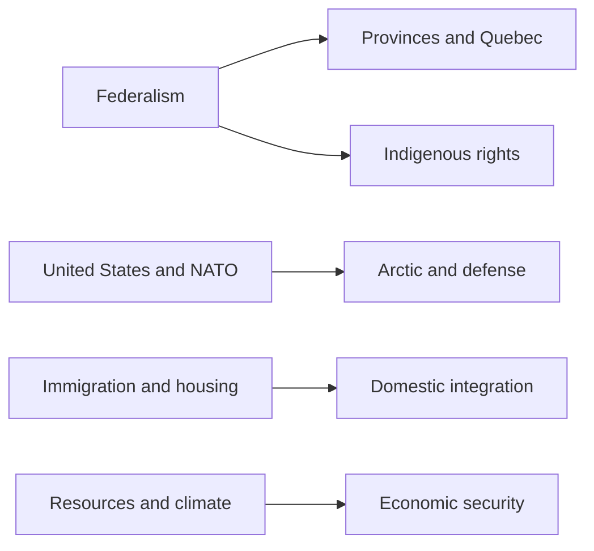

# Canada Is Not a Quiet Ally

## 1. Executive Summary

Canada can look mild and predictable, but in practice it is a country where federalism, Quebec, Indigenous rights, immigration, housing scarcity, and the management of the United States all move at once. <SourceNote>Canada’s federal structure is described in [Federalism in Canada](https://www.canada.ca/en/intergovernmental-affairs/services/federation/federalism-canada.html) and [The constitutional distribution of legislative powers](https://www.canada.ca/en/intergovernmental-affairs/services/federation/distribution-legislative-powers.html).</SourceNote>

In the 2025 federal election, the Liberal Party won 169 seats and the Conservative Party won 144, so minority government continued. <SourceNote>See Elections Canada’s [45th General Election: Official Voting Results](https://www.elections.ca/content.aspx?dir=rep%2Foff%2Fsta_ge45&document=p2&lang=e&section=res).</SourceNote>

Mark Carney became prime minister in March 2025, and Canada’s politics in 2026 are being shaped by defense, the Arctic, and industrial policy. <SourceNote>See the Prime Minister’s Office [About](https://www.pm.gc.ca/en/about) page and the PMO homepage.</SourceNote>

The key reading is that Canada is easier to understand as an ally with high domestic coordination costs than as a “quiet middle-power” story. <SourceNote>That reading makes the interplay of federalism, migration, housing, U.S. relations, and Arctic defense easier to see.</SourceNote>

## 2. Historical and Institutional Base

Confederation in 1867 brought several British North American colonies into one state in response to defense, trade, and uncertainty about the United States. <SourceNote>Canada’s government explains Confederation in [Federalism in Canada](https://www.canada.ca/en/intergovernmental-affairs/services/federation/federalism-canada.html) as a way to reconcile linguistic, economic, and cultural diversity.</SourceNote>

The Constitution of 1982 added the Charter of Rights and Freedoms and gave constitutional protection to existing Aboriginal and treaty rights. <SourceNote>See Justice Canada’s [Provision and context](https://justice.canada.ca/eng/csj-sjc/ijr-dja/35pedia-wiki35/p2.html) and [The Constitution Acts, 1867 to 1982](https://laws-lois.justice.gc.ca/eng/const/FullText.html).</SourceNote>

The Canadian Multiculturalism Act of 1988 turned multiculturalism into law, and the United Nations Declaration on the Rights of Indigenous Peoples Act of 2021 created a framework for implementation in federal law and policy. <SourceNote>See Canadian Heritage’s [About the Canadian Multiculturalism Act](https://www.canada.ca/en/canadian-heritage/services/about-multiculturalism-anti-racism/about-act.html) and Justice Canada’s [About the Act](https://justice.canada.ca/eng/declaration/legislation.html).</SourceNote>

The institutional point is that Canada is not a country where the center decides everything. Parliament is made up of the Crown, the Senate, and the House of Commons, and federal and provincial powers are divided in the Constitution. <SourceNote>See Parliament of Canada’s [Parliamentary Primer](https://library-biblio.parl.ca/staticfiles/Learn/assets/html/ParliamentaryPrimer/ParliamentaryPrimer_En.html) and the government’s [The constitutional distribution of legislative powers](https://www.canada.ca/en/intergovernmental-affairs/services/federation/distribution-legislative-powers.html).</SourceNote>

## 3. Current Power Configuration

After the 2025 election, the House of Commons stood at 169 Liberals, 144 Conservatives, 22 Bloc Québécois, 7 New Democrats, and 1 Green. <SourceNote>See Elections Canada’s [Official Voting Results](https://www.elections.ca/res/rep/off/ovrGE45/home.html).</SourceNote>

| Main actor | Role | What to watch |
| --- | --- | --- |
| Federal government | Sets the frame for budgets, foreign policy, defense, and immigration | Whether minority support holds |
| Provincial governments | Hold strong leverage over health, education, housing, resources, and services | Coordination among Ontario, Quebec, and Alberta |
| Indigenous governments and organizations | Are core parties in land, water, resources, treaties, and consultation | Whether consent and consultation work in practice |
| Quebec | Drives negotiation over language, culture, and autonomy | Reactions to French-language policy and federal transfers |
| Courts | Define the boundaries of rights, federalism, and treaties | The effects of constitutional litigation |

Because the government is a minority government, housing, tax policy, immigration, defense, and industrial policy move more through bargaining with provinces and Parliament than through command from Ottawa alone. <SourceNote>This is an inference from Canada’s federal structure and the 2025 election result.</SourceNote>

When you read Canada, Quebec and Indigenous peoples are not peripheral stories. Both are central bargaining partners that shape the legitimacy of the state and the speed of policy delivery. <SourceNote>Canadian Heritage’s official languages and multiculturalism policy, together with Justice Canada’s UNDRIP materials, make that dual bargaining structure visible.</SourceNote>

## 4. The Main External Fronts

### 1. The United States

The U.S. remains the center of Canada’s external relations, but the relationship is no longer automatic. Ottawa is trying to protect access to the U.S. market while managing tariffs, the CUSMA review, and supply-chain reordering at the same time. <SourceNote>See [Canada-United States: Overview and federal supports](https://www.canada.ca/en/government/united-states-canada.html) and Global Affairs Canada’s [Canada’s engagement with the United States](https://international.canada.ca/en/global-affairs/campaigns/canada-us-engagement).</SourceNote>

U.S. policy for Canada is not just alliance maintenance. It is also domestic economic security policy. <SourceNote>That framing follows from Finance Canada’s U.S. tariff materials and Global Affairs Canada’s briefing material.</SourceNote>

### 2. NATO and Arctic Security

Canada achieved NATO’s 2% defense-spending benchmark in March 2026. That is a political turning point in a long-running debate over whether Canada spends enough on defense. <SourceNote>See National Defence’s [Canada achieves the 2% of gross domestic product defence spending benchmark](https://www.canada.ca/en/department-national-defence/news/2026/03/canada-achieves-the-2-of-gross-domestic-product-defence-spending-benchmark.html).</SourceNote>

In the Arctic, the 2024 [Canada’s Arctic Foreign Policy](https://international.canada.ca/en/global-affairs/corporate/reports/arctic-policy-2024) treats a warming Arctic, Russian military activity, and Chinese strategic interest as one problem set. The 2026 Arctic security statement likewise showed that the region is now understood as both an economic opportunity and a security challenge. <SourceNote>See the [Joint Statement on Arctic Security from the Arctic Allies](https://www.canada.ca/en/global-affairs/news/2026/05/joint-statement-on-arctic-security-from-the-arctic-allies-canada-the-kingdom-of-denmark-including-greenland-and-the-faroe-islands-finland-iceland-n.html).</SourceNote>

### 3. China and India

Canada’s Indo-Pacific Strategy says it will keep working with China on global challenges while defending Canadian interests and values. <SourceNote>See Global Affairs Canada’s [Canada’s Indo-Pacific Strategy – 2022 to 2023 Implementation Update](https://international.canada.ca/en/global-affairs/corporate/reports/indo-pacific-implementation-2022-2023).</SourceNote>

At the same time, CSIS’s 2025 public report says that China and India remain among the main foreign-interference actors targeting Canada. Relations with India have improved with the restoration of high commissioners and renewed security dialogue, but trust repair is still incomplete. <SourceNote>See CSIS’s [Public Report 2025](https://www.canada.ca/content/dam/csis-scrs/images/2025/public-report/Public%20Report_EN_2025_DIGITAL.pdf), the [Statement on Trip to India](https://www.canada.ca/en/privy-council/news/2025/09/statement-on-trip-to-india.html), and the [Canada-India Joint Statement](https://www.canada.ca/en/global-affairs/news/2025/10/canada-india-joint-statement-renewing-momentum-towards-a-stronger-partnership.html).</SourceNote>

Canada’s China and India files are not only about trade and diaspora. They also involve foreign interference, security, and the safety of domestic communities. <SourceNote>CSIS’s foreign-interference materials make that domestic–external link explicit.</SourceNote>

### 4. Resources, Climate, and Supply Chains

Canada is a resource economy, but resources are not just exports. Natural Resources Canada says the natural-resources sector accounted for 16% of nominal GDP in 2024, and the Critical Minerals Strategy places critical minerals at the intersection of the green economy, the digital economy, and national security. <SourceNote>See Natural Resources Canada’s [10 key facts on Canada’s natural resources – 2024](https://natural-resources.canada.ca/science-data/data-analysis/10-key-facts-canada-s-natural-resources-2024) and [Canada’s Critical Minerals Strategy](https://www.canada.ca/en/campaign/critical-minerals-in-canada/canadas-critical-minerals-strategy.html).</SourceNote>

Forestry matters in the same way. It supports jobs and exports, while also being exposed to trade friction with the United States. Natural Resources Canada’s 2025 forest report says the sector’s nominal GDP was CAD 30.7 billion in 2024, and exports were CAD 37.2 billion. <SourceNote>See Natural Resources Canada’s [The State of Canada’s Forests: Annual Report 2025](https://natural-resources.canada.ca/forests-forestry/state-canada-forests/state-canada-s-forests-annual-report-2025).</SourceNote>

Climate policy is not only environmental policy. It is also a reorganization of power, electricity, minerals, construction, and industry. Canada has already published its 2050 net-zero commitment, its 2030 emissions reduction plan, and its 2035 target, so the live debate is less about whether the target exists and more about who bears the cost. <SourceNote>See Environment and Climate Change Canada’s [2030 Emissions Reduction Plan](https://www.canada.ca/en/services/environment/weather/climatechange/climate-plan/climate-plan-overview/emissions-reduction-2030.html) and [2025 Progress Report](https://www.canada.ca/en/services/environment/weather/climatechange/climate-plan/climate-plan-overview/emissions-reduction-2030/2025-progress-report.html).</SourceNote>

## 5. Social Life and Integration

Canada’s population was 41,417,056 on April 1, 2026, and the number of non-permanent residents was 2,558,562. IRCC’s 2026–2028 plan aims to bring temporary residents back below 5% of the population and keep permanent-resident admissions below 1% of the population beyond 2027. <SourceNote>See Statistics Canada’s [Canada's population estimates, first quarter 2026](https://www150.statcan.gc.ca/n1/daily-quotidien/260617/dq260617a-eng.htm) and IRCC’s [Immigration levels](https://www.canada.ca/en/immigration-refugees-citizenship/corporate/mandate/corporate-initiatives/levels.html).</SourceNote>

Housing scarcity turns that migration adjustment into a political issue. CMHC says housing starts rose in 2025, but Canada would need about 417,000 to 469,000 starts a year to restore affordability to pre-pandemic levels by 2036. <SourceNote>See CMHC’s [Slowing home construction threatens recent affordability gains](https://www.cmhc-schl.gc.ca/media-newsroom/news-releases/2026/slowing-home-construction-threatens-recent-affordability-gains).</SourceNote>

That means immigration is both a success story of multiculturalism and a test of housing, transit, schools, health care, and municipal capacity. <SourceNote>Reading IRCC’s levels plan together with CMHC’s housing reports makes that burden structure visible.</SourceNote>

Multiculturalism is central to Canadian self-understanding, but it is not a cure-all. The 1988 legal framework, bilingual policy, and the multilingual reality that includes Indigenous languages create an inclusion framework, but they also generate friction with Quebec’s language politics and local administrative capacity. <SourceNote>See Canadian Heritage’s [About the Canadian Multiculturalism Act](https://www.canada.ca/en/canadian-heritage/services/about-multiculturalism-anti-racism/about-act.html) and [Official languages and bilingualism](https://www.canada.ca/en/canadian-heritage/services/official-languages-bilingualism.html).</SourceNote>

## 6. What This Means for Japan and East Asia

From Japan’s point of view, Canada is more than a resource supplier. It matters for the Arctic route, critical minerals, clean energy, forest products, and the G7 and NATO settings that shape rules and standards. <SourceNote>The point follows from Natural Resources Canada’s critical-minerals material, Global Affairs Canada’s Arctic Foreign Policy, and National Defence’s NATO spending materials.</SourceNote>

Canada is also tightly linked to the United States, so its Asia policy is filtered through the North American security environment. Supply chains, battery materials, data, ports, Arctic surveillance, and NORAD modernization are all connected to Canada even when the Pacific is the visible theater. <SourceNote>That is an inference from the Canada-U.S. materials and the Arctic/NATO documents.</SourceNote>

For Japanese firms, Canada is a market with a stable legal system, but provincial regulation, Indigenous consultation, environmental review, housing costs, and labor shortages can all slow projects. <SourceNote>Federalism, UNDRIP, the Critical Minerals Strategy, and forest-sector policy together show those practical delay factors.</SourceNote>

## 7. Monitoring Points

If you use Canada as a country profile for news reading, five indicators are worth watching. <SourceNote>This section restates the article’s public-information reading in operational terms.</SourceNote>

- Whether the minority government keeps support on budgets, defense, housing, and immigration.
- Whether temporary-resident reductions actually ease rents without choking labor supply.
- Where U.S. tariff fights, CUSMA negotiations, and industrial subsidies become political flashpoints.
- How quickly military, maritime, and coast-guard presence in the Arctic expands.
- Whether concern over Chinese and Indian interference undermines trust repair at home.

## 8. Risks and Limits

There are three limits to this profile. First, public information does not reveal private bargaining inside the federal government or between provinces. Second, statistics on migration, housing, defense, and energy move quickly, so parts of this report will be updated by later releases. Third, any forecast for the Arctic, China, or India remains an inference from public information rather than a guarantee. <SourceNote>This limit follows from the public materials of Statistics Canada, IRCC, National Defence, Global Affairs Canada, and CSIS.</SourceNote>

Even so, Canada’s position is readable. Domestic coordination costs are rising, and external alliance obligations are getting heavier. When you read Canada in the news, it is usually safer to start with the four-way tension between the federal center, the provinces, Indigenous governments, and the United States than with the country’s self-image as a calm middle power. <SourceNote>That conclusion follows from the combined reading of federalism, migration, housing, NATO, the Arctic, and foreign-interference material.</SourceNote>
