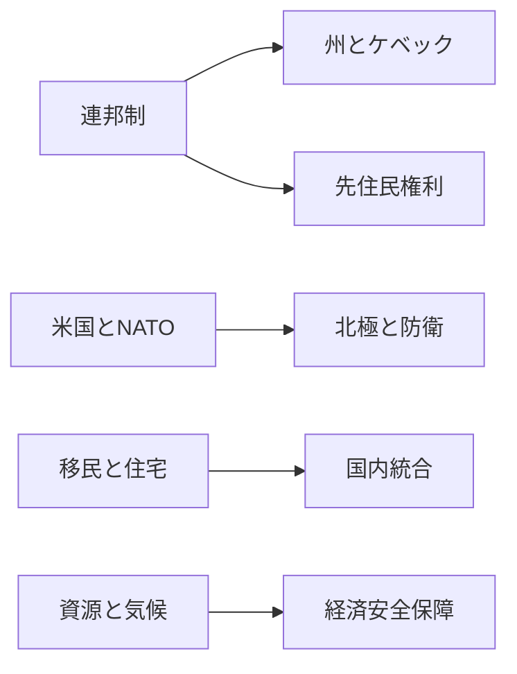

# 静かな同盟国ではないカナダ

## 1. エグゼクティブサマリー

カナダは温和で予測しやすい国に見えるが、実際には連邦制、ケベック、先住民権利、移民、住宅不足、そして対米関係の調整が同時に動く国である。<SourceNote>カナダ政府の [Federalism in Canada](https://www.canada.ca/en/intergovernmental-affairs/services/federation/federalism-canada.html) と [The constitutional distribution of legislative powers](https://www.canada.ca/en/intergovernmental-affairs/services/federation/distribution-legislative-powers.html) は、カナダが複数の統治レベルを前提にした連邦国家であることを示している。</SourceNote>

2025年の連邦選挙では自由党が169議席、保守党が144議席を得て、少数与党が続いた。<SourceNote>選挙管理当局の [45th General Election: Official Voting Results](https://www.elections.ca/content.aspx?dir=rep%2Foff%2Fsta_ge45&document=p2&lang=e&section=res) による。</SourceNote>

Mark Carneyは2025年3月に首相に就き、2026年のカナダ政治は防衛、北極、産業政策を前面に出す形で動いている。<SourceNote>首相府の [About](https://www.pm.gc.ca/en/about) と首相府トップページの掲載情報を参照。</SourceNote>

このレポートの結論は、カナダを「穏健な中道国家」として読むよりも、「同盟国でありながら国内調整コストの高い国家」として読む方が、ニュースを外しにくいという点にある。<SourceNote>この読み方は、連邦制、移民管理、住宅供給、対米関係、北極防衛を束ねて読むと理解しやすい。</SourceNote>

## 2. 歴史と制度の骨格

1867年の連邦成立は、英領北アメリカの複数の植民地が、防衛、通商、そして対米不安への対応のために一つの国家にまとまった結果だった。<SourceNote>カナダ政府の [Federalism in Canada](https://www.canada.ca/en/intergovernmental-affairs/services/federation/federalism-canada.html) は、1867年の連邦形成を、言語的・経済的・文化的差異を調停するための制度として説明している。</SourceNote>

1982年の憲法は、権利章典と同時に、先住民の既存権利と条約権利を憲法上保護する枠組みを置いた。<SourceNote>法務省の [Provision and context](https://justice.canada.ca/eng/csj-sjc/ijr-dja/35pedia-wiki35/p2.html) と [The Constitution Acts, 1867 to 1982](https://laws-lois.justice.gc.ca/eng/const/FullText.html) を参照。</SourceNote>

1988年の Canadian Multiculturalism Act は、多文化主義を社会の基本原理として法文化した。2021年の United Nations Declaration on the Rights of Indigenous Peoples Act は、先住民権利を国内法と政策に実装するための枠組みを与えた。<SourceNote>Canadian Heritage の [About the Canadian Multiculturalism Act](https://www.canada.ca/en/canadian-heritage/services/about-multiculturalism-anti-racism/about-act.html) と法務省の [About the Act](https://justice.canada.ca/eng/declaration/legislation.html) を参照。</SourceNote>

制度の要点は、中央がすべてを決める国ではないことだ。国会は Crown、上院、下院の三部構成で、連邦と州・準州の権限は憲法上に分かれている。<SourceNote>Parliament of Canada の [Parliamentary Primer](https://library-biblio.parl.ca/staticfiles/Learn/assets/html/ParliamentaryPrimer/ParliamentaryPrimer_En.html) と政府の [The constitutional distribution of legislative powers](https://www.canada.ca/en/intergovernmental-affairs/services/federation/distribution-legislative-powers.html) を参照。</SourceNote>

## 3. 現在の権力配置

2025年選挙後の下院では、自由党169、保守党144、ブロック・ケベコワ22、NDP7、緑1という構図になった。<SourceNote>選挙管理当局の [Official Voting Results](https://www.elections.ca/res/rep/off/ovrGE45/home.html) を参照。</SourceNote>

| 主要アクター | 役割 | 何を見るか |
| --- | --- | --- |
| 連邦政府 | 予算、外交、防衛、移民の骨格を置く | 少数与党を保てるか |
| 州政府 | 医療、教育、住宅、資源、公共サービスに強い | オンタリオ、ケベック、アルバータの調整 |
| 先住民政府と組織 | 土地、水、資源、条約、協議の当事者 | 同意と協議が実務で機能するか |
| ケベック | 言語、文化、自治の交渉を動かす | フランス語政策と連邦財政への反応 |
| 司法 | 権利、連邦制、条約の境界を定義する | 憲法訴訟の帰結 |

少数与党のため、住宅、税制、移民、防衛、産業政策は、連邦政府が単独で押し切るよりも、州政府と議会内の合意形成を通じて進む。<SourceNote>Canadian federalism の制度説明と、2025年選挙結果を組み合わせた公開情報からの判断である。</SourceNote>

カナダの政治を読むとき、ケベックと先住民は別々の「周辺」ではない。どちらも、国家の正統性と政策の実装速度を左右する中心的な交渉相手である。<SourceNote>Canadian Heritage の公用語・多文化主義政策と法務省の UNDRIP 関連資料は、この二重の交渉構造を示している。</SourceNote>

## 4. 対外関係の主戦場

### 1. 米国関係

米国との関係は、カナダの対外関係の中心であり続けるが、もはや自動運転ではない。連邦政府は、米国市場へのアクセスを守りながら、関税、CUSMA見直し、供給網の再配置に同時対応している。<SourceNote>Canada.ca の [Canada-United States: Overview and federal supports](https://www.canada.ca/en/government/united-states-canada.html) と Global Affairs Canada の [Canada’s engagement with the United States](https://international.canada.ca/en/global-affairs/campaigns/canada-us-engagement) を参照。</SourceNote>

対米政策は同盟維持だけではなく、経済安全保障の国内政策でもある。<SourceNote>Department of Finance の対米関係資料と Global Affairs Canada のブリーフィング資料は、その位置づけを明示している。</SourceNote>

### 2. NATO と北極安全保障

カナダは2026年3月にNATOの防衛費2%基準を達成した。これは、長く続いた「防衛支出は足りるのか」という問いに対する政治的な転換点である。<SourceNote>National Defence の [Canada achieves the 2% of gross domestic product defence spending benchmark](https://www.canada.ca/en/department-national-defence/news/2026/03/canada-achieves-the-2-of-gross-domestic-product-defence-spending-benchmark.html) を参照。</SourceNote>

北極では、2024年の [Canada’s Arctic Foreign Policy](https://international.canada.ca/en/global-affairs/corporate/reports/arctic-policy-2024) が、気候変動で開かれる海と、ロシアの軍事活動、中国の戦略的関心を同時に扱っている。2026年の北極安全保障共同声明も、北極が「経済機会」と「安全保障上の課題」を同時に含む空間になったことを示した。<SourceNote>[Joint Statement on Arctic Security from the Arctic Allies](https://www.canada.ca/en/global-affairs/news/2026/05/joint-statement-on-arctic-security-from-the-arctic-allies-canada-the-kingdom-of-denmark-including-greenland-and-the-faroe-islands-finland-iceland-n.html) を参照。</SourceNote>

### 3. 中国とインド

カナダの Indo-Pacific Strategy は、中国と「世界的課題には協力しつつ、利益と価値は守る」という二重の姿勢を採る。<SourceNote>Global Affairs Canada の [Canada’s Indo-Pacific Strategy – 2022 to 2023 Implementation Update](https://international.canada.ca/en/global-affairs/corporate/reports/indo-pacific-implementation-2022-2023) を参照。</SourceNote>

一方で、CSIS の2025年公表資料では、外国による干渉の主要行為者として中国とインドが引き続き挙げられている。インドとは高等弁務官の再交換と安全保障対話の再開で関係改善が進んだが、信頼の修復はまだ途上である。<SourceNote>CSIS の [Public Report 2025](https://www.canada.ca/content/dam/csis-scrs/images/2025/public-report/Public%20Report_EN_2025_DIGITAL.pdf) と [Statement on Trip to India](https://www.canada.ca/en/privy-council/news/2025/09/statement-on-trip-to-india.html)、[Canada-India Joint Statement](https://www.canada.ca/en/global-affairs/news/2025/10/canada-india-joint-statement-renewing-momentum-towards-a-stronger-partnership.html) を参照。</SourceNote>

カナダの対中・対印関係は、通商と diaspora だけでなく、外国干渉、治安、国内コミュニティの安心を含む問題になっている。<SourceNote>CSIS の foreign interference 関連資料は、この国内外の接続を強く示している。</SourceNote>

### 4. 資源、気候、供給網

カナダは資源国だが、資源は単なる輸出品ではない。Natural Resources Canada は、2024年の自然資源部門が名目GDPの16%を占めたと示し、Critical Minerals Strategy は、重要鉱物をグリーン経済とデジタル経済、そして国家安全保障の接点に置いている。<SourceNote>Natural Resources Canada の [10 key facts on Canada’s natural resources – 2024](https://natural-resources.canada.ca/science-data/data-analysis/10-key-facts-canada-s-natural-resources-2024) と [Canada’s Critical Minerals Strategy](https://www.canada.ca/en/campaign/critical-minerals-in-canada/canadas-critical-minerals-strategy.html) を参照。</SourceNote>

森林も同じで、雇用と輸出に効く一方、米国との通商摩擦を受けやすい。2025年の森林年次報告は、2024年の森林部門名目GDPが307億カナダドル、輸出が372億カナダドルだったと示した。<SourceNote>Natural Resources Canada の [The State of Canada’s Forests: Annual Report 2025](https://natural-resources.canada.ca/forests-forestry/state-canada-forests/state-canada-s-forests-annual-report-2025) を参照。</SourceNote>

気候政策は、単なる環境政策ではなく、電力、鉱物、建設、産業の再編を伴う。カナダは2050年ネットゼロと2030年目標、さらに2035年目標を公表済みであり、政策の論点は目標の有無ではなく、どの産業と地域が負担を持つかに移っている。<SourceNote>Environment and Climate Change Canada の [2030 Emissions Reduction Plan](https://www.canada.ca/en/services/environment/weather/climatechange/climate-plan/climate-plan-overview/emissions-reduction-2030.html) と [2025 Progress Report](https://www.canada.ca/en/services/environment/weather/climatechange/climate-plan/climate-plan-overview/emissions-reduction-2030/2025-progress-report.html) を参照。</SourceNote>

## 5. 市民生活と社会統合

人口は2026年4月1日時点で41,417,056人、非永住者は2,558,562人だった。IRCC は、2026-2028年計画で一時滞在者を人口比5%未満へ戻し、永住者受け入れを人口比1%未満へ収める方向を打ち出している。<SourceNote>Statistics Canada の [Canada's population estimates, first quarter 2026](https://www150.statcan.gc.ca/n1/daily-quotidien/260617/dq260617a-eng.htm) と IRCC の [Immigration levels](https://www.canada.ca/en/immigration-refugees-citizenship/corporate/mandate/corporate-initiatives/levels.html) を参照。</SourceNote>

住宅不足は、この移民調整を政治問題に変える。CMHC は、2025年の住宅着工が増えた一方で、2019年水準の affordability を取り戻すには年417,000〜469,000戸の着工が必要だと示している。<SourceNote>CMHC の [Slowing home construction threatens recent affordability gains](https://www.cmhc-schl.gc.ca/media-newsroom/news-releases/2026/slowing-home-construction-threatens-recent-affordability-gains) を参照。</SourceNote>

このため、移民は「多文化主義の成功物語」であると同時に、住宅、交通、学校、医療の処理能力を試す負荷でもある。<SourceNote>IRCC の levels plan と CMHC の housing supply reports を合わせて読むと、この負荷の構造が見える。</SourceNote>

多文化主義はカナダの自己理解の中心だが、万能薬ではない。1988年の法制度と、英仏二言語政策、そして先住民言語を含む現場の多言語化は、包摂の枠組みを与える一方で、ケベックの言語政治や地方の行政能力との摩擦も生む。<SourceNote>Canadian Heritage の [About the Canadian Multiculturalism Act](https://www.canada.ca/en/canadian-heritage/services/about-multiculturalism-anti-racism/about-act.html) と [Official languages and bilingualism](https://www.canada.ca/en/canadian-heritage/services/official-languages-bilingualism.html) を参照。</SourceNote>

## 6. 日本・東アジアへの含意

日本から見ると、カナダは単なる資源供給国ではない。北極航路、重要鉱物、クリーンエネルギー、森林製品、そしてG7とNATOでの立場を通じて、日本の経済安全保障と標準外交に関わる相手である。<SourceNote>Natural Resources Canada の critical minerals 資料、Global Affairs Canada の Arctic Foreign Policy、National Defence の NATO 2% 達成資料がこの含意を裏づける。</SourceNote>

同時に、カナダは米国との制度的な結びつきが強いので、対日関係も「北米の安全保障環境」を介して動く。サプライチェーン、車載電池、データ、港湾、北極の監視、NORAD 近代化の議論は、太平洋だけを見ていては追い切れない。<SourceNote>Canada-U.S. 関係資料と Arctic/NATO 関連資料を合わせた総合判断である。</SourceNote>

日本企業にとっては、カナダは安定した法制度を持つ一方、州ごとの規制、先住民との協議、環境認可、住宅コスト、労働力不足が案件の速度を左右する市場でもある。<SourceNote>連邦制と UNDRIP、Critical Minerals Strategy、Forest Sector Action Plan の各資料は、その実務的な遅延要因を示している。</SourceNote>

## 7. 監視点

カナダをニュース読解用の国別プロファイルとして使うなら、次の5点を定点観測するとよい。<SourceNote>以下は、この記事の前提にした公開資料を実務向けに再整理したものである。</SourceNote>

- 少数与党が、予算、防衛、住宅、移民のいずれで失速するか。
- 一時滞在者の抑制が、住宅賃料と労働市場の両方にどう効くか。
- 米国との関税、CUSMA、産業補助の交渉が、どこで政治争点化するか。
- 北極での軍事・海上・沿岸警備のプレゼンスが、どの速度で増えるか。
- 中国とインドをめぐる外国干渉の警戒が、国内の信頼回復を妨げるか。

## 8. リスクと限界

本稿の限界は三つある。第一に、公開情報に依拠しているため、連邦与党内や州政府間の非公開交渉までは見えない。第二に、移民、住宅、国防、エネルギーの統計は更新が速く、数か月後には一部が上書きされる。第三に、北極、中国、インドに関する将来像は、公表情報からの推定にとどまる。<SourceNote>Statistics Canada、IRCC、National Defence、Global Affairs Canada、CSIS の各公表資料に基づく限界である。</SourceNote>

それでも、カナダの現在地は読みやすい。国内では統合コストが上がり、対外では同盟の重みが増している。ニュースでカナダを見るときは、善意のイメージよりも、連邦、州、先住民、そして対米関係の四つ巴を先に置いた方が、外れにくい。<SourceNote>この結論は、連邦制、移民、住宅、NATO、北極、外国干渉を横断して読むことで得られる。</SourceNote>
