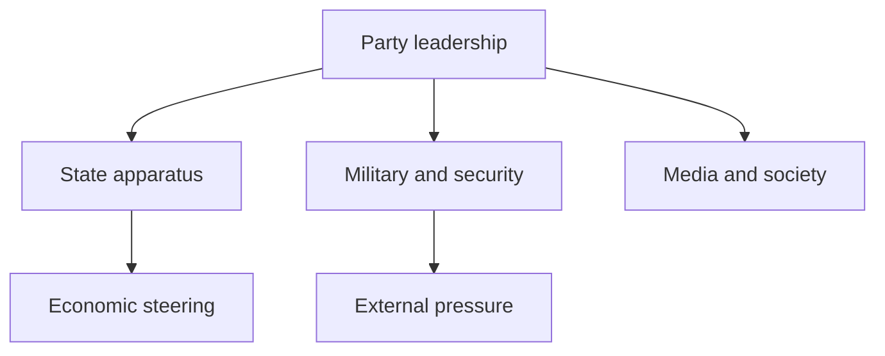
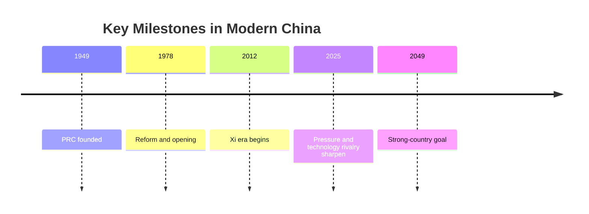
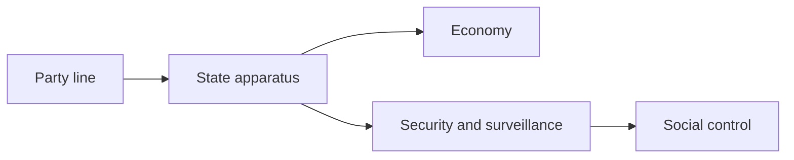
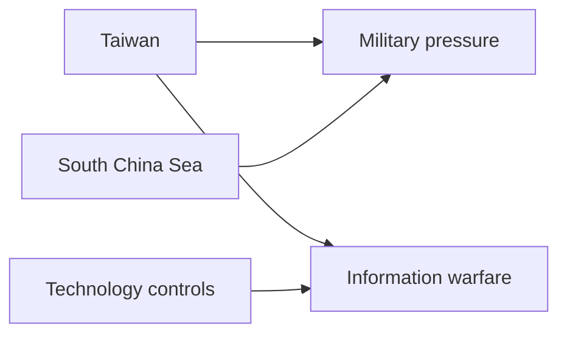

# China Geopolitical Profile 2026

## 1. Executive Summary

When you read China in the news, the first assumption should be that this is not a normal pluralist democracy. It is a party-state in which the Chinese Communist Party leads the state. In the public power map for 2026, Xi Jinping sits at the center as party general secretary, president, and chairman of the Central Military Commission, while Li Qiang serves as premier, Zhao Leji as chair of the National People’s Congress Standing Committee, and Wang Huning as chair of the Chinese People’s Political Consultative Conference. <SourceNote>[Government of China](https://en.wikipedia.org/wiki/Government_of_China), [China](https://en.wikipedia.org/wiki/China)</SourceNote>

The key point is that power may look divided, but the party still sets the final political direction. This is not a U.S.-style separation of powers. State institutions, the military, the courts, the media, and civil society are all organized under party leadership. <SourceNote>[Government of China](https://en.wikipedia.org/wiki/Government_of_China), [Military and Security Developments Involving the People’s Republic of China 2025](https://media.defense.gov/2025/Dec/23/2003849070/-1/-1/1/ANNUAL-REPORT-TO-CONGRESS-MILITARY-AND-SECURITY-DEVELOPMENTS-INVOLVING-THE-PEOPLES-REPUBLIC-OF-CHINA-2025.PDF)</SourceNote>

Externally, Taiwan, the South China Sea, the East China Sea, competition with the United States over technology, and Belt and Road are the main fault lines. The Pentagon’s 2025 China military report treats pressure on Taiwan, maritime claims, and competition over AI and advanced compute as central national security issues. <SourceNote>[Military and Security Developments Involving the People’s Republic of China 2025](https://media.defense.gov/2025/Dec/23/2003849070/-1/-1/1/ANNUAL-REPORT-TO-CONGRESS-MILITARY-AND-SECURITY-DEVELOPMENTS-INVOLVING-THE-PEOPLES-REPUBLIC-OF-CHINA-2025.PDF)</SourceNote>

Domestically, China still has a second-tier global economy and a deep industrial base, but property adjustment, local government debt, population decline, low fertility, and fragile youth employment are all weighing on the growth model. China is large, but it is not simply stable. <SourceNote>[China](https://en.wikipedia.org/wiki/China), [World Bank warns China must enact bigger reforms to tackle 'mounting' economic challenges](https://www.theguardian.com/world/2024/dec/27/world-bank-warns-china-must-enact-bigger-reforms-to-tackle-mounting-economic-challenges)</SourceNote>

For Japan, the point is not to read China as either a giant market or a pure military threat. The better lens is a system that uses party control, maritime pressure, and technology rules at the same time. <SourceNote>[Military and Security Developments Involving the People’s Republic of China 2025](https://media.defense.gov/2025/Dec/23/2003849070/-1/-1/1/ANNUAL-REPORT-TO-CONGRESS-MILITARY-AND-SECURITY-DEVELOPMENTS-INVOLVING-THE-PEOPLES-REPUBLIC-OF-CHINA-2025.PDF), [China](https://en.wikipedia.org/wiki/China)</SourceNote>

## 2. Historical and Institutional Base

Modern Chinese history is easier to read as a sequence of breaks: imperial collapse, foreign invasion, civil war, the founding of the People’s Republic in 1949, and the reform and opening era after 1978. The important point is that market reform did not mean the party left power. The market was introduced, but the party remained the final political authority. <SourceNote>[China](https://en.wikipedia.org/wiki/China)</SourceNote>

The Xi Jinping era since 2012 is best understood as a further tightening of that party-state model. The Pentagon’s 2025 report reads Chinese state strategy through a long-term goal of building a strong modern socialist country by 2049. <SourceNote>[Military and Security Developments Involving the People’s Republic of China 2025](https://media.defense.gov/2025/Dec/23/2003849070/-1/-1/1/ANNUAL-REPORT-TO-CONGRESS-MILITARY-AND-SECURITY-DEVELOPMENTS-INVOLVING-THE-PEOPLES-REPUBLIC-OF-CHINA-2025.PDF)</SourceNote>

Institutionally, China uses a people’s congress system, but the Communist Party sits above it in practice. The party leader shapes the final decisions of the state and military, while the State Council runs the administration. This is not the same as U.S.-style branch separation. <SourceNote>[Government of China](https://en.wikipedia.org/wiki/Government_of_China)</SourceNote>

That difference matters for news reading. A change that looks like a ministerial adjustment may actually reflect party priorities, political security, social control, or military preparation. If you read it as ordinary bureaucracy, you can miss the direction of travel. <SourceNote>[Government of China](https://en.wikipedia.org/wiki/Government_of_China), [Military and Security Developments Involving the People’s Republic of China 2025](https://media.defense.gov/2025/Dec/23/2003849070/-1/-1/1/ANNUAL-REPORT-TO-CONGRESS-MILITARY-AND-SECURITY-DEVELOPMENTS-INVOLVING-THE-PEOPLES-REPUBLIC-OF-CHINA-2025.PDF)</SourceNote>

## 3. Current Power Configuration

China’s current power structure is a stack of party, state, military, and surveillance capacity. It helps to keep the public leadership map in mind when reading the news. <SourceNote>[Government of China](https://en.wikipedia.org/wiki/Government_of_China)</SourceNote>

| Role | Current center | What to watch |
| --- | --- | --- |
| Party | Xi Jinping | Security, control, long-term goals |
| Government | Li Qiang | Economic management and implementation |
| Legislature | Zhao Leji | Legalization and political mobilization |
| Policy advice | Wang Huning | Ideology, united front, consensus-building |
| Foreign affairs | Wang Yi | U.S.-China ties, neighbors, crisis management |

<SourceNote>[Government of China](https://en.wikipedia.org/wiki/Government_of_China)</SourceNote>

China’s state machine works by setting party direction first, then having the administration execute it, the military secure it, and the media and education system reinforce it. The institutional surface is complex, but the center of gravity is fairly clear. <SourceNote>[Government of China](https://en.wikipedia.org/wiki/Government_of_China), [Military and Security Developments Involving the People’s Republic of China 2025](https://media.defense.gov/2025/Dec/23/2003849070/-1/-1/1/ANNUAL-REPORT-TO-CONGRESS-MILITARY-AND-SECURITY-DEVELOPMENTS-INVOLVING-THE-PEOPLES-REPUBLIC-OF-CHINA-2025.PDF)</SourceNote>

The media operate under party leadership, and security, surveillance, and speech control are treated as part of political stability. Xinjiang and Tibet are therefore not just minority-policy issues; they are also questions of integration and control. <SourceNote>[China](https://en.wikipedia.org/wiki/China), [Military and Security Developments Involving the People’s Republic of China 2025](https://media.defense.gov/2025/Dec/23/2003849070/-1/-1/1/ANNUAL-REPORT-TO-CONGRESS-MILITARY-AND-SECURITY-DEVELOPMENTS-INVOLVING-THE-PEOPLES-REPUBLIC-OF-CHINA-2025.PDF)</SourceNote>

## 4. Main International Disputes

### 1. Taiwan

Taiwan is not a peripheral issue for China. It is a core issue tied to sovereignty and the legitimacy of the regime. The Pentagon report says the People’s Liberation Army continues military pressure on Taiwan and is building capabilities that could escalate quickly in a crisis even if there is no immediate blockade or invasion. <SourceNote>[Military and Security Developments Involving the People’s Republic of China 2025](https://media.defense.gov/2025/Dec/23/2003849070/-1/-1/1/ANNUAL-REPORT-TO-CONGRESS-MILITARY-AND-SECURITY-DEVELOPMENTS-INVOLVING-THE-PEOPLES-REPUBLIC-OF-CHINA-2025.PDF)</SourceNote>

This is not just a military issue. Exercises, information warfare, economic pressure, and international isolation efforts are combined into one strategy. In the news, those pieces can look fragmented, but it is better to read them as a single effort to raise Taiwan’s decision costs. <SourceNote>[Military and Security Developments Involving the People’s Republic of China 2025](https://media.defense.gov/2025/Dec/23/2003849070/-1/-1/1/ANNUAL-REPORT-TO-CONGRESS-MILITARY-AND-SECURITY-DEVELOPMENTS-INVOLVING-THE-PEOPLES-REPUBLIC-OF-CHINA-2025.PDF)</SourceNote>

### 2. The South and East China Seas

In the South China Sea, China uses gray-zone pressure that mixes coast guard, navy, and maritime militia activity. The Pentagon report says coercive behavior in the South China Sea and frictions with neighboring states continue. <SourceNote>[Military and Security Developments Involving the People’s Republic of China 2025](https://media.defense.gov/2025/Dec/23/2003849070/-1/-1/1/ANNUAL-REPORT-TO-CONGRESS-MILITARY-AND-SECURITY-DEVELOPMENTS-INVOLVING-THE-PEOPLES-REPUBLIC-OF-CHINA-2025.PDF)</SourceNote>

In the East China Sea, the waters around the Senkaku Islands remain a friction point in Japan-China relations. The important thing is that this is not about a single clash. It is about sustained pressure and the gradual creation of facts on the water. <SourceNote>[Military and Security Developments Involving the People’s Republic of China 2025](https://media.defense.gov/2025/Dec/23/2003849070/-1/-1/1/ANNUAL-REPORT-TO-CONGRESS-MILITARY-AND-SECURITY-DEVELOPMENTS-INVOLVING-THE-PEOPLES-REPUBLIC-OF-CHINA-2025.PDF)</SourceNote>

### 3. Competition with the United States and Technology Controls

China is the world’s largest manufacturing power and has deep industrial capacity in steel, batteries, electronics, automobiles, and shipping. That is why AI, semiconductors, advanced manufacturing tools, and critical-resource supply chains are both economic and security issues. <SourceNote>[China](https://en.wikipedia.org/wiki/China)</SourceNote>

The Pentagon report also stresses that China treats AI and dual-use technologies as strategically important in both military and economic terms, while trying to extend its technology and influence through foreign relations. <SourceNote>[Military and Security Developments Involving the People’s Republic of China 2025](https://media.defense.gov/2025/Dec/23/2003849070/-1/-1/1/ANNUAL-REPORT-TO-CONGRESS-MILITARY-AND-SECURITY-DEVELOPMENTS-INVOLVING-THE-PEOPLES-REPUBLIC-OF-CHINA-2025.PDF)</SourceNote>

### 4. Belt and Road and External Influence

Belt and Road should be read not just as infrastructure export, but as a strategy that ties together finance, ports, resources, and diplomacy. China’s external engagement can support regional cooperation, but it also extends influence through dependence. <SourceNote>[Military and Security Developments Involving the People’s Republic of China 2025](https://media.defense.gov/2025/Dec/23/2003849070/-1/-1/1/ANNUAL-REPORT-TO-CONGRESS-MILITARY-AND-SECURITY-DEVELOPMENTS-INVOLVING-THE-PEOPLES-REPUBLIC-OF-CHINA-2025.PDF)</SourceNote>

## 5. Economic and Social Pressures

China remains a second-tier global economy with a very large industrial base. At the March 2026 National People’s Congress, the growth target for 2025 was set at around 5 percent, while policy continued to emphasize domestic demand and advanced manufacturing. <SourceNote>[Fourth session of the 14th National People’s Congress](https://en.wikipedia.org/wiki/Fourth_session_of_the_14th_National_People%27s_Congress)</SourceNote>

But the strengths have costs. Property adjustment hurts household balance sheets and local public finances at the same time, while local government debt narrows room for stimulus. The World Bank warned that these problems require deeper structural reform, not just ordinary cyclical support. <SourceNote>[World Bank warns China must enact bigger reforms to tackle 'mounting' economic challenges](https://www.theguardian.com/world/2024/dec/27/world-bank-warns-china-must-enact-bigger-reforms-to-tackle-mounting-economic-challenges)</SourceNote>

Demography is another heavy constraint. China’s population has peaked, births have fallen, and deaths are now outpacing births. Urbanization has advanced, but regional inequality, age structure, education, and ethnic composition are still far from uniform. <SourceNote>[China](https://en.wikipedia.org/wiki/China)</SourceNote>

Youth employment remains a political problem that will not be solved by a simple improvement in headline growth. If job quality does not stabilize, consumer recovery and family formation will both stay weak. <SourceNote>[Unemployment in China](https://en.wikipedia.org/wiki/Unemployment_in_China)</SourceNote>

Chinese society is not monolithic. Urban and rural China, coastal and inland regions, Han and minority communities, state-owned and private sectors, and younger and older cohorts all experience opportunity and frustration differently. So it is risky to treat social stability as if it only meant control. <SourceNote>[China](https://en.wikipedia.org/wiki/China), [Military and Security Developments Involving the People’s Republic of China 2025](https://media.defense.gov/2025/Dec/23/2003849070/-1/-1/1/ANNUAL-REPORT-TO-CONGRESS-MILITARY-AND-SECURITY-DEVELOPMENTS-INVOLVING-THE-PEOPLES-REPUBLIC-OF-CHINA-2025.PDF)</SourceNote>

## 6. Implications for Japan and East Asia

First, Japan needs to read China as a coercive state, not only as a market. Sea lanes, supply chains, rare earths, communications, data, and submarine cables are commercial issues and security issues at the same time. <SourceNote>[Military and Security Developments Involving the People’s Republic of China 2025](https://media.defense.gov/2025/Dec/23/2003849070/-1/-1/1/ANNUAL-REPORT-TO-CONGRESS-MILITARY-AND-SECURITY-DEVELOPMENTS-INVOLVING-THE-PEOPLES-REPUBLIC-OF-CHINA-2025.PDF), [China](https://en.wikipedia.org/wiki/China)</SourceNote>

Second, a Taiwan contingency would not stay in the abstract realm of alliance talk. It would become a practical issue of air defense, evacuation, logistics, communications, U.S. force operations in Japan, and public communication. The point is to estimate the cost of a crisis before it arrives. <SourceNote>[Military and Security Developments Involving the People’s Republic of China 2025](https://media.defense.gov/2025/Dec/23/2003849070/-1/-1/1/ANNUAL-REPORT-TO-CONGRESS-MILITARY-AND-SECURITY-DEVELOPMENTS-INVOLVING-THE-PEOPLES-REPUBLIC-OF-CHINA-2025.PDF)</SourceNote>

Third, AI and semiconductors, EVs and batteries, and advanced manufacturing tools and materials should be treated as one economic security bundle. China’s industrial depth is both a source of resilience and a source of leverage through supply disruptions and sanctions risk. <SourceNote>[China](https://en.wikipedia.org/wiki/China), [Military and Security Developments Involving the People’s Republic of China 2025](https://media.defense.gov/2025/Dec/23/2003849070/-1/-1/1/ANNUAL-REPORT-TO-CONGRESS-MILITARY-AND-SECURITY-DEVELOPMENTS-INVOLVING-THE-PEOPLES-REPUBLIC-OF-CHINA-2025.PDF)</SourceNote>

Fourth, stronger domestic control does not automatically make China’s external behavior more predictable. In practice, harder-looking moves abroad can become more attractive when the goal is to protect internal political security. <SourceNote>[Government of China](https://en.wikipedia.org/wiki/Government_of_China), [Military and Security Developments Involving the People’s Republic of China 2025](https://media.defense.gov/2025/Dec/23/2003849070/-1/-1/1/ANNUAL-REPORT-TO-CONGRESS-MILITARY-AND-SECURITY-DEVELOPMENTS-INVOLVING-THE-PEOPLES-REPUBLIC-OF-CHINA-2025.PDF)</SourceNote>

## 7. Monitoring Points

If you use China as a country profile for news reading, five indicators are worth tracking. <SourceNote>[Military and Security Developments Involving the People’s Republic of China 2025](https://media.defense.gov/2025/Dec/23/2003849070/-1/-1/1/ANNUAL-REPORT-TO-CONGRESS-MILITARY-AND-SECURITY-DEVELOPMENTS-INVOLVING-THE-PEOPLES-REPUBLIC-OF-CHINA-2025.PDF), [Government of China](https://en.wikipedia.org/wiki/Government_of_China)</SourceNote>

1. The frequency of exercises around Taiwan and any increase in blockade-like inspections or interference with shipping.
1. Coast guard activity and the tempo of facts-on-the-water tactics in the South and East China Seas.
1. Whether property support, local finance, and domestic-demand stimulus can improve household sentiment before headline growth does.
1. How far China’s push for self-sufficiency in AI, semiconductors, batteries, EVs, and advanced manufacturing tools can absorb export controls.
1. How population decline, low fertility, youth employment, and the urban-rural gap reshape social stability.

These five indicators will change China’s behavior before official rhetoric does.

## 8. Risks and Limits

This profile has three limits. First, it relies on public information, so internal party bargaining is not fully visible. Second, economic indicators can change when new data are published, so part of this text will be overwritten by later statistics. Third, the future of Taiwan and maritime order is partly a public-information inference rather than a settled fact. <SourceNote>[Military and Security Developments Involving the People’s Republic of China 2025](https://media.defense.gov/2025/Dec/23/2003849070/-1/-1/1/ANNUAL-REPORT-TO-CONGRESS-MILITARY-AND-SECURITY-DEVELOPMENTS-INVOLVING-THE-PEOPLES-REPUBLIC-OF-CHINA-2025.PDF), [China](https://en.wikipedia.org/wiki/China)</SourceNote>

For the near term, China is likely to keep domestic control tight while leaning outward on Taiwan, maritime order, technological leadership, and supply-chain leverage. Japan therefore needs to design China policy as a bundle of deterrence, trade, technology, public opinion, and crisis management. <SourceNote>[Military and Security Developments Involving the People’s Republic of China 2025](https://media.defense.gov/2025/Dec/23/2003849070/-1/-1/1/ANNUAL-REPORT-TO-CONGRESS-MILITARY-AND-SECURITY-DEVELOPMENTS-INVOLVING-THE-PEOPLES-REPUBLIC-OF-CHINA-2025.PDF), [World Bank warns China must enact bigger reforms to tackle 'mounting' economic challenges](https://www.theguardian.com/world/2024/dec/27/world-bank-warns-china-must-enact-bigger-reforms-to-tackle-mounting-economic-challenges)</SourceNote>

## References

- [Government of China](https://en.wikipedia.org/wiki/Government_of_China)
- [China](https://en.wikipedia.org/wiki/China)
- [Military and Security Developments Involving the People’s Republic of China 2025](https://media.defense.gov/2025/Dec/23/2003849070/-1/-1/1/ANNUAL-REPORT-TO-CONGRESS-MILITARY-AND-SECURITY-DEVELOPMENTS-INVOLVING-THE-PEOPLES-REPUBLIC-OF-CHINA-2025.PDF)
- [Fourth session of the 14th National People’s Congress](https://en.wikipedia.org/wiki/Fourth_session_of_the_14th_National_People%27s_Congress)
- [World Bank warns China must enact bigger reforms to tackle 'mounting' economic challenges](https://www.theguardian.com/world/2024/dec/27/world-bank-warns-china-must-enact-bigger-reforms-to-tackle-mounting-economic-challenges)
- [Unemployment in China](https://en.wikipedia.org/wiki/Unemployment_in_China)
