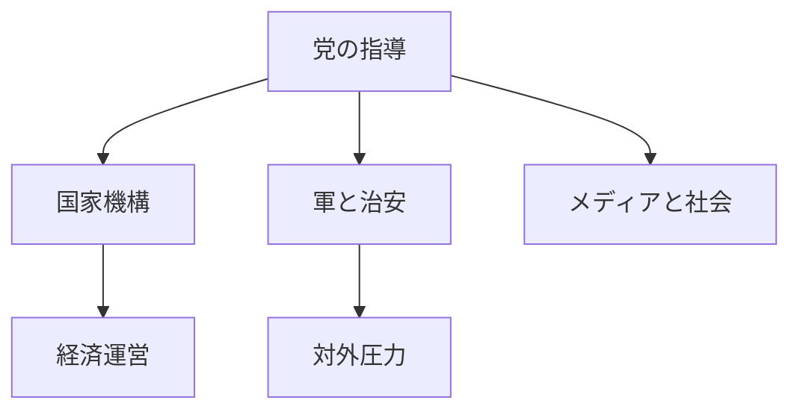
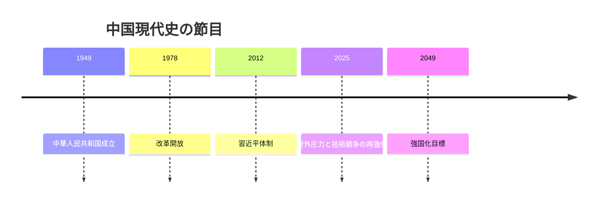
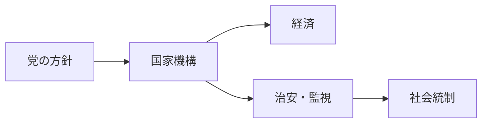
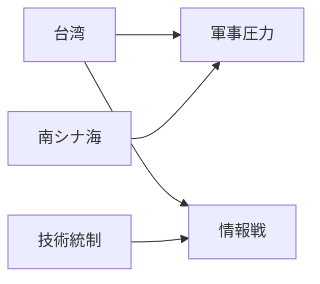

# 中国の国際政治プロファイル 2026年版

## 1. エグゼクティブサマリー

中国をニュースで読むときの最初の前提は、これは通常の多元民主主義国家ではなく、中国共産党が国家を指導する党国家だという点である。2026年時点の公的な権力配置は、習近平が党総書記・国家主席・中央軍事委員会主席として中核に座り、李強が国務院総理、趙楽際が全国人民代表大会常務委員長、王滬寧が政治協商会議主席を務める構図になっている。<SourceNote>[Government of China](https://en.wikipedia.org/wiki/Government_of_China), [China](https://en.wikipedia.org/wiki/China)</SourceNote>

この体制の要点は、権力が分立しているように見えても、最終的な政治方向は党が握ることだ。米国のような三権分立ではなく、国家機関、軍、司法、メディア、市民社会が党の指導の下に組み込まれる。<SourceNote>[Government of China](https://en.wikipedia.org/wiki/Government_of_China), [Military and Security Developments Involving the People’s Republic of China 2025](https://media.defense.gov/2025/Dec/23/2003849070/-1/-1/1/ANNUAL-REPORT-TO-CONGRESS-MILITARY-AND-SECURITY-DEVELOPMENTS-INVOLVING-THE-PEOPLES-REPUBLIC-OF-CHINA-2025.PDF)</SourceNote>

対外的には、台湾、南シナ海、東シナ海、対米技術競争、一帯一路が主要争点である。米国防総省の2025年版中国軍事力報告は、中国の台湾に対する軍事的圧力、海空域での主張、そしてAIや先端計算資源を含む技術競争を、国家安全保障の中心課題として扱っている。<SourceNote>[Military and Security Developments Involving the People’s Republic of China 2025](https://media.defense.gov/2025/Dec/23/2003849070/-1/-1/1/ANNUAL-REPORT-TO-CONGRESS-MILITARY-AND-SECURITY-DEVELOPMENTS-INVOLVING-THE-PEOPLES-REPUBLIC-OF-CHINA-2025.PDF)</SourceNote>

国内では、世界第2位級の経済規模と製造業の厚みが依然として強みだが、不動産調整、地方政府債務、人口減少、少子化、若年雇用の脆弱さが成長モデルを圧迫している。中国は大きいが、単純に安定しているわけではない。<SourceNote>[China](https://en.wikipedia.org/wiki/China), [World Bank warns China must enact bigger reforms to tackle 'mounting' economic challenges](https://www.theguardian.com/world/2024/dec/27/world-bank-warns-china-must-enact-bigger-reforms-to-tackle-mounting-economic-challenges)</SourceNote>

日本にとっての要点は、中国を「巨大市場」か「軍事的脅威」のどちらか一方で見ることではない。党が社会と経済をどう制御し、台湾海峡や周辺海域でどの程度の圧力をかけ、技術と貿易の規則をどう使うかを、同時に読む必要がある。<SourceNote>[Military and Security Developments Involving the People’s Republic of China 2025](https://media.defense.gov/2025/Dec/23/2003849070/-1/-1/1/ANNUAL-REPORT-TO-CONGRESS-MILITARY-AND-SECURITY-DEVELOPMENTS-INVOLVING-THE-PEOPLES-REPUBLIC-OF-CHINA-2025.PDF), [China](https://en.wikipedia.org/wiki/China)</SourceNote>

## 2. 歴史と制度の骨格

中国の現代史は、王朝国家の崩壊、列強の侵入、内戦、1949年の中華人民共和国成立、そして1978年以降の改革開放という連続した断絶として読むと理解しやすい。ここで重要なのは、1978年以降の市場化が党の退場を意味しなかったことである。市場は導入されたが、政治の最終責任者は党のままだった。<SourceNote>[China](https://en.wikipedia.org/wiki/China)</SourceNote>

2012年以降の習近平期は、その党国家性をさらに強めた時期とみるのが妥当である。2025年版の米国防総省報告は、中国の国家戦略を、2049年までに「強い近代的社会主義国家」を完成させる長期目標の下で理解している。<SourceNote>[Military and Security Developments Involving the People’s Republic of China 2025](https://media.defense.gov/2025/Dec/23/2003849070/-1/-1/1/ANNUAL-REPORT-TO-CONGRESS-MILITARY-AND-SECURITY-DEVELOPMENTS-INVOLVING-THE-PEOPLES-REPUBLIC-OF-CHINA-2025.PDF)</SourceNote>

制度面では、中国は人民代表大会制を採るが、実際には共産党の指導が上にある。中国共産党のトップが国家と軍の最終意思決定に影響し、国務院は行政を担うが、米国型の権力分立と同じではない。<SourceNote>[Government of China](https://en.wikipedia.org/wiki/Government_of_China)</SourceNote>

この違いはニュースの読み方に直結する。たとえば政策変更が「省庁の技術調整」に見えても、背後には党内の優先順位、政治安全、社会統制、軍事準備がある。単なる官僚的修正として読むと、方向の変化を見誤る。<SourceNote>[Government of China](https://en.wikipedia.org/wiki/Government_of_China), [Military and Security Developments Involving the People’s Republic of China 2025](https://media.defense.gov/2025/Dec/23/2003849070/-1/-1/1/ANNUAL-REPORT-TO-CONGRESS-MILITARY-AND-SECURITY-DEVELOPMENTS-INVOLVING-THE-PEOPLES-REPUBLIC-OF-CHINA-2025.PDF)</SourceNote>

## 3. 現在の権力配置

現在の権力配置は、党、国家、軍、監視装置が重なった構造である。公的な顔ぶれを把握しておくと、ニュースの文脈が読みやすい。<SourceNote>[Government of China](https://en.wikipedia.org/wiki/Government_of_China)</SourceNote>

| 役割 | 現在の中心 | ニュースで見るべき点 |
| --- | --- | --- |
| 党 | 習近平 | 安全保障、統制、長期目標 |
| 政府 | 李強 | 経済運営、景気下支え、実装 |
| 立法機関 | 趙楽際 | 制度整備、法制化、政治動員 |
| 政策助言 | 王滬寧 | 意識形態、統一戦線、合意形成 |
| 外交 | 王毅 | 米中関係、周辺国、危機管理 |

<SourceNote>[Government of China](https://en.wikipedia.org/wiki/Government_of_China)</SourceNote>

中国の国家機構は、党が定めた方向を行政が執行し、軍が保障し、メディアと教育が補強する方式で動く。国家の外形は複雑でも、統治の中枢は比較的明確だ。<SourceNote>[Government of China](https://en.wikipedia.org/wiki/Government_of_China), [Military and Security Developments Involving the People’s Republic of China 2025](https://media.defense.gov/2025/Dec/23/2003849070/-1/-1/1/ANNUAL-REPORT-TO-CONGRESS-MILITARY-AND-SECURITY-DEVELOPMENTS-INVOLVING-THE-PEOPLES-REPUBLIC-OF-CHINA-2025.PDF)</SourceNote>

中国のメディアは党の指導の下に置かれ、治安・監視・言論統制は政治的安定の一部として扱われる。新疆やチベットは、民族政策だけでなく、国家の統合と統制の問題として扱われてきた。<SourceNote>[China](https://en.wikipedia.org/wiki/China), [Military and Security Developments Involving the People’s Republic of China 2025](https://media.defense.gov/2025/Dec/23/2003849070/-1/-1/1/ANNUAL-REPORT-TO-CONGRESS-MILITARY-AND-SECURITY-DEVELOPMENTS-INVOLVING-THE-PEOPLES-REPUBLIC-OF-CHINA-2025.PDF)</SourceNote>

## 4. 国際政治の争点

### 1. 台湾

台湾は、中国にとって単なる周辺問題ではなく、主権と体制の正統性に関わる核心問題である。米国防総省の報告は、人民解放軍が台湾に対する軍事的圧力を継続し、封鎖や侵攻ではなくても、危機時に急速にエスカレーションしうる能力を整備していると述べている。<SourceNote>[Military and Security Developments Involving the People’s Republic of China 2025](https://media.defense.gov/2025/Dec/23/2003849070/-1/-1/1/ANNUAL-REPORT-TO-CONGRESS-MILITARY-AND-SECURITY-DEVELOPMENTS-INVOLVING-THE-PEOPLES-REPUBLIC-OF-CHINA-2025.PDF)</SourceNote>

この争点では、軍事力だけでなく、演習、情報戦、経済圧力、国際的な孤立化工作が組み合わされる。ニュース上は断片的な圧力に見えても、実際には台湾の意思決定コストを上げる総合戦略として理解した方がよい。<SourceNote>[Military and Security Developments Involving the People’s Republic of China 2025](https://media.defense.gov/2025/Dec/23/2003849070/-1/-1/1/ANNUAL-REPORT-TO-CONGRESS-MILITARY-AND-SECURITY-DEVELOPMENTS-INVOLVING-THE-PEOPLES-REPUBLIC-OF-CHINA-2025.PDF)</SourceNote>

### 2. 南シナ海と東シナ海

南シナ海では、中国は海警、海軍、民兵を組み合わせたグレーゾーン圧力を使う。米国防総省報告は、南シナ海での強圧的行動と、周辺国との摩擦が継続していることを指摘している。<SourceNote>[Military and Security Developments Involving the People’s Republic of China 2025](https://media.defense.gov/2025/Dec/23/2003849070/-1/-1/1/ANNUAL-REPORT-TO-CONGRESS-MILITARY-AND-SECURITY-DEVELOPMENTS-INVOLVING-THE-PEOPLES-REPUBLIC-OF-CHINA-2025.PDF)</SourceNote>

東シナ海では、尖閣諸島を含む海域が日中関係の摩擦点になる。重要なのは、ここでも「一度の衝突」ではなく、常態化した圧力と既成事実化の積み上げが使われることだ。<SourceNote>[Military and Security Developments Involving the People’s Republic of China 2025](https://media.defense.gov/2025/Dec/23/2003849070/-1/-1/1/ANNUAL-REPORT-TO-CONGRESS-MILITARY-AND-SECURITY-DEVELOPMENTS-INVOLVING-THE-PEOPLES-REPUBLIC-OF-CHINA-2025.PDF)</SourceNote>

### 3. 対米競争と技術統制

中国は世界最大の製造業国であり、鉄鋼、電池、電子機器、自動車、海運など、広い工業基盤を持つ。だからこそ、AI、半導体、先端製造装置、希少資源のサプライチェーンは、経済問題であると同時に安全保障問題になる。<SourceNote>[China](https://en.wikipedia.org/wiki/China)</SourceNote>

米国防総省報告は、中国がAIやデュアルユース技術を軍事・経済両面で重視していること、そして対外関係を通じて技術と影響力を広げようとしていることを強調している。<SourceNote>[Military and Security Developments Involving the People’s Republic of China 2025](https://media.defense.gov/2025/Dec/23/2003849070/-1/-1/1/ANNUAL-REPORT-TO-CONGRESS-MILITARY-AND-SECURITY-DEVELOPMENTS-INVOLVING-THE-PEOPLES-REPUBLIC-OF-CHINA-2025.PDF)</SourceNote>

### 4. 一帯一路と対外影響

一帯一路は、インフラ輸出だけでなく、金融、港湾、資源、外交関係を束ねる対外戦略として読むべきである。中国の対外関与は、地域秩序を支える協力でもある一方、依存関係を通じた影響力の拡張でもある。<SourceNote>[Military and Security Developments Involving the People’s Republic of China 2025](https://media.defense.gov/2025/Dec/23/2003849070/-1/-1/1/ANNUAL-REPORT-TO-CONGRESS-MILITARY-AND-SECURITY-DEVELOPMENTS-INVOLVING-THE-PEOPLES-REPUBLIC-OF-CHINA-2025.PDF)</SourceNote>

## 5. 経済・社会の圧力

中国は世界第2位級の経済であり、製造業の厚みは今も大きい。2026年3月時点の全国人民代表大会では、2025年の成長率目標をおおむね5%前後に置き、同時に内需拡大と先端製造への投資を重視していた。<SourceNote>[Fourth session of the 14th National People’s Congress](https://en.wikipedia.org/wiki/Fourth_session_of_the_14th_National_People%27s_Congress)</SourceNote>

ただし、強みの裏側には調整圧力がある。不動産の調整は家計資産と地方財政を同時に痛め、地方政府債務は公共投資の余地を狭める。世界銀行は、こうした問題に対して、単なる景気刺激では足りず、より大きな構造改革が必要だと警告した。<SourceNote>[World Bank warns China must enact bigger reforms to tackle 'mounting' economic challenges](https://www.theguardian.com/world/2024/dec/27/world-bank-warns-china-must-enact-bigger-reforms-to-tackle-mounting-economic-challenges)</SourceNote>

人口動態も重い。中国の人口はピークアウトし、出生は低下し、死亡が出生を上回る局面が定着しつつある。都市化は進んだが、地域格差、年齢構成、教育水準、民族構成は依然として一様ではない。<SourceNote>[China](https://en.wikipedia.org/wiki/China)</SourceNote>

若年雇用は、景気指標の改善だけでは解消しない政治課題として残る。雇用の質が安定しなければ、消費回復も結婚・出産の回復も鈍る。<SourceNote>[Unemployment in China](https://en.wikipedia.org/wiki/Unemployment_in_China)</SourceNote>

中国の市民生活は一枚岩ではない。都市と農村、沿海部と内陸部、漢族と少数民族、国有部門と民間部門、若年層と高齢層で、機会と不満の形が違う。だから、社会安定を語るときも、単純な「統制されているから安定」という理解は危うい。<SourceNote>[China](https://en.wikipedia.org/wiki/China), [Military and Security Developments Involving the People’s Republic of China 2025](https://media.defense.gov/2025/Dec/23/2003849070/-1/-1/1/ANNUAL-REPORT-TO-CONGRESS-MILITARY-AND-SECURITY-DEVELOPMENTS-INVOLVING-THE-PEOPLES-REPUBLIC-OF-CHINA-2025.PDF)</SourceNote>

## 6. 日本・東アジアへの含意

第一に、日本は中国を市場としてだけではなく、強制力を持つ国家として読む必要がある。海上交通、サプライチェーン、レアアース、通信、データ、海底ケーブルは、商業問題であると同時に安全保障問題である。<SourceNote>[Military and Security Developments Involving the People’s Republic of China 2025](https://media.defense.gov/2025/Dec/23/2003849070/-1/-1/1/ANNUAL-REPORT-TO-CONGRESS-MILITARY-AND-SECURITY-DEVELOPMENTS-INVOLVING-THE-PEOPLES-REPUBLIC-OF-CHINA-2025.PDF), [China](https://en.wikipedia.org/wiki/China)</SourceNote>

第二に、台湾有事は日米同盟の抽象論ではなく、実際の防空、避難、物流、通信、在日米軍の運用、世論対応に落ちる。そこで重要なのは、平時から危機のコストを見積もることである。<SourceNote>[Military and Security Developments Involving the People’s Republic of China 2025](https://media.defense.gov/2025/Dec/23/2003849070/-1/-1/1/ANNUAL-REPORT-TO-CONGRESS-MILITARY-AND-SECURITY-DEVELOPMENTS-INVOLVING-THE-PEOPLES-REPUBLIC-OF-CHINA-2025.PDF)</SourceNote>

第三に、AIと半導体、EVと電池、製造装置と素材の問題は、別々ではなく一つの経済安全保障の束として扱うべきである。中国の製造業の深さは、対外依存を減らす力でもあり、逆に供給停止や制裁のレバレッジを生む弱点でもある。<SourceNote>[China](https://en.wikipedia.org/wiki/China), [Military and Security Developments Involving the People’s Republic of China 2025](https://media.defense.gov/2025/Dec/23/2003849070/-1/-1/1/ANNUAL-REPORT-TO-CONGRESS-MILITARY-AND-SECURITY-DEVELOPMENTS-INVOLVING-THE-PEOPLES-REPUBLIC-OF-CHINA-2025.PDF)</SourceNote>

第四に、中国の国内統制が強いほど、対外行動が自動的に予測可能になるわけではない。むしろ、内部の政治安全を守るために、外で強硬に見える行動が選ばれやすい。<SourceNote>[Government of China](https://en.wikipedia.org/wiki/Government_of_China), [Military and Security Developments Involving the People’s Republic of China 2025](https://media.defense.gov/2025/Dec/23/2003849070/-1/-1/1/ANNUAL-REPORT-TO-CONGRESS-MILITARY-AND-SECURITY-DEVELOPMENTS-INVOLVING-THE-PEOPLES-REPUBLIC-OF-CHINA-2025.PDF)</SourceNote>

## 7. 監視点

中国をニュース読解用の国別プロファイルとして使うなら、次の5点を定点観測するとよい。<SourceNote>[Military and Security Developments Involving the People’s Republic of China 2025](https://media.defense.gov/2025/Dec/23/2003849070/-1/-1/1/ANNUAL-REPORT-TO-CONGRESS-MILITARY-AND-SECURITY-DEVELOPMENTS-INVOLVING-THE-PEOPLES-REPUBLIC-OF-CHINA-2025.PDF), [Government of China](https://en.wikipedia.org/wiki/Government_of_China)</SourceNote>

1. 台湾周辺での演習頻度と、実弾的な封鎖・検査・航行妨害の増減。
1. 南シナ海と東シナ海での海警活動と既成事実化のテンポ。
1. 不動産、地方財政、内需刺激の組み合わせが、成長率より先に家計心理を改善できるか。
1. AI、半導体、電池、EV、先端製造装置での自立化が、輸出規制をどこまで吸収するか。
1. 人口減少、少子化、若年雇用、都市と農村の格差が、社会安定をどう変えるか。

この5点は、公式発表の文言より先に、中国の行動を変える。

## 8. リスク・限界

本稿の限界は三つある。第一に、公開情報に依拠しているため、党内の非公開の権力交渉までは見えない。第二に、経済指標は発表時点で変わりうるので、本文の一部は将来の統計で上書きされる。第三に、台湾や海洋秩序の将来は、公表情報からの推定にとどまる部分がある。<SourceNote>[Military and Security Developments Involving the People’s Republic of China 2025](https://media.defense.gov/2025/Dec/23/2003849070/-1/-1/1/ANNUAL-REPORT-TO-CONGRESS-MILITARY-AND-SECURITY-DEVELOPMENTS-INVOLVING-THE-PEOPLES-REPUBLIC-OF-CHINA-2025.PDF), [China](https://en.wikipedia.org/wiki/China)</SourceNote>

当面の中国は、国内統制を維持しながら、台湾海峡、海上秩序、技術覇権、供給網の四つで外向きを強める可能性が高い。したがって、日本に必要なのは、対中政策を一つのテーマではなく、抑止、通商、技術、世論、危機管理の束として設計することである。<SourceNote>[Military and Security Developments Involving the People’s Republic of China 2025](https://media.defense.gov/2025/Dec/23/2003849070/-1/-1/1/ANNUAL-REPORT-TO-CONGRESS-MILITARY-AND-SECURITY-DEVELOPMENTS-INVOLVING-THE-PEOPLES-REPUBLIC-OF-CHINA-2025.PDF), [World Bank warns China must enact bigger reforms to tackle 'mounting' economic challenges](https://www.theguardian.com/world/2024/dec/27/world-bank-warns-china-must-enact-bigger-reforms-to-tackle-mounting-economic-challenges)</SourceNote>

## 参考情報

- [Government of China](https://en.wikipedia.org/wiki/Government_of_China)
- [China](https://en.wikipedia.org/wiki/China)
- [Military and Security Developments Involving the People’s Republic of China 2025](https://media.defense.gov/2025/Dec/23/2003849070/-1/-1/1/ANNUAL-REPORT-TO-CONGRESS-MILITARY-AND-SECURITY-DEVELOPMENTS-INVOLVING-THE-PEOPLES-REPUBLIC-OF-CHINA-2025.PDF)
- [Fourth session of the 14th National People’s Congress](https://en.wikipedia.org/wiki/Fourth_session_of_the_14th_National_People%27s_Congress)
- [World Bank warns China must enact bigger reforms to tackle 'mounting' economic challenges](https://www.theguardian.com/world/2024/dec/27/world-bank-warns-china-must-enact-bigger-reforms-to-tackle-mounting-economic-challenges)
- [Unemployment in China](https://en.wikipedia.org/wiki/Unemployment_in_China)
