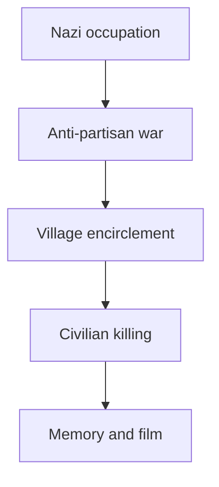

## 1. Executive Summary

The first correction is chronological. Come and See is not primarily about rural Russia during the First World War. It is about Belarus under Nazi German occupation during the Second World War, especially between 1941 and 1944. German occupation during the First World War also involved forced labor, requisitions, economic plunder, and harsh military rule, but SS formations and the memory of 628 burned villages belong to the Second World War context. <SourceNote>[1914-1918 Online, Ober Ost](https://encyclopedia.1914-1918-online.net/article/ober-ost/) describes the German eastern occupation in the First World War through military rule, settlement thinking, and economic exploitation; [Forced Labour](https://encyclopedia.1914-1918-online.net/article/forced-labour/) discusses coercive labor in Russian Poland and Lithuania.</SourceNote>

The destruction of Belarusian villages was not a one-off eruption by deranged soldiers. It was a system of violence where anti-partisan warfare, seizure of food and labor, occupation rule, anti-Slavic and antisemitic exterminatory thinking, and government by terror overlapped. The Khatyn Memorial states that 149 people, including 75 children, were killed in the Khatyn massacre on March 22, 1943. <SourceNote>[Khatyn State Memorial Complex, The Khatyn Tragedy](https://www.khatyn.by/en/khatyn) describes villagers being forced into a barn, the barn being set on fire, and people trying to escape being shot by machine guns.</SourceNote>

The number 628 in the film belongs to the Soviet-era memory of Belarusian villages burned with their inhabitants. Current Belarusian official explanations use updated figures from later investigations: earlier accounts spoke of 186 villages that shared Khatyn's fate, while current memorial text says at least 290 villages did. The number 628 should therefore be read as the symbolic and memorial number used by the film, not as a fixed present-day archival total. <SourceNote>Mark Le Fanu's Criterion essay explains that the film's final title card refers to 628 villages, while Khatyn's current page explains updated investigation totals for damaged settlements and Khatyn-type villages. See [Criterion, Come and See: Orphans of the Storm](https://www.criterion.com/current/posts/7003-come-and-see-orphans-of-the-storm) and [Khatyn, Burnt villages](https://www.khatyn.by/en/khatyn).</SourceNote>

Your interpretation of the ending reaches the film's core. Flyora firing into Hitler's portrait is an eruption of rage and revenge, but the refusal to fire at the image of Hitler as a child prevents the film from ending as pure revenge fantasy. Klimov explained that the working title Kill Hitler was not meant literally, but as a moral imperative to kill the Hitler that can lurk within human beings. <SourceNote>Mark Le Fanu discusses the reverse newsreel sequence, the image of Hitler as a toddler, and Klimov's explanation of Kill Hitler as a universal moral imperative. See [Criterion, Come and See: Orphans of the Storm](https://www.criterion.com/current/posts/7003-come-and-see-orphans-of-the-storm).</SourceNote>

## 2. Not the First World War, but Nazi-Occupied Belarus

None of this means that Germany's First World War occupation of the east was harmless. In Ober Ost, the army controlled administration, movement, labor mobilization, requisitions, resource extraction, and settlement projects. Scholarship on forced labor notes that German labor policy in occupied territory during 1914-1918 helped form experiences later relevant to Nazi forced labor.

Come and See, however, belongs to the Nazi war of annihilation against the Soviet Union. SS and police structures, Generalplan Ost, Reichskommissariat Ostland, auxiliary police, anti-partisan actions, village burnings, and mass killing of civilians all belong to the post-June 22, 1941 world of the German invasion of the Soviet Union. The Khatyn Memorial likewise describes the whole of Belarus as occupied by the end of August 1941 and placed under a violent occupation order. <SourceNote>[Khatyn, Nazi occupation policy](https://www.khatyn.by/en/khatyn) describes the German invasion on June 22, 1941, the occupation of Belarus by late August, Reichskommissariat Ostland, and the violent occupation regime.</SourceNote>

That distinction matters. First World War occupation violence involved coercive rule and extraction, but the village burning in Come and See reflects the Eastern Front of the Second World War: an occupied landscape imagined as future colonial space, where suspected resistance could be answered by the death of an entire village.

## 3. How the Village Destructions Worked

The Khatyn massacre shows the structure in miniature. On March 22, 1943, a German officer was killed in a partisan attack on a nearby road. Khatyn's villagers did not know about that attack, but the village was surrounded and residents were driven into a barn. The doors were closed, straw and fuel were used to set the barn on fire, and those who tried to escape were shot.

The crucial point is not whether the villagers were combatants. The crime lies precisely in the deliberate targeting of noncombatants: women, children, older people, and the sick. Per Anders Rudling argues that by late 1942 it had become standard practice for Germans and local collaborators to surround and burn villages suspected of supporting partisans. <SourceNote>Per Anders Rudling, [The Khatyn Massacre in Belorussia: A Historical Controversy Revisited](https://scispace.com/pdf/the-khatyn-massacre-in-belorussia-a-historical-controversy-1fyhkaimcw.pdf), describes the standardization of village encirclement and burning, and the deliberate targeting of women and children.</SourceNote>

The logic of massacre was terror rule, not military necessity. German authorities fused "partisan," "communist," "Jew," and "collaborator" into a wide category of enemy. Burning a village removed food, shelter, mutual aid, local memory, and the possibility of return. This was not combat. It was political violence against a society.

| Stage of violence | Function |
| ----------------- | -------- |
| Reconnaissance or denunciation | Classify a village as partisan-supporting |
| Encirclement | Prevent escape and testimony |
| Herding into a building | Make killing more efficient |
| Fire and gunfire | Reduce the chance of survival |
| Plunder and burning | Destroy life infrastructure and return |

## 4. Perpetrators: SS, Police, Auxiliary Units, and Local Collaborators

In Come and See the perpetrators appear as a single face of evil. That works cinematically, but historically the perpetrator structure was composite. At Khatyn, Schutzmannschaft Battalion 118, an auxiliary police unit under German command, played the central role, while SS-Sonderbataillon Dirlewanger was involved. Rudling describes Battalion 118 as a formation of about 500 men, including former Soviet POWs and Ukrainian nationalist-linked personnel, with German and local command structures operating in parallel. <SourceNote>Rudling details the composition of Schutzmannschaft Battalion 118, its parallel command structure, its early 1943 transfer to Belarus, and the destruction of Khatyn as part of Operation Wandsbeck. See [The Khatyn Massacre in Belorussia](https://scispace.com/pdf/the-khatyn-massacre-in-belorussia-a-historical-controversy-1fyhkaimcw.pdf).</SourceNote>

The Dirlewanger unit is the formation most closely associated with the idea of an SS unit built around criminals. It is notorious as a Waffen-SS anti-partisan formation that incorporated criminals, prisoners, and disciplinary cases, and it became infamous for mass killing, looting, sexual violence, and burning operations in Belarus and Poland. So the idea of a criminal SS unit is broadly right for Dirlewanger. But if all village destruction is reduced to that one unit, the wider structure of army, SS, police, occupation administration, auxiliary police, and local collaboration disappears from view.

This distinction does not dilute responsibility. It expands it. If responsibility is isolated in a handful of sadists, we miss how administration, police orders, food policy, labor policy, anti-communist propaganda, and ordinary obedience made massacre possible. The horror of Come and See is that the perpetrators look monstrous and organized at the same time: murder proceeds through orders, ritual, laughter, alcohol, music, and photographs.

## 5. How Come and See Was Made

Come and See is a 1985 Soviet film directed by Elem Klimov and cowritten by Klimov and Ales Adamovich. BFI lists it as a 1985 film from the USSR, Byelorussian SSR, and Russian SFSR, directed by Klimov, written by Adamovich and Klimov, starring Alexei Kravchenko and Olga Mironova, and running 142 minutes. <SourceNote>[BFI, Come and See (1985)](https://www.bfi.org.uk/film/7400501f-e65d-5e1c-9ba7-847a1a680978/come-and-see) provides the basic film information and its Sight and Sound poll ranking.</SourceNote>

Behind the script were Adamovich's novel Khatyn and the survivor-testimony collection Out of the Fire. Adamovich had been a teenage partisan during the war and later turned survivor voices into documentary literature. Valzhyna Mort's Criterion essay explains that Adamovich helped gather 300 testimonies from survivors of fire villages and that this testimony literature became a major source for Come and See. <SourceNote>[Criterion, Read and See: Ales Adamovich and Literature out of Fire](https://www.criterion.com/current/posts/7006-read-and-see-ales-adamovich-and-literature-out-of-fire) explains Adamovich's testimony literature and the relationship among Khatyn, Out of the Fire, and the film.</SourceNote>

The production was delayed for years. Criterion's film page says Soviet censors took seven years to approve the script. Klimov originally considered the blunt working title Kill Hitler, while the final title Come and See comes from the Book of Revelation. <SourceNote>[Criterion, Come and See](https://www.criterion.com/films/28895-come-and-see) describes the seven-year censorship delay, Klimov's subjective camera work, and the film's expressionistic sound design.</SourceNote>

The film's realism is not only fidelity to historical facts. Chronological shooting, Kravchenko's physical exhaustion, extreme close-ups, Steadicam movement, tinnitus-like sound design, and the merging of dream and reality put viewers in the position of witnesses. Reports of live ammunition are widespread in secondary accounts and actor-interview lore, including claims that bullets passed about ten centimeters above Kravchenko's head. This point should not be celebrated uncritically as proof of artistic greatness. It also raises questions about production ethics and safety standards. <SourceNote>Claims about live ammunition are widely circulated through actor interviews and DVD-related secondary accounts. For one secondary summary, see [GW2, 9 must-know facts about Come and See](https://www.gw2ru.com/arts/77861-come-and-see-soviet-movie). The article treats this separately from better-documented production facts.</SourceNote>

## 6. Who Was Elem Klimov?

Elem Klimov was a Soviet film director born in Stalingrad in 1933. The Guardian obituary notes that he made only five features and that Come and See was his last. It also describes his later role as first secretary of the Soviet Filmmakers' Union in 1986 and his frustration with the Soviet system. <SourceNote>[The Guardian, Elem Klimov obituary](https://www.theguardian.com/news/2003/nov/04/guardianobituaries.russia) summarizes Klimov's career, conflicts with censorship, role in the Filmmakers' Union, and unrealized projects.</SourceNote>

His understanding of war was not abstract. As a child, Klimov was evacuated from Stalingrad with his mother and younger brother and saw the Volga in flames. He later said that if he had included everything he knew, even he could not have watched the result. Come and See therefore joins Belarusian survivor testimony to Klimov's own childhood memory of war. <SourceNote>The Guardian obituary describes Klimov's evacuation from Stalingrad, his memory of the burning city and river, and his statement that the whole truth would have been unbearable even for him.</SourceNote>

The death of his wife Larisa Shepitko also matters. Shepitko, the director of The Ascent, died in a car accident in 1979. Klimov completed her unfinished project, Farewell. Come and See, made after that loss, feels less like a conventional historical film than like a testament shaped by grief, witness, rage, and the limits of ethics.

## 7. Film Interpretation: Not Just Evil, but Ethical Collapse

The force of Come and See does not lie only in showing perpetrators as people of bottomless malice. Nor is it enough to say that war turns people into monsters. The film shows how laughter, play, orders, group psychology, photographs, music, alcohol, clothing, and desire can be absorbed into a ritual of killing when ethics collapse.

The village-burning sequence is unbearable because death is staged almost like entertainment. The perpetrators do not merely kill. They convert fear into amusement. That is a deeper violence than killing alone, because it strips victims not only of life but of dignity, testimony, and a meaningful world.

At the same time, the film does not let viewers consume violence as spectacle. Klimov's camera does not only show fire and bodies. It shows Flyora's face. The viewer is not left in a safe position outside the event. The transformation of the boy's face becomes a record of the destruction of villages.

## 8. Reading the Final Scene

At the end, Flyora repeatedly fires at Hitler's portrait lying in the mud. Newsreel images run backward through war, speeches, marches, political ascent, Hitler's youth, and finally Hitler as a child. Flyora stops firing at the infant image.

That pause can be read as the dignity of not becoming the same as the perpetrators. More precisely, the film does not deny revenge, but it refuses to cross into the fantasy of killing innocence. Guilt is not existence itself. Guilt is formed through ideology, choice, institution, action, command, complicity, and silence. The inability to shoot the child shows that Flyora has not entirely lost ethical judgment.

The sequence is also not a simple claim that history would have been saved if one person had been killed. Following Klimov's own explanation, the problem is not only one monster named Hitler, but the Hitler-potential inside human beings. Rage is necessary, but if rage becomes indiscriminate killing, Flyora moves closer to the logic of the perpetrators. The stopped shot is therefore an ethical restraint more difficult than revenge.

Your reading that innocent children are not guilty, and that guilt should be aimed at actions rather than bare existence, is especially strong. The one caution is the phrase "madness produced by the age." The age created conditions, but organizations and individuals still acted. People ordered, obeyed, laughed, looted, set fires, and shot. If everything dissolves into the age, responsibility becomes too thin. The film asks us to see both historical madness and individual complicity.

## 9. Conclusion

Come and See is best understood in three layers. The first is the historical destruction of Belarusian villages under Nazi occupation: civilian killing, village burning, forced labor, plunder, and terror rule under the name of anti-partisan warfare.

The second is Khatyn and the memory of 628. Khatyn is one village, but it became a memorial symbol for many villages erased with their inhabitants. The numbers vary by period and research scope, but the core is the repetition of a form of violence: the burning away of an entire village world.

The third layer is the film itself. Come and See does not merely explain war crimes. It makes the viewer witness them. When Flyora stops firing at the image of Hitler as a child, he does not abandon rage. He keeps rage from becoming indiscriminate killing. He refuses to shoot innocence, judges actions rather than existence, and stops the perpetrator logic beginning to form within himself.

## References

- [Khatyn State Memorial Complex, Khatyn](https://www.khatyn.by/en/khatyn)
- [Per Anders Rudling, The Khatyn Massacre in Belorussia: A Historical Controversy Revisited](https://scispace.com/pdf/the-khatyn-massacre-in-belorussia-a-historical-controversy-1fyhkaimcw.pdf)
- [Criterion, Come and See](https://www.criterion.com/films/28895-come-and-see)
- [Criterion, Come and See: Orphans of the Storm](https://www.criterion.com/current/posts/7003-come-and-see-orphans-of-the-storm)
- [Criterion, Read and See: Ales Adamovich and Literature out of Fire](https://www.criterion.com/current/posts/7006-read-and-see-ales-adamovich-and-literature-out-of-fire)
- [BFI, Come and See (1985)](https://www.bfi.org.uk/film/7400501f-e65d-5e1c-9ba7-847a1a680978/come-and-see)
- [The Guardian, Elem Klimov](https://www.theguardian.com/news/2003/nov/04/guardianobituaries.russia)
- [1914-1918 Online, Ober Ost](https://encyclopedia.1914-1918-online.net/article/ober-ost/)
- [1914-1918 Online, Forced Labour](https://encyclopedia.1914-1918-online.net/article/forced-labour/)
