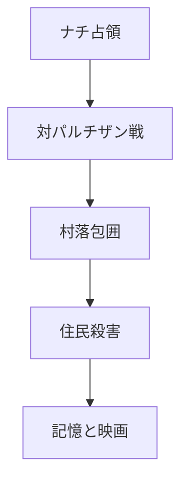

## 1. エグゼクティブサマリー

まず時代を直す必要がある。『炎628』が直接扱うのは第一次世界大戦下のロシア農村ではなく、第二次世界大戦中、1941年から1944年にナチ・ドイツが占領したベラルーシである。第一次世界大戦にもドイツ占領地の強制労働、徴発、経済収奪、厳格な軍政はあったが、SSや「628の村」が関わる焼き尽くしの記憶は第二次世界大戦の文脈に属する。<SourceNote>[1914-1918 Online, Ober Ost](https://encyclopedia.1914-1918-online.net/article/ober-ost/) は第一次世界大戦期のドイツ東部占領を軍政、植民構想、経済収奪として整理し、[Forced Labour](https://encyclopedia.1914-1918-online.net/article/forced-labour/) はロシア領ポーランドやリトアニアでの強制労働を論じている。</SourceNote>

ベラルーシの村落破壊は、単発の「狂った兵士の残虐行為」ではない。対パルチザン作戦、食料・労働力の奪取、占領地支配、反スラヴ・反ユダヤの絶滅政策、住民を恐怖で統治する方針が重なった体系的暴力だった。Khatyn記念施設は、1943年3月22日のKhatyn虐殺で住民149人、うち75人の子どもが殺されたと説明している。<SourceNote>[Khatyn State Memorial Complex, The Khatyn Tragedy](https://www.khatyn.by/en/khatyn) は、住民が納屋に閉じ込められ、火を放たれ、逃げた人々が機関銃で撃たれた経過を説明している。</SourceNote>

映画の「628」は、ソ連期の記憶政治の中で定着した「住民ごと焼かれたベラルーシの村」の数を指す。現在のベラルーシ側公式説明では調査の進展により数値が更新されており、以前は186村、現在は少なくとも290村がKhatynと同じ運命をたどったとされる。したがって、628は映画が依拠した当時の記憶と象徴の数字であり、今日の調査値とは分けて扱うのがよい。<SourceNote>CriterionのMark Le Fanu論考は、映画終盤の字幕が「628 villages」と語ることを説明し、Khatyn記念施設は2025年の説明で、調査前は9,200集落被害、現在は少なくとも12,868集落被害、Khatyn型の村は少なくとも290村と説明している。[Criterion, Come and See: Orphans of the Storm](https://www.criterion.com/current/posts/7003-come-and-see-orphans-of-the-storm)、[Khatyn, Burnt villages](https://www.khatyn.by/en/khatyn) を参照。</SourceNote>

あなたのラストシーン解釈は、おおむね映画の中心に触れている。少年フリョーラがヒトラーの肖像へ銃弾を撃ち込むのは怒りと復讐の噴出だが、幼児のヒトラー像で撃つのを止めることで、映画は「殺意の反復」だけでは終わらない。Klimov自身は、原題案だった「Kill Hitler」を文字通りではなく「自分たちの中に潜むヒトラーを殺せ」という道徳的命令として説明していた。<SourceNote>Mark Le Fanuは、ラストの逆再生ニュースリールと幼児ヒトラー像を論じ、Klimovが「Kill Hitler」を普遍的な道徳命令として説明していたことを紹介している。[Criterion, Come and See: Orphans of the Storm](https://www.criterion.com/current/posts/7003-come-and-see-orphans-of-the-storm) を参照。</SourceNote>

## 2. 第一次世界大戦ではなく、第二次世界大戦のベラルーシ

第一次世界大戦下のドイツ東部占領を無害化してよいわけではない。Ober Ostでは、軍が行政を握り、移動統制、労働動員、徴発、資源収奪、植民構想が進められた。強制労働研究は、第一次大戦期のドイツ占領地労働政策が、第二次大戦期のナチ強制労働制度の先行経験になった面を指摘している。

しかし『炎628』の主題は、第一次大戦の占領暴力ではなく、独ソ戦下の絶滅戦争である。SS、Generalplan Ost、Reichskommissariat Ostland、補助警察、対パルチザン「討伐」、村落の焼却、住民の集団殺害は、1941年6月22日のドイツによるソ連侵攻以後の構造で理解しなければならない。Khatyn記念施設も、1941年8月末までにベラルーシ全域が占領され、暴力と恐怖に基づく「新秩序」が敷かれたと説明している。<SourceNote>[Khatyn, Nazi occupation policy](https://www.khatyn.by/en/khatyn) は、1941年6月22日のドイツ侵攻、8月末までのベラルーシ占領、Reichskommissariat Ostlandなどの行政区分、暴力的な占領体制を説明している。</SourceNote>

この違いは重要である。第一次大戦のドイツ軍政にも住民を苦しめた制度的暴力があるが、『炎628』の集落焼却は、占領地を将来の植民空間と見なし、抵抗の疑いを村全体の死で処理し、住民を人間ではなく「支配の障害」として扱う第二次大戦東部戦線の暴力である。

## 3. 村落破壊はどう行われたのか

Khatyn虐殺は、その構造を縮図のように示す。1943年3月22日、近くの道路でドイツ将校がパルチザン攻撃により死亡した。Khatynの住民はその攻撃を知らなかったが、村は包囲され、住民は納屋に追い込まれた。扉は閉ざされ、藁と燃料で火が放たれ、外へ逃げようとした人々は機関銃で撃たれた。

ここで重要なのは、村人が戦闘員だったかどうかではない。むしろ、非戦闘員である女性、子ども、高齢者、病人が意図的に巻き込まれた点に、対パルチザン作戦の犯罪性がある。Per Anders Rudlingは、1942年末にはドイツ軍と現地協力者が、パルチザン支援を疑われた村を包囲し焼却することが標準的実務になっていたと整理している。<SourceNote>Per Anders Rudling, [The Khatyn Massacre in Belorussia: A Historical Controversy Revisited](https://scispace.com/pdf/the-khatyn-massacre-in-belorussia-a-historical-controversy-1fyhkaimcw.pdf) は、1942年末以降、パルチザン支援を疑われた村の包囲・焼却が標準化し、女性や子どもも標的化されたと整理している。</SourceNote>

虐殺の論理は、軍事的必要性ではなく、支配のための恐怖だった。ドイツ側は「パルチザン」「共産主義者」「ユダヤ人」「協力者」を広く一体化し、疑いのある空間そのものを消す発想を取った。村を焼けば、食料供給、避難場所、住民の相互扶助、地域の記憶も消える。これは戦闘行為ではなく、社会を壊す政治的暴力である。

| 加害の段階 | 実際の意味 |
| ---------- | ---------- |
| 偵察・告発 | 村を「パルチザン支援」と分類する |
| 包囲 | 逃亡と証言の可能性を奪う |
| 建物への集合 | 殺害効率を上げる |
| 放火・銃撃 | 火災と銃撃で生存者を減らす |
| 略奪・焼却 | 生活基盤と帰還可能性を消す |

## 4. 加害主体: SSだけではなく、SS、警察、補助部隊、現地協力者

『炎628』を見ると、加害者は一体の悪として見える。それは映画表現として正しい。しかし史実としては、加害主体は複合的だった。KhatynではSchutzmannschaft Battalion 118、すなわちドイツ指揮下の補助警察部隊が中心的役割を持ち、SS-Sonderbataillon Dirlewangerが関与した。Rudlingは、同部隊が約500人規模で、元ソ連捕虜やウクライナ民族主義系の人員を含み、ドイツ人指揮官と現地将校の二重構造を持っていたと説明している。<SourceNote>Rudlingは、Schutzmannschaft Battalion 118の構成、ドイツ人指揮官と現地将校の並行指揮、1943年初頭のベラルーシ派遣、Khatyn破壊がWandsbeck作戦の一部だったことを整理している。[The Khatyn Massacre in Belorussia](https://scispace.com/pdf/the-khatyn-massacre-in-belorussia-a-historical-controversy-1fyhkaimcw.pdf) を参照。</SourceNote>

Dirlewanger部隊は、映画の記憶と結びつく特に悪名高い存在である。もともと犯罪者、受刑者、規律違反者を取り込んだSS系の対パルチザン部隊として知られ、ベラルーシやポーランドで大量殺害、略奪、性暴力、焼却作戦に関与した。ここで「犯罪者で構成されたSS」という理解は、Dirlewangerについては大筋で当たっている。ただし、Khatyn型の村落破壊全体を「犯罪者SSだけがやった」と狭く見ると、ドイツ軍、SS・警察、占領行政、補助警察、現地協力者が連動した構造を見落とす。

この区別は、責任を薄めるためではない。むしろ逆である。残虐な個人や異常な部隊だけに責任を閉じ込めると、普通の行政、警察、軍命令、食料徴発、労働力政策、反共宣伝がどのように虐殺を可能にしたかが見えなくなる。『炎628』の恐ろしさは、加害者が怪物に見える瞬間と、同時にそれが組織、命令、儀式、笑い、酒、音楽、写真撮影を伴う「業務」として進む瞬間を、同じ画面に置くところにある。

## 5. 『炎628』の制作過程

『炎628』は、Elem KlimovがAles Adamovichと共同で脚本を書いた1985年のソ連映画である。BFIは、1985年、ソ連・白ロシアSSR・ロシアSFSRの作品として、監督Klimov、脚本AdamovichとKlimov、出演Alexei Kravchenko、Olga Mironova、上映時間142分と整理している。<SourceNote>[BFI, Come and See (1985)](https://www.bfi.org.uk/film/7400501f-e65d-5e1c-9ba7-847a1a680978/come-and-see) は作品基本情報とSight and Sound投票での評価を掲載している。</SourceNote>

脚本の背後には、Adamovichの小説『Khatyn』と、火の村の生存証言を集めた『Out of the Fire』がある。Adamovichは戦時中に十代でパルチザン経験を持ち、戦後には生存者の声を文学化した。CriterionのValzhyna Mort論考は、Adamovichが300人の生存証言を集めたこと、その声が『炎628』の重要な源泉になったことを説明している。<SourceNote>[Criterion, Read and See: Ales Adamovich and Literature out of Fire](https://www.criterion.com/current/posts/7006-read-and-see-ales-adamovich-and-literature-out-of-fire) は、Adamovichの証言文学、Khatyn、Out of the Fireと映画の関係を説明している。</SourceNote>

制作は長く妨げられた。Criterionの作品解説は、ソ連当局が脚本承認に7年を要し、制作がほとんど阻まれたと説明している。Klimovは当初、より直截な題名「Kill Hitler」を考えていたが、最終題名は黙示録に由来する『Come and See』になった。<SourceNote>[Criterion, Come and See](https://www.criterion.com/films/28895-come-and-see) は、検閲により脚本承認まで7年を要したこと、Klimovの主観的カメラと表現主義的音響設計を説明している。</SourceNote>

映画のリアリティは、単に史実に忠実という意味ではない。時系列順の撮影、少年俳優Kravchenkoの身体的消耗、極端なクローズアップ、Steadicam、耳鳴りのような音響、夢と現実が混ざる画面が、観客を「説明を聞く位置」ではなく「目撃してしまう位置」に置く。実弾使用については、二次資料や俳優インタビューに基づいて広く語られており、銃弾が頭上10センチほどを通ったという証言も流通している。ただし、この点は作品の倫理的評価と切り離せないため、映画の偉大さとして無批判に称揚するより、当時の安全感覚と制作倫理の危うさとしても読むべきである。<SourceNote>実弾使用説は、俳優インタビューやDVD資料に基づく二次的整理として広く流通している。例として [GW2, 9 must-know facts about Come and See](https://www.gw2ru.com/arts/77861-come-and-see-soviet-movie) は実弾使用を紹介しているが、本文では一次制作資料で確認できる事実と区別して扱った。</SourceNote>

## 6. 監督Elem Klimovはどういう人か

Klimovは1933年、Stalingrad生まれのソ連映画監督である。The Guardianの追悼記事は、彼が5本の長編しか作れず、その最後の作品が『Come and See』だったこと、1986年にはソ連映画人同盟の第一書記になったが、理想と制度の間で挫折したことを記している。<SourceNote>[The Guardian, Elem Klimov obituary](https://www.theguardian.com/news/2003/nov/04/guardianobituaries.russia) は、Klimovの経歴、検閲との衝突、映画人同盟での役割、未完企画を整理している。</SourceNote>

彼の戦争感覚は抽象的な反戦思想ではない。Klimovは少年時代にStalingradから避難し、燃えるVolga川を目撃した経験を持っていた。彼は後に、知っているすべてを映画に入れたら自分でも見られなかっただろう、と語っている。『炎628』の地獄の質感は、ベラルーシの証言資料だけでなく、Klimov自身の幼少期の戦争記憶とも結びついている。<SourceNote>The Guardian追悼記事は、Klimovが母と幼い弟とともにStalingradからVolga川を渡って避難した経験、燃える都市と川の記憶、映画にすべてを入れたら自分でも見られなかったという発言を紹介している。</SourceNote>

また、妻Larisa Shepitkoの死も無視できない。Shepitkoは『The Ascent』で知られる監督で、1979年に事故死した。Klimovは彼女の未完企画を引き継ぎ、『Farewell』を完成させた。この喪失の後に作られた『炎628』は、単なる歴史映画というより、喪失、証言、怒り、倫理の限界を背負った遺言的作品になった。

## 7. 映画の考察: 悪意よりも、倫理の崩壊を見る

『炎628』の強烈さは、加害者を「底なしの悪意を持つ怪物」として見せるだけではない。むしろ、戦争が人間を怪物に変える、という説明だけでも足りない。映画が見せるのは、倫理が停止した環境では、笑い、遊び、命令、集団心理、写真、音楽、服装、酒、欲望が、殺害の儀式へ自然に組み込まれていく光景である。

この映画の村落焼却場面が耐えがたいのは、死が「戦闘の結果」ではなく「催し物」のように演出されるからである。加害者は任務を遂行するだけでなく、住民の恐怖を娯楽に変える。これは単に殺すことよりも深い暴力で、犠牲者から生命だけでなく、尊厳、証言、世界の意味を奪う。

一方で、映画は暴力をスペクタクルとして消費させない。Klimovのカメラは、死体や炎を見せるだけでなく、フリョーラの顔を見せる。観客は、事件を外側から評価する安全な位置にいられない。少年の顔が変わっていくこと自体が、村落破壊の記録になる。

## 8. ラストシーンの解釈

ラストでフリョーラは、泥の中に置かれたヒトラーの肖像へ何度も発砲する。映像は逆再生され、戦争、演説、行進、政治的上昇、若き日のヒトラーへ遡り、最後に幼児のヒトラー像へ至る。ここで少年は撃つのを止める。

この停止は、あなたの言う「同族にはならない」という矜持として読める。さらに正確に言えば、映画は、復讐の感情を否定しないまま、無垢の幼児を殺す想像へは進まない。罪は存在そのものではなく、思想、選択、制度、行為、命令、加担、沈黙として歴史の中で形成される。幼児を撃てないことは、フリョーラがまだ倫理を完全には失っていないことを示す。

同時に、この場面は単純な「ヒトラー一人を殺せば歴史は救われた」という話でもない。Klimovの説明に従えば、問題は一人の怪物ではなく、人間の中に潜むヒトラー性である。怒りは必要だが、怒りが無差別な殺意に変わった瞬間、フリョーラは加害者の論理へ近づいてしまう。だから銃撃の停止は、復讐よりも難しい倫理的踏みとどまりである。

あなたの解釈のうち、「無垢の子どもには罪はなく、存在ではなく行いに対して罪を糾弾すべきだ」という読みは特に妥当だと思う。ただし「時代が生んだ狂気」という言い方だけには注意が要る。時代は条件を作ったが、行為したのは組織と個人であり、命令し、従い、笑い、略奪し、火をつけ、撃った人間たちである。時代に溶かすと責任が薄まる。映画は、時代の狂気と個人の加担を同時に見ろ、と迫っている。

## 9. 結論

『炎628』を理解するには、三つの層を分けるとよい。第一に、史実としてのベラルーシ村落破壊である。これは第二次世界大戦のナチ占領下で、対パルチザン作戦の名のもとに行われた住民殺害、村落焼却、強制労働、略奪、恐怖支配の体系である。

第二に、記憶としてのKhatynと「628」である。Khatynは一つの村であると同時に、住民ごと消された多数の村を代表する記憶の装置になった。数字は時期や調査範囲によって変わるが、映画が示す核心は、村全体を火で消す暴力が反復されたという事実である。

第三に、映画としての『炎628』である。この作品は、戦争犯罪を説明する映画ではなく、観客に目撃させる映画である。ラストで少年が銃を止める瞬間は、怒りを捨てることではない。怒りを持ったまま、無垢を撃たないこと、存在ではなく行為を裁くこと、そして自分の中に生まれかけた加害の論理を止めることである。

## 参考情報

- [Khatyn State Memorial Complex, Khatyn](https://www.khatyn.by/en/khatyn)
- [Per Anders Rudling, The Khatyn Massacre in Belorussia: A Historical Controversy Revisited](https://scispace.com/pdf/the-khatyn-massacre-in-belorussia-a-historical-controversy-1fyhkaimcw.pdf)
- [Criterion, Come and See](https://www.criterion.com/films/28895-come-and-see)
- [Criterion, Come and See: Orphans of the Storm](https://www.criterion.com/current/posts/7003-come-and-see-orphans-of-the-storm)
- [Criterion, Read and See: Ales Adamovich and Literature out of Fire](https://www.criterion.com/current/posts/7006-read-and-see-ales-adamovich-and-literature-out-of-fire)
- [BFI, Come and See (1985)](https://www.bfi.org.uk/film/7400501f-e65d-5e1c-9ba7-847a1a680978/come-and-see)
- [The Guardian, Elem Klimov](https://www.theguardian.com/news/2003/nov/04/guardianobituaries.russia)
- [1914-1918 Online, Ober Ost](https://encyclopedia.1914-1918-online.net/article/ober-ost/)
- [1914-1918 Online, Forced Labour](https://encyclopedia.1914-1918-online.net/article/forced-labour/)
