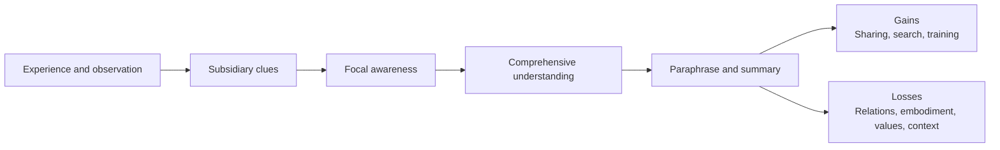
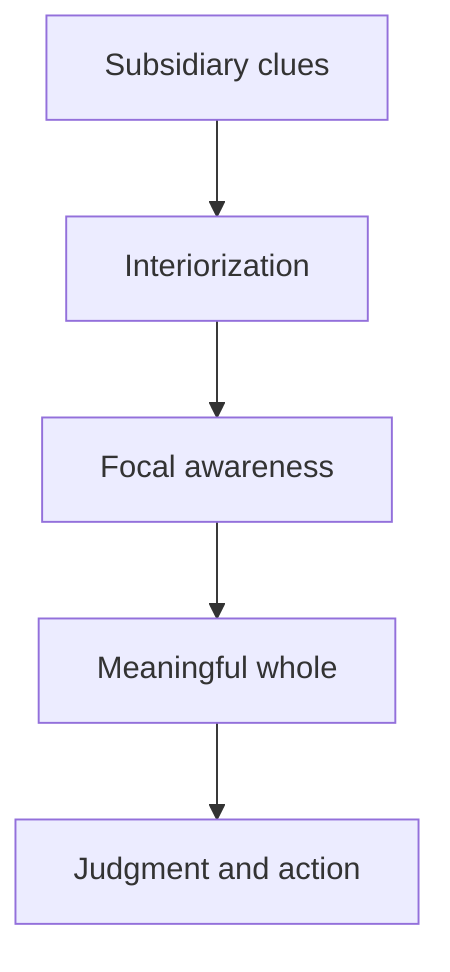
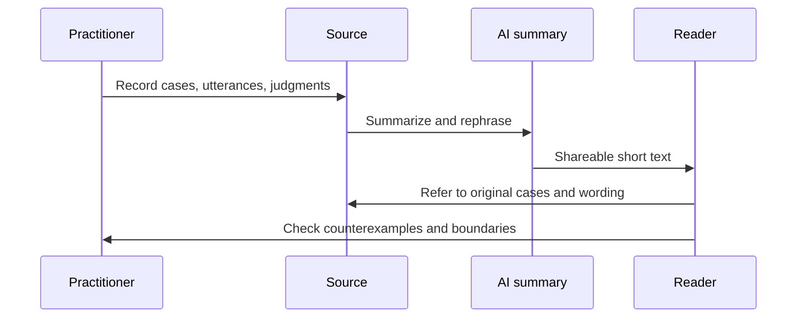

# Is comprehensive understanding diluted by paraphrasing?

## 1. Executive Summary

In conclusion, paraphrasing is useful, but it is not equivalent to comprehensive understanding. Polanyi's tacit knowing is understood not as the sum of its elements, but as a synthesis of `from-to` that moves into the whole through peripheral cues. Therefore, if only the clues are broken down and made into propositions, the knots that support the object itself may come undone. This is the essence of the phenomenon of "dilution."
This loss is not just a reduction in the amount of information. At least the following four are likely to fail. These are: 1) relationships between cues, 2) embodied attention and mastery, 3) value orientations of what counts as good judgment, and 4) contexts in which exceptions and boundary conditions emerge. Conversely, the benefit of paraphrasing is that it creates a starting point for sharing, searching, educating, auditing, and discussion.
In other words, the question is not "should we make it explicit?" but "what should we make explicit while keeping it?" In education, we leave the original case and the original utterance. Organizational knowledge leaves behind the basis for judgment and counterexamples. In the AI ​​summary, the source and evaluation memo are included, rather than the original summary.
Source note: The basic sources for Polanyi's tacit knowing and `from-to` structure are Polanyi Society's [The Structure of Consciousness](https://polanyisociety.org/mp-structure.htm) and UChicago Press' [The Tacit Dimension](https://press.uchicago.edu/ucp/books/book/chicago/T/bo6035368.html). [The Republic of Science](https://www.nobelprize.org/prizes/economic-sciences/1975/polanyi/lecture/) shows that value judgments are part of scientific practice. Martin Davies' [Knowledge, explicit, implicit and tacit](https://mkdavies.net/Martin_Davies/CogSci_files/KnowledgeExpImpTacit.pdf) is useful for the cognitive science distinction surrounding loss of paraphrase, and the loss of context information in AI summaries can be found in [Few-Shot Long-Document Summarization](https://ojs.aaai.org/index.php/AAAI/article/view/26631) of AAAI 2023.

## 2. Problem setting

This question is not simply asking, "Should I give a longer explanation?" Rather, I am asking to what extent the knowledge that supports a certain practice remains the same knowledge the moment it is replaced by a series of propositions. In Polanyi's vocabulary, the focal whole is established by indwelling peripheral cues into the background. Therefore, leaving the background as the background is not the same as changing the background to an explanatory item.
"Comprehensive understanding" does not mean listing all the parts. Rather, it is closer to understanding how parts are connected and what differences and resistances they include to create a whole. The problem with reductionism here is not that the explanation is coarse, but that the form of the explanation destroys the structure of understanding.
Source note: Polanyi Society's [The Structure of Consciousness](https://polanyisociety.org/mp-structure.htm) describes the `from-to` structure, which moves from subsidiary awareness to focal awareness. UChicago Press's [The Tacit Dimension](https://press.uchicago.edu/ucp/books/book/chicago/T/bo6035368.html) brings to the fore the existence of knowledge that cannot be stated but is in operation with the proposition, "we can know more than we can tell."

## 3. Conceptual organization

| Concept                     | What it refers to                                                        | Notes on paraphrasing                                                                            |
| --------------------------- | ------------------------------------------------------------------------ | ------------------------------------------------------------------------------------------------ |
| Comprehensive understanding | Understanding that clues are integrated and have meaning as a whole      | If you reduce it to a list of parts, you will not be able to see the rise of the whole           |
| Reductionism                | A view that treats the whole as a simple sum of parts                    | Even if the explanations of the parts increase, interactions and evaluation criteria can be lost |
| Explicit/Formalization      | Writing down implicit functions into propositions, procedures, and rules | Increases commonality, but tends to reduce context dependence                                    |
| Translation / Paraphrase    | Transfer to another system of expression                                 | Involves a change in selection and emphasis rather than a synonymous transformation              |
| ineffability                | How difficult is it to verbalize                                         | We need to distinguish between "I can't say it completely" and "I can't say it enough"           |
| Value judgment              | Evaluation of what is considered good, important, and valid              | Replacing it with factual statements removes the orientation of norms                            |

This arrangement requires recognizing that paraphrasing is not always "degradation," while still treating it as non-equivalent. While the possibility of transfer increases, the structure of the object of knowledge itself may be lost.
Source note: Davies' [Knowledge, explicit, implicit and tacit](https://mkdavies.net/Martin_Davies/CogSci_files/KnowledgeExpImpTacit.pdf) makes the distinction between `explicit` / `implicit` / `tacit` clear. The strength of `ineffability` can be easily distinguished between "I can't say it completely" and "I can't say it enough" if we follow a philosophical arrangement like [Ineffability](https://link.springer.com/article/10.1007/s11701-010-0197-9).

## 4. Comprehensive understanding of Polanyi

Polanyi's core lies in the fact that knowing is not explained solely by "symbolic processing that can be seen from the outside." Rather than arriving at a conclusion by looking at clues one by one, we indwell in the background of peripheral awareness and shift our focus to a whole. What the `from-to` arrow indicates is not the operation of adding parts together, but the production of meaning.
In this case, comprehensive understanding is not just "synthesis." It includes the relationship between cues, the allocation of attention, boundaries that are susceptible to failure, and the integration of the whole as `comprehensive entity`. Therefore, when paraphrasing extracts clues and breaks them down into separate propositions, the connections before being synthesized become invisible.

Source note: Polanyi Society's [The Structure of Consciousness](https://polanyisociety.org/mp-structure.htm) explains the relationship between `subsidiary awareness`, `focal awareness`, and `comprehensive entity`. UChicago Press's [The Tacit Dimension](https://press.uchicago.edu/ucp/books/book/chicago/T/bo6035368.html) formulates tacit knowledge as "knowing more than you can say." The Polanyi Society glossary describes `understanding` as the most comprehensive form of knowledge used by Polanyi.

## 5. What is lost in paraphrasing?

### 5.1 Relationship structure

The first thing that tends to be lost is the relationship between the clues. Summarization usually eliminates duplication and selects representative expressions. In the process, the relational structure of which cues support which cues and where exceptions begin becomes thinner. However, in reality, it is this relationship that supports the judgment of experts.

### 5.2 Embodied Attention

The second thing that is often lost is embodied attention. Mastery is often associated with eye movements, hand movements, pauses, sequence, and the elimination of hesitation that precede words. If you only use explanatory text, "what you were looking at" may remain, but "how you were looking at it" will be lost.

### 5.3 Direction of value judgment

The third thing that is often lost is the direction of value judgments. Polanyi treated science not as a value-neutral algorithm, but as a practice that involves a commitment to truth, integrity, judgment, and the selection of criteria. When paraphrasing leaves only factual propositions, "what was important" disappears.

### 5.4 Context and counterexamples

The fourth thing that is often lost is context and counterexamples. Generalizations are useful, but in practice, it is important to have boundary information such as "this will not work under these conditions", "the opposite will happen for this customer", and "normal rules do not apply in this case". Summarization creates a mean picture, but the mean picture often hides the entry point for exception handling.

### 5.5 Community norms

The fifth thing that tends to be lost is community norms. The content of propositions alone does not determine what is considered a good review, what suggestions are considered unreasonable, and what silence is considered a reservation. This is not just a question of data, but of the style of evaluation.
Source note: The relationship between embodiment and tacit knowledge is reinforced by [Somatic and cultural knowledge: drivers of a habitus-driven model of tacit knowledge acquisition](https://eprints.whiterose.ac.uk/160769/) and [Cognition, knowing and learning in the flesh: Six views on embodied knowing in organization studies](https://www.sciencedirect.com/science/article/pii/S0956522113000687). [Cognitive Task Analysis: Eliciting Expert Cognition in Context](https://journals.sagepub.com/doi/10.1177/10944281241271216) is a useful method for extracting the cognitions of experts in context. Values ​​and commitments in science are summarized in [The Republic of Science](https://www.nobelprize.org/prizes/economic-sciences/1975/polanyi/lecture/).
| What is lost | What happens when paraphrasing | Practical symptoms |
| ---------------- | -------------------------------- | ------------------------------------ |
| Relationship structure | Putting clues into separate bullet points | It becomes impossible to see "why we made that decision" |
| Embodied attention | How to do an action is omitted | Cannot be reproduced even after reading the procedure |
| Direction of value judgments | Evaluation criteria retreat to neutral expressions | Judgments of good and bad become vague |
| Context and counterexamples | Compressed to average explanation | Mistakes in handling exceptions |
| Community norms | The atmosphere and standards of the place disappear | Reviews and education become mere formalities |

## 6. Auxiliary lines from the perspective of cognitive science

Cognitive science can explain the loss of paraphrase in terms other than "mystery." First, there is a distinction between explicit knowledge, tacit knowledge, and tacit knowledge. As Davies explains, `explicit knowledge` cannot be fully expressed in words, and `implicit` and `tacit` have different degrees of explainability. In other words, what remains after paraphrasing is often only part of the knowledge.
Furthermore, classical studies of implicit learning have shown that learners can behave correctly based on regularities in the environment even if the rules are not explicitly stated. What is lost here is not truth or falsity, but the visibility of the internal structures that support learning.
Furthermore, recent research has reaffirmed the importance of physical involvement in acquiring tacit knowledge. In other words, part of our knowledge lies not in "propositions in our heads" but in "the way we connect to the world through our bodies."
Source note: Davies' [Knowledge, explicit, implicit and tacit](https://mkdavies.net/Martin_Davies/CogSci_files/KnowledgeExpImpTacit.pdf) organizes explicit knowledge, tacit knowledge, and tacit knowledge, and shows that tacit knowledge is not just unexplained knowledge. A classic overview of implicit learning is Reber's [Implicit learning and tacit knowledge](https://www.jstor.org/stable/10.2307/1422871). Regarding embodiment, [Somatic and cultural knowledge: drivers of a habitus-driven model of tacit knowledge acquisition](https://eprints.whiterose.ac.uk/160769/) and [Cognition, knowing and learning in the flesh: Six views on embodied knowing in organization studies](https://www.sciencedirect.com/science/article/pii/S0956522113000687) are the latest auxiliary lines.

## 7. Why are value judgments so easily overlooked?

The reason why value judgments are easily overlooked is that paraphrasing often relies on descriptive sentences. But value judgments are not descriptions. What to prioritize, what to tolerate, and what to consider dangerous cannot simply be a list of facts.
What we need to be careful about here is not to treat value judgments as "unnecessary because they are subjective." Rather, in practice, value judgments are what make the difference in decision-making. Priorities, risk tolerance, quality standards, customer response speed, and training rigor may seem easy to explain on the surface, but they actually determine an organization's behavior.
Polanyi's importance is that while he does not reduce knowledge to individual preferences, he also does not reduce value to external appendages. What scientists find problematic, promising, and inappropriate lies within knowing.
Source note: The position of value in Polanyi's understanding of science can be found in [The Republic of Science](https://www.nobelprize.org/prizes/economic-sciences/1975/polanyi/lecture/). The Stanford Encyclopedia of Philosophy's [Value Theory](https://plato.stanford.edu/entries/value-theory/) helps explain that value cannot be reduced to a simple description.

## 8. Ineffability is not monolithic

If we understand `ineffability` to mean "it cannot be said completely," the discussion quickly becomes mysterious. In reality, there are stages of difficulty in talking about things. At the very least, it is necessary to separate the following layers: 1) one language is insufficient but another medium can make up for it, 2) it can be said but the ability to reproduce it is poor, 3) the subject would be destroyed if everything is said theoretically, and 4) it cannot be accommodated in any representation.
In Polanyi's case, 1) and 2) are typical. In other words, rather than being unable to verbalize it, when it is verbalized, the connection between cues and the unity of action become weaker. Therefore, there is no need to easily adopt strong ineffability. Rather, it is more practical to determine what can be preserved through a medium and what changes when the medium is changed.
In this respect, paraphrasing is a "translation," but it is not an equivalence transformation in the strict sense of the word. Translation always involves selection, deletion, and redistribution of emphasis. That's why paraphrasing, while useful as an explanation, is not a perfect substitute.
Source note: The view of ineffability as strong or weak can be easily understood by reading together the treatment of tacit knowledge in [Ineffability: the Very Concept](https://link.springer.com/article/10.1007/s11406-020-00198-2) of Philosophical Arrangement and [Knowledge, explicit, implicit and tacit](https://mkdavies.net/Martin_Davies/CogSci_files/KnowledgeExpImpTacit.pdf) of Davies. Regarding Polanyi, it is best to read [The Tacit Dimension](https://press.uchicago.edu/ucp/books/book/chicago/T/bo6035368.html) and [The Structure of Consciousness](https://polanyisociety.org/mp-structure.htm) as primary sources.

## 9. Effects on education, organizational knowledge, and AI summarization

### 9.1 Education

In education, it is easier to feel like the child understands if only more explanations are provided. To foster comprehensive understanding, rather than explaining the correct answer, it is necessary to have a design that lists good examples, bad examples, failure examples, and counterexamples to confirm what the learner has overlooked.

### 9.2 Organizational knowledge

In organizations, it is important not to over-reform the veteran's narrative. If only standardized documents are used, there will be no sense of incongruity during reviews, and it will be difficult to pay attention to customers, make judgments in case of exceptions, and accept responsibility. Therefore, it is better to keep records of the original utterances, notes made during judgments, counterexamples, and failures.

### 9.3 AI Summary

AI summaries improve searchability and distribution efficiency, but cannot be used as authentic copies. In particular, research on long text summarization explicitly addresses the problem of the loss of context information in the process of summarizing long inputs. Therefore, while it may be possible to entrust AI with "compressed explanations," it should not be left to the final judgment of "what was important."

Source note: For the perspective of education and mastery, [Cognitive Task Analysis](https://journals.sagepub.com/doi/10.1177/10944281241271216) is helpful. The loss of context information in AI summaries is demonstrated by [Few-Shot Long-Document Summarization](https://ojs.aaai.org/index.php/AAAI/article/view/26631), reinforcing why summaries should not be authenticated.

## 10. How to handle it in practice

In practice, it is easier to reduce losses by observing the following five points.

1. Leave the original text. Don't just save the summary.
2. Leave the case. In addition to principles, leave examples of success, failure, and counterexamples.
3. Separate judgment criteria. Write separately what you saw and how you evaluated it.
4. Leave exceptions. Manage general rules and boundary conditions separately.
5. Double-layer your summary. A set of short sentences for humans and references to the source material.
   The point of this design is not to resist paraphrasing. Rather, it is about clarifying to what extent paraphrasing is valid and from where a return to the original practice is necessary.
   Source note: The strategy here is practical reasoning based on Polanyi's `from-to` structure, Davies' tacit/implicit/explicit distinction, CTA's extraction of cognition in context, and the loss of context information in long summaries.

## 11. Risks/Limitations

There are three common misconceptions about this topic. First, equate tacit knowledge with "some kind of feeling." Second, blame all paraphrase failures on indiscursivity. Third, comprehensive understanding is viewed as an "unexplainable mystery."
Although this paper focuses on Polanyi, it does not deal with the entire history of philosophy surrounding tacit knowledge. Further literature reviews are needed to traverse Wittgenstein, phenomenology, practice theory, semantics, cognitive science, and organization theory.
Nevertheless, the conclusions of this paper are of actionable enough. Paraphrasing is a tool for sharing, but it is not a substitute for understanding. To protect our understanding, we need to put the original case and original judgment back behind the summary.
Source note: Polanyi's primary sources prioritized [The Tacit Dimension](https://press.uchicago.edu/ucp/books/book/chicago/T/bo6035368.html) and [The Structure of Consciousness](https://polanyisociety.org/mp-structure.htm). Davies' [Knowledge, explicit, implicit and tacit](https://mkdavies.net/Martin_Davies/CogSci_files/KnowledgeExpImpTacit.pdf) is effective to avoid confusion between `tacit` / `implicit` / `explicit`.

## 12. Recommended policy

The summarization recommendations are clear.

1. Use paraphrases for sharing and searching.
2. Comprehensive understanding is maintained using original texts, original cases, criteria, and counterexamples.
3. Place value judgments in a separate column from factual statements.
4. Treat AI summaries as an aid to indexing.
5. In education, emphasize observation, imitation, and feedback rather than explanation.
   To put it in Polanyi's terms, knowledge cannot be established by erasing clues. Good rephrasing, therefore, is not about erasing clues, but rearranging them so that they work again.
   Source note: The above is a practical synthesis based on Polanyi's tacit knowing, Davies' classification of knowledge, CTA, and long summary research. See [The Tacit Dimension](https://press.uchicago.edu/ucp/books/book/chicago/T/bo6035368.html), [The Structure of Consciousness](https://polanyisociety.org/mp-structure.htm), [Knowledge, explicit, implicit and tacit](https://mkdavies.net/Martin_Davies/CogSci_files/KnowledgeExpImpTacit.pdf) for details.

## Reference information

- Michael Polanyi, [The Tacit Dimension](https://press.uchicago.edu/ucp/books/book/chicago/T/bo6035368.html), University of Chicago Press.
- Polanyi Society, [The Structure of Consciousness](https://polanyisociety.org/mp-structure.htm).
- Michael Polanyi, [The Republic of Science](https://www.nobelprize.org/prizes/economic-sciences/1975/polanyi/lecture/), Nobel Prize.
- Martin Davies, [Knowledge, explicit, implicit and tacit](https://mkdavies.net/Martin_Davies/CogSci_files/KnowledgeExpImpTacit.pdf).
- Hans J. Reber, [Implicit learning and tacit knowledge](https://www.jstor.org/stable/10.2307/1422871), Journal of Experimental Psychology: General, 1989.
- Olivia Brown, Nicola Power, Julie Gore, [Cognitive Task Analysis: Eliciting Expert Cognition in Context](https://journals.sagepub.com/doi/10.1177/10944281241271216), Organizational Research Methods, 2025.
- [Somatic and cultural knowledge: drivers of a habitus-driven model of tacit knowledge acquisition](https://eprints.whiterose.ac.uk/160769/), Journal of Documentation.
- [Cognition, knowing and learning in the flesh: Six views on embodied knowing in organization studies](https://www.sciencedirect.com/science/article/pii/S0956522113000687), Scandinavian Journal of Management.
- [Few-Shot Long-Document Summarization](https://ojs.aaai.org/index.php/AAAI/article/view/26631), AAAI 2023.
- Stanford Encyclopedia of Philosophy, [Value Theory](https://plato.stanford.edu/entries/value-theory/).
