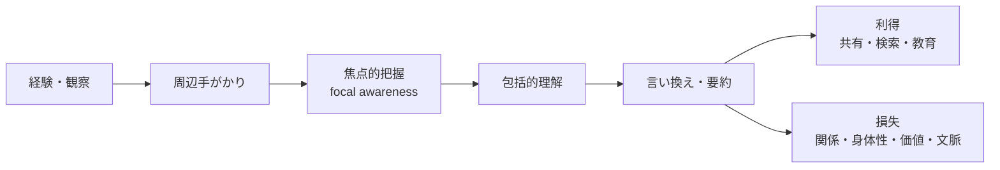
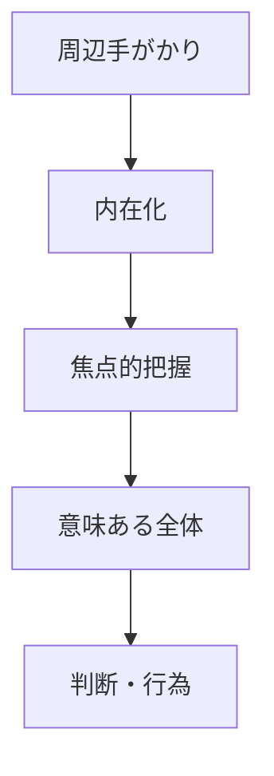
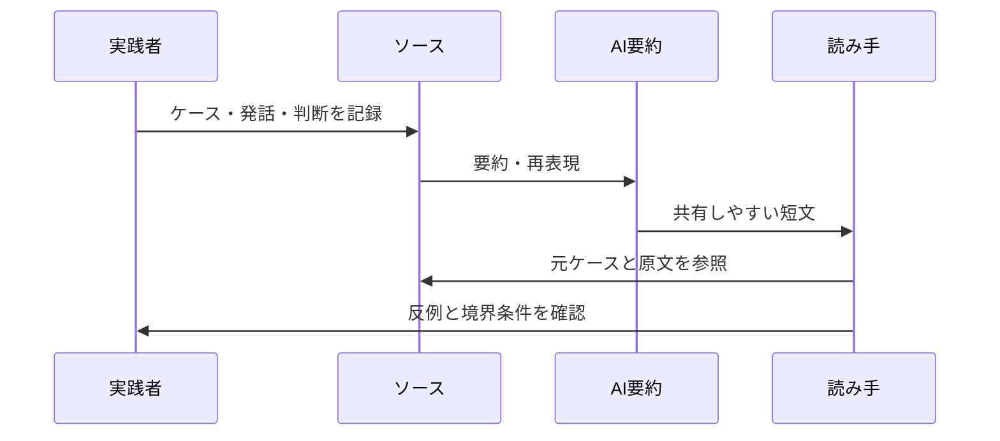

# 包括的理解は言い換えで薄まるのか

## 1. エグゼクティブサマリー

結論から言えば、言い換えは有用だが、包括的理解と等価ではない。ポランニーの tacit knowing は、要素の総和ではなく、周辺的な手がかりを通じて全体へ移る `from-to` の統合として理解される。したがって、手がかりだけを分解して命題化すると、対象そのものを支えていた結び目がほどけることがある。これが「薄まる」という現象の中身である。

この損失は、単なる情報量の減少ではない。少なくとも次の 4 つが落ちやすい。1) 手がかり同士の関係、2) 身体化された注意と熟達、3) 何を良い判断とみなすかという価値の向き、4) 例外や境界条件が立ち上がる文脈である。逆に、言い換えの利点は、共有、検索、教育、監査、議論の開始点を作ることにある。

つまり、問題は「明示化すべきか」ではなく、「何を残したまま明示化するか」である。教育では元ケースと元発話を残す。組織ナレッジでは判断の根拠と反例を残す。AI要約では、要約を正本にせず、ソースと評価メモを併記する。

<SourceNote>ポランニーの tacit knowing と `from-to` 構造は Polanyi Society の [The Structure of Consciousness](https://polanyisociety.org/mp-structure.htm) と UChicago Press の [The Tacit Dimension](https://press.uchicago.edu/ucp/books/book/chicago/T/bo6035368.html) が基本文献である。価値判断が科学実践の一部である点は [The Republic of Science](https://www.nobelprize.org/prizes/economic-sciences/1975/polanyi/lecture/) が示す。言い換えの損失をめぐる認知科学の区別は Martin Davies の [Knowledge, explicit, implicit and tacit](https://mkdavies.net/Martin_Davies/CogSci_files/KnowledgeExpImpTacit.pdf) が有用で、AI 要約の文脈情報喪失は AAAI 2023 の [Few-Shot Long-Document Summarization](https://ojs.aaai.org/index.php/AAAI/article/view/26631) で確認できる。</SourceNote>

## 2. 問題設定

この問いは、単に「長く説明すればよいか」を聞いているのではない。むしろ、ある実践を支えている知が、命題の列へ置換された瞬間に、どこまで同じ知として残るのかを問うている。ポランニーの語彙で言えば、焦点的に捉えられた全体は、周辺的な手がかりを背景として indwell することで成立する。したがって、背景を背景のまま残すことと、背景を説明項目へ変えることは同じではない。

「包括的理解」は、部品を全部列挙することではない。むしろ、部品がどのように結びつき、どのような差異や抵抗を含みながら全体を立ち上げるかを捉えることに近い。ここでの還元主義の問題は、説明が粗いことではなく、説明の形式が理解の構造を壊してしまう点にある。

<SourceNote>Polanyi Society の [The Structure of Consciousness](https://polanyisociety.org/mp-structure.htm) は、subsidiary awareness から focal awareness へ移る `from-to` 構造を説明している。UChicago Press の [The Tacit Dimension](https://press.uchicago.edu/ucp/books/book/chicago/T/bo6035368.html) は「we can know more than we can tell」という命題で、言い切れないが作動している知の存在を前面化する。</SourceNote>

## 3. 概念整理

| 概念            | 何を指すか                                   | 言い換え時の注意                                           |
| --------------- | -------------------------------------------- | ---------------------------------------------------------- |
| 包括的理解      | 手がかりが統合され、全体として意味を持つ把握 | 部品の列挙に還元すると全体の立ち上がりが見えなくなる       |
| 還元主義        | 全体を部分の単純な和として扱う見方           | 部分の説明が増えても、相互作用や評価規準は失われうる       |
| 明示化 / 形式化 | 暗黙の働きを命題、手順、ルールへ書き出すこと | 共有性は増すが、状況依存性が落ちやすい                     |
| 翻訳 / 言い換え | 別の表現体系へ移すこと                       | 同義変換ではなく、選択と強調の変更を伴う                   |
| ineffability    | どの程度言語化しにくいか                     | 「完全に言えない」と「十分には言えない」を分ける必要がある |
| 価値判断        | 何を良い、重要、妥当とみなすかの評価         | 事実記述に置換すると規範の向きが抜ける                     |

この整理で重要なのは、言い換えが常に「劣化」ではないことを認めつつ、それでも等価ではないと見る点である。伝達可能性が上がる一方で、知の対象そのものが持っていた構造が失われることがある。

<SourceNote>`explicit` / `implicit` / `tacit` の区別は Davies の [Knowledge, explicit, implicit and tacit](https://mkdavies.net/Martin_Davies/CogSci_files/KnowledgeExpImpTacit.pdf) が明快である。`ineffability` の強弱は [Ineffability](https://link.springer.com/article/10.1007/s11701-010-0197-9) のような哲学的整理に従うと、「完全に言えない」と「十分には言えない」を分けやすい。</SourceNote>

## 4. ポランニーの包括的理解

ポランニーの核心は、知ることを「外から見える記号処理」だけで説明しないところにある。私たちは、手がかりを一つずつ眺めながら結論に到達しているのではなく、周辺的な気づきを背景として indwell し、焦点的に一つの全体へ移っている。`from-to` の矢印が示しているのは、部分を合算する演算ではなく、意味の生成である。

このとき、包括的理解とは単なる「総合」ではない。手がかり同士の関係、注意の配分、失敗しやすい境界、そしてその全体を `comprehensive entity` として捉える統合が含まれる。したがって、言い換えが手がかりを抜き出して別々の命題へ分解すると、総合される前の結びつきが見えなくなる。

<SourceNote>Polanyi Society の [The Structure of Consciousness](https://polanyisociety.org/mp-structure.htm) は、`subsidiary awareness`、`focal awareness`、`comprehensive entity` の関係を説明する。UChicago Press の [The Tacit Dimension](https://press.uchicago.edu/ucp/books/book/chicago/T/bo6035368.html) は、暗黙知を「語れる以上に知っている」こととして定式化する。Polanyi Society の glossary では、`understanding` をポランニーが用いる最も包括的な知の形として説明している。</SourceNote>

## 5. 言い換えで何が失われるか

### 5.1 関係の構造

最初に失われやすいのは、手がかり同士の関係である。要約は通常、重複を削り、代表的な表現を選ぶ。その過程で、どの手がかりがどの手がかりを支え、どこで例外が始まるのかという関係構造は薄くなる。だが実際には、その関係こそが熟達者の判断を支えている。

### 5.2 身体化された注意

第二に失われやすいのは、身体化された注意である。熟達はしばしば、言葉に先立つ視線移動、手の動き、間合い、順序、ためらいの除去と結びついている。説明文だけにすると、「何を見ていたか」は残っても、「どう見ていたか」が落ちる。

### 5.3 価値判断の向き

第三に失われやすいのは、価値判断の向きである。ポランニーは科学を価値中立のアルゴリズムとは見ず、真理へのコミットメント、誠実さ、判断、判断基準の選択を含む実践として扱った。言い換えが事実命題だけを残すと、「何を重視していたのか」が消える。

### 5.4 文脈と反例

第四に失われやすいのは、文脈と反例である。一般論は役立つが、実務では「この条件では外れる」「この顧客では逆になる」「この症例では通常のルールが通らない」といった境界情報が重要である。要約は平均像を作るが、平均像はしばしば例外処理の入口を隠す。

### 5.5 共同体の規範

第五に失われやすいのは、共同体の規範である。何をよいレビューとみなすか、どの提案を筋が悪いとみなすか、どの沈黙を保留とみなすかは、命題の内容だけでは決まらない。これは、単なるデータではなく、評価の様式の問題である。

<SourceNote>身体化と tacit knowledge の関係は [Somatic and cultural knowledge: drivers of a habitus-driven model of tacit knowledge acquisition](https://eprints.whiterose.ac.uk/160769/) と [Cognition, knowing and learning in the flesh: Six views on embodied knowing in organization studies](https://www.sciencedirect.com/science/article/pii/S0956522113000687) が補強する。熟達者の認知を文脈の中で取り出す方法としては [Cognitive Task Analysis: Eliciting Expert Cognition in Context](https://journals.sagepub.com/doi/10.1177/10944281241271216) が有用である。科学における価値とコミットメントは [The Republic of Science](https://www.nobelprize.org/prizes/economic-sciences/1975/polanyi/lecture/) にまとまっている。</SourceNote>

| 失われるもの     | 言い換えで起きること             | 実務上の症状                         |
| ---------------- | -------------------------------- | ------------------------------------ |
| 関係の構造       | 手がかりを独立した箇条書きにする | 「なぜそう判断したか」が見えなくなる |
| 身体化された注意 | 行為のやり方が省かれる           | 手順書を読んでも再現できない         |
| 価値判断の向き   | 評価基準が中立的な表現へ退く     | 良し悪しの判断が曖昧になる           |
| 文脈と反例       | 平均的な説明へ圧縮される         | 例外対応で誤る                       |
| 共同体の規範     | その場の空気や基準が消える       | レビューや教育が形骸化する           |

## 6. 認知科学から見た補助線

認知科学は、言い換えの損失を「神秘」とは別の言葉で説明できる。まず、明示知、暗黙知、黙示的知の区別がある。Davies が整理するように、`explicit knowledge` は言葉で完全に表せるわけではなく、`implicit` と `tacit` は説明可能性の程度が違う。つまり、言い換えで残るのは、しばしば知の一部にすぎない。

さらに、古典的な implicit learning の研究は、学習者がルールを明示的に述べられなくても、環境の規則性に基づいて正しく振る舞えることを示してきた。ここで失われるのは真偽ではなく、学習を支えている内的構造の可視性である。

また、最近の研究では、 tacit knowledge の獲得に身体的関与が重要だと再確認されている。つまり、知識の一部は「頭の中の命題」ではなく、「身体を通じて世界に結びつく仕方」にある。

<SourceNote>Davies の [Knowledge, explicit, implicit and tacit](https://mkdavies.net/Martin_Davies/CogSci_files/KnowledgeExpImpTacit.pdf) は、明示知・暗黙知・ tacit knowledge を整理し、 tacit knowledge が単なる未説明の知識ではないことを示す。implicit learning の古典的概観としては Reber の [Implicit learning and tacit knowledge](https://www.jstor.org/stable/10.2307/1422871) がある。身体化については [Somatic and cultural knowledge: drivers of a habitus-driven model of tacit knowledge acquisition](https://eprints.whiterose.ac.uk/160769/) と [Cognition, knowing and learning in the flesh: Six views on embodied knowing in organization studies](https://www.sciencedirect.com/science/article/pii/S0956522113000687) が最新の補助線になる。</SourceNote>

## 7. 価値判断はなぜ抜け落ちやすいのか

価値判断が抜け落ちやすいのは、言い換えがしばしば記述文に寄るからである。しかし、価値判断は記述ではない。何を優先し、何を許容し、何を危険とみなすかは、単なる事実の列挙にはならない。

ここで注意すべきなのは、価値判断を「主観だから不要」と扱わないことだ。むしろ、実務では価値判断こそが意思決定を分ける。優先順位、リスク許容度、品質基準、顧客への応答速度、教育の厳しさなどは、表面上は説明しやすいが、実際には組織の行動を決める。

ポランニーの重要性は、知識を個人の好みへ還元しない一方で、価値を外部の付属物にも還元しない点にある。科学者が何を問題と感じ、何を有望とみなし、何を不適切とみなすかは、知ることの内部にある。

<SourceNote>ポランニーの科学理解における価値の位置づけは [The Republic of Science](https://www.nobelprize.org/prizes/economic-sciences/1975/polanyi/lecture/) で確認できる。価値が単純な記述に回収されないことは Stanford Encyclopedia of Philosophy の [Value Theory](https://plato.stanford.edu/entries/value-theory/) が補助になる。</SourceNote>

## 8. Ineffability は一枚岩ではない

`ineffability` を「完全に語れない」と理解すると、議論がすぐ神秘化する。実際には、語りにくさには段階がある。少なくとも、1) ある言語では不十分だが別の媒体なら補える、2) 語れるが再現力が落ちる、3) 理論的に全部を言い切ると対象が壊れる、4) いかなる表象にも収まりきらない、という層を分ける必要がある。

ポランニーのケースでは、典型的なのは 1) と 2) である。つまり、言語化不能というより、言語化すると手がかりの結びつきと行為の一体性が弱くなる。したがって、強い ineffability を安易に採る必要はない。むしろ、何が媒介で保存でき、何が媒介を変えると変質するのかを見極める方が実務的である。

この点で、言い換えは「翻訳」だが、厳密な意味での同値変換ではない。翻訳は必ず、選択、削除、強調の再配分を伴う。だからこそ、言い換えは説明として有用でも、完全な代替物ではない。

<SourceNote>ineffability を強弱で捉える見方は、哲学的整理の [Ineffability: the Very Concept](https://link.springer.com/article/10.1007/s11406-020-00198-2) と Davies の [Knowledge, explicit, implicit and tacit](https://mkdavies.net/Martin_Davies/CogSci_files/KnowledgeExpImpTacit.pdf) にある tacit knowledge の扱いを併せて読むと理解しやすい。ポランニーについては [The Tacit Dimension](https://press.uchicago.edu/ucp/books/book/chicago/T/bo6035368.html) と [The Structure of Consciousness](https://polanyisociety.org/mp-structure.htm) を一次情報として読むのがよい。</SourceNote>

## 9. 教育・組織ナレッジ・AI要約への含意

### 9.1 教育

教育では、説明だけを増やすと理解した気になりやすい。包括的理解を育てるには、正解の説明よりも、良い例・悪い例・失敗例・反例を並べ、学習者が何を見落としたかを確認する設計が必要である。

### 9.2 組織ナレッジ

組織では、ベテランの語りを整形しすぎないことが重要である。標準化されたドキュメントだけでは、レビューでの違和感、顧客への気配り、例外時の判断、責任の引き受け方が落ちる。そこで、原文の発話、判断時のメモ、反例、失敗の記録を残す方がよい。

### 9.3 AI 要約

AI 要約は、検索性と配布効率を上げるが、正本にはできない。とくに長文要約研究では、長い入力から要約する過程で文脈情報が失われることが明示的に問題化されている。したがって、AI には「圧縮された解説」を任せてもよいが、「何が重要だったか」の最終判断まで委ねてはいけない。

<SourceNote>教育と熟達の観点は [Cognitive Task Analysis](https://journals.sagepub.com/doi/10.1177/10944281241271216) が参考になる。AI 要約の文脈情報喪失は [Few-Shot Long-Document Summarization](https://ojs.aaai.org/index.php/AAAI/article/view/26631) が示しており、要約を正本にしない方がよい理由を補強する。</SourceNote>

## 10. 実務での扱い方

実務では、次の 5 点を守ると損失を減らしやすい。

1. 原文を残す。要約だけを保存しない。
2. ケースを残す。原理だけでなく、成功例・失敗例・反例を残す。
3. 判断基準を分ける。何を見たかと、どう評価したかを別に書く。
4. 例外を残す。一般則と境界条件を別に管理する。
5. 要約を二層化する。人間向けの短文と、元資料への参照をセットにする。

この設計の要点は、言い換えを拒むことではない。むしろ、言い換えがどこまで有効で、どこからは元の実践に戻る必要があるかを明確にすることである。

<SourceNote>ここでの方針は、Polanyi の `from-to` 構造、Davies の tacit/implicit/explicit の区別、CTA による文脈内の認知の取り出し、そして長文要約の文脈情報喪失を踏まえた実務的推論である。</SourceNote>

## 11. リスク・限界

このテーマには、よくある誤解が 3 つある。第一に、暗黙知を「なんとなくの感覚」と同一視すること。第二に、言い換えの失敗をすべて不可言説性のせいにすること。第三に、包括的理解を「説明不能な神秘」と持ち上げること。

本稿は、ポランニーを中心に据えつつも、暗黙知をめぐる全哲学史を扱ったわけではない。ウィトゲンシュタイン、現象学、実践理論、意味論、認知科学、組織論を横断するには、さらに別の文献レビューが必要である。

それでも、本稿の結論は実務に十分使える。言い換えは、共有のための道具ではあるが、理解の代替物ではない。理解を守るには、要約の後ろに元ケースと元判断を戻す必要がある。

<SourceNote>ポランニーの一次文献は [The Tacit Dimension](https://press.uchicago.edu/ucp/books/book/chicago/T/bo6035368.html) と [The Structure of Consciousness](https://polanyisociety.org/mp-structure.htm) を優先した。`tacit` / `implicit` / `explicit` の混同を避けるには Davies の [Knowledge, explicit, implicit and tacit](https://mkdavies.net/Martin_Davies/CogSci_files/KnowledgeExpImpTacit.pdf) が有効である。</SourceNote>

## 12. 推奨方針

実務上の推奨は明確である。

1. 言い換えは、共有と検索のために使う。
2. 包括的理解は、原文・原ケース・判断基準・反例で守る。
3. 価値判断は、事実記述と別欄に置く。
4. AI 要約は、索引用の補助物として扱う。
5. 教育では、説明よりも観察・模倣・フィードバックを厚くする。

ポランニー的に言えば、知は手がかりを消して成立しない。したがって、よい言い換えとは、手がかりを消すことではなく、手がかりが再び働けるように配置し直すことである。

<SourceNote>以上は、Polanyi の tacit knowing、Davies の知識区分、CTA と長文要約研究を踏まえた実務的総合である。詳細は [The Tacit Dimension](https://press.uchicago.edu/ucp/books/book/chicago/T/bo6035368.html)、[The Structure of Consciousness](https://polanyisociety.org/mp-structure.htm)、[Knowledge, explicit, implicit and tacit](https://mkdavies.net/Martin_Davies/CogSci_files/KnowledgeExpImpTacit.pdf) を参照。</SourceNote>

## 参考情報

- Michael Polanyi, [The Tacit Dimension](https://press.uchicago.edu/ucp/books/book/chicago/T/bo6035368.html), University of Chicago Press.
- Polanyi Society, [The Structure of Consciousness](https://polanyisociety.org/mp-structure.htm).
- Michael Polanyi, [The Republic of Science](https://www.nobelprize.org/prizes/economic-sciences/1975/polanyi/lecture/), Nobel Prize.
- Martin Davies, [Knowledge, explicit, implicit and tacit](https://mkdavies.net/Martin_Davies/CogSci_files/KnowledgeExpImpTacit.pdf).
- Hans J. Reber, [Implicit learning and tacit knowledge](https://www.jstor.org/stable/10.2307/1422871), Journal of Experimental Psychology: General, 1989.
- Olivia Brown, Nicola Power, Julie Gore, [Cognitive Task Analysis: Eliciting Expert Cognition in Context](https://journals.sagepub.com/doi/10.1177/10944281241271216), Organizational Research Methods, 2025.
- [Somatic and cultural knowledge: drivers of a habitus-driven model of tacit knowledge acquisition](https://eprints.whiterose.ac.uk/160769/), Journal of Documentation.
- [Cognition, knowing and learning in the flesh: Six views on embodied knowing in organization studies](https://www.sciencedirect.com/science/article/pii/S0956522113000687), Scandinavian Journal of Management.
- [Few-Shot Long-Document Summarization](https://ojs.aaai.org/index.php/AAAI/article/view/26631), AAAI 2023.
- Stanford Encyclopedia of Philosophy, [Value Theory](https://plato.stanford.edu/entries/value-theory/).
