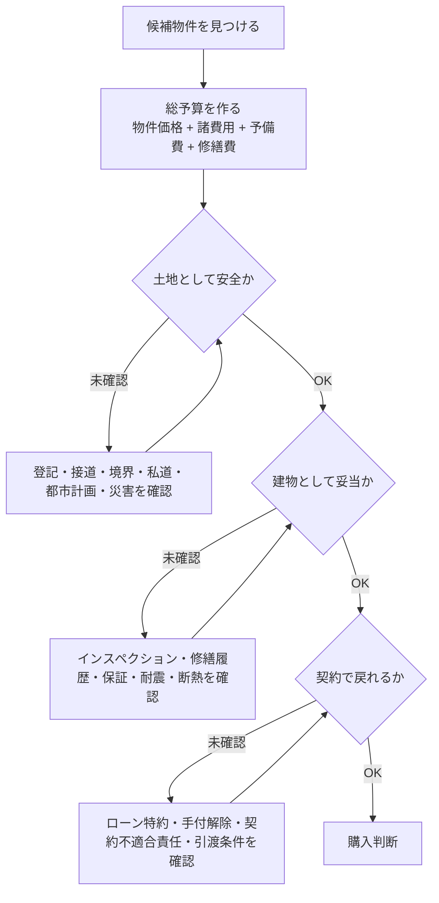
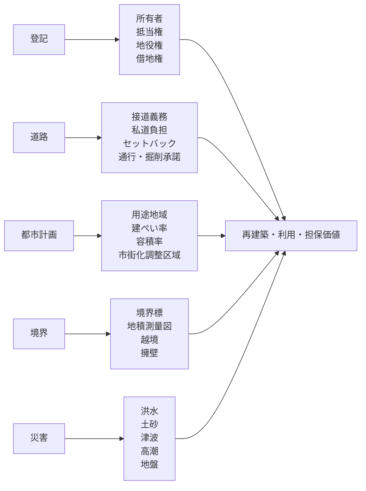

# 戸建てを購入するときの注意点

## 1. エグゼクティブサマリー

戸建て購入で失敗しやすいのは、物件価格の高低だけを見て、総支払額、土地の制約、契約解除条件、建物の劣化、災害リスク、購入後の維持費を後回しにすることにある。最初に見るべき順番は、価格ではなく「買ってよい土地か」「契約で戻れる条件があるか」「住み続ける費用に耐えられるか」である。

結論は以下である。

1. 諸費用は物件価格とは別に発生する。税金、登記、仲介手数料、ローン費用、保険、引越し、家具家電、固定資産税精算金、リフォーム・修繕費を同じ表で見る。
2. 契約前に、重要事項説明書と売買契約書を「解除条件」「手付金」「ローン特約」「契約不適合責任」「境界」「越境」「私道」「再建築可否」に分解して確認する。
3. 土地は、所有権か借地権か、登記簿上の権利、抵当権・地役権、接道義務、建ぺい率・容積率、用途地域、市街化調整区域、セットバック、境界確定の有無を見る。
4. 中古戸建ては、見た目よりも雨漏り、外壁・屋根、基礎、床傾き、シロアリ、給排水、断熱、耐震、違法増築・未登記増築が重要である。
5. 新築でも、建物性能、保証、瑕疵担保責任保険、アフターサービス、外構・網戸・カーテン・照明・エアコン・地盤改良費の範囲を確認する。
6. 周辺環境は、平日昼だけでなく、夜、雨の日、休日、通勤時間帯に見る。災害、騒音、臭気、交通、学校、病院、スーパー、ゴミ置場、隣地、将来の都市計画を確認する。
7. 戸建ては管理費・修繕積立金がない代わりに、自分で修繕積立を作る必要がある。屋根・外壁・給湯器・水回り・白蟻防除・植栽・外構の更新費を購入時から織り込む。

<SourceNote>国土交通省の住まいリテラシー教材は、購入経費、固定資産税、周辺環境、災害リスクを購入前に確認する観点として整理している。[住まいにはどんな費用がかかる？](https://www.mlit.go.jp/sumai_literacy_pf/knowledge02/0005/) と [住まいを選ぶ際にまずその街を知ろう！](https://www.mlit.go.jp/sumai_literacy_pf/knowledge02/0001/) を参照。</SourceNote>

## 2. 必要な費用の一覧

戸建て購入の資金計画は、最低でも「取得時」「ローン」「税金」「引越し・初期整備」「購入後の固定費」「修繕積立」に分ける。営業資料の「月々返済額」は、固定資産税、保険、修繕、車、教育、通勤費、光熱費上昇を含まないことが多い。

### 2.1 取得時にかかる主な費用

| 費用項目 | 発生しやすい場面 | 確認ポイント |
|---|---|---|
| 売買代金・建築請負代金 | すべて | 土地と建物の内訳、消費税対象、外構・付帯工事・地盤改良の範囲を分ける。 |
| 手付金 | 売買契約時 | 金額、解除可能期限、ローン特約との関係を確認する。 |
| 仲介手数料 | 仲介会社を介する売買 | 売主直販なら不要な場合がある。仲介なら報酬上限と消費税を確認する。 |
| 印紙税 | 売買契約書、建築請負契約書、金銭消費貸借契約書 | 電子契約か紙契約かで変わる場合がある。紙の不動産売買契約書は軽減措置の期間を確認する。 |
| 登記費用 | 所有権保存・移転、抵当権設定 | 登録免許税、司法書士報酬、住宅用家屋証明書の要否を確認する。 |
| 不動産取得税 | 取得後 | 地方税。軽減制度は自治体・住宅要件で変わる。申告要否も自治体で確認する。 |
| 固定資産税・都市計画税精算金 | 中古・建売で多い | 起算日、日割り計算、都市計画税の有無を確認する。 |
| 住宅ローン事務手数料・保証料 | ローン利用時 | 定額型、定率型、保証料外枠/内枠、繰上返済時の扱いを見る。 |
| 火災保険・地震保険 | ローン利用時・引渡し前 | 補償範囲、水災補償、免責、家財、地震保険、保険期間を確認する。 |
| 団体信用生命保険 | ローン利用時 | 金利上乗せ、保障範囲、加入できない場合の選択肢を確認する。 |
| インスペクション費用 | 中古戸建てで重要 | 建物状況調査、耐震診断、白蟻調査、設備点検の範囲を分ける。 |
| 測量・境界確定費用 | 境界未確定、古い土地、隣地越境がある場合 | 原則は売主負担か買主負担か、契約条件に入れる。 |
| リフォーム・補修費 | 中古、建売の追加工事 | 物件価格と同時に概算見積を取る。引渡し後に発注すると入居時期がずれる。 |
| 外構・カーテン・照明・エアコン・網戸・アンテナ | 新築建売・注文住宅 | 標準仕様に含まれないことが多い。 |
| 引越し・家具家電・仮住まい | すべて | 繁忙期、買替え、二重家賃、仮住まいを見込む。 |

<SourceNote>国税庁は、土地や建物の購入に関連する費用として、登録免許税、不動産取得税、印紙税、購入手数料などを取得費に含む例を示している。[土地や建物を購入するために支払った費用](https://www.keisan.nta.go.jp/r6yokuaru/ocat3/ocat32/cid1066.html) を参照。住宅購入にかかる購入経費の例は国土交通省の [住まいにはどんな費用がかかる？](https://www.mlit.go.jp/sumai_literacy_pf/knowledge02/0005/) も参照。</SourceNote>

### 2.2 税金・手数料で特に確認するもの

| 項目 | 目安・制度の見方 | 注意点 |
|---|---|---|
| 仲介手数料 | 一般に売買価格400万円超では「売買価格の3% + 6万円」に消費税を加えた速算式が使われる。 | あくまで上限計算。売主直販、代理、媒介、低廉な空き家等で扱いが変わる。 |
| 印紙税 | 不動産譲渡契約書は、記載金額が10万円を超え、平成26年4月1日から令和9年3月31日までに作成されるものに軽減措置がある。 | 1,000万円超5,000万円以下なら軽減後1万円、5,000万円超1億円以下なら軽減後3万円など。 |
| 登録免許税 | 土地売買の所有権移転、建物保存・移転、抵当権設定で発生する。 | 令和8年度税制改正大綱では、土地売買による所有権移転登記等の軽減措置を3年延長する方針が示されている。個別適用は司法書士に確認する。 |
| 不動産取得税 | 都道府県税。固定資産評価額を基礎に計算され、住宅・住宅用土地の軽減制度がある。 | 自治体により申告・軽減手続の案内が異なる。東京都では不動産取得後30日以内申告が原則だが、登記申請済みなら原則申告不要とする説明がある。 |
| 固定資産税・都市計画税 | 毎年1月1日時点の所有者に課税。住宅用地特例、新築住宅・長期優良住宅の軽減が関係する。 | 購入初年度は精算金、翌年以降は納税通知書で実額を確認する。 |
| 住宅ローン控除 | 住宅性能、居住年、所得、床面積、借入期間などで変わる。 | 令和8年度税制改正大綱では適用期限を令和12年12月31日まで延長する方向が示されている。最新の法令・国税庁案内を確認する。 |

<SourceNote>仲介手数料の上限は国土交通省の [宅地建物取引業者が宅地又は建物の売買等に関して受けることができる報酬の額](https://www.mlit.go.jp/notice/noticedata/sgml/1970/26197000/26197000.html) に基づく。印紙税の軽減は国税庁 [不動産売買契約書の印紙税の軽減措置](https://www.nta.go.jp/law/shitsugi/inshi/08/10.htm)。登録免許税は国税庁 [No.7191 登録免許税の税額表](https://www.nta.go.jp/taxes/shiraberu/taxanswer/inshi/7191.htm) と財務省 [令和8年度税制改正の大綱](https://www.mof.go.jp/tax_policy/tax_reform/outline/fy2026/08taikou_02.htm)。不動産取得税は東京都主税局 [不動産取得税Q&A](https://www.tax.metro.tokyo.lg.jp/shitsumon/real_estate/f) を参照。</SourceNote>

## 3. 契約面の注意点

契約では「買う意思」よりも「戻れる条件」と「引渡し後に誰が何を直すか」が重要である。契約日当日に初めて重要事項説明書を読むのでは遅い。事前にドラフトをもらい、疑問点をリスト化してから説明を受ける。

### 3.1 重要事項説明で見るべき項目

重要事項説明は、宅建業者から買主に対して、物件に関して知っておくべき重要な事項を説明する制度である。確認対象は、物件表示、権利関係、法令制限、道路、私道負担、上下水道・ガス・電気、手付金等の保全、契約解除、損害賠償、契約不適合責任、建物状況調査の有無などに広がる。

<SourceNote>国土交通省は、不動産取引で買主が物件について知っておくべき重要事項の説明を受けることを案内している。[不動産取引に関するお知らせ](https://www.mlit.go.jp/totikensangyo/const/1_6_bf_000013.html) を参照。既存住宅では、平成30年4月1日から既存住宅状況調査の結果概要が重要事項説明の対象となる場合がある。国土交通省 [既存住宅状況調査技術者講習制度について](https://www.mlit.go.jp/jutakukentiku/house/kisonjutakuinspection.html) を参照。</SourceNote>

### 3.2 契約条項のチェックリスト

| 条項 | 確認すること | 危険な状態 |
|---|---|---|
| 手付金 | 金額、手付解除期限、履行着手の解釈 | 手付金が大きいのに解除条件が短い、保全措置が曖昧。 |
| ローン特約 | 対象金融機関、金額、金利、期限、否認時の解除方法 | 「ローンが通らなかったら白紙解除」の条件が狭すぎる。 |
| 契約不適合責任 | 対象、期間、通知方法、免責範囲 | 中古で売主免責が広いのに建物調査をしていない。 |
| 引渡し条件 | 残置物、修補、境界標、鍵、設備表、付帯設備 | 引渡し後に「聞いていない」費用が出る。 |
| 境界・越境 | 境界確定、越境物、覚書、将来撤去 | フェンス、屋根、配管、擁壁、樹木が越境している。 |
| 私道・通行掘削承諾 | 持分、負担金、通行権、掘削承諾 | 水道・ガス工事や建替え時に承諾が取れない。 |
| 付帯設備表 | 給湯器、エアコン、食洗機、照明、シャッター等 | 「使えると思っていた設備」が保証対象外。 |
| 建築条件付き土地 | 請負契約までの期間、建築会社、解除条件 | 土地契約と建築請負が実質的に拘束される。 |

<SourceNote>宅建業者が自ら売主となる場合、手付の額の制限、手付解除、手付金等の保全措置が問題になる。国土交通省 [不動産取引に関するお知らせ](https://www.mlit.go.jp/totikensangyo/const/1_6_bf_000013.html) と [宅地建物取引業法の解釈・運用の考え方](https://www.mlit.go.jp/totikensangyo/const/1_6_bt_000268.html) を参照。クーリング・オフは不動産一般に常に使える制度ではなく、宅建業者自ら売主など適用場面が限定される。</SourceNote>

## 4. 土地の権利・法規の注意点

戸建ての本質的なリスクは建物より土地に残りやすい。建物は直せるが、接道、用途地域、災害、私道、境界、借地権、地役権、再建築不可は後から直しにくい。

### 4.1 登記で見ること

登記事項証明書は、土地・建物ごとに表題部と権利部を確認する。表題部では所在、地番、地目、地積、建物の種類・構造・床面積を見る。権利部の甲区では所有者、所有権移転、差押え、仮登記などを見る。乙区では抵当権、地上権、地役権など所有権以外の権利を見る。

<SourceNote>法務局の資料は、登記記録が土地・建物ごとに表題部と権利部に分かれ、甲区に所有権、乙区に抵当権・地上権・地役権などが記録されると説明している。[登記事項証明書と登記簿謄抄本とは，どう違うのですか？](https://houmukyoku.moj.go.jp/homu/content/000130939.pdf) を参照。登記事項証明書や地図・図面証明書の取得方法は法務局 [登記事項証明書（土地・建物）、地図・図面証明書を取得したい方](https://houmukyoku.moj.go.jp/homu/shomeisho_000001.html)。</SourceNote>

### 4.2 所有権・借地権・私道

土地の権利は、所有権なら単純というわけではない。共有、私道持分、通行地役権、借地権、底地、古い抵当権、仮登記、差押え、相続登記未了があると、売買やローン、建替えに影響する。

| 論点 | 確認事項 |
|---|---|
| 所有権 | 売主が登記上の所有者か、共有者全員が売却に同意しているか。 |
| 借地権 | 地代、更新料、譲渡承諾、建替承諾、融資可否、契約期間を確認する。 |
| 私道持分 | 持分の有無、負担金、通行権、掘削承諾、舗装・排水管理を確認する。 |
| 地役権 | 通行、送電、排水など他人の土地利用権が設定されていないか。 |
| 境界 | 境界標、地積測量図、隣地確認書、越境覚書を確認する。 |

### 4.3 接道・再建築可否

都市計画区域内では、建築物の敷地は原則として建築基準法上の道路に2m以上接する必要がある。前面道路が狭い場合、セットバックで敷地の有効面積が減ることがある。旗竿地、私道、2項道路、位置指定道路、建築基準法上の道路でない通路は、再建築可否と住宅ローン評価に直結する。

<SourceNote>国土交通省資料は、接道義務について「原則として4m以上の幅員の道路に2m以上接していなければならない」と整理している。[建築基準法（集団規定）参考資料](https://www.mlit.go.jp/jutakukentiku/house/content/001854167.pdf) と [接道規制のあり方について](https://www.mlit.go.jp/jutakukentiku/house/content/001894185.pdf) を参照。</SourceNote>

### 4.4 都市計画・用途地域・市街化調整区域

用途地域、建ぺい率、容積率、高さ制限、防火地域、地区計画、景観条例は、将来の増改築や建替えに影響する。市街化調整区域は、市街化を抑制すべき区域であり、原則として開発行為が制限される。安い土地ほど、建て替え・増築・用途変更・住宅ローン・売却時の制約が大きい可能性がある。

<SourceNote>国土交通省近畿地方整備局は、市街化調整区域を「市街化を抑制すべき区域」とし、原則として開発行為が禁止されると説明している。[区域区分](https://www-2.kkr.mlit.go.jp/kensei/town/tosi/02sigaika.html)。開発許可制度は国土交通省 [開発許可制度の概要](https://www.mlit.go.jp/toshi/city_plan/toshi_city_plan_fr_000046.html) を参照。</SourceNote>

## 5. 建物の注意点

### 5.1 新築建売・注文住宅

新築は「新しいから安心」ではなく、契約範囲と保証範囲が重要である。建売では、外構、網戸、カーテンレール、照明、エアコン、テレビアンテナ、食洗機、宅配ボックス、地盤保証、長期優良住宅・性能評価の有無が価格に含まれているかを見る。注文住宅では、地盤改良、給排水引込、造成、外構、設計変更、確認申請、上下水道加入金、仮設工事、残土処分、カーテン・照明・空調を別枠で確認する。

新築住宅を供給する建設業者・宅建業者は、構造耐力上主要な部分と雨水の浸入を防止する部分について10年間の瑕疵担保責任を負う。この責任を確実に履行するため、供託または保険加入による資力確保措置が義務付けられている。

<SourceNote>国土交通省の住まいの安心総合支援サイトは、新築住宅の売主・請負人が主要構造部等について10年間の瑕疵担保責任を負い、住宅瑕疵担保履行法が供託または保険加入を義務付けていると説明している。[新築住宅に関する法制度](https://www.mlit.go.jp/jutakukentiku/jutaku-kentiku.files/kashitanpocorner/consumer/newly_house.html) と [住宅瑕疵担保責任保険について](https://www.mlit.go.jp/jutakukentiku/jutaku-kentiku.files/kashitanpocorner/consumer/newly_house_warranty_insurance.html) を参照。</SourceNote>

### 5.2 中古戸建て

中古戸建ては、価格交渉よりも「買ってからいくらかかるか」を先に見る。築年数、構造、増改築履歴、検査済証、確認済証、図面、修繕履歴、雨漏り履歴、白蟻防除履歴、耐震診断、断熱性能、給排水管、外壁・屋根、基礎、床傾き、擁壁、浄化槽・井戸・プロパンなどを確認する。

| 部位 | 見ること | 典型的なリスク |
|---|---|---|
| 屋根・外壁 | 塗装、シーリング、ひび、浮き、雨樋、屋根材 | 雨漏り、下地腐朽、足場込みで高額修繕。 |
| 基礎・地盤 | ひび、不同沈下、床傾き、擁壁 | 構造補修、地盤問題、隣地との責任問題。 |
| 水回り | キッチン、浴室、洗面、トイレ、給排水管 | 入居直後の交換、漏水、腐食。 |
| 給湯器・設備 | 製造年、保証、動作 | 急な故障、納期遅延、冬場の生活影響。 |
| 白蟻・腐朽 | 床下、浴室周辺、玄関、外周木部 | 構造材への被害、駆除・補修費。 |
| 増改築 | 建築確認、登記、容積率・建ぺい率 | 違法増築、未登記、住宅ローン評価低下。 |
| 断熱・窓 | 窓種、断熱材、結露、カビ | 光熱費、健康、リフォーム費。 |

<SourceNote>国土交通省は既存住宅状況調査制度を通じて、専門家による建物状況調査と既存住宅売買瑕疵保険の活用を促進している。[既存住宅状況調査技術者講習制度について](https://www.mlit.go.jp/jutakukentiku/house/kisonjutakuinspection.html)。住まいるダイヤルは、戸建住宅の不具合相談でひび割れ、雨漏り、性能不足が多いこと、約46%が築後3年未満の相談であることを紹介している。[住宅トラブルのQ&A](https://www.chord.or.jp/planning/q_a.html) を参照。</SourceNote>

### 5.3 省エネ・長期優良住宅

2025年4月以降に着工する住宅などは、省エネ基準への適合が義務化されている。今後は2030年までにZEH/ZEB水準への引き上げが予定されており、断熱性能と設備効率は、快適性だけでなく、将来の資産価値、光熱費、リフォーム難易度にも影響する。長期優良住宅は、維持保全計画に基づいて適切に維持保全する義務がある。

<SourceNote>国土交通省は、2025年4月以降に着工する住宅などに省エネ基準適合が義務化されていると説明している。[省エネ基準引き上げへ。脱炭素化も。](https://www.mlit.go.jp/shoene-jutaku/) を参照。長期優良住宅の維持保全義務は国土交通省 [長期優良住宅のページ](https://www.mlit.go.jp/jutakukentiku/house/jutakukentiku_house_tk4_000006.html) を参照。</SourceNote>

## 6. 管理維持費・購入後コスト

戸建てはマンションのような管理費・修繕積立金がない代わりに、所有者が自分で積み立て、発注し、記録を残す必要がある。修繕を先送りすると、外壁の塗装不足が雨漏りや構造材の腐朽に進み、結果的に高くつく。

### 6.1 購入後に毎年・定期的にかかる費用

| 項目 | 発生頻度 | 注意点 |
|---|---|---|
| 住宅ローン返済 | 毎月 | 変動金利なら金利上昇時の返済額を試算する。 |
| 固定資産税・都市計画税 | 毎年 | 新築軽減終了後の税額上昇を見込む。 |
| 火災保険・地震保険 | 数年ごと更新 | 水災、地震、家財、個人賠償、免責を確認する。 |
| 修繕積立 | 毎月自分で積立 | 月2万から5万円など、築年数・仕様に応じて別口座で積む。 |
| 白蟻防除・点検 | 5年程度を目安に検討 | 地域、工法、薬剤、保証で変わる。 |
| 外壁・屋根 | 10から15年程度で点検・補修検討 | 足場費込みで高額になりやすい。 |
| 給湯器・設備 | 10から15年程度で交換検討 | 故障時に生活影響が大きい。 |
| 水回り | 15から25年程度で更新検討 | 浴室・キッチン・トイレ・洗面の更新費を見込む。 |
| 庭木・外構 | 随時 | 剪定、越境、フェンス、駐車場、排水、雪対策。 |
| 自治会・町内会 | 地域による | ゴミ当番、防災、祭礼、清掃、会費を確認する。 |

<SourceNote>国土交通省の住まいリテラシー教材は、戸建て持家では自分で維持管理・更新のお金を貯める必要があると説明している。[住宅は若返る？ 長く、快適に住まいを保つ](https://www.mlit.go.jp/sumai_literacy_pf/knowledge03/0001/) を参照。部位別のリフォーム費用例は国土交通省資料 [部位別リフォーム費用一覧](https://www.mlit.go.jp/common/001023470.pdf) が参考になる。</SourceNote>

### 6.2 維持費の実務ルール

購入前に、少なくとも次の3つを作る。

1. **10年修繕表**: 入居後10年間に交換・補修しそうな部位と概算費用。
2. **30年大規模修繕表**: 屋根、外壁、防水、水回り、配管、断熱、耐震、外構を含む。
3. **住宅履歴ファイル**: 図面、確認済証、検査済証、保証書、点検記録、工事写真、見積書、領収書、保険証券を保存する。

## 7. 周辺環境の注意点

周辺環境は、内見時の印象ではなく、時間帯・天候・曜日を変えて確認する。特に戸建ては、近隣、道路、ゴミ、騒音、臭気、排水、日当たり、学校区、災害、将来計画の影響を強く受ける。

### 7.1 見に行くタイミング

| タイミング | 見ること |
|---|---|
| 平日朝 | 通勤・通学の交通量、駅・バス停までの実時間、ゴミ出し、保育園・学校周辺の混雑。 |
| 平日夜 | 街灯、人通り、騒音、防犯、駅からの帰路、近隣店舗の音・臭い。 |
| 休日昼 | 近隣住民の生活音、道路遊び、商業施設混雑、駐車場の出入り。 |
| 雨の日 | 道路冠水、敷地内排水、側溝、雨音、坂道、駅までの移動。 |
| 夏・冬の想定 | 日射、風通し、結露、冷暖房負荷、雪・落葉・西日。 |

### 7.2 確認すべき周辺情報

- ハザードマップ: 洪水、内水、土砂災害、津波、高潮、液状化、ため池、避難所。
- 生活利便: スーパー、病院、薬局、学校、保育園、駅、バス、役所、金融機関。
- 将来計画: 都市計画道路、再開発、区画整理、用途地域変更、近隣の空き地・駐車場。
- 騒音・臭気: 幹線道路、鉄道、工場、飲食店、学校、公園、寺社、農地、畜舎、航空ルート。
- 交通安全: 前面道路幅員、抜け道、歩道、見通し、坂、交差点、通学路。
- ゴミ・自治会: ゴミ置場、収集ルール、当番、町内会費、地域行事。
- 隣地: 窓位置、室外機、給湯器、越境樹木、擁壁、排水、空き家。

<SourceNote>国土交通省のハザードマップポータルサイトは、「重ねるハザードマップ」と「わがまちハザードマップ」で災害リスクを確認できる。[ハザードマップポータルサイト](https://shinsui-portal.mlit.go.jp/shinsuitaisaku/v/hazardmap/) と国土交通省 [ハザードマップポータルサイトのリニューアルについて](https://www.mlit.go.jp/report/press/mizukokudo04_hh_000209.html) を参照。街の情報収集項目は国土交通省 [住まいを選ぶ際にまずその街を知ろう！](https://www.mlit.go.jp/sumai_literacy_pf/knowledge02/0001/)。</SourceNote>

## 8. よくある失敗パターン

### 8.1 お金のあるある

- 物件価格だけで予算を組み、諸費用、固定資産税、保険、修繕、家具家電、引越し、外構を忘れる。
- 「月々家賃並み」の返済額だけ見て、ボーナス払い、変動金利上昇、修繕費、車維持費を見ない。
- 住宅ローン控除や補助金を前提に買ったが、性能・床面積・所得・居住時期・申請期限の要件を満たさない。
- 中古を安く買ったつもりが、入居前リフォーム、雨漏り、給湯器、水回り、外壁屋根で高くなる。

### 8.2 契約のあるある

- 重要事項説明書と契約書を当日に読み、理解しないまま押印する。
- ローン特約の期限を過ぎ、ローン否認でも手付金が戻らないリスクが出る。
- 手付解除期限を過ぎた後に迷い、違約金が発生する。
- 契約不適合責任が短い、または免責が広いのに、建物調査をしていない。
- 付帯設備表を見ず、引渡し後にエアコン、照明、給湯器、食洗機等の不具合で揉める。

### 8.3 土地・権利のあるある

- 安い理由が、再建築不可、接道不足、私道、借地権、市街化調整区域、ハザード、擁壁だった。
- 私道の掘削承諾がなく、水道・ガス・排水工事で詰まる。
- 境界未確定、越境、隣地擁壁、ブロック塀で、購入後に近隣トラブルになる。
- 古家付き土地で、解体費、アスベスト、地中埋設物、越境、滅失登記を見落とす。
- 土地面積はあるが、セットバックや斜線制限で希望の建物が建たない。

### 8.4 建物のあるある

- 新築だから大丈夫と思い、内覧会で床下、天井裏、外構勾配、排水、建具、傷を見ない。
- 中古で雨の日に見ず、雨漏り・排水・湿気・カビに気づかない。
- 検査済証や図面がなく、増改築の適法性や耐震性を判断しにくい。
- 床の傾き、基礎ひび、外壁シーリング、バルコニー防水、白蟻を軽く見る。
- 太陽光、蓄電池、エコキュート、床暖房などの設備保証・撤去費・更新費を見ていない。

### 8.5 周辺環境のあるある

- 昼の内見では静かだったが、夜や休日に騒音・臭気・交通量が増える。
- 駅徒歩表記と実際の通勤時間が違う。坂、信号、踏切、バス遅延を見ていない。
- ゴミ置場、町内会、祭礼、清掃当番、雪かき、側溝清掃を確認していない。
- 隣地の空き地に後から建物が建ち、日当たり・眺望・騒音が変わる。
- ハザードマップを見ず、浸水・土砂・高潮・液状化のリスクを後から知る。

## 9. 実務チェックリスト

### 9.1 内見前

- 物件価格とは別に、諸費用、修繕予備費、引越し、家具家電、税金、保険を入れた総予算を作ったか。
- ローン事前審査だけでなく、金利上昇・収入減・教育費・車維持費を入れたストレステストをしたか。
- 登記簿、地図、公図、地積測量図、都市計画、ハザードマップを事前に見たか。
- 価格が安い理由を、道路、権利、築年数、災害、周辺環境、売主事情に分解したか。

### 9.2 契約前

- 重要事項説明書と売買契約書のドラフトを事前にもらったか。
- ローン特約の対象金融機関、金額、期限、解除方法を確認したか。
- 手付金の金額、解除期限、保全措置を確認したか。
- 境界確定、越境、私道、掘削承諾、通行承諾の書類を確認したか。
- 中古ならインスペクション、白蟻、雨漏り、耐震、修繕履歴を確認したか。
- 新築なら瑕疵担保責任保険、住宅性能、アフターサービス、標準仕様、追加費用を確認したか。

### 9.3 引渡し前

- 残代金、登記、火災保険、地震保険、ローン実行、鍵、設備表、保証書の段取りを確認したか。
- 補修合意事項が書面化され、期限と担当者が明確か。
- メーター、設備、雨水・排水、建具、床下、天井裏、外構、境界標を確認したか。
- 引越し前にリフォーム・エアコン・カーテン・照明・ネット回線の工程を組んだか。

### 9.4 入居後

- 住宅履歴ファイルを作ったか。
- 1年目、2年目、5年目、10年目の点検予定をカレンダー化したか。
- 固定資産税、不動産取得税、住宅ローン控除、補助金の申告期限を確認したか。
- 修繕積立用の別口座を作ったか。

## 10. 推奨方針

もっとも実務的な進め方は、候補物件が出る前に「買ってはいけない条件」を決めることである。たとえば、再建築不可、境界未確定で売主が対応しない、私道掘削承諾なし、ハザード高リスクなのに対策なし、ローン特約が弱い、契約不適合責任が広く免責、修繕見積が取れない中古戸建ては、価格が魅力的でも慎重に扱う。

一方で、すべてを完璧に満たす物件は少ない。判断の軸は、「リスクを知ったうえで価格に反映できるか」「専門家確認で潰せるか」「将来売るときに説明可能か」である。戸建て購入では、値引きよりも、契約条件、境界・道路、建物調査、修繕予算の確保のほうが長期的な損失回避に効く。

## 参考情報

- 国土交通省: [住まいにはどんな費用がかかる？](https://www.mlit.go.jp/sumai_literacy_pf/knowledge02/0005/)
- 国土交通省: [住まいを選ぶ際にまずその街を知ろう！](https://www.mlit.go.jp/sumai_literacy_pf/knowledge02/0001/)
- 国土交通省: [不動産取引に関するお知らせ](https://www.mlit.go.jp/totikensangyo/const/1_6_bf_000013.html)
- 国土交通省: [宅地建物取引業法 法令改正・解釈について](https://www.mlit.go.jp/totikensangyo/const/1_6_bt_000268.html)
- 国土交通省: [既存住宅状況調査技術者講習制度について](https://www.mlit.go.jp/jutakukentiku/house/kisonjutakuinspection.html)
- 国土交通省: [住宅瑕疵担保履行法 新築住宅に関する法制度](https://www.mlit.go.jp/jutakukentiku/jutaku-kentiku.files/kashitanpocorner/consumer/newly_house.html)
- 国土交通省: [省エネ基準引き上げへ。脱炭素化も。](https://www.mlit.go.jp/shoene-jutaku/)
- 国土交通省: [ハザードマップポータルサイト](https://shinsui-portal.mlit.go.jp/shinsuitaisaku/v/hazardmap/)
- 法務局: [登記事項証明書と登記簿謄抄本とは，どう違うのですか？](https://houmukyoku.moj.go.jp/homu/content/000130939.pdf)
- 法務局: [登記事項証明書、地図・図面証明書を取得したい方](https://houmukyoku.moj.go.jp/homu/shomeisho_000001.html)
- 国税庁: [不動産売買契約書の印紙税の軽減措置](https://www.nta.go.jp/law/shitsugi/inshi/08/10.htm)
- 国税庁: [No.7191 登録免許税の税額表](https://www.nta.go.jp/taxes/shiraberu/taxanswer/inshi/7191.htm)
- 財務省: [令和8年度税制改正の大綱](https://www.mof.go.jp/tax_policy/tax_reform/outline/fy2026/08taikou_01.htm)
- 東京都主税局: [不動産取得税Q&A](https://www.tax.metro.tokyo.lg.jp/shitsumon/real_estate/f)
- 住宅紛争処理支援センター: [住宅トラブルのQ&A](https://www.chord.or.jp/planning/q_a.html)
- 住宅紛争処理支援センター: [住宅相談統計年報2025](https://www.chord.or.jp/assets/NP2025_web..pdf)
