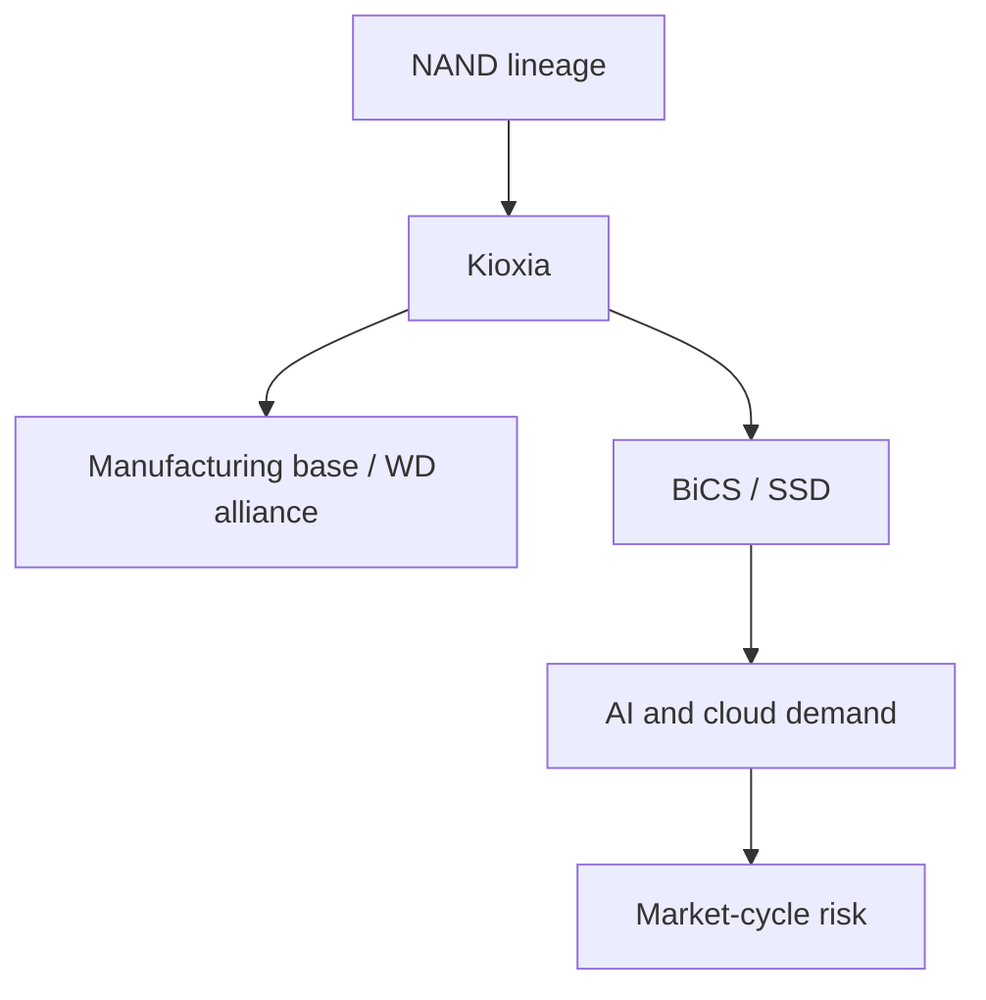
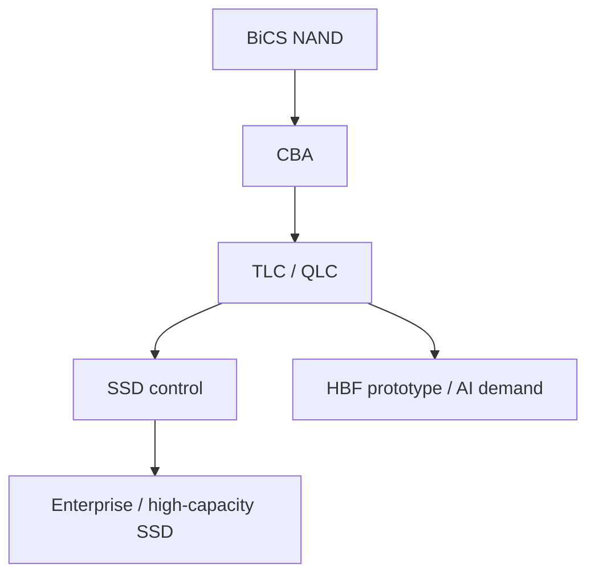

# Actual picture of KIOXIA's rapid increase in net profit

## 1. Executive Summary

Kioxia is a semiconductor memory company that has its roots in Toshiba Memory and almost exclusively specializes in NAND flash. This is a continuation of Toshiba's invention of NAND flash in 1987 and the release of 3D flash memory technology BiCS FLASH in 2007. The current business is centered on flash for smartphones/PCs, SSDs for businesses/clouds, and high-capacity SSDs for data centers/AI.
Source note: NAND invention in 1987, 3D flash technology in 2007, independence from Toshiba Group in 2018, rebranding to Kioxia in 2019, TSE Prime listing in December 2024 based on [Kioxia Integrated Report 2025](https://www.kioxia-holdings.com/content/dam/kioxia-hd/en-jp/ir/library/integrated-report/2025/asset/Integrated-Report-2025-all-print-en.pdf) around p.7-8 and [KIOXIA at a Glance](https://www.kioxia-holdings.com/en-jp/about/glance.html).
The conclusions of this report are as follows.

1. KIOXIA's strengths lie in its accumulated technology as a NAND inventor, large-scale production in Yokkaichi/Kitakami, long-term JV with Western Digital/SanDisk, and BiCS FLASH/CBA/QLC high-capacity SSDs.
2. The consolidated financial results for the fiscal year ending March 2026 were revenue of 2,337.7 billion yen, operating profit of 870.4 billion yen, and profit attributable to owners of the parent company of 554.5 billion yen. This is a significant increase compared to the previous year, but on a consolidated basis it is not 48 times, but approximately 2 times.
3. The biggest reason why it looks abnormal is that KIOXIA Holdings' standalone net profit jumped to 90.75 billion yen, but this is mainly due to holding company factors due to dividends received from affiliates and capital returns, and must be read separately from the profit of the manufacturing business itself.
4. Technology strategy is expanding from "state-of-the-art NAND alone" to "storage tiers in the AI ​​era." The 245.76TB NVMe SSD, 8th generation BiCS FLASH, and 5TB/64GB/s high-bandwidth flash module prototype is a move that takes into account the data supply around the GPU, RAG/vector DB, learning data lake, and edge AI.
5. The company's business consists mostly of a single memory segment, with sales divided into SSD & Storage, Smart Devices, and Other. Public information indicates Apple Group, Sandisk Group, and Dell Group as major customers, but the number of data centers and sales by data center are not disclosed.
6. In terms of Japan's semiconductor policy, Kioxia has a different meaning from a logic revival like Rapidus. It is a company that maintains reliable domestic memory supply capacity, and has high economic security value. However, NAND is a separate market from DRAM/HBM, and will not be affected by the AI ​​semiconductor boom at the same rate.

### 1.1 Validation Matrix

| Points of discussion                                                                      | Verification status | Evidence                                                                                | Notes on reading                                                                                                                                        |
| ----------------------------------------------------------------------------------------- | ------------------- | --------------------------------------------------------------------------------------- | ------------------------------------------------------------------------------------------------------------------------------------------------------- | --- | --------------------------------------------- | ------------- | ----------------------------------------------------- | -------------------------------------------------------------------------------------------- |
| Consolidated net income for the fiscal year ending March 2026 increased significantly     | Confirmed           | Summary of financial results for the fiscal year ending March 2026                      | On a consolidated basis, it is approximately double compared to the previous year, which is a different number from "48 times"                          |
| The factor that appears to be "48 times" is the rapid increase in non-consolidated profit | Confirmed           | Notes to individual financial statements in the same financial statement                | Holding company factors, including dividends and capital returns from affiliates, are different from the operating profit of the manufacturing business |
| AI data center demand is a tailwind                                                       | Mostly confirmed    | Financial results briefing, integrated report, CM9/LC9 product announcement, TrendForce | Not direct AI calculation demand like GPU/HBM, but peripheral demand for data storage, search, and inference                                            |
| KIOXIA is a company focused on NAND/SSD                                                   | Confirmed           | Annual Securities Report FY2024, KIOXIA at a Glance                                     | Read as a single Memory segment rather than a "comprehensive semiconductor manufacturer"                                                                |     | Sales by data center and sales by major cloud | Not disclosed | No data falls within the scope of official disclosure | Even when using external estimates, it is necessary to separate them from company disclosure |

This table is important because there are three types of numbers that can be easily confused when evaluating Kioxia. The first is the profitability of the consolidated manufacturing business, the second is the holding company's profit from dividends and capital returns, and the third is the NAND market share and vendor sales estimated by an external market research company. If we combine these into a single phrase, "how many times the net income is," we confuse the actual performance of the business with the way it looks in accounting terms.

## 2. Company positioning

Kioxia's company name is a combination of the Japanese word for "memory" and the Greek word for "value", Axia. The former Toshiba Memory became independent from Toshiba Group in 2018 and transitioned to the Kioxia brand in October 2019. The company will be listed on the Tokyo Stock Exchange Prime Market on December 18, 2024, with the stock code 285A.
Source note: The origin of the company name is [About KIOXIA Group](https://www.kioxia-holdings.com/en-jp/about.html). TSE Prime listing is based on Kioxia's official announcements [Kioxia Holdings Lists on the Tokyo Stock Exchange Prime Market](https://www.kioxia-holdings.com/en-jp/news/2024/20241218-1.html) and [JPX initial listing outline](https://www.jpx.co.jp/english/listing/stocks/new/dh3otn000000libx-att/12KioxiaHoldings-OutlinetEN.pdf). JPX materials indicate the scheduled listing date as 2024-12-18, Prime Market, stock code 285A.
The core of the business is the single Memory segment. Revenue in FY2024 was 1,706.4 billion yen, and by application, SSD & Storage was 991.1 billion yen, Smart Devices was 501.1 billion yen, and Other was 214.2 billion yen. By external customer, Apple Group, Sandisk Group, and Dell Group are disclosed as major customers. This shows that Kioxia is not a "general purpose semiconductor maker" but a company deeply focused on NAND and SSD.
Source note: Single segment, FY2024 sales by application, major customers are around [Annual Securities Report FY2024](https://www.kioxia-holdings.com/content/dam/kioxia-hd/en-jp/ir/library/securities/asset/Annual-Securities-Report-FY2024-EN.pdf) p.19-22. KIOXIA at a Glance's FY2024 consolidated revenue is 1,706.5 billion yen.
The structure remained the same for the full year ending March 2026, with sales by application of 1,362.6 billion yen for SSD & Storage, 760 billion yen for Smart Devices, and 215 billion yen for Other. The majority of sales come from SSD & Storage, and we can see that the company's performance is driven by a portfolio that includes SSDs for enterprises and memory products for mobile devices, rather than pure NAND chips alone.
Source note: Sales by application for the full year ending March 2026 are based on the sales disclosure by application in [2026年3月期 決算短信](https://finance-frontend-pc-dist.west.edge.storage.yahoo.jp/disclosure/20260515/20260515537987.pdf).
After going public, Toshiba, the former parent company, and Pangea, which is affiliated with Bain Capital, will largely remain in the shareholder structure. Major shareholders as of September 30, 2025 are disclosed as Toshiba Corporation 27.25%, BCPE Pangea Cayman, L.P. 22.00%, and BCPE Pangea Cayman2, Ltd. 14.34%. This means that even after Kioxia becomes a public company, it will have a capital structure that retains the effects of Toshiba's restructuring and Bain-led acquisition.
Source note: Major shareholders are disclosed as of 2025-09-30 on [Kioxia Stock Information](https://www.kioxia-holdings.com/en-jp/ir/stock/outline.html). The 2017 Bain/Pangea acquisition structure and the involvement of SK hynix and Apple/Dell/Kingston/Seagate are based on [Toshiba 2017 press release PDF](https://www.kioxia.com/content/dam/kioxia/shared/about/news/2017/asset/20170928_1.pdf).

## 3. Technology: From NAND to AI storage

Kioxia's technological focus has shifted from the era of miniaturizing NAND flash only in the plane direction to 3D stacking, multi-bit per cell, CBA, controller/firmware, and SSD system design. 8th generation BiCS FLASH adopts 218 world-lines, CBA, OPS and claims a memory density of 18.3Gb/mm2 in 1Tb TLC products. CBA is an idea in which the CMOS control circuit and memory array are optimized on separate wafers and then bonded together, with the aim of simultaneously boosting performance, density, and power efficiency.
Source note: 8th generation BiCS FLASH's 218 world-lines, CBA, OPS, 1Tb TLC 18.3Gb/mm2 is [Kioxia R&D: Overview of new technologies applied to BiCS FLASH generation 8](https://www.kioxia.com/en-jp/rd/technology/topics/topics-66.html). This page is a technical explanation based on the presentation at IEDM 2023.
I see two product directions for AI data centers. The first is to improve the performance of enterprise SSDs. The CM9 Series is a PCIe 5.0 NVMe SSD that uses 8th generation BiCS FLASH TLC and CBA, and claims performance improvements of up to 65% for random writes, 55% for random reads, and 95% for sequential writes compared to the previous generation CM7. The second is higher capacity. The LC9 Series expands from 122.88TB to 245.76TB and uses a 2Tb QLC die and 32-die stack to appeal to datasets, RAGs, vector DBs, and data lakes in generative AI environments.
Source note: CM9 Series specifications and performance improvements are [Kioxia CM9 announcement, 2025-05-16](https://www.kioxia.com/en-jp/business/news/2025/20250516-1.html). LC9 Series 245.76TB, 32-die stack, 2Tb QLC, generation AI/RAG use is [Kioxia LC9 245.76TB announcement, 2025-07-22](https://apac.kioxia.com/en-apac/business/news/2025/20250722-1.html).
Furthermore, as part of our research and development efforts, we are prototyping a high-bandwidth flash memory module with a capacity of 5TB, a bandwidth of 64GB/s, and less than 40W. Although this is not a direct replacement for DRAM/HBM, it is an attempt to reduce the trade-off between capacity and bandwidth from the flash side. It is also connected to the concept of handling large-scale AI models on the edge/MEC side.
Source note: Less than 5TB/64GB/s/40W, PCIe 6.0, 128Gbps PAM4, NEDO commissioned project is [Kioxia high-bandwidth flash memory module announcement, 2025-08-20](https://www.kioxia.com/en-jp/about/news/2025/20250820-1.html).

## 4. Supply and demand and performance

The NAND market is more susceptible to price cycles than DRAM and HBM. During the downturn in 2022-2023, the entire industry was forced to adjust inventories and reduce production. In the fiscal year ending March 2026, Kioxia's business performance returned significantly due to recovery in data centers/enterprise SSDs, demand for data storage due to AI generation, and improvement in demand for smart devices.
Source note: Recovery in FY2024, decline in 2022-2023, contribution of generated AI and data center/enterprise SSD is around [Kioxia Integrated Report 2025](https://www.kioxia-holdings.com/content/dam/kioxia-hd/en-jp/ir/library/integrated-report/2025/asset/Integrated-Report-2025-all-print-en.pdf) p.8. The full-year results for the fiscal year ending March 2026 are based on [2026年3月期 決算短信](https://ssl4.eir-parts.net/doc/285A/tdnet/2815552/00.pdf).
For the full year ending March 2026, sales revenue was 2,337.7 billion yen, operating profit was 870.4 billion yen, and profit attributable to owners of the parent company was 554.5 billion yen. Compared to the previous year, sales increased by 37.0%, operating income increased by 92.7%, and net income increased by 103.6%. In Q4, sales revenue grew to 1.029 trillion yen, operating profit was 596.8 billion yen, and quarterly profit was 407.7 billion yen, strongly reflecting the recent improvement in supply and demand and price increases.
Source memo: Full-year sales revenue of 2,337,649 million yen, operating profit of 870,369 million yen, profit attributable to owners of the parent company of 554,490 million yen, Q4 non-consolidated sales revenue of 1,002,873 million yen, operating profit of 596,795 million yen, and quarterly profit of 407,730 million yen for the full year ending March 2026 are around [2026年3月期 決算短信](https://ssl4.eir-parts.net/doc/285A/tdnet/2815552/00.pdf) p.12-14. The difference between non-GAAP operating income of 876,170 million yen and non-GAAP net income of 559,638 million yen is small, and the increase was not caused by one-time accounting gains.
The company cites a rise in average selling prices and an increase in sales volume as factors contributing to the increase in operating income. This can be interpreted as a result of the simultaneous normalization of demand for AI servers, data centers, and smart devices.
Source note: "Increase in average selling price and increase in sales volume" is stated in the business results overview for [2026年3月期 決算短信](https://ssl4.eir-parts.net/doc/285A/tdnet/2815552/00.pdf). This is an explanation provided by the company, and a detailed breakdown of the demand structure is not disclosed.
External market data also confirms that NAND will recover in the second half of 2025. TrendForce reported that the total sales of the top five NAND companies in the second quarter of 2025 increased by 22% from the previous quarter to $14.67 billion, and Kioxia ranked third at $2.14 billion, an increase of 11.4% from the previous quarter. While Samsung and SK Group are seeing notable growth in enterprise SSD/AI server demand, Kioxia is also benefiting from AI server demand and normalization of inventories among PC/smartphone customers.
Source note: 2025 2Q NAND market, Kioxia sales of $2.14 billion, 11.4% increase from the previous quarter, [TrendForce, 2025-08-28](https://www.trendforce.com/presscenter/news/20250828-12688.html) ranked third. This is an estimate by a market research company, and the scope of the calculation may differ from the company's financial results.

### 4.1 Why it looks 48 times bigger

If you get the impression that "48 times net income", the first thing to check is the distinction between consolidated and non-consolidated. Although the consolidated profit increased to 554.5 billion yen, KIOXIA Holdings' standalone net profit for the year was 90.75 billion yen, a significant increase from 500 million yen the previous year. As specified by the company, this increase in non-consolidated profit was mainly due to holding company factors due to the receipt of dividends received from affiliates and capital return.
Source note: Non-consolidated net income of 90.75 billion yen and the factors that increased it are listed around [2026年3月期 決算短信](https://ssl4.eir-parts.net/doc/285A/tdnet/2815552/00.pdf) p.15. This is a holding company revenue recognition rather than a direct profit of the manufacturing business.
In other words, the "surprising" part about KIOXIA is that, in addition to its large operating income as a manufacturing company, when the financial income of the holding company alone is mixed in, the apparent multiple increases even further. In a report, consolidated operating income, consolidated net income, and non-consolidated net income should be read separately.

### 4.2 Read consolidated, non-consolidated, and market data separately

| Types of numbers                                    | What they represent                                                                | How to use them in Kioxia evaluation                                                  | Points that are easy to misread                                                                                           |
| --------------------------------------------------- | ---------------------------------------------------------------------------------- | ------------------------------------------------------------------------------------- | ------------------------------------------------------------------------------------------------------------------------- |
| Consolidated revenue/consolidated operating profit  | Business revenue of the entire group, centered on the NAND/SSD business            | Looking at the resilience of the business itself, market improvement, and product mix | Overestimating the business growth rate when mixed with the non-consolidated profit multiple                              |
| Profit attributable to owners of the parent company | Consolidated final profit including financial expenses, taxes, equity method, etc. | See the level of profit attributable to shareholders                                  | As it is driven by factors lower than operating profit, it cannot be explained by market conditions alone                 |
| KIOXIA Holdings' standalone profit                  | Dividend income, capital return, etc. of the holding company standalone            | Verifying the apparent multiple of "48x"                                              | It is different from the sales force of a manufacturing subsidiary                                                        |
| Estimating vendor sales such as TrendForce          | Ranking within the NAND market and sales by vendor                                 | Used for competitive position, share changes, and comparisons with other companies    | Company classification, accounting period, exchange rate, and estimation method do not match company financial statements |

Therefore, in this report, we use the expression "KIOXIA grew due to AI demand" to limit the scope of operating income, average selling price, sales volume, and enterprise SSD demand. Sales by data center, sales by cloud customer, and gross profit only for AI applications are not disclosed, so making a definitive statement would be a guess beyond the publicly available materials.

## 5. Production base and partnerships

KIOXIA's manufacturing base will be consolidated at the Yokkaichi Plant in Mie Prefecture and the Kitakami Plant in Iwate Prefecture. The Yokkaichi factory is one of the world's largest flash memory manufacturing bases, and at the Kitakami factory, Fab 1 began operations in 2020 and Fab 2 in September 2025. Both locations are closely tied to a joint venture with Western Digital/SanDisk.
Source memo: The scale of the Yokkaichi factory is [KIOXIA at a Glance](https://www.kioxia-holdings.com/en-jp/about/glance.html). The operation period of Kitakami Fab1/Fab2 is [Kitakami Plant](https://www.kioxia.com/en-jp/about/kitakami.html). Decision-making rights equivalent to those of the joint venture with SanDisk are described near [Annual Securities Report FY2024](https://www.kioxia-holdings.com/content/dam/kioxia-hd/en-jp/ir/library/securities/asset/Annual-Securities-Report-FY2024-EN.pdf) p.74.
While this JV provides Kioxia with scale and diversification of its capital investment burden, it also limits its strategic freedom. Western Digital's flash business has been spun off as SanDisk, and its JV with Kioxia continues to be a focus of NAND industry restructuring. Previous integration negotiations with Western Digital did not materialize, but the manufacturing and development relationship continues.
Source note: JV facility received approval for Japanese government subsidy of up to 150 billion yen in 2024. The target is Yokkaichi/Kitakami's latest 3D flash and future generation nodes, with Kioxia and Western Digital highlighting a joint venture of more than 20 years. See [Kioxia and Western Digital JV subsidy announcement, 2024-02-06](https://www.kioxia.com/en-jp/about/news/2024/20240206-1.html).
The Japanese government's subsidies are not just a form of corporate support, but a policy to maintain a reliable supply of memory domestically. Being able to mass-produce the storage necessary for AI/Cloud/Autonomous Driving/5G domestically will become a pillar of economic security different from logic semiconductors and HBM. However, policy support cannot eliminate market cycles. If demand is misjudged, prices fall, and utilization rates decline, profitability will deteriorate even with subsidized equipment.

## 6. Risks and limitations

The first risk is market cycles. NAND is highly commodity-like, and when there is an oversupply, the price will plummet. Even if Kioxia focuses on high-capacity SSDs and AI applications, margins will shrink if bit supply becomes excessive. This cyclical nature is well illustrated by the strong performance in Q4 of the fiscal year ending March 31, 2026, as well as the simultaneous decline in profits in the first half.
The second risk is competition. Samsung, SK hynix/Solidigm, Micron, SanDisk, and YMTC compete on tiers, QLC, enterprise SSDs, controllers, and customer contracts. TrendForce placed Samsung in first place, SK Group in second place, and Kioxia in third place in the second quarter of 2025. In particular, SK Group is said to have grown due to Solidigm's enterprise SSD and 321L NAND mass production, and competition for AI servers/data centers is fierce.
Source note: 2025 2Q rankings and growth factors for Samsung, SK Group, Kioxia, Micron, and SanDisk are [TrendForce, 2025-08-28](https://www.trendforce.com/presscenter/news/20250828-12688.html).
The third risk is financial leverage and financing constraints. As of the end of December 2025, total assets are 3,194.8 billion yen, total liabilities are 2,216.2 billion yen, and total capital is 978.6 billion yen. The Q3 financial results report discloses financial covenants such as senior facility, revolving credit facility, consolidated leverage ratio, and consolidated debt-equity ratio. The memory business requires heavy capital investment, and competitiveness is directly linked to access to capital markets and bank loans.
Source note: Financial status, borrowings, and financial covenants are around [JPX TDnet: 2026年3月期 第3四半期決算短信](https://www2.jpx.co.jp/disc/285A0/140120260212556330.pdf) p.11, p.19-21.
The fourth risk is customer concentration and product mix. Apple, Sandisk, and Dell are disclosed as major customers in FY2024. The more you move toward high-capacity enterprise SSDs, the more important long-term contracts with large cloud, server OEM, and storage platform providers become. When demand is strong, this leads to stable sales, but price negotiation power and specification requirements become stricter.
The fifth limit is the distance from the AI ​​boom. Kioxia will benefit from AI data centers, but it won't dominate AI compute demands as directly as NVIDIA GPUs or HBM. NAND receives demand for training data, checkpoints, RAGs, logs, vector DBs, inference peripheral data, and HDD replacement. Even if demand for AI grows, the profit effect will vary depending on price increases, customer inventory adjustments, and selection of HDD/SSD/Tape/CXL/DRAM tiers.

## 7. Practical perspective

When evaluating KIOXIA, rather than looking at whether it is an AI stock as a semiconductor stock, you should look at where it is in the NAND supply and demand cycle, how much progress it will make in improving its mix of enterprise SSDs, and how flexible its JV and capital structure will be.
The viewpoints of practical judgment can be narrowed down to the following five points.
| Perspective | Questions to consider | Current evaluation |
| ---- | ------------------------------------ | ----------------------------------------------------------------- |
| Technology | Can BiCS/CBA/QLC survive in the generation competition? | 8th generation BiCS, CM9, LC9, HBF prototypes are positive factors |
| Demand | Will AI/cloud demand support NAND prices | Strong from the second half of 2025, but cyclicality remains |
| Earnings | Will SSD & Storage become more value-added? | Enterprise/data center will make a large contribution for the full year ending March 2026 |
| Finances | Can we withstand capital investment and borrowings? Improving with the recovery of profits, but debt and financial covenants are important |
| Policy | Will the strategic value of Japan's domestic memory supply continue? | Subsidies and domestic bases are significant, but they are not a substitute for market risk |
Inferring from publicly available information, Kioxia's future focus will shift from simply competing in the number of NAND layers to "which workloads will be handled by its own SSD/flash module" in the storage tier of AI infrastructure. Ultra-high capacity QLC SSDs like LC9 are suitable for HDD replacement, data lakes, RAGs, checkpoints, and AI logs. High-performance TLC SSDs like the CM9 are suitable for enterprise/cloud applications that require low latency and high IOPS. Although the HBF prototype is still in the research and development stage, it is an important move to fill the gap in capacity/bandwidth between DRAM and SSD.

## 8. Recommended policy

To understand technology and business, Kioxia should not be read only as a big story of "Japan's semiconductor revival." More precisely, Kioxia is a company that combines the pedigree of NAND flash invention, Toshiba's reorganization, the Bain-led acquisition, the Western Digital/SanDisk JV, the Japanese government's economic security policy, and the storage needs of AI data centers.
Whether in the context of investment, partnership, recruitment, or policy evaluation, it is best to check the following in the following order.

1. Check whether the strength in Q4 alone is temporary or continuous based on the full-year results for the fiscal year ending March 2026 and the next outlook.
2. Track the direction of enterprise/data center SSD ratio, long-term supply contracts, average selling price, and bit shipments.
3. Confirm the utilization rate of Kitakami Fab2 and Yokkaichi/Kitakami, and the contribution of mass production of subsidized equipment.
4. Compare generational roadmaps with Samsung/SK hynix/Micron/SanDisk/YMTC.
5. Do not confuse AI storage demand with GPU/HBM demand, but break it down into demand for data storage, search, reasoning, and HDD replacement.
   The current overall evaluation is that it is "an important NAND company in Japan that is meeting the demand for data storage in the AI ​​era. However, rather than a growing company, it is a company that competes in technology, capital, and production scale in the midst of an intense memory cycle." This is the closest to reality.

## Reference information

- [Kioxia Holdings Investor Relations](https://www.kioxia-holdings.com/en-jp/ir.html)
- [Kioxia Integrated Report 2025](https://www.kioxia-holdings.com/content/dam/kioxia-hd/en-jp/ir/library/integrated-report/2025/asset/Integrated-Report-2025-all-print-en.pdf)
- [2026年3月期 決算短信](https://ssl4.eir-parts.net/doc/285A/tdnet/2815552/00.pdf)
- [2026年3月期 決算短信（閲覧用PDF）](https://finance-frontend-pc-dist.west.edge.storage.yahoo.jp/disclosure/20260515/20260515537987.pdf)
- [Annual Securities Report FY2024](https://www.kioxia-holdings.com/content/dam/kioxia-hd/en-jp/ir/library/securities/asset/Annual-Securities-Report-FY2024-EN.pdf)
- [2026年3月期 第3四半期決算短信](https://www2.jpx.co.jp/disc/285A0/140120260212556330.pdf)
- [KIOXIA at a Glance](https://www.kioxia-holdings.com/en-jp/about/glance.html)
- [Kioxia Products & Technology](https://www.kioxia-holdings.com/en-jp/product-technology.html)- [BiCS FLASH generation 8 technology](https://www.kioxia.com/en-jp/rd/technology/topics/topics-66.html)
- [CM9 Series announcement](https://www.kioxia.com/en-jp/business/news/2025/20250516-1.html)
- [LC9 245.76TB announcement](https://apac.kioxia.com/en-apac/business/news/2025/20250722-1.html)
- [High-bandwidth flash module announcement](https://www.kioxia.com/en-jp/about/news/2025/20250820-1.html)
- [Kioxia and Western Digital JV subsidy announcement](https://www.kioxia.com/en-jp/about/news/2024/20240206-1.html)
- [TrendForce NAND Flash 2Q25](https://www.trendforce.com/presscenter/news/20250828-12688.html)
