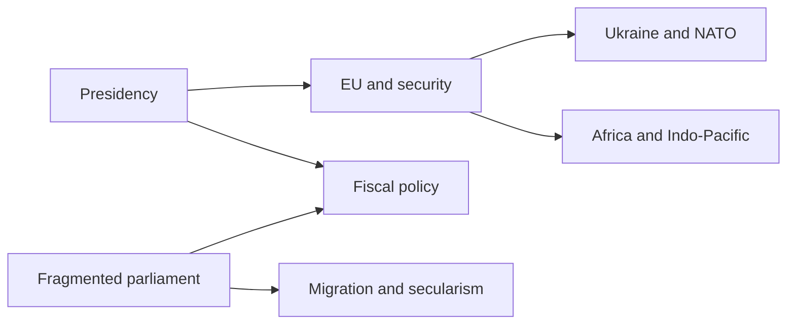
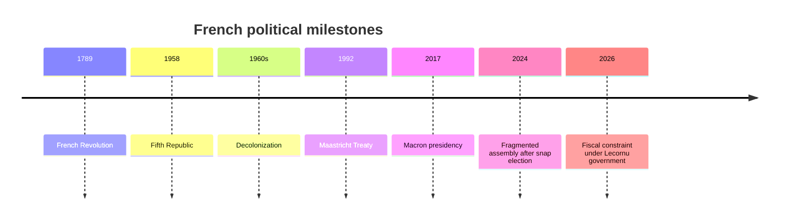

France Geopolitical Profile 2026

## 1. Executive Summary

France combines nuclear weapons, a permanent UN Security Council seat, institutional weight inside the EU, and an Indo-Pacific foothold through overseas territories. <SourceNote>[France Diplomatie, Indo-Pacific strategy](https://www.diplomatie.gouv.fr/files/files/france_s_indo-pacific_strategy_2025_cle04bb17.pdf) and [Élysée, Ukraine security guarantees](https://www.elysee.fr/en/emmanuel-macron/2026/01/06/robust-security-guarantees-for-a-solid-and-lasting-peace-in-ukraine) support this framing.</SourceNote>

Yet French politics in 2026 combines a strong presidency with a weak parliamentary majority. Under President Emmanuel Macron, Prime Minister Sébastien Lecornu runs the government, while the National Assembly is split among the National Rally, presidential groups, the left, Socialists, and conservative right. <SourceNote>[info.gouv.fr, Composition du Gouvernement](https://www.info.gouv.fr/composition-du-gouvernement) lists Lecornu as prime minister, and [Assemblée nationale, Effectif des groupes politiques](https://www2.assemblee-nationale.fr/instances/liste/groupes_politiques/effectif) shows a fragmented chamber, including National Rally 122, Ensemble 91, LFI-NFP 71, and Socialist-linked groups 68.</SourceNote>

France should not be read only as a strong state pushing European integration. At home, immigration, secularism, security, purchasing power, agriculture, pensions, and deficits create conflict lines. Abroad, EU strategic autonomy, NATO, Ukraine support, former colonial ties, and overseas territories widen the policy map.

## 2. Historical and Institutional Frame

Modern French politics rests on the 1789 Revolution, the Fifth Republic, memories of the Algerian War, European integration, nuclear deterrence, and post-colonial ties with Africa. The Fifth Republic gives the president a large voice in foreign and security policy, but budgets, migration, welfare, agriculture, and local administration remain constrained by parliament and social protest.

This system amplifies the president's voice during crises, while ordinary politics keeps searching for a workable majority. The presidential election indicates national direction; the National Assembly narrows that direction through annual budgets and laws.

## 3. Power Map

The National Rally is a major opposition force linking immigration, security, purchasing power, and local alienation. The left links living costs, public services, climate, anti-discrimination, and youth frustration. The center and presidential camp emphasize Europe, business, fiscal discipline, and reform, but cannot unite society alone.

| Actor | 2026 reading |
| --- | --- |
| Élysée | Sets direction on diplomacy, security, and Europe |
| Lecornu government | Connects budget and administration in a divided chamber |
| National Rally | Increases right-wing pressure on migration, security, purchasing power |
| Left and Socialists | Build resistance around welfare, public services, secularism, climate |
| Conservative right and center | Decide issue-by-issue majorities on budgets, security, industry |

In this power map, grand foreign-policy language can outrun domestic implementation. Ukraine support, defense spending, EU industrial policy, and Africa policy can all be affirmed at summits, then pulled back into domestic disputes over money, security, farming, immigration, and purchasing power.

## 4. Migration, Secularism, and Social Protest

Migration politics often compresses labor needs, refugee protection, security, Islam, republicanism, and local reception capacity into one argument. The OECD reports that first asylum applications in 2024 fell to around 131,000, with Ukraine, Afghanistan, and the Democratic Republic of Congo among the leading origins. <SourceNote>[OECD, International Migration Outlook 2025: France](https://www.oecd.org/en/publications/2025/11/international-migration-outlook-2025_355ae9fd/full-report/france_4863c606.html)</SourceNote>

Secularism is not simply a principle for removing religion from public space. It is a political language about schools, religious symbols, public service, immigrant integration, anti-discrimination, and freedom of expression. Right, left, and center all invoke republicanism, but they attach different meanings to it.

Social protest is not an exception in French politics; it is part of the system. Protests over farming, pensions, fuel prices, universities, policing, and climate show veto power that cannot be measured only by parliamentary arithmetic. Reading France in 2026 requires putting seat counts and street mobilization on the same political map.

## 5. EU, NATO, and Ukraine

France speaks about EU strategic autonomy, but it cannot make NATO and the United States irrelevant. On Ukraine, France is trying to connect security guarantees, long-term defense cooperation, and the European defense industry. <SourceNote>[Élysée, Paris Declaration on robust security guarantees for Ukraine](https://www.elysee.fr/en/emmanuel-macron/2026/01/06/robust-security-guarantees-for-a-solid-and-lasting-peace-in-ukraine), and [Élysée, joint statement of France, the United Kingdom, Germany and Ukraine](https://www.elysee.fr/en/emmanuel-macron/2026/06/07/joint-statement-of-the-leaders-of-france-the-united-kingdom-germany-and-ukraine)</SourceNote>

The important point is that strategic autonomy is not anti-Americanism. It is the idea that Europe should hold more of its own options. France has nuclear deterrence and expeditionary capacity, but ammunition, missile defense, satellites, procurement, and eastern defense all require allies.

## 6. Africa, Francophonie, and the Indo-Pacific

Relations with former colonies are not a choice between rupture and continuity. Even after military retrenchment in the Sahel and anti-French sentiment, France still tries to preserve influence through language, education, currency links, companies, migration, cultural institutions, and international organizations. In 2026 Africa policy, relations with English-speaking countries such as Kenya matter alongside the francophone sphere. <SourceNote>[OIF](https://www.francophonie.org/) and [Le Monde, Africa-France summit in Nairobi](https://www.lemonde.fr/en/international/article/2026/05/11/in-nairobi-macron-ends-a-decade-of-turmoil-in-france-africa-relations_6753333_4.html)</SourceNote>

In the Indo-Pacific, France is not an outside observer. Overseas territories such as Réunion, Mayotte, New Caledonia, and French Polynesia give France a basis for sovereignty, maritime security, disaster response, and regional cooperation. <SourceNote>[France Diplomatie, Indo-Pacific strategy](https://www.diplomatie.gouv.fr/files/files/france_s_indo-pacific_strategy_2025_cle04bb17.pdf) places overseas territories at the center of the strategy.</SourceNote>

## 7. Fiscal Space, Industry, and Nuclear Energy

France combines weak growth, high public debt, strong social spending, and industrial strengths in aerospace, defense, agriculture, luxury goods, and nuclear power. The IMF projects 0.9% real GDP growth in 2026, while the European Commission projects the government deficit at around 5.1% of GDP in 2026. <SourceNote>[IMF DataMapper, France real GDP growth](https://www.imf.org/external/datamapper/NGDP_RPCH@WEO/FRA) and [European Commission, Economic forecast for France](https://economy-finance.ec.europa.eu/economic-surveillance-eu-member-states/country-pages-including-country-reports/france/economic-forecast-france_en)</SourceNote>

Fiscal constraint directly affects foreign policy. There is limited room to expand defense spending, Ukraine support, farm aid, industrial subsidies, energy investment, and welfare at the same time. Banque de France projected in June 2026 that the public debt ratio would move toward 122% by the end of 2028. <SourceNote>[Banque de France, Macroeconomic projections - June 2026](https://www.banque-france.fr/en/publications-and-statistics/publications/macroeconomic-projections-june-2026)</SourceNote>

Nuclear power connects French climate policy, industrial policy, and energy security. RTE reports that nuclear generation recovered to 361.7 TWh in 2024, making nuclear power central again in debates over electricity prices, industrial competitiveness, and EU climate policy. <SourceNote>[RTE, Nuclear power generation in France](https://analysesetdonnees.rte-france.com/en/generation/nuclear)</SourceNote>

## 8. Japan's Reading

For Japan, France is an EU rule-maker, an Indo-Pacific territorial power, and a partner shaping European decisions on Ukraine support and defense industry. At the same time, fragmented domestic politics means that implementation cannot be predicted from leader-level agreements alone.

Three questions matter. First, can France fund defense and industrial policy despite a fragmented parliament? Second, can the center preserve foreign-policy continuity between National Rally and left-wing pressure? Third, can France maintain enough administrative capacity and fiscal space to operate in Africa, the Indo-Pacific, the EU, and NATO at the same time?

France is easiest to read as a country with a strong president and a weak majority. Its international voice is large, but every implementation round brings parliament, protest, fiscal limits, local government, and former colonial ties back into the story.
