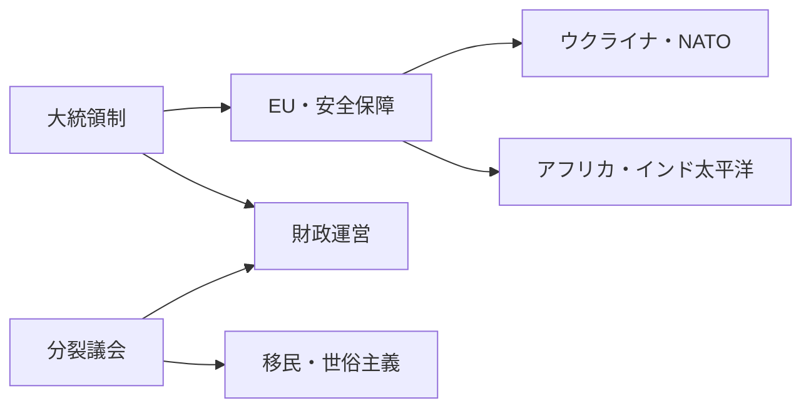
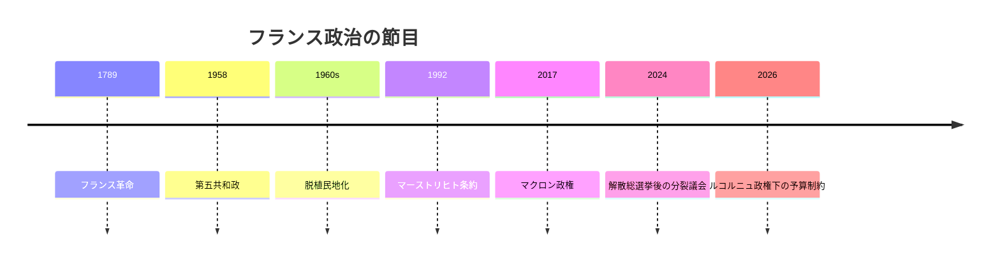

フランスの国際政治プロファイル 2026年版

## 1. エグゼクティブサマリー

フランスは、核兵器、国連安保理常任理事国の地位、EU中核国としての制度力、海外領土に基づくインド太平洋の足場を同時に持つ。<SourceNote>[France Diplomatie, Indo-Pacific strategy](https://www.diplomatie.gouv.fr/files/files/france_s_indo-pacific_strategy_2025_cle04bb17.pdf) と [Élysée, Ukraine security guarantees](https://www.elysee.fr/en/emmanuel-macron/2026/01/06/robust-security-guarantees-for-a-solid-and-lasting-peace-in-ukraine) を参照した。</SourceNote>

しかし2026年のフランス政治は、強い大統領制と弱い議会多数派が同居する状態にある。エマニュエル・マクロン大統領の下で、セバスチャン・ルコルニュ首相が政権を運営し、国民議会は国民連合、与党系会派、左派、社会党、共和右派などに割れている。<SourceNote>[info.gouv.fr, Composition du Gouvernement](https://www.info.gouv.fr/composition-du-gouvernement) はルコルニュ首相を掲載し、[Assemblée nationale, Effectif des groupes politiques](https://www2.assemblee-nationale.fr/instances/liste/groupes_politiques/effectif) は国民連合122、与党系 Ensemble 91、LFI-NFP 71、社会党系68などの分裂を示す。</SourceNote>

ニュースを読むときは、フランスを「欧州統合を進める強い国家」とだけ見ない方がよい。国内では移民、世俗主義、治安、購買力、農業、年金、財政赤字が対立軸をつくり、国外ではEU戦略的自律、NATO、ウクライナ支援、旧植民地関係、海外領土が政策の射程を広げている。

## 2. 歴史と制度の骨格

現代フランス政治は、1789年革命、第五共和政、アルジェリア戦争の記憶、欧州統合、核抑止、脱植民地化後のアフリカ関係を重ねてできている。第五共和政は大統領に外交・安全保障の大きな発信力を与えるが、予算、移民、社会保障、農業、地方行政は議会と社会運動に強く制約される。

この制度は危機時に大統領の声を大きくする一方、通常政治では「実行できる多数派」を探し続ける構造を生む。大統領選挙が国家の方向を示し、国民議会が毎年の予算と法律でその方向を絞り込む。

## 3. 権力配置

国民連合は、移民、治安、購買力、地方の疎外感を束ねる最大級の野党勢力である。左派は生活費、公共サービス、気候、反差別、若年層の不満を束ねる。中道・与党系は欧州、企業、財政規律、改革を掲げるが、単独で社会をまとめ切れない。

| アクター | 2026年時点の読み方 |
| --- | --- |
| 大統領府 | 外交・安全保障・欧州政策の方向を示す |
| ルコルニュ政権 | 分裂議会で予算と行政運営をつなぐ |
| 国民連合 | 移民、治安、購買力で右派圧力を強める |
| 左派・社会党系 | 社会保障、公共サービス、世俗主義、気候で抵抗軸をつくる |
| 共和右派・中道 | 予算、治安、産業政策で案件ごとの多数派を左右する |

この権力配置では、外交の大きな言葉と国内実装の細さがずれやすい。ウクライナ支援、国防費、EU産業政策、アフリカ政策のどれも、国際会議では継続を語れても、国内では財源、治安、農業、移民、購買力の争点に戻される。

## 4. 移民、世俗主義、社会抗議

移民問題は、労働力、難民保護、治安、イスラム、共和主義、地方自治体の受け入れ能力が同じ言葉に押し込まれやすい。OECDは2024年の初回庇護申請が約13万1000件で、ウクライナ、アフガニスタン、コンゴ民主共和国からの申請が多かったと整理している。<SourceNote>[OECD, International Migration Outlook 2025: France](https://www.oecd.org/en/publications/2025/11/international-migration-outlook-2025_355ae9fd/full-report/france_4863c606.html)</SourceNote>

世俗主義は、宗教を公共空間から消すだけの原則ではない。学校、宗教シンボル、公務、移民統合、反差別、表現の自由をめぐって、国家がどこまで中立を求めるかを問う政治言語である。そのため右派、左派、中道はいずれも「共和主義」を語るが、含意は異なる。

社会抗議もフランス政治の例外ではなく、制度の一部である。農業、年金、燃料価格、大学、警察、気候をめぐる抗議は、議会内の数合わせだけでは測れない拒否権を示す。2026年の読解では、国民議会の議席数と街頭の動員を同じ政治地図に置く必要がある。

## 5. EU、NATO、ウクライナ

フランスはEU戦略的自律を語るが、NATOと米国を不要にできるわけではない。ウクライナ支援では、フランスは安全保証、長期防衛協力、欧州の防衛産業を結びつけようとしている。<SourceNote>[Élysée, Paris Declaration on robust security guarantees for Ukraine](https://www.elysee.fr/en/emmanuel-macron/2026/01/06/robust-security-guarantees-for-a-solid-and-lasting-peace-in-ukraine)、[Élysée, joint statement of France, the United Kingdom, Germany and Ukraine](https://www.elysee.fr/en/emmanuel-macron/2026/06/07/joint-statement-of-the-leaders-of-france-the-united-kingdom-germany-and-ukraine) を参照した。</SourceNote>

戦略的自律は反米主義ではなく、欧州が外交・防衛・産業の選択肢を増やす発想である。フランスは核抑止と遠征能力を持つが、弾薬、ミサイル防衛、衛星、調達、東欧防衛では同盟国との連携が欠かせない。

## 6. アフリカ、フランコフォニー、インド太平洋

旧植民地との関係は、断絶か継続かの二択ではない。サヘルでの軍事的後退や反仏感情があっても、フランスは言語、教育、通貨、企業、移民、文化機関、国際機関を通じた影響力を維持しようとする。2026年のアフリカ政策では、フランコフォン圏だけでなく、ケニアのような英語圏との関係づくりも重要になっている。<SourceNote>[OIF](https://www.francophonie.org/) と [Le Monde, Africa-France summit in Nairobi](https://www.lemonde.fr/en/international/article/2026/05/11/in-nairobi-macron-ends-a-decade-of-turmoil-in-france-africa-relations_6753333_4.html) を参照した。</SourceNote>

インド太平洋では、フランスは域外の観察者ではない。レユニオン、マヨット、ニューカレドニア、仏領ポリネシアなどの海外領土が、主権、海洋安全保障、災害対応、地域協力の根拠になる。<SourceNote>[France Diplomatie, Indo-Pacific strategy](https://www.diplomatie.gouv.fr/files/files/france_s_indo-pacific_strategy_2025_cle04bb17.pdf) は海外領土を戦略の中心に置く。</SourceNote>

## 7. 財政、産業、原子力

フランス経済は、低成長、高い公的債務、強い社会支出、航空宇宙・防衛・農業・高級品・原子力の産業基盤を同時に抱える。欧州委員会は2026年の実質GDP成長率を0.8%、政府赤字をGDP比5.1%と見込んでいる。<SourceNote>[European Commission, Economic forecast for France](https://economy-finance.ec.europa.eu/economic-surveillance-eu-member-states/country-pages-including-country-reports/france/economic-forecast-france_en) を参照した。</SourceNote>

財政制約は外交にも直結する。国防費、ウクライナ支援、農業支援、産業補助、エネルギー投資、社会保障を同時に増やす余地は限られる。Banque de France は2026年6月の見通しで、公的債務比率が2028年末に122%へ向かうと予測している。<SourceNote>[Banque de France, Macroeconomic projections - June 2026](https://www.banque-france.fr/en/publications-and-statistics/publications/macroeconomic-projections-june-2026)</SourceNote>

原子力は、フランスの気候政策、産業政策、エネルギー安全保障をつなぐ基盤である。RTEは2024年に原子力発電が361.7TWhへ回復したと整理しており、電力価格、産業競争力、EU気候政策の議論で原子力は中心に戻っている。<SourceNote>[RTE, Nuclear power generation in France](https://analysesetdonnees.rte-france.com/en/generation/nuclear)</SourceNote>

## 8. 日本からの読み方

日本にとってフランスは、EU規制の形成国であり、インド太平洋の領土保有国であり、ウクライナ支援と防衛産業で欧州の意思決定を動かす相手である。インド太平洋戦略では日本を優先パートナーの一つに置き、新カレドニアの初の工業用レアアース分離案件でも日本との共同出資が見える。<SourceNote>[France Diplomatie, France's Indo-Pacific Strategy](https://www.diplomatie.gouv.fr/files/files/france_s_indo-pacific_strategy_2025_cle04bb17.pdf) を参照した。</SourceNote>

同時に、国内政治が分裂しているため、首脳間合意だけで政策の実装を予測すると外しやすい。

見るべき問いは三つある。第一に、分裂議会でも国防と産業政策の財源を確保できるか。第二に、国民連合と左派の圧力の間で中道が外交継続を保てるか。第三に、アフリカ、インド太平洋、EU、NATOを同時に動かすだけの行政能力と予算余地を維持できるかである。

フランスは「強い大統領」と「弱い多数派」の国として読むと見通しやすい。国際政治の発信力は大きいが、実装のたびに議会、街頭、財政、地方、旧植民地関係が戻ってくる。
