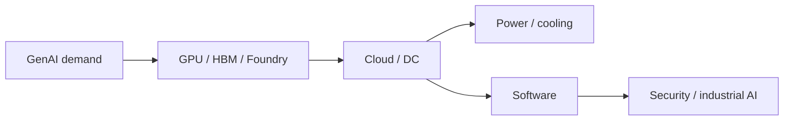

# Generative AI Investment Map: Where Capital Moves After Semiconductors

## 1. Executive Summary

Generative AI is no longer just a GPU story. Capital is spreading into cloud infrastructure, data centers, transmission, cooling, security, enterprise software, and industrial applications. UNCTAD warns that the AI market could reach $4.8 trillion by 2033 while value remains concentrated in a small number of firms, Gartner forecasts about $1.5 trillion in global AI spending in 2025, and the IEA says data center electricity demand could reach 945 TWh by 2030. The real bottleneck is therefore not only compute, but also power and deployment capacity. <SourceNote>[UNCTAD](https://unctad.org/press-material/ais-48-trillion-future-un-trade-and-development-alerts-divides-urges-action) highlights the long-term market outlook and concentration risk, [Gartner](https://www.gartner.com/en/newsroom/press-releases/2025-09-17-gartner-says-worldwide-ai-spending-will-total-1-point-5-trillion-in-2025) estimates current spending, and [IEA](https://www.iea.org/reports/energy-and-ai) maps the power constraint.</SourceNote>

The conclusion is straightforward. In the short run, the market usually rewards semiconductors and AI-server suppliers first. Over time, however, actual demand tends to migrate toward cloud infrastructure, power equipment, security, software, and industrial AI. The useful lens is to separate upstream supply constraints from downstream monetization.

1. Semiconductors are the entry point, but not the whole trade.
2. Short-term themes cluster around GPUs, HBM, leading-edge foundries, AI servers, and power equipment.
3. Medium- and long-term monetization is more likely to accrue to cloud platforms, data-center operators, software vendors, security providers, and industrial AI players.
4. Public capex guidance, backlog, and RPO disclosures already show capital moving from models to infrastructure and deployment.
5. The biggest risk is not missing AI demand, but misreading margins, power limits, regulation, and valuation.

The diagram is meant to show the capital chain, not a single winner-take-all model race. Even a strong layer can stall if another layer becomes the bottleneck.

## 2. Market Size and Growth Drivers

It helps to distinguish market value, spending, and capital expenditure. UNCTAD's $4.8 trillion figure refers to the long-term value of the broader AI market by 2033. Gartner's $1.5 trillion figure refers to global AI spending in 2025. The IEA's 945 TWh figure is a power-system outlook for data centers and AI. The numbers are not interchangeable, but together they show that generative AI is an infrastructure-heavy investment theme rather than a passing software fad. <SourceNote>[UNCTAD](https://unctad.org/press-material/ais-48-trillion-future-un-trade-and-development-alerts-divides-urges-action) provides the long-term value case, [Gartner](https://www.gartner.com/en/newsroom/press-releases/2025-09-17-gartner-says-worldwide-ai-spending-will-total-1-point-5-trillion-in-2025) the near-term spend case, and [IEA](https://www.iea.org/reports/energy-and-ai) the power case.</SourceNote>

Three drivers matter most. First, demand is shifting from training to inference, which keeps utilization high. Second, once companies move from pilots to production, spending rises on connectivity, identity, monitoring, and data plumbing. Third, electricity, cooling, and grid connection become binding constraints.

Corporate disclosures confirm the same direction. Alphabet raised 2026 capex guidance to $180-190 billion, Meta guided 2026 capex to $125-145 billion, Microsoft said roughly two thirds of capex was tied to short-lived assets such as GPUs and CPUs, Amazon said it secured more than 2.1 million AI chips over the past 12 months and will deploy more than 1 million NVIDIA GPUs starting in 2026, and Oracle said RPO reached $553 billion. The money is not flowing only into models; it is flowing into the physical and software stack that makes models usable. <SourceNote>[Alphabet Q1 2026 results](https://abc.xyz/investor/news/2026/alphabets-q1-2026-results/) provide capex guidance, [Amazon Q1 2026 earnings release](https://ir.aboutamazon.com/news-release/news-release-details/2026/Amazon.com-Announces-First-Quarter-Results/default.aspx) shows continued AI and infrastructure spending, [Meta Q1 2026 results](https://investor.atmeta.com/investor-news/press-release-details/2026/Meta-Reports-First-Quarter-2026-Results/default.aspx) provides 2026 capex guidance, [Microsoft Q3 FY2026 results](https://www.microsoft.com/en-us/Investor/earnings/FY-2026-Q3/intelligent-cloud-performance) describes capex asset mix, and [Oracle FY2026 Q3 results](https://investor.oracle.com/investor-news/news-details/2026/Oracle-Announces-Fiscal-Year-2026-Third-Quarter-Financial-Results/default.aspx) shows the build-up in cloud demand.</SourceNote>

## 3. A Practical Investment Stack

The market is easier to read when you split it into five layers. This is a synthesis from public disclosures, not an official industry taxonomy.

| Layer | Where capital flows | Observable indicators | Typical time horizon |
| --- | --- | --- | --- |
| Upstream supply | GPUs, HBM, leading-edge foundries, substrates, advanced packaging | Orders, shipments, utilization, yield | Short-term trade theme |
| Deployment base | Cloud, AI data centers, networks, storage | Capex, RPO, backlog, capacity additions | Short to medium term |
| Physical constraint | Power, transmission, cooling, substations, generation | Grid connection, equipment orders, electricity cost | Medium term |
| Monetization layer | Enterprise software, data connectivity, AI assistants | ARR, seats, usage, churn | Medium to long term |
| Control layer | Security, identity, governance, audit | Renewal rate, integration rate, security budgets | Medium to long term |

The useful reading rule is to stop assuming that better models make every stock go up together. In practice, the first beneficiaries are usually the most constrained supply layers. The next wave tends to be infrastructure. The slowest but stickiest compounding often comes from software and industrial adoption.

### 3.1 Semiconductors and memory

The most obvious short-term theme remains semiconductors. NVIDIA reported a record $75.2 billion in data center revenue for its first quarter of fiscal 2027. TSMC continues to describe AI demand as a key growth driver, and Samsung has started shipping HBM4E samples while guiding for strong HBM growth in 2026. The message is that compute and memory constraints are still at the center of the trade. <SourceNote>[NVIDIA Q1 FY2027 results](https://investor.nvidia.com/news/press-release-details/2025/NVIDIA-Announces-Financial-Results-for-First-Quarter-Fiscal-2027/default.aspx) show the scale of data-center demand, [TSMC Q1 2026 results](https://investor.tsmc.com/english/news/pressrelease) ties growth to AI demand, and [Samsung HBM4E samples](https://semiconductor.samsung.com/news-events/news/samsung-electronics-begins-shipment-of-industry-first-hbm4e-samples/) shows the next memory cycle.</SourceNote>

### 3.2 Cloud and data centers

The next large pool of capital is cloud and data-center infrastructure. Alphabet, Amazon, Meta, Oracle, and Microsoft are all still spending heavily on AI data centers, servers, networking, and power. Oracle's backlog continues to build, while Microsoft says it keeps expanding AI infrastructure. In this layer, money tends to move to the companies that transport and host models, not only to the companies that train them. <SourceNote>[Microsoft Q3 FY2026 results](https://www.microsoft.com/en-us/Investor/earnings/FY-2026-Q3/intelligent-cloud-performance) describe continued AI infrastructure investment, and [Oracle FY2026 Q3 results](https://investor.oracle.com/investor-news/news-details/2026/Oracle-Announces-Fiscal-Year-2026-Third-Quarter-Financial-Results/default.aspx) show backlog accumulation. [Amazon](https://ir.aboutamazon.com/news-release/news-release-details/2026/Amazon.com-Announces-First-Quarter-Results/default.aspx), [Alphabet](https://abc.xyz/investor/news/2026/alphabets-q1-2026-results/), and [Meta](https://investor.atmeta.com/investor-news/press-release-details/2026/Meta-Reports-First-Quarter-2026-Results/default.aspx) all point in the same direction.</SourceNote>

### 3.3 Power and cooling

As data centers scale, power, cooling, and transmission become more valuable themes. The IEA expects data-center and AI electricity demand to rise sharply by 2030, and GE Vernova has pointed to stronger demand linked to data centers. In practice, the constraint is not only GPUs. Site availability, grid connection, transformers, water, and generation capacity all matter. <SourceNote>[IEA Energy and AI](https://www.iea.org/reports/energy-and-ai) summarizes the electricity constraint, and [GE Vernova Q1 2026 results](https://www.gevernova.com/news/articles/ge-vernova-releases-first-quarter-2026-financial-results) show data-center-related demand.</SourceNote>

### 3.4 Security and governance

Generative AI expands the attack surface, so security becomes a stand-alone investment theme. Google completed its acquisition of Wiz to strengthen cross-cloud security, and companies such as CrowdStrike are extending beyond endpoint protection into identity, workload, and cloud controls for the AI era. The more production AI grows, the more demand there is for permissions, auditability, and data boundaries. <SourceNote>[Google/Wiz acquisition completion](https://abc.xyz/investor/news/2026/Google-Completes-Acquisition-of-Wiz-2026-ta7OaU2uA0/default.aspx) shows the security angle, and [CrowdStrike Investor Relations](https://ir.crowdstrike.com/) covers AI-era security products.</SourceNote>

### 3.5 Software and industrial applications

The medium- to long-term prize is less about the model itself and more about enterprise software and industrial use cases. Oracle says AI accelerates code generation and application expansion, while Siemens continues to expand industrial generative AI and digital twin use cases. Here, recurring usage, workflow embedding, and auditability matter more than one-off inference cost. <SourceNote>[Oracle FY2026 Q3 results](https://investor.oracle.com/investor-news/news-details/2026/Oracle-Announces-Fiscal-Year-2026-Third-Quarter-Financial-Results/default.aspx) describes AI-assisted application development, and [Siemens AI announcements](https://www.siemens.com/global/en/company/stories/industry/ai.html) describe industrial AI deployment.</SourceNote>

## 4. Short-Term Trades vs. Long-Term Demand

In the short term, money tends to chase constrained supply. GPUs, HBM, leading-edge foundries, AI-server components, power gear, cooling, and networking are easy to price because orders and shipments are visible. That also makes them easy to overprice.

In the medium term, the theme shifts toward cloud and data-center buildout. Capex, RPO, backlog, utilization, and grid connection are the key indicators. The real question is not whether a headline was good this quarter, but whether capacity additions are visible over several quarters.

In the long term, software, security, and industrial AI matter more. The relevant question is not the model name. It is whether the product is embedded in a workflow, what KPI it improves, and whether it converts into recurring revenue. <SourceNote>The short-, medium-, and long-term split is an inference from public disclosures rather than an official market roadmap. It is synthesized from [UNCTAD](https://unctad.org/press-material/ais-48-trillion-future-un-trade-and-development-alerts-divides-urges-action), [IEA](https://www.iea.org/reports/energy-and-ai), and the capital-allocation behavior of [Alphabet](https://abc.xyz/investor/news/2026/alphabets-q1-2026-results/) and [Amazon](https://ir.aboutamazon.com/news-release/news-release-details/2026/Amazon.com-Announces-First-Quarter-Results/default.aspx).</SourceNote>

| Time horizon | Typical theme | What investors watch | Easy mistake |
| --- | --- | --- | --- |
| Short term | Semiconductors, HBM, AI servers | Orders, shipments, inventory, yield | Assuming demand is permanent |
| Medium term | Cloud, data centers, power equipment | Capex, RPO, backlog, utilization | Missing the lag between buildout and revenue |
| Long term | Software, security, industrial AI | ARR, retention, adoption, compliance | Underestimating compounding revenue |

## 5. Risks and Limits

The biggest risk is to treat the whole AI boom as one trade. UNCTAD's warning is that gains are concentrated, so the AI benefit does not spread evenly across the market. Power bottlenecks, grid connection, export controls, model competition, price competition, and tighter regulation can create very different winners and losers inside the same "AI" label. <SourceNote>[UNCTAD](https://unctad.org/press-material/ais-48-trillion-future-un-trade-and-development-alerts-divides-urges-action) warns about concentration, and [IEA](https://www.iea.org/reports/energy-and-ai) highlights both the upside and uncertainty in electricity demand.</SourceNote>

This report is not investment advice. The "where capital moves" framing is an inference from public information, not an official roadmap from the industry. Any actual portfolio decision still needs valuation, payback period, regulation, customer concentration, and power-supply risk checks.

## 6. Reading the investment thesis

When you track generative AI as a market theme, the following sequence is usually more useful:

1. Is the company at the demand entry point, the supply bottleneck, or the monetization layer?
2. Is the growth temporary cycle demand or multi-quarter capex demand?
3. Are capex and backlog converting into real utilization and revenue?
4. Are power, cooling, and networking constraints limiting the next wave?
5. Is the theme a trading story, or a recurring-revenue story?

Using that lens makes it easier to see how capital moves from semiconductors to cloud, power, software, security, and industrial AI. The generative AI investment map is best read as a reallocation of capital across the stack, not as a single-stock narrative.

## References

- UNCTAD, AI market concentration and 2033 outlook.
- Gartner, worldwide AI spending forecast for 2025.
- IEA, Energy and AI.
- Alphabet, Amazon, Meta, Microsoft, Oracle, NVIDIA, TSMC, Samsung, GE Vernova, Google/Wiz, Siemens investor materials.
