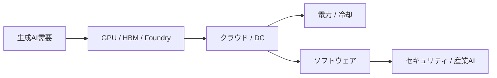

# 生成AI投資テーマの全体地図: 半導体の次に資金が向かう領域

## 1. エグゼクティブサマリー

生成AIの投資テーマは、GPUやHBMだけを見ていれば十分ではない。実際には、モデル学習と推論を支えるクラウド、データセンター、送配電、冷却、セキュリティ、企業ソフトウェア、産業用途へと資金が広がっている。UNCTADはAI市場が2033年に4.8兆ドルへ拡大しうる一方で利益は少数企業に集中すると警告し、Gartnerは2025年の世界AI支出を約1.5兆ドルと予測している。IEAはデータセンターの電力需要が2030年までに945TWhへ達しうるとみており、生成AIの本当のボトルネックは計算資源だけでなく電力と設置能力にもある。<SourceNote>[UNCTADの2025年発表](https://unctad.org/press-material/ais-48-trillion-future-un-trade-and-development-alerts-divides-urges-action) はAI市場の長期拡大と集中を示し、[Gartnerの2025年予測](https://www.gartner.com/en/newsroom/press-releases/2025-09-17-gartner-says-worldwide-ai-spending-will-total-1-point-5-trillion-in-2025) は当面の支出規模を示す。[IEAのEnergy and AI](https://www.iea.org/reports/energy-and-ai) はデータセンター電力需要の上振れを整理している。</SourceNote>

本稿の結論は単純である。短期の相場は半導体とAIサーバー周辺に集まりやすいが、中長期の実需はクラウド、電力・冷却、ソフトウェア、セキュリティ、産業応用へ分散しやすい。したがって、生成AIの投資地図は「上流の供給制約」と「下流の収益化」を分けて読む必要がある。

1. 半導体は入口だが、資金が流れ込む先はそれだけではない。
2. 短期のテーマは、GPU、HBM、先端ファウンドリ、AIサーバー、電力設備に集中しやすい。
3. 中長期では、クラウド、データセンター運営、セキュリティ、業務ソフト、産業AIが収益化の本丸になる。
4. 企業が公表するcapexや受注、RPO、設備投資計画を見ると、資金配分はすでに「モデル」から「インフラ」と「実装」に移りつつある。
5. もっとも大きいリスクは、AI需要そのものを過小評価することではなく、利益率、電力制約、規制、過剰評価を読み違えることである。

この図は、資金の流れを一方向の「モデル競争」ではなく、需要、供給、制約、実装の連鎖として捉えるためのものである。どこか一つのレイヤーが強くても、他のレイヤーが詰まれば投資テーマは伸び切らない。

## 2. 市場規模と成長ドライバー

市場規模の議論では、「市場価値」「支出」「設備投資」を分ける必要がある。UNCTADの4.8兆ドルは2033年時点の広義のAI市場価値の見立てであり、Gartnerの1.5兆ドルは2025年の世界AI支出予測である。IEAの945TWhは、AIとデータセンターが電力システムに与える負荷の見通しである。三つは同じ数字ではないが、いずれも生成AIが一過性の話題ではなく、インフラ需要を伴う投資テーマであることを示している。<SourceNote>[UNCTAD](https://unctad.org/press-material/ais-48-trillion-future-un-trade-and-development-alerts-divides-urges-action) は長期の市場価値、[Gartner](https://www.gartner.com/en/newsroom/press-releases/2025-09-17-gartner-says-worldwide-ai-spending-will-total-1-point-5-trillion-in-2025) は当面の支出、[IEA](https://www.iea.org/reports/energy-and-ai) は電力制約を示す。</SourceNote>

成長ドライバーは三つある。第一に、学習から推論へ需要の中心が移り、処理量が継続的に増えること。第二に、企業が実験から本番運用へ移るほど、クラウド、監視、権限管理、データ接続のコストが増えること。第三に、消費電力と冷却が実質的な供給制約になることだ。

企業側の公表情報も、この流れを裏づける。Alphabetは2026年capexガイダンスを1800億〜1900億ドルに引き上げ、Metaは2026年capexを1250億〜1450億ドルと見込んでいる。Microsoftはcapexの約3分の2がGPUとCPUを中心とする短寿命資産だったと説明し、Amazonは過去12か月で210万台超のAIチップを確保し、2026年から100万台超のNVIDIA GPUを展開するとした。OracleはRPOが5530億ドルに達した。こうした数字は、生成AIの資金がモデル単体ではなく、データセンター、サーバー、ネットワーク、電力系統に向かっていることを示す。<SourceNote>[Alphabet Q1 2026 results](https://abc.xyz/investor/news/2026/alphabets-q1-2026-results/) はcapex見通しを示し、[Amazon Q1 2026 earnings release](https://ir.aboutamazon.com/news-release/news-release-details/2026/Amazon.com-Announces-First-Quarter-Results/default.aspx) はAIとインフラ投資の継続を示す。[Meta Q1 2026 results](https://investor.atmeta.com/investor-news/press-release-details/2026/Meta-Reports-First-Quarter-2026-Results/default.aspx) は2026年capexガイダンスを示し、[Microsoft Q3 FY2026 results](https://www.microsoft.com/en-us/Investor/earnings/FY-2026-Q3/intelligent-cloud-performance) はGPUとCPUを中心とする資産配分を示す。[Oracle FY2026 Q3 results](https://investor.oracle.com/investor-news/news-details/2026/Oracle-Announces-Fiscal-Year-2026-Third-Quarter-Financial-Results/default.aspx) はクラウド需要の積み上がりを示す。</SourceNote>

## 3. 生成AI投資の地図

投資テーマは、概ね五層で整理すると見通しやすい。ここでの分類は公式ロードマップではなく、公表情報からの推定である。

| 層 | 何に資金が流れるか | 観測しやすい指標 | 典型的な時間軸 |
| --- | --- | --- | --- |
| 上流供給 | GPU、HBM、先端ファウンドリ、基板、先端パッケージ | 受注、出荷、稼働率、歩留まり | 短期の相場テーマ |
| 実装基盤 | クラウド、AIデータセンター、ネットワーク、ストレージ | capex、RPO、バックログ、容量増設 | 短中期 |
| 物理制約 | 電力、送配電、冷却、変電、発電 | 系統接続、設備受注、電力コスト | 中期 |
| 収益化層 | 業務ソフト、データ接続、AIアシスタント | ARR、席数、利用率、解約率 | 中長期 |
| 防御・統制 | セキュリティ、ID、ガバナンス、監査 | 契約更新率、統合率、セキュリティ予算 | 中長期 |

この地図の読み方は、モデル性能が上がればすべての銘柄が同じように上がる、という発想を捨てることにある。実際には、最初に利益を取りやすいのは供給制約の強い層であり、次に投資が向かうのはクラウドと電力であり、最後に時間をかけて伸びるのが業務ソフトと産業用途である。

### 3.1 半導体とメモリ

短期の相場テーマとして最も分かりやすいのは半導体である。NVIDIAは2026年5月期第1四半期にデータセンター売上が752億ドルと過去最高を更新し、TSMCはAI需要を主要な成長ドライバーとして維持している。SamsungはHBM4Eサンプルの出荷を開始し、HBM売上が2026年に大きく伸びる見通しを示した。これは、生成AIの中心が今なお「計算とメモリの供給制約」にあることを示す。<SourceNote>[NVIDIA Q1 FY2027 results](https://investor.nvidia.com/news/press-release-details/2025/NVIDIA-Announces-Financial-Results-for-First-Quarter-Fiscal-2027/default.aspx) はデータセンター売上の拡大を示し、[TSMC Q1 2026 results](https://investor.tsmc.com/english/news/pressrelease) はAI需要を成長要因として示す。[Samsung HBM4E samples](https://semiconductor.samsung.com/news-events/news/samsung-electronics-begins-shipment-of-industry-first-hbm4e-samples/) はHBM世代更新の進展を示す。</SourceNote>

### 3.2 クラウドとデータセンター

資金の受け皿として、次に大きいのはクラウドとデータセンターである。Alphabet、Amazon、Meta、Oracle、MicrosoftはいずれもAI向けのデータセンター、ネットワーク、サーバー、電力に巨額の投資を続けている。Oracleはクラウド受注残の積み上がりを示し、MicrosoftはAIインフラを拡張し続けると明言している。ここでは「モデルを持つ会社」より「モデルを運ぶ会社」に資金が集まりやすい。<SourceNote>[Microsoft Q3 FY2026 results](https://www.microsoft.com/en-us/Investor/earnings/FY-2026-Q3/intelligent-cloud-performance) はAIインフラ投資を示し、[Oracle FY2026 Q3 results](https://investor.oracle.com/investor-news/news-details/2026/Oracle-Announces-Fiscal-Year-2026-Third-Quarter-Financial-Results/default.aspx) はRPOの積み上がりを示す。[Amazon](https://ir.aboutamazon.com/news-release/news-release-details/2026/Amazon.com-Announces-First-Quarter-Results/default.aspx)、[Alphabet](https://abc.xyz/investor/news/2026/alphabets-q1-2026-results/)、[Meta](https://investor.atmeta.com/investor-news/press-release-details/2026/Meta-Reports-First-Quarter-2026-Results/default.aspx) の各社発表も同じ方向を示す。</SourceNote>

### 3.3 電力と冷却

データセンターの増設が進むほど、電力・冷却・送配電のテーマは強くなる。IEAはAIとデータセンターが2030年までに電力需要を大きく押し上げるとみており、GE Vernovaはデータセンター向け受注の増加を示している。AI投資の現場では、GPUが足りないだけではなく、敷地、系統接続、変圧、冷却水、発電容量が足りないという制約が効く。<SourceNote>[IEA Energy and AI](https://www.iea.org/reports/energy-and-ai) はAIとデータセンターの電力需要を整理し、[GE Vernova Q1 2026 results](https://www.gevernova.com/news/articles/ge-vernova-releases-first-quarter-2026-financial-results) はデータセンター関連需要を示す。</SourceNote>

### 3.4 セキュリティとガバナンス

生成AIは攻撃面も広げるため、セキュリティは独立した投資テーマになる。GoogleはWizの買収を完了し、クラウド横断のセキュリティを強化した。CrowdStrikeのような会社は、エンドポイントだけでなくAI時代のID、ワークロード、クラウド保護へ領域を広げている。モデル導入が進むほど、権限、監査、データ境界の需要は増える。<SourceNote>[Google/Wiz買収完了](https://abc.xyz/investor/news/2026/Google-Completes-Acquisition-of-Wiz-2026-ta7OaU2uA0/default.aspx) はクラウドセキュリティ強化を示し、[CrowdStrike Investor Relations](https://ir.crowdstrike.com/) はAI時代のセキュリティ製品展開を示す。</SourceNote>

### 3.5 ソフトウェアと産業応用

中長期の本命は、モデルそのものより業務ソフトと産業応用である。OracleはAIがコード生成やアプリ拡張を速めると述べ、Siemensは産業向け生成AIやデジタルツインを拡張している。ここでは、1回の推論コストよりも、継続利用、ワークフロー組み込み、データ接続、監査可能性が収益化の鍵になる。<SourceNote>[Oracle FY2026 Q3 results](https://investor.oracle.com/investor-news/news-details/2026/Oracle-Announces-Fiscal-Year-2026-Third-Quarter-Financial-Results/default.aspx) はAIによるアプリ開発加速を示し、[Siemens AI announcements](https://www.siemens.com/global/en/company/stories/industry/ai.html) は産業AIの実装を示す。</SourceNote>

## 4. 短期の相場テーマと中長期の実需

短期は、供給制約の強いところに資金が集まりやすい。GPU、HBM、先端ファウンドリ、AIサーバー部材、電源、冷却、ネットワークは、受注や出荷が見えやすいため、相場が先行しやすい。一方で、ここは期待も早く織り込まれるため、売上成長が鈍ると株価は先に剥落しやすい。

中期は、クラウドとデータセンターの建設・稼働がテーマになる。capex、RPO、バックログ、稼働率、接続待ちが重要な観測点になる。短期のニュースではなく、複数四半期にわたる容量追加が見えるかどうかが本質である。

長期は、ソフトウェア、セキュリティ、産業AIが効く。ここではモデル名よりも、どの業務に組み込まれ、どのKPIを改善し、どれだけ継続課金につながるかを見るべきだ。生成AIの収益化は、学習モデルの強さからではなく、ワークフローへの埋め込みから始まる。<SourceNote>この短期・中期・長期の切り分けは、UNCTAD、IEA、各社IRの公表情報からの推定であり、公式な市場分類ではない。[UNCTAD](https://unctad.org/press-material/ais-48-trillion-future-un-trade-and-development-alerts-divides-urges-action)、[IEA](https://www.iea.org/reports/energy-and-ai)、[Alphabet](https://abc.xyz/investor/news/2026/alphabets-q1-2026-results/)、[Amazon](https://ir.aboutamazon.com/news-release/news-release-details/2026/Amazon.com-Announces-First-Quarter-Results/default.aspx) などの投資行動を合成した整理である。</SourceNote>

| 時間軸 | 典型テーマ | 投資家が見るべきもの | 誤読しやすい点 |
| --- | --- | --- | --- |
| 短期 | 半導体、HBM、AIサーバー | 受注、出荷、在庫、歩留まり | 需要が永続的とは限らない |
| 中期 | クラウド、データセンター、電力設備 | capex、RPO、バックログ、稼働率 | 建設遅延で収益化がずれる |
| 長期 | ソフトウェア、セキュリティ、産業AI | ARR、定着率、導入部門数、監査要件 | 立ち上がりが遅くても継続収益は大きい |

## 5. リスク・限界

最大のリスクは、AIブーム全体を一つのテーマとして見すぎることだ。UNCTADが指摘するように、利益は少数企業に集中しやすく、AIの恩恵は必ずしも広く分散しない。さらに、電力制約、系統接続、輸出規制、モデル競争、価格競争、規制強化が重なると、同じ「AI関連」でも勝ち負けが分かれる。<SourceNote>[UNCTAD](https://unctad.org/press-material/ais-48-trillion-future-un-trade-and-development-alerts-divides-urges-action) はAI利益の集中を警告している。[IEA](https://www.iea.org/reports/energy-and-ai) はデータセンター電力需要の上振れと不確実性を示している。</SourceNote>

また、このレポートは投資助言ではない。ここで示した「どこに資金が向かうか」は、公開情報からの推定であり、企業の公式ロードマップではない。投資判断では、バリュエーション、資本回収期間、規制リスク、顧客集中、電力供給の制約を別途確認する必要がある。

## 6. 投資仮説の読み方

生成AIテーマを追うときは、次の順で見ると整理しやすい。

1. その会社は需要の入口にいるのか、供給制約を握っているのか、収益化の末端にいるのか。
2. 売上成長は一時的なサイクルか、複数四半期にまたがる設備投資か。
3. capexや受注残は、実際の稼働と収益に変わっているか。
4. 電力・冷却・ネットワークの制約が、次の成長を止めていないか。
5. そのテーマは、相場の物語なのか、それとも継続課金の実需なのか。

この見方を取ると、半導体だけを追うより、クラウド、電力、ソフトウェア、セキュリティ、産業AIへとテーマがどの順で移るかを追いやすい。生成AIの投資地図は、単一銘柄の物語ではなく、インフラからアプリケーションまでの資金配分の変化として読むのが実務的である。

## 参考情報

- UNCTAD, AI market concentration and 2033 outlook.
- Gartner, worldwide AI spending forecast for 2025.
- IEA, Energy and AI.
- Alphabet, Amazon, Meta, Microsoft, Oracle, NVIDIA, TSMC, Samsung, GE Vernova, Google/Wiz, Siemens investor materials.
