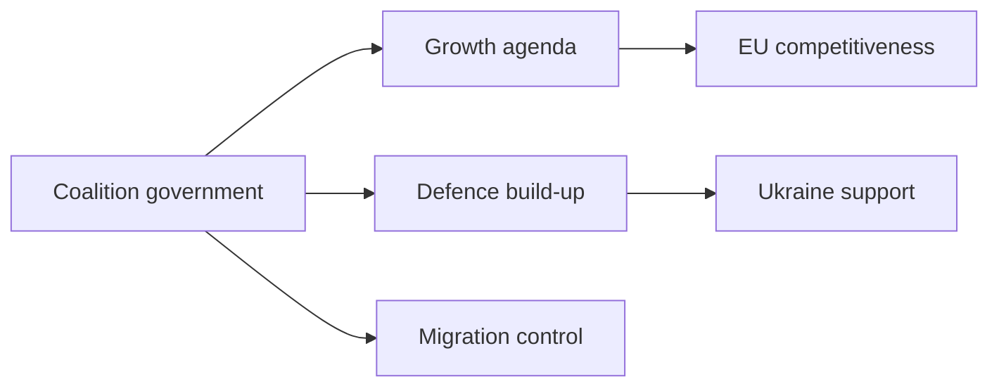
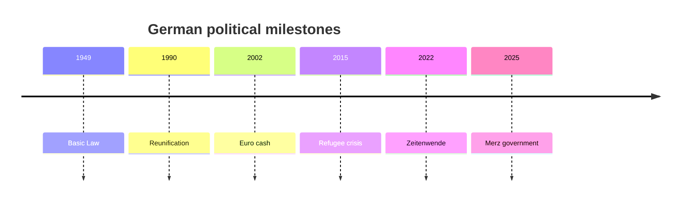

# Germany Geopolitical Profile 2026

## 1. Executive Summary

Germany combines one of the EU’s largest economies, a rear base for NATO’s eastern posture, fiscal weight inside the euro area, and standard-setting power in climate and industrial policy. After the 2025 federal election, Chancellor Friedrich Merz leads a CDU/CSU-SPD government that is trying to rebuild growth, expand defence, control migration, and strengthen Europe at the same time. <SourceNote>[Federal Government, Federal Cabinet](https://www.bundesregierung.de/breg-en/federal-cabinet) and [Federal Government, first government statement](https://www.bundesregierung.de/breg-en/news/first-government-statement-chancellor-merz-2347710)</SourceNote>

Germany should not be read only as the EU’s central state. AfD growth, east-west divides, industrial stagnation, energy prices, and permanent defence funding constrain Berlin’s foreign policy. For Japan, the main issue is how German climate, industrial, and sanctions decisions move into EU-wide rules.

## 2. Historical and Institutional Frame

Modern German politics rests on the 1949 Basic Law, Cold War division, European integration, 1990 reunification, euro cash in 2002, and Russia’s 2022 full-scale invasion of Ukraine. Federalism, proportional representation, coalition government, the constitutional court, and Länder powers slow and reshape policy.

German foreign policy does not move by chancellery statement alone. Coalition agreements, the Bundestag, Länder governments, industry associations, unions, constitutional review, and EU procedures all alter policy. In security and fiscal policy, Berlin is judged by implementation capacity after it declares intent.

## 3. Power After the 2025 Election

In the 2025 Bundestag election, CDU/CSU became the largest force and AfD rose to second place. SPD suffered a post-war low, and FDP failed to enter the Bundestag. Turnout reached 82.5%, showing that voters treated the election as a choice over economy, migration, war, and energy. <SourceNote>[Federal Returning Officer, Bundestag election 2025 final result](https://www.bundeswahlleiterin.de/en/bundestagswahlen/2025/ergebnisse/bund-99.html) reports CDU/CSU combined at 28.6%, AfD at 20.8%, SPD at 16.4%, and turnout at 82.5%.</SourceNote>

| Actor              | 2026 Reading                                                  |
| ------------------ | ------------------------------------------------------------- |
| CDU/CSU            | Governing core around growth, defence, migration control      |
| SPD                | Coalition partner shaping social policy and labour issues     |
| AfD                | Opposition pressure, especially strong in eastern Germany     |
| Greens             | Climate and European policy influence outside government      |
| Länder governments | Migration, policing, education, infrastructure implementation |

AfD cannot be dismissed as a protest vote alone. Economic stagnation, distrust over migration control, eastern under-representation, and exhaustion with mainstream parties overlap. Legal disputes around domestic intelligence classification and surveillance add pressure, while mainstream parties keep the firewall against cooperation but cannot ignore policy demands from AfD voters. <SourceNote>[BfV home](https://www.verfassungsschutz.de/EN/home/home_node.html) and [AP, AfD extremist designation suspended pending court ruling](https://apnews.com/article/92d74a6aa09863bbaae86e047c163cb4)</SourceNote>

## 4. Migration, Integration, Domestic Security

Migration policy has become a central domestic issue. The 2015 refugee intake, Ukrainian refugees, labour shortages, security incidents, and municipal capacity now sit inside one debate. BAMF publishes monthly asylum statistics and explains differences between national and Eurostat methods. Readers need to keep labour migration, refugees, asylum applications, and long-term residents separate. <SourceNote>[BAMF, Figures on asylum](https://www.bamf.de/EN/Themen/Statistik/Asylzahlen/asylzahlen-node.html)</SourceNote>

The Merz government speaks of orderly migration policy, while the economy needs skilled workers. Policy therefore has to restrict irregular migration and recruit workers for health care, elder care, manufacturing, and IT. That tension connects AfD politics, municipal finance, and company hiring.

## 5. Ukraine Support and Defence Spending

Since Russia’s full-scale invasion, Germany has moved out of the long peace-dividend period. The government expanded military, financial, and humanitarian support for Ukraine and says Germany had trained almost 26,000 Ukrainian soldiers in Germany by 2025. <SourceNote>[Federal Government, German aid for Ukraine](https://www.bundesregierung.de/breg-en/news/germany-aid-for-ukraine-2192480)</SourceNote>

Defence spending cannot depend only on one-off funds. NATO’s 2% benchmark, air defence, ammunition, eastern defence, U.S. bases in Germany, and Ukraine support all push on ordinary budgets and debt rules. The 2026 question is not whether Germany increases defence. It is whether Germany can turn defence pledges into permanent funding, procurement, and personnel.

## 6. Industrial Competitiveness and Energy

Germany remains strong in exports, manufacturing, chemicals, automobiles, and machinery, but faces weaker China demand, U.S. trade pressure, energy prices, EV competition, and slower software transition. IMF 2026 WEO data show real GDP growth at 0.8%. The European Commission’s Germany forecast projects 0.6% growth, 2.9% inflation, and 4.0% unemployment in 2026. <SourceNote>[IMF DataMapper Germany](https://www.imf.org/external/datamapper/profile/DEU) and [European Commission, Economic forecast for Germany](https://economy-finance.ec.europa.eu/economic-surveillance-eu-member-states/country-pages-including-country-reports/germany/economic-forecast-germany_en)</SourceNote>

The energy transition is industrial policy as well as climate policy. Germany has moved away from Russian pipeline gas toward LNG, northern European supply, renewable electricity, grid investment, and hydrogen planning. Bundesnetzagentur says Germany became an important European import hub after Russian pipeline imports ended, with greater reliance on LNG and northern deliveries. <SourceNote>[Bundesnetzagentur, Monitoring report 2025 press release](https://www.bundesnetzagentur.de/SharedDocs/Pressemitteilungen/EN/2025/20251126_Monitoringbericht.html) and [Destatis, gross electricity production](https://www.destatis.de/EN/Themes/Economic-Sectors-Enterprises/Energy/Production/Tables/gross-electricity-production.html)</SourceNote>

## 7. EU Governance and Japan’s Reading

Germany makes rules inside the EU and pays for many compromises. Euro area fiscal policy, Russia sanctions, industrial subsidies, climate regulation, and asylum reform all depend on the German bargaining line. The Merz government stresses European autonomy, but German security still needs NATO, the United States, France, Poland, and Italy.

For Japan, Germany matters in three ways. It is a gateway into EU regulation. It is a manufacturing power adjusting away from China dependence. It shapes European security funding and procurement through Ukraine support and defence industry expansion. Japanese firms should read Germany as an operating base where EU standards, China-risk management, energy costs, and sanctions enforcement meet.

## 8. Risks and Watchpoints

Four questions deserve attention. Can the coalition reconcile investment with debt rules? Can it isolate AfD while addressing migration and local discontent? Can Germany convert defence spending into procurement and personnel? Can automotive, chemical, and machinery firms adapt to both China pressure and European regulation?

This profile relies on public information. Coalition breakdown, Länder elections, Ukraine battlefield shifts, U.S.-EU trade conflict, or energy prices would change the reading of German foreign policy.
