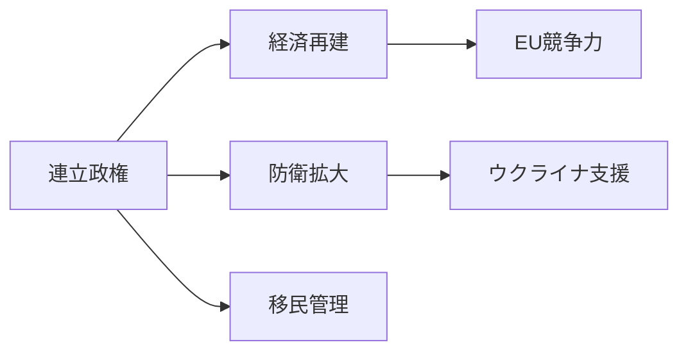
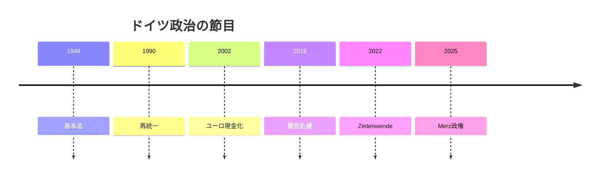

# ドイツの国際政治プロファイル 2026年版

## 1. エグゼクティブサマリー

ドイツは、EU最大級の経済、NATO東翼の後方基盤、ユーロ圏財政の重し、気候政策の標準設定国という複数の顔を持つ。2025年総選挙後は、Friedrich Merz首相の下でCDU/CSUとSPDが政権を組み、経済再建、防衛拡大、移民管理、欧州の自立を同時に進めようとしている。<SourceNote>[Federal Government, Federal Cabinet](https://www.bundesregierung.de/breg-en/federal-cabinet) と [Federal Government, first government statement](https://www.bundesregierung.de/breg-en/news/first-government-statement-chancellor-merz-2347710) を参照した。</SourceNote>

ニュースを読むときは、ドイツを「EUの中心国家」とだけ見ない方がよい。AfDの伸長、東西差、産業の停滞、エネルギー価格、防衛費の恒久財源が、ベルリンの対外政策を毎回制約する。日本企業や政策担当者にとっては、ドイツ発の気候・産業・制裁ルールがEU全体の規制へ広がる経路を読むことが重要になる。

## 2. 歴史と制度の骨格

現在のドイツ政治は、1949年の基本法、冷戦下の分断、1960年代以降の欧州統合、1990年の再統一、2002年のユーロ現金導入、2022年のロシア全面侵攻を重ねてできている。連邦制、比例代表制、連立政治、憲法裁判所、州政府の権限が政策の速度を調整する。

ドイツの対外政策は、首相府の宣言だけで決まらない。連立合意、連邦議会、州政府、産業団体、労組、憲法裁判所、EU制度が政策を細かく組み替える。安全保障でも財政でも、ベルリンは意思決定後に実装能力を問われる。

## 3. 2025年選挙後の権力配置

2025年連邦議会選挙では、CDU/CSUが第1勢力となり、AfDは第2勢力へ伸びた。SPDは戦後最悪級の得票に落ち、FDPは連邦議会入りを逃した。投票率は82.5%で、ドイツ政治が経済、移民、戦争、エネルギーをめぐる選択として有権者に受け止められたことを示す。<SourceNote>[Federal Returning Officer, Bundestag election 2025 final result](https://www.bundeswahlleiterin.de/en/bundestagswahlen/2025/ergebnisse/bund-99.html) はCDU/CSU合計28.6%、AfD20.8%、SPD16.4%、投票率82.5%を示す。</SourceNote>

| アクター | 2026年時点の読み方                                 |
| -------- | -------------------------------------------------- |
| CDU/CSU  | 経済再建、防衛拡大、移民抑制を掲げる政権中核       |
| SPD      | 社会政策と労働市場で連立を内側から調整する         |
| AfD      | 東部を中心に強い野党圧力をかける                   |
| Greens   | 気候・欧州政策で議会外から影響を残す               |
| 州政府   | 移民、警察、教育、インフラ実装で中央政策を左右する |

AfDを読むときは、単なる抗議票として片づけると外す。経済停滞、移民管理への不信、東部の代表感覚、主流政党への疲れが重なっている。連邦レベルの情報機関による分類と裁判上の争いもあり、主流政党は協力拒否の「防火壁」を維持しながら、AfD支持層の政策要求だけは無視できない状態に置かれている。<SourceNote>[BfV home](https://www.verfassungsschutz.de/EN/home/home_node.html)、[AP, AfD extremist designation suspended pending court ruling](https://apnews.com/article/92d74a6aa09863bbaae86e047c163cb4) を参照し、法的手続き中のため断定を避けた。</SourceNote>

## 4. 移民・統合と国内安全保障

移民政策は、ドイツ国内政治の中心争点になった。2015年の難民受け入れ、ウクライナ避難民、労働力不足、治安事件、自治体の受け入れ能力が同じ議論に混ざる。BAMFは asylum statistics を月次で公表し、Eurostatとの統計差も説明している。数字の読み方を誤ると、労働移民、難民、庇護申請、長期在留者を同じ扱いにしてしまう。<SourceNote>[BAMF, Figures on asylum](https://www.bamf.de/EN/Themen/Statistik/Asylzahlen/asylzahlen-node.html) は庇護申請・決定・Dublin手続きの月次統計を説明している。</SourceNote>

Merz政権は「秩序ある移民政策」を掲げるが、ドイツ経済は熟練労働者も必要とする。移民を減らす政策と、医療、介護、製造、ITで人手を確保する政策は同時に走る。このねじれが、AfD対策、自治体財政、企業の採用戦略を結びつける。

## 5. ウクライナ支援と防衛費

ロシアの全面侵攻後、ドイツは長い平和配当の時代から抜け出した。政府はウクライナへの軍事・財政・人道支援を拡大し、2025年時点でドイツ国内で約2万6000人のウクライナ兵を訓練したと説明している。<SourceNote>[Federal Government, German aid for Ukraine](https://www.bundesregierung.de/breg-en/news/germany-aid-for-ukraine-2192480) は軍事支援、避難民支援、訓練人数を説明している。</SourceNote>

防衛費は一時的な特別基金だけでは足りない。NATOの2%目標、防空、弾薬、東欧防衛、ドイツ国内の米軍拠点、ウクライナ支援が、通常予算と債務ルールを押し上げる。2026年のドイツを読む鍵は、「防衛を増やすか」ではなく、「防衛を恒久財源と調達能力へ落とせるか」である。

## 6. 産業競争力とエネルギー

ドイツ経済は輸出、製造、化学、自動車、機械に強いが、中国需要の鈍化、米国との通商摩擦、エネルギー価格、EV競争、ソフトウェア化への遅れに直面している。IMFの2026年WEOデータは実質成長率0.8%を示し、欧州委員会のGermany forecastは2026年成長率0.6%、インフレ2.9%、失業率4.0%を見込む。<SourceNote>[IMF DataMapper Germany](https://www.imf.org/external/datamapper/profile/DEU) と [European Commission, Economic forecast for Germany](https://economy-finance.ec.europa.eu/economic-surveillance-eu-member-states/country-pages-including-country-reports/germany/economic-forecast-germany_en) を参照した。</SourceNote>

エネルギー転換は、気候政策だけではなく産業政策でもある。ロシア産パイプラインガスへの依存が終わり、ドイツはLNG、北欧からの供給、再生可能電力、系統投資、水素へ重心を移した。Bundesnetzagenturは、ロシア産パイプライン輸入終了後にドイツが欧州の重要な輸入ハブになり、LNGと北欧供給の比重が高まったと説明している。<SourceNote>[Bundesnetzagentur, Monitoring report 2025 press release](https://www.bundesnetzagentur.de/SharedDocs/Pressemitteilungen/EN/2025/20251126_Monitoringbericht.html) と [Destatis, gross electricity production](https://www.destatis.de/EN/Themes/Economic-Sectors-Enterprises/Energy/Production/Tables/gross-electricity-production.html) を参照した。</SourceNote>

## 7. EU運営と日本からの読み方

ドイツはEUの中で、規則を作る国であり、支払い能力を持つ国でもある。ユーロ圏財政、対露制裁、産業補助、気候規制、移民・庇護制度改革で、ドイツの妥協線はEU全体の着地点を狭めたり広げたりする。Merz政権は欧州の自立を強調するが、NATO、米国、フランス、ポーランド、イタリアとの調整なしに安全保障を作れない。

日本から見ると、ドイツは三つの点で重要である。第一に、EU規制の入口である。第二に、中国依存からの調整を進める製造業大国である。第三に、ウクライナ支援と防衛産業拡張を通じ、欧州安全保障の資金と調達を左右する。日本企業は、ドイツを単独市場ではなく、EU標準、対中リスク管理、エネルギーコスト、制裁執行が交差する運用拠点として読む必要がある。

## 8. リスクと注視点

今後の注視点は四つある。連立が投資と債務ルールを調整できるか。AfDを孤立させながら移民・地方不満に対応できるか。防衛費を調達と人員へ変換できるか。自動車・化学・機械産業が中国市場と欧州規制の両方に適応できるか。

このプロファイルは公開情報に基づく。連立崩壊、州選挙、ウクライナ戦況、米欧通商摩擦、エネルギー価格が動けば、対外政策の読み方も変わる。
