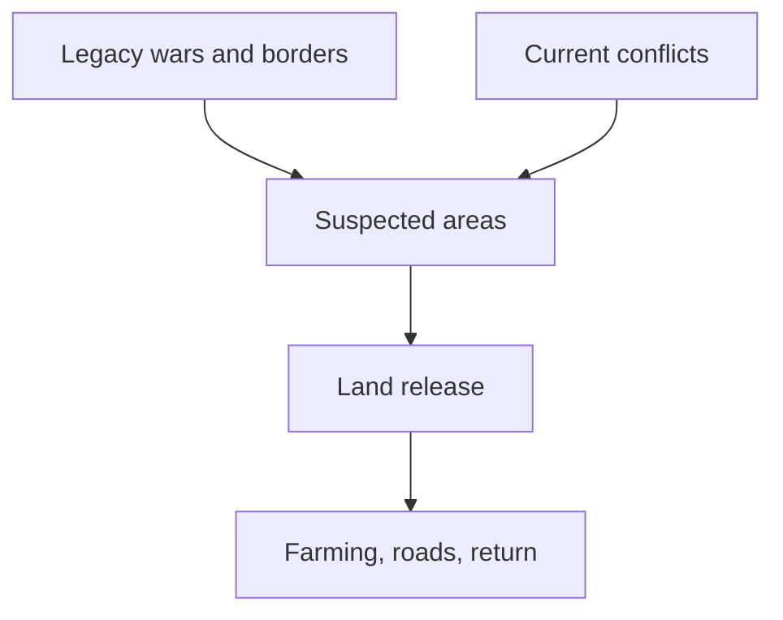

# Global Landmine Contamination and Clearance

## 1. Executive Summary

The most comprehensive public sources available as of 2025 are Landmine Monitor 2025 and Mine Action Review 2025. Landmine Monitor identifies at least 57 states and other areas contaminated by antipersonnel mines: 32 States Parties with current Article 5 clearance deadlines under the Mine Ban Treaty, 22 states not party, and three other areas unable to accede because of political status. Landmine contamination is therefore not a narrow post-war problem. It persists around borders, former front lines, occupation lines, military bases, withdrawal routes, and civil-war zones in places such as Ukraine, Iraq, Afghanistan, Cambodia, Bosnia and Herzegovina, Türkiye's border regions, and Western Sahara. <SourceNote>[Landmine Monitor 2025](https://the-monitor.org/online-reader/landmine-monitor-2025) identifies at least 57 contaminated states and areas, while [Mine Action Review, Clearing the Mines 2025](https://www.mineactionreview.org/documents-and-reports/clearing-the-mines-2025) reports country-level clearance progress.</SourceNote>

Modern clearance is not just a deminer walking a grid with a metal detector. Humanitarian mine action works through land release: non-technical survey, technical survey, cancellation or reduction of hazardous areas, manual clearance, mechanical processing, animal detection, explosive ordnance disposal, quality assurance, and risk education. States Parties reported releasing 1,114.82km2 of contaminated land in 2024 and destroying at least 105,640 antipersonnel mines. Most land released by area came through non-technical survey, which shows that the practical task is often to narrow uncertainty before expensive clearance assets enter the ground. <SourceNote>[Landmine Monitor 2025, Clearance and Land Release](https://the-monitor.org/online-reader/landmine-monitor-2025) and [IMAS 07.11 Land Release](https://www.mineactionstandards.org/standards/07-11/) support this framing.</SourceNote>

Military forces do sometimes remove mines after hostilities, either voluntarily, under ceasefire arrangements, or under treaty and national obligations. The condition is records and control. Modern armed forces are expected to record their own minefields, protect civilians, and provide information after hostilities. In practice, records are often incomplete, lost, inaccurate, politically withheld, or irrelevant to improvised and remotely scattered mines. Civil wars, non-state armed groups, hasty withdrawals, improvised mines, and changing terrain frequently force mine action authorities to rely on survey rather than records alone. <SourceNote>[Anti-Personnel Mine Ban Convention, Articles 5 and 7](https://www.apminebanconvention.org/en/convention-text) require identification, reporting, and clearance, while [GICHD, The Role of the Military in Mine Action](https://www.gichd.org/fileadmin/uploads/gichd/Publications/Role_Military_MA.pdf) discusses the value and limits of military records after hostilities.</SourceNote>

The strategic purpose of mines is counter-mobility. Military doctrine uses minefields to delay, disrupt, turn, fix, or block an enemy, to protect key terrain, to economize forces along a wide front, to cover withdrawals, and to make roads, bridges, bases, and borders costly to use. The humanitarian problem is that a short-term military delay becomes a long-term delay in return, farming, schooling, road repair, power restoration, and reconstruction. Landmine Monitor recorded at least 6,279 mine and explosive remnants of war casualties in 2024. Most recorded casualties with known civilian or military status were civilians, and children were 46% of civilian casualties where age was known. <SourceNote>[Landmine Monitor 2025, Casualties](https://the-monitor.org/online-reader/landmine-monitor-2025) and [JP 3-15 Barriers, Obstacles, and Mine Warfare](https://www.bits.de/NRANEU/others/jp-doctrine/jp3_15pa%282018%29.pdf) support this summary.</SourceNote>

## 2. Global Distribution

Landmine contamination remains both an active-conflict and a legacy-war issue. Landmine Monitor 2025 classifies massive antipersonnel mine contamination, meaning more than 100km2, in Afghanistan, Bosnia and Herzegovina, Cambodia, Ethiopia, Iraq, Türkiye, and Ukraine among States Parties. Ukraine's estimate should be read cautiously because the war is ongoing and large-scale survey is still incomplete. <SourceNote>[Landmine Monitor 2025](https://the-monitor.org/online-reader/landmine-monitor-2025) classifies States Parties by estimated contamination scale.</SourceNote>

The key unit is not only the number of mines. It is land that cannot be used. Contamination blocks farming, school routes, roads, power lines, housing, and the return of displaced people even when no explosion has occurred. Mine action outcomes should therefore be judged by safe land release, restored movement, and public-service recovery as well as mines destroyed. <SourceNote>[IMAS 07.11 Land Release](https://www.mineactionstandards.org/standards/07-11/) defines land release as the process of identifying, defining, and removing all presence and suspicion of explosive ordnance.</SourceNote>

Three patterns recur. The first is border and ceasefire-line contamination, as seen in Korea, Türkiye's border regions, Tajikistan's Afghan border, and Cyprus. The second is civil-war and insurgency contamination, where improvised mines and non-state armed groups are central, as in Colombia, Myanmar, the Sahel, and Yemen. The third is large-scale conventional-war and withdrawal contamination, where former front lines, trenches, bases, roads, and agricultural areas are layered with mines and other explosive ordnance, as in Ukraine, Iraq, Afghanistan, Cambodia, and Bosnia and Herzegovina. <SourceNote>[Landmine Monitor 2025](https://the-monitor.org/online-reader/landmine-monitor-2025) distinguishes state use, non-state use, improvised mines, and border contamination.</SourceNote>

Representative public figures show the scale. At the end of 2024, Bosnia and Herzegovina reported 822.6km2 of antipersonnel mine contamination. Iraq reported 1,312.27km2 of antipersonnel mine contamination plus 317.91km2 of contamination from IEDs including improvised mines. Cambodia reported 424.24km2 as of March 2025. Türkiye reported 219.9km2 in 2024, with most contamination on its borders with Iran, Iraq, and Syria. <SourceNote>[Landmine Monitor 2025 country sections](https://the-monitor.org/online-reader/landmine-monitor-2025) provide these country figures.</SourceNote>

## 3. Clearance Methods

Modern clearance begins by reducing uncertainty. Non-technical survey gathers military records, community testimony, accident data, former front-line information, imagery, terrain evidence, land-use patterns, and displacement or return data. It can cancel a suspected area, reduce its boundaries, or justify technical survey. IMAS 08.10 treats non-technical survey as the starting point for assessing and categorizing suspected or confirmed hazardous areas. <SourceNote>[IMAS 08.10 Non-technical Survey](https://www.mineactionstandards.org/standards/08-10/) defines non-technical survey as desk assessment, historical records, information gathering, analysis, and field visits without technical intervention inside the suspected area.</SourceNote>

Technical survey then uses intrusive methods to confirm the presence, type, distribution, and boundaries of explosive ordnance. It is evidence collection, not automatically full clearance. IMAS 08.20 emphasizes targeted technical survey where possible and requires systematic recording of evidence, boundaries, maps, and GIS data. <SourceNote>[IMAS 08.20 Technical Survey](https://www.mineactionstandards.org/standards/08-20/) places boundary definition, contamination type, information recording, and GIS use at the center of technical survey.</SourceNote>

Clearance itself may use manual detection and excavation, mechanical vegetation and soil processing, animal detection systems, explosive ordnance disposal teams, and remotely operated machines. No method is universal. Low-metal plastic mines, deeply buried mines in sand, rocks, forest, rice fields, urban rubble, improvised mines, and anti-handling devices require different combinations. IMAS 09.10 defines clearance as ensuring removal or destruction of all mines and explosive remnants of war from a specified area to a specified depth. <SourceNote>[IMAS 09.10 Clearance Requirements](https://www.mineactionstandards.org/standards/09-10/) and [IMAS 09.50 Mechanical Land Release](https://www.mineactionstandards.org/standards/09-50/) describe clearance and mechanical methods.</SourceNote>

Quality assurance is not an afterthought. Accreditation, procedures, safety distances, equipment, daily records, supervision, community liaison, and post-clearance inspection create the confidence needed for residents to use the land. Mine action is therefore not only an engineering task. It is also information management, public administration, community participation, medicine, education, and reconstruction planning. <SourceNote>[IMAS 09.10 Clearance Requirements](https://www.mineactionstandards.org/standards/09-10/) requires QA, QC, community involvement, NMAA responsibilities, and registries of cleared and uncleared land.</SourceNote>

## 4. Do Militaries Remove Their Own Mines?

Yes, but the answer is conditional. States Parties to the Mine Ban Treaty must identify mined areas under their jurisdiction or control, mark and protect them, and destroy antipersonnel mines as soon as possible, normally within ten years. Article 7 also requires reporting, to the extent possible, the location of mined areas and details on mine type, quantity, and emplacement timing. This creates a legal framework in which the military, state mine action authorities, international organizations, NGOs, and commercial clearance firms may work together after conflict. <SourceNote>[Anti-Personnel Mine Ban Convention, Articles 5 and 7](https://www.apminebanconvention.org/en/convention-text) define clearance and reporting obligations.</SourceNote>

CCW Amended Protocol II also requires recording information on minefields, mined areas, mines, booby-traps, and other devices, and using that information after hostilities to protect civilians and support removal. Military forces also have their own operational reasons to keep records: friendly movement, prevention of friendly casualties, ceasefire monitoring, post-war governance, and international accountability. In disciplined conventional operations, minefield records should include maps, coordinates, marking, lanes, emplacing units, and mine types. <SourceNote>[CCW Amended Protocol II text hosted by UNODA](https://geneva-s3.unoda.org/static-unoda-site/pages/templates/the-convention-on-certain-conventional-weapons/PROTOCOL%2BII.pdf) and the [ICRC IHL Database, Amended Protocol II](https://ihl-databases.icrc.org/en/ihl-treaties/ccw-amended-protocol-ii-1996) provide the legal basis.</SourceNote>

Records are still often incomplete. Bosnia and Herzegovina had many minefield records after the war, but Mine Action Review 2025 still notes that the overall estimate of contaminated area remains unreliable and inflated. In the Falkland Islands, Argentine mine-laying records and British Royal Engineers maps were used in clearance, but they were incomplete and required additional survey. Records can survive, but war, translation, coordinate error, terrain change, shifting sand, lost files, and political disputes mean they cannot be treated as proof of safety. <SourceNote>[Mine Action Review, Bosnia and Herzegovina 2025](https://www.mineactionreview.org/assets/downloads/BiH_Clearing_the_Mines_2025.pdf), [UK Overseas Territories Association, Falkland Islands mine-free announcement](https://ukota.org/2020/11/falkland-islands-officially-declared-mine-free-on-november-14-2020/), and the [UK Article 7 report for 2019](https://www.apminebanconvention.org/fileadmin/_APMBC-DOCUMENTS/Art7Reports/2020-United-Kingdom-Art7Report-for2019.pdf) support these examples.</SourceNote>

Military clearance and humanitarian clearance also differ. Military clearance opens lanes or breaches for operational movement. It is fast and tactical, but it does not usually release land for civilian use. Humanitarian clearance is slower because it must document the area, depth, quality, residual risk, and handover. Post-conflict recovery needs the second standard. <SourceNote>[GICHD, The Role of the Military in Mine Action](https://www.gichd.org/fileadmin/uploads/gichd/Publications/Role_Military_MA.pdf) distinguishes military roles from humanitarian mine action needs.</SourceNote>

## 5. Strategic Purpose

Mines are best understood as counter-mobility tools. Doctrine uses minefields to disrupt enemy movement, force early deployment, interfere with command and control, turn an enemy into a chosen route, fix forces in a fire sack, or block a breach. The common doctrinal effects are disrupt, turn, fix, and block. <SourceNote>[JP 3-15 Barriers, Obstacles, and Mine Warfare for Joint Operations](https://www.bits.de/NRANEU/others/jp-doctrine/jp3_15pa%282018%29.pdf) describes these tactical minefield effects.</SourceNote>

At the strategic level, mines allow a force to defend a wide frontage with fewer troops, raise the cost of crossing borders, cover withdrawals, protect roads, bridges, airfields, bases, and supply routes, and make occupation or pursuit more difficult. The key translation is grim: wartime delay becomes post-war delay. A minefield that slows an armored advance can later delay farming, school access, road repair, power restoration, and refugee return. <SourceNote>[Landmine Monitor 2025](https://the-monitor.org/online-reader/landmine-monitor-2025) casualty data and the [Mine Ban Treaty preamble](https://www.apminebanconvention.org/en/convention-text) support the connection between mine use, reconstruction, and return.</SourceNote>

Modern contamination is complicated by improvised mines, remotely scattered mines, drone-delivered explosive ordnance, and anti-handling devices. Landmine Monitor 2025 records use or alleged use during the reporting period by Myanmar, Russia, Iran, North Korea, non-state armed groups, and concerns regarding Ukraine. Improvised mines are especially hard to manage through traditional minefield-record systems because they may be produced locally, moved quickly, and underreported in casualty data. <SourceNote>[Landmine Monitor 2025, Use and Production](https://the-monitor.org/online-reader/landmine-monitor-2025) summarizes recent state and non-state use.</SourceNote>

## 6. Conflict Legacies

The legacy is not only casualties, but casualties remain the clearest measure of harm. Landmine Monitor recorded at least 6,279 people killed or injured by mines and explosive remnants of war in 2024, including 1,945 killed and 4,325 injured. Most recorded casualties with known civilian or military status were civilians, and children were 46% of civilian casualties where age was known. These are not only battlefield injuries. They happen during return, farming, collecting wood, traveling, going to school, and playing. <SourceNote>[Landmine Monitor 2025, Casualties](https://the-monitor.org/online-reader/landmine-monitor-2025) reports the 2024 casualty totals and civilian and child shares.</SourceNote>

Related legacies include unexploded ordnance, cluster munition remnants, abandoned ordnance, booby traps, improvised explosive devices, contaminated bases, and ammunition-storage explosions. Lao PDR is the clearest cluster munition example. Landmine and Cluster Munition Monitor reports that more than 270 million submunitions were dropped on Lao PDR during United States air attacks from 1964 to 1973, leaving the world's highest level of unexploded cluster munition remnant contamination. <SourceNote>[Lao PDR country profile, Landmine and Cluster Munition Monitor](https://the-monitor.org/country-profile/lao-pdr/impact) and [Cluster Munition Monitor 2025](https://the-monitor.org/online-reader/cluster-munition-monitor-2025) support this example.</SourceNote>

The economic legacy is equally important. Contamination freezes land rights, agricultural output, road planning, irrigation, school construction, tourism, power lines, and return. Iraq layers contamination from the Iran-Iraq War, the 1991 Gulf War, the 2003 invasion, and ISIS-era improvised mines. Cambodia still carries civil-war and border contamination. Bosnia and Herzegovina still carries suspected land decades after the 1990s war. Mines delay the social end of war long after the military end of war. <SourceNote>[Landmine Monitor 2025](https://the-monitor.org/online-reader/landmine-monitor-2025) country sections for Iraq, Cambodia, and Bosnia and Herzegovina, and [Mine Action Review 2025](https://www.mineactionreview.org/documents-and-reports/clearing-the-mines-2025), support this synthesis.</SourceNote>

## 7. Mine-action assessment points

| Question | Contemporary answer |
| --- | --- |
| Where are minefields concentrated? | Former fronts, borders, bases, withdrawal routes, occupation lines, civil-war areas, and active battle zones |
| How does clearance proceed? | Non-technical survey, technical survey, clearance, quality assurance, and land handover |
| Do militaries remove them? | Sometimes under treaty, ceasefire, or national programs, but humanitarian land release is a separate standard |
| Do placement records survive? | Sometimes, but rarely enough on their own; survey and local evidence remain necessary |
| What is the strategic purpose? | Delay, channel, fix, block, and defend terrain with fewer forces |
| What is the legacy? | Casualties, disability, lost land, blocked return, delayed reconstruction, UXO, cluster remnants, and improvised mines |

The main judgment is that landmines should not be treated only as explosive objects. They turn land into administrative, psychological, and economic uncertainty. Any public assessment should therefore track mine counts, contaminated area, casualties, land released, record quality, risk education, victim assistance, and the reopening of farms, roads, schools, and public services together. <SourceNote>This assessment integrates [IMAS 07.11](https://www.mineactionstandards.org/standards/07-11/), [IMAS 09.10](https://www.mineactionstandards.org/standards/09-10/), and [Landmine Monitor 2025](https://the-monitor.org/online-reader/landmine-monitor-2025).</SourceNote>

## References

- [Landmine Monitor 2025](https://the-monitor.org/online-reader/landmine-monitor-2025)
- [Mine Action Review, Clearing the Mines 2025](https://www.mineactionreview.org/documents-and-reports/clearing-the-mines-2025)
- [Anti-Personnel Mine Ban Convention, Convention Text](https://www.apminebanconvention.org/en/convention-text)
- [International Mine Action Standards, IMAS 07.11 Land Release](https://www.mineactionstandards.org/standards/07-11/)
- [International Mine Action Standards, IMAS 08.10 Non-technical Survey](https://www.mineactionstandards.org/standards/08-10/)
- [International Mine Action Standards, IMAS 08.20 Technical Survey](https://www.mineactionstandards.org/standards/08-20/)
- [International Mine Action Standards, IMAS 09.10 Clearance Requirements](https://www.mineactionstandards.org/standards/09-10/)
- [International Mine Action Standards, IMAS 09.50 Mechanical Land Release](https://www.mineactionstandards.org/standards/09-50/)
- [GICHD, The Role of the Military in Mine Action](https://www.gichd.org/fileadmin/uploads/gichd/Publications/Role_Military_MA.pdf)
- [Cluster Munition Monitor 2025](https://the-monitor.org/online-reader/cluster-munition-monitor-2025)
