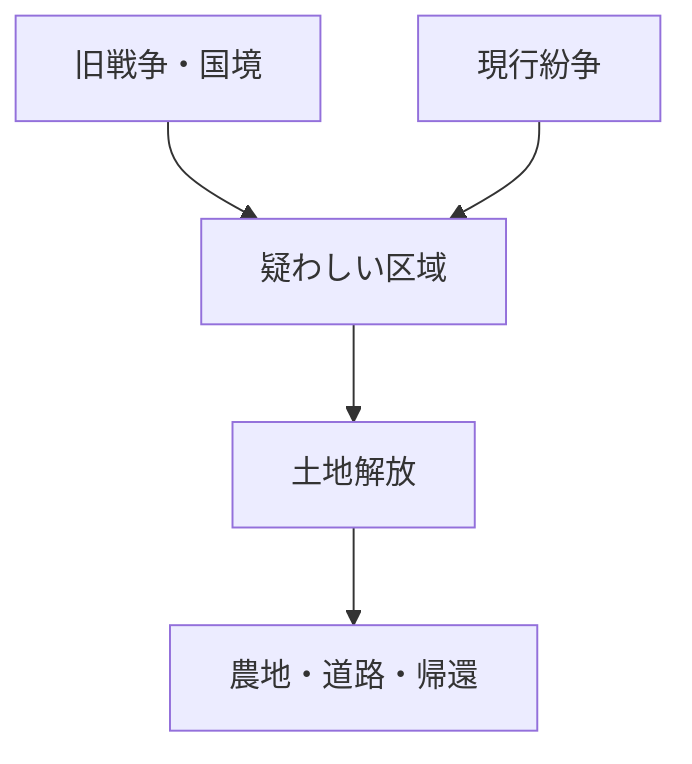

# 世界の地雷原分布と除去方法

## 1. エグゼクティブサマリー

2025年時点で公表されている最も包括的な情報は、Landmine Monitor 2025 と Mine Action Review 2025 である。Landmine Monitor は、少なくとも57の国・地域が対人地雷で汚染されていると整理している。その内訳は、対人地雷禁止条約の第5条義務を負う締約国32、非締約国22、政治的地位のため条約に加入できない3地域である。これは「地雷原が戦争直後の一部地域にだけ残る」という問題ではなく、ウクライナ、イラク、アフガニスタン、カンボジア、ボスニア・ヘルツェゴビナ、トルコ国境地帯、西サハラなど、国境、旧前線、占領線、内戦地域、撤退路、軍事基地周辺に長期化して残る問題である。<SourceNote>[Landmine Monitor 2025](https://the-monitor.org/online-reader/landmine-monitor-2025) は、少なくとも57の国・地域に対人地雷汚染があると整理し、[Mine Action Review, Clearing the Mines 2025](https://www.mineactionreview.org/documents-and-reports/clearing-the-mines-2025) は国別の除去進捗を報告している。</SourceNote>

除去は「金属探知機で順番に掘る」だけではない。現代の人道的地雷対策は、非技術調査、技術調査、危険区域の縮小・取消し、手作業の除去、機械処理、探知犬・動物探知、爆発物処理、品質保証、住民へのリスク教育を組み合わせる「land release」という工程で進む。Landmine Monitor によれば、締約国は2024年に1,114.82平方キロメートルの汚染地を解放し、少なくとも105,640個の対人地雷を破壊した。解放面積の大半は非技術調査によるもので、これは「疑わしい土地をすべて掘る」のではなく、証拠に基づいて本当に危険な区域を絞り込む実務が中心になっていることを示す。<SourceNote>[Landmine Monitor 2025, Clearance and Land Release](https://the-monitor.org/online-reader/landmine-monitor-2025) と [IMAS 07.11 Land Release](https://www.mineactionstandards.org/standards/07-11/) に基づく。</SourceNote>

戦争・紛争終結時に軍が自発的または義務として除去に関与するケースはある。ただし、成功する条件は限られる。近代的な軍が自軍の地雷原を記録し、停戦・撤退・条約履行の一部として情報を提供し、軍工兵または政府の地雷対策機関が除去する例はある。一方で、内戦、非国家武装勢力、即席地雷、散布地雷、撤退時の急造地雷、失われた記録、政治的に係争中の地域では、配置情報が不完全または存在しないことが多い。したがって、公開記録や軍の地図があっても、それだけで安全とは判断できない。<SourceNote>[Anti-Personnel Mine Ban Convention, Article 5 and Article 7](https://www.apminebanconvention.org/en/convention-text) は汚染区域の特定・報告・除去を求め、[GICHD, The Role of the Military in Mine Action](https://www.gichd.org/fileadmin/uploads/gichd/Publications/Role_Military_MA.pdf) は停戦後の軍事記録提供の有用性と限界を整理している。</SourceNote>

地雷設置の軍事目的は、敵を無差別に殺傷することだけではない。軍事教義上は、敵の機動を遅らせる、特定方向へ誘導する、火力圏に固定する、突破を阻止する、重要地形・国境・基地を守る、撤退を覆う、少ない兵力で広い面を防御する、といった counter-mobility の手段である。しかし、作戦上の短期効用は、戦後には農地・道路・住宅・学校・水源・帰還・復興を止める長期被害へ転化する。Landmine Monitor は2024年に地雷・爆発性戦争残存物による死傷者を少なくとも6,279人記録し、軍民区分が分かる被害者の大多数は民間人、年齢が分かる民間人被害の46%は子どもだったと報告している。<SourceNote>[Landmine Monitor 2025, Casualties](https://the-monitor.org/online-reader/landmine-monitor-2025) と [JP 3-15 Barriers, Obstacles, and Mine Warfare](https://www.bits.de/NRANEU/others/jp-doctrine/jp3_15pa%282018%29.pdf) に基づく。</SourceNote>

## 2. どこに多いのか

地雷汚染は、現在の戦闘地域だけでなく、過去の戦争の地層として残る。Landmine Monitor 2025 は、締約国の対人地雷汚染を規模別に分類している。100平方キロメートル超の「massive」汚染は、アフガニスタン、ボスニア・ヘルツェゴビナ、カンボジア、エチオピア、イラク、トルコ、ウクライナに報告されている。ただし、ウクライナの面積は戦闘継続中で大規模調査が終わっておらず、確定値ではなく粗い推定として読む必要がある。<SourceNote>[Landmine Monitor 2025](https://the-monitor.org/online-reader/landmine-monitor-2025) は、締約国の汚染規模を massive、large、medium、small、unknown に分類している。</SourceNote>

この図は、地雷問題を「地雷の個数」ではなく「使えない土地」として読むためのものだ。地雷が残ると、実際に爆発していない土地でも、農業、通学、道路補修、送電線、住宅再建、難民帰還が止まる。したがって、地雷対策の成果は、破壊した地雷数だけでなく、安全に解放された土地、住民の移動再開、公共サービスの復旧で測る必要がある。<SourceNote>[IMAS 07.11 Land Release](https://www.mineactionstandards.org/standards/07-11/) は、地雷・爆発物の存在または疑いを特定・定義・除去する工程として land release を定義している。</SourceNote>

地域別には、いくつかの型がある。第一は、冷戦・国境防衛型である。朝鮮半島、トルコのイラン・イラク・シリア国境、タジキスタンのアフガニスタン国境、キプロスの緩衝地帯のように、国境や停戦線そのものが地雷原になった。第二は、内戦・反乱型である。コロンビア、ミャンマー、サヘル諸国、イエメンでは、即席地雷や非国家武装勢力による使用が問題になる。第三は、大規模通常戦争・占領撤退型である。ウクライナ、イラク、アフガニスタン、カンボジア、ボスニア・ヘルツェゴビナでは、旧前線、塹壕線、基地周辺、撤退路、農地、都市近郊が複合的に汚染されている。<SourceNote>[Landmine Monitor 2025](https://the-monitor.org/online-reader/landmine-monitor-2025) は、国家使用、非国家武装勢力による使用、即席地雷、国境汚染を分けて整理している。</SourceNote>

代表的な公表値を挙げると、2024年末時点でボスニア・ヘルツェゴビナは822.6平方キロメートル、イラクは対人地雷汚染1,312.27平方キロメートルに加えてIED・即席地雷を含む317.91平方キロメートル、カンボジアは2025年3月時点で424.24平方キロメートルを報告している。トルコは2024年に219.9平方キロメートルを報告し、多くはイラン・イラク・シリア国境にある。<SourceNote>[Landmine Monitor 2025 country sections](https://the-monitor.org/online-reader/landmine-monitor-2025) の Bosnia and Herzegovina、Iraq、Cambodia、Türkiye の記述に基づく。</SourceNote>

## 3. 除去方法

現代の地雷除去は、危険地に入って一つずつ探す前に、情報を絞り込む。最初の工程は非技術調査で、軍の記録、住民証言、事故記録、過去の戦線、衛星画像、地形、農地利用、避難・帰還情報を集める。これにより、疑わしい危険区域を取り消す、縮小する、または技術調査へ進める。IMAS 08.10 は、非技術調査を危険区域の評価と分類の出発点とし、低コストで大きな面積を解放できる工程として位置づけている。<SourceNote>[IMAS 08.10 Non-technical Survey](https://www.mineactionstandards.org/standards/08-10/) は、机上調査、歴史記録、情報収集、現地訪問を含む非技術的手段を定義している。</SourceNote>

技術調査では、危険区域の内側または境界で、探知機、試掘、機械、探知犬などの資産を使い、汚染の存在、種類、分布、境界を確認する。重要なのは、技術調査が「全域除去」ではなく、どこを本当に除去すべきかを決める証拠集めである点だ。IMAS 08.20 は、対象を絞った技術調査を基本とし、発見した証拠、判断、境界、地図、GIS情報を記録することを求めている。<SourceNote>[IMAS 08.20 Technical Survey](https://www.mineactionstandards.org/standards/08-20/) は、危険区域の境界、汚染の性質、記録、GIS利用を技術調査の中核に置いている。</SourceNote>

実際の除去には、手作業の探知と掘削、機械による植生除去・土壌処理・破砕、探知犬や動物探知、爆発物処理班による現場処理、遠隔操作機械による処理が使われる。万能の方法はない。金属量が少ないプラスチック地雷、砂で深く埋まった地雷、岩場・森林・水田・都市がれき、即席地雷、対処妨害装置付き地雷では、方法を組み合わせる必要がある。IMAS 09.10 は、指定区域と指定深度からすべての地雷・爆発性戦争残存物を除去・破壊したと確認できる状態を clearance とする。<SourceNote>[IMAS 09.10 Clearance Requirements](https://www.mineactionstandards.org/standards/09-10/) と [IMAS 09.50 Mechanical Land Release](https://www.mineactionstandards.org/standards/09-50/) に基づく。</SourceNote>

品質保証は、除去後に初めて重要になるのではない。組織の認証、作業手順、安全距離、装備、日々の記録、現場監督、住民説明、事後検査までを通じて、土地を受け取る住民が「使ってよい」と判断できる信頼を作る工程である。地雷対策は純粋な工兵作業ではなく、情報管理、行政、住民参加、医療、教育、復興計画の仕事でもある。<SourceNote>[IMAS 09.10 Clearance Requirements](https://www.mineactionstandards.org/standards/09-10/) は、QA、QC、住民関与、NMAA の責任、除去済み・未除去土地の登録を求めている。</SourceNote>

## 4. 軍が自主的に除去するのか

答えは「あるが、常に期待できるわけではない」である。対人地雷禁止条約の締約国は、管轄・支配下の地雷区域を特定し、標識・監視・柵などで民間人を排除し、原則10年以内に除去する義務を負う。透明性措置として、地雷区域の位置、種類、数量、敷設時期を可能な限り報告する義務もある。したがって、軍・政府が戦後に情報を出し、軍工兵、政府機関、国際機関、NGO、商業除去会社が連携して除去する制度は存在する。<SourceNote>[Anti-Personnel Mine Ban Convention, Article 5 and Article 7](https://www.apminebanconvention.org/en/convention-text) は、除去義務と汚染区域の報告義務を定めている。</SourceNote>

CCW Amended Protocol II も、地雷原・地雷区域・ブービートラップ等に関する情報の記録と、戦闘停止後の民間人保護・情報提供・除去を求める。軍事的には、自軍の安全な移動、友軍被害の防止、停戦監視、戦後統治、国際評価のためにも地雷原記録は必要になる。規律ある通常軍では、敷設時に地図、座標、標識、通路、敷設部隊、地雷種別を記録するのが本来の運用である。<SourceNote>[CCW Amended Protocol II text hosted by UNODA](https://geneva-s3.unoda.org/static-unoda-site/pages/templates/the-convention-on-certain-conventional-weapons/PROTOCOL%2BII.pdf) と [ICRC IHL Database, Amended Protocol II](https://ihl-databases.icrc.org/en/ihl-treaties/ccw-amended-protocol-ii-1996) に基づく。</SourceNote>

しかし、実務では記録はしばしば不完全である。ボスニア・ヘルツェゴビナでは、紛争直後に多数の地雷原記録が存在したが、実際の汚染推定は長く過大・不確実であり、2025年の Mine Action Review も信頼できる全体推定の不足を指摘している。フォークランド諸島では、アルゼンチン側の敷設記録や英軍工兵が作った戦後地図が除去に使われたが、完全ではなく、追加調査が必要だった。つまり、配置資料は残ることがあるが、戦場の混乱、翻訳、座標誤差、地形変化、砂丘移動、記録喪失で、除去の唯一の根拠にはならない。<SourceNote>[Mine Action Review, Bosnia and Herzegovina 2025](https://www.mineactionreview.org/assets/downloads/BiH_Clearing_the_Mines_2025.pdf)、[UK Overseas Territories Association, Falkland Islands mine-free announcement](https://ukota.org/2020/11/falkland-islands-officially-declared-mine-free-on-november-14-2020/)、[UK Article 7 report for 2019](https://www.apminebanconvention.org/fileadmin/_APMBC-DOCUMENTS/Art7Reports/2020-United-Kingdom-Art7Report-for2019.pdf) に基づく。</SourceNote>

軍が関与する除去にも二種類ある。第一は軍事的除去で、作戦継続のために車両通路や突破口を開く。これは速いが、通常は人道的な土地解放の基準を満たさない。第二は人道的除去で、住民が土地を安全に使えることを目的に、記録、品質保証、引渡しまで行う。戦争終結後に必要なのは後者であり、軍の自発的撤去だけでは農地や住宅地の安全を保証できないことが多い。<SourceNote>[GICHD, The Role of the Military in Mine Action](https://www.gichd.org/fileadmin/uploads/gichd/Publications/Role_Military_MA.pdf) は、軍の役割と人道的地雷対策の違いを整理している。</SourceNote>

## 5. 地雷設置の戦略上の目的

地雷は、単独で勝敗を決める兵器というより、障害物、火力、監視、地形利用を組み合わせるための道具である。軍事教義では、地雷原は敵の機動を妨害し、隊形を乱し、早期展開を強制し、指揮統制を阻害し、味方火力が効く場所に敵を誘導する。米軍の障害教義では、代表的な効果は disrupt、turn、fix、block と整理される。すなわち、敵を乱す、進路を変える、一定地点に固定する、突破を止める、という機能である。<SourceNote>[JP 3-15 Barriers, Obstacles, and Mine Warfare for Joint Operations](https://www.bits.de/NRANEU/others/jp-doctrine/jp3_15pa%282018%29.pdf) は、地雷原の戦術効果を disrupt、turn、fix、block と整理している。</SourceNote>

戦略レベルでは、地雷は少ない兵力で広い正面を守る、国境の通過コストを上げる、撤退後も敵の追撃を遅らせる、補給路・橋・道路・滑走路・基地周辺を使いにくくする、占領地の支配を補助する、住民の帰還を抑える、といった目的に使われる。ここで重要なのは、軍事上の「遅延」が、民間社会では「復興の遅延」に変わることだ。戦時には敵車両を止めるための地雷原が、戦後には農民、子ども、避難民、道路工事、送電復旧を止める。<SourceNote>[Landmine Monitor 2025](https://the-monitor.org/online-reader/landmine-monitor-2025) の被害統計と、[AP Mine Ban Convention preamble](https://www.apminebanconvention.org/en/convention-text) の経済復興・難民帰還阻害の記述に基づく。</SourceNote>

現代では、従来型の工場製地雷だけでなく、即席地雷、遠隔散布地雷、ドローンで投下される爆発物、対処妨害装置付き地雷が問題を複雑にしている。Landmine Monitor 2025 は、2024年から2025年の報告期間に、ミャンマー、ロシア、イラン、北朝鮮、非国家武装勢力による使用、さらにウクライナでの使用をめぐる懸念を記録している。即席地雷は、従来の地雷禁止条約の枠組みだけでは現場把握が難しく、事故データも過少記録になりやすい。<SourceNote>[Landmine Monitor 2025, Use and Production](https://the-monitor.org/online-reader/landmine-monitor-2025) は、国家・非国家主体による対人地雷と即席地雷の使用を整理している。</SourceNote>

## 6. 戦後に残る負の遺産

地雷が残す負の遺産は、死傷者だけではない。Landmine Monitor 2025 は、2024年に地雷・爆発性戦争残存物による死傷者を少なくとも6,279人、うち死亡1,945人、負傷4,325人と記録した。軍民区分が分かる被害の大多数は民間人で、年齢が分かる民間人被害の46%は子どもだった。これは、戦闘員が戦場で受ける被害ではなく、戦争後の生活空間に残った兵器が、帰宅、農作業、薪拾い、通学、遊び、道路移動の中で爆発する問題である。<SourceNote>[Landmine Monitor 2025, Casualties](https://the-monitor.org/online-reader/landmine-monitor-2025) は、2024年の地雷・ERW死傷者、民間人比率、子どもの比率を報告している。</SourceNote>

同種の負の遺産には、不発弾、クラスター弾残存物、放棄弾薬、ブービートラップ、即席爆発装置、汚染された軍事基地、弾薬庫爆発後の残存物がある。ラオスはクラスター弾残存物の代表例で、Landmine and Cluster Munition Monitor は、1964年から1973年の米国による空爆で2億7,000万個超の子弾が投下され、現在も世界最大級のクラスター弾残存物汚染があると整理している。地雷と違い、クラスター子弾は広範囲に散らばり、農地・森・学校周辺に小型の不発弾として残る。<SourceNote>[Lao PDR country profile, Landmine and Cluster Munition Monitor](https://the-monitor.org/country-profile/lao-pdr/impact) と [Cluster Munition Monitor 2025](https://the-monitor.org/online-reader/cluster-munition-monitor-2025) に基づく。</SourceNote>

経済的な遺産も大きい。地雷汚染地は、土地所有権、農地価格、道路計画、灌漑、学校建設、観光、送電線、避難民帰還を長期間止める。イラクでは1980年代のイラン・イラク戦争、1991年湾岸戦争、2003年侵攻、ISIS期の即席地雷が重なった。カンボジアでは内戦と国境地域の汚染が残り、ボスニア・ヘルツェゴビナでは1990年代の戦争から30年以上たっても疑わしい土地が残る。つまり、地雷は戦争の終わりを社会の終わりに遅らせる装置である。<SourceNote>[Landmine Monitor 2025](https://the-monitor.org/online-reader/landmine-monitor-2025) の Iraq、Cambodia、Bosnia and Herzegovina の国別記述と [Mine Action Review 2025](https://www.mineactionreview.org/documents-and-reports/clearing-the-mines-2025) に基づく。</SourceNote>

## 7. 判断のための要点

実務的には、次のように読むのがよい。

| 問い | 現代の答え |
| --- | --- |
| 地雷原はどこに多いか | 旧前線、国境、基地周辺、撤退路、占領線、内戦地域、現行戦闘地域に集中する |
| 除去はどう進むか | 非技術調査、技術調査、除去、品質保証、土地引渡しを組み合わせる |
| 軍が除去するか | 条約義務・停戦合意・国家事業として関与することはあるが、人道的基準の除去は別工程 |
| 配置情報は残るか | 残る場合があるが、完全とは限らず、現地調査と照合が必要 |
| 戦略目的は何か | 敵の機動を遅らせ、誘導し、固定し、阻止し、少ない兵力で地形を防御する |
| 負の遺産は何か | 死傷、障害、農地喪失、帰還阻害、復興遅延、不発弾・クラスター弾・即席地雷の複合汚染 |

最も重要な結論は、地雷問題を「爆発物の除去」だけで捉えないことだ。実際には、地雷は土地を行政上・心理上・経済上使えなくする。だから、公開情報から状況を評価するなら、地雷数、汚染面積、死傷者、解放面積、記録の質、住民リスク教育、医療・義肢・社会復帰、農地・道路・学校の再開を同時に見る必要がある。<SourceNote>[IMAS 07.11](https://www.mineactionstandards.org/standards/07-11/)、[IMAS 09.10](https://www.mineactionstandards.org/standards/09-10/)、[Landmine Monitor 2025](https://the-monitor.org/online-reader/landmine-monitor-2025) を統合した実務上の読み方である。</SourceNote>

## 参考情報

- [Landmine Monitor 2025](https://the-monitor.org/online-reader/landmine-monitor-2025)
- [Mine Action Review, Clearing the Mines 2025](https://www.mineactionreview.org/documents-and-reports/clearing-the-mines-2025)
- [Anti-Personnel Mine Ban Convention, Convention Text](https://www.apminebanconvention.org/en/convention-text)
- [International Mine Action Standards, IMAS 07.11 Land Release](https://www.mineactionstandards.org/standards/07-11/)
- [International Mine Action Standards, IMAS 08.10 Non-technical Survey](https://www.mineactionstandards.org/standards/08-10/)
- [International Mine Action Standards, IMAS 08.20 Technical Survey](https://www.mineactionstandards.org/standards/08-20/)
- [International Mine Action Standards, IMAS 09.10 Clearance Requirements](https://www.mineactionstandards.org/standards/09-10/)
- [International Mine Action Standards, IMAS 09.50 Mechanical Land Release](https://www.mineactionstandards.org/standards/09-50/)
- [GICHD, The Role of the Military in Mine Action](https://www.gichd.org/fileadmin/uploads/gichd/Publications/Role_Military_MA.pdf)
- [Cluster Munition Monitor 2025](https://the-monitor.org/online-reader/cluster-munition-monitor-2025)
