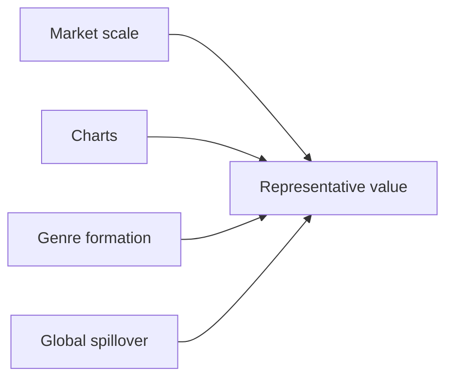

## 1. How to Read This Guide

This guide organizes popular music by asking which artists make each era legible. It focuses on popular recording artists rather than classical music: artists heard through records, charts, television, live performance, streaming, and social media. <SourceNote>For the current recorded-music market, this guide uses IFPI's [Global Music Report 2026](https://www.ifpi.org/global-music-report-2026-global-recorded-music-revenues-grow-6-4-as-record-companies-drive-innovation/) and [Global Charts](https://www.ifpi.org/our-industry/global-charts/). For historical Anglo-American pop stardom, it refers to Billboard's [Greatest Pop Stars by Year](https://www.billboard.com/lists/billboard-greatest-pop-stars-year/) and [Greatest Pop Stars of the 21st Century](https://www.billboard.com/music/pop/beyonce-greatest-pop-stars-21st-century-1235842572/).</SourceNote>

The eras are the 1980s, 1990s, 2000s, 2010s, 2020s, and today. Today means artists whose activity, listening, chart presence, touring, social visibility, or international reach remains important as of June 2026, so it can overlap with the 2020s. The selected countries and markets are the United States, United Kingdom, Japan, South Korea, France, Germany, Brazil, Nigeria, India, and the Chinese-language market.

This is not a strict ranking. The selections combine sales, chart performance, critical reputation, genre formation, international spillover, and influence on later artists. <SourceNote>IFPI reports that Japan returned to being the world's second-largest recorded-music market in 2025, China overtook Germany to become the fourth-largest market, and Brazil moved up to number eight [Global Music Report 2026](https://www.ifpi.org/global-music-report-2026-global-recorded-music-revenues-grow-6-4-as-record-companies-drive-innovation/).</SourceNote>

## 2. United States

### 1980s

1. **Michael Jackson** - From Motown child star to global solo icon, he defined the MTV age through video, dance, R&B, and pop.
2. **Madonna** - Emerging from New York club culture, she fused music, fashion, video, and sexual self-presentation.
3. **Prince** - Based in Minneapolis, he merged funk, rock, R&B, production, and performance into an auteur model.
4. **Whitney Houston** - Rooted in gospel and R&B, she became the definitive late-1980s pop-ballad vocalist.
5. **Bruce Springsteen** - He joined working-class narrative, American rock, and stadium performance into a national figure.

### 1990s

1. **Mariah Carey** - Her vocal range and R&B-inflected pop dominated U.S. charts from the early 1990s.
2. **Nirvana** - The Seattle band made grunge mainstream and changed rock after 1980s gloss.
3. **Tupac Shakur** - He combined West Coast hip-hop, social commentary, biography, and posthumous myth.
4. **Dr. Dre** - After N.W.A., he defined G-funk and became the production link to Snoop Dogg and Eminem.
5. **Garth Brooks** - He pushed country into an arena-scale pop market and changed its commercial reach.

### 2000s

1. **Beyoncé** - Moving from Destiny's Child to solo work, she integrated R&B, pop, visuals, and live spectacle.
2. **Eminem** - From Detroit, he expanded mainstream hip-hop as a white rapper with technical force.
3. **Kanye West** - He moved from producer to rapper and reshaped sampling, fashion, and album design.
4. **Britney Spears** - She became the teen-pop symbol of late MTV and peak CD-era star marketing.
5. **Alicia Keys** - She connected classical piano with R&B and widened the neo-soul singer-songwriter model.

### 2010s

1. **Taylor Swift** - Moving from country to pop, she shaped songwriting, fan economics, and rerecording strategy.
2. **Drake** - Canadian-born but central to U.S. hip-hop/R&B, he embodied streaming-era single consumption.
3. **Lady Gaga** - She built a star persona from dance-pop, theatre, fashion, and LGBTQ+ advocacy.
4. **Kendrick Lamar** - He defined 2010s hip-hop through conscious rap, jazz/funk inheritance, and album narrative.
5. **Billie Eilish** - With bedroom-pop production and dark minimalism, she became a late-2010s Gen Z star.

### 2020s

1. **Taylor Swift** - Tours, rerecordings, and rapid album cycles made her a symbol of early-2020s global music consumption.
2. **Beyoncé** - She reframed house, country, and Black music history through concept-driven albums.
3. **Morgan Wallen** - He represents the streaming-era expansion of country music beyond its older frame.
4. **SZA** - Her alternative R&B and inward lyric writing define long-tail 2020s R&B listening.
5. **Olivia Rodrigo** - From Disney roots, she turned toward rock-inflected Gen Z pop with global reach.

### Today

1. **Taylor Swift** - She topped IFPI's 2025 Global Artist Chart and remains a catalogue-wide listening force.
2. **Kendrick Lamar** - He remains a U.S. hip-hop reference point through craft, live performance, and social context.
3. **Billie Eilish** - She keeps critical and youth-audience strength with sparse, intimate pop.
4. **Sabrina Carpenter** - Moving from acting into international pop hits, she reached IFPI's 2025 global upper tier.
5. **SZA** - She sustains strong album and track listening across R&B and pop audiences.

## 3. United Kingdom

### 1980s

1. **Queen** - With earlier foundations already built, Queen became an emblem of British rock mass appeal and live power.
2. **David Bowie** - In the 1980s he re-expanded as a global pop star while keeping the model of artist-as-transformation.
3. **George Michael** - From Wham! to solo work, he brought British R&B-leaning pop to the world market.
4. **Kate Bush** - She established a singular singer-songwriter model built on experiment, literature, and movement.
5. **The Smiths** - From Manchester, they shaped indie rock through lyrics and guitar language.

### 1990s

1. **Oasis** - They became Britpop's mass peak and revived a working-class rock narrative.
2. **Blur** - They represented Britpop's urban and art-school side before moving into experimentation.
3. **Spice Girls** - They linked girl-group pop, merchandising, media strategy, and 1990s identity language.
4. **Radiohead** - They moved from alternative rock to electronic experiment and changed album expectations.
5. **The Prodigy** - They carried rave, big beat, and rock physicality into global popular culture.

### 2000s

1. **Coldplay** - After Britpop, they became a global stadium band built on melodic rock.
2. **Amy Winehouse** - She reworked jazz, soul, and R&B into a modern voice with lasting influence.
3. **Adele** - Emerging at the end of the decade, she prepared the next decade's vocal-ballad dominance.
4. **Arctic Monkeys** - Internet word-of-mouth helped them become the new face of British guitar rock.
5. **Muse** - They combined progressive rock, electronics, and stadium theatricality.

### 2010s

1. **Adele** - She sold albums globally at a scale that bridged the pre-streaming and streaming eras.
2. **Ed Sheeran** - From loop-pedal solo performance, he became a global pop songwriter and performer.
3. **One Direction** - The TV-formed boy band expanded fandom in the social-media era.
4. **Dua Lipa** - She connected dance-pop and fashion into an international British pop-star model.
5. **Sam Smith** - Their soulful voice and ballads reached global charts.

### 2020s

1. **Harry Styles** - After One Direction, he crossed rock, pop, fashion, and film-like celebrity.
2. **Dua Lipa** - She reinforced disco and dance-pop as a durable international lane.
3. **Adele** - With infrequent releases, she still commands global album attention.
4. **Central Cee** - He brought UK drill into broader international hip-hop circulation.
5. **Raye** - After writing for others, her independent breakthrough combined industry critique and vocal craft.

### Today

1. **Dua Lipa** - She remains Britain's leading global dance-pop export.
2. **Raye** - Her writing, voice, and industry narrative make her a current British-pop focal point.
3. **Charli xcx** - She connects club culture, hyperpop, and internet culture in 2020s pop criticism.
4. **Central Cee** - He pushes British rap into U.S. and European listening circuits.
5. **Fred again..** - The producer turned electronic live performance into mass, improvisational pop spectacle.

## 4. Japan

### 1980s

1. **サザンオールスターズ** - A national band that broadened the blend of pop, rock, and kayokyoku.
2. **松任谷由実** - She defined urban lyricism and the Japanese female singer-songwriter model.
3. **松田聖子** - She built the 1980s Japanese idol template through songs, television, and image.
4. **中森明菜** - She pushed idol singing toward darker expression and performance maturity.
5. **Yellow Magic Orchestra** - Their technopop and design sensibility influenced pop and electronic music internationally.

### 1990s

1. **Mr.Children** - They joined introspective lyrics with mass J-pop band success.
2. **B'z** - Their guitar-driven hard-rock pop produced massive Japanese sales.
3. **DREAMS COME TRUE** - They sat at the center of 1990s J-pop through R&B, pop, and live strength.
4. **安室奈美恵** - She became a dance-pop and fashion icon under and after Tetsuya Komuro.
5. **宇多田ヒカル** - Arriving in the late 1990s, she changed J-pop language through R&B feel and authorship.

### 2000s

1. **浜崎あゆみ** - Lyrics, visuals, and fan culture made her a defining early-2000s J-pop star.
2. **宇多田ヒカル** - Her albums kept a high standard of craft and international pop/R&B sensibility.
3. **嵐** - The idol group linked television, live shows, CD sales, and national popularity.
4. **EXILE** - They expanded the Japanese dance-and-vocal group model.
5. **倖田來未** - She foregrounded R&B, dance, and female self-presentation in 2000s pop.

### 2010s

1. **AKB48** - Theater shows, handshakes, and elections turned participation into idol-market scale.
2. **Perfume** - With Yasutaka Nakata's electronics and precise choreography, they updated Japanese technopop.
3. **ONE OK ROCK** - They connected domestic rock with international touring.
4. **米津玄師** - From Vocaloid culture, he entered the mainstream while keeping authorship.
5. **星野源** - As actor, writer, and musician, he spread everyday-feeling pop across media.

### 2020s

1. **YOASOBI** - Fiction-based production and streaming hits extended Japanese-language pop overseas.
2. **Ado** - With hidden-face performance and Vocaloid-network roots, she reached young listeners quickly.
3. **Official髭男dism** - Their band performance and sophisticated pop writing anchor streaming-era J-pop.
4. **King Gnu** - They join art-school aesthetics, rock, mix, and major tie-ins.
5. **Creepy Nuts** - Hip-hop, television, and anime themes gave them international track visibility.

### Today

1. **Mrs. GREEN APPLE** - The band is highly visible in mid-2020s Japanese charts and live culture.
2. **米津玄師** - His Vocaloid-rooted authorship remains powerful across film, anime, and game themes.
3. **YOASOBI** - Anime, overseas festivals, and streaming keep extending Japanese-language reach.
4. **Snow Man** - They show the continuing strength of physical sales, video, live shows, and fandom.
5. **Ado** - Her voice and relative anonymity support domestic and international touring.

## 5. South Korea

### 1980s

1. **Cho Yong-pil** - Cho Yong-pil is a representative entry point for the 1980s. It shows Korean popular music before and after K-pop through national singers, rock, television pop, and dance culture.
2. **Lee Moon-sae** - Lee Moon-sae is a representative entry point for the 1980s. It shows Korean popular music before and after K-pop through national singers, rock, television pop, and dance culture.
3. **Kim Wan-sun** - Kim Wan-sun is a representative entry point for the 1980s. It shows Korean popular music before and after K-pop through national singers, rock, television pop, and dance culture.
4. **Deulgukhwa** - Deulgukhwa is a representative entry point for the 1980s. It shows Korean popular music before and after K-pop through national singers, rock, television pop, and dance culture.
5. **Nami** - Nami is a representative entry point for the 1980s. It shows Korean popular music before and after K-pop through national singers, rock, television pop, and dance culture.

### 1990s

1. **Seo Taiji and Boys** - Seo Taiji and Boys is a representative entry point for the 1990s. It shows Korean popular music before and after K-pop through national singers, rock, television pop, and dance culture.
2. **H.O.T.** - H.O.T. is a representative entry point for the 1990s. It shows Korean popular music before and after K-pop through national singers, rock, television pop, and dance culture.
3. **S.E.S.** - S.E.S. is a representative entry point for the 1990s. It shows Korean popular music before and after K-pop through national singers, rock, television pop, and dance culture.
4. **Kim Gun-mo** - Kim Gun-mo is a representative entry point for the 1990s. It shows Korean popular music before and after K-pop through national singers, rock, television pop, and dance culture.
5. **Deux** - Deux is a representative entry point for the 1990s. It shows Korean popular music before and after K-pop through national singers, rock, television pop, and dance culture.

### 2000s

1. **BoA** - BoA is a representative entry point for the 2000s. It shows Korean popular music before and after K-pop through national singers, rock, television pop, and dance culture.
2. **TVXQ!** - TVXQ! is a representative entry point for the 2000s. It shows Korean popular music before and after K-pop through national singers, rock, television pop, and dance culture.
3. **BIGBANG** - BIGBANG is a representative entry point for the 2000s. It shows Korean popular music before and after K-pop through national singers, rock, television pop, and dance culture.
4. **Girls' Generation** - Girls' Generation is a representative entry point for the 2000s. It shows Korean popular music before and after K-pop through national singers, rock, television pop, and dance culture.
5. **Wonder Girls** - Wonder Girls is a representative entry point for the 2000s. It shows Korean popular music before and after K-pop through national singers, rock, television pop, and dance culture.

### 2010s

1. **BTS** - BTS is a representative entry point for the 2010s. It shows Korean popular music before and after K-pop through national singers, rock, television pop, and dance culture.
2. **BLACKPINK** - BLACKPINK is a representative entry point for the 2010s. It shows Korean popular music before and after K-pop through national singers, rock, television pop, and dance culture.
3. **EXO** - EXO is a representative entry point for the 2010s. It shows Korean popular music before and after K-pop through national singers, rock, television pop, and dance culture.
4. **TWICE** - TWICE is a representative entry point for the 2010s. It shows Korean popular music before and after K-pop through national singers, rock, television pop, and dance culture.
5. **IU** - IU is a representative entry point for the 2010s. It shows Korean popular music before and after K-pop through national singers, rock, television pop, and dance culture.

### 2020s

1. **Stray Kids** - Stray Kids is a representative entry point for the 2020s. It shows Korean popular music before and after K-pop through national singers, rock, television pop, and dance culture.
2. **SEVENTEEN** - SEVENTEEN is a representative entry point for the 2020s. It shows Korean popular music before and after K-pop through national singers, rock, television pop, and dance culture.
3. **NewJeans** - NewJeans is a representative entry point for the 2020s. It shows Korean popular music before and after K-pop through national singers, rock, television pop, and dance culture.
4. **aespa** - aespa is a representative entry point for the 2020s. It shows Korean popular music before and after K-pop through national singers, rock, television pop, and dance culture.
5. **IVE** - IVE is a representative entry point for the 2020s. It shows Korean popular music before and after K-pop through national singers, rock, television pop, and dance culture.

### Today

1. **Stray Kids** - Stray Kids is a representative entry point for the Today. It shows Korean popular music before and after K-pop through national singers, rock, television pop, and dance culture.
2. **SEVENTEEN** - SEVENTEEN is a representative entry point for the Today. It shows Korean popular music before and after K-pop through national singers, rock, television pop, and dance culture.
3. **BTS** - BTS is a representative entry point for the Today. It shows Korean popular music before and after K-pop through national singers, rock, television pop, and dance culture.
4. **BLACKPINK** - BLACKPINK is a representative entry point for the Today. It shows Korean popular music before and after K-pop through national singers, rock, television pop, and dance culture.
5. **aespa** - aespa is a representative entry point for the Today. It shows Korean popular music before and after K-pop through national singers, rock, television pop, and dance culture.

## 6. France

### 1980s

1. **Mylène Farmer** - Mylène Farmer is a representative entry point for the 1980s. It marks French-language pop through chanson-inflected pop, rock, rap, electronic music, and Afropop/R&B.
2. **Jean-Jacques Goldman** - Jean-Jacques Goldman is a representative entry point for the 1980s. It marks French-language pop through chanson-inflected pop, rock, rap, electronic music, and Afropop/R&B.
3. **Indochine** - Indochine is a representative entry point for the 1980s. It marks French-language pop through chanson-inflected pop, rock, rap, electronic music, and Afropop/R&B.
4. **Daniel Balavoine** - Daniel Balavoine is a representative entry point for the 1980s. It marks French-language pop through chanson-inflected pop, rock, rap, electronic music, and Afropop/R&B.
5. **Vanessa Paradis** - Vanessa Paradis is a representative entry point for the 1980s. It marks French-language pop through chanson-inflected pop, rock, rap, electronic music, and Afropop/R&B.

### 1990s

1. **MC Solaar** - MC Solaar is a representative entry point for the 1990s. It marks French-language pop through chanson-inflected pop, rock, rap, electronic music, and Afropop/R&B.
2. **Daft Punk** - Daft Punk is a representative entry point for the 1990s. It marks French-language pop through chanson-inflected pop, rock, rap, electronic music, and Afropop/R&B.
3. **IAM** - IAM is a representative entry point for the 1990s. It marks French-language pop through chanson-inflected pop, rock, rap, electronic music, and Afropop/R&B.
4. **Zazie** - Zazie is a representative entry point for the 1990s. It marks French-language pop through chanson-inflected pop, rock, rap, electronic music, and Afropop/R&B.
5. **Patricia Kaas** - Patricia Kaas is a representative entry point for the 1990s. It marks French-language pop through chanson-inflected pop, rock, rap, electronic music, and Afropop/R&B.

### 2000s

1. **David Guetta** - David Guetta is a representative entry point for the 2000s. It marks French-language pop through chanson-inflected pop, rock, rap, electronic music, and Afropop/R&B.
2. **Phoenix** - Phoenix is a representative entry point for the 2000s. It marks French-language pop through chanson-inflected pop, rock, rap, electronic music, and Afropop/R&B.
3. **Air** - Air is a representative entry point for the 2000s. It marks French-language pop through chanson-inflected pop, rock, rap, electronic music, and Afropop/R&B.
4. **Diam's** - Diam's is a representative entry point for the 2000s. It marks French-language pop through chanson-inflected pop, rock, rap, electronic music, and Afropop/R&B.
5. **Amel Bent** - Amel Bent is a representative entry point for the 2000s. It marks French-language pop through chanson-inflected pop, rock, rap, electronic music, and Afropop/R&B.

### 2010s

1. **Christine and the Queens** - Christine and the Queens is a representative entry point for the 2010s. It marks French-language pop through chanson-inflected pop, rock, rap, electronic music, and Afropop/R&B.
2. **Maître Gims** - Maître Gims is a representative entry point for the 2010s. It marks French-language pop through chanson-inflected pop, rock, rap, electronic music, and Afropop/R&B.
3. **PNL** - PNL is a representative entry point for the 2010s. It marks French-language pop through chanson-inflected pop, rock, rap, electronic music, and Afropop/R&B.
4. **Aya Nakamura** - Aya Nakamura is a representative entry point for the 2010s. It marks French-language pop through chanson-inflected pop, rock, rap, electronic music, and Afropop/R&B.
5. **Jain** - Jain is a representative entry point for the 2010s. It marks French-language pop through chanson-inflected pop, rock, rap, electronic music, and Afropop/R&B.

### 2020s

1. **Aya Nakamura** - Aya Nakamura is a representative entry point for the 2020s. It marks French-language pop through chanson-inflected pop, rock, rap, electronic music, and Afropop/R&B.
2. **Jul** - Jul is a representative entry point for the 2020s. It marks French-language pop through chanson-inflected pop, rock, rap, electronic music, and Afropop/R&B.
3. **Gazo** - Gazo is a representative entry point for the 2020s. It marks French-language pop through chanson-inflected pop, rock, rap, electronic music, and Afropop/R&B.
4. **Orelsan** - Orelsan is a representative entry point for the 2020s. It marks French-language pop through chanson-inflected pop, rock, rap, electronic music, and Afropop/R&B.
5. **Zaho de Sagazan** - Zaho de Sagazan is a representative entry point for the 2020s. It marks French-language pop through chanson-inflected pop, rock, rap, electronic music, and Afropop/R&B.

### Today

1. **Aya Nakamura** - Aya Nakamura is a representative entry point for the Today. It marks French-language pop through chanson-inflected pop, rock, rap, electronic music, and Afropop/R&B.
2. **Jul** - Jul is a representative entry point for the Today. It marks French-language pop through chanson-inflected pop, rock, rap, electronic music, and Afropop/R&B.
3. **Gazo** - Gazo is a representative entry point for the Today. It marks French-language pop through chanson-inflected pop, rock, rap, electronic music, and Afropop/R&B.
4. **Zaho de Sagazan** - Zaho de Sagazan is a representative entry point for the Today. It marks French-language pop through chanson-inflected pop, rock, rap, electronic music, and Afropop/R&B.
5. **Phoenix** - Phoenix is a representative entry point for the Today. It marks French-language pop through chanson-inflected pop, rock, rap, electronic music, and Afropop/R&B.

## 7. Germany

### 1980s

1. **Nena** - Nena is a representative entry point for the 1980s. It shows changes in German-language pop, rock, electronic music, club music, and Deutschrap.
2. **Scorpions** - Scorpions is a representative entry point for the 1980s. It shows changes in German-language pop, rock, electronic music, club music, and Deutschrap.
3. **Kraftwerk** - Kraftwerk is a representative entry point for the 1980s. It shows changes in German-language pop, rock, electronic music, club music, and Deutschrap.
4. **Modern Talking** - Modern Talking is a representative entry point for the 1980s. It shows changes in German-language pop, rock, electronic music, club music, and Deutschrap.
5. **Herbert Grönemeyer** - Herbert Grönemeyer is a representative entry point for the 1980s. It shows changes in German-language pop, rock, electronic music, club music, and Deutschrap.

### 1990s

1. **Rammstein** - Rammstein is a representative entry point for the 1990s. It shows changes in German-language pop, rock, electronic music, club music, and Deutschrap.
2. **Die Toten Hosen** - Die Toten Hosen is a representative entry point for the 1990s. It shows changes in German-language pop, rock, electronic music, club music, and Deutschrap.
3. **Scooter** - Scooter is a representative entry point for the 1990s. It shows changes in German-language pop, rock, electronic music, club music, and Deutschrap.
4. **Blümchen** - Blümchen is a representative entry point for the 1990s. It shows changes in German-language pop, rock, electronic music, club music, and Deutschrap.
5. **Enigma** - Enigma is a representative entry point for the 1990s. It shows changes in German-language pop, rock, electronic music, club music, and Deutschrap.

### 2000s

1. **Tokio Hotel** - Tokio Hotel is a representative entry point for the 2000s. It shows changes in German-language pop, rock, electronic music, club music, and Deutschrap.
2. **Sarah Connor** - Sarah Connor is a representative entry point for the 2000s. It shows changes in German-language pop, rock, electronic music, club music, and Deutschrap.
3. **Seeed** - Seeed is a representative entry point for the 2000s. It shows changes in German-language pop, rock, electronic music, club music, and Deutschrap.
4. **Cascada** - Cascada is a representative entry point for the 2000s. It shows changes in German-language pop, rock, electronic music, club music, and Deutschrap.
5. **Wir sind Helden** - Wir sind Helden is a representative entry point for the 2000s. It shows changes in German-language pop, rock, electronic music, club music, and Deutschrap.

### 2010s

1. **Helene Fischer** - Helene Fischer is a representative entry point for the 2010s. It shows changes in German-language pop, rock, electronic music, club music, and Deutschrap.
2. **Robin Schulz** - Robin Schulz is a representative entry point for the 2010s. It shows changes in German-language pop, rock, electronic music, club music, and Deutschrap.
3. **Cro** - Cro is a representative entry point for the 2010s. It shows changes in German-language pop, rock, electronic music, club music, and Deutschrap.
4. **Mark Forster** - Mark Forster is a representative entry point for the 2010s. It shows changes in German-language pop, rock, electronic music, club music, and Deutschrap.
5. **Kraftklub** - Kraftklub is a representative entry point for the 2010s. It shows changes in German-language pop, rock, electronic music, club music, and Deutschrap.

### 2020s

1. **Apache 207** - Apache 207 is a representative entry point for the 2020s. It shows changes in German-language pop, rock, electronic music, club music, and Deutschrap.
2. **Luciano** - Luciano is a representative entry point for the 2020s. It shows changes in German-language pop, rock, electronic music, club music, and Deutschrap.
3. **Ayliva** - Ayliva is a representative entry point for the 2020s. It shows changes in German-language pop, rock, electronic music, club music, and Deutschrap.
4. **Nina Chuba** - Nina Chuba is a representative entry point for the 2020s. It shows changes in German-language pop, rock, electronic music, club music, and Deutschrap.
5. **AnnenMayKantereit** - AnnenMayKantereit is a representative entry point for the 2020s. It shows changes in German-language pop, rock, electronic music, club music, and Deutschrap.

### Today

1. **Ayliva** - Ayliva is a representative entry point for the Today. It shows changes in German-language pop, rock, electronic music, club music, and Deutschrap.
2. **Apache 207** - Apache 207 is a representative entry point for the Today. It shows changes in German-language pop, rock, electronic music, club music, and Deutschrap.
3. **Luciano** - Luciano is a representative entry point for the Today. It shows changes in German-language pop, rock, electronic music, club music, and Deutschrap.
4. **Nina Chuba** - Nina Chuba is a representative entry point for the Today. It shows changes in German-language pop, rock, electronic music, club music, and Deutschrap.
5. **Rammstein** - Rammstein is a representative entry point for the Today. It shows changes in German-language pop, rock, electronic music, club music, and Deutschrap.

## 8. Brazil

### 1980s

1. **Legião Urbana** - Legião Urbana is a representative entry point for the 1980s. It shows the depth of Brazil through rock, MPB, Axé, hip-hop, funk, sertanejo, and trap.
2. **Titãs** - Titãs is a representative entry point for the 1980s. It shows the depth of Brazil through rock, MPB, Axé, hip-hop, funk, sertanejo, and trap.
3. **Cazuza** - Cazuza is a representative entry point for the 1980s. It shows the depth of Brazil through rock, MPB, Axé, hip-hop, funk, sertanejo, and trap.
4. **Os Paralamas do Sucesso** - Os Paralamas do Sucesso is a representative entry point for the 1980s. It shows the depth of Brazil through rock, MPB, Axé, hip-hop, funk, sertanejo, and trap.
5. **Xuxa** - Xuxa is a representative entry point for the 1980s. It shows the depth of Brazil through rock, MPB, Axé, hip-hop, funk, sertanejo, and trap.

### 1990s

1. **Sepultura** - Sepultura is a representative entry point for the 1990s. It shows the depth of Brazil through rock, MPB, Axé, hip-hop, funk, sertanejo, and trap.
2. **Marisa Monte** - Marisa Monte is a representative entry point for the 1990s. It shows the depth of Brazil through rock, MPB, Axé, hip-hop, funk, sertanejo, and trap.
3. **Skank** - Skank is a representative entry point for the 1990s. It shows the depth of Brazil through rock, MPB, Axé, hip-hop, funk, sertanejo, and trap.
4. **Daniela Mercury** - Daniela Mercury is a representative entry point for the 1990s. It shows the depth of Brazil through rock, MPB, Axé, hip-hop, funk, sertanejo, and trap.
5. **Racionais MC's** - Racionais MC's is a representative entry point for the 1990s. It shows the depth of Brazil through rock, MPB, Axé, hip-hop, funk, sertanejo, and trap.

### 2000s

1. **Ivete Sangalo** - Ivete Sangalo is a representative entry point for the 2000s. It shows the depth of Brazil through rock, MPB, Axé, hip-hop, funk, sertanejo, and trap.
2. **Tribalistas** - Tribalistas is a representative entry point for the 2000s. It shows the depth of Brazil through rock, MPB, Axé, hip-hop, funk, sertanejo, and trap.
3. **Seu Jorge** - Seu Jorge is a representative entry point for the 2000s. It shows the depth of Brazil through rock, MPB, Axé, hip-hop, funk, sertanejo, and trap.
4. **Sandy & Junior** - Sandy & Junior is a representative entry point for the 2000s. It shows the depth of Brazil through rock, MPB, Axé, hip-hop, funk, sertanejo, and trap.
5. **Charlie Brown Jr.** - Charlie Brown Jr. is a representative entry point for the 2000s. It shows the depth of Brazil through rock, MPB, Axé, hip-hop, funk, sertanejo, and trap.

### 2010s

1. **Anitta** - Anitta is a representative entry point for the 2010s. It shows the depth of Brazil through rock, MPB, Axé, hip-hop, funk, sertanejo, and trap.
2. **Emicida** - Emicida is a representative entry point for the 2010s. It shows the depth of Brazil through rock, MPB, Axé, hip-hop, funk, sertanejo, and trap.
3. **Criolo** - Criolo is a representative entry point for the 2010s. It shows the depth of Brazil through rock, MPB, Axé, hip-hop, funk, sertanejo, and trap.
4. **Luan Santana** - Luan Santana is a representative entry point for the 2010s. It shows the depth of Brazil through rock, MPB, Axé, hip-hop, funk, sertanejo, and trap.
5. **Pabllo Vittar** - Pabllo Vittar is a representative entry point for the 2010s. It shows the depth of Brazil through rock, MPB, Axé, hip-hop, funk, sertanejo, and trap.

### 2020s

1. **Anitta** - Anitta is a representative entry point for the 2020s. It shows the depth of Brazil through rock, MPB, Axé, hip-hop, funk, sertanejo, and trap.
2. **Ludmilla** - Ludmilla is a representative entry point for the 2020s. It shows the depth of Brazil through rock, MPB, Axé, hip-hop, funk, sertanejo, and trap.
3. **Marília Mendonça** - Marília Mendonça is a representative entry point for the 2020s. It shows the depth of Brazil through rock, MPB, Axé, hip-hop, funk, sertanejo, and trap.
4. **Matuê** - Matuê is a representative entry point for the 2020s. It shows the depth of Brazil through rock, MPB, Axé, hip-hop, funk, sertanejo, and trap.
5. **Gloria Groove** - Gloria Groove is a representative entry point for the 2020s. It shows the depth of Brazil through rock, MPB, Axé, hip-hop, funk, sertanejo, and trap.

### Today

1. **Anitta** - Anitta is a representative entry point for the Today. It shows the depth of Brazil through rock, MPB, Axé, hip-hop, funk, sertanejo, and trap.
2. **Ludmilla** - Ludmilla is a representative entry point for the Today. It shows the depth of Brazil through rock, MPB, Axé, hip-hop, funk, sertanejo, and trap.
3. **Matuê** - Matuê is a representative entry point for the Today. It shows the depth of Brazil through rock, MPB, Axé, hip-hop, funk, sertanejo, and trap.
4. **Ana Castela** - Ana Castela is a representative entry point for the Today. It shows the depth of Brazil through rock, MPB, Axé, hip-hop, funk, sertanejo, and trap.
5. **Jão** - Jão is a representative entry point for the Today. It shows the depth of Brazil through rock, MPB, Axé, hip-hop, funk, sertanejo, and trap.

## 9. Nigeria

### 1980s

1. **Fela Kuti** - Fela Kuti is a representative entry point for the 1980s. It connects Afrobeat, juju, Naija pop, and Afrobeats as Nigerian music internationalized.
2. **King Sunny Adé** - King Sunny Adé is a representative entry point for the 1980s. It connects Afrobeat, juju, Naija pop, and Afrobeats as Nigerian music internationalized.
3. **Ebenezer Obey** - Ebenezer Obey is a representative entry point for the 1980s. It connects Afrobeat, juju, Naija pop, and Afrobeats as Nigerian music internationalized.
4. **Onyeka Onwenu** - Onyeka Onwenu is a representative entry point for the 1980s. It connects Afrobeat, juju, Naija pop, and Afrobeats as Nigerian music internationalized.
5. **Majek Fashek** - Majek Fashek is a representative entry point for the 1980s. It connects Afrobeat, juju, Naija pop, and Afrobeats as Nigerian music internationalized.

### 1990s

1. **Femi Kuti** - Femi Kuti is a representative entry point for the 1990s. It connects Afrobeat, juju, Naija pop, and Afrobeats as Nigerian music internationalized.
2. **Lagbaja** - Lagbaja is a representative entry point for the 1990s. It connects Afrobeat, juju, Naija pop, and Afrobeats as Nigerian music internationalized.
3. **Daddy Showkey** - Daddy Showkey is a representative entry point for the 1990s. It connects Afrobeat, juju, Naija pop, and Afrobeats as Nigerian music internationalized.
4. **The Remedies** - The Remedies is a representative entry point for the 1990s. It connects Afrobeat, juju, Naija pop, and Afrobeats as Nigerian music internationalized.
5. **Sir Shina Peters** - Sir Shina Peters is a representative entry point for the 1990s. It connects Afrobeat, juju, Naija pop, and Afrobeats as Nigerian music internationalized.

### 2000s

1. **2Baba** - 2Baba is a representative entry point for the 2000s. It connects Afrobeat, juju, Naija pop, and Afrobeats as Nigerian music internationalized.
2. **D'banj** - D'banj is a representative entry point for the 2000s. It connects Afrobeat, juju, Naija pop, and Afrobeats as Nigerian music internationalized.
3. **P-Square** - P-Square is a representative entry point for the 2000s. It connects Afrobeat, juju, Naija pop, and Afrobeats as Nigerian music internationalized.
4. **Asa** - Asa is a representative entry point for the 2000s. It connects Afrobeat, juju, Naija pop, and Afrobeats as Nigerian music internationalized.
5. **Nneka** - Nneka is a representative entry point for the 2000s. It connects Afrobeat, juju, Naija pop, and Afrobeats as Nigerian music internationalized.

### 2010s

1. **Wizkid** - Wizkid is a representative entry point for the 2010s. It connects Afrobeat, juju, Naija pop, and Afrobeats as Nigerian music internationalized.
2. **Davido** - Davido is a representative entry point for the 2010s. It connects Afrobeat, juju, Naija pop, and Afrobeats as Nigerian music internationalized.
3. **Burna Boy** - Burna Boy is a representative entry point for the 2010s. It connects Afrobeat, juju, Naija pop, and Afrobeats as Nigerian music internationalized.
4. **Tiwa Savage** - Tiwa Savage is a representative entry point for the 2010s. It connects Afrobeat, juju, Naija pop, and Afrobeats as Nigerian music internationalized.
5. **Yemi Alade** - Yemi Alade is a representative entry point for the 2010s. It connects Afrobeat, juju, Naija pop, and Afrobeats as Nigerian music internationalized.

### 2020s

1. **Burna Boy** - Burna Boy is a representative entry point for the 2020s. It connects Afrobeat, juju, Naija pop, and Afrobeats as Nigerian music internationalized.
2. **Rema** - Rema is a representative entry point for the 2020s. It connects Afrobeat, juju, Naija pop, and Afrobeats as Nigerian music internationalized.
3. **Tems** - Tems is a representative entry point for the 2020s. It connects Afrobeat, juju, Naija pop, and Afrobeats as Nigerian music internationalized.
4. **Asake** - Asake is a representative entry point for the 2020s. It connects Afrobeat, juju, Naija pop, and Afrobeats as Nigerian music internationalized.
5. **Ayra Starr** - Ayra Starr is a representative entry point for the 2020s. It connects Afrobeat, juju, Naija pop, and Afrobeats as Nigerian music internationalized.

### Today

1. **Burna Boy** - Burna Boy is a representative entry point for the Today. It connects Afrobeat, juju, Naija pop, and Afrobeats as Nigerian music internationalized.
2. **Rema** - Rema is a representative entry point for the Today. It connects Afrobeat, juju, Naija pop, and Afrobeats as Nigerian music internationalized.
3. **Tems** - Tems is a representative entry point for the Today. It connects Afrobeat, juju, Naija pop, and Afrobeats as Nigerian music internationalized.
4. **Asake** - Asake is a representative entry point for the Today. It connects Afrobeat, juju, Naija pop, and Afrobeats as Nigerian music internationalized.
5. **Ayra Starr** - Ayra Starr is a representative entry point for the Today. It connects Afrobeat, juju, Naija pop, and Afrobeats as Nigerian music internationalized.

## 10. India

### 1980s

1. **Lata Mangeshkar** - Lata Mangeshkar is a representative entry point for the 1980s. It crosses film music, playback singing, Punjabi pop, hip-hop, and indie singer-songwriting.
2. **Kishore Kumar** - Kishore Kumar is a representative entry point for the 1980s. It crosses film music, playback singing, Punjabi pop, hip-hop, and indie singer-songwriting.
3. **Asha Bhosle** - Asha Bhosle is a representative entry point for the 1980s. It crosses film music, playback singing, Punjabi pop, hip-hop, and indie singer-songwriting.
4. **Ilaiyaraaja** - Ilaiyaraaja is a representative entry point for the 1980s. It crosses film music, playback singing, Punjabi pop, hip-hop, and indie singer-songwriting.
5. **Bappi Lahiri** - Bappi Lahiri is a representative entry point for the 1980s. It crosses film music, playback singing, Punjabi pop, hip-hop, and indie singer-songwriting.

### 1990s

1. **A.R. Rahman** - A.R. Rahman is a representative entry point for the 1990s. It crosses film music, playback singing, Punjabi pop, hip-hop, and indie singer-songwriting.
2. **Kumar Sanu** - Kumar Sanu is a representative entry point for the 1990s. It crosses film music, playback singing, Punjabi pop, hip-hop, and indie singer-songwriting.
3. **Alka Yagnik** - Alka Yagnik is a representative entry point for the 1990s. It crosses film music, playback singing, Punjabi pop, hip-hop, and indie singer-songwriting.
4. **Udit Narayan** - Udit Narayan is a representative entry point for the 1990s. It crosses film music, playback singing, Punjabi pop, hip-hop, and indie singer-songwriting.
5. **Lucky Ali** - Lucky Ali is a representative entry point for the 1990s. It crosses film music, playback singing, Punjabi pop, hip-hop, and indie singer-songwriting.

### 2000s

1. **Shreya Ghoshal** - Shreya Ghoshal is a representative entry point for the 2000s. It crosses film music, playback singing, Punjabi pop, hip-hop, and indie singer-songwriting.
2. **Sonu Nigam** - Sonu Nigam is a representative entry point for the 2000s. It crosses film music, playback singing, Punjabi pop, hip-hop, and indie singer-songwriting.
3. **Sunidhi Chauhan** - Sunidhi Chauhan is a representative entry point for the 2000s. It crosses film music, playback singing, Punjabi pop, hip-hop, and indie singer-songwriting.
4. **Shaan** - Shaan is a representative entry point for the 2000s. It crosses film music, playback singing, Punjabi pop, hip-hop, and indie singer-songwriting.
5. **KK** - KK is a representative entry point for the 2000s. It crosses film music, playback singing, Punjabi pop, hip-hop, and indie singer-songwriting.

### 2010s

1. **Arijit Singh** - Arijit Singh is a representative entry point for the 2010s. It crosses film music, playback singing, Punjabi pop, hip-hop, and indie singer-songwriting.
2. **Neha Kakkar** - Neha Kakkar is a representative entry point for the 2010s. It crosses film music, playback singing, Punjabi pop, hip-hop, and indie singer-songwriting.
3. **Badshah** - Badshah is a representative entry point for the 2010s. It crosses film music, playback singing, Punjabi pop, hip-hop, and indie singer-songwriting.
4. **Yo Yo Honey Singh** - Yo Yo Honey Singh is a representative entry point for the 2010s. It crosses film music, playback singing, Punjabi pop, hip-hop, and indie singer-songwriting.
5. **Divine** - Divine is a representative entry point for the 2010s. It crosses film music, playback singing, Punjabi pop, hip-hop, and indie singer-songwriting.

### 2020s

1. **Arijit Singh** - Arijit Singh is a representative entry point for the 2020s. It crosses film music, playback singing, Punjabi pop, hip-hop, and indie singer-songwriting.
2. **Diljit Dosanjh** - Diljit Dosanjh is a representative entry point for the 2020s. It crosses film music, playback singing, Punjabi pop, hip-hop, and indie singer-songwriting.
3. **AP Dhillon** - AP Dhillon is a representative entry point for the 2020s. It crosses film music, playback singing, Punjabi pop, hip-hop, and indie singer-songwriting.
4. **King** - King is a representative entry point for the 2020s. It crosses film music, playback singing, Punjabi pop, hip-hop, and indie singer-songwriting.
5. **Anuv Jain** - Anuv Jain is a representative entry point for the 2020s. It crosses film music, playback singing, Punjabi pop, hip-hop, and indie singer-songwriting.

### Today

1. **Arijit Singh** - Arijit Singh is a representative entry point for the Today. It crosses film music, playback singing, Punjabi pop, hip-hop, and indie singer-songwriting.
2. **Diljit Dosanjh** - Diljit Dosanjh is a representative entry point for the Today. It crosses film music, playback singing, Punjabi pop, hip-hop, and indie singer-songwriting.
3. **Shreya Ghoshal** - Shreya Ghoshal is a representative entry point for the Today. It crosses film music, playback singing, Punjabi pop, hip-hop, and indie singer-songwriting.
4. **AP Dhillon** - AP Dhillon is a representative entry point for the Today. It crosses film music, playback singing, Punjabi pop, hip-hop, and indie singer-songwriting.
5. **Anuv Jain** - Anuv Jain is a representative entry point for the Today. It crosses film music, playback singing, Punjabi pop, hip-hop, and indie singer-songwriting.

## 11. China and the Chinese-Language Market

Because Chinese-language pop moves through Taiwan, Hong Kong, Singapore, overseas Chinese communities, and mainland platforms, this section treats the field as a Chinese-language market rather than mainland China only.

### 1980s

1. **Cui Jian** - Cui Jian is a representative entry point for the 1980s. It follows Chinese-language pop across mainland China, Hong Kong, Taiwan, Singapore, and diaspora markets.
2. **Liu Huan** - Liu Huan is a representative entry point for the 1980s. It follows Chinese-language pop across mainland China, Hong Kong, Taiwan, Singapore, and diaspora markets.
3. **Mao Amin** - Mao Amin is a representative entry point for the 1980s. It follows Chinese-language pop across mainland China, Hong Kong, Taiwan, Singapore, and diaspora markets.
4. **Fei Xiang** - Fei Xiang is a representative entry point for the 1980s. It follows Chinese-language pop across mainland China, Hong Kong, Taiwan, Singapore, and diaspora markets.
5. **Na Ying** - Na Ying is a representative entry point for the 1980s. It follows Chinese-language pop across mainland China, Hong Kong, Taiwan, Singapore, and diaspora markets.

### 1990s

1. **Faye Wong** - Faye Wong is a representative entry point for the 1990s. It follows Chinese-language pop across mainland China, Hong Kong, Taiwan, Singapore, and diaspora markets.
2. **Cui Jian** - Cui Jian is a representative entry point for the 1990s. It follows Chinese-language pop across mainland China, Hong Kong, Taiwan, Singapore, and diaspora markets.
3. **Black Panther** - Black Panther is a representative entry point for the 1990s. It follows Chinese-language pop across mainland China, Hong Kong, Taiwan, Singapore, and diaspora markets.
4. **Dou Wei** - Dou Wei is a representative entry point for the 1990s. It follows Chinese-language pop across mainland China, Hong Kong, Taiwan, Singapore, and diaspora markets.
5. **Na Ying** - Na Ying is a representative entry point for the 1990s. It follows Chinese-language pop across mainland China, Hong Kong, Taiwan, Singapore, and diaspora markets.

### 2000s

1. **Jay Chou** - Jay Chou is a representative entry point for the 2000s. It follows Chinese-language pop across mainland China, Hong Kong, Taiwan, Singapore, and diaspora markets.
2. **Jolin Tsai** - Jolin Tsai is a representative entry point for the 2000s. It follows Chinese-language pop across mainland China, Hong Kong, Taiwan, Singapore, and diaspora markets.
3. **Stefanie Sun** - Stefanie Sun is a representative entry point for the 2000s. It follows Chinese-language pop across mainland China, Hong Kong, Taiwan, Singapore, and diaspora markets.
4. **Wang Leehom** - Wang Leehom is a representative entry point for the 2000s. It follows Chinese-language pop across mainland China, Hong Kong, Taiwan, Singapore, and diaspora markets.
5. **S.H.E** - S.H.E is a representative entry point for the 2000s. It follows Chinese-language pop across mainland China, Hong Kong, Taiwan, Singapore, and diaspora markets.

### 2010s

1. **G.E.M.** - G.E.M. is a representative entry point for the 2010s. It follows Chinese-language pop across mainland China, Hong Kong, Taiwan, Singapore, and diaspora markets.
2. **Hua Chenyu** - Hua Chenyu is a representative entry point for the 2010s. It follows Chinese-language pop across mainland China, Hong Kong, Taiwan, Singapore, and diaspora markets.
3. **Lay Zhang** - Lay Zhang is a representative entry point for the 2010s. It follows Chinese-language pop across mainland China, Hong Kong, Taiwan, Singapore, and diaspora markets.
4. **TFBoys** - TFBoys is a representative entry point for the 2010s. It follows Chinese-language pop across mainland China, Hong Kong, Taiwan, Singapore, and diaspora markets.
5. **Li Ronghao** - Li Ronghao is a representative entry point for the 2010s. It follows Chinese-language pop across mainland China, Hong Kong, Taiwan, Singapore, and diaspora markets.

### 2020s

1. **Zhou Shen** - Zhou Shen is a representative entry point for the 2020s. It follows Chinese-language pop across mainland China, Hong Kong, Taiwan, Singapore, and diaspora markets.
2. **Jackson Wang** - Jackson Wang is a representative entry point for the 2020s. It follows Chinese-language pop across mainland China, Hong Kong, Taiwan, Singapore, and diaspora markets.
3. **G.E.M.** - G.E.M. is a representative entry point for the 2020s. It follows Chinese-language pop across mainland China, Hong Kong, Taiwan, Singapore, and diaspora markets.
4. **Lexie Liu** - Lexie Liu is a representative entry point for the 2020s. It follows Chinese-language pop across mainland China, Hong Kong, Taiwan, Singapore, and diaspora markets.
5. **Wang Yibo** - Wang Yibo is a representative entry point for the 2020s. It follows Chinese-language pop across mainland China, Hong Kong, Taiwan, Singapore, and diaspora markets.

### Today

1. **Zhou Shen** - Zhou Shen is a representative entry point for the Today. It follows Chinese-language pop across mainland China, Hong Kong, Taiwan, Singapore, and diaspora markets.
2. **Hua Chenyu** - Hua Chenyu is a representative entry point for the Today. It follows Chinese-language pop across mainland China, Hong Kong, Taiwan, Singapore, and diaspora markets.
3. **G.E.M.** - G.E.M. is a representative entry point for the Today. It follows Chinese-language pop across mainland China, Hong Kong, Taiwan, Singapore, and diaspora markets.
4. **Jackson Wang** - Jackson Wang is a representative entry point for the Today. It follows Chinese-language pop across mainland China, Hong Kong, Taiwan, Singapore, and diaspora markets.
5. **Lexie Liu** - Lexie Liu is a representative entry point for the Today. It follows Chinese-language pop across mainland China, Hong Kong, Taiwan, Singapore, and diaspora markets.

## 12. How to Use the List

This list is an entry point, not a complete national music history. Selecting only five artists per era inevitably creates genre, regional, gender, language, and commercial bias. The United States and United Kingdom can appear overrepresented because their music industries export so strongly, while India, the Chinese-language market, Nigeria, and Brazil can be underestimated if their domestic and regional contexts are ignored.

Across the periods, the 1980s are shaped by television and MTV, the 1990s by CDs and the institutionalization of rock, hip-hop, and idols, the 2000s by the global CD market and early internet, the 2010s by social media and streaming, and the 2020s by short video, fandom, and the internationalization of regional music. IFPI's 2025 Global Artist Chart placing Taylor Swift, Stray Kids, Drake, The Weeknd, Bad Bunny, Kendrick Lamar, Morgan Wallen, Sabrina Carpenter, Billie Eilish, and Lady Gaga in the top ten shows a world chart where Anglo-American centrality remains but K-pop, Latin, country, and R&B compete in the same frame. <SourceNote>[IFPI Global Charts](https://www.ifpi.org/our-industry/global-charts/) publishes the 2025 Global Artist Chart top ten.</SourceNote>
