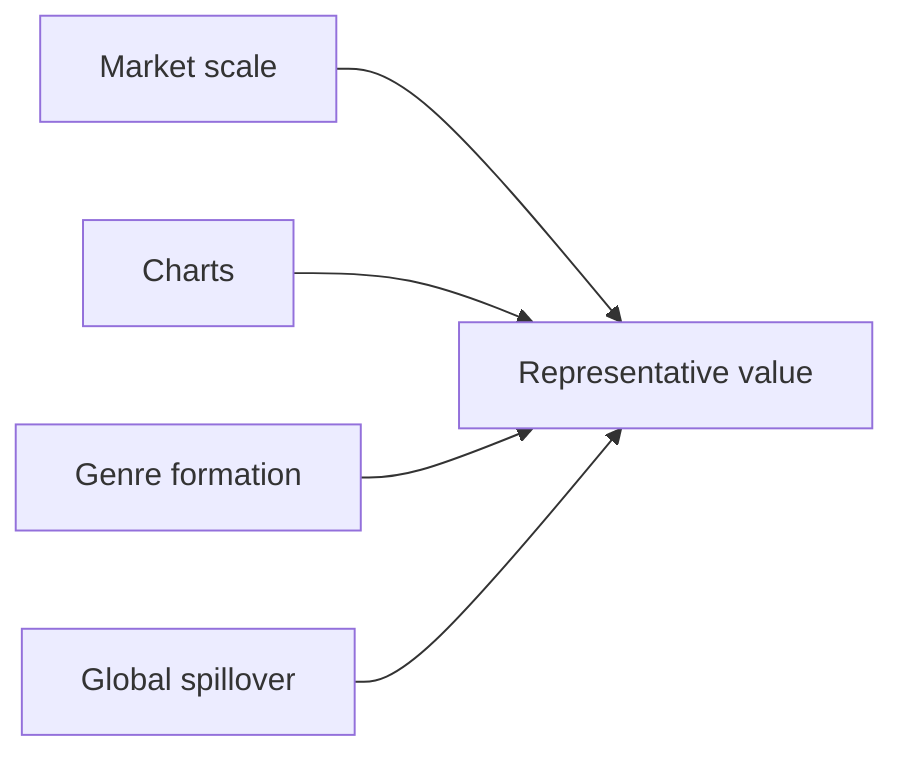

## 1. How to Read This Guide

This guide organizes popular music by asking which artists make each era legible. It focuses on popular recording artists rather than classical music: artists heard through records, charts, television, live performance, streaming, and social media. <SourceNote>For the current recorded-music market, this guide uses IFPI's [Global Music Report 2026](https://www.ifpi.org/global-music-report-2026-global-recorded-music-revenues-grow-6-4-as-record-companies-drive-innovation/) and [Global Charts](https://www.ifpi.org/our-industry/global-charts/). For historical Anglo-American pop stardom, it refers to Billboard's [Greatest Pop Stars by Year](https://www.billboard.com/lists/billboard-greatest-pop-stars-year/) and [Greatest Pop Stars of the 21st Century](https://www.billboard.com/music/pop/beyonce-greatest-pop-stars-21st-century-1235842572/).</SourceNote>

The eras are the 1980s, 1990s, 2000s, 2010s, 2020s, and today. Today means artists whose activity, listening, chart presence, touring, social visibility, or international reach remains important as of June 2026, so it can overlap with the 2020s. The selected countries and markets are the United States, United Kingdom, Japan, South Korea, France, Germany, Brazil, Nigeria, India, and the Chinese-language market.

This is not a strict ranking. The selections combine sales, chart performance, critical reputation, genre formation, international spillover, and influence on later artists. <SourceNote>IFPI reports that Japan returned to being the world's second-largest recorded-music market in 2025, China overtook Germany to become the fourth-largest market, and Brazil moved up to number eight [Global Music Report 2026](https://www.ifpi.org/global-music-report-2026-global-recorded-music-revenues-grow-6-4-as-record-companies-drive-innovation/).</SourceNote>

## 2. United States

### 1980s

MTV, stadium touring, and the meeting of R&B with rock turned music into image, choreography, and vocal identity.

1. **Michael Jackson** - From Motown child star to global solo icon, he defined the MTV age through video, dance, R&B, and pop. Listeners heard in Michael Jackson the era's wider pattern: MTV, stadium touring, and the meeting of R&B with rock turned music into image, choreography, and vocal identity.
2. **Madonna** - Emerging from New York club culture, she fused music, fashion, video, and sexual self-presentation. Listeners heard in Madonna the era's wider pattern: MTV, stadium touring, and the meeting of R&B with rock turned music into image, choreography, and vocal identity.
3. **Prince** - Based in Minneapolis, he merged funk, rock, R&B, production, and performance into an auteur model. Listeners heard in Prince the era's wider pattern: MTV, stadium touring, and the meeting of R&B with rock turned music into image, choreography, and vocal identity.
4. **Whitney Houston** - Rooted in gospel and R&B, she became the definitive late-1980s pop-ballad vocalist. Listeners heard in Whitney Houston the era's wider pattern: MTV, stadium touring, and the meeting of R&B with rock turned music into image, choreography, and vocal identity.
5. **Bruce Springsteen** - He joined working-class narrative, American rock, and stadium performance into a national figure. Listeners heard in Bruce Springsteen the era's wider pattern: MTV, stadium touring, and the meeting of R&B with rock turned music into image, choreography, and vocal identity.

### 1990s

The expanding CD market let R&B, alternative rock, hip-hop, and country build separate mass audiences.

1. **Mariah Carey** - Her vocal range and R&B-inflected pop dominated U.S. charts from the early 1990s. Listeners heard in Mariah Carey the era's wider pattern: The expanding CD market let R&B, alternative rock, hip-hop, and country build separate mass audiences.
2. **Nirvana** - The Seattle band made grunge mainstream and changed rock after 1980s gloss. Listeners heard in Nirvana the era's wider pattern: The expanding CD market let R&B, alternative rock, hip-hop, and country build separate mass audiences.
3. **Tupac Shakur** - He combined West Coast hip-hop, social commentary, biography, and posthumous myth. Listeners heard in Tupac Shakur the era's wider pattern: The expanding CD market let R&B, alternative rock, hip-hop, and country build separate mass audiences.
4. **Dr. Dre** - After N.W.A., he defined G-funk and became the production link to Snoop Dogg and Eminem. Listeners heard in Dr. Dre the era's wider pattern: The expanding CD market let R&B, alternative rock, hip-hop, and country build separate mass audiences.
5. **Garth Brooks** - He pushed country into an arena-scale pop market and changed its commercial reach. Listeners heard in Garth Brooks the era's wider pattern: The expanding CD market let R&B, alternative rock, hip-hop, and country build separate mass audiences.

### 2000s

As CDs gave way to downloads, pop stardom joined albums, television, celebrity media, and fashion.

1. **Beyoncé** - Moving from Destiny's Child to solo work, she integrated R&B, pop, visuals, and live spectacle. Listeners heard in Beyoncé the era's wider pattern: As CDs gave way to downloads, pop stardom joined albums, television, celebrity media, and fashion.
2. **Eminem** - From Detroit, he expanded mainstream hip-hop as a white rapper with technical force. Listeners heard in Eminem the era's wider pattern: As CDs gave way to downloads, pop stardom joined albums, television, celebrity media, and fashion.
3. **Kanye West** - He moved from producer to rapper and reshaped sampling, fashion, and album design. Listeners heard in Kanye West the era's wider pattern: As CDs gave way to downloads, pop stardom joined albums, television, celebrity media, and fashion.
4. **Britney Spears** - She became the teen-pop symbol of late MTV and peak CD-era star marketing. Listeners heard in Britney Spears the era's wider pattern: As CDs gave way to downloads, pop stardom joined albums, television, celebrity media, and fashion.
5. **Alicia Keys** - She connected classical piano with R&B and widened the neo-soul singer-songwriter model. Listeners heard in Alicia Keys the era's wider pattern: As CDs gave way to downloads, pop stardom joined albums, television, celebrity media, and fashion.

### 2010s

Streaming and social media placed authorship, fandom, and public argument on the same screen.

1. **Taylor Swift** - Moving from country to pop, she shaped songwriting, fan economics, and rerecording strategy. Listeners heard in Taylor Swift the era's wider pattern: Streaming and social media placed authorship, fandom, and public argument on the same screen.
2. **Drake** - Canadian-born but central to U.S. hip-hop/R&B, he embodied streaming-era single consumption. Listeners heard in Drake the era's wider pattern: Streaming and social media placed authorship, fandom, and public argument on the same screen.
3. **Lady Gaga** - She built a star persona from dance-pop, theatre, fashion, and LGBTQ+ advocacy. Listeners heard in Lady Gaga the era's wider pattern: Streaming and social media placed authorship, fandom, and public argument on the same screen.
4. **Kendrick Lamar** - He defined 2010s hip-hop through conscious rap, jazz/funk inheritance, and album narrative. Listeners heard in Kendrick Lamar the era's wider pattern: Streaming and social media placed authorship, fandom, and public argument on the same screen.
5. **Billie Eilish** - With bedroom-pop production and dark minimalism, she became a late-2010s Gen Z star. Listeners heard in Billie Eilish the era's wider pattern: Streaming and social media placed authorship, fandom, and public argument on the same screen.

### 2020s

Short video, rerecordings, touring, and genre-crossing put older pop centers and regional genres on the same charts.

1. **Taylor Swift** - Tours, rerecordings, and rapid album cycles made her a symbol of early-2020s global music consumption. Listeners heard in Taylor Swift the era's wider pattern: Short video, rerecordings, touring, and genre-crossing put older pop centers and regional genres on the same charts.
2. **Beyoncé** - She reframed house, country, and Black music history through concept-driven albums. Listeners heard in Beyoncé the era's wider pattern: Short video, rerecordings, touring, and genre-crossing put older pop centers and regional genres on the same charts.
3. **Morgan Wallen** - He represents the streaming-era expansion of country music beyond its older frame. Listeners heard in Morgan Wallen the era's wider pattern: Short video, rerecordings, touring, and genre-crossing put older pop centers and regional genres on the same charts.
4. **SZA** - Her alternative R&B and inward lyric writing define long-tail 2020s R&B listening. Listeners heard in SZA the era's wider pattern: Short video, rerecordings, touring, and genre-crossing put older pop centers and regional genres on the same charts.
5. **Olivia Rodrigo** - From Disney roots, she turned toward rock-inflected Gen Z pop with global reach. Listeners heard in Olivia Rodrigo the era's wider pattern: Short video, rerecordings, touring, and genre-crossing put older pop centers and regional genres on the same charts.

### Today

Current U.S. pop runs on catalogue listening, tour economics, fan mobilization, and critical narratives at once.

1. **Taylor Swift** - She topped IFPI's 2025 Global Artist Chart and remains a catalogue-wide listening force. Listeners heard in Taylor Swift the era's wider pattern: Current U.S. pop runs on catalogue listening, tour economics, fan mobilization, and critical narratives at once.
2. **Kendrick Lamar** - He remains a U.S. hip-hop reference point through craft, live performance, and social context. Listeners heard in Kendrick Lamar the era's wider pattern: Current U.S. pop runs on catalogue listening, tour economics, fan mobilization, and critical narratives at once.
3. **Billie Eilish** - She keeps critical and youth-audience strength with sparse, intimate pop. Listeners heard in Billie Eilish the era's wider pattern: Current U.S. pop runs on catalogue listening, tour economics, fan mobilization, and critical narratives at once.
4. **Sabrina Carpenter** - Moving from acting into international pop hits, she reached IFPI's 2025 global upper tier. Listeners heard in Sabrina Carpenter the era's wider pattern: Current U.S. pop runs on catalogue listening, tour economics, fan mobilization, and critical narratives at once.
5. **SZA** - She sustains strong album and track listening across R&B and pop audiences. Listeners heard in SZA the era's wider pattern: Current U.S. pop runs on catalogue listening, tour economics, fan mobilization, and critical narratives at once.

## 3. United Kingdom

### 1980s

British pop drew on rock history, new wave, and soul-leaning pop to build international television-era stars.

1. **Queen** - With earlier foundations already built, Queen became an emblem of British rock mass appeal and live power. Listeners heard in Queen the era's wider pattern: British pop drew on rock history, new wave, and soul-leaning pop to build international television-era stars.
2. **David Bowie** - In the 1980s he re-expanded as a global pop star while keeping the model of artist-as-transformation. Listeners heard in David Bowie the era's wider pattern: British pop drew on rock history, new wave, and soul-leaning pop to build international television-era stars.
3. **George Michael** - From Wham! to solo work, he brought British R&B-leaning pop to the world market. Listeners heard in George Michael the era's wider pattern: British pop drew on rock history, new wave, and soul-leaning pop to build international television-era stars.
4. **Kate Bush** - She established a singular singer-songwriter model built on experiment, literature, and movement. Listeners heard in Kate Bush the era's wider pattern: British pop drew on rock history, new wave, and soul-leaning pop to build international television-era stars.
5. **The Smiths** - From Manchester, they shaped indie rock through lyrics and guitar language. Listeners heard in The Smiths the era's wider pattern: British pop drew on rock history, new wave, and soul-leaning pop to build international television-era stars.

### 1990s

Britpop, girl groups, club culture, and alternative rock competed while selling different versions of Britishness.

1. **Oasis** - They became Britpop's mass peak and revived a working-class rock narrative. Listeners heard in Oasis the era's wider pattern: Britpop, girl groups, club culture, and alternative rock competed while selling different versions of Britishness.
2. **Blur** - They represented Britpop's urban and art-school side before moving into experimentation. Listeners heard in Blur the era's wider pattern: Britpop, girl groups, club culture, and alternative rock competed while selling different versions of Britishness.
3. **Spice Girls** - They linked girl-group pop, merchandising, media strategy, and 1990s identity language. Listeners heard in Spice Girls the era's wider pattern: Britpop, girl groups, club culture, and alternative rock competed while selling different versions of Britishness.
4. **Radiohead** - They moved from alternative rock to electronic experiment and changed album expectations. Listeners heard in Radiohead the era's wider pattern: Britpop, girl groups, club culture, and alternative rock competed while selling different versions of Britishness.
5. **The Prodigy** - They carried rave, big beat, and rock physicality into global popular culture. Listeners heard in The Prodigy the era's wider pattern: Britpop, girl groups, club culture, and alternative rock competed while selling different versions of Britishness.

### 2000s

Guitar rock, soul revival, internet discovery, and stadium scale supported export-ready British pop.

1. **Coldplay** - After Britpop, they became a global stadium band built on melodic rock. Listeners heard in Coldplay the era's wider pattern: Guitar rock, soul revival, internet discovery, and stadium scale supported export-ready British pop.
2. **Amy Winehouse** - She reworked jazz, soul, and R&B into a modern voice with lasting influence. Listeners heard in Amy Winehouse the era's wider pattern: Guitar rock, soul revival, internet discovery, and stadium scale supported export-ready British pop.
3. **Adele** - Emerging at the end of the decade, she prepared the next decade's vocal-ballad dominance. Listeners heard in Adele the era's wider pattern: Guitar rock, soul revival, internet discovery, and stadium scale supported export-ready British pop.
4. **Arctic Monkeys** - Internet word-of-mouth helped them become the new face of British guitar rock. Listeners heard in Arctic Monkeys the era's wider pattern: Guitar rock, soul revival, internet discovery, and stadium scale supported export-ready British pop.
5. **Muse** - They combined progressive rock, electronics, and stadium theatricality. Listeners heard in Muse the era's wider pattern: Guitar rock, soul revival, internet discovery, and stadium scale supported export-ready British pop.

### 2010s

Talent television, social media, streaming, and songwriter culture linked British artists to the world market.

1. **Adele** - She sold albums globally at a scale that bridged the pre-streaming and streaming eras. Listeners heard in Adele the era's wider pattern: Talent television, social media, streaming, and songwriter culture linked British artists to the world market.
2. **Ed Sheeran** - From loop-pedal solo performance, he became a global pop songwriter and performer. Listeners heard in Ed Sheeran the era's wider pattern: Talent television, social media, streaming, and songwriter culture linked British artists to the world market.
3. **One Direction** - The TV-formed boy band expanded fandom in the social-media era. Listeners heard in One Direction the era's wider pattern: Talent television, social media, streaming, and songwriter culture linked British artists to the world market.
4. **Dua Lipa** - She connected dance-pop and fashion into an international British pop-star model. Listeners heard in Dua Lipa the era's wider pattern: Talent television, social media, streaming, and songwriter culture linked British artists to the world market.
5. **Sam Smith** - Their soulful voice and ballads reached global charts. Listeners heard in Sam Smith the era's wider pattern: Talent television, social media, streaming, and songwriter culture linked British artists to the world market.

### 2020s

Solo careers after groups, UK rap, and club producers multiplied the entry points into British pop.

1. **Harry Styles** - After One Direction, he crossed rock, pop, fashion, and film-like celebrity. Listeners heard in Harry Styles the era's wider pattern: Solo careers after groups, UK rap, and club producers multiplied the entry points into British pop.
2. **Dua Lipa** - She reinforced disco and dance-pop as a durable international lane. Listeners heard in Dua Lipa the era's wider pattern: Solo careers after groups, UK rap, and club producers multiplied the entry points into British pop.
3. **Adele** - With infrequent releases, she still commands global album attention. Listeners heard in Adele the era's wider pattern: Solo careers after groups, UK rap, and club producers multiplied the entry points into British pop.
4. **Central Cee** - He brought UK drill into broader international hip-hop circulation. Listeners heard in Central Cee the era's wider pattern: Solo careers after groups, UK rap, and club producers multiplied the entry points into British pop.
5. **Raye** - After writing for others, her independent breakthrough combined industry critique and vocal craft. Listeners heard in Raye the era's wider pattern: Solo careers after groups, UK rap, and club producers multiplied the entry points into British pop.

### Today

Current British artists connect dance-pop, club criticism, UK rap, and electronic music to charts and festivals.

1. **Dua Lipa** - She remains Britain's leading global dance-pop export. Listeners heard in Dua Lipa the era's wider pattern: Current British artists connect dance-pop, club criticism, UK rap, and electronic music to charts and festivals.
2. **Raye** - Her writing, voice, and industry narrative make her a current British-pop focal point. Listeners heard in Raye the era's wider pattern: Current British artists connect dance-pop, club criticism, UK rap, and electronic music to charts and festivals.
3. **Charli xcx** - She connects club culture, hyperpop, and internet culture in 2020s pop criticism. Listeners heard in Charli xcx the era's wider pattern: Current British artists connect dance-pop, club criticism, UK rap, and electronic music to charts and festivals.
4. **Central Cee** - He pushes British rap into U.S. and European listening circuits. Listeners heard in Central Cee the era's wider pattern: Current British artists connect dance-pop, club criticism, UK rap, and electronic music to charts and festivals.
5. **Fred again..** - The producer turned electronic live performance into mass, improvisational pop spectacle. Listeners heard in Fred again.. the era's wider pattern: Current British artists connect dance-pop, club criticism, UK rap, and electronic music to charts and festivals.

## 4. Japan

### 1980s

Television music shows, idol kayokyoku, city pop, and electronic music tied home viewing to record buying.

1. **サザンオールスターズ** - A national band that broadened the blend of pop, rock, and kayokyoku. Listeners heard in サザンオールスターズ the era's wider pattern: Television music shows, idol kayokyoku, city pop, and electronic music tied home viewing to record buying.
2. **松任谷由実** - She defined urban lyricism and the Japanese female singer-songwriter model. Listeners heard in 松任谷由実 the era's wider pattern: Television music shows, idol kayokyoku, city pop, and electronic music tied home viewing to record buying.
3. **松田聖子** - She built the 1980s Japanese idol template through songs, television, and image. Listeners heard in 松田聖子 the era's wider pattern: Television music shows, idol kayokyoku, city pop, and electronic music tied home viewing to record buying.
4. **中森明菜** - She pushed idol singing toward darker expression and performance maturity. Listeners heard in 中森明菜 the era's wider pattern: Television music shows, idol kayokyoku, city pop, and electronic music tied home viewing to record buying.
5. **Yellow Magic Orchestra** - Their technopop and design sensibility influenced pop and electronic music internationally. Listeners heard in Yellow Magic Orchestra the era's wider pattern: Television music shows, idol kayokyoku, city pop, and electronic music tied home viewing to record buying.

### 1990s

The CD boom, karaoke, drama tie-ins, and producer-led dance pop built the large J-pop market.

1. **Mr.Children** - They joined introspective lyrics with mass J-pop band success. Listeners heard in Mr.Children the era's wider pattern: The CD boom, karaoke, drama tie-ins, and producer-led dance pop built the large J-pop market.
2. **B'z** - Their guitar-driven hard-rock pop produced massive Japanese sales. Listeners heard in B'z the era's wider pattern: The CD boom, karaoke, drama tie-ins, and producer-led dance pop built the large J-pop market.
3. **DREAMS COME TRUE** - They sat at the center of 1990s J-pop through R&B, pop, and live strength. Listeners heard in DREAMS COME TRUE the era's wider pattern: The CD boom, karaoke, drama tie-ins, and producer-led dance pop built the large J-pop market.
4. **安室奈美恵** - She became a dance-pop and fashion icon under and after Tetsuya Komuro. Listeners heard in 安室奈美恵 the era's wider pattern: The CD boom, karaoke, drama tie-ins, and producer-led dance pop built the large J-pop market.
5. **宇多田ヒカル** - Arriving in the late 1990s, she changed J-pop language through R&B feel and authorship. Listeners heard in 宇多田ヒカル the era's wider pattern: The CD boom, karaoke, drama tie-ins, and producer-led dance pop built the large J-pop market.

### 2000s

CD sales, mobile downloads, television, and fan clubs supported stars who joined lyrics, visuals, and live shows.

1. **浜崎あゆみ** - Lyrics, visuals, and fan culture made her a defining early-2000s J-pop star. Listeners heard in 浜崎あゆみ the era's wider pattern: CD sales, mobile downloads, television, and fan clubs supported stars who joined lyrics, visuals, and live shows.
2. **宇多田ヒカル** - Her albums kept a high standard of craft and international pop/R&B sensibility. Listeners heard in 宇多田ヒカル the era's wider pattern: CD sales, mobile downloads, television, and fan clubs supported stars who joined lyrics, visuals, and live shows.
3. **嵐** - The idol group linked television, live shows, CD sales, and national popularity. Listeners heard in 嵐 the era's wider pattern: CD sales, mobile downloads, television, and fan clubs supported stars who joined lyrics, visuals, and live shows.
4. **EXILE** - They expanded the Japanese dance-and-vocal group model. Listeners heard in EXILE the era's wider pattern: CD sales, mobile downloads, television, and fan clubs supported stars who joined lyrics, visuals, and live shows.
5. **倖田來未** - She foregrounded R&B, dance, and female self-presentation in 2000s pop. Listeners heard in 倖田來未 the era's wider pattern: CD sales, mobile downloads, television, and fan clubs supported stars who joined lyrics, visuals, and live shows.

### 2010s

Handshakes, video sites, anime, and social media placed participatory idols beside internet-native writers.

1. **AKB48** - Theater shows, handshakes, and elections turned participation into idol-market scale. Listeners heard in AKB48 the era's wider pattern: Handshakes, video sites, anime, and social media placed participatory idols beside internet-native writers.
2. **Perfume** - With Yasutaka Nakata's electronics and precise choreography, they updated Japanese technopop. Listeners heard in Perfume the era's wider pattern: Handshakes, video sites, anime, and social media placed participatory idols beside internet-native writers.
3. **ONE OK ROCK** - They connected domestic rock with international touring. Listeners heard in ONE OK ROCK the era's wider pattern: Handshakes, video sites, anime, and social media placed participatory idols beside internet-native writers.
4. **米津玄師** - From Vocaloid culture, he entered the mainstream while keeping authorship. Listeners heard in 米津玄師 the era's wider pattern: Handshakes, video sites, anime, and social media placed participatory idols beside internet-native writers.
5. **星野源** - As actor, writer, and musician, he spread everyday-feeling pop across media. Listeners heard in 星野源 the era's wider pattern: Handshakes, video sites, anime, and social media placed participatory idols beside internet-native writers.

### 2020s

Streaming, anime themes, post-Vocaloid authorship, and masked vocal performance widened overseas listening.

1. **YOASOBI** - Fiction-based production and streaming hits extended Japanese-language pop overseas. Listeners heard in YOASOBI the era's wider pattern: Streaming, anime themes, post-Vocaloid authorship, and masked vocal performance widened overseas listening.
2. **Ado** - With hidden-face performance and Vocaloid-network roots, she reached young listeners quickly. Listeners heard in Ado the era's wider pattern: Streaming, anime themes, post-Vocaloid authorship, and masked vocal performance widened overseas listening.
3. **Official髭男dism** - Their band performance and sophisticated pop writing anchor streaming-era J-pop. Listeners heard in Official髭男dism the era's wider pattern: Streaming, anime themes, post-Vocaloid authorship, and masked vocal performance widened overseas listening.
4. **King Gnu** - They join art-school aesthetics, rock, mix, and major tie-ins. Listeners heard in King Gnu the era's wider pattern: Streaming, anime themes, post-Vocaloid authorship, and masked vocal performance widened overseas listening.
5. **Creepy Nuts** - Hip-hop, television, and anime themes gave them international track visibility. Listeners heard in Creepy Nuts the era's wider pattern: Streaming, anime themes, post-Vocaloid authorship, and masked vocal performance widened overseas listening.

### Today

Current J-pop combines the domestic live market, film and anime tie-ins, and streaming-born hits.

1. **Mrs. GREEN APPLE** - The band is highly visible in mid-2020s Japanese charts and live culture. Listeners heard in Mrs. GREEN APPLE the era's wider pattern: Current J-pop combines the domestic live market, film and anime tie-ins, and streaming-born hits.
2. **米津玄師** - His Vocaloid-rooted authorship remains powerful across film, anime, and game themes. Listeners heard in 米津玄師 the era's wider pattern: Current J-pop combines the domestic live market, film and anime tie-ins, and streaming-born hits.
3. **YOASOBI** - Anime, overseas festivals, and streaming keep extending Japanese-language reach. Listeners heard in YOASOBI the era's wider pattern: Current J-pop combines the domestic live market, film and anime tie-ins, and streaming-born hits.
4. **Snow Man** - They show the continuing strength of physical sales, video, live shows, and fandom. Listeners heard in Snow Man the era's wider pattern: Current J-pop combines the domestic live market, film and anime tie-ins, and streaming-born hits.
5. **Ado** - Her voice and relative anonymity support domestic and international touring. Listeners heard in Ado the era's wider pattern: Current J-pop combines the domestic live market, film and anime tie-ins, and streaming-born hits.

## 5. South Korea

### 1980s

Before K-pop, Korean popular music reached broad generations through national singers, ballads, rock, and television song shows.

1. **Cho Yong-pil** - Cho Yong-pil shows Korean popular music before and after K-pop through national singers, rock, television pop, and dance culture. Listeners heard in Cho Yong-pil the era's wider pattern: Before K-pop, Korean popular music reached broad generations through national singers, ballads, rock, and television song shows.
2. **Lee Moon-sae** - Lee Moon-sae shows Korean popular music before and after K-pop through national singers, rock, television pop, and dance culture. Listeners heard in Lee Moon-sae the era's wider pattern: Before K-pop, Korean popular music reached broad generations through national singers, ballads, rock, and television song shows.
3. **Kim Wan-sun** - Kim Wan-sun shows Korean popular music before and after K-pop through national singers, rock, television pop, and dance culture. Listeners heard in Kim Wan-sun the era's wider pattern: Before K-pop, Korean popular music reached broad generations through national singers, ballads, rock, and television song shows.
4. **Deulgukhwa** - Deulgukhwa shows Korean popular music before and after K-pop through national singers, rock, television pop, and dance culture. Listeners heard in Deulgukhwa the era's wider pattern: Before K-pop, Korean popular music reached broad generations through national singers, ballads, rock, and television song shows.
5. **Nami** - Nami shows Korean popular music before and after K-pop through national singers, rock, television pop, and dance culture. Listeners heard in Nami the era's wider pattern: Before K-pop, Korean popular music reached broad generations through national singers, ballads, rock, and television song shows.

### 1990s

Dance, rap, idol training, and television music programs began to form the K-pop industry model.

1. **Seo Taiji and Boys** - Seo Taiji and Boys shows Korean popular music before and after K-pop through national singers, rock, television pop, and dance culture. Listeners heard in Seo Taiji and Boys the era's wider pattern: Dance, rap, idol training, and television music programs began to form the K-pop industry model.
2. **H.O.T.** - H.O.T. shows Korean popular music before and after K-pop through national singers, rock, television pop, and dance culture. Listeners heard in H.O.T. the era's wider pattern: Dance, rap, idol training, and television music programs began to form the K-pop industry model.
3. **S.E.S.** - S.E.S. shows Korean popular music before and after K-pop through national singers, rock, television pop, and dance culture. Listeners heard in S.E.S. the era's wider pattern: Dance, rap, idol training, and television music programs began to form the K-pop industry model.
4. **Kim Gun-mo** - Kim Gun-mo shows Korean popular music before and after K-pop through national singers, rock, television pop, and dance culture. Listeners heard in Kim Gun-mo the era's wider pattern: Dance, rap, idol training, and television music programs began to form the K-pop industry model.
5. **Deux** - Deux shows Korean popular music before and after K-pop through national singers, rock, television pop, and dance culture. Listeners heard in Deux the era's wider pattern: Dance, rap, idol training, and television music programs began to form the K-pop industry model.

### 2000s

Japan expansion, Asian touring, trainee systems, and music programs shaped Korean idols as export acts.

1. **BoA** - BoA shows Korean popular music before and after K-pop through national singers, rock, television pop, and dance culture. Listeners heard in BoA the era's wider pattern: Japan expansion, Asian touring, trainee systems, and music programs shaped Korean idols as export acts.
2. **TVXQ!** - TVXQ! shows Korean popular music before and after K-pop through national singers, rock, television pop, and dance culture. Listeners heard in TVXQ! the era's wider pattern: Japan expansion, Asian touring, trainee systems, and music programs shaped Korean idols as export acts.
3. **BIGBANG** - BIGBANG shows Korean popular music before and after K-pop through national singers, rock, television pop, and dance culture. Listeners heard in BIGBANG the era's wider pattern: Japan expansion, Asian touring, trainee systems, and music programs shaped Korean idols as export acts.
4. **Girls' Generation** - Girls' Generation shows Korean popular music before and after K-pop through national singers, rock, television pop, and dance culture. Listeners heard in Girls' Generation the era's wider pattern: Japan expansion, Asian touring, trainee systems, and music programs shaped Korean idols as export acts.
5. **Wonder Girls** - Wonder Girls shows Korean popular music before and after K-pop through national singers, rock, television pop, and dance culture. Listeners heard in Wonder Girls the era's wider pattern: Japan expansion, Asian touring, trainee systems, and music programs shaped Korean idols as export acts.

### 2010s

YouTube, social media, fan translation, and synchronized choreography made K-pop a globally simultaneous format.

1. **BTS** - BTS shows Korean popular music before and after K-pop through national singers, rock, television pop, and dance culture. Listeners heard in BTS the era's wider pattern: YouTube, social media, fan translation, and synchronized choreography made K-pop a globally simultaneous format.
2. **BLACKPINK** - BLACKPINK shows Korean popular music before and after K-pop through national singers, rock, television pop, and dance culture. Listeners heard in BLACKPINK the era's wider pattern: YouTube, social media, fan translation, and synchronized choreography made K-pop a globally simultaneous format.
3. **EXO** - EXO shows Korean popular music before and after K-pop through national singers, rock, television pop, and dance culture. Listeners heard in EXO the era's wider pattern: YouTube, social media, fan translation, and synchronized choreography made K-pop a globally simultaneous format.
4. **TWICE** - TWICE shows Korean popular music before and after K-pop through national singers, rock, television pop, and dance culture. Listeners heard in TWICE the era's wider pattern: YouTube, social media, fan translation, and synchronized choreography made K-pop a globally simultaneous format.
5. **IU** - IU shows Korean popular music before and after K-pop through national singers, rock, television pop, and dance culture. Listeners heard in IU the era's wider pattern: YouTube, social media, fan translation, and synchronized choreography made K-pop a globally simultaneous format.

### 2020s

Album purchasing, short video, fan voting, and multinational members keep renewing K-pop competition.

1. **Stray Kids** - Stray Kids shows Korean popular music before and after K-pop through national singers, rock, television pop, and dance culture. Listeners heard in Stray Kids the era's wider pattern: Album purchasing, short video, fan voting, and multinational members keep renewing K-pop competition.
2. **SEVENTEEN** - SEVENTEEN shows Korean popular music before and after K-pop through national singers, rock, television pop, and dance culture. Listeners heard in SEVENTEEN the era's wider pattern: Album purchasing, short video, fan voting, and multinational members keep renewing K-pop competition.
3. **NewJeans** - NewJeans shows Korean popular music before and after K-pop through national singers, rock, television pop, and dance culture. Listeners heard in NewJeans the era's wider pattern: Album purchasing, short video, fan voting, and multinational members keep renewing K-pop competition.
4. **aespa** - aespa shows Korean popular music before and after K-pop through national singers, rock, television pop, and dance culture. Listeners heard in aespa the era's wider pattern: Album purchasing, short video, fan voting, and multinational members keep renewing K-pop competition.
5. **IVE** - IVE shows Korean popular music before and after K-pop through national singers, rock, television pop, and dance culture. Listeners heard in IVE the era's wider pattern: Album purchasing, short video, fan voting, and multinational members keep renewing K-pop competition.

### Today

Current Korean acts combine group work, solo work, military service, contract cycles, and world tours.

1. **Stray Kids** - Stray Kids shows Korean popular music before and after K-pop through national singers, rock, television pop, and dance culture. Listeners heard in Stray Kids the era's wider pattern: Current Korean acts combine group work, solo work, military service, contract cycles, and world tours.
2. **SEVENTEEN** - SEVENTEEN shows Korean popular music before and after K-pop through national singers, rock, television pop, and dance culture. Listeners heard in SEVENTEEN the era's wider pattern: Current Korean acts combine group work, solo work, military service, contract cycles, and world tours.
3. **BTS** - BTS shows Korean popular music before and after K-pop through national singers, rock, television pop, and dance culture. Listeners heard in BTS the era's wider pattern: Current Korean acts combine group work, solo work, military service, contract cycles, and world tours.
4. **BLACKPINK** - BLACKPINK shows Korean popular music before and after K-pop through national singers, rock, television pop, and dance culture. Listeners heard in BLACKPINK the era's wider pattern: Current Korean acts combine group work, solo work, military service, contract cycles, and world tours.
5. **aespa** - aespa shows Korean popular music before and after K-pop through national singers, rock, television pop, and dance culture. Listeners heard in aespa the era's wider pattern: Current Korean acts combine group work, solo work, military service, contract cycles, and world tours.

## 6. France

### 1980s

French pop expanded through post-chanson language, synth-pop, rock, and television visibility.

1. **Mylène Farmer** - Mylène Farmer marks French-language pop through chanson-inflected pop, rock, rap, electronic music, and Afropop/R&B. Listeners heard in Mylène Farmer the era's wider pattern: French pop expanded through post-chanson language, synth-pop, rock, and television visibility.
2. **Jean-Jacques Goldman** - Jean-Jacques Goldman marks French-language pop through chanson-inflected pop, rock, rap, electronic music, and Afropop/R&B. Listeners heard in Jean-Jacques Goldman the era's wider pattern: French pop expanded through post-chanson language, synth-pop, rock, and television visibility.
3. **Indochine** - Indochine marks French-language pop through chanson-inflected pop, rock, rap, electronic music, and Afropop/R&B. Listeners heard in Indochine the era's wider pattern: French pop expanded through post-chanson language, synth-pop, rock, and television visibility.
4. **Daniel Balavoine** - Daniel Balavoine marks French-language pop through chanson-inflected pop, rock, rap, electronic music, and Afropop/R&B. Listeners heard in Daniel Balavoine the era's wider pattern: French pop expanded through post-chanson language, synth-pop, rock, and television visibility.
5. **Vanessa Paradis** - Vanessa Paradis marks French-language pop through chanson-inflected pop, rock, rap, electronic music, and Afropop/R&B. Listeners heard in Vanessa Paradis the era's wider pattern: French pop expanded through post-chanson language, synth-pop, rock, and television visibility.

### 1990s

French rap, dance music, rock, and adult pop singing pushed urban and club sensibilities forward.

1. **MC Solaar** - MC Solaar marks French-language pop through chanson-inflected pop, rock, rap, electronic music, and Afropop/R&B. Listeners heard in MC Solaar the era's wider pattern: French rap, dance music, rock, and adult pop singing pushed urban and club sensibilities forward.
2. **Daft Punk** - Daft Punk marks French-language pop through chanson-inflected pop, rock, rap, electronic music, and Afropop/R&B. Listeners heard in Daft Punk the era's wider pattern: French rap, dance music, rock, and adult pop singing pushed urban and club sensibilities forward.
3. **IAM** - IAM marks French-language pop through chanson-inflected pop, rock, rap, electronic music, and Afropop/R&B. Listeners heard in IAM the era's wider pattern: French rap, dance music, rock, and adult pop singing pushed urban and club sensibilities forward.
4. **Zazie** - Zazie marks French-language pop through chanson-inflected pop, rock, rap, electronic music, and Afropop/R&B. Listeners heard in Zazie the era's wider pattern: French rap, dance music, rock, and adult pop singing pushed urban and club sensibilities forward.
5. **Patricia Kaas** - Patricia Kaas marks French-language pop through chanson-inflected pop, rock, rap, electronic music, and Afropop/R&B. Listeners heard in Patricia Kaas the era's wider pattern: French rap, dance music, rock, and adult pop singing pushed urban and club sensibilities forward.

### 2000s

Post-French-touch electronic music, indie rock, R&B, and women rappers crossed international and domestic media.

1. **David Guetta** - David Guetta marks French-language pop through chanson-inflected pop, rock, rap, electronic music, and Afropop/R&B. Listeners heard in David Guetta the era's wider pattern: Post-French-touch electronic music, indie rock, R&B, and women rappers crossed international and domestic media.
2. **Phoenix** - Phoenix marks French-language pop through chanson-inflected pop, rock, rap, electronic music, and Afropop/R&B. Listeners heard in Phoenix the era's wider pattern: Post-French-touch electronic music, indie rock, R&B, and women rappers crossed international and domestic media.
3. **Air** - Air marks French-language pop through chanson-inflected pop, rock, rap, electronic music, and Afropop/R&B. Listeners heard in Air the era's wider pattern: Post-French-touch electronic music, indie rock, R&B, and women rappers crossed international and domestic media.
4. **Diam's** - Diam's marks French-language pop through chanson-inflected pop, rock, rap, electronic music, and Afropop/R&B. Listeners heard in Diam's the era's wider pattern: Post-French-touch electronic music, indie rock, R&B, and women rappers crossed international and domestic media.
5. **Amel Bent** - Amel Bent marks French-language pop through chanson-inflected pop, rock, rap, electronic music, and Afropop/R&B. Listeners heard in Amel Bent the era's wider pattern: Post-French-touch electronic music, indie rock, R&B, and women rappers crossed international and domestic media.

### 2010s

Streaming, rap from immigrant backgrounds, Afropop, and bilingual pop widened Francophone listening.

1. **Christine and the Queens** - Christine and the Queens marks French-language pop through chanson-inflected pop, rock, rap, electronic music, and Afropop/R&B. Listeners heard in Christine and the Queens the era's wider pattern: Streaming, rap from immigrant backgrounds, Afropop, and bilingual pop widened Francophone listening.
2. **Maître Gims** - Maître Gims marks French-language pop through chanson-inflected pop, rock, rap, electronic music, and Afropop/R&B. Listeners heard in Maître Gims the era's wider pattern: Streaming, rap from immigrant backgrounds, Afropop, and bilingual pop widened Francophone listening.
3. **PNL** - PNL marks French-language pop through chanson-inflected pop, rock, rap, electronic music, and Afropop/R&B. Listeners heard in PNL the era's wider pattern: Streaming, rap from immigrant backgrounds, Afropop, and bilingual pop widened Francophone listening.
4. **Aya Nakamura** - Aya Nakamura marks French-language pop through chanson-inflected pop, rock, rap, electronic music, and Afropop/R&B. Listeners heard in Aya Nakamura the era's wider pattern: Streaming, rap from immigrant backgrounds, Afropop, and bilingual pop widened Francophone listening.
5. **Jain** - Jain marks French-language pop through chanson-inflected pop, rock, rap, electronic music, and Afropop/R&B. Listeners heard in Jain the era's wider pattern: Streaming, rap from immigrant backgrounds, Afropop, and bilingual pop widened Francophone listening.

### 2020s

Rap, trap, post-chanson songwriting, and TikTok strengthened circulation outside France.

1. **Aya Nakamura** - Aya Nakamura marks French-language pop through chanson-inflected pop, rock, rap, electronic music, and Afropop/R&B. Listeners heard in Aya Nakamura the era's wider pattern: Rap, trap, post-chanson songwriting, and TikTok strengthened circulation outside France.
2. **Jul** - Jul marks French-language pop through chanson-inflected pop, rock, rap, electronic music, and Afropop/R&B. Listeners heard in Jul the era's wider pattern: Rap, trap, post-chanson songwriting, and TikTok strengthened circulation outside France.
3. **Gazo** - Gazo marks French-language pop through chanson-inflected pop, rock, rap, electronic music, and Afropop/R&B. Listeners heard in Gazo the era's wider pattern: Rap, trap, post-chanson songwriting, and TikTok strengthened circulation outside France.
4. **Orelsan** - Orelsan marks French-language pop through chanson-inflected pop, rock, rap, electronic music, and Afropop/R&B. Listeners heard in Orelsan the era's wider pattern: Rap, trap, post-chanson songwriting, and TikTok strengthened circulation outside France.
5. **Zaho de Sagazan** - Zaho de Sagazan marks French-language pop through chanson-inflected pop, rock, rap, electronic music, and Afropop/R&B. Listeners heard in Zaho de Sagazan the era's wider pattern: Rap, trap, post-chanson songwriting, and TikTok strengthened circulation outside France.

### Today

Current Francophone pop runs urban rap, Afro-linked rhythms, and festival-ready singing in the same market.

1. **Aya Nakamura** - Aya Nakamura marks French-language pop through chanson-inflected pop, rock, rap, electronic music, and Afropop/R&B. Listeners heard in Aya Nakamura the era's wider pattern: Current Francophone pop runs urban rap, Afro-linked rhythms, and festival-ready singing in the same market.
2. **Jul** - Jul marks French-language pop through chanson-inflected pop, rock, rap, electronic music, and Afropop/R&B. Listeners heard in Jul the era's wider pattern: Current Francophone pop runs urban rap, Afro-linked rhythms, and festival-ready singing in the same market.
3. **Gazo** - Gazo marks French-language pop through chanson-inflected pop, rock, rap, electronic music, and Afropop/R&B. Listeners heard in Gazo the era's wider pattern: Current Francophone pop runs urban rap, Afro-linked rhythms, and festival-ready singing in the same market.
4. **Zaho de Sagazan** - Zaho de Sagazan marks French-language pop through chanson-inflected pop, rock, rap, electronic music, and Afropop/R&B. Listeners heard in Zaho de Sagazan the era's wider pattern: Current Francophone pop runs urban rap, Afro-linked rhythms, and festival-ready singing in the same market.
5. **Phoenix** - Phoenix marks French-language pop through chanson-inflected pop, rock, rap, electronic music, and Afropop/R&B. Listeners heard in Phoenix the era's wider pattern: Current Francophone pop runs urban rap, Afro-linked rhythms, and festival-ready singing in the same market.

## 7. Germany

### 1980s

German pop joined electronic music, rock, exportable melody, and German-language lyrics in Cold War Europe.

1. **Nena** - Nena shows changes in German-language pop, rock, electronic music, club music, and Deutschrap. Listeners heard in Nena the era's wider pattern: German pop joined electronic music, rock, exportable melody, and German-language lyrics in Cold War Europe.
2. **Scorpions** - Scorpions shows changes in German-language pop, rock, electronic music, club music, and Deutschrap. Listeners heard in Scorpions the era's wider pattern: German pop joined electronic music, rock, exportable melody, and German-language lyrics in Cold War Europe.
3. **Kraftwerk** - Kraftwerk shows changes in German-language pop, rock, electronic music, club music, and Deutschrap. Listeners heard in Kraftwerk the era's wider pattern: German pop joined electronic music, rock, exportable melody, and German-language lyrics in Cold War Europe.
4. **Modern Talking** - Modern Talking shows changes in German-language pop, rock, electronic music, club music, and Deutschrap. Listeners heard in Modern Talking the era's wider pattern: German pop joined electronic music, rock, exportable melody, and German-language lyrics in Cold War Europe.
5. **Herbert Grönemeyer** - Herbert Grönemeyer shows changes in German-language pop, rock, electronic music, club music, and Deutschrap. Listeners heard in Herbert Grönemeyer the era's wider pattern: German pop joined electronic music, rock, exportable melody, and German-language lyrics in Cold War Europe.

### 1990s

After reunification, industrial rock, punk, techno, and hip-hop reached mass audiences through regional scenes.

1. **Rammstein** - Rammstein shows changes in German-language pop, rock, electronic music, club music, and Deutschrap. Listeners heard in Rammstein the era's wider pattern: After reunification, industrial rock, punk, techno, and hip-hop reached mass audiences through regional scenes.
2. **Die Toten Hosen** - Die Toten Hosen shows changes in German-language pop, rock, electronic music, club music, and Deutschrap. Listeners heard in Die Toten Hosen the era's wider pattern: After reunification, industrial rock, punk, techno, and hip-hop reached mass audiences through regional scenes.
3. **Scooter** - Scooter shows changes in German-language pop, rock, electronic music, club music, and Deutschrap. Listeners heard in Scooter the era's wider pattern: After reunification, industrial rock, punk, techno, and hip-hop reached mass audiences through regional scenes.
4. **Blümchen** - Blümchen shows changes in German-language pop, rock, electronic music, club music, and Deutschrap. Listeners heard in Blümchen the era's wider pattern: After reunification, industrial rock, punk, techno, and hip-hop reached mass audiences through regional scenes.
5. **Enigma** - Enigma shows changes in German-language pop, rock, electronic music, club music, and Deutschrap. Listeners heard in Enigma the era's wider pattern: After reunification, industrial rock, punk, techno, and hip-hop reached mass audiences through regional scenes.

### 2000s

Television, Eurodance, reggae and dancehall, and German rock split domestic success from European export.

1. **Tokio Hotel** - Tokio Hotel shows changes in German-language pop, rock, electronic music, club music, and Deutschrap. Listeners heard in Tokio Hotel the era's wider pattern: Television, Eurodance, reggae and dancehall, and German rock split domestic success from European export.
2. **Sarah Connor** - Sarah Connor shows changes in German-language pop, rock, electronic music, club music, and Deutschrap. Listeners heard in Sarah Connor the era's wider pattern: Television, Eurodance, reggae and dancehall, and German rock split domestic success from European export.
3. **Seeed** - Seeed shows changes in German-language pop, rock, electronic music, club music, and Deutschrap. Listeners heard in Seeed the era's wider pattern: Television, Eurodance, reggae and dancehall, and German rock split domestic success from European export.
4. **Cascada** - Cascada shows changes in German-language pop, rock, electronic music, club music, and Deutschrap. Listeners heard in Cascada the era's wider pattern: Television, Eurodance, reggae and dancehall, and German rock split domestic success from European export.
5. **Wir sind Helden** - Wir sind Helden shows changes in German-language pop, rock, electronic music, club music, and Deutschrap. Listeners heard in Wir sind Helden the era's wider pattern: Television, Eurodance, reggae and dancehall, and German rock split domestic success from European export.

### 2010s

The return of Schlager, EDM, Deutschrap, and streaming clarified audiences by generation.

1. **Helene Fischer** - Helene Fischer shows changes in German-language pop, rock, electronic music, club music, and Deutschrap. Listeners heard in Helene Fischer the era's wider pattern: The return of Schlager, EDM, Deutschrap, and streaming clarified audiences by generation.
2. **Robin Schulz** - Robin Schulz shows changes in German-language pop, rock, electronic music, club music, and Deutschrap. Listeners heard in Robin Schulz the era's wider pattern: The return of Schlager, EDM, Deutschrap, and streaming clarified audiences by generation.
3. **Cro** - Cro shows changes in German-language pop, rock, electronic music, club music, and Deutschrap. Listeners heard in Cro the era's wider pattern: The return of Schlager, EDM, Deutschrap, and streaming clarified audiences by generation.
4. **Mark Forster** - Mark Forster shows changes in German-language pop, rock, electronic music, club music, and Deutschrap. Listeners heard in Mark Forster the era's wider pattern: The return of Schlager, EDM, Deutschrap, and streaming clarified audiences by generation.
5. **Kraftklub** - Kraftklub shows changes in German-language pop, rock, electronic music, club music, and Deutschrap. Listeners heard in Kraftklub the era's wider pattern: The return of Schlager, EDM, Deutschrap, and streaming clarified audiences by generation.

### 2020s

Deutschrap, women rappers, indie pop, and DJ culture moved the chart center toward streaming.

1. **Apache 207** - Apache 207 shows changes in German-language pop, rock, electronic music, club music, and Deutschrap. Listeners heard in Apache 207 the era's wider pattern: Deutschrap, women rappers, indie pop, and DJ culture moved the chart center toward streaming.
2. **Luciano** - Luciano shows changes in German-language pop, rock, electronic music, club music, and Deutschrap. Listeners heard in Luciano the era's wider pattern: Deutschrap, women rappers, indie pop, and DJ culture moved the chart center toward streaming.
3. **Ayliva** - Ayliva shows changes in German-language pop, rock, electronic music, club music, and Deutschrap. Listeners heard in Ayliva the era's wider pattern: Deutschrap, women rappers, indie pop, and DJ culture moved the chart center toward streaming.
4. **Nina Chuba** - Nina Chuba shows changes in German-language pop, rock, electronic music, club music, and Deutschrap. Listeners heard in Nina Chuba the era's wider pattern: Deutschrap, women rappers, indie pop, and DJ culture moved the chart center toward streaming.
5. **AnnenMayKantereit** - AnnenMayKantereit shows changes in German-language pop, rock, electronic music, club music, and Deutschrap. Listeners heard in AnnenMayKantereit the era's wider pattern: Deutschrap, women rappers, indie pop, and DJ culture moved the chart center toward streaming.

### Today

The current German market layers rap and pop, electronic music, and long-running rock bands.

1. **Ayliva** - Ayliva shows changes in German-language pop, rock, electronic music, club music, and Deutschrap. Listeners heard in Ayliva the era's wider pattern: The current German market layers rap and pop, electronic music, and long-running rock bands.
2. **Apache 207** - Apache 207 shows changes in German-language pop, rock, electronic music, club music, and Deutschrap. Listeners heard in Apache 207 the era's wider pattern: The current German market layers rap and pop, electronic music, and long-running rock bands.
3. **Luciano** - Luciano shows changes in German-language pop, rock, electronic music, club music, and Deutschrap. Listeners heard in Luciano the era's wider pattern: The current German market layers rap and pop, electronic music, and long-running rock bands.
4. **Nina Chuba** - Nina Chuba shows changes in German-language pop, rock, electronic music, club music, and Deutschrap. Listeners heard in Nina Chuba the era's wider pattern: The current German market layers rap and pop, electronic music, and long-running rock bands.
5. **Rammstein** - Rammstein shows changes in German-language pop, rock, electronic music, club music, and Deutschrap. Listeners heard in Rammstein the era's wider pattern: The current German market layers rap and pop, electronic music, and long-running rock bands.

## 8. Brazil

### 1980s

MPB, rock, television, and carnival culture brought regional identity and urban youth culture into popular music.

1. **Legião Urbana** - Legião Urbana shows the depth of Brazil through rock, MPB, Axé, hip-hop, funk, sertanejo, and trap. Listeners heard in Legião Urbana the era's wider pattern: MPB, rock, television, and carnival culture brought regional identity and urban youth culture into popular music.
2. **Titãs** - Titãs shows the depth of Brazil through rock, MPB, Axé, hip-hop, funk, sertanejo, and trap. Listeners heard in Titãs the era's wider pattern: MPB, rock, television, and carnival culture brought regional identity and urban youth culture into popular music.
3. **Cazuza** - Cazuza shows the depth of Brazil through rock, MPB, Axé, hip-hop, funk, sertanejo, and trap. Listeners heard in Cazuza the era's wider pattern: MPB, rock, television, and carnival culture brought regional identity and urban youth culture into popular music.
4. **Os Paralamas do Sucesso** - Os Paralamas do Sucesso shows the depth of Brazil through rock, MPB, Axé, hip-hop, funk, sertanejo, and trap. Listeners heard in Os Paralamas do Sucesso the era's wider pattern: MPB, rock, television, and carnival culture brought regional identity and urban youth culture into popular music.
5. **Xuxa** - Xuxa shows the depth of Brazil through rock, MPB, Axé, hip-hop, funk, sertanejo, and trap. Listeners heard in Xuxa the era's wider pattern: MPB, rock, television, and carnival culture brought regional identity and urban youth culture into popular music.

### 1990s

Axé, pagode, sertanejo, and rock built a huge domestic market through television and live performance.

1. **Sepultura** - Sepultura shows the depth of Brazil through rock, MPB, Axé, hip-hop, funk, sertanejo, and trap. Listeners heard in Sepultura the era's wider pattern: Axé, pagode, sertanejo, and rock built a huge domestic market through television and live performance.
2. **Marisa Monte** - Marisa Monte shows the depth of Brazil through rock, MPB, Axé, hip-hop, funk, sertanejo, and trap. Listeners heard in Marisa Monte the era's wider pattern: Axé, pagode, sertanejo, and rock built a huge domestic market through television and live performance.
3. **Skank** - Skank shows the depth of Brazil through rock, MPB, Axé, hip-hop, funk, sertanejo, and trap. Listeners heard in Skank the era's wider pattern: Axé, pagode, sertanejo, and rock built a huge domestic market through television and live performance.
4. **Daniela Mercury** - Daniela Mercury shows the depth of Brazil through rock, MPB, Axé, hip-hop, funk, sertanejo, and trap. Listeners heard in Daniela Mercury the era's wider pattern: Axé, pagode, sertanejo, and rock built a huge domestic market through television and live performance.
5. **Racionais MC's** - Racionais MC's shows the depth of Brazil through rock, MPB, Axé, hip-hop, funk, sertanejo, and trap. Listeners heard in Racionais MC's the era's wider pattern: Axé, pagode, sertanejo, and rock built a huge domestic market through television and live performance.

### 2000s

Post-MPB pop, rock, funk, and pop duos linked family television with urban youth culture.

1. **Ivete Sangalo** - Ivete Sangalo shows the depth of Brazil through rock, MPB, Axé, hip-hop, funk, sertanejo, and trap. Listeners heard in Ivete Sangalo the era's wider pattern: Post-MPB pop, rock, funk, and pop duos linked family television with urban youth culture.
2. **Tribalistas** - Tribalistas shows the depth of Brazil through rock, MPB, Axé, hip-hop, funk, sertanejo, and trap. Listeners heard in Tribalistas the era's wider pattern: Post-MPB pop, rock, funk, and pop duos linked family television with urban youth culture.
3. **Seu Jorge** - Seu Jorge shows the depth of Brazil through rock, MPB, Axé, hip-hop, funk, sertanejo, and trap. Listeners heard in Seu Jorge the era's wider pattern: Post-MPB pop, rock, funk, and pop duos linked family television with urban youth culture.
4. **Sandy & Junior** - Sandy & Junior shows the depth of Brazil through rock, MPB, Axé, hip-hop, funk, sertanejo, and trap. Listeners heard in Sandy & Junior the era's wider pattern: Post-MPB pop, rock, funk, and pop duos linked family television with urban youth culture.
5. **Charlie Brown Jr.** - Charlie Brown Jr. shows the depth of Brazil through rock, MPB, Axé, hip-hop, funk, sertanejo, and trap. Listeners heard in Charlie Brown Jr. the era's wider pattern: Post-MPB pop, rock, funk, and pop duos linked family television with urban youth culture.

### 2010s

YouTube, funk, rap, sertanejo, and LGBTQ+ expression multiplied international entry points into Brazilian music.

1. **Anitta** - Anitta shows the depth of Brazil through rock, MPB, Axé, hip-hop, funk, sertanejo, and trap. Listeners heard in Anitta the era's wider pattern: YouTube, funk, rap, sertanejo, and LGBTQ+ expression multiplied international entry points into Brazilian music.
2. **Emicida** - Emicida shows the depth of Brazil through rock, MPB, Axé, hip-hop, funk, sertanejo, and trap. Listeners heard in Emicida the era's wider pattern: YouTube, funk, rap, sertanejo, and LGBTQ+ expression multiplied international entry points into Brazilian music.
3. **Criolo** - Criolo shows the depth of Brazil through rock, MPB, Axé, hip-hop, funk, sertanejo, and trap. Listeners heard in Criolo the era's wider pattern: YouTube, funk, rap, sertanejo, and LGBTQ+ expression multiplied international entry points into Brazilian music.
4. **Luan Santana** - Luan Santana shows the depth of Brazil through rock, MPB, Axé, hip-hop, funk, sertanejo, and trap. Listeners heard in Luan Santana the era's wider pattern: YouTube, funk, rap, sertanejo, and LGBTQ+ expression multiplied international entry points into Brazilian music.
5. **Pabllo Vittar** - Pabllo Vittar shows the depth of Brazil through rock, MPB, Axé, hip-hop, funk, sertanejo, and trap. Listeners heard in Pabllo Vittar the era's wider pattern: YouTube, funk, rap, sertanejo, and LGBTQ+ expression multiplied international entry points into Brazilian music.

### 2020s

Funk, trap, sertanejo, and drag pop carry regional rhythms into global streaming.

1. **Anitta** - Anitta shows the depth of Brazil through rock, MPB, Axé, hip-hop, funk, sertanejo, and trap. Listeners heard in Anitta the era's wider pattern: Funk, trap, sertanejo, and drag pop carry regional rhythms into global streaming.
2. **Ludmilla** - Ludmilla shows the depth of Brazil through rock, MPB, Axé, hip-hop, funk, sertanejo, and trap. Listeners heard in Ludmilla the era's wider pattern: Funk, trap, sertanejo, and drag pop carry regional rhythms into global streaming.
3. **Marília Mendonça** - Marília Mendonça shows the depth of Brazil through rock, MPB, Axé, hip-hop, funk, sertanejo, and trap. Listeners heard in Marília Mendonça the era's wider pattern: Funk, trap, sertanejo, and drag pop carry regional rhythms into global streaming.
4. **Matuê** - Matuê shows the depth of Brazil through rock, MPB, Axé, hip-hop, funk, sertanejo, and trap. Listeners heard in Matuê the era's wider pattern: Funk, trap, sertanejo, and drag pop carry regional rhythms into global streaming.
5. **Gloria Groove** - Gloria Groove shows the depth of Brazil through rock, MPB, Axé, hip-hop, funk, sertanejo, and trap. Listeners heard in Gloria Groove the era's wider pattern: Funk, trap, sertanejo, and drag pop carry regional rhythms into global streaming.

### Today

Current Brazilian artists use the large live market, social media, and mixed regional genres to grow overseas listening.

1. **Anitta** - Anitta shows the depth of Brazil through rock, MPB, Axé, hip-hop, funk, sertanejo, and trap. Listeners heard in Anitta the era's wider pattern: Current Brazilian artists use the large live market, social media, and mixed regional genres to grow overseas listening.
2. **Ludmilla** - Ludmilla shows the depth of Brazil through rock, MPB, Axé, hip-hop, funk, sertanejo, and trap. Listeners heard in Ludmilla the era's wider pattern: Current Brazilian artists use the large live market, social media, and mixed regional genres to grow overseas listening.
3. **Matuê** - Matuê shows the depth of Brazil through rock, MPB, Axé, hip-hop, funk, sertanejo, and trap. Listeners heard in Matuê the era's wider pattern: Current Brazilian artists use the large live market, social media, and mixed regional genres to grow overseas listening.
4. **Ana Castela** - Ana Castela shows the depth of Brazil through rock, MPB, Axé, hip-hop, funk, sertanejo, and trap. Listeners heard in Ana Castela the era's wider pattern: Current Brazilian artists use the large live market, social media, and mixed regional genres to grow overseas listening.
5. **Jão** - Jão shows the depth of Brazil through rock, MPB, Axé, hip-hop, funk, sertanejo, and trap. Listeners heard in Jão the era's wider pattern: Current Brazilian artists use the large live market, social media, and mixed regional genres to grow overseas listening.

## 9. Nigeria

### 1980s

Afrobeat, Juju, gospel, and reggae supported popular music with political charge and festive performance.

1. **Fela Kuti** - Fela Kuti connects Afrobeat, juju, Naija pop, and Afrobeats as Nigerian music internationalized. Listeners heard in Fela Kuti the era's wider pattern: Afrobeat, Juju, gospel, and reggae supported popular music with political charge and festive performance.
2. **King Sunny Adé** - King Sunny Adé connects Afrobeat, juju, Naija pop, and Afrobeats as Nigerian music internationalized. Listeners heard in King Sunny Adé the era's wider pattern: Afrobeat, Juju, gospel, and reggae supported popular music with political charge and festive performance.
3. **Ebenezer Obey** - Ebenezer Obey connects Afrobeat, juju, Naija pop, and Afrobeats as Nigerian music internationalized. Listeners heard in Ebenezer Obey the era's wider pattern: Afrobeat, Juju, gospel, and reggae supported popular music with political charge and festive performance.
4. **Onyeka Onwenu** - Onyeka Onwenu connects Afrobeat, juju, Naija pop, and Afrobeats as Nigerian music internationalized. Listeners heard in Onyeka Onwenu the era's wider pattern: Afrobeat, Juju, gospel, and reggae supported popular music with political charge and festive performance.
5. **Majek Fashek** - Majek Fashek connects Afrobeat, juju, Naija pop, and Afrobeats as Nigerian music internationalized. Listeners heard in Majek Fashek the era's wider pattern: Afrobeat, Juju, gospel, and reggae supported popular music with political charge and festive performance.

### 1990s

Through military rule and democratic transition, Afrobeat heirs, galala, and early Naija pop shaped urban youth culture.

1. **Femi Kuti** - Femi Kuti connects Afrobeat, juju, Naija pop, and Afrobeats as Nigerian music internationalized. Listeners heard in Femi Kuti the era's wider pattern: Through military rule and democratic transition, Afrobeat heirs, galala, and early Naija pop shaped urban youth culture.
2. **Lagbaja** - Lagbaja connects Afrobeat, juju, Naija pop, and Afrobeats as Nigerian music internationalized. Listeners heard in Lagbaja the era's wider pattern: Through military rule and democratic transition, Afrobeat heirs, galala, and early Naija pop shaped urban youth culture.
3. **Daddy Showkey** - Daddy Showkey connects Afrobeat, juju, Naija pop, and Afrobeats as Nigerian music internationalized. Listeners heard in Daddy Showkey the era's wider pattern: Through military rule and democratic transition, Afrobeat heirs, galala, and early Naija pop shaped urban youth culture.
4. **The Remedies** - The Remedies connects Afrobeat, juju, Naija pop, and Afrobeats as Nigerian music internationalized. Listeners heard in The Remedies the era's wider pattern: Through military rule and democratic transition, Afrobeat heirs, galala, and early Naija pop shaped urban youth culture.
5. **Sir Shina Peters** - Sir Shina Peters connects Afrobeat, juju, Naija pop, and Afrobeats as Nigerian music internationalized. Listeners heard in Sir Shina Peters the era's wider pattern: Through military rule and democratic transition, Afrobeat heirs, galala, and early Naija pop shaped urban youth culture.

### 2000s

MTV Base, mobile phones, and diaspora markets pushed Naija pop beyond Africa.

1. **2Baba** - 2Baba connects Afrobeat, juju, Naija pop, and Afrobeats as Nigerian music internationalized. Listeners heard in 2Baba the era's wider pattern: MTV Base, mobile phones, and diaspora markets pushed Naija pop beyond Africa.
2. **D'banj** - D'banj connects Afrobeat, juju, Naija pop, and Afrobeats as Nigerian music internationalized. Listeners heard in D'banj the era's wider pattern: MTV Base, mobile phones, and diaspora markets pushed Naija pop beyond Africa.
3. **P-Square** - P-Square connects Afrobeat, juju, Naija pop, and Afrobeats as Nigerian music internationalized. Listeners heard in P-Square the era's wider pattern: MTV Base, mobile phones, and diaspora markets pushed Naija pop beyond Africa.
4. **Asa** - Asa connects Afrobeat, juju, Naija pop, and Afrobeats as Nigerian music internationalized. Listeners heard in Asa the era's wider pattern: MTV Base, mobile phones, and diaspora markets pushed Naija pop beyond Africa.
5. **Nneka** - Nneka connects Afrobeat, juju, Naija pop, and Afrobeats as Nigerian music internationalized. Listeners heard in Nneka the era's wider pattern: MTV Base, mobile phones, and diaspora markets pushed Naija pop beyond Africa.

### 2010s

Afrobeats, dance, English and pidgin lyrics, and international collaboration made Nigeria a supplier to world pop.

1. **Wizkid** - Wizkid connects Afrobeat, juju, Naija pop, and Afrobeats as Nigerian music internationalized. Listeners heard in Wizkid the era's wider pattern: Afrobeats, dance, English and pidgin lyrics, and international collaboration made Nigeria a supplier to world pop.
2. **Davido** - Davido connects Afrobeat, juju, Naija pop, and Afrobeats as Nigerian music internationalized. Listeners heard in Davido the era's wider pattern: Afrobeats, dance, English and pidgin lyrics, and international collaboration made Nigeria a supplier to world pop.
3. **Burna Boy** - Burna Boy connects Afrobeat, juju, Naija pop, and Afrobeats as Nigerian music internationalized. Listeners heard in Burna Boy the era's wider pattern: Afrobeats, dance, English and pidgin lyrics, and international collaboration made Nigeria a supplier to world pop.
4. **Tiwa Savage** - Tiwa Savage connects Afrobeat, juju, Naija pop, and Afrobeats as Nigerian music internationalized. Listeners heard in Tiwa Savage the era's wider pattern: Afrobeats, dance, English and pidgin lyrics, and international collaboration made Nigeria a supplier to world pop.
5. **Yemi Alade** - Yemi Alade connects Afrobeat, juju, Naija pop, and Afrobeats as Nigerian music internationalized. Listeners heard in Yemi Alade the era's wider pattern: Afrobeats, dance, English and pidgin lyrics, and international collaboration made Nigeria a supplier to world pop.

### 2020s

Streaming, TikTok, and diaspora touring carry Lagos-origin songs into global hits.

1. **Burna Boy** - Burna Boy connects Afrobeat, juju, Naija pop, and Afrobeats as Nigerian music internationalized. Listeners heard in Burna Boy the era's wider pattern: Streaming, TikTok, and diaspora touring carry Lagos-origin songs into global hits.
2. **Rema** - Rema connects Afrobeat, juju, Naija pop, and Afrobeats as Nigerian music internationalized. Listeners heard in Rema the era's wider pattern: Streaming, TikTok, and diaspora touring carry Lagos-origin songs into global hits.
3. **Tems** - Tems connects Afrobeat, juju, Naija pop, and Afrobeats as Nigerian music internationalized. Listeners heard in Tems the era's wider pattern: Streaming, TikTok, and diaspora touring carry Lagos-origin songs into global hits.
4. **Asake** - Asake connects Afrobeat, juju, Naija pop, and Afrobeats as Nigerian music internationalized. Listeners heard in Asake the era's wider pattern: Streaming, TikTok, and diaspora touring carry Lagos-origin songs into global hits.
5. **Ayra Starr** - Ayra Starr connects Afrobeat, juju, Naija pop, and Afrobeats as Nigerian music internationalized. Listeners heard in Ayra Starr the era's wider pattern: Streaming, TikTok, and diaspora touring carry Lagos-origin songs into global hits.

### Today

Current Nigerian music expands through Afrobeats, R&B, street-pop, and rising women stars.

1. **Burna Boy** - Burna Boy connects Afrobeat, juju, Naija pop, and Afrobeats as Nigerian music internationalized. Listeners heard in Burna Boy the era's wider pattern: Current Nigerian music expands through Afrobeats, R&B, street-pop, and rising women stars.
2. **Rema** - Rema connects Afrobeat, juju, Naija pop, and Afrobeats as Nigerian music internationalized. Listeners heard in Rema the era's wider pattern: Current Nigerian music expands through Afrobeats, R&B, street-pop, and rising women stars.
3. **Tems** - Tems connects Afrobeat, juju, Naija pop, and Afrobeats as Nigerian music internationalized. Listeners heard in Tems the era's wider pattern: Current Nigerian music expands through Afrobeats, R&B, street-pop, and rising women stars.
4. **Asake** - Asake connects Afrobeat, juju, Naija pop, and Afrobeats as Nigerian music internationalized. Listeners heard in Asake the era's wider pattern: Current Nigerian music expands through Afrobeats, R&B, street-pop, and rising women stars.
5. **Ayra Starr** - Ayra Starr connects Afrobeat, juju, Naija pop, and Afrobeats as Nigerian music internationalized. Listeners heard in Ayra Starr the era's wider pattern: Current Nigerian music expands through Afrobeats, R&B, street-pop, and rising women stars.

## 10. India

### 1980s

Film music and playback singing stayed central, with singers remembered as the voices of screen actors.

1. **Lata Mangeshkar** - Lata Mangeshkar crosses film music, playback singing, Punjabi pop, hip-hop, and indie singer-songwriting. Listeners heard in Lata Mangeshkar the era's wider pattern: Film music and playback singing stayed central, with singers remembered as the voices of screen actors.
2. **Kishore Kumar** - Kishore Kumar crosses film music, playback singing, Punjabi pop, hip-hop, and indie singer-songwriting. Listeners heard in Kishore Kumar the era's wider pattern: Film music and playback singing stayed central, with singers remembered as the voices of screen actors.
3. **Asha Bhosle** - Asha Bhosle crosses film music, playback singing, Punjabi pop, hip-hop, and indie singer-songwriting. Listeners heard in Asha Bhosle the era's wider pattern: Film music and playback singing stayed central, with singers remembered as the voices of screen actors.
4. **Ilaiyaraaja** - Ilaiyaraaja crosses film music, playback singing, Punjabi pop, hip-hop, and indie singer-songwriting. Listeners heard in Ilaiyaraaja the era's wider pattern: Film music and playback singing stayed central, with singers remembered as the voices of screen actors.
5. **Bappi Lahiri** - Bappi Lahiri crosses film music, playback singing, Punjabi pop, hip-hop, and indie singer-songwriting. Listeners heard in Bappi Lahiri the era's wider pattern: Film music and playback singing stayed central, with singers remembered as the voices of screen actors.

### 1990s

Film music, Indipop, MTV India, and Punjabi pop broadened urban middle-class consumption.

1. **A.R. Rahman** - A.R. Rahman crosses film music, playback singing, Punjabi pop, hip-hop, and indie singer-songwriting. Listeners heard in A.R. Rahman the era's wider pattern: Film music, Indipop, MTV India, and Punjabi pop broadened urban middle-class consumption.
2. **Kumar Sanu** - Kumar Sanu crosses film music, playback singing, Punjabi pop, hip-hop, and indie singer-songwriting. Listeners heard in Kumar Sanu the era's wider pattern: Film music, Indipop, MTV India, and Punjabi pop broadened urban middle-class consumption.
3. **Alka Yagnik** - Alka Yagnik crosses film music, playback singing, Punjabi pop, hip-hop, and indie singer-songwriting. Listeners heard in Alka Yagnik the era's wider pattern: Film music, Indipop, MTV India, and Punjabi pop broadened urban middle-class consumption.
4. **Udit Narayan** - Udit Narayan crosses film music, playback singing, Punjabi pop, hip-hop, and indie singer-songwriting. Listeners heard in Udit Narayan the era's wider pattern: Film music, Indipop, MTV India, and Punjabi pop broadened urban middle-class consumption.
5. **Lucky Ali** - Lucky Ali crosses film music, playback singing, Punjabi pop, hip-hop, and indie singer-songwriting. Listeners heard in Lucky Ali the era's wider pattern: Film music, Indipop, MTV India, and Punjabi pop broadened urban middle-class consumption.

### 2000s

Multilingual film industries, television singing shows, and overseas South Asian audiences raised playback singers' visibility.

1. **Shreya Ghoshal** - Shreya Ghoshal crosses film music, playback singing, Punjabi pop, hip-hop, and indie singer-songwriting. Listeners heard in Shreya Ghoshal the era's wider pattern: Multilingual film industries, television singing shows, and overseas South Asian audiences raised playback singers' visibility.
2. **Sonu Nigam** - Sonu Nigam crosses film music, playback singing, Punjabi pop, hip-hop, and indie singer-songwriting. Listeners heard in Sonu Nigam the era's wider pattern: Multilingual film industries, television singing shows, and overseas South Asian audiences raised playback singers' visibility.
3. **Sunidhi Chauhan** - Sunidhi Chauhan crosses film music, playback singing, Punjabi pop, hip-hop, and indie singer-songwriting. Listeners heard in Sunidhi Chauhan the era's wider pattern: Multilingual film industries, television singing shows, and overseas South Asian audiences raised playback singers' visibility.
4. **Shaan** - Shaan crosses film music, playback singing, Punjabi pop, hip-hop, and indie singer-songwriting. Listeners heard in Shaan the era's wider pattern: Multilingual film industries, television singing shows, and overseas South Asian audiences raised playback singers' visibility.
5. **KK** - KK crosses film music, playback singing, Punjabi pop, hip-hop, and indie singer-songwriting. Listeners heard in KK the era's wider pattern: Multilingual film industries, television singing shows, and overseas South Asian audiences raised playback singers' visibility.

### 2010s

YouTube, film soundtracks, club-facing hip-hop, and reality television multiplied hit pathways.

1. **Arijit Singh** - Arijit Singh crosses film music, playback singing, Punjabi pop, hip-hop, and indie singer-songwriting. Listeners heard in Arijit Singh the era's wider pattern: YouTube, film soundtracks, club-facing hip-hop, and reality television multiplied hit pathways.
2. **Neha Kakkar** - Neha Kakkar crosses film music, playback singing, Punjabi pop, hip-hop, and indie singer-songwriting. Listeners heard in Neha Kakkar the era's wider pattern: YouTube, film soundtracks, club-facing hip-hop, and reality television multiplied hit pathways.
3. **Badshah** - Badshah crosses film music, playback singing, Punjabi pop, hip-hop, and indie singer-songwriting. Listeners heard in Badshah the era's wider pattern: YouTube, film soundtracks, club-facing hip-hop, and reality television multiplied hit pathways.
4. **Yo Yo Honey Singh** - Yo Yo Honey Singh crosses film music, playback singing, Punjabi pop, hip-hop, and indie singer-songwriting. Listeners heard in Yo Yo Honey Singh the era's wider pattern: YouTube, film soundtracks, club-facing hip-hop, and reality television multiplied hit pathways.
5. **Divine** - Divine crosses film music, playback singing, Punjabi pop, hip-hop, and indie singer-songwriting. Listeners heard in Divine the era's wider pattern: YouTube, film soundtracks, club-facing hip-hop, and reality television multiplied hit pathways.

### 2020s

Indie, hip-hop, Punjabi pop, and film music sit together on streaming, while regional-language songs travel farther.

1. **Arijit Singh** - Arijit Singh crosses film music, playback singing, Punjabi pop, hip-hop, and indie singer-songwriting. Listeners heard in Arijit Singh the era's wider pattern: Indie, hip-hop, Punjabi pop, and film music sit together on streaming, while regional-language songs travel farther.
2. **Diljit Dosanjh** - Diljit Dosanjh crosses film music, playback singing, Punjabi pop, hip-hop, and indie singer-songwriting. Listeners heard in Diljit Dosanjh the era's wider pattern: Indie, hip-hop, Punjabi pop, and film music sit together on streaming, while regional-language songs travel farther.
3. **AP Dhillon** - AP Dhillon crosses film music, playback singing, Punjabi pop, hip-hop, and indie singer-songwriting. Listeners heard in AP Dhillon the era's wider pattern: Indie, hip-hop, Punjabi pop, and film music sit together on streaming, while regional-language songs travel farther.
4. **King** - King crosses film music, playback singing, Punjabi pop, hip-hop, and indie singer-songwriting. Listeners heard in King the era's wider pattern: Indie, hip-hop, Punjabi pop, and film music sit together on streaming, while regional-language songs travel farther.
5. **Anuv Jain** - Anuv Jain crosses film music, playback singing, Punjabi pop, hip-hop, and indie singer-songwriting. Listeners heard in Anuv Jain the era's wider pattern: Indie, hip-hop, Punjabi pop, and film music sit together on streaming, while regional-language songs travel farther.

### Today

The current Indian market keeps film music powerful while sending independent artists and regional pop into global streaming.

1. **Arijit Singh** - Arijit Singh crosses film music, playback singing, Punjabi pop, hip-hop, and indie singer-songwriting. Listeners heard in Arijit Singh the era's wider pattern: The current Indian market keeps film music powerful while sending independent artists and regional pop into global streaming.
2. **Diljit Dosanjh** - Diljit Dosanjh crosses film music, playback singing, Punjabi pop, hip-hop, and indie singer-songwriting. Listeners heard in Diljit Dosanjh the era's wider pattern: The current Indian market keeps film music powerful while sending independent artists and regional pop into global streaming.
3. **Shreya Ghoshal** - Shreya Ghoshal crosses film music, playback singing, Punjabi pop, hip-hop, and indie singer-songwriting. Listeners heard in Shreya Ghoshal the era's wider pattern: The current Indian market keeps film music powerful while sending independent artists and regional pop into global streaming.
4. **AP Dhillon** - AP Dhillon crosses film music, playback singing, Punjabi pop, hip-hop, and indie singer-songwriting. Listeners heard in AP Dhillon the era's wider pattern: The current Indian market keeps film music powerful while sending independent artists and regional pop into global streaming.
5. **Anuv Jain** - Anuv Jain crosses film music, playback singing, Punjabi pop, hip-hop, and indie singer-songwriting. Listeners heard in Anuv Jain the era's wider pattern: The current Indian market keeps film music powerful while sending independent artists and regional pop into global streaming.

## 11. China and the Chinese-Language Market

Because Chinese-language pop moves through Taiwan, Hong Kong, Singapore, overseas Chinese communities, and mainland platforms, this section treats the field as a Chinese-language market rather than mainland China only.

### 1980s

Reform-era mainland song, Hong Kong and Taiwan stars, and television created a cross-border Chinese-language audience.

1. **Cui Jian** - Cui Jian follows Chinese-language pop across mainland China, Hong Kong, Taiwan, Singapore, and diaspora markets. Listeners heard in Cui Jian the era's wider pattern: Reform-era mainland song, Hong Kong and Taiwan stars, and television created a cross-border Chinese-language audience.
2. **Liu Huan** - Liu Huan follows Chinese-language pop across mainland China, Hong Kong, Taiwan, Singapore, and diaspora markets. Listeners heard in Liu Huan the era's wider pattern: Reform-era mainland song, Hong Kong and Taiwan stars, and television created a cross-border Chinese-language audience.
3. **Mao Amin** - Mao Amin follows Chinese-language pop across mainland China, Hong Kong, Taiwan, Singapore, and diaspora markets. Listeners heard in Mao Amin the era's wider pattern: Reform-era mainland song, Hong Kong and Taiwan stars, and television created a cross-border Chinese-language audience.
4. **Fei Xiang** - Fei Xiang follows Chinese-language pop across mainland China, Hong Kong, Taiwan, Singapore, and diaspora markets. Listeners heard in Fei Xiang the era's wider pattern: Reform-era mainland song, Hong Kong and Taiwan stars, and television created a cross-border Chinese-language audience.
5. **Na Ying** - Na Ying follows Chinese-language pop across mainland China, Hong Kong, Taiwan, Singapore, and diaspora markets. Listeners heard in Na Ying the era's wider pattern: Reform-era mainland song, Hong Kong and Taiwan stars, and television created a cross-border Chinese-language audience.

### 1990s

Rock, Cantopop, Taiwan singer-songwriters, and mainland singers showed the market had multiple centers.

1. **Faye Wong** - Faye Wong follows Chinese-language pop across mainland China, Hong Kong, Taiwan, Singapore, and diaspora markets. Listeners heard in Faye Wong the era's wider pattern: Rock, Cantopop, Taiwan singer-songwriters, and mainland singers showed the market had multiple centers.
2. **Cui Jian** - Cui Jian follows Chinese-language pop across mainland China, Hong Kong, Taiwan, Singapore, and diaspora markets. Listeners heard in Cui Jian the era's wider pattern: Rock, Cantopop, Taiwan singer-songwriters, and mainland singers showed the market had multiple centers.
3. **Black Panther** - Black Panther follows Chinese-language pop across mainland China, Hong Kong, Taiwan, Singapore, and diaspora markets. Listeners heard in Black Panther the era's wider pattern: Rock, Cantopop, Taiwan singer-songwriters, and mainland singers showed the market had multiple centers.
4. **Dou Wei** - Dou Wei follows Chinese-language pop across mainland China, Hong Kong, Taiwan, Singapore, and diaspora markets. Listeners heard in Dou Wei the era's wider pattern: Rock, Cantopop, Taiwan singer-songwriters, and mainland singers showed the market had multiple centers.
5. **Na Ying** - Na Ying follows Chinese-language pop across mainland China, Hong Kong, Taiwan, Singapore, and diaspora markets. Listeners heard in Na Ying the era's wider pattern: Rock, Cantopop, Taiwan singer-songwriters, and mainland singers showed the market had multiple centers.

### 2000s

Taiwan-led R&B, dance-pop, auditions, and the internet refreshed C-pop as youth culture.

1. **Jay Chou** - Jay Chou follows Chinese-language pop across mainland China, Hong Kong, Taiwan, Singapore, and diaspora markets. Listeners heard in Jay Chou the era's wider pattern: Taiwan-led R&B, dance-pop, auditions, and the internet refreshed C-pop as youth culture.
2. **Jolin Tsai** - Jolin Tsai follows Chinese-language pop across mainland China, Hong Kong, Taiwan, Singapore, and diaspora markets. Listeners heard in Jolin Tsai the era's wider pattern: Taiwan-led R&B, dance-pop, auditions, and the internet refreshed C-pop as youth culture.
3. **Stefanie Sun** - Stefanie Sun follows Chinese-language pop across mainland China, Hong Kong, Taiwan, Singapore, and diaspora markets. Listeners heard in Stefanie Sun the era's wider pattern: Taiwan-led R&B, dance-pop, auditions, and the internet refreshed C-pop as youth culture.
4. **Wang Leehom** - Wang Leehom follows Chinese-language pop across mainland China, Hong Kong, Taiwan, Singapore, and diaspora markets. Listeners heard in Wang Leehom the era's wider pattern: Taiwan-led R&B, dance-pop, auditions, and the internet refreshed C-pop as youth culture.
5. **S.H.E** - S.H.E follows Chinese-language pop across mainland China, Hong Kong, Taiwan, Singapore, and diaspora markets. Listeners heard in S.H.E the era's wider pattern: Taiwan-led R&B, dance-pop, auditions, and the internet refreshed C-pop as youth culture.

### 2010s

Mainland television economics, Taiwan and Hong Kong stars, and idol production gathered around the huge Chinese-language market.

1. **G.E.M.** - G.E.M. follows Chinese-language pop across mainland China, Hong Kong, Taiwan, Singapore, and diaspora markets. Listeners heard in G.E.M. the era's wider pattern: Mainland television economics, Taiwan and Hong Kong stars, and idol production gathered around the huge Chinese-language market.
2. **Hua Chenyu** - Hua Chenyu follows Chinese-language pop across mainland China, Hong Kong, Taiwan, Singapore, and diaspora markets. Listeners heard in Hua Chenyu the era's wider pattern: Mainland television economics, Taiwan and Hong Kong stars, and idol production gathered around the huge Chinese-language market.
3. **Lay Zhang** - Lay Zhang follows Chinese-language pop across mainland China, Hong Kong, Taiwan, Singapore, and diaspora markets. Listeners heard in Lay Zhang the era's wider pattern: Mainland television economics, Taiwan and Hong Kong stars, and idol production gathered around the huge Chinese-language market.
4. **TFBoys** - TFBoys follows Chinese-language pop across mainland China, Hong Kong, Taiwan, Singapore, and diaspora markets. Listeners heard in TFBoys the era's wider pattern: Mainland television economics, Taiwan and Hong Kong stars, and idol production gathered around the huge Chinese-language market.
5. **Li Ronghao** - Li Ronghao follows Chinese-language pop across mainland China, Hong Kong, Taiwan, Singapore, and diaspora markets. Listeners heard in Li Ronghao the era's wider pattern: Mainland television economics, Taiwan and Hong Kong stars, and idol production gathered around the huge Chinese-language market.

### 2020s

Streaming, short video, drama acting, and fan economics strengthened stars who move between singing and acting.

1. **Zhou Shen** - Zhou Shen follows Chinese-language pop across mainland China, Hong Kong, Taiwan, Singapore, and diaspora markets. Listeners heard in Zhou Shen the era's wider pattern: Streaming, short video, drama acting, and fan economics strengthened stars who move between singing and acting.
2. **Jackson Wang** - Jackson Wang follows Chinese-language pop across mainland China, Hong Kong, Taiwan, Singapore, and diaspora markets. Listeners heard in Jackson Wang the era's wider pattern: Streaming, short video, drama acting, and fan economics strengthened stars who move between singing and acting.
3. **G.E.M.** - G.E.M. follows Chinese-language pop across mainland China, Hong Kong, Taiwan, Singapore, and diaspora markets. Listeners heard in G.E.M. the era's wider pattern: Streaming, short video, drama acting, and fan economics strengthened stars who move between singing and acting.
4. **Lexie Liu** - Lexie Liu follows Chinese-language pop across mainland China, Hong Kong, Taiwan, Singapore, and diaspora markets. Listeners heard in Lexie Liu the era's wider pattern: Streaming, short video, drama acting, and fan economics strengthened stars who move between singing and acting.
5. **Wang Yibo** - Wang Yibo follows Chinese-language pop across mainland China, Hong Kong, Taiwan, Singapore, and diaspora markets. Listeners heard in Wang Yibo the era's wider pattern: Streaming, short video, drama acting, and fan economics strengthened stars who move between singing and acting.

### Today

Current Chinese-language pop layers mainland platforms, overseas Chinese audiences, and Hong Kong-Taiwan history.

1. **Zhou Shen** - Zhou Shen follows Chinese-language pop across mainland China, Hong Kong, Taiwan, Singapore, and diaspora markets. Listeners heard in Zhou Shen the era's wider pattern: Current Chinese-language pop layers mainland platforms, overseas Chinese audiences, and Hong Kong-Taiwan history.
2. **Hua Chenyu** - Hua Chenyu follows Chinese-language pop across mainland China, Hong Kong, Taiwan, Singapore, and diaspora markets. Listeners heard in Hua Chenyu the era's wider pattern: Current Chinese-language pop layers mainland platforms, overseas Chinese audiences, and Hong Kong-Taiwan history.
3. **G.E.M.** - G.E.M. follows Chinese-language pop across mainland China, Hong Kong, Taiwan, Singapore, and diaspora markets. Listeners heard in G.E.M. the era's wider pattern: Current Chinese-language pop layers mainland platforms, overseas Chinese audiences, and Hong Kong-Taiwan history.
4. **Jackson Wang** - Jackson Wang follows Chinese-language pop across mainland China, Hong Kong, Taiwan, Singapore, and diaspora markets. Listeners heard in Jackson Wang the era's wider pattern: Current Chinese-language pop layers mainland platforms, overseas Chinese audiences, and Hong Kong-Taiwan history.
5. **Lexie Liu** - Lexie Liu follows Chinese-language pop across mainland China, Hong Kong, Taiwan, Singapore, and diaspora markets. Listeners heard in Lexie Liu the era's wider pattern: Current Chinese-language pop layers mainland platforms, overseas Chinese audiences, and Hong Kong-Taiwan history.

## 12. How to Use the List

This list is an entry point, not a complete national music history. Selecting only five artists per era inevitably creates genre, regional, gender, language, and commercial bias. The United States and United Kingdom can appear overrepresented because their music industries export so strongly, while India, the Chinese-language market, Nigeria, and Brazil can be underestimated if their domestic and regional contexts are ignored.

Across the periods, the 1980s are shaped by television and MTV, the 1990s by CDs and the institutionalization of rock, hip-hop, and idols, the 2000s by the global CD market and early internet, the 2010s by social media and streaming, and the 2020s by short video, fandom, and the internationalization of regional music. IFPI's 2025 Global Artist Chart placing Taylor Swift, Stray Kids, Drake, The Weeknd, Bad Bunny, Kendrick Lamar, Morgan Wallen, Sabrina Carpenter, Billie Eilish, and Lady Gaga in the top ten shows a world chart where Anglo-American centrality remains but K-pop, Latin, country, and R&B compete in the same frame. <SourceNote>[IFPI Global Charts](https://www.ifpi.org/our-industry/global-charts/) publishes the 2025 Global Artist Chart top ten.</SourceNote>
