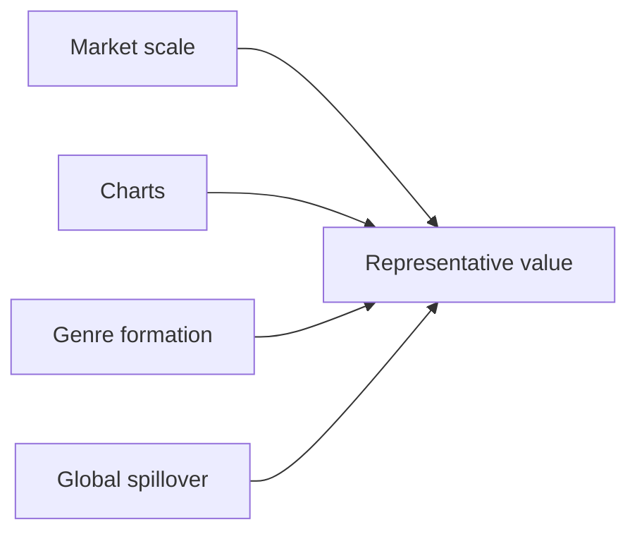

## 1. How to Read This Guide

This guide organizes popular music by asking which artists make each era legible. It focuses on popular recording artists rather than classical music: artists heard through records, charts, television, live performance, streaming, and social media. <SourceNote>For the current recorded-music market, this guide uses IFPI's [Global Music Report 2026](https://www.ifpi.org/global-music-report-2026-global-recorded-music-revenues-grow-6-4-as-record-companies-drive-innovation/) and [Global Charts](https://www.ifpi.org/our-industry/global-charts/). For historical Anglo-American pop stardom, it refers to Billboard's [Greatest Pop Stars by Year](https://www.billboard.com/lists/billboard-greatest-pop-stars-year/) and [Greatest Pop Stars of the 21st Century](https://www.billboard.com/music/pop/beyonce-greatest-pop-stars-21st-century-1235842572/).</SourceNote>

The eras are the 1980s, 1990s, 2000s, 2010s, 2020s, and today. Today means artists whose activity, listening, chart presence, touring, social visibility, or international reach remains important as of June 2026, so it can overlap with the 2020s. The selected countries and markets are the United States, United Kingdom, Japan, South Korea, France, Germany, Brazil, Nigeria, India, and the Chinese-language market.

This is not a strict ranking. The selections combine sales, chart performance, critical reputation, genre formation, international spillover, and influence on later artists. <SourceNote>IFPI reports that Japan returned to being the world's second-largest recorded-music market in 2025, China overtook Germany to become the fourth-largest market, and Brazil moved up to number eight [Global Music Report 2026](https://www.ifpi.org/global-music-report-2026-global-recorded-music-revenues-grow-6-4-as-record-companies-drive-innovation/).</SourceNote>

## 2. United States

### 1980s

**Shared pattern:** MTV, stadium touring, and the meeting of R&B with rock turned music into image, choreography, and vocal identity.

1. **Michael Jackson** - Path: From Motown child star to global solo icon, he defined the MTV age through video, dance, R&B, and pop. Appeal: listeners connected Michael Jackson with this era pattern: MTV, stadium touring, and the meeting of R&B with rock turned music into image, choreography, and vocal identity.
2. **Madonna** - Path: Emerging from New York club culture, she fused music, fashion, video, and sexual self-presentation. Appeal: listeners connected Madonna with this era pattern: MTV, stadium touring, and the meeting of R&B with rock turned music into image, choreography, and vocal identity.
3. **Prince** - Path: Based in Minneapolis, he merged funk, rock, R&B, production, and performance into an auteur model. Appeal: listeners connected Prince with this era pattern: MTV, stadium touring, and the meeting of R&B with rock turned music into image, choreography, and vocal identity.
4. **Whitney Houston** - Path: Rooted in gospel and R&B, she became the definitive late-1980s pop-ballad vocalist. Appeal: listeners connected Whitney Houston with this era pattern: MTV, stadium touring, and the meeting of R&B with rock turned music into image, choreography, and vocal identity.
5. **Bruce Springsteen** - Path: He joined working-class narrative, American rock, and stadium performance into a national figure. Appeal: listeners connected Bruce Springsteen with this era pattern: MTV, stadium touring, and the meeting of R&B with rock turned music into image, choreography, and vocal identity.

### 1990s

**Shared pattern:** The expanding CD market let R&B, alternative rock, hip-hop, and country build separate mass audiences.

1. **Mariah Carey** - Path: Her vocal range and R&B-inflected pop dominated U.S. charts from the early 1990s. Appeal: listeners connected Mariah Carey with this era pattern: The expanding CD market let R&B, alternative rock, hip-hop, and country build separate mass audiences.
2. **Nirvana** - Path: The Seattle band made grunge mainstream and changed rock after 1980s gloss. Appeal: listeners connected Nirvana with this era pattern: The expanding CD market let R&B, alternative rock, hip-hop, and country build separate mass audiences.
3. **Tupac Shakur** - Path: He combined West Coast hip-hop, social commentary, biography, and posthumous myth. Appeal: listeners connected Tupac Shakur with this era pattern: The expanding CD market let R&B, alternative rock, hip-hop, and country build separate mass audiences.
4. **Dr. Dre** - Path: After N.W.A., he defined G-funk and became the production link to Snoop Dogg and Eminem. Appeal: listeners connected Dr. Dre with this era pattern: The expanding CD market let R&B, alternative rock, hip-hop, and country build separate mass audiences.
5. **Garth Brooks** - Path: He pushed country into an arena-scale pop market and changed its commercial reach. Appeal: listeners connected Garth Brooks with this era pattern: The expanding CD market let R&B, alternative rock, hip-hop, and country build separate mass audiences.

### 2000s

**Shared pattern:** As CDs gave way to downloads, pop stardom joined albums, television, celebrity media, and fashion.

1. **Beyoncé** - Path: Moving from Destiny's Child to solo work, she integrated R&B, pop, visuals, and live spectacle. Appeal: listeners connected Beyoncé with this era pattern: As CDs gave way to downloads, pop stardom joined albums, television, celebrity media, and fashion.
2. **Eminem** - Path: From Detroit, he expanded mainstream hip-hop as a white rapper with technical force. Appeal: listeners connected Eminem with this era pattern: As CDs gave way to downloads, pop stardom joined albums, television, celebrity media, and fashion.
3. **Kanye West** - Path: He moved from producer to rapper and reshaped sampling, fashion, and album design. Appeal: listeners connected Kanye West with this era pattern: As CDs gave way to downloads, pop stardom joined albums, television, celebrity media, and fashion.
4. **Britney Spears** - Path: She became the teen-pop symbol of late MTV and peak CD-era star marketing. Appeal: listeners connected Britney Spears with this era pattern: As CDs gave way to downloads, pop stardom joined albums, television, celebrity media, and fashion.
5. **Alicia Keys** - Path: She connected classical piano with R&B and widened the neo-soul singer-songwriter model. Appeal: listeners connected Alicia Keys with this era pattern: As CDs gave way to downloads, pop stardom joined albums, television, celebrity media, and fashion.

### 2010s

**Shared pattern:** Streaming and social media placed authorship, fandom, and public argument on the same screen.

1. **Taylor Swift** - Path: Moving from country to pop, she shaped songwriting, fan economics, and rerecording strategy. Appeal: listeners connected Taylor Swift with this era pattern: Streaming and social media placed authorship, fandom, and public argument on the same screen.
2. **Drake** - Path: Canadian-born but central to U.S. hip-hop/R&B, he embodied streaming-era single consumption. Appeal: listeners connected Drake with this era pattern: Streaming and social media placed authorship, fandom, and public argument on the same screen.
3. **Lady Gaga** - Path: She built a star persona from dance-pop, theatre, fashion, and LGBTQ+ advocacy. Appeal: listeners connected Lady Gaga with this era pattern: Streaming and social media placed authorship, fandom, and public argument on the same screen.
4. **Kendrick Lamar** - Path: He defined 2010s hip-hop through conscious rap, jazz/funk inheritance, and album narrative. Appeal: listeners connected Kendrick Lamar with this era pattern: Streaming and social media placed authorship, fandom, and public argument on the same screen.
5. **Billie Eilish** - Path: With bedroom-pop production and dark minimalism, she became a late-2010s Gen Z star. Appeal: listeners connected Billie Eilish with this era pattern: Streaming and social media placed authorship, fandom, and public argument on the same screen.

### 2020s

**Shared pattern:** Short video, rerecordings, touring, and genre-crossing put older pop centers and regional genres on the same charts.

1. **Taylor Swift** - Path: Tours, rerecordings, and rapid album cycles made her a symbol of early-2020s global music consumption. Appeal: listeners connected Taylor Swift with this era pattern: Short video, rerecordings, touring, and genre-crossing put older pop centers and regional genres on the same charts.
2. **Beyoncé** - Path: She reframed house, country, and Black music history through concept-driven albums. Appeal: listeners connected Beyoncé with this era pattern: Short video, rerecordings, touring, and genre-crossing put older pop centers and regional genres on the same charts.
3. **Morgan Wallen** - Path: He represents the streaming-era expansion of country music beyond its older frame. Appeal: listeners connected Morgan Wallen with this era pattern: Short video, rerecordings, touring, and genre-crossing put older pop centers and regional genres on the same charts.
4. **SZA** - Path: Her alternative R&B and inward lyric writing define long-tail 2020s R&B listening. Appeal: listeners connected SZA with this era pattern: Short video, rerecordings, touring, and genre-crossing put older pop centers and regional genres on the same charts.
5. **Olivia Rodrigo** - Path: From Disney roots, she turned toward rock-inflected Gen Z pop with global reach. Appeal: listeners connected Olivia Rodrigo with this era pattern: Short video, rerecordings, touring, and genre-crossing put older pop centers and regional genres on the same charts.

### Today

**Shared pattern:** Current U.S. pop runs on catalogue listening, tour economics, fan mobilization, and critical narratives at once.

1. **Taylor Swift** - Path: She topped IFPI's 2025 Global Artist Chart and remains a catalogue-wide listening force. Appeal: listeners connected Taylor Swift with this era pattern: Current U.S. pop runs on catalogue listening, tour economics, fan mobilization, and critical narratives at once.
2. **Kendrick Lamar** - Path: He remains a U.S. hip-hop reference point through craft, live performance, and social context. Appeal: listeners connected Kendrick Lamar with this era pattern: Current U.S. pop runs on catalogue listening, tour economics, fan mobilization, and critical narratives at once.
3. **Billie Eilish** - Path: She keeps critical and youth-audience strength with sparse, intimate pop. Appeal: listeners connected Billie Eilish with this era pattern: Current U.S. pop runs on catalogue listening, tour economics, fan mobilization, and critical narratives at once.
4. **Sabrina Carpenter** - Path: Moving from acting into international pop hits, she reached IFPI's 2025 global upper tier. Appeal: listeners connected Sabrina Carpenter with this era pattern: Current U.S. pop runs on catalogue listening, tour economics, fan mobilization, and critical narratives at once.
5. **SZA** - Path: She sustains strong album and track listening across R&B and pop audiences. Appeal: listeners connected SZA with this era pattern: Current U.S. pop runs on catalogue listening, tour economics, fan mobilization, and critical narratives at once.

## 3. United Kingdom

### 1980s

**Shared pattern:** British pop drew on rock history, new wave, and soul-leaning pop to build international television-era stars.

1. **Queen** - Path: With earlier foundations already built, Queen became an emblem of British rock mass appeal and live power. Appeal: listeners connected Queen with this era pattern: British pop drew on rock history, new wave, and soul-leaning pop to build international television-era stars.
2. **David Bowie** - Path: In the 1980s he re-expanded as a global pop star while keeping the model of artist-as-transformation. Appeal: listeners connected David Bowie with this era pattern: British pop drew on rock history, new wave, and soul-leaning pop to build international television-era stars.
3. **George Michael** - Path: From Wham! to solo work, he brought British R&B-leaning pop to the world market. Appeal: listeners connected George Michael with this era pattern: British pop drew on rock history, new wave, and soul-leaning pop to build international television-era stars.
4. **Kate Bush** - Path: She established a singular singer-songwriter model built on experiment, literature, and movement. Appeal: listeners connected Kate Bush with this era pattern: British pop drew on rock history, new wave, and soul-leaning pop to build international television-era stars.
5. **The Smiths** - Path: From Manchester, they shaped indie rock through lyrics and guitar language. Appeal: listeners connected The Smiths with this era pattern: British pop drew on rock history, new wave, and soul-leaning pop to build international television-era stars.

### 1990s

**Shared pattern:** Britpop, girl groups, club culture, and alternative rock competed while selling different versions of Britishness.

1. **Oasis** - Path: They became Britpop's mass peak and revived a working-class rock narrative. Appeal: listeners connected Oasis with this era pattern: Britpop, girl groups, club culture, and alternative rock competed while selling different versions of Britishness.
2. **Blur** - Path: They represented Britpop's urban and art-school side before moving into experimentation. Appeal: listeners connected Blur with this era pattern: Britpop, girl groups, club culture, and alternative rock competed while selling different versions of Britishness.
3. **Spice Girls** - Path: They linked girl-group pop, merchandising, media strategy, and 1990s identity language. Appeal: listeners connected Spice Girls with this era pattern: Britpop, girl groups, club culture, and alternative rock competed while selling different versions of Britishness.
4. **Radiohead** - Path: They moved from alternative rock to electronic experiment and changed album expectations. Appeal: listeners connected Radiohead with this era pattern: Britpop, girl groups, club culture, and alternative rock competed while selling different versions of Britishness.
5. **The Prodigy** - Path: They carried rave, big beat, and rock physicality into global popular culture. Appeal: listeners connected The Prodigy with this era pattern: Britpop, girl groups, club culture, and alternative rock competed while selling different versions of Britishness.

### 2000s

**Shared pattern:** Guitar rock, soul revival, internet discovery, and stadium scale supported export-ready British pop.

1. **Coldplay** - Path: After Britpop, they became a global stadium band built on melodic rock. Appeal: listeners connected Coldplay with this era pattern: Guitar rock, soul revival, internet discovery, and stadium scale supported export-ready British pop.
2. **Amy Winehouse** - Path: She reworked jazz, soul, and R&B into a modern voice with lasting influence. Appeal: listeners connected Amy Winehouse with this era pattern: Guitar rock, soul revival, internet discovery, and stadium scale supported export-ready British pop.
3. **Adele** - Path: Emerging at the end of the decade, she prepared the next decade's vocal-ballad dominance. Appeal: listeners connected Adele with this era pattern: Guitar rock, soul revival, internet discovery, and stadium scale supported export-ready British pop.
4. **Arctic Monkeys** - Path: Internet word-of-mouth helped them become the new face of British guitar rock. Appeal: listeners connected Arctic Monkeys with this era pattern: Guitar rock, soul revival, internet discovery, and stadium scale supported export-ready British pop.
5. **Muse** - Path: They combined progressive rock, electronics, and stadium theatricality. Appeal: listeners connected Muse with this era pattern: Guitar rock, soul revival, internet discovery, and stadium scale supported export-ready British pop.

### 2010s

**Shared pattern:** Talent television, social media, streaming, and songwriter culture linked British artists to the world market.

1. **Adele** - Path: She sold albums globally at a scale that bridged the pre-streaming and streaming eras. Appeal: listeners connected Adele with this era pattern: Talent television, social media, streaming, and songwriter culture linked British artists to the world market.
2. **Ed Sheeran** - Path: From loop-pedal solo performance, he became a global pop songwriter and performer. Appeal: listeners connected Ed Sheeran with this era pattern: Talent television, social media, streaming, and songwriter culture linked British artists to the world market.
3. **One Direction** - Path: The TV-formed boy band expanded fandom in the social-media era. Appeal: listeners connected One Direction with this era pattern: Talent television, social media, streaming, and songwriter culture linked British artists to the world market.
4. **Dua Lipa** - Path: She connected dance-pop and fashion into an international British pop-star model. Appeal: listeners connected Dua Lipa with this era pattern: Talent television, social media, streaming, and songwriter culture linked British artists to the world market.
5. **Sam Smith** - Path: Their soulful voice and ballads reached global charts. Appeal: listeners connected Sam Smith with this era pattern: Talent television, social media, streaming, and songwriter culture linked British artists to the world market.

### 2020s

**Shared pattern:** Solo careers after groups, UK rap, and club producers multiplied the entry points into British pop.

1. **Harry Styles** - Path: After One Direction, he crossed rock, pop, fashion, and film-like celebrity. Appeal: listeners connected Harry Styles with this era pattern: Solo careers after groups, UK rap, and club producers multiplied the entry points into British pop.
2. **Dua Lipa** - Path: She reinforced disco and dance-pop as a durable international lane. Appeal: listeners connected Dua Lipa with this era pattern: Solo careers after groups, UK rap, and club producers multiplied the entry points into British pop.
3. **Adele** - Path: With infrequent releases, she still commands global album attention. Appeal: listeners connected Adele with this era pattern: Solo careers after groups, UK rap, and club producers multiplied the entry points into British pop.
4. **Central Cee** - Path: He brought UK drill into broader international hip-hop circulation. Appeal: listeners connected Central Cee with this era pattern: Solo careers after groups, UK rap, and club producers multiplied the entry points into British pop.
5. **Raye** - Path: After writing for others, her independent breakthrough combined industry critique and vocal craft. Appeal: listeners connected Raye with this era pattern: Solo careers after groups, UK rap, and club producers multiplied the entry points into British pop.

### Today

**Shared pattern:** Current British artists connect dance-pop, club criticism, UK rap, and electronic music to charts and festivals.

1. **Dua Lipa** - Path: She remains Britain's leading global dance-pop export. Appeal: listeners connected Dua Lipa with this era pattern: Current British artists connect dance-pop, club criticism, UK rap, and electronic music to charts and festivals.
2. **Raye** - Path: Her writing, voice, and industry narrative make her a current British-pop focal point. Appeal: listeners connected Raye with this era pattern: Current British artists connect dance-pop, club criticism, UK rap, and electronic music to charts and festivals.
3. **Charli xcx** - Path: She connects club culture, hyperpop, and internet culture in 2020s pop criticism. Appeal: listeners connected Charli xcx with this era pattern: Current British artists connect dance-pop, club criticism, UK rap, and electronic music to charts and festivals.
4. **Central Cee** - Path: He pushes British rap into U.S. and European listening circuits. Appeal: listeners connected Central Cee with this era pattern: Current British artists connect dance-pop, club criticism, UK rap, and electronic music to charts and festivals.
5. **Fred again..** - Path: The producer turned electronic live performance into mass, improvisational pop spectacle. Appeal: listeners connected Fred again.. with this era pattern: Current British artists connect dance-pop, club criticism, UK rap, and electronic music to charts and festivals.

## 4. Japan

### 1980s

**Shared pattern:** Television music shows, idol kayokyoku, city pop, and electronic music tied home viewing to record buying.

1. **サザンオールスターズ** - Path: A national band that broadened the blend of pop, rock, and kayokyoku. Appeal: listeners connected サザンオールスターズ with this era pattern: Television music shows, idol kayokyoku, city pop, and electronic music tied home viewing to record buying.
2. **松任谷由実** - Path: She defined urban lyricism and the Japanese female singer-songwriter model. Appeal: listeners connected 松任谷由実 with this era pattern: Television music shows, idol kayokyoku, city pop, and electronic music tied home viewing to record buying.
3. **松田聖子** - Path: She built the 1980s Japanese idol template through songs, television, and image. Appeal: listeners connected 松田聖子 with this era pattern: Television music shows, idol kayokyoku, city pop, and electronic music tied home viewing to record buying.
4. **中森明菜** - Path: She pushed idol singing toward darker expression and performance maturity. Appeal: listeners connected 中森明菜 with this era pattern: Television music shows, idol kayokyoku, city pop, and electronic music tied home viewing to record buying.
5. **Yellow Magic Orchestra** - Path: Their technopop and design sensibility influenced pop and electronic music internationally. Appeal: listeners connected Yellow Magic Orchestra with this era pattern: Television music shows, idol kayokyoku, city pop, and electronic music tied home viewing to record buying.

### 1990s

**Shared pattern:** The CD boom, karaoke, drama tie-ins, and producer-led dance pop built the large J-pop market.

1. **Mr.Children** - Path: They joined introspective lyrics with mass J-pop band success. Appeal: listeners connected Mr.Children with this era pattern: The CD boom, karaoke, drama tie-ins, and producer-led dance pop built the large J-pop market.
2. **B'z** - Path: Their guitar-driven hard-rock pop produced massive Japanese sales. Appeal: listeners connected B'z with this era pattern: The CD boom, karaoke, drama tie-ins, and producer-led dance pop built the large J-pop market.
3. **DREAMS COME TRUE** - Path: They sat at the center of 1990s J-pop through R&B, pop, and live strength. Appeal: listeners connected DREAMS COME TRUE with this era pattern: The CD boom, karaoke, drama tie-ins, and producer-led dance pop built the large J-pop market.
4. **安室奈美恵** - Path: She became a dance-pop and fashion icon under and after Tetsuya Komuro. Appeal: listeners connected 安室奈美恵 with this era pattern: The CD boom, karaoke, drama tie-ins, and producer-led dance pop built the large J-pop market.
5. **宇多田ヒカル** - Path: Arriving in the late 1990s, she changed J-pop language through R&B feel and authorship. Appeal: listeners connected 宇多田ヒカル with this era pattern: The CD boom, karaoke, drama tie-ins, and producer-led dance pop built the large J-pop market.

### 2000s

**Shared pattern:** CD sales, mobile downloads, television, and fan clubs supported stars who joined lyrics, visuals, and live shows.

1. **浜崎あゆみ** - Path: Lyrics, visuals, and fan culture made her a defining early-2000s J-pop star. Appeal: listeners connected 浜崎あゆみ with this era pattern: CD sales, mobile downloads, television, and fan clubs supported stars who joined lyrics, visuals, and live shows.
2. **宇多田ヒカル** - Path: Her albums kept a high standard of craft and international pop/R&B sensibility. Appeal: listeners connected 宇多田ヒカル with this era pattern: CD sales, mobile downloads, television, and fan clubs supported stars who joined lyrics, visuals, and live shows.
3. **嵐** - Path: The idol group linked television, live shows, CD sales, and national popularity. Appeal: listeners connected 嵐 with this era pattern: CD sales, mobile downloads, television, and fan clubs supported stars who joined lyrics, visuals, and live shows.
4. **EXILE** - Path: They expanded the Japanese dance-and-vocal group model. Appeal: listeners connected EXILE with this era pattern: CD sales, mobile downloads, television, and fan clubs supported stars who joined lyrics, visuals, and live shows.
5. **倖田來未** - Path: She foregrounded R&B, dance, and female self-presentation in 2000s pop. Appeal: listeners connected 倖田來未 with this era pattern: CD sales, mobile downloads, television, and fan clubs supported stars who joined lyrics, visuals, and live shows.

### 2010s

**Shared pattern:** Handshakes, video sites, anime, and social media placed participatory idols beside internet-native writers.

1. **AKB48** - Path: Theater shows, handshakes, and elections turned participation into idol-market scale. Appeal: listeners connected AKB48 with this era pattern: Handshakes, video sites, anime, and social media placed participatory idols beside internet-native writers.
2. **Perfume** - Path: With Yasutaka Nakata's electronics and precise choreography, they updated Japanese technopop. Appeal: listeners connected Perfume with this era pattern: Handshakes, video sites, anime, and social media placed participatory idols beside internet-native writers.
3. **ONE OK ROCK** - Path: They connected domestic rock with international touring. Appeal: listeners connected ONE OK ROCK with this era pattern: Handshakes, video sites, anime, and social media placed participatory idols beside internet-native writers.
4. **米津玄師** - Path: From Vocaloid culture, he entered the mainstream while keeping authorship. Appeal: listeners connected 米津玄師 with this era pattern: Handshakes, video sites, anime, and social media placed participatory idols beside internet-native writers.
5. **星野源** - Path: As actor, writer, and musician, he spread everyday-feeling pop across media. Appeal: listeners connected 星野源 with this era pattern: Handshakes, video sites, anime, and social media placed participatory idols beside internet-native writers.

### 2020s

**Shared pattern:** Streaming, anime themes, post-Vocaloid authorship, and masked vocal performance widened overseas listening.

1. **YOASOBI** - Path: Fiction-based production and streaming hits extended Japanese-language pop overseas. Appeal: listeners connected YOASOBI with this era pattern: Streaming, anime themes, post-Vocaloid authorship, and masked vocal performance widened overseas listening.
2. **Ado** - Path: With hidden-face performance and Vocaloid-network roots, she reached young listeners quickly. Appeal: listeners connected Ado with this era pattern: Streaming, anime themes, post-Vocaloid authorship, and masked vocal performance widened overseas listening.
3. **Official髭男dism** - Path: Their band performance and sophisticated pop writing anchor streaming-era J-pop. Appeal: listeners connected Official髭男dism with this era pattern: Streaming, anime themes, post-Vocaloid authorship, and masked vocal performance widened overseas listening.
4. **King Gnu** - Path: They join art-school aesthetics, rock, mix, and major tie-ins. Appeal: listeners connected King Gnu with this era pattern: Streaming, anime themes, post-Vocaloid authorship, and masked vocal performance widened overseas listening.
5. **Creepy Nuts** - Path: Hip-hop, television, and anime themes gave them international track visibility. Appeal: listeners connected Creepy Nuts with this era pattern: Streaming, anime themes, post-Vocaloid authorship, and masked vocal performance widened overseas listening.

### Today

**Shared pattern:** Current J-pop combines the domestic live market, film and anime tie-ins, and streaming-born hits.

1. **Mrs. GREEN APPLE** - Path: The band is highly visible in mid-2020s Japanese charts and live culture. Appeal: listeners connected Mrs. GREEN APPLE with this era pattern: Current J-pop combines the domestic live market, film and anime tie-ins, and streaming-born hits.
2. **米津玄師** - Path: His Vocaloid-rooted authorship remains powerful across film, anime, and game themes. Appeal: listeners connected 米津玄師 with this era pattern: Current J-pop combines the domestic live market, film and anime tie-ins, and streaming-born hits.
3. **YOASOBI** - Path: Anime, overseas festivals, and streaming keep extending Japanese-language reach. Appeal: listeners connected YOASOBI with this era pattern: Current J-pop combines the domestic live market, film and anime tie-ins, and streaming-born hits.
4. **Snow Man** - Path: They show the continuing strength of physical sales, video, live shows, and fandom. Appeal: listeners connected Snow Man with this era pattern: Current J-pop combines the domestic live market, film and anime tie-ins, and streaming-born hits.
5. **Ado** - Path: Her voice and relative anonymity support domestic and international touring. Appeal: listeners connected Ado with this era pattern: Current J-pop combines the domestic live market, film and anime tie-ins, and streaming-born hits.

## 5. South Korea

### 1980s

**Shared pattern:** Before K-pop, Korean popular music reached broad generations through national singers, ballads, rock, and television song shows.

1. **Cho Yong-pil** - Path: Cho Yong-pil shows Korean popular music before and after K-pop through national singers, rock, television pop, and dance culture. Appeal: listeners connected Cho Yong-pil with this era pattern: Before K-pop, Korean popular music reached broad generations through national singers, ballads, rock, and television song shows.
2. **Lee Moon-sae** - Path: Lee Moon-sae shows Korean popular music before and after K-pop through national singers, rock, television pop, and dance culture. Appeal: listeners connected Lee Moon-sae with this era pattern: Before K-pop, Korean popular music reached broad generations through national singers, ballads, rock, and television song shows.
3. **Kim Wan-sun** - Path: Kim Wan-sun shows Korean popular music before and after K-pop through national singers, rock, television pop, and dance culture. Appeal: listeners connected Kim Wan-sun with this era pattern: Before K-pop, Korean popular music reached broad generations through national singers, ballads, rock, and television song shows.
4. **Deulgukhwa** - Path: Deulgukhwa shows Korean popular music before and after K-pop through national singers, rock, television pop, and dance culture. Appeal: listeners connected Deulgukhwa with this era pattern: Before K-pop, Korean popular music reached broad generations through national singers, ballads, rock, and television song shows.
5. **Nami** - Path: Nami shows Korean popular music before and after K-pop through national singers, rock, television pop, and dance culture. Appeal: listeners connected Nami with this era pattern: Before K-pop, Korean popular music reached broad generations through national singers, ballads, rock, and television song shows.

### 1990s

**Shared pattern:** Dance, rap, idol training, and television music programs began to form the K-pop industry model.

1. **Seo Taiji and Boys** - Path: Seo Taiji and Boys shows Korean popular music before and after K-pop through national singers, rock, television pop, and dance culture. Appeal: listeners connected Seo Taiji and Boys with this era pattern: Dance, rap, idol training, and television music programs began to form the K-pop industry model.
2. **H.O.T.** - Path: H.O.T. shows Korean popular music before and after K-pop through national singers, rock, television pop, and dance culture. Appeal: listeners connected H.O.T. with this era pattern: Dance, rap, idol training, and television music programs began to form the K-pop industry model.
3. **S.E.S.** - Path: S.E.S. shows Korean popular music before and after K-pop through national singers, rock, television pop, and dance culture. Appeal: listeners connected S.E.S. with this era pattern: Dance, rap, idol training, and television music programs began to form the K-pop industry model.
4. **Kim Gun-mo** - Path: Kim Gun-mo shows Korean popular music before and after K-pop through national singers, rock, television pop, and dance culture. Appeal: listeners connected Kim Gun-mo with this era pattern: Dance, rap, idol training, and television music programs began to form the K-pop industry model.
5. **Deux** - Path: Deux shows Korean popular music before and after K-pop through national singers, rock, television pop, and dance culture. Appeal: listeners connected Deux with this era pattern: Dance, rap, idol training, and television music programs began to form the K-pop industry model.

### 2000s

**Shared pattern:** Japan expansion, Asian touring, trainee systems, and music programs shaped Korean idols as export acts.

1. **BoA** - Path: BoA shows Korean popular music before and after K-pop through national singers, rock, television pop, and dance culture. Appeal: listeners connected BoA with this era pattern: Japan expansion, Asian touring, trainee systems, and music programs shaped Korean idols as export acts.
2. **TVXQ!** - Path: TVXQ! shows Korean popular music before and after K-pop through national singers, rock, television pop, and dance culture. Appeal: listeners connected TVXQ! with this era pattern: Japan expansion, Asian touring, trainee systems, and music programs shaped Korean idols as export acts.
3. **BIGBANG** - Path: BIGBANG shows Korean popular music before and after K-pop through national singers, rock, television pop, and dance culture. Appeal: listeners connected BIGBANG with this era pattern: Japan expansion, Asian touring, trainee systems, and music programs shaped Korean idols as export acts.
4. **Girls' Generation** - Path: Girls' Generation shows Korean popular music before and after K-pop through national singers, rock, television pop, and dance culture. Appeal: listeners connected Girls' Generation with this era pattern: Japan expansion, Asian touring, trainee systems, and music programs shaped Korean idols as export acts.
5. **Wonder Girls** - Path: Wonder Girls shows Korean popular music before and after K-pop through national singers, rock, television pop, and dance culture. Appeal: listeners connected Wonder Girls with this era pattern: Japan expansion, Asian touring, trainee systems, and music programs shaped Korean idols as export acts.

### 2010s

**Shared pattern:** YouTube, social media, fan translation, and synchronized choreography made K-pop a globally simultaneous format.

1. **BTS** - Path: BTS shows Korean popular music before and after K-pop through national singers, rock, television pop, and dance culture. Appeal: listeners connected BTS with this era pattern: YouTube, social media, fan translation, and synchronized choreography made K-pop a globally simultaneous format.
2. **BLACKPINK** - Path: BLACKPINK shows Korean popular music before and after K-pop through national singers, rock, television pop, and dance culture. Appeal: listeners connected BLACKPINK with this era pattern: YouTube, social media, fan translation, and synchronized choreography made K-pop a globally simultaneous format.
3. **EXO** - Path: EXO shows Korean popular music before and after K-pop through national singers, rock, television pop, and dance culture. Appeal: listeners connected EXO with this era pattern: YouTube, social media, fan translation, and synchronized choreography made K-pop a globally simultaneous format.
4. **TWICE** - Path: TWICE shows Korean popular music before and after K-pop through national singers, rock, television pop, and dance culture. Appeal: listeners connected TWICE with this era pattern: YouTube, social media, fan translation, and synchronized choreography made K-pop a globally simultaneous format.
5. **IU** - Path: IU shows Korean popular music before and after K-pop through national singers, rock, television pop, and dance culture. Appeal: listeners connected IU with this era pattern: YouTube, social media, fan translation, and synchronized choreography made K-pop a globally simultaneous format.

### 2020s

**Shared pattern:** Album purchasing, short video, fan voting, and multinational members keep renewing K-pop competition.

1. **Stray Kids** - Path: Stray Kids shows Korean popular music before and after K-pop through national singers, rock, television pop, and dance culture. Appeal: listeners connected Stray Kids with this era pattern: Album purchasing, short video, fan voting, and multinational members keep renewing K-pop competition.
2. **SEVENTEEN** - Path: SEVENTEEN shows Korean popular music before and after K-pop through national singers, rock, television pop, and dance culture. Appeal: listeners connected SEVENTEEN with this era pattern: Album purchasing, short video, fan voting, and multinational members keep renewing K-pop competition.
3. **NewJeans** - Path: NewJeans shows Korean popular music before and after K-pop through national singers, rock, television pop, and dance culture. Appeal: listeners connected NewJeans with this era pattern: Album purchasing, short video, fan voting, and multinational members keep renewing K-pop competition.
4. **aespa** - Path: aespa shows Korean popular music before and after K-pop through national singers, rock, television pop, and dance culture. Appeal: listeners connected aespa with this era pattern: Album purchasing, short video, fan voting, and multinational members keep renewing K-pop competition.
5. **IVE** - Path: IVE shows Korean popular music before and after K-pop through national singers, rock, television pop, and dance culture. Appeal: listeners connected IVE with this era pattern: Album purchasing, short video, fan voting, and multinational members keep renewing K-pop competition.

### Today

**Shared pattern:** Current Korean acts combine group work, solo work, military service, contract cycles, and world tours.

1. **Stray Kids** - Path: Stray Kids shows Korean popular music before and after K-pop through national singers, rock, television pop, and dance culture. Appeal: listeners connected Stray Kids with this era pattern: Current Korean acts combine group work, solo work, military service, contract cycles, and world tours.
2. **SEVENTEEN** - Path: SEVENTEEN shows Korean popular music before and after K-pop through national singers, rock, television pop, and dance culture. Appeal: listeners connected SEVENTEEN with this era pattern: Current Korean acts combine group work, solo work, military service, contract cycles, and world tours.
3. **BTS** - Path: BTS shows Korean popular music before and after K-pop through national singers, rock, television pop, and dance culture. Appeal: listeners connected BTS with this era pattern: Current Korean acts combine group work, solo work, military service, contract cycles, and world tours.
4. **BLACKPINK** - Path: BLACKPINK shows Korean popular music before and after K-pop through national singers, rock, television pop, and dance culture. Appeal: listeners connected BLACKPINK with this era pattern: Current Korean acts combine group work, solo work, military service, contract cycles, and world tours.
5. **aespa** - Path: aespa shows Korean popular music before and after K-pop through national singers, rock, television pop, and dance culture. Appeal: listeners connected aespa with this era pattern: Current Korean acts combine group work, solo work, military service, contract cycles, and world tours.

## 6. France

### 1980s

**Shared pattern:** French pop expanded through post-chanson language, synth-pop, rock, and television visibility.

1. **Mylène Farmer** - Path: Mylène Farmer marks French-language pop through chanson-inflected pop, rock, rap, electronic music, and Afropop/R&B. Appeal: listeners connected Mylène Farmer with this era pattern: French pop expanded through post-chanson language, synth-pop, rock, and television visibility.
2. **Jean-Jacques Goldman** - Path: Jean-Jacques Goldman marks French-language pop through chanson-inflected pop, rock, rap, electronic music, and Afropop/R&B. Appeal: listeners connected Jean-Jacques Goldman with this era pattern: French pop expanded through post-chanson language, synth-pop, rock, and television visibility.
3. **Indochine** - Path: Indochine marks French-language pop through chanson-inflected pop, rock, rap, electronic music, and Afropop/R&B. Appeal: listeners connected Indochine with this era pattern: French pop expanded through post-chanson language, synth-pop, rock, and television visibility.
4. **Daniel Balavoine** - Path: Daniel Balavoine marks French-language pop through chanson-inflected pop, rock, rap, electronic music, and Afropop/R&B. Appeal: listeners connected Daniel Balavoine with this era pattern: French pop expanded through post-chanson language, synth-pop, rock, and television visibility.
5. **Vanessa Paradis** - Path: Vanessa Paradis marks French-language pop through chanson-inflected pop, rock, rap, electronic music, and Afropop/R&B. Appeal: listeners connected Vanessa Paradis with this era pattern: French pop expanded through post-chanson language, synth-pop, rock, and television visibility.

### 1990s

**Shared pattern:** French rap, dance music, rock, and adult pop singing pushed urban and club sensibilities forward.

1. **MC Solaar** - Path: MC Solaar marks French-language pop through chanson-inflected pop, rock, rap, electronic music, and Afropop/R&B. Appeal: listeners connected MC Solaar with this era pattern: French rap, dance music, rock, and adult pop singing pushed urban and club sensibilities forward.
2. **Daft Punk** - Path: Daft Punk marks French-language pop through chanson-inflected pop, rock, rap, electronic music, and Afropop/R&B. Appeal: listeners connected Daft Punk with this era pattern: French rap, dance music, rock, and adult pop singing pushed urban and club sensibilities forward.
3. **IAM** - Path: IAM marks French-language pop through chanson-inflected pop, rock, rap, electronic music, and Afropop/R&B. Appeal: listeners connected IAM with this era pattern: French rap, dance music, rock, and adult pop singing pushed urban and club sensibilities forward.
4. **Zazie** - Path: Zazie marks French-language pop through chanson-inflected pop, rock, rap, electronic music, and Afropop/R&B. Appeal: listeners connected Zazie with this era pattern: French rap, dance music, rock, and adult pop singing pushed urban and club sensibilities forward.
5. **Patricia Kaas** - Path: Patricia Kaas marks French-language pop through chanson-inflected pop, rock, rap, electronic music, and Afropop/R&B. Appeal: listeners connected Patricia Kaas with this era pattern: French rap, dance music, rock, and adult pop singing pushed urban and club sensibilities forward.

### 2000s

**Shared pattern:** Post-French-touch electronic music, indie rock, R&B, and women rappers crossed international and domestic media.

1. **David Guetta** - Path: David Guetta marks French-language pop through chanson-inflected pop, rock, rap, electronic music, and Afropop/R&B. Appeal: listeners connected David Guetta with this era pattern: Post-French-touch electronic music, indie rock, R&B, and women rappers crossed international and domestic media.
2. **Phoenix** - Path: Phoenix marks French-language pop through chanson-inflected pop, rock, rap, electronic music, and Afropop/R&B. Appeal: listeners connected Phoenix with this era pattern: Post-French-touch electronic music, indie rock, R&B, and women rappers crossed international and domestic media.
3. **Air** - Path: Air marks French-language pop through chanson-inflected pop, rock, rap, electronic music, and Afropop/R&B. Appeal: listeners connected Air with this era pattern: Post-French-touch electronic music, indie rock, R&B, and women rappers crossed international and domestic media.
4. **Diam's** - Path: Diam's marks French-language pop through chanson-inflected pop, rock, rap, electronic music, and Afropop/R&B. Appeal: listeners connected Diam's with this era pattern: Post-French-touch electronic music, indie rock, R&B, and women rappers crossed international and domestic media.
5. **Amel Bent** - Path: Amel Bent marks French-language pop through chanson-inflected pop, rock, rap, electronic music, and Afropop/R&B. Appeal: listeners connected Amel Bent with this era pattern: Post-French-touch electronic music, indie rock, R&B, and women rappers crossed international and domestic media.

### 2010s

**Shared pattern:** Streaming, rap from immigrant backgrounds, Afropop, and bilingual pop widened Francophone listening.

1. **Christine and the Queens** - Path: Christine and the Queens marks French-language pop through chanson-inflected pop, rock, rap, electronic music, and Afropop/R&B. Appeal: listeners connected Christine and the Queens with this era pattern: Streaming, rap from immigrant backgrounds, Afropop, and bilingual pop widened Francophone listening.
2. **Maître Gims** - Path: Maître Gims marks French-language pop through chanson-inflected pop, rock, rap, electronic music, and Afropop/R&B. Appeal: listeners connected Maître Gims with this era pattern: Streaming, rap from immigrant backgrounds, Afropop, and bilingual pop widened Francophone listening.
3. **PNL** - Path: PNL marks French-language pop through chanson-inflected pop, rock, rap, electronic music, and Afropop/R&B. Appeal: listeners connected PNL with this era pattern: Streaming, rap from immigrant backgrounds, Afropop, and bilingual pop widened Francophone listening.
4. **Aya Nakamura** - Path: Aya Nakamura marks French-language pop through chanson-inflected pop, rock, rap, electronic music, and Afropop/R&B. Appeal: listeners connected Aya Nakamura with this era pattern: Streaming, rap from immigrant backgrounds, Afropop, and bilingual pop widened Francophone listening.
5. **Jain** - Path: Jain marks French-language pop through chanson-inflected pop, rock, rap, electronic music, and Afropop/R&B. Appeal: listeners connected Jain with this era pattern: Streaming, rap from immigrant backgrounds, Afropop, and bilingual pop widened Francophone listening.

### 2020s

**Shared pattern:** Rap, trap, post-chanson songwriting, and TikTok strengthened circulation outside France.

1. **Aya Nakamura** - Path: Aya Nakamura marks French-language pop through chanson-inflected pop, rock, rap, electronic music, and Afropop/R&B. Appeal: listeners connected Aya Nakamura with this era pattern: Rap, trap, post-chanson songwriting, and TikTok strengthened circulation outside France.
2. **Jul** - Path: Jul marks French-language pop through chanson-inflected pop, rock, rap, electronic music, and Afropop/R&B. Appeal: listeners connected Jul with this era pattern: Rap, trap, post-chanson songwriting, and TikTok strengthened circulation outside France.
3. **Gazo** - Path: Gazo marks French-language pop through chanson-inflected pop, rock, rap, electronic music, and Afropop/R&B. Appeal: listeners connected Gazo with this era pattern: Rap, trap, post-chanson songwriting, and TikTok strengthened circulation outside France.
4. **Orelsan** - Path: Orelsan marks French-language pop through chanson-inflected pop, rock, rap, electronic music, and Afropop/R&B. Appeal: listeners connected Orelsan with this era pattern: Rap, trap, post-chanson songwriting, and TikTok strengthened circulation outside France.
5. **Zaho de Sagazan** - Path: Zaho de Sagazan marks French-language pop through chanson-inflected pop, rock, rap, electronic music, and Afropop/R&B. Appeal: listeners connected Zaho de Sagazan with this era pattern: Rap, trap, post-chanson songwriting, and TikTok strengthened circulation outside France.

### Today

**Shared pattern:** Current Francophone pop runs urban rap, Afro-linked rhythms, and festival-ready singing in the same market.

1. **Aya Nakamura** - Path: Aya Nakamura marks French-language pop through chanson-inflected pop, rock, rap, electronic music, and Afropop/R&B. Appeal: listeners connected Aya Nakamura with this era pattern: Current Francophone pop runs urban rap, Afro-linked rhythms, and festival-ready singing in the same market.
2. **Jul** - Path: Jul marks French-language pop through chanson-inflected pop, rock, rap, electronic music, and Afropop/R&B. Appeal: listeners connected Jul with this era pattern: Current Francophone pop runs urban rap, Afro-linked rhythms, and festival-ready singing in the same market.
3. **Gazo** - Path: Gazo marks French-language pop through chanson-inflected pop, rock, rap, electronic music, and Afropop/R&B. Appeal: listeners connected Gazo with this era pattern: Current Francophone pop runs urban rap, Afro-linked rhythms, and festival-ready singing in the same market.
4. **Zaho de Sagazan** - Path: Zaho de Sagazan marks French-language pop through chanson-inflected pop, rock, rap, electronic music, and Afropop/R&B. Appeal: listeners connected Zaho de Sagazan with this era pattern: Current Francophone pop runs urban rap, Afro-linked rhythms, and festival-ready singing in the same market.
5. **Phoenix** - Path: Phoenix marks French-language pop through chanson-inflected pop, rock, rap, electronic music, and Afropop/R&B. Appeal: listeners connected Phoenix with this era pattern: Current Francophone pop runs urban rap, Afro-linked rhythms, and festival-ready singing in the same market.

## 7. Germany

### 1980s

**Shared pattern:** German pop joined electronic music, rock, exportable melody, and German-language lyrics in Cold War Europe.

1. **Nena** - Path: Nena shows changes in German-language pop, rock, electronic music, club music, and Deutschrap. Appeal: listeners connected Nena with this era pattern: German pop joined electronic music, rock, exportable melody, and German-language lyrics in Cold War Europe.
2. **Scorpions** - Path: Scorpions shows changes in German-language pop, rock, electronic music, club music, and Deutschrap. Appeal: listeners connected Scorpions with this era pattern: German pop joined electronic music, rock, exportable melody, and German-language lyrics in Cold War Europe.
3. **Kraftwerk** - Path: Kraftwerk shows changes in German-language pop, rock, electronic music, club music, and Deutschrap. Appeal: listeners connected Kraftwerk with this era pattern: German pop joined electronic music, rock, exportable melody, and German-language lyrics in Cold War Europe.
4. **Modern Talking** - Path: Modern Talking shows changes in German-language pop, rock, electronic music, club music, and Deutschrap. Appeal: listeners connected Modern Talking with this era pattern: German pop joined electronic music, rock, exportable melody, and German-language lyrics in Cold War Europe.
5. **Herbert Grönemeyer** - Path: Herbert Grönemeyer shows changes in German-language pop, rock, electronic music, club music, and Deutschrap. Appeal: listeners connected Herbert Grönemeyer with this era pattern: German pop joined electronic music, rock, exportable melody, and German-language lyrics in Cold War Europe.

### 1990s

**Shared pattern:** After reunification, industrial rock, punk, techno, and hip-hop reached mass audiences through regional scenes.

1. **Rammstein** - Path: Rammstein shows changes in German-language pop, rock, electronic music, club music, and Deutschrap. Appeal: listeners connected Rammstein with this era pattern: After reunification, industrial rock, punk, techno, and hip-hop reached mass audiences through regional scenes.
2. **Die Toten Hosen** - Path: Die Toten Hosen shows changes in German-language pop, rock, electronic music, club music, and Deutschrap. Appeal: listeners connected Die Toten Hosen with this era pattern: After reunification, industrial rock, punk, techno, and hip-hop reached mass audiences through regional scenes.
3. **Scooter** - Path: Scooter shows changes in German-language pop, rock, electronic music, club music, and Deutschrap. Appeal: listeners connected Scooter with this era pattern: After reunification, industrial rock, punk, techno, and hip-hop reached mass audiences through regional scenes.
4. **Blümchen** - Path: Blümchen shows changes in German-language pop, rock, electronic music, club music, and Deutschrap. Appeal: listeners connected Blümchen with this era pattern: After reunification, industrial rock, punk, techno, and hip-hop reached mass audiences through regional scenes.
5. **Enigma** - Path: Enigma shows changes in German-language pop, rock, electronic music, club music, and Deutschrap. Appeal: listeners connected Enigma with this era pattern: After reunification, industrial rock, punk, techno, and hip-hop reached mass audiences through regional scenes.

### 2000s

**Shared pattern:** Television, Eurodance, reggae and dancehall, and German rock split domestic success from European export.

1. **Tokio Hotel** - Path: Tokio Hotel shows changes in German-language pop, rock, electronic music, club music, and Deutschrap. Appeal: listeners connected Tokio Hotel with this era pattern: Television, Eurodance, reggae and dancehall, and German rock split domestic success from European export.
2. **Sarah Connor** - Path: Sarah Connor shows changes in German-language pop, rock, electronic music, club music, and Deutschrap. Appeal: listeners connected Sarah Connor with this era pattern: Television, Eurodance, reggae and dancehall, and German rock split domestic success from European export.
3. **Seeed** - Path: Seeed shows changes in German-language pop, rock, electronic music, club music, and Deutschrap. Appeal: listeners connected Seeed with this era pattern: Television, Eurodance, reggae and dancehall, and German rock split domestic success from European export.
4. **Cascada** - Path: Cascada shows changes in German-language pop, rock, electronic music, club music, and Deutschrap. Appeal: listeners connected Cascada with this era pattern: Television, Eurodance, reggae and dancehall, and German rock split domestic success from European export.
5. **Wir sind Helden** - Path: Wir sind Helden shows changes in German-language pop, rock, electronic music, club music, and Deutschrap. Appeal: listeners connected Wir sind Helden with this era pattern: Television, Eurodance, reggae and dancehall, and German rock split domestic success from European export.

### 2010s

**Shared pattern:** The return of Schlager, EDM, Deutschrap, and streaming clarified audiences by generation.

1. **Helene Fischer** - Path: Helene Fischer shows changes in German-language pop, rock, electronic music, club music, and Deutschrap. Appeal: listeners connected Helene Fischer with this era pattern: The return of Schlager, EDM, Deutschrap, and streaming clarified audiences by generation.
2. **Robin Schulz** - Path: Robin Schulz shows changes in German-language pop, rock, electronic music, club music, and Deutschrap. Appeal: listeners connected Robin Schulz with this era pattern: The return of Schlager, EDM, Deutschrap, and streaming clarified audiences by generation.
3. **Cro** - Path: Cro shows changes in German-language pop, rock, electronic music, club music, and Deutschrap. Appeal: listeners connected Cro with this era pattern: The return of Schlager, EDM, Deutschrap, and streaming clarified audiences by generation.
4. **Mark Forster** - Path: Mark Forster shows changes in German-language pop, rock, electronic music, club music, and Deutschrap. Appeal: listeners connected Mark Forster with this era pattern: The return of Schlager, EDM, Deutschrap, and streaming clarified audiences by generation.
5. **Kraftklub** - Path: Kraftklub shows changes in German-language pop, rock, electronic music, club music, and Deutschrap. Appeal: listeners connected Kraftklub with this era pattern: The return of Schlager, EDM, Deutschrap, and streaming clarified audiences by generation.

### 2020s

**Shared pattern:** Deutschrap, women rappers, indie pop, and DJ culture moved the chart center toward streaming.

1. **Apache 207** - Path: Apache 207 shows changes in German-language pop, rock, electronic music, club music, and Deutschrap. Appeal: listeners connected Apache 207 with this era pattern: Deutschrap, women rappers, indie pop, and DJ culture moved the chart center toward streaming.
2. **Luciano** - Path: Luciano shows changes in German-language pop, rock, electronic music, club music, and Deutschrap. Appeal: listeners connected Luciano with this era pattern: Deutschrap, women rappers, indie pop, and DJ culture moved the chart center toward streaming.
3. **Ayliva** - Path: Ayliva shows changes in German-language pop, rock, electronic music, club music, and Deutschrap. Appeal: listeners connected Ayliva with this era pattern: Deutschrap, women rappers, indie pop, and DJ culture moved the chart center toward streaming.
4. **Nina Chuba** - Path: Nina Chuba shows changes in German-language pop, rock, electronic music, club music, and Deutschrap. Appeal: listeners connected Nina Chuba with this era pattern: Deutschrap, women rappers, indie pop, and DJ culture moved the chart center toward streaming.
5. **AnnenMayKantereit** - Path: AnnenMayKantereit shows changes in German-language pop, rock, electronic music, club music, and Deutschrap. Appeal: listeners connected AnnenMayKantereit with this era pattern: Deutschrap, women rappers, indie pop, and DJ culture moved the chart center toward streaming.

### Today

**Shared pattern:** The current German market layers rap and pop, electronic music, and long-running rock bands.

1. **Ayliva** - Path: Ayliva shows changes in German-language pop, rock, electronic music, club music, and Deutschrap. Appeal: listeners connected Ayliva with this era pattern: The current German market layers rap and pop, electronic music, and long-running rock bands.
2. **Apache 207** - Path: Apache 207 shows changes in German-language pop, rock, electronic music, club music, and Deutschrap. Appeal: listeners connected Apache 207 with this era pattern: The current German market layers rap and pop, electronic music, and long-running rock bands.
3. **Luciano** - Path: Luciano shows changes in German-language pop, rock, electronic music, club music, and Deutschrap. Appeal: listeners connected Luciano with this era pattern: The current German market layers rap and pop, electronic music, and long-running rock bands.
4. **Nina Chuba** - Path: Nina Chuba shows changes in German-language pop, rock, electronic music, club music, and Deutschrap. Appeal: listeners connected Nina Chuba with this era pattern: The current German market layers rap and pop, electronic music, and long-running rock bands.
5. **Rammstein** - Path: Rammstein shows changes in German-language pop, rock, electronic music, club music, and Deutschrap. Appeal: listeners connected Rammstein with this era pattern: The current German market layers rap and pop, electronic music, and long-running rock bands.

## 8. Brazil

### 1980s

**Shared pattern:** MPB, rock, television, and carnival culture brought regional identity and urban youth culture into popular music.

1. **Legião Urbana** - Path: Legião Urbana shows the depth of Brazil through rock, MPB, Axé, hip-hop, funk, sertanejo, and trap. Appeal: listeners connected Legião Urbana with this era pattern: MPB, rock, television, and carnival culture brought regional identity and urban youth culture into popular music.
2. **Titãs** - Path: Titãs shows the depth of Brazil through rock, MPB, Axé, hip-hop, funk, sertanejo, and trap. Appeal: listeners connected Titãs with this era pattern: MPB, rock, television, and carnival culture brought regional identity and urban youth culture into popular music.
3. **Cazuza** - Path: Cazuza shows the depth of Brazil through rock, MPB, Axé, hip-hop, funk, sertanejo, and trap. Appeal: listeners connected Cazuza with this era pattern: MPB, rock, television, and carnival culture brought regional identity and urban youth culture into popular music.
4. **Os Paralamas do Sucesso** - Path: Os Paralamas do Sucesso shows the depth of Brazil through rock, MPB, Axé, hip-hop, funk, sertanejo, and trap. Appeal: listeners connected Os Paralamas do Sucesso with this era pattern: MPB, rock, television, and carnival culture brought regional identity and urban youth culture into popular music.
5. **Xuxa** - Path: Xuxa shows the depth of Brazil through rock, MPB, Axé, hip-hop, funk, sertanejo, and trap. Appeal: listeners connected Xuxa with this era pattern: MPB, rock, television, and carnival culture brought regional identity and urban youth culture into popular music.

### 1990s

**Shared pattern:** Axé, pagode, sertanejo, and rock built a huge domestic market through television and live performance.

1. **Sepultura** - Path: Sepultura shows the depth of Brazil through rock, MPB, Axé, hip-hop, funk, sertanejo, and trap. Appeal: listeners connected Sepultura with this era pattern: Axé, pagode, sertanejo, and rock built a huge domestic market through television and live performance.
2. **Marisa Monte** - Path: Marisa Monte shows the depth of Brazil through rock, MPB, Axé, hip-hop, funk, sertanejo, and trap. Appeal: listeners connected Marisa Monte with this era pattern: Axé, pagode, sertanejo, and rock built a huge domestic market through television and live performance.
3. **Skank** - Path: Skank shows the depth of Brazil through rock, MPB, Axé, hip-hop, funk, sertanejo, and trap. Appeal: listeners connected Skank with this era pattern: Axé, pagode, sertanejo, and rock built a huge domestic market through television and live performance.
4. **Daniela Mercury** - Path: Daniela Mercury shows the depth of Brazil through rock, MPB, Axé, hip-hop, funk, sertanejo, and trap. Appeal: listeners connected Daniela Mercury with this era pattern: Axé, pagode, sertanejo, and rock built a huge domestic market through television and live performance.
5. **Racionais MC's** - Path: Racionais MC's shows the depth of Brazil through rock, MPB, Axé, hip-hop, funk, sertanejo, and trap. Appeal: listeners connected Racionais MC's with this era pattern: Axé, pagode, sertanejo, and rock built a huge domestic market through television and live performance.

### 2000s

**Shared pattern:** Post-MPB pop, rock, funk, and pop duos linked family television with urban youth culture.

1. **Ivete Sangalo** - Path: Ivete Sangalo shows the depth of Brazil through rock, MPB, Axé, hip-hop, funk, sertanejo, and trap. Appeal: listeners connected Ivete Sangalo with this era pattern: Post-MPB pop, rock, funk, and pop duos linked family television with urban youth culture.
2. **Tribalistas** - Path: Tribalistas shows the depth of Brazil through rock, MPB, Axé, hip-hop, funk, sertanejo, and trap. Appeal: listeners connected Tribalistas with this era pattern: Post-MPB pop, rock, funk, and pop duos linked family television with urban youth culture.
3. **Seu Jorge** - Path: Seu Jorge shows the depth of Brazil through rock, MPB, Axé, hip-hop, funk, sertanejo, and trap. Appeal: listeners connected Seu Jorge with this era pattern: Post-MPB pop, rock, funk, and pop duos linked family television with urban youth culture.
4. **Sandy & Junior** - Path: Sandy & Junior shows the depth of Brazil through rock, MPB, Axé, hip-hop, funk, sertanejo, and trap. Appeal: listeners connected Sandy & Junior with this era pattern: Post-MPB pop, rock, funk, and pop duos linked family television with urban youth culture.
5. **Charlie Brown Jr.** - Path: Charlie Brown Jr. shows the depth of Brazil through rock, MPB, Axé, hip-hop, funk, sertanejo, and trap. Appeal: listeners connected Charlie Brown Jr. with this era pattern: Post-MPB pop, rock, funk, and pop duos linked family television with urban youth culture.

### 2010s

**Shared pattern:** YouTube, funk, rap, sertanejo, and LGBTQ+ expression multiplied international entry points into Brazilian music.

1. **Anitta** - Path: Anitta shows the depth of Brazil through rock, MPB, Axé, hip-hop, funk, sertanejo, and trap. Appeal: listeners connected Anitta with this era pattern: YouTube, funk, rap, sertanejo, and LGBTQ+ expression multiplied international entry points into Brazilian music.
2. **Emicida** - Path: Emicida shows the depth of Brazil through rock, MPB, Axé, hip-hop, funk, sertanejo, and trap. Appeal: listeners connected Emicida with this era pattern: YouTube, funk, rap, sertanejo, and LGBTQ+ expression multiplied international entry points into Brazilian music.
3. **Criolo** - Path: Criolo shows the depth of Brazil through rock, MPB, Axé, hip-hop, funk, sertanejo, and trap. Appeal: listeners connected Criolo with this era pattern: YouTube, funk, rap, sertanejo, and LGBTQ+ expression multiplied international entry points into Brazilian music.
4. **Luan Santana** - Path: Luan Santana shows the depth of Brazil through rock, MPB, Axé, hip-hop, funk, sertanejo, and trap. Appeal: listeners connected Luan Santana with this era pattern: YouTube, funk, rap, sertanejo, and LGBTQ+ expression multiplied international entry points into Brazilian music.
5. **Pabllo Vittar** - Path: Pabllo Vittar shows the depth of Brazil through rock, MPB, Axé, hip-hop, funk, sertanejo, and trap. Appeal: listeners connected Pabllo Vittar with this era pattern: YouTube, funk, rap, sertanejo, and LGBTQ+ expression multiplied international entry points into Brazilian music.

### 2020s

**Shared pattern:** Funk, trap, sertanejo, and drag pop carry regional rhythms into global streaming.

1. **Anitta** - Path: Anitta shows the depth of Brazil through rock, MPB, Axé, hip-hop, funk, sertanejo, and trap. Appeal: listeners connected Anitta with this era pattern: Funk, trap, sertanejo, and drag pop carry regional rhythms into global streaming.
2. **Ludmilla** - Path: Ludmilla shows the depth of Brazil through rock, MPB, Axé, hip-hop, funk, sertanejo, and trap. Appeal: listeners connected Ludmilla with this era pattern: Funk, trap, sertanejo, and drag pop carry regional rhythms into global streaming.
3. **Marília Mendonça** - Path: Marília Mendonça shows the depth of Brazil through rock, MPB, Axé, hip-hop, funk, sertanejo, and trap. Appeal: listeners connected Marília Mendonça with this era pattern: Funk, trap, sertanejo, and drag pop carry regional rhythms into global streaming.
4. **Matuê** - Path: Matuê shows the depth of Brazil through rock, MPB, Axé, hip-hop, funk, sertanejo, and trap. Appeal: listeners connected Matuê with this era pattern: Funk, trap, sertanejo, and drag pop carry regional rhythms into global streaming.
5. **Gloria Groove** - Path: Gloria Groove shows the depth of Brazil through rock, MPB, Axé, hip-hop, funk, sertanejo, and trap. Appeal: listeners connected Gloria Groove with this era pattern: Funk, trap, sertanejo, and drag pop carry regional rhythms into global streaming.

### Today

**Shared pattern:** Current Brazilian artists use the large live market, social media, and mixed regional genres to grow overseas listening.

1. **Anitta** - Path: Anitta shows the depth of Brazil through rock, MPB, Axé, hip-hop, funk, sertanejo, and trap. Appeal: listeners connected Anitta with this era pattern: Current Brazilian artists use the large live market, social media, and mixed regional genres to grow overseas listening.
2. **Ludmilla** - Path: Ludmilla shows the depth of Brazil through rock, MPB, Axé, hip-hop, funk, sertanejo, and trap. Appeal: listeners connected Ludmilla with this era pattern: Current Brazilian artists use the large live market, social media, and mixed regional genres to grow overseas listening.
3. **Matuê** - Path: Matuê shows the depth of Brazil through rock, MPB, Axé, hip-hop, funk, sertanejo, and trap. Appeal: listeners connected Matuê with this era pattern: Current Brazilian artists use the large live market, social media, and mixed regional genres to grow overseas listening.
4. **Ana Castela** - Path: Ana Castela shows the depth of Brazil through rock, MPB, Axé, hip-hop, funk, sertanejo, and trap. Appeal: listeners connected Ana Castela with this era pattern: Current Brazilian artists use the large live market, social media, and mixed regional genres to grow overseas listening.
5. **Jão** - Path: Jão shows the depth of Brazil through rock, MPB, Axé, hip-hop, funk, sertanejo, and trap. Appeal: listeners connected Jão with this era pattern: Current Brazilian artists use the large live market, social media, and mixed regional genres to grow overseas listening.

## 9. Nigeria

### 1980s

**Shared pattern:** Afrobeat, Juju, gospel, and reggae supported popular music with political charge and festive performance.

1. **Fela Kuti** - Path: Fela Kuti connects Afrobeat, juju, Naija pop, and Afrobeats as Nigerian music internationalized. Appeal: listeners connected Fela Kuti with this era pattern: Afrobeat, Juju, gospel, and reggae supported popular music with political charge and festive performance.
2. **King Sunny Adé** - Path: King Sunny Adé connects Afrobeat, juju, Naija pop, and Afrobeats as Nigerian music internationalized. Appeal: listeners connected King Sunny Adé with this era pattern: Afrobeat, Juju, gospel, and reggae supported popular music with political charge and festive performance.
3. **Ebenezer Obey** - Path: Ebenezer Obey connects Afrobeat, juju, Naija pop, and Afrobeats as Nigerian music internationalized. Appeal: listeners connected Ebenezer Obey with this era pattern: Afrobeat, Juju, gospel, and reggae supported popular music with political charge and festive performance.
4. **Onyeka Onwenu** - Path: Onyeka Onwenu connects Afrobeat, juju, Naija pop, and Afrobeats as Nigerian music internationalized. Appeal: listeners connected Onyeka Onwenu with this era pattern: Afrobeat, Juju, gospel, and reggae supported popular music with political charge and festive performance.
5. **Majek Fashek** - Path: Majek Fashek connects Afrobeat, juju, Naija pop, and Afrobeats as Nigerian music internationalized. Appeal: listeners connected Majek Fashek with this era pattern: Afrobeat, Juju, gospel, and reggae supported popular music with political charge and festive performance.

### 1990s

**Shared pattern:** Through military rule and democratic transition, Afrobeat heirs, galala, and early Naija pop shaped urban youth culture.

1. **Femi Kuti** - Path: Femi Kuti connects Afrobeat, juju, Naija pop, and Afrobeats as Nigerian music internationalized. Appeal: listeners connected Femi Kuti with this era pattern: Through military rule and democratic transition, Afrobeat heirs, galala, and early Naija pop shaped urban youth culture.
2. **Lagbaja** - Path: Lagbaja connects Afrobeat, juju, Naija pop, and Afrobeats as Nigerian music internationalized. Appeal: listeners connected Lagbaja with this era pattern: Through military rule and democratic transition, Afrobeat heirs, galala, and early Naija pop shaped urban youth culture.
3. **Daddy Showkey** - Path: Daddy Showkey connects Afrobeat, juju, Naija pop, and Afrobeats as Nigerian music internationalized. Appeal: listeners connected Daddy Showkey with this era pattern: Through military rule and democratic transition, Afrobeat heirs, galala, and early Naija pop shaped urban youth culture.
4. **The Remedies** - Path: The Remedies connects Afrobeat, juju, Naija pop, and Afrobeats as Nigerian music internationalized. Appeal: listeners connected The Remedies with this era pattern: Through military rule and democratic transition, Afrobeat heirs, galala, and early Naija pop shaped urban youth culture.
5. **Sir Shina Peters** - Path: Sir Shina Peters connects Afrobeat, juju, Naija pop, and Afrobeats as Nigerian music internationalized. Appeal: listeners connected Sir Shina Peters with this era pattern: Through military rule and democratic transition, Afrobeat heirs, galala, and early Naija pop shaped urban youth culture.

### 2000s

**Shared pattern:** MTV Base, mobile phones, and diaspora markets pushed Naija pop beyond Africa.

1. **2Baba** - Path: 2Baba connects Afrobeat, juju, Naija pop, and Afrobeats as Nigerian music internationalized. Appeal: listeners connected 2Baba with this era pattern: MTV Base, mobile phones, and diaspora markets pushed Naija pop beyond Africa.
2. **D'banj** - Path: D'banj connects Afrobeat, juju, Naija pop, and Afrobeats as Nigerian music internationalized. Appeal: listeners connected D'banj with this era pattern: MTV Base, mobile phones, and diaspora markets pushed Naija pop beyond Africa.
3. **P-Square** - Path: P-Square connects Afrobeat, juju, Naija pop, and Afrobeats as Nigerian music internationalized. Appeal: listeners connected P-Square with this era pattern: MTV Base, mobile phones, and diaspora markets pushed Naija pop beyond Africa.
4. **Asa** - Path: Asa connects Afrobeat, juju, Naija pop, and Afrobeats as Nigerian music internationalized. Appeal: listeners connected Asa with this era pattern: MTV Base, mobile phones, and diaspora markets pushed Naija pop beyond Africa.
5. **Nneka** - Path: Nneka connects Afrobeat, juju, Naija pop, and Afrobeats as Nigerian music internationalized. Appeal: listeners connected Nneka with this era pattern: MTV Base, mobile phones, and diaspora markets pushed Naija pop beyond Africa.

### 2010s

**Shared pattern:** Afrobeats, dance, English and pidgin lyrics, and international collaboration made Nigeria a supplier to world pop.

1. **Wizkid** - Path: Wizkid connects Afrobeat, juju, Naija pop, and Afrobeats as Nigerian music internationalized. Appeal: listeners connected Wizkid with this era pattern: Afrobeats, dance, English and pidgin lyrics, and international collaboration made Nigeria a supplier to world pop.
2. **Davido** - Path: Davido connects Afrobeat, juju, Naija pop, and Afrobeats as Nigerian music internationalized. Appeal: listeners connected Davido with this era pattern: Afrobeats, dance, English and pidgin lyrics, and international collaboration made Nigeria a supplier to world pop.
3. **Burna Boy** - Path: Burna Boy connects Afrobeat, juju, Naija pop, and Afrobeats as Nigerian music internationalized. Appeal: listeners connected Burna Boy with this era pattern: Afrobeats, dance, English and pidgin lyrics, and international collaboration made Nigeria a supplier to world pop.
4. **Tiwa Savage** - Path: Tiwa Savage connects Afrobeat, juju, Naija pop, and Afrobeats as Nigerian music internationalized. Appeal: listeners connected Tiwa Savage with this era pattern: Afrobeats, dance, English and pidgin lyrics, and international collaboration made Nigeria a supplier to world pop.
5. **Yemi Alade** - Path: Yemi Alade connects Afrobeat, juju, Naija pop, and Afrobeats as Nigerian music internationalized. Appeal: listeners connected Yemi Alade with this era pattern: Afrobeats, dance, English and pidgin lyrics, and international collaboration made Nigeria a supplier to world pop.

### 2020s

**Shared pattern:** Streaming, TikTok, and diaspora touring carry Lagos-origin songs into global hits.

1. **Burna Boy** - Path: Burna Boy connects Afrobeat, juju, Naija pop, and Afrobeats as Nigerian music internationalized. Appeal: listeners connected Burna Boy with this era pattern: Streaming, TikTok, and diaspora touring carry Lagos-origin songs into global hits.
2. **Rema** - Path: Rema connects Afrobeat, juju, Naija pop, and Afrobeats as Nigerian music internationalized. Appeal: listeners connected Rema with this era pattern: Streaming, TikTok, and diaspora touring carry Lagos-origin songs into global hits.
3. **Tems** - Path: Tems connects Afrobeat, juju, Naija pop, and Afrobeats as Nigerian music internationalized. Appeal: listeners connected Tems with this era pattern: Streaming, TikTok, and diaspora touring carry Lagos-origin songs into global hits.
4. **Asake** - Path: Asake connects Afrobeat, juju, Naija pop, and Afrobeats as Nigerian music internationalized. Appeal: listeners connected Asake with this era pattern: Streaming, TikTok, and diaspora touring carry Lagos-origin songs into global hits.
5. **Ayra Starr** - Path: Ayra Starr connects Afrobeat, juju, Naija pop, and Afrobeats as Nigerian music internationalized. Appeal: listeners connected Ayra Starr with this era pattern: Streaming, TikTok, and diaspora touring carry Lagos-origin songs into global hits.

### Today

**Shared pattern:** Current Nigerian music expands through Afrobeats, R&B, street-pop, and rising women stars.

1. **Burna Boy** - Path: Burna Boy connects Afrobeat, juju, Naija pop, and Afrobeats as Nigerian music internationalized. Appeal: listeners connected Burna Boy with this era pattern: Current Nigerian music expands through Afrobeats, R&B, street-pop, and rising women stars.
2. **Rema** - Path: Rema connects Afrobeat, juju, Naija pop, and Afrobeats as Nigerian music internationalized. Appeal: listeners connected Rema with this era pattern: Current Nigerian music expands through Afrobeats, R&B, street-pop, and rising women stars.
3. **Tems** - Path: Tems connects Afrobeat, juju, Naija pop, and Afrobeats as Nigerian music internationalized. Appeal: listeners connected Tems with this era pattern: Current Nigerian music expands through Afrobeats, R&B, street-pop, and rising women stars.
4. **Asake** - Path: Asake connects Afrobeat, juju, Naija pop, and Afrobeats as Nigerian music internationalized. Appeal: listeners connected Asake with this era pattern: Current Nigerian music expands through Afrobeats, R&B, street-pop, and rising women stars.
5. **Ayra Starr** - Path: Ayra Starr connects Afrobeat, juju, Naija pop, and Afrobeats as Nigerian music internationalized. Appeal: listeners connected Ayra Starr with this era pattern: Current Nigerian music expands through Afrobeats, R&B, street-pop, and rising women stars.

## 10. India

### 1980s

**Shared pattern:** Film music and playback singing stayed central, with singers remembered as the voices of screen actors.

1. **Lata Mangeshkar** - Path: Lata Mangeshkar crosses film music, playback singing, Punjabi pop, hip-hop, and indie singer-songwriting. Appeal: listeners connected Lata Mangeshkar with this era pattern: Film music and playback singing stayed central, with singers remembered as the voices of screen actors.
2. **Kishore Kumar** - Path: Kishore Kumar crosses film music, playback singing, Punjabi pop, hip-hop, and indie singer-songwriting. Appeal: listeners connected Kishore Kumar with this era pattern: Film music and playback singing stayed central, with singers remembered as the voices of screen actors.
3. **Asha Bhosle** - Path: Asha Bhosle crosses film music, playback singing, Punjabi pop, hip-hop, and indie singer-songwriting. Appeal: listeners connected Asha Bhosle with this era pattern: Film music and playback singing stayed central, with singers remembered as the voices of screen actors.
4. **Ilaiyaraaja** - Path: Ilaiyaraaja crosses film music, playback singing, Punjabi pop, hip-hop, and indie singer-songwriting. Appeal: listeners connected Ilaiyaraaja with this era pattern: Film music and playback singing stayed central, with singers remembered as the voices of screen actors.
5. **Bappi Lahiri** - Path: Bappi Lahiri crosses film music, playback singing, Punjabi pop, hip-hop, and indie singer-songwriting. Appeal: listeners connected Bappi Lahiri with this era pattern: Film music and playback singing stayed central, with singers remembered as the voices of screen actors.

### 1990s

**Shared pattern:** Film music, Indipop, MTV India, and Punjabi pop broadened urban middle-class consumption.

1. **A.R. Rahman** - Path: A.R. Rahman crosses film music, playback singing, Punjabi pop, hip-hop, and indie singer-songwriting. Appeal: listeners connected A.R. Rahman with this era pattern: Film music, Indipop, MTV India, and Punjabi pop broadened urban middle-class consumption.
2. **Kumar Sanu** - Path: Kumar Sanu crosses film music, playback singing, Punjabi pop, hip-hop, and indie singer-songwriting. Appeal: listeners connected Kumar Sanu with this era pattern: Film music, Indipop, MTV India, and Punjabi pop broadened urban middle-class consumption.
3. **Alka Yagnik** - Path: Alka Yagnik crosses film music, playback singing, Punjabi pop, hip-hop, and indie singer-songwriting. Appeal: listeners connected Alka Yagnik with this era pattern: Film music, Indipop, MTV India, and Punjabi pop broadened urban middle-class consumption.
4. **Udit Narayan** - Path: Udit Narayan crosses film music, playback singing, Punjabi pop, hip-hop, and indie singer-songwriting. Appeal: listeners connected Udit Narayan with this era pattern: Film music, Indipop, MTV India, and Punjabi pop broadened urban middle-class consumption.
5. **Lucky Ali** - Path: Lucky Ali crosses film music, playback singing, Punjabi pop, hip-hop, and indie singer-songwriting. Appeal: listeners connected Lucky Ali with this era pattern: Film music, Indipop, MTV India, and Punjabi pop broadened urban middle-class consumption.

### 2000s

**Shared pattern:** Multilingual film industries, television singing shows, and overseas South Asian audiences raised playback singers' visibility.

1. **Shreya Ghoshal** - Path: Shreya Ghoshal crosses film music, playback singing, Punjabi pop, hip-hop, and indie singer-songwriting. Appeal: listeners connected Shreya Ghoshal with this era pattern: Multilingual film industries, television singing shows, and overseas South Asian audiences raised playback singers' visibility.
2. **Sonu Nigam** - Path: Sonu Nigam crosses film music, playback singing, Punjabi pop, hip-hop, and indie singer-songwriting. Appeal: listeners connected Sonu Nigam with this era pattern: Multilingual film industries, television singing shows, and overseas South Asian audiences raised playback singers' visibility.
3. **Sunidhi Chauhan** - Path: Sunidhi Chauhan crosses film music, playback singing, Punjabi pop, hip-hop, and indie singer-songwriting. Appeal: listeners connected Sunidhi Chauhan with this era pattern: Multilingual film industries, television singing shows, and overseas South Asian audiences raised playback singers' visibility.
4. **Shaan** - Path: Shaan crosses film music, playback singing, Punjabi pop, hip-hop, and indie singer-songwriting. Appeal: listeners connected Shaan with this era pattern: Multilingual film industries, television singing shows, and overseas South Asian audiences raised playback singers' visibility.
5. **KK** - Path: KK crosses film music, playback singing, Punjabi pop, hip-hop, and indie singer-songwriting. Appeal: listeners connected KK with this era pattern: Multilingual film industries, television singing shows, and overseas South Asian audiences raised playback singers' visibility.

### 2010s

**Shared pattern:** YouTube, film soundtracks, club-facing hip-hop, and reality television multiplied hit pathways.

1. **Arijit Singh** - Path: Arijit Singh crosses film music, playback singing, Punjabi pop, hip-hop, and indie singer-songwriting. Appeal: listeners connected Arijit Singh with this era pattern: YouTube, film soundtracks, club-facing hip-hop, and reality television multiplied hit pathways.
2. **Neha Kakkar** - Path: Neha Kakkar crosses film music, playback singing, Punjabi pop, hip-hop, and indie singer-songwriting. Appeal: listeners connected Neha Kakkar with this era pattern: YouTube, film soundtracks, club-facing hip-hop, and reality television multiplied hit pathways.
3. **Badshah** - Path: Badshah crosses film music, playback singing, Punjabi pop, hip-hop, and indie singer-songwriting. Appeal: listeners connected Badshah with this era pattern: YouTube, film soundtracks, club-facing hip-hop, and reality television multiplied hit pathways.
4. **Yo Yo Honey Singh** - Path: Yo Yo Honey Singh crosses film music, playback singing, Punjabi pop, hip-hop, and indie singer-songwriting. Appeal: listeners connected Yo Yo Honey Singh with this era pattern: YouTube, film soundtracks, club-facing hip-hop, and reality television multiplied hit pathways.
5. **Divine** - Path: Divine crosses film music, playback singing, Punjabi pop, hip-hop, and indie singer-songwriting. Appeal: listeners connected Divine with this era pattern: YouTube, film soundtracks, club-facing hip-hop, and reality television multiplied hit pathways.

### 2020s

**Shared pattern:** Indie, hip-hop, Punjabi pop, and film music sit together on streaming, while regional-language songs travel farther.

1. **Arijit Singh** - Path: Arijit Singh crosses film music, playback singing, Punjabi pop, hip-hop, and indie singer-songwriting. Appeal: listeners connected Arijit Singh with this era pattern: Indie, hip-hop, Punjabi pop, and film music sit together on streaming, while regional-language songs travel farther.
2. **Diljit Dosanjh** - Path: Diljit Dosanjh crosses film music, playback singing, Punjabi pop, hip-hop, and indie singer-songwriting. Appeal: listeners connected Diljit Dosanjh with this era pattern: Indie, hip-hop, Punjabi pop, and film music sit together on streaming, while regional-language songs travel farther.
3. **AP Dhillon** - Path: AP Dhillon crosses film music, playback singing, Punjabi pop, hip-hop, and indie singer-songwriting. Appeal: listeners connected AP Dhillon with this era pattern: Indie, hip-hop, Punjabi pop, and film music sit together on streaming, while regional-language songs travel farther.
4. **King** - Path: King crosses film music, playback singing, Punjabi pop, hip-hop, and indie singer-songwriting. Appeal: listeners connected King with this era pattern: Indie, hip-hop, Punjabi pop, and film music sit together on streaming, while regional-language songs travel farther.
5. **Anuv Jain** - Path: Anuv Jain crosses film music, playback singing, Punjabi pop, hip-hop, and indie singer-songwriting. Appeal: listeners connected Anuv Jain with this era pattern: Indie, hip-hop, Punjabi pop, and film music sit together on streaming, while regional-language songs travel farther.

### Today

**Shared pattern:** The current Indian market keeps film music powerful while sending independent artists and regional pop into global streaming.

1. **Arijit Singh** - Path: Arijit Singh crosses film music, playback singing, Punjabi pop, hip-hop, and indie singer-songwriting. Appeal: listeners connected Arijit Singh with this era pattern: The current Indian market keeps film music powerful while sending independent artists and regional pop into global streaming.
2. **Diljit Dosanjh** - Path: Diljit Dosanjh crosses film music, playback singing, Punjabi pop, hip-hop, and indie singer-songwriting. Appeal: listeners connected Diljit Dosanjh with this era pattern: The current Indian market keeps film music powerful while sending independent artists and regional pop into global streaming.
3. **Shreya Ghoshal** - Path: Shreya Ghoshal crosses film music, playback singing, Punjabi pop, hip-hop, and indie singer-songwriting. Appeal: listeners connected Shreya Ghoshal with this era pattern: The current Indian market keeps film music powerful while sending independent artists and regional pop into global streaming.
4. **AP Dhillon** - Path: AP Dhillon crosses film music, playback singing, Punjabi pop, hip-hop, and indie singer-songwriting. Appeal: listeners connected AP Dhillon with this era pattern: The current Indian market keeps film music powerful while sending independent artists and regional pop into global streaming.
5. **Anuv Jain** - Path: Anuv Jain crosses film music, playback singing, Punjabi pop, hip-hop, and indie singer-songwriting. Appeal: listeners connected Anuv Jain with this era pattern: The current Indian market keeps film music powerful while sending independent artists and regional pop into global streaming.

## 11. China and the Chinese-Language Market

Because Chinese-language pop moves through Taiwan, Hong Kong, Singapore, overseas Chinese communities, and mainland platforms, this section treats the field as a Chinese-language market rather than mainland China only.

### 1980s

**Shared pattern:** Reform-era mainland song, Hong Kong and Taiwan stars, and television created a cross-border Chinese-language audience.

1. **Cui Jian** - Path: Cui Jian follows Chinese-language pop across mainland China, Hong Kong, Taiwan, Singapore, and diaspora markets. Appeal: listeners connected Cui Jian with this era pattern: Reform-era mainland song, Hong Kong and Taiwan stars, and television created a cross-border Chinese-language audience.
2. **Liu Huan** - Path: Liu Huan follows Chinese-language pop across mainland China, Hong Kong, Taiwan, Singapore, and diaspora markets. Appeal: listeners connected Liu Huan with this era pattern: Reform-era mainland song, Hong Kong and Taiwan stars, and television created a cross-border Chinese-language audience.
3. **Mao Amin** - Path: Mao Amin follows Chinese-language pop across mainland China, Hong Kong, Taiwan, Singapore, and diaspora markets. Appeal: listeners connected Mao Amin with this era pattern: Reform-era mainland song, Hong Kong and Taiwan stars, and television created a cross-border Chinese-language audience.
4. **Fei Xiang** - Path: Fei Xiang follows Chinese-language pop across mainland China, Hong Kong, Taiwan, Singapore, and diaspora markets. Appeal: listeners connected Fei Xiang with this era pattern: Reform-era mainland song, Hong Kong and Taiwan stars, and television created a cross-border Chinese-language audience.
5. **Na Ying** - Path: Na Ying follows Chinese-language pop across mainland China, Hong Kong, Taiwan, Singapore, and diaspora markets. Appeal: listeners connected Na Ying with this era pattern: Reform-era mainland song, Hong Kong and Taiwan stars, and television created a cross-border Chinese-language audience.

### 1990s

**Shared pattern:** Rock, Cantopop, Taiwan singer-songwriters, and mainland singers showed the market had multiple centers.

1. **Faye Wong** - Path: Faye Wong follows Chinese-language pop across mainland China, Hong Kong, Taiwan, Singapore, and diaspora markets. Appeal: listeners connected Faye Wong with this era pattern: Rock, Cantopop, Taiwan singer-songwriters, and mainland singers showed the market had multiple centers.
2. **Cui Jian** - Path: Cui Jian follows Chinese-language pop across mainland China, Hong Kong, Taiwan, Singapore, and diaspora markets. Appeal: listeners connected Cui Jian with this era pattern: Rock, Cantopop, Taiwan singer-songwriters, and mainland singers showed the market had multiple centers.
3. **Black Panther** - Path: Black Panther follows Chinese-language pop across mainland China, Hong Kong, Taiwan, Singapore, and diaspora markets. Appeal: listeners connected Black Panther with this era pattern: Rock, Cantopop, Taiwan singer-songwriters, and mainland singers showed the market had multiple centers.
4. **Dou Wei** - Path: Dou Wei follows Chinese-language pop across mainland China, Hong Kong, Taiwan, Singapore, and diaspora markets. Appeal: listeners connected Dou Wei with this era pattern: Rock, Cantopop, Taiwan singer-songwriters, and mainland singers showed the market had multiple centers.
5. **Na Ying** - Path: Na Ying follows Chinese-language pop across mainland China, Hong Kong, Taiwan, Singapore, and diaspora markets. Appeal: listeners connected Na Ying with this era pattern: Rock, Cantopop, Taiwan singer-songwriters, and mainland singers showed the market had multiple centers.

### 2000s

**Shared pattern:** Taiwan-led R&B, dance-pop, auditions, and the internet refreshed C-pop as youth culture.

1. **Jay Chou** - Path: Jay Chou follows Chinese-language pop across mainland China, Hong Kong, Taiwan, Singapore, and diaspora markets. Appeal: listeners connected Jay Chou with this era pattern: Taiwan-led R&B, dance-pop, auditions, and the internet refreshed C-pop as youth culture.
2. **Jolin Tsai** - Path: Jolin Tsai follows Chinese-language pop across mainland China, Hong Kong, Taiwan, Singapore, and diaspora markets. Appeal: listeners connected Jolin Tsai with this era pattern: Taiwan-led R&B, dance-pop, auditions, and the internet refreshed C-pop as youth culture.
3. **Stefanie Sun** - Path: Stefanie Sun follows Chinese-language pop across mainland China, Hong Kong, Taiwan, Singapore, and diaspora markets. Appeal: listeners connected Stefanie Sun with this era pattern: Taiwan-led R&B, dance-pop, auditions, and the internet refreshed C-pop as youth culture.
4. **Wang Leehom** - Path: Wang Leehom follows Chinese-language pop across mainland China, Hong Kong, Taiwan, Singapore, and diaspora markets. Appeal: listeners connected Wang Leehom with this era pattern: Taiwan-led R&B, dance-pop, auditions, and the internet refreshed C-pop as youth culture.
5. **S.H.E** - Path: S.H.E follows Chinese-language pop across mainland China, Hong Kong, Taiwan, Singapore, and diaspora markets. Appeal: listeners connected S.H.E with this era pattern: Taiwan-led R&B, dance-pop, auditions, and the internet refreshed C-pop as youth culture.

### 2010s

**Shared pattern:** Mainland television economics, Taiwan and Hong Kong stars, and idol production gathered around the huge Chinese-language market.

1. **G.E.M.** - Path: G.E.M. follows Chinese-language pop across mainland China, Hong Kong, Taiwan, Singapore, and diaspora markets. Appeal: listeners connected G.E.M. with this era pattern: Mainland television economics, Taiwan and Hong Kong stars, and idol production gathered around the huge Chinese-language market.
2. **Hua Chenyu** - Path: Hua Chenyu follows Chinese-language pop across mainland China, Hong Kong, Taiwan, Singapore, and diaspora markets. Appeal: listeners connected Hua Chenyu with this era pattern: Mainland television economics, Taiwan and Hong Kong stars, and idol production gathered around the huge Chinese-language market.
3. **Lay Zhang** - Path: Lay Zhang follows Chinese-language pop across mainland China, Hong Kong, Taiwan, Singapore, and diaspora markets. Appeal: listeners connected Lay Zhang with this era pattern: Mainland television economics, Taiwan and Hong Kong stars, and idol production gathered around the huge Chinese-language market.
4. **TFBoys** - Path: TFBoys follows Chinese-language pop across mainland China, Hong Kong, Taiwan, Singapore, and diaspora markets. Appeal: listeners connected TFBoys with this era pattern: Mainland television economics, Taiwan and Hong Kong stars, and idol production gathered around the huge Chinese-language market.
5. **Li Ronghao** - Path: Li Ronghao follows Chinese-language pop across mainland China, Hong Kong, Taiwan, Singapore, and diaspora markets. Appeal: listeners connected Li Ronghao with this era pattern: Mainland television economics, Taiwan and Hong Kong stars, and idol production gathered around the huge Chinese-language market.

### 2020s

**Shared pattern:** Streaming, short video, drama acting, and fan economics strengthened stars who move between singing and acting.

1. **Zhou Shen** - Path: Zhou Shen follows Chinese-language pop across mainland China, Hong Kong, Taiwan, Singapore, and diaspora markets. Appeal: listeners connected Zhou Shen with this era pattern: Streaming, short video, drama acting, and fan economics strengthened stars who move between singing and acting.
2. **Jackson Wang** - Path: Jackson Wang follows Chinese-language pop across mainland China, Hong Kong, Taiwan, Singapore, and diaspora markets. Appeal: listeners connected Jackson Wang with this era pattern: Streaming, short video, drama acting, and fan economics strengthened stars who move between singing and acting.
3. **G.E.M.** - Path: G.E.M. follows Chinese-language pop across mainland China, Hong Kong, Taiwan, Singapore, and diaspora markets. Appeal: listeners connected G.E.M. with this era pattern: Streaming, short video, drama acting, and fan economics strengthened stars who move between singing and acting.
4. **Lexie Liu** - Path: Lexie Liu follows Chinese-language pop across mainland China, Hong Kong, Taiwan, Singapore, and diaspora markets. Appeal: listeners connected Lexie Liu with this era pattern: Streaming, short video, drama acting, and fan economics strengthened stars who move between singing and acting.
5. **Wang Yibo** - Path: Wang Yibo follows Chinese-language pop across mainland China, Hong Kong, Taiwan, Singapore, and diaspora markets. Appeal: listeners connected Wang Yibo with this era pattern: Streaming, short video, drama acting, and fan economics strengthened stars who move between singing and acting.

### Today

**Shared pattern:** Current Chinese-language pop layers mainland platforms, overseas Chinese audiences, and Hong Kong-Taiwan history.

1. **Zhou Shen** - Path: Zhou Shen follows Chinese-language pop across mainland China, Hong Kong, Taiwan, Singapore, and diaspora markets. Appeal: listeners connected Zhou Shen with this era pattern: Current Chinese-language pop layers mainland platforms, overseas Chinese audiences, and Hong Kong-Taiwan history.
2. **Hua Chenyu** - Path: Hua Chenyu follows Chinese-language pop across mainland China, Hong Kong, Taiwan, Singapore, and diaspora markets. Appeal: listeners connected Hua Chenyu with this era pattern: Current Chinese-language pop layers mainland platforms, overseas Chinese audiences, and Hong Kong-Taiwan history.
3. **G.E.M.** - Path: G.E.M. follows Chinese-language pop across mainland China, Hong Kong, Taiwan, Singapore, and diaspora markets. Appeal: listeners connected G.E.M. with this era pattern: Current Chinese-language pop layers mainland platforms, overseas Chinese audiences, and Hong Kong-Taiwan history.
4. **Jackson Wang** - Path: Jackson Wang follows Chinese-language pop across mainland China, Hong Kong, Taiwan, Singapore, and diaspora markets. Appeal: listeners connected Jackson Wang with this era pattern: Current Chinese-language pop layers mainland platforms, overseas Chinese audiences, and Hong Kong-Taiwan history.
5. **Lexie Liu** - Path: Lexie Liu follows Chinese-language pop across mainland China, Hong Kong, Taiwan, Singapore, and diaspora markets. Appeal: listeners connected Lexie Liu with this era pattern: Current Chinese-language pop layers mainland platforms, overseas Chinese audiences, and Hong Kong-Taiwan history.

## 12. How to Use the List

This list is an entry point, not a complete national music history. Selecting only five artists per era inevitably creates genre, regional, gender, language, and commercial bias. The United States and United Kingdom can appear overrepresented because their music industries export so strongly, while India, the Chinese-language market, Nigeria, and Brazil can be underestimated if their domestic and regional contexts are ignored.

Across the periods, the 1980s are shaped by television and MTV, the 1990s by CDs and the institutionalization of rock, hip-hop, and idols, the 2000s by the global CD market and early internet, the 2010s by social media and streaming, and the 2020s by short video, fandom, and the internationalization of regional music. IFPI's 2025 Global Artist Chart placing Taylor Swift, Stray Kids, Drake, The Weeknd, Bad Bunny, Kendrick Lamar, Morgan Wallen, Sabrina Carpenter, Billie Eilish, and Lady Gaga in the top ten shows a world chart where Anglo-American centrality remains but K-pop, Latin, country, and R&B compete in the same frame. <SourceNote>[IFPI Global Charts](https://www.ifpi.org/our-industry/global-charts/) publishes the 2025 Global Artist Chart top ten.</SourceNote>
