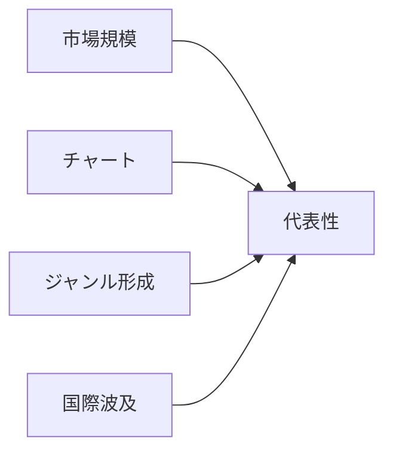

## 1. 読み方と範囲

この一覧は、各国・地域の大衆音楽を「誰を入口に聴くと時代の輪郭が見えるか」という目的で整理したものである。対象はクラシック音楽ではなく、録音産業、チャート、テレビ、ライブ、配信、SNSを通じて広く聴かれたポピュラー音楽のアーティストである。<SourceNote>2025年の録音音楽市場はIFPIの [Global Music Report 2026](https://www.ifpi.org/global-music-report-2026-global-recorded-music-revenues-grow-6-4-as-record-companies-drive-innovation/) と [Global Charts](https://www.ifpi.org/our-industry/global-charts/) を、歴史的な米英ポップスター性は Billboard の [Greatest Pop Stars by Year](https://www.billboard.com/lists/billboard-greatest-pop-stars-year/) と [Greatest Pop Stars of the 21st Century](https://www.billboard.com/music/pop/beyonce-greatest-pop-stars-21st-century-1235842572/) を参照した。</SourceNote>

区分は、1980年代、1990年代、2000年代、2010年代、2020年代、現在の6つにした。「現在」は2026年6月時点で活動、聴取、チャート、ライブ、SNS、国際展開のいずれかで存在感が続く層であり、2020年代と重なる場合がある。国は、米国、英国、日本、韓国、フランス、ドイツ、ブラジル、ナイジェリア、インド、中国語圏の10単位に絞った。

選定は厳密なランキングではない。売上、チャート、批評、ジャンル形成、国際波及、後続アーティストへの影響を合わせた代表例である。<SourceNote>IFPIは2025年に日本が世界第2位市場へ戻り、中国がドイツを抜いて第4位市場になったこと、ブラジルが世界第8位へ上がったことを報告している [Global Music Report 2026](https://www.ifpi.org/global-music-report-2026-global-recorded-music-revenues-grow-6-4-as-record-companies-drive-innovation/) 。</SourceNote>

## 2. 米国

### 1980年代

1. **Michael Jackson** - Motown出身から世界的ソロスターへ進み、MTV時代の映像・ダンス・R&B/ポップ融合を決定づけた。
2. **Madonna** - ニューヨークのクラブ文化から登場し、音楽・ファッション・映像・性的自己表現を結びつけた。
3. **Prince** - ミネアポリスを拠点に、ファンク、ロック、R&Bを自作自演で統合した作家型スターである。
4. **Whitney Houston** - ゴスペルとR&Bの基盤から、圧倒的な歌唱力で80年代後半のポップ・バラードを代表した。
5. **Bruce Springsteen** - 労働者階級の物語、アメリカンロック、スタジアムライブを結び、国民的存在になった。

### 1990年代

1. **Mariah Carey** - 圧倒的な声域とR&B寄りのポップで、90年代前半から米国チャートを支配した。
2. **Nirvana** - シアトルのグランジを主流化し、ロックの価値観を80年代的な華やかさから変えた。
3. **Tupac Shakur** - 西海岸ヒップホップ、社会批評、個人史を重ね、死後も文化的象徴になった。
4. **Dr. Dre** - N.W.A.後にGファンクを確立し、Snoop DoggやEminemへ続くプロデューサー軸にもなった。
5. **Garth Brooks** - カントリーを巨大アリーナ級のポップ市場へ押し上げ、90年代米国音楽の規模感を変えた。

### 2000年代

1. **Beyoncé** - Destiny's Childからソロへ移行し、R&B、ポップ、映像作品、ライブ演出を統合した。
2. **Eminem** - デトロイトから登場し、白人ラッパーとしてヒップホップの主流性と技術性を拡張した。
3. **Kanye West** - プロデューサーからラッパーへ転じ、サンプリング、ファッション、アルバム設計を変えた。
4. **Britney Spears** - ティーンポップの象徴として、MTV末期からCDセールス時代のスター制度を牽引した。
5. **Alicia Keys** - クラシックピアノとR&Bを結び、ネオソウル以後のシンガーソングライター像を広げた。

### 2010年代

1. **Taylor Swift** - カントリー出身からポップへ転換し、ソングライティング、ファン経済、再録戦略で時代を作った。
2. **Drake** - カナダ出身だが米国ヒップホップ/R&B市場の中心となり、ストリーミング時代の単曲消費を体現した。
3. **Lady Gaga** - ダンスポップ、演劇性、ファッション、LGBTQ+支持を組み合わせたスター像を築いた。
4. **Kendrick Lamar** - コンシャスラップ、ジャズ/ファンク継承、アルバム単位の物語性で2010年代ヒップホップを代表した。
5. **Billie Eilish** - ベッドルームポップ的制作と暗いミニマリズムで、10年代末のZ世代スターになった。

### 2020年代

1. **Taylor Swift** - ツアー、再録、アルバム連続投入で、2020年代前半の世界的音楽消費を象徴した。
2. **Beyoncé** - ハウス、カントリー、ブラックミュージック史を再構成し、アルバムごとに文脈を作る存在であり続けた。
3. **Morgan Wallen** - カントリーのストリーミング巨大化を象徴し、米国内外でアルバム消費を伸ばした。
4. **SZA** - オルタナR&Bと内省的な歌詞で、長期ヒット型の2020年代R&Bを代表した。
5. **Olivia Rodrigo** - ディズニー出身からロック色のあるZ世代ポップへ移り、デビュー作で国際的に浸透した。

### 現在

1. **Taylor Swift** - IFPIの2025年Global Artist Chartで首位に立ち、カタログ全体で消費されるスターである。
2. **Kendrick Lamar** - 作品性、ライブ、社会的文脈、ラップ技術のすべてで現在の米国ヒップホップを代表する。
3. **Billie Eilish** - 若いリスナー層と批評的評価を保ち、音数の少ない親密なポップを主流に置き続けている。
4. **Sabrina Carpenter** - 俳優出身から国際的なポップヒットへ進み、2025年IFPI上位にも入った。
5. **SZA** - R&Bとポップの境界を越え、アルバム単位でも単曲単位でも強い聴取を維持している。

## 3. 英国

### 1980年代

1. **Queen** - 70年代からの蓄積に加え、80年代はライブと大衆性で英国ロックの象徴となった。
2. **David Bowie** - 80年代には世界的ポップスターとして再拡張し、変身するアーティスト像を維持した。
3. **George Michael** - Wham!からソロへ進み、英国発のR&B寄りポップを国際市場に届けた。
4. **Kate Bush** - 実験性、文学性、身体表現を持つシンガーソングライターとして独自の地位を築いた。
5. **The Smiths** - マンチェスター発のインディロックとして、歌詞とギターサウンドで後続に強く影響した。

### 1990年代

1. **Oasis** - ブリットポップの大衆的頂点となり、労働者階級的なロックの物語を再提示した。
2. **Blur** - ブリットポップの知的・都市的側面を担い、のちに実験的な方向へ広がった。
3. **Spice Girls** - ガールグループ、商品展開、メディア戦略を結び、90年代ポップの象徴となった。
4. **Radiohead** - オルタナティブロックから電子音楽的な実験へ進み、アルバム表現を更新した。
5. **The Prodigy** - レイヴ、ビッグビート、ロックの身体性を結び、英国クラブ文化を世界へ出した。

### 2000年代

1. **Coldplay** - ポストBritpop以後のメロディックなロックで、世界的スタジアムバンドになった。
2. **Amy Winehouse** - ジャズ、ソウル、R&Bを現代的に再構成し、短い活動で強い影響を残した。
3. **Adele** - 2000年代末に登場し、歌唱力と普遍的なバラードで次の10年代の巨大化を準備した。
4. **Arctic Monkeys** - インターネット時代の口コミから登場し、英国ギターロックの新世代を代表した。
5. **Muse** - プログレッシブなロック、電子音、スタジアム演出を組み合わせた。

### 2010年代

1. **Adele** - アルバム単位で世界的な売上を記録し、ストリーミング前後をまたぐ歌手になった。
2. **Ed Sheeran** - ループペダル型の弾き語りから世界的ポップ作家へ成長した。
3. **One Direction** - オーディション番組出身のボーイバンドとして、SNS時代のファンダムを拡大した。
4. **Dua Lipa** - ダンスポップとファッション性を結び、英国発の国際ポップスターになった。
5. **Sam Smith** - ソウルフルな歌唱とバラードで国際チャートに浸透した。

### 2020年代

1. **Harry Styles** - One Direction後にソロでロック、ポップ、ファッションを横断した。
2. **Dua Lipa** - ディスコ/ダンスポップ路線を強め、国際市場で継続的に存在感を持つ。
3. **Adele** - リリース頻度は高くないが、作品ごとに世界的な注目を集めるアルバムアーティストである。
4. **Central Cee** - UK drillを国際的なヒップホップ文脈へ接続した。
5. **Raye** - ソングライター経験を背景に、独立後の成功と批評評価で注目された。

### 現在

1. **Dua Lipa** - 英国発のグローバルダンスポップを代表し、ライブとブランド展開も強い。
2. **Raye** - 自作性、歌唱力、業界構造への発言で現在の英国ポップを象徴する。
3. **Charli xcx** - クラブ、ハイパーポップ、ネット文化を接続し、2020年代の批評的中心に立った。
4. **Central Cee** - 英国ラップを米国・欧州の聴取圏へ押し出した。
5. **Fred again..** - プロデューサー出身で、電子音楽とライブ即興を大衆的に見せた。

## 4. 日本

### 1980年代

1. **サザンオールスターズ** - 70年代末から続く国民的バンドで、80年代にポップ、ロック、歌謡の横断性を広げた。
2. **松任谷由実** - ニューミュージックから都市生活の叙情へ進み、女性シンガーソングライター像を確立した。
3. **松田聖子** - アイドル歌謡とメディア露出を結び、80年代日本のアイドル像を作った。
4. **中森明菜** - アイドルの枠を超えた表現力と影のある楽曲で、80年代後半の象徴となった。
5. **Yellow Magic Orchestra** - テクノポップ、電子音楽、デザイン感覚で国内外のポップに影響した。

### 1990年代

1. **Mr.Children** - J-POPのバンド型ヒットを代表し、内省的な歌詞と大衆性を両立した。
2. **B'z** - ハードロック的なギターと歌謡的メロディを結び、巨大セールスを記録した。
3. **DREAMS COME TRUE** - R&B、ポップ、ライブ力で90年代J-POPの中心にいた。
4. **安室奈美恵** - 小室哲哉プロデュース期を経て、ダンスポップとファッションの象徴になった。
5. **宇多田ヒカル** - 90年代末にR&B感覚と自作性で登場し、J-POPの語法を変えた。

### 2000年代

1. **浜崎あゆみ** - 歌詞、ビジュアル、ファン文化を統合し、2000年代前半のJ-POPを代表した。
2. **宇多田ヒカル** - アルバム単位の完成度と国際的なR&B/ポップ感覚で影響を維持した。
3. **嵐** - ジャニーズ型アイドル、テレビ、ライブ、CD販売を結ぶ国民的グループになった。
4. **EXILE** - ダンス&ボーカルグループとして、2000年代以降の男性グループ像を広げた。
5. **倖田來未** - R&B、ダンス、女性の自己表現を前面に出し、2000年代のポップを代表した。

### 2010年代

1. **AKB48** - 劇場、握手会、総選挙を組み合わせ、参加型アイドル市場を巨大化した。
2. **Perfume** - 中田ヤスタカの電子音と精密な振付で、日本のテクノポップを更新した。
3. **ONE OK ROCK** - 国内ロックから国際ツアーへ進み、日本のバンドの海外接続を広げた。
4. **米津玄師** - ボカロ文化からメジャーへ移り、作家性と大衆性を両立した。
5. **星野源** - 俳優、作家、音楽家として横断的に活動し、日常感のあるポップを広げた。

### 2020年代

1. **YOASOBI** - 小説原作型の制作と配信時代のヒットで、日本語ポップの海外聴取も伸ばした。
2. **Ado** - 顔出しを抑えた歌唱表現とボカロ/ネット文化を接続し、若年層に浸透した。
3. **Official髭男dism** - バンド演奏と高度なポップ作曲で、配信時代のJ-POP中心に立った。
4. **King Gnu** - ミクスチャー、アート性、タイアップを結び、ロックバンドの新しい大衆性を示した。
5. **Creepy Nuts** - ヒップホップ、テレビ、アニメ主題歌を通じて国際的な単曲ヒットを得た。

### 現在

1. **Mrs. GREEN APPLE** - 2020年代半ばの国内チャートとライブ市場で大きな存在感を持つバンドである。
2. **米津玄師** - ボカロ由来の作家性を保ちながら、映画、アニメ、ゲーム主題歌でも広く聴かれる。
3. **YOASOBI** - アニメ、海外フェス、配信を通じて日本語曲の国際接続を拡大している。
4. **Snow Man** - CD販売、映像、ライブ、ファンダムを結び、フィジカル市場の強さを示す。
5. **Ado** - 歌唱力と匿名性を武器に、国内外ツアーへ展開している。

## 5. 韓国

### 1980年代

1. **Cho Yong-pil** - Cho Yong-pilは1980年代の代表的な入口であり、国民的歌手、ロック、テレビ歌謡、ダンス文化を通じて、K-pop以前の韓国大衆音楽を形づくった。
2. **Lee Moon-sae** - Lee Moon-saeは1980年代の代表的な入口であり、国民的歌手、ロック、テレビ歌謡、ダンス文化を通じて、K-pop以前の韓国大衆音楽を形づくった。
3. **Kim Wan-sun** - Kim Wan-sunは1980年代の代表的な入口であり、国民的歌手、ロック、テレビ歌謡、ダンス文化を通じて、K-pop以前の韓国大衆音楽を形づくった。
4. **Deulgukhwa** - Deulgukhwaは1980年代の代表的な入口であり、国民的歌手、ロック、テレビ歌謡、ダンス文化を通じて、K-pop以前の韓国大衆音楽を形づくった。
5. **Nami** - Namiは1980年代の代表的な入口であり、国民的歌手、ロック、テレビ歌謡、ダンス文化を通じて、K-pop以前の韓国大衆音楽を形づくった。

### 1990年代

1. **Seo Taiji and Boys** - Seo Taiji and Boysは1990年代の代表的な入口であり、国民的歌手、ロック、テレビ歌謡、ダンス文化を通じて、K-pop以前の韓国大衆音楽を形づくった。
2. **H.O.T.** - H.O.T.は1990年代の代表的な入口であり、国民的歌手、ロック、テレビ歌謡、ダンス文化を通じて、K-pop以前の韓国大衆音楽を形づくった。
3. **S.E.S.** - S.E.S.は1990年代の代表的な入口であり、国民的歌手、ロック、テレビ歌謡、ダンス文化を通じて、K-pop以前の韓国大衆音楽を形づくった。
4. **Kim Gun-mo** - Kim Gun-moは1990年代の代表的な入口であり、国民的歌手、ロック、テレビ歌謡、ダンス文化を通じて、K-pop以前の韓国大衆音楽を形づくった。
5. **Deux** - Deuxは1990年代の代表的な入口であり、国民的歌手、ロック、テレビ歌謡、ダンス文化を通じて、K-pop以前の韓国大衆音楽を形づくった。

### 2000年代

1. **BoA** - BoAは2000年代の代表的な入口であり、国民的歌手、ロック、テレビ歌謡、ダンス文化を通じて、K-pop以前の韓国大衆音楽を形づくった。
2. **TVXQ!** - TVXQ!は2000年代の代表的な入口であり、国民的歌手、ロック、テレビ歌謡、ダンス文化を通じて、K-pop以前の韓国大衆音楽を形づくった。
3. **BIGBANG** - BIGBANGは2000年代の代表的な入口であり、国民的歌手、ロック、テレビ歌謡、ダンス文化を通じて、K-pop以前の韓国大衆音楽を形づくった。
4. **Girls' Generation** - Girls' Generationは2000年代の代表的な入口であり、国民的歌手、ロック、テレビ歌謡、ダンス文化を通じて、K-pop以前の韓国大衆音楽を形づくった。
5. **Wonder Girls** - Wonder Girlsは2000年代の代表的な入口であり、国民的歌手、ロック、テレビ歌謡、ダンス文化を通じて、K-pop以前の韓国大衆音楽を形づくった。

### 2010年代

1. **BTS** - BTSは2010年代の代表的な入口であり、国民的歌手、ロック、テレビ歌謡、ダンス文化を通じて、K-pop以前の韓国大衆音楽を形づくった。
2. **BLACKPINK** - BLACKPINKは2010年代の代表的な入口であり、国民的歌手、ロック、テレビ歌謡、ダンス文化を通じて、K-pop以前の韓国大衆音楽を形づくった。
3. **EXO** - EXOは2010年代の代表的な入口であり、国民的歌手、ロック、テレビ歌謡、ダンス文化を通じて、K-pop以前の韓国大衆音楽を形づくった。
4. **TWICE** - TWICEは2010年代の代表的な入口であり、国民的歌手、ロック、テレビ歌謡、ダンス文化を通じて、K-pop以前の韓国大衆音楽を形づくった。
5. **IU** - IUは2010年代の代表的な入口であり、国民的歌手、ロック、テレビ歌謡、ダンス文化を通じて、K-pop以前の韓国大衆音楽を形づくった。

### 2020年代

1. **Stray Kids** - Stray Kidsは2020年代の代表的な入口であり、国民的歌手、ロック、テレビ歌謡、ダンス文化を通じて、K-pop以前の韓国大衆音楽を形づくった。
2. **SEVENTEEN** - SEVENTEENは2020年代の代表的な入口であり、国民的歌手、ロック、テレビ歌謡、ダンス文化を通じて、K-pop以前の韓国大衆音楽を形づくった。
3. **NewJeans** - NewJeansは2020年代の代表的な入口であり、国民的歌手、ロック、テレビ歌謡、ダンス文化を通じて、K-pop以前の韓国大衆音楽を形づくった。
4. **aespa** - aespaは2020年代の代表的な入口であり、国民的歌手、ロック、テレビ歌謡、ダンス文化を通じて、K-pop以前の韓国大衆音楽を形づくった。
5. **IVE** - IVEは2020年代の代表的な入口であり、国民的歌手、ロック、テレビ歌謡、ダンス文化を通じて、K-pop以前の韓国大衆音楽を形づくった。

### 現在

1. **Stray Kids** - Stray Kidsは現在の代表的な入口であり、国民的歌手、ロック、テレビ歌謡、ダンス文化を通じて、K-pop以前の韓国大衆音楽を形づくった。
2. **SEVENTEEN** - SEVENTEENは現在の代表的な入口であり、国民的歌手、ロック、テレビ歌謡、ダンス文化を通じて、K-pop以前の韓国大衆音楽を形づくった。
3. **BTS** - BTSは現在の代表的な入口であり、国民的歌手、ロック、テレビ歌謡、ダンス文化を通じて、K-pop以前の韓国大衆音楽を形づくった。
4. **BLACKPINK** - BLACKPINKは現在の代表的な入口であり、国民的歌手、ロック、テレビ歌謡、ダンス文化を通じて、K-pop以前の韓国大衆音楽を形づくった。
5. **aespa** - aespaは現在の代表的な入口であり、国民的歌手、ロック、テレビ歌謡、ダンス文化を通じて、K-pop以前の韓国大衆音楽を形づくった。

## 6. フランス

### 1980年代

1. **Mylène Farmer** - Mylène Farmerは1980年代の代表的な入口であり、フレンチポップ、ロック、ラップ、電子音楽を通じて、フランス語圏の時代感を示す。
2. **Jean-Jacques Goldman** - Jean-Jacques Goldmanは1980年代の代表的な入口であり、フレンチポップ、ロック、ラップ、電子音楽を通じて、フランス語圏の時代感を示す。
3. **Indochine** - Indochineは1980年代の代表的な入口であり、フレンチポップ、ロック、ラップ、電子音楽を通じて、フランス語圏の時代感を示す。
4. **Daniel Balavoine** - Daniel Balavoineは1980年代の代表的な入口であり、フレンチポップ、ロック、ラップ、電子音楽を通じて、フランス語圏の時代感を示す。
5. **Vanessa Paradis** - Vanessa Paradisは1980年代の代表的な入口であり、フレンチポップ、ロック、ラップ、電子音楽を通じて、フランス語圏の時代感を示す。

### 1990年代

1. **MC Solaar** - MC Solaarは1990年代の代表的な入口であり、フレンチポップ、ロック、ラップ、電子音楽を通じて、フランス語圏の時代感を示す。
2. **Daft Punk** - Daft Punkは1990年代の代表的な入口であり、フレンチポップ、ロック、ラップ、電子音楽を通じて、フランス語圏の時代感を示す。
3. **IAM** - IAMは1990年代の代表的な入口であり、フレンチポップ、ロック、ラップ、電子音楽を通じて、フランス語圏の時代感を示す。
4. **Zazie** - Zazieは1990年代の代表的な入口であり、フレンチポップ、ロック、ラップ、電子音楽を通じて、フランス語圏の時代感を示す。
5. **Patricia Kaas** - Patricia Kaasは1990年代の代表的な入口であり、フレンチポップ、ロック、ラップ、電子音楽を通じて、フランス語圏の時代感を示す。

### 2000年代

1. **David Guetta** - David Guettaは2000年代の代表的な入口であり、フレンチポップ、ロック、ラップ、電子音楽を通じて、フランス語圏の時代感を示す。
2. **Phoenix** - Phoenixは2000年代の代表的な入口であり、フレンチポップ、ロック、ラップ、電子音楽を通じて、フランス語圏の時代感を示す。
3. **Air** - Airは2000年代の代表的な入口であり、フレンチポップ、ロック、ラップ、電子音楽を通じて、フランス語圏の時代感を示す。
4. **Diam's** - Diam'sは2000年代の代表的な入口であり、フレンチポップ、ロック、ラップ、電子音楽を通じて、フランス語圏の時代感を示す。
5. **Amel Bent** - Amel Bentは2000年代の代表的な入口であり、フレンチポップ、ロック、ラップ、電子音楽を通じて、フランス語圏の時代感を示す。

### 2010年代

1. **Christine and the Queens** - Christine and the Queensは2010年代の代表的な入口であり、フレンチポップ、ロック、ラップ、電子音楽を通じて、フランス語圏の時代感を示す。
2. **Maître Gims** - Maître Gimsは2010年代の代表的な入口であり、フレンチポップ、ロック、ラップ、電子音楽を通じて、フランス語圏の時代感を示す。
3. **PNL** - PNLは2010年代の代表的な入口であり、フレンチポップ、ロック、ラップ、電子音楽を通じて、フランス語圏の時代感を示す。
4. **Aya Nakamura** - Aya Nakamuraは2010年代の代表的な入口であり、フレンチポップ、ロック、ラップ、電子音楽を通じて、フランス語圏の時代感を示す。
5. **Jain** - Jainは2010年代の代表的な入口であり、フレンチポップ、ロック、ラップ、電子音楽を通じて、フランス語圏の時代感を示す。

### 2020年代

1. **Aya Nakamura** - Aya Nakamuraは2020年代の代表的な入口であり、フレンチポップ、ロック、ラップ、電子音楽を通じて、フランス語圏の時代感を示す。
2. **Jul** - Julは2020年代の代表的な入口であり、フレンチポップ、ロック、ラップ、電子音楽を通じて、フランス語圏の時代感を示す。
3. **Gazo** - Gazoは2020年代の代表的な入口であり、フレンチポップ、ロック、ラップ、電子音楽を通じて、フランス語圏の時代感を示す。
4. **Orelsan** - Orelsanは2020年代の代表的な入口であり、フレンチポップ、ロック、ラップ、電子音楽を通じて、フランス語圏の時代感を示す。
5. **Zaho de Sagazan** - Zaho de Sagazanは2020年代の代表的な入口であり、フレンチポップ、ロック、ラップ、電子音楽を通じて、フランス語圏の時代感を示す。

### 現在

1. **Aya Nakamura** - Aya Nakamuraは現在の代表的な入口であり、フレンチポップ、ロック、ラップ、電子音楽を通じて、フランス語圏の時代感を示す。
2. **Jul** - Julは現在の代表的な入口であり、フレンチポップ、ロック、ラップ、電子音楽を通じて、フランス語圏の時代感を示す。
3. **Gazo** - Gazoは現在の代表的な入口であり、フレンチポップ、ロック、ラップ、電子音楽を通じて、フランス語圏の時代感を示す。
4. **Zaho de Sagazan** - Zaho de Sagazanは現在の代表的な入口であり、フレンチポップ、ロック、ラップ、電子音楽を通じて、フランス語圏の時代感を示す。
5. **Phoenix** - Phoenixは現在の代表的な入口であり、フレンチポップ、ロック、ラップ、電子音楽を通じて、フランス語圏の時代感を示す。

## 7. ドイツ

### 1980年代

1. **Nena** - Nenaは1980年代の代表的な入口であり、ドイツ語ポップ、ロック、電子音楽、クラブ音楽、Deutschrapの変化を示す。
2. **Scorpions** - Scorpionsは1980年代の代表的な入口であり、ドイツ語ポップ、ロック、電子音楽、クラブ音楽、Deutschrapの変化を示す。
3. **Kraftwerk** - Kraftwerkは1980年代の代表的な入口であり、ドイツ語ポップ、ロック、電子音楽、クラブ音楽、Deutschrapの変化を示す。
4. **Modern Talking** - Modern Talkingは1980年代の代表的な入口であり、ドイツ語ポップ、ロック、電子音楽、クラブ音楽、Deutschrapの変化を示す。
5. **Herbert Grönemeyer** - Herbert Grönemeyerは1980年代の代表的な入口であり、ドイツ語ポップ、ロック、電子音楽、クラブ音楽、Deutschrapの変化を示す。

### 1990年代

1. **Rammstein** - Rammsteinは1990年代の代表的な入口であり、ドイツ語ポップ、ロック、電子音楽、クラブ音楽、Deutschrapの変化を示す。
2. **Die Toten Hosen** - Die Toten Hosenは1990年代の代表的な入口であり、ドイツ語ポップ、ロック、電子音楽、クラブ音楽、Deutschrapの変化を示す。
3. **Scooter** - Scooterは1990年代の代表的な入口であり、ドイツ語ポップ、ロック、電子音楽、クラブ音楽、Deutschrapの変化を示す。
4. **Blümchen** - Blümchenは1990年代の代表的な入口であり、ドイツ語ポップ、ロック、電子音楽、クラブ音楽、Deutschrapの変化を示す。
5. **Enigma** - Enigmaは1990年代の代表的な入口であり、ドイツ語ポップ、ロック、電子音楽、クラブ音楽、Deutschrapの変化を示す。

### 2000年代

1. **Tokio Hotel** - Tokio Hotelは2000年代の代表的な入口であり、ドイツ語ポップ、ロック、電子音楽、クラブ音楽、Deutschrapの変化を示す。
2. **Sarah Connor** - Sarah Connorは2000年代の代表的な入口であり、ドイツ語ポップ、ロック、電子音楽、クラブ音楽、Deutschrapの変化を示す。
3. **Seeed** - Seeedは2000年代の代表的な入口であり、ドイツ語ポップ、ロック、電子音楽、クラブ音楽、Deutschrapの変化を示す。
4. **Cascada** - Cascadaは2000年代の代表的な入口であり、ドイツ語ポップ、ロック、電子音楽、クラブ音楽、Deutschrapの変化を示す。
5. **Wir sind Helden** - Wir sind Heldenは2000年代の代表的な入口であり、ドイツ語ポップ、ロック、電子音楽、クラブ音楽、Deutschrapの変化を示す。

### 2010年代

1. **Helene Fischer** - Helene Fischerは2010年代の代表的な入口であり、ドイツ語ポップ、ロック、電子音楽、クラブ音楽、Deutschrapの変化を示す。
2. **Robin Schulz** - Robin Schulzは2010年代の代表的な入口であり、ドイツ語ポップ、ロック、電子音楽、クラブ音楽、Deutschrapの変化を示す。
3. **Cro** - Croは2010年代の代表的な入口であり、ドイツ語ポップ、ロック、電子音楽、クラブ音楽、Deutschrapの変化を示す。
4. **Mark Forster** - Mark Forsterは2010年代の代表的な入口であり、ドイツ語ポップ、ロック、電子音楽、クラブ音楽、Deutschrapの変化を示す。
5. **Kraftklub** - Kraftklubは2010年代の代表的な入口であり、ドイツ語ポップ、ロック、電子音楽、クラブ音楽、Deutschrapの変化を示す。

### 2020年代

1. **Apache 207** - Apache 207は2020年代の代表的な入口であり、ドイツ語ポップ、ロック、電子音楽、クラブ音楽、Deutschrapの変化を示す。
2. **Luciano** - Lucianoは2020年代の代表的な入口であり、ドイツ語ポップ、ロック、電子音楽、クラブ音楽、Deutschrapの変化を示す。
3. **Ayliva** - Aylivaは2020年代の代表的な入口であり、ドイツ語ポップ、ロック、電子音楽、クラブ音楽、Deutschrapの変化を示す。
4. **Nina Chuba** - Nina Chubaは2020年代の代表的な入口であり、ドイツ語ポップ、ロック、電子音楽、クラブ音楽、Deutschrapの変化を示す。
5. **AnnenMayKantereit** - AnnenMayKantereitは2020年代の代表的な入口であり、ドイツ語ポップ、ロック、電子音楽、クラブ音楽、Deutschrapの変化を示す。

### 現在

1. **Ayliva** - Aylivaは現在の代表的な入口であり、ドイツ語ポップ、ロック、電子音楽、クラブ音楽、Deutschrapの変化を示す。
2. **Apache 207** - Apache 207は現在の代表的な入口であり、ドイツ語ポップ、ロック、電子音楽、クラブ音楽、Deutschrapの変化を示す。
3. **Luciano** - Lucianoは現在の代表的な入口であり、ドイツ語ポップ、ロック、電子音楽、クラブ音楽、Deutschrapの変化を示す。
4. **Nina Chuba** - Nina Chubaは現在の代表的な入口であり、ドイツ語ポップ、ロック、電子音楽、クラブ音楽、Deutschrapの変化を示す。
5. **Rammstein** - Rammsteinは現在の代表的な入口であり、ドイツ語ポップ、ロック、電子音楽、クラブ音楽、Deutschrapの変化を示す。

## 8. ブラジル

### 1980年代

1. **Legião Urbana** - Legião Urbanaは1980年代の代表的な入口であり、ロック、MPB、Axé、ヒップホップ、ファンク、sertanejoを通じてブラジル市場の厚みを示す。
2. **Titãs** - Titãsは1980年代の代表的な入口であり、ロック、MPB、Axé、ヒップホップ、ファンク、sertanejoを通じてブラジル市場の厚みを示す。
3. **Cazuza** - Cazuzaは1980年代の代表的な入口であり、ロック、MPB、Axé、ヒップホップ、ファンク、sertanejoを通じてブラジル市場の厚みを示す。
4. **Os Paralamas do Sucesso** - Os Paralamas do Sucessoは1980年代の代表的な入口であり、ロック、MPB、Axé、ヒップホップ、ファンク、sertanejoを通じてブラジル市場の厚みを示す。
5. **Xuxa** - Xuxaは1980年代の代表的な入口であり、ロック、MPB、Axé、ヒップホップ、ファンク、sertanejoを通じてブラジル市場の厚みを示す。

### 1990年代

1. **Sepultura** - Sepulturaは1990年代の代表的な入口であり、ロック、MPB、Axé、ヒップホップ、ファンク、sertanejoを通じてブラジル市場の厚みを示す。
2. **Marisa Monte** - Marisa Monteは1990年代の代表的な入口であり、ロック、MPB、Axé、ヒップホップ、ファンク、sertanejoを通じてブラジル市場の厚みを示す。
3. **Skank** - Skankは1990年代の代表的な入口であり、ロック、MPB、Axé、ヒップホップ、ファンク、sertanejoを通じてブラジル市場の厚みを示す。
4. **Daniela Mercury** - Daniela Mercuryは1990年代の代表的な入口であり、ロック、MPB、Axé、ヒップホップ、ファンク、sertanejoを通じてブラジル市場の厚みを示す。
5. **Racionais MC's** - Racionais MC'sは1990年代の代表的な入口であり、ロック、MPB、Axé、ヒップホップ、ファンク、sertanejoを通じてブラジル市場の厚みを示す。

### 2000年代

1. **Ivete Sangalo** - Ivete Sangaloは2000年代の代表的な入口であり、ロック、MPB、Axé、ヒップホップ、ファンク、sertanejoを通じてブラジル市場の厚みを示す。
2. **Tribalistas** - Tribalistasは2000年代の代表的な入口であり、ロック、MPB、Axé、ヒップホップ、ファンク、sertanejoを通じてブラジル市場の厚みを示す。
3. **Seu Jorge** - Seu Jorgeは2000年代の代表的な入口であり、ロック、MPB、Axé、ヒップホップ、ファンク、sertanejoを通じてブラジル市場の厚みを示す。
4. **Sandy & Junior** - Sandy & Juniorは2000年代の代表的な入口であり、ロック、MPB、Axé、ヒップホップ、ファンク、sertanejoを通じてブラジル市場の厚みを示す。
5. **Charlie Brown Jr.** - Charlie Brown Jr.は2000年代の代表的な入口であり、ロック、MPB、Axé、ヒップホップ、ファンク、sertanejoを通じてブラジル市場の厚みを示す。

### 2010年代

1. **Anitta** - Anittaは2010年代の代表的な入口であり、ロック、MPB、Axé、ヒップホップ、ファンク、sertanejoを通じてブラジル市場の厚みを示す。
2. **Emicida** - Emicidaは2010年代の代表的な入口であり、ロック、MPB、Axé、ヒップホップ、ファンク、sertanejoを通じてブラジル市場の厚みを示す。
3. **Criolo** - Crioloは2010年代の代表的な入口であり、ロック、MPB、Axé、ヒップホップ、ファンク、sertanejoを通じてブラジル市場の厚みを示す。
4. **Luan Santana** - Luan Santanaは2010年代の代表的な入口であり、ロック、MPB、Axé、ヒップホップ、ファンク、sertanejoを通じてブラジル市場の厚みを示す。
5. **Pabllo Vittar** - Pabllo Vittarは2010年代の代表的な入口であり、ロック、MPB、Axé、ヒップホップ、ファンク、sertanejoを通じてブラジル市場の厚みを示す。

### 2020年代

1. **Anitta** - Anittaは2020年代の代表的な入口であり、ロック、MPB、Axé、ヒップホップ、ファンク、sertanejoを通じてブラジル市場の厚みを示す。
2. **Ludmilla** - Ludmillaは2020年代の代表的な入口であり、ロック、MPB、Axé、ヒップホップ、ファンク、sertanejoを通じてブラジル市場の厚みを示す。
3. **Marília Mendonça** - Marília Mendonçaは2020年代の代表的な入口であり、ロック、MPB、Axé、ヒップホップ、ファンク、sertanejoを通じてブラジル市場の厚みを示す。
4. **Matuê** - Matuêは2020年代の代表的な入口であり、ロック、MPB、Axé、ヒップホップ、ファンク、sertanejoを通じてブラジル市場の厚みを示す。
5. **Gloria Groove** - Gloria Grooveは2020年代の代表的な入口であり、ロック、MPB、Axé、ヒップホップ、ファンク、sertanejoを通じてブラジル市場の厚みを示す。

### 現在

1. **Anitta** - Anittaは現在の代表的な入口であり、ロック、MPB、Axé、ヒップホップ、ファンク、sertanejoを通じてブラジル市場の厚みを示す。
2. **Ludmilla** - Ludmillaは現在の代表的な入口であり、ロック、MPB、Axé、ヒップホップ、ファンク、sertanejoを通じてブラジル市場の厚みを示す。
3. **Matuê** - Matuêは現在の代表的な入口であり、ロック、MPB、Axé、ヒップホップ、ファンク、sertanejoを通じてブラジル市場の厚みを示す。
4. **Ana Castela** - Ana Castelaは現在の代表的な入口であり、ロック、MPB、Axé、ヒップホップ、ファンク、sertanejoを通じてブラジル市場の厚みを示す。
5. **Jão** - Jãoは現在の代表的な入口であり、ロック、MPB、Axé、ヒップホップ、ファンク、sertanejoを通じてブラジル市場の厚みを示す。

## 9. ナイジェリア

### 1980年代

1. **Fela Kuti** - Fela Kutiは1980年代の代表的な入口であり、Afrobeat、Juju、Naija pop、Afrobeatsをつなぎ、ナイジェリア音楽の国際化を示す。
2. **King Sunny Adé** - King Sunny Adéは1980年代の代表的な入口であり、Afrobeat、Juju、Naija pop、Afrobeatsをつなぎ、ナイジェリア音楽の国際化を示す。
3. **Ebenezer Obey** - Ebenezer Obeyは1980年代の代表的な入口であり、Afrobeat、Juju、Naija pop、Afrobeatsをつなぎ、ナイジェリア音楽の国際化を示す。
4. **Onyeka Onwenu** - Onyeka Onwenuは1980年代の代表的な入口であり、Afrobeat、Juju、Naija pop、Afrobeatsをつなぎ、ナイジェリア音楽の国際化を示す。
5. **Majek Fashek** - Majek Fashekは1980年代の代表的な入口であり、Afrobeat、Juju、Naija pop、Afrobeatsをつなぎ、ナイジェリア音楽の国際化を示す。

### 1990年代

1. **Femi Kuti** - Femi Kutiは1990年代の代表的な入口であり、Afrobeat、Juju、Naija pop、Afrobeatsをつなぎ、ナイジェリア音楽の国際化を示す。
2. **Lagbaja** - Lagbajaは1990年代の代表的な入口であり、Afrobeat、Juju、Naija pop、Afrobeatsをつなぎ、ナイジェリア音楽の国際化を示す。
3. **Daddy Showkey** - Daddy Showkeyは1990年代の代表的な入口であり、Afrobeat、Juju、Naija pop、Afrobeatsをつなぎ、ナイジェリア音楽の国際化を示す。
4. **The Remedies** - The Remediesは1990年代の代表的な入口であり、Afrobeat、Juju、Naija pop、Afrobeatsをつなぎ、ナイジェリア音楽の国際化を示す。
5. **Sir Shina Peters** - Sir Shina Petersは1990年代の代表的な入口であり、Afrobeat、Juju、Naija pop、Afrobeatsをつなぎ、ナイジェリア音楽の国際化を示す。

### 2000年代

1. **2Baba** - 2Babaは2000年代の代表的な入口であり、Afrobeat、Juju、Naija pop、Afrobeatsをつなぎ、ナイジェリア音楽の国際化を示す。
2. **D'banj** - D'banjは2000年代の代表的な入口であり、Afrobeat、Juju、Naija pop、Afrobeatsをつなぎ、ナイジェリア音楽の国際化を示す。
3. **P-Square** - P-Squareは2000年代の代表的な入口であり、Afrobeat、Juju、Naija pop、Afrobeatsをつなぎ、ナイジェリア音楽の国際化を示す。
4. **Asa** - Asaは2000年代の代表的な入口であり、Afrobeat、Juju、Naija pop、Afrobeatsをつなぎ、ナイジェリア音楽の国際化を示す。
5. **Nneka** - Nnekaは2000年代の代表的な入口であり、Afrobeat、Juju、Naija pop、Afrobeatsをつなぎ、ナイジェリア音楽の国際化を示す。

### 2010年代

1. **Wizkid** - Wizkidは2010年代の代表的な入口であり、Afrobeat、Juju、Naija pop、Afrobeatsをつなぎ、ナイジェリア音楽の国際化を示す。
2. **Davido** - Davidoは2010年代の代表的な入口であり、Afrobeat、Juju、Naija pop、Afrobeatsをつなぎ、ナイジェリア音楽の国際化を示す。
3. **Burna Boy** - Burna Boyは2010年代の代表的な入口であり、Afrobeat、Juju、Naija pop、Afrobeatsをつなぎ、ナイジェリア音楽の国際化を示す。
4. **Tiwa Savage** - Tiwa Savageは2010年代の代表的な入口であり、Afrobeat、Juju、Naija pop、Afrobeatsをつなぎ、ナイジェリア音楽の国際化を示す。
5. **Yemi Alade** - Yemi Aladeは2010年代の代表的な入口であり、Afrobeat、Juju、Naija pop、Afrobeatsをつなぎ、ナイジェリア音楽の国際化を示す。

### 2020年代

1. **Burna Boy** - Burna Boyは2020年代の代表的な入口であり、Afrobeat、Juju、Naija pop、Afrobeatsをつなぎ、ナイジェリア音楽の国際化を示す。
2. **Rema** - Remaは2020年代の代表的な入口であり、Afrobeat、Juju、Naija pop、Afrobeatsをつなぎ、ナイジェリア音楽の国際化を示す。
3. **Tems** - Temsは2020年代の代表的な入口であり、Afrobeat、Juju、Naija pop、Afrobeatsをつなぎ、ナイジェリア音楽の国際化を示す。
4. **Asake** - Asakeは2020年代の代表的な入口であり、Afrobeat、Juju、Naija pop、Afrobeatsをつなぎ、ナイジェリア音楽の国際化を示す。
5. **Ayra Starr** - Ayra Starrは2020年代の代表的な入口であり、Afrobeat、Juju、Naija pop、Afrobeatsをつなぎ、ナイジェリア音楽の国際化を示す。

### 現在

1. **Burna Boy** - Burna Boyは現在の代表的な入口であり、Afrobeat、Juju、Naija pop、Afrobeatsをつなぎ、ナイジェリア音楽の国際化を示す。
2. **Rema** - Remaは現在の代表的な入口であり、Afrobeat、Juju、Naija pop、Afrobeatsをつなぎ、ナイジェリア音楽の国際化を示す。
3. **Tems** - Temsは現在の代表的な入口であり、Afrobeat、Juju、Naija pop、Afrobeatsをつなぎ、ナイジェリア音楽の国際化を示す。
4. **Asake** - Asakeは現在の代表的な入口であり、Afrobeat、Juju、Naija pop、Afrobeatsをつなぎ、ナイジェリア音楽の国際化を示す。
5. **Ayra Starr** - Ayra Starrは現在の代表的な入口であり、Afrobeat、Juju、Naija pop、Afrobeatsをつなぎ、ナイジェリア音楽の国際化を示す。

## 10. インド

### 1980年代

1. **Lata Mangeshkar** - Lata Mangeshkarは1980年代の代表的な入口であり、映画音楽、プレイバック歌唱、パンジャーブ系ポップ、ヒップホップ、インディを横断する。
2. **Kishore Kumar** - Kishore Kumarは1980年代の代表的な入口であり、映画音楽、プレイバック歌唱、パンジャーブ系ポップ、ヒップホップ、インディを横断する。
3. **Asha Bhosle** - Asha Bhosleは1980年代の代表的な入口であり、映画音楽、プレイバック歌唱、パンジャーブ系ポップ、ヒップホップ、インディを横断する。
4. **Ilaiyaraaja** - Ilaiyaraajaは1980年代の代表的な入口であり、映画音楽、プレイバック歌唱、パンジャーブ系ポップ、ヒップホップ、インディを横断する。
5. **Bappi Lahiri** - Bappi Lahiriは1980年代の代表的な入口であり、映画音楽、プレイバック歌唱、パンジャーブ系ポップ、ヒップホップ、インディを横断する。

### 1990年代

1. **A.R. Rahman** - A.R. Rahmanは1990年代の代表的な入口であり、映画音楽、プレイバック歌唱、パンジャーブ系ポップ、ヒップホップ、インディを横断する。
2. **Kumar Sanu** - Kumar Sanuは1990年代の代表的な入口であり、映画音楽、プレイバック歌唱、パンジャーブ系ポップ、ヒップホップ、インディを横断する。
3. **Alka Yagnik** - Alka Yagnikは1990年代の代表的な入口であり、映画音楽、プレイバック歌唱、パンジャーブ系ポップ、ヒップホップ、インディを横断する。
4. **Udit Narayan** - Udit Narayanは1990年代の代表的な入口であり、映画音楽、プレイバック歌唱、パンジャーブ系ポップ、ヒップホップ、インディを横断する。
5. **Lucky Ali** - Lucky Aliは1990年代の代表的な入口であり、映画音楽、プレイバック歌唱、パンジャーブ系ポップ、ヒップホップ、インディを横断する。

### 2000年代

1. **Shreya Ghoshal** - Shreya Ghoshalは2000年代の代表的な入口であり、映画音楽、プレイバック歌唱、パンジャーブ系ポップ、ヒップホップ、インディを横断する。
2. **Sonu Nigam** - Sonu Nigamは2000年代の代表的な入口であり、映画音楽、プレイバック歌唱、パンジャーブ系ポップ、ヒップホップ、インディを横断する。
3. **Sunidhi Chauhan** - Sunidhi Chauhanは2000年代の代表的な入口であり、映画音楽、プレイバック歌唱、パンジャーブ系ポップ、ヒップホップ、インディを横断する。
4. **Shaan** - Shaanは2000年代の代表的な入口であり、映画音楽、プレイバック歌唱、パンジャーブ系ポップ、ヒップホップ、インディを横断する。
5. **KK** - KKは2000年代の代表的な入口であり、映画音楽、プレイバック歌唱、パンジャーブ系ポップ、ヒップホップ、インディを横断する。

### 2010年代

1. **Arijit Singh** - Arijit Singhは2010年代の代表的な入口であり、映画音楽、プレイバック歌唱、パンジャーブ系ポップ、ヒップホップ、インディを横断する。
2. **Neha Kakkar** - Neha Kakkarは2010年代の代表的な入口であり、映画音楽、プレイバック歌唱、パンジャーブ系ポップ、ヒップホップ、インディを横断する。
3. **Badshah** - Badshahは2010年代の代表的な入口であり、映画音楽、プレイバック歌唱、パンジャーブ系ポップ、ヒップホップ、インディを横断する。
4. **Yo Yo Honey Singh** - Yo Yo Honey Singhは2010年代の代表的な入口であり、映画音楽、プレイバック歌唱、パンジャーブ系ポップ、ヒップホップ、インディを横断する。
5. **Divine** - Divineは2010年代の代表的な入口であり、映画音楽、プレイバック歌唱、パンジャーブ系ポップ、ヒップホップ、インディを横断する。

### 2020年代

1. **Arijit Singh** - Arijit Singhは2020年代の代表的な入口であり、映画音楽、プレイバック歌唱、パンジャーブ系ポップ、ヒップホップ、インディを横断する。
2. **Diljit Dosanjh** - Diljit Dosanjhは2020年代の代表的な入口であり、映画音楽、プレイバック歌唱、パンジャーブ系ポップ、ヒップホップ、インディを横断する。
3. **AP Dhillon** - AP Dhillonは2020年代の代表的な入口であり、映画音楽、プレイバック歌唱、パンジャーブ系ポップ、ヒップホップ、インディを横断する。
4. **King** - Kingは2020年代の代表的な入口であり、映画音楽、プレイバック歌唱、パンジャーブ系ポップ、ヒップホップ、インディを横断する。
5. **Anuv Jain** - Anuv Jainは2020年代の代表的な入口であり、映画音楽、プレイバック歌唱、パンジャーブ系ポップ、ヒップホップ、インディを横断する。

### 現在

1. **Arijit Singh** - Arijit Singhは現在の代表的な入口であり、映画音楽、プレイバック歌唱、パンジャーブ系ポップ、ヒップホップ、インディを横断する。
2. **Diljit Dosanjh** - Diljit Dosanjhは現在の代表的な入口であり、映画音楽、プレイバック歌唱、パンジャーブ系ポップ、ヒップホップ、インディを横断する。
3. **Shreya Ghoshal** - Shreya Ghoshalは現在の代表的な入口であり、映画音楽、プレイバック歌唱、パンジャーブ系ポップ、ヒップホップ、インディを横断する。
4. **AP Dhillon** - AP Dhillonは現在の代表的な入口であり、映画音楽、プレイバック歌唱、パンジャーブ系ポップ、ヒップホップ、インディを横断する。
5. **Anuv Jain** - Anuv Jainは現在の代表的な入口であり、映画音楽、プレイバック歌唱、パンジャーブ系ポップ、ヒップホップ、インディを横断する。

## 11. 中国・中国語圏

中国語圏は、台湾、香港、シンガポール、海外華人のスターが大陸市場にも深く入るため、ここでは「中国本土だけ」ではなく、中国語ポップ市場として扱う。

### 1980年代

1. **Cui Jian** - Cui Jianは1980年代の代表的な入口であり、本土、香港、台湾、シンガポール、海外華人市場を横断する中国語ポップの流れを示す。
2. **Liu Huan** - Liu Huanは1980年代の代表的な入口であり、本土、香港、台湾、シンガポール、海外華人市場を横断する中国語ポップの流れを示す。
3. **Mao Amin** - Mao Aminは1980年代の代表的な入口であり、本土、香港、台湾、シンガポール、海外華人市場を横断する中国語ポップの流れを示す。
4. **Fei Xiang** - Fei Xiangは1980年代の代表的な入口であり、本土、香港、台湾、シンガポール、海外華人市場を横断する中国語ポップの流れを示す。
5. **Na Ying** - Na Yingは1980年代の代表的な入口であり、本土、香港、台湾、シンガポール、海外華人市場を横断する中国語ポップの流れを示す。

### 1990年代

1. **Faye Wong** - Faye Wongは1990年代の代表的な入口であり、本土、香港、台湾、シンガポール、海外華人市場を横断する中国語ポップの流れを示す。
2. **Cui Jian** - Cui Jianは1990年代の代表的な入口であり、本土、香港、台湾、シンガポール、海外華人市場を横断する中国語ポップの流れを示す。
3. **Black Panther** - Black Pantherは1990年代の代表的な入口であり、本土、香港、台湾、シンガポール、海外華人市場を横断する中国語ポップの流れを示す。
4. **Dou Wei** - Dou Weiは1990年代の代表的な入口であり、本土、香港、台湾、シンガポール、海外華人市場を横断する中国語ポップの流れを示す。
5. **Na Ying** - Na Yingは1990年代の代表的な入口であり、本土、香港、台湾、シンガポール、海外華人市場を横断する中国語ポップの流れを示す。

### 2000年代

1. **Jay Chou** - Jay Chouは2000年代の代表的な入口であり、本土、香港、台湾、シンガポール、海外華人市場を横断する中国語ポップの流れを示す。
2. **Jolin Tsai** - Jolin Tsaiは2000年代の代表的な入口であり、本土、香港、台湾、シンガポール、海外華人市場を横断する中国語ポップの流れを示す。
3. **Stefanie Sun** - Stefanie Sunは2000年代の代表的な入口であり、本土、香港、台湾、シンガポール、海外華人市場を横断する中国語ポップの流れを示す。
4. **Wang Leehom** - Wang Leehomは2000年代の代表的な入口であり、本土、香港、台湾、シンガポール、海外華人市場を横断する中国語ポップの流れを示す。
5. **S.H.E** - S.H.Eは2000年代の代表的な入口であり、本土、香港、台湾、シンガポール、海外華人市場を横断する中国語ポップの流れを示す。

### 2010年代

1. **G.E.M.** - G.E.M.は2010年代の代表的な入口であり、本土、香港、台湾、シンガポール、海外華人市場を横断する中国語ポップの流れを示す。
2. **Hua Chenyu** - Hua Chenyuは2010年代の代表的な入口であり、本土、香港、台湾、シンガポール、海外華人市場を横断する中国語ポップの流れを示す。
3. **Lay Zhang** - Lay Zhangは2010年代の代表的な入口であり、本土、香港、台湾、シンガポール、海外華人市場を横断する中国語ポップの流れを示す。
4. **TFBoys** - TFBoysは2010年代の代表的な入口であり、本土、香港、台湾、シンガポール、海外華人市場を横断する中国語ポップの流れを示す。
5. **Li Ronghao** - Li Ronghaoは2010年代の代表的な入口であり、本土、香港、台湾、シンガポール、海外華人市場を横断する中国語ポップの流れを示す。

### 2020年代

1. **Zhou Shen** - Zhou Shenは2020年代の代表的な入口であり、本土、香港、台湾、シンガポール、海外華人市場を横断する中国語ポップの流れを示す。
2. **Jackson Wang** - Jackson Wangは2020年代の代表的な入口であり、本土、香港、台湾、シンガポール、海外華人市場を横断する中国語ポップの流れを示す。
3. **G.E.M.** - G.E.M.は2020年代の代表的な入口であり、本土、香港、台湾、シンガポール、海外華人市場を横断する中国語ポップの流れを示す。
4. **Lexie Liu** - Lexie Liuは2020年代の代表的な入口であり、本土、香港、台湾、シンガポール、海外華人市場を横断する中国語ポップの流れを示す。
5. **Wang Yibo** - Wang Yiboは2020年代の代表的な入口であり、本土、香港、台湾、シンガポール、海外華人市場を横断する中国語ポップの流れを示す。

### 現在

1. **Zhou Shen** - Zhou Shenは現在の代表的な入口であり、本土、香港、台湾、シンガポール、海外華人市場を横断する中国語ポップの流れを示す。
2. **Hua Chenyu** - Hua Chenyuは現在の代表的な入口であり、本土、香港、台湾、シンガポール、海外華人市場を横断する中国語ポップの流れを示す。
3. **G.E.M.** - G.E.M.は現在の代表的な入口であり、本土、香港、台湾、シンガポール、海外華人市場を横断する中国語ポップの流れを示す。
4. **Jackson Wang** - Jackson Wangは現在の代表的な入口であり、本土、香港、台湾、シンガポール、海外華人市場を横断する中国語ポップの流れを示す。
5. **Lexie Liu** - Lexie Liuは現在の代表的な入口であり、本土、香港、台湾、シンガポール、海外華人市場を横断する中国語ポップの流れを示す。

## 12. 使い方

この表は、各国の完全な音楽史ではなく、聴取の入口である。1国につき同じ年代で5組だけを選ぶと、ジャンル、地域、性別、言語、商業性の偏りは避けられない。特に米国と英国は国際市場で過剰に見えやすく、インド、中国語圏、ナイジェリア、ブラジルは国内・地域市場の文脈を知らないと過小評価されやすい。

比較すると、80年代はテレビとMTV、90年代はCDとロック/ヒップホップ/アイドルの制度化、2000年代はグローバルCD市場とインターネット初期、2010年代はSNSとストリーミング、2020年代は短尺動画、ファンダム、地域音楽の国際化が軸になっている。IFPIの2025年Global Artist ChartでTaylor Swift、Stray Kids、Drake、The Weeknd、Bad Bunny、Kendrick Lamar、Morgan Wallen、Sabrina Carpenter、Billie Eilish、Lady Gagaが上位に並ぶことは、英語圏中心性が残りつつ、K-pop、ラテン、カントリー、R&Bが同じ世界チャートで競う状態を示している。<SourceNote>[IFPI Global Charts](https://www.ifpi.org/our-industry/global-charts/) は2025年のGlobal Artist Chart上位10組を公開している。</SourceNote>
