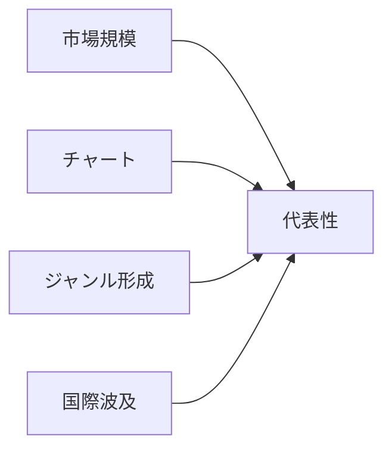

## 1. 読み方と範囲

この一覧は、各国・地域の大衆音楽を「誰を入口に聴くと時代の輪郭が見えるか」という目的で整理したものである。対象はクラシック音楽ではなく、録音産業、チャート、テレビ、ライブ、配信、SNSを通じて広く聴かれたポピュラー音楽のアーティストである。<SourceNote>2025年の録音音楽市場はIFPIの [Global Music Report 2026](https://www.ifpi.org/global-music-report-2026-global-recorded-music-revenues-grow-6-4-as-record-companies-drive-innovation/) と [Global Charts](https://www.ifpi.org/our-industry/global-charts/) を、歴史的な米英ポップスター性は Billboard の [Greatest Pop Stars by Year](https://www.billboard.com/lists/billboard-greatest-pop-stars-year/) と [Greatest Pop Stars of the 21st Century](https://www.billboard.com/music/pop/beyonce-greatest-pop-stars-21st-century-1235842572/) を参照した。</SourceNote>

区分は、1980年代、1990年代、2000年代、2010年代、2020年代、現在の6つにした。「現在」は2026年6月時点で活動、聴取、チャート、ライブ、SNS、国際展開のいずれかで存在感が続く層であり、2020年代と重なる場合がある。国は、米国、英国、日本、韓国、フランス、ドイツ、ブラジル、ナイジェリア、インド、中国語圏の10単位に絞った。

選定は厳密なランキングではない。売上、チャート、批評、ジャンル形成、国際波及、後続アーティストへの影響を合わせた代表例である。<SourceNote>IFPIは2025年に日本が世界第2位市場へ戻り、中国がドイツを抜いて第4位市場になったこと、ブラジルが世界第8位へ上がったことを報告している [Global Music Report 2026](https://www.ifpi.org/global-music-report-2026-global-recorded-music-revenues-grow-6-4-as-record-companies-drive-innovation/) 。</SourceNote>

## 2. 米国

### 1980年代

MTV、スタジアムライブ、R&Bとロックの交差が、音楽を音だけでなく映像と身体表現で見る文化へ押し広げた。

1. **Michael Jackson** - Motown出身から世界的ソロスターへ進み、MTV時代の映像・ダンス・R&B/ポップ融合を決定づけた。聴き手は、Michael Jacksonの声、楽曲、イメージ、活動経路を通じて、MTV、スタジアムライブ、R&Bとロックの交差が、音楽を音だけでなく映像と身体表現で見る文化へ押し広げたという時代感を受け取った。
2. **Madonna** - ニューヨークのクラブ文化から登場し、音楽・ファッション・映像・性的自己表現を結びつけた。聴き手は、Madonnaの声、楽曲、イメージ、活動経路を通じて、MTV、スタジアムライブ、R&Bとロックの交差が、音楽を音だけでなく映像と身体表現で見る文化へ押し広げたという時代感を受け取った。
3. **Prince** - ミネアポリスを拠点に、ファンク、ロック、R&Bを自作自演で統合した作家型スターである。聴き手は、Princeの声、楽曲、イメージ、活動経路を通じて、MTV、スタジアムライブ、R&Bとロックの交差が、音楽を音だけでなく映像と身体表現で見る文化へ押し広げたという時代感を受け取った。
4. **Whitney Houston** - ゴスペルとR&Bの基盤から、圧倒的な歌唱力で80年代後半のポップ・バラードを代表した。聴き手は、Whitney Houstonの声、楽曲、イメージ、活動経路を通じて、MTV、スタジアムライブ、R&Bとロックの交差が、音楽を音だけでなく映像と身体表現で見る文化へ押し広げたという時代感を受け取った。
5. **Bruce Springsteen** - 労働者階級の物語、アメリカンロック、スタジアムライブを結び、国民的存在になった。聴き手は、Bruce Springsteenの声、楽曲、イメージ、活動経路を通じて、MTV、スタジアムライブ、R&Bとロックの交差が、音楽を音だけでなく映像と身体表現で見る文化へ押し広げたという時代感を受け取った。

### 1990年代

CD市場の拡大の中で、R&B、オルタナティブロック、ヒップホップ、カントリーがそれぞれ巨大な大衆圏を作った。

1. **Mariah Carey** - 圧倒的な声域とR&B寄りのポップで、90年代前半から米国チャートを支配した。聴き手は、Mariah Careyの声、楽曲、イメージ、活動経路を通じて、CD市場の拡大の中で、R&B、オルタナティブロック、ヒップホップ、カントリーがそれぞれ巨大な大衆圏を作ったという時代感を受け取った。
2. **Nirvana** - シアトルのグランジを主流化し、ロックの価値観を80年代的な華やかさから変えた。聴き手は、Nirvanaの声、楽曲、イメージ、活動経路を通じて、CD市場の拡大の中で、R&B、オルタナティブロック、ヒップホップ、カントリーがそれぞれ巨大な大衆圏を作ったという時代感を受け取った。
3. **Tupac Shakur** - 西海岸ヒップホップ、社会批評、個人史を重ね、死後も文化的象徴になった。聴き手は、Tupac Shakurの声、楽曲、イメージ、活動経路を通じて、CD市場の拡大の中で、R&B、オルタナティブロック、ヒップホップ、カントリーがそれぞれ巨大な大衆圏を作ったという時代感を受け取った。
4. **Dr. Dre** - N.W.A.後にGファンクを確立し、Snoop DoggやEminemへ続くプロデューサー軸にもなった。聴き手は、Dr. Dreの声、楽曲、イメージ、活動経路を通じて、CD市場の拡大の中で、R&B、オルタナティブロック、ヒップホップ、カントリーがそれぞれ巨大な大衆圏を作ったという時代感を受け取った。
5. **Garth Brooks** - カントリーを巨大アリーナ級のポップ市場へ押し上げ、90年代米国音楽の規模感を変えた。聴き手は、Garth Brooksの声、楽曲、イメージ、活動経路を通じて、CD市場の拡大の中で、R&B、オルタナティブロック、ヒップホップ、カントリーがそれぞれ巨大な大衆圏を作ったという時代感を受け取った。

### 2000年代

CD末期からダウンロード期へ移る中で、ポップスターはアルバム、テレビ、ゴシップ、ファッションをまたぐ総合的な存在になった。

1. **Beyoncé** - Destiny's Childからソロへ移行し、R&B、ポップ、映像作品、ライブ演出を統合した。聴き手は、Beyoncéの声、楽曲、イメージ、活動経路を通じて、CD末期からダウンロード期へ移る中で、ポップスターはアルバム、テレビ、ゴシップ、ファッションをまたぐ総合的な存在になったという時代感を受け取った。
2. **Eminem** - デトロイトから登場し、白人ラッパーとしてヒップホップの主流性と技術性を拡張した。聴き手は、Eminemの声、楽曲、イメージ、活動経路を通じて、CD末期からダウンロード期へ移る中で、ポップスターはアルバム、テレビ、ゴシップ、ファッションをまたぐ総合的な存在になったという時代感を受け取った。
3. **Kanye West** - プロデューサーからラッパーへ転じ、サンプリング、ファッション、アルバム設計を変えた。聴き手は、Kanye Westの声、楽曲、イメージ、活動経路を通じて、CD末期からダウンロード期へ移る中で、ポップスターはアルバム、テレビ、ゴシップ、ファッションをまたぐ総合的な存在になったという時代感を受け取った。
4. **Britney Spears** - ティーンポップの象徴として、MTV末期からCDセールス時代のスター制度を牽引した。聴き手は、Britney Spearsの声、楽曲、イメージ、活動経路を通じて、CD末期からダウンロード期へ移る中で、ポップスターはアルバム、テレビ、ゴシップ、ファッションをまたぐ総合的な存在になったという時代感を受け取った。
5. **Alicia Keys** - クラシックピアノとR&Bを結び、ネオソウル以後のシンガーソングライター像を広げた。聴き手は、Alicia Keysの声、楽曲、イメージ、活動経路を通じて、CD末期からダウンロード期へ移る中で、ポップスターはアルバム、テレビ、ゴシップ、ファッションをまたぐ総合的な存在になったという時代感を受け取った。

### 2010年代

ストリーミングとSNSが、作品単位の作家性、ファンダム、社会的発言を同じ画面に置いた。

1. **Taylor Swift** - カントリー出身からポップへ転換し、ソングライティング、ファン経済、再録戦略で時代を作った。聴き手は、Taylor Swiftの声、楽曲、イメージ、活動経路を通じて、ストリーミングとSNSが、作品単位の作家性、ファンダム、社会的発言を同じ画面に置いたという時代感を受け取った。
2. **Drake** - カナダ出身だが米国ヒップホップ/R&B市場の中心となり、ストリーミング時代の単曲消費を体現した。聴き手は、Drakeの声、楽曲、イメージ、活動経路を通じて、ストリーミングとSNSが、作品単位の作家性、ファンダム、社会的発言を同じ画面に置いたという時代感を受け取った。
3. **Lady Gaga** - ダンスポップ、演劇性、ファッション、LGBTQ+支持を組み合わせたスター像を築いた。聴き手は、Lady Gagaの声、楽曲、イメージ、活動経路を通じて、ストリーミングとSNSが、作品単位の作家性、ファンダム、社会的発言を同じ画面に置いたという時代感を受け取った。
4. **Kendrick Lamar** - コンシャスラップ、ジャズ/ファンク継承、アルバム単位の物語性で2010年代ヒップホップを代表した。聴き手は、Kendrick Lamarの声、楽曲、イメージ、活動経路を通じて、ストリーミングとSNSが、作品単位の作家性、ファンダム、社会的発言を同じ画面に置いたという時代感を受け取った。
5. **Billie Eilish** - ベッドルームポップ的制作と暗いミニマリズムで、10年代末のZ世代スターになった。聴き手は、Billie Eilishの声、楽曲、イメージ、活動経路を通じて、ストリーミングとSNSが、作品単位の作家性、ファンダム、社会的発言を同じ画面に置いたという時代感を受け取った。

### 2020年代

短尺動画、再録、ライブ動員、ジャンル横断が、旧来のポップ中心地と地域ジャンルを同じチャートで競わせた。

1. **Taylor Swift** - ツアー、再録、アルバム連続投入で、2020年代前半の世界的音楽消費を象徴した。聴き手は、Taylor Swiftの声、楽曲、イメージ、活動経路を通じて、短尺動画、再録、ライブ動員、ジャンル横断が、旧来のポップ中心地と地域ジャンルを同じチャートで競わせたという時代感を受け取った。
2. **Beyoncé** - ハウス、カントリー、ブラックミュージック史を再構成し、アルバムごとに文脈を作る存在であり続けた。聴き手は、Beyoncéの声、楽曲、イメージ、活動経路を通じて、短尺動画、再録、ライブ動員、ジャンル横断が、旧来のポップ中心地と地域ジャンルを同じチャートで競わせたという時代感を受け取った。
3. **Morgan Wallen** - カントリーのストリーミング巨大化を象徴し、米国内外でアルバム消費を伸ばした。聴き手は、Morgan Wallenの声、楽曲、イメージ、活動経路を通じて、短尺動画、再録、ライブ動員、ジャンル横断が、旧来のポップ中心地と地域ジャンルを同じチャートで競わせたという時代感を受け取った。
4. **SZA** - オルタナR&Bと内省的な歌詞で、長期ヒット型の2020年代R&Bを代表した。聴き手は、SZAの声、楽曲、イメージ、活動経路を通じて、短尺動画、再録、ライブ動員、ジャンル横断が、旧来のポップ中心地と地域ジャンルを同じチャートで競わせたという時代感を受け取った。
5. **Olivia Rodrigo** - ディズニー出身からロック色のあるZ世代ポップへ移り、デビュー作で国際的に浸透した。聴き手は、Olivia Rodrigoの声、楽曲、イメージ、活動経路を通じて、短尺動画、再録、ライブ動員、ジャンル横断が、旧来のポップ中心地と地域ジャンルを同じチャートで競わせたという時代感を受け取った。

### 現在

現在の米国発ポップは、カタログ消費、ツアー経済、ファン動員、批評性を同時に求められる市場で動いている。

1. **Taylor Swift** - IFPIの2025年Global Artist Chartで首位に立ち、カタログ全体で消費されるスターである。聴き手は、Taylor Swiftの声、楽曲、イメージ、活動経路を通じて、現在の米国発ポップは、カタログ消費、ツアー経済、ファン動員、批評性を同時に求められる市場で動いているという時代感を受け取った。
2. **Kendrick Lamar** - 作品性、ライブ、社会的文脈、ラップ技術のすべてで現在の米国ヒップホップを代表する。聴き手は、Kendrick Lamarの声、楽曲、イメージ、活動経路を通じて、現在の米国発ポップは、カタログ消費、ツアー経済、ファン動員、批評性を同時に求められる市場で動いているという時代感を受け取った。
3. **Billie Eilish** - 若いリスナー層と批評的評価を保ち、音数の少ない親密なポップを主流に置き続けている。聴き手は、Billie Eilishの声、楽曲、イメージ、活動経路を通じて、現在の米国発ポップは、カタログ消費、ツアー経済、ファン動員、批評性を同時に求められる市場で動いているという時代感を受け取った。
4. **Sabrina Carpenter** - 俳優出身から国際的なポップヒットへ進み、2025年IFPI上位にも入った。聴き手は、Sabrina Carpenterの声、楽曲、イメージ、活動経路を通じて、現在の米国発ポップは、カタログ消費、ツアー経済、ファン動員、批評性を同時に求められる市場で動いているという時代感を受け取った。
5. **SZA** - R&Bとポップの境界を越え、アルバム単位でも単曲単位でも強い聴取を維持している。聴き手は、SZAの声、楽曲、イメージ、活動経路を通じて、現在の米国発ポップは、カタログ消費、ツアー経済、ファン動員、批評性を同時に求められる市場で動いているという時代感を受け取った。

## 3. 英国

### 1980年代

英国ではロックの蓄積、ニューウェーブ、ソウル寄りのポップが、テレビ時代の国際スター像を作った。

1. **Queen** - 70年代からの蓄積に加え、80年代はライブと大衆性で英国ロックの象徴となった。聴き手は、Queenの声、楽曲、イメージ、活動経路を通じて、英国ではロックの蓄積、ニューウェーブ、ソウル寄りのポップが、テレビ時代の国際スター像を作ったという時代感を受け取った。
2. **David Bowie** - 80年代には世界的ポップスターとして再拡張し、変身するアーティスト像を維持した。聴き手は、David Bowieの声、楽曲、イメージ、活動経路を通じて、英国ではロックの蓄積、ニューウェーブ、ソウル寄りのポップが、テレビ時代の国際スター像を作ったという時代感を受け取った。
3. **George Michael** - Wham!からソロへ進み、英国発のR&B寄りポップを国際市場に届けた。聴き手は、George Michaelの声、楽曲、イメージ、活動経路を通じて、英国ではロックの蓄積、ニューウェーブ、ソウル寄りのポップが、テレビ時代の国際スター像を作ったという時代感を受け取った。
4. **Kate Bush** - 実験性、文学性、身体表現を持つシンガーソングライターとして独自の地位を築いた。聴き手は、Kate Bushの声、楽曲、イメージ、活動経路を通じて、英国ではロックの蓄積、ニューウェーブ、ソウル寄りのポップが、テレビ時代の国際スター像を作ったという時代感を受け取った。
5. **The Smiths** - マンチェスター発のインディロックとして、歌詞とギターサウンドで後続に強く影響した。聴き手は、The Smithsの声、楽曲、イメージ、活動経路を通じて、英国ではロックの蓄積、ニューウェーブ、ソウル寄りのポップが、テレビ時代の国際スター像を作ったという時代感を受け取った。

### 1990年代

ブリットポップ、ガールグループ、クラブ文化、オルタナティブロックが、英国らしさを商品化しながら競った。

1. **Oasis** - ブリットポップの大衆的頂点となり、労働者階級的なロックの物語を再提示した。聴き手は、Oasisの声、楽曲、イメージ、活動経路を通じて、ブリットポップ、ガールグループ、クラブ文化、オルタナティブロックが、英国らしさを商品化しながら競ったという時代感を受け取った。
2. **Blur** - ブリットポップの知的・都市的側面を担い、のちに実験的な方向へ広がった。聴き手は、Blurの声、楽曲、イメージ、活動経路を通じて、ブリットポップ、ガールグループ、クラブ文化、オルタナティブロックが、英国らしさを商品化しながら競ったという時代感を受け取った。
3. **Spice Girls** - ガールグループ、商品展開、メディア戦略を結び、90年代ポップの象徴となった。聴き手は、Spice Girlsの声、楽曲、イメージ、活動経路を通じて、ブリットポップ、ガールグループ、クラブ文化、オルタナティブロックが、英国らしさを商品化しながら競ったという時代感を受け取った。
4. **Radiohead** - オルタナティブロックから電子音楽的な実験へ進み、アルバム表現を更新した。聴き手は、Radioheadの声、楽曲、イメージ、活動経路を通じて、ブリットポップ、ガールグループ、クラブ文化、オルタナティブロックが、英国らしさを商品化しながら競ったという時代感を受け取った。
5. **The Prodigy** - レイヴ、ビッグビート、ロックの身体性を結び、英国クラブ文化を世界へ出した。聴き手は、The Prodigyの声、楽曲、イメージ、活動経路を通じて、ブリットポップ、ガールグループ、クラブ文化、オルタナティブロックが、英国らしさを商品化しながら競ったという時代感を受け取った。

### 2000年代

ギターロック、ソウル復興、インターネット発見、スタジアム化が、英米をまたぐ輸出型ポップを支えた。

1. **Coldplay** - ポストBritpop以後のメロディックなロックで、世界的スタジアムバンドになった。聴き手は、Coldplayの声、楽曲、イメージ、活動経路を通じて、ギターロック、ソウル復興、インターネット発見、スタジアム化が、英米をまたぐ輸出型ポップを支えたという時代感を受け取った。
2. **Amy Winehouse** - ジャズ、ソウル、R&Bを現代的に再構成し、短い活動で強い影響を残した。聴き手は、Amy Winehouseの声、楽曲、イメージ、活動経路を通じて、ギターロック、ソウル復興、インターネット発見、スタジアム化が、英米をまたぐ輸出型ポップを支えたという時代感を受け取った。
3. **Adele** - 2000年代末に登場し、歌唱力と普遍的なバラードで次の10年代の巨大化を準備した。聴き手は、Adeleの声、楽曲、イメージ、活動経路を通じて、ギターロック、ソウル復興、インターネット発見、スタジアム化が、英米をまたぐ輸出型ポップを支えたという時代感を受け取った。
4. **Arctic Monkeys** - インターネット時代の口コミから登場し、英国ギターロックの新世代を代表した。聴き手は、Arctic Monkeysの声、楽曲、イメージ、活動経路を通じて、ギターロック、ソウル復興、インターネット発見、スタジアム化が、英米をまたぐ輸出型ポップを支えたという時代感を受け取った。
5. **Muse** - プログレッシブなロック、電子音、スタジアム演出を組み合わせた。聴き手は、Museの声、楽曲、イメージ、活動経路を通じて、ギターロック、ソウル復興、インターネット発見、スタジアム化が、英米をまたぐ輸出型ポップを支えたという時代感を受け取った。

### 2010年代

オーディション番組、SNS、ストリーミング、ソングライター文化が、英国アーティストを世界市場へ直結させた。

1. **Adele** - アルバム単位で世界的な売上を記録し、ストリーミング前後をまたぐ歌手になった。聴き手は、Adeleの声、楽曲、イメージ、活動経路を通じて、オーディション番組、SNS、ストリーミング、ソングライター文化が、英国アーティストを世界市場へ直結させたという時代感を受け取った。
2. **Ed Sheeran** - ループペダル型の弾き語りから世界的ポップ作家へ成長した。聴き手は、Ed Sheeranの声、楽曲、イメージ、活動経路を通じて、オーディション番組、SNS、ストリーミング、ソングライター文化が、英国アーティストを世界市場へ直結させたという時代感を受け取った。
3. **One Direction** - オーディション番組出身のボーイバンドとして、SNS時代のファンダムを拡大した。聴き手は、One Directionの声、楽曲、イメージ、活動経路を通じて、オーディション番組、SNS、ストリーミング、ソングライター文化が、英国アーティストを世界市場へ直結させたという時代感を受け取った。
4. **Dua Lipa** - ダンスポップとファッション性を結び、英国発の国際ポップスターになった。聴き手は、Dua Lipaの声、楽曲、イメージ、活動経路を通じて、オーディション番組、SNS、ストリーミング、ソングライター文化が、英国アーティストを世界市場へ直結させたという時代感を受け取った。
5. **Sam Smith** - ソウルフルな歌唱とバラードで国際チャートに浸透した。聴き手は、Sam Smithの声、楽曲、イメージ、活動経路を通じて、オーディション番組、SNS、ストリーミング、ソングライター文化が、英国アーティストを世界市場へ直結させたという時代感を受け取った。

### 2020年代

ソロ化した元グループメンバー、UKラップ、クラブ系プロデューサーが、英国ポップの入口を増やした。

1. **Harry Styles** - One Direction後にソロでロック、ポップ、ファッションを横断した。聴き手は、Harry Stylesの声、楽曲、イメージ、活動経路を通じて、ソロ化した元グループメンバー、UKラップ、クラブ系プロデューサーが、英国ポップの入口を増やしたという時代感を受け取った。
2. **Dua Lipa** - ディスコ/ダンスポップ路線を強め、国際市場で継続的に存在感を持つ。聴き手は、Dua Lipaの声、楽曲、イメージ、活動経路を通じて、ソロ化した元グループメンバー、UKラップ、クラブ系プロデューサーが、英国ポップの入口を増やしたという時代感を受け取った。
3. **Adele** - リリース頻度は高くないが、作品ごとに世界的な注目を集めるアルバムアーティストである。聴き手は、Adeleの声、楽曲、イメージ、活動経路を通じて、ソロ化した元グループメンバー、UKラップ、クラブ系プロデューサーが、英国ポップの入口を増やしたという時代感を受け取った。
4. **Central Cee** - UK drillを国際的なヒップホップ文脈へ接続した。聴き手は、Central Ceeの声、楽曲、イメージ、活動経路を通じて、ソロ化した元グループメンバー、UKラップ、クラブ系プロデューサーが、英国ポップの入口を増やしたという時代感を受け取った。
5. **Raye** - ソングライター経験を背景に、独立後の成功と批評評価で注目された。聴き手は、Rayeの声、楽曲、イメージ、活動経路を通じて、ソロ化した元グループメンバー、UKラップ、クラブ系プロデューサーが、英国ポップの入口を増やしたという時代感を受け取った。

### 現在

現在の英国勢は、ダンスポップ、クラブ批評、UKラップ、電子音楽を国際チャートとフェス市場に接続している。

1. **Dua Lipa** - 英国発のグローバルダンスポップを代表し、ライブとブランド展開も強い。聴き手は、Dua Lipaの声、楽曲、イメージ、活動経路を通じて、現在の英国勢は、ダンスポップ、クラブ批評、UKラップ、電子音楽を国際チャートとフェス市場に接続しているという時代感を受け取った。
2. **Raye** - 自作性、歌唱力、業界構造への発言で現在の英国ポップを象徴する。聴き手は、Rayeの声、楽曲、イメージ、活動経路を通じて、現在の英国勢は、ダンスポップ、クラブ批評、UKラップ、電子音楽を国際チャートとフェス市場に接続しているという時代感を受け取った。
3. **Charli xcx** - クラブ、ハイパーポップ、ネット文化を接続し、2020年代の批評的中心に立った。聴き手は、Charli xcxの声、楽曲、イメージ、活動経路を通じて、現在の英国勢は、ダンスポップ、クラブ批評、UKラップ、電子音楽を国際チャートとフェス市場に接続しているという時代感を受け取った。
4. **Central Cee** - 英国ラップを米国・欧州の聴取圏へ押し出した。聴き手は、Central Ceeの声、楽曲、イメージ、活動経路を通じて、現在の英国勢は、ダンスポップ、クラブ批評、UKラップ、電子音楽を国際チャートとフェス市場に接続しているという時代感を受け取った。
5. **Fred again..** - プロデューサー出身で、電子音楽とライブ即興を大衆的に見せた。聴き手は、Fred again..の声、楽曲、イメージ、活動経路を通じて、現在の英国勢は、ダンスポップ、クラブ批評、UKラップ、電子音楽を国際チャートとフェス市場に接続しているという時代感を受け取った。

## 4. 日本

### 1980年代

テレビ歌番組、アイドル歌謡、シティポップ、電子音楽が、家庭内の視聴体験とレコード消費を結びつけた。

1. **サザンオールスターズ** - 70年代末から続く国民的バンドで、80年代にポップ、ロック、歌謡の横断性を広げた。聴き手は、サザンオールスターズの声、楽曲、イメージ、活動経路を通じて、テレビ歌番組、アイドル歌謡、シティポップ、電子音楽が、家庭内の視聴体験とレコード消費を結びつけたという時代感を受け取った。
2. **松任谷由実** - ニューミュージックから都市生活の叙情へ進み、女性シンガーソングライター像を確立した。聴き手は、松任谷由実の声、楽曲、イメージ、活動経路を通じて、テレビ歌番組、アイドル歌謡、シティポップ、電子音楽が、家庭内の視聴体験とレコード消費を結びつけたという時代感を受け取った。
3. **松田聖子** - アイドル歌謡とメディア露出を結び、80年代日本のアイドル像を作った。聴き手は、松田聖子の声、楽曲、イメージ、活動経路を通じて、テレビ歌番組、アイドル歌謡、シティポップ、電子音楽が、家庭内の視聴体験とレコード消費を結びつけたという時代感を受け取った。
4. **中森明菜** - アイドルの枠を超えた表現力と影のある楽曲で、80年代後半の象徴となった。聴き手は、中森明菜の声、楽曲、イメージ、活動経路を通じて、テレビ歌番組、アイドル歌謡、シティポップ、電子音楽が、家庭内の視聴体験とレコード消費を結びつけたという時代感を受け取った。
5. **Yellow Magic Orchestra** - テクノポップ、電子音楽、デザイン感覚で国内外のポップに影響した。聴き手は、Yellow Magic Orchestraの声、楽曲、イメージ、活動経路を通じて、テレビ歌番組、アイドル歌謡、シティポップ、電子音楽が、家庭内の視聴体験とレコード消費を結びつけたという時代感を受け取った。

### 1990年代

CDバブル、カラオケ、テレビドラマ主題歌、プロデューサー主導のダンスポップがJ-POPの巨大市場を作った。

1. **Mr.Children** - J-POPのバンド型ヒットを代表し、内省的な歌詞と大衆性を両立した。聴き手は、Mr.Childrenの声、楽曲、イメージ、活動経路を通じて、CDバブル、カラオケ、テレビドラマ主題歌、プロデューサー主導のダンスポップがJ-POPの巨大市場を作ったという時代感を受け取った。
2. **B'z** - ハードロック的なギターと歌謡的メロディを結び、巨大セールスを記録した。聴き手は、B'zの声、楽曲、イメージ、活動経路を通じて、CDバブル、カラオケ、テレビドラマ主題歌、プロデューサー主導のダンスポップがJ-POPの巨大市場を作ったという時代感を受け取った。
3. **DREAMS COME TRUE** - R&B、ポップ、ライブ力で90年代J-POPの中心にいた。聴き手は、DREAMS COME TRUEの声、楽曲、イメージ、活動経路を通じて、CDバブル、カラオケ、テレビドラマ主題歌、プロデューサー主導のダンスポップがJ-POPの巨大市場を作ったという時代感を受け取った。
4. **安室奈美恵** - 小室哲哉プロデュース期を経て、ダンスポップとファッションの象徴になった。聴き手は、安室奈美恵の声、楽曲、イメージ、活動経路を通じて、CDバブル、カラオケ、テレビドラマ主題歌、プロデューサー主導のダンスポップがJ-POPの巨大市場を作ったという時代感を受け取った。
5. **宇多田ヒカル** - 90年代末にR&B感覚と自作性で登場し、J-POPの語法を変えた。聴き手は、宇多田ヒカルの声、楽曲、イメージ、活動経路を通じて、CDバブル、カラオケ、テレビドラマ主題歌、プロデューサー主導のダンスポップがJ-POPの巨大市場を作ったという時代感を受け取った。

### 2000年代

CD販売、携帯配信、テレビ、ファンクラブが、歌詞、ビジュアル、ライブを束ねるスター像を支えた。

1. **浜崎あゆみ** - 歌詞、ビジュアル、ファン文化を統合し、2000年代前半のJ-POPを代表した。聴き手は、浜崎あゆみの声、楽曲、イメージ、活動経路を通じて、CD販売、携帯配信、テレビ、ファンクラブが、歌詞、ビジュアル、ライブを束ねるスター像を支えたという時代感を受け取った。
2. **宇多田ヒカル** - アルバム単位の完成度と国際的なR&B/ポップ感覚で影響を維持した。聴き手は、宇多田ヒカルの声、楽曲、イメージ、活動経路を通じて、CD販売、携帯配信、テレビ、ファンクラブが、歌詞、ビジュアル、ライブを束ねるスター像を支えたという時代感を受け取った。
3. **嵐** - ジャニーズ型アイドル、テレビ、ライブ、CD販売を結ぶ国民的グループになった。聴き手は、嵐の声、楽曲、イメージ、活動経路を通じて、CD販売、携帯配信、テレビ、ファンクラブが、歌詞、ビジュアル、ライブを束ねるスター像を支えたという時代感を受け取った。
4. **EXILE** - ダンス&ボーカルグループとして、2000年代以降の男性グループ像を広げた。聴き手は、EXILEの声、楽曲、イメージ、活動経路を通じて、CD販売、携帯配信、テレビ、ファンクラブが、歌詞、ビジュアル、ライブを束ねるスター像を支えたという時代感を受け取った。
5. **倖田來未** - R&B、ダンス、女性の自己表現を前面に出し、2000年代のポップを代表した。聴き手は、倖田來未の声、楽曲、イメージ、活動経路を通じて、CD販売、携帯配信、テレビ、ファンクラブが、歌詞、ビジュアル、ライブを束ねるスター像を支えたという時代感を受け取った。

### 2010年代

握手会、動画サイト、アニメ、SNSが、参加型アイドルとネット発作家を同じ市場に置いた。

1. **AKB48** - 劇場、握手会、総選挙を組み合わせ、参加型アイドル市場を巨大化した。聴き手は、AKB48の声、楽曲、イメージ、活動経路を通じて、握手会、動画サイト、アニメ、SNSが、参加型アイドルとネット発作家を同じ市場に置いたという時代感を受け取った。
2. **Perfume** - 中田ヤスタカの電子音と精密な振付で、日本のテクノポップを更新した。聴き手は、Perfumeの声、楽曲、イメージ、活動経路を通じて、握手会、動画サイト、アニメ、SNSが、参加型アイドルとネット発作家を同じ市場に置いたという時代感を受け取った。
3. **ONE OK ROCK** - 国内ロックから国際ツアーへ進み、日本のバンドの海外接続を広げた。聴き手は、ONE OK ROCKの声、楽曲、イメージ、活動経路を通じて、握手会、動画サイト、アニメ、SNSが、参加型アイドルとネット発作家を同じ市場に置いたという時代感を受け取った。
4. **米津玄師** - ボカロ文化からメジャーへ移り、作家性と大衆性を両立した。聴き手は、米津玄師の声、楽曲、イメージ、活動経路を通じて、握手会、動画サイト、アニメ、SNSが、参加型アイドルとネット発作家を同じ市場に置いたという時代感を受け取った。
5. **星野源** - 俳優、作家、音楽家として横断的に活動し、日常感のあるポップを広げた。聴き手は、星野源の声、楽曲、イメージ、活動経路を通じて、握手会、動画サイト、アニメ、SNSが、参加型アイドルとネット発作家を同じ市場に置いたという時代感を受け取った。

### 2020年代

ストリーミング、アニメ主題歌、ボカロ以後の作家性、顔出しを抑えた歌唱が海外聴取を広げた。

1. **YOASOBI** - 小説原作型の制作と配信時代のヒットで、日本語ポップの海外聴取も伸ばした。聴き手は、YOASOBIの声、楽曲、イメージ、活動経路を通じて、ストリーミング、アニメ主題歌、ボカロ以後の作家性、顔出しを抑えた歌唱が海外聴取を広げたという時代感を受け取った。
2. **Ado** - 顔出しを抑えた歌唱表現とボカロ/ネット文化を接続し、若年層に浸透した。聴き手は、Adoの声、楽曲、イメージ、活動経路を通じて、ストリーミング、アニメ主題歌、ボカロ以後の作家性、顔出しを抑えた歌唱が海外聴取を広げたという時代感を受け取った。
3. **Official髭男dism** - バンド演奏と高度なポップ作曲で、配信時代のJ-POP中心に立った。聴き手は、Official髭男dismの声、楽曲、イメージ、活動経路を通じて、ストリーミング、アニメ主題歌、ボカロ以後の作家性、顔出しを抑えた歌唱が海外聴取を広げたという時代感を受け取った。
4. **King Gnu** - ミクスチャー、アート性、タイアップを結び、ロックバンドの新しい大衆性を示した。聴き手は、King Gnuの声、楽曲、イメージ、活動経路を通じて、ストリーミング、アニメ主題歌、ボカロ以後の作家性、顔出しを抑えた歌唱が海外聴取を広げたという時代感を受け取った。
5. **Creepy Nuts** - ヒップホップ、テレビ、アニメ主題歌を通じて国際的な単曲ヒットを得た。聴き手は、Creepy Nutsの声、楽曲、イメージ、活動経路を通じて、ストリーミング、アニメ主題歌、ボカロ以後の作家性、顔出しを抑えた歌唱が海外聴取を広げたという時代感を受け取った。

### 現在

現在のJ-POPは、国内ライブ市場、アニメや映画のタイアップ、配信発ヒットを重ねて聴かれている。

1. **Mrs. GREEN APPLE** - 2020年代半ばの国内チャートとライブ市場で大きな存在感を持つバンドである。聴き手は、Mrs. GREEN APPLEの声、楽曲、イメージ、活動経路を通じて、現在のJ-POPは、国内ライブ市場、アニメや映画のタイアップ、配信発ヒットを重ねて聴かれているという時代感を受け取った。
2. **米津玄師** - ボカロ由来の作家性を保ちながら、映画、アニメ、ゲーム主題歌でも広く聴かれる。聴き手は、米津玄師の声、楽曲、イメージ、活動経路を通じて、現在のJ-POPは、国内ライブ市場、アニメや映画のタイアップ、配信発ヒットを重ねて聴かれているという時代感を受け取った。
3. **YOASOBI** - アニメ、海外フェス、配信を通じて日本語曲の国際接続を拡大している。聴き手は、YOASOBIの声、楽曲、イメージ、活動経路を通じて、現在のJ-POPは、国内ライブ市場、アニメや映画のタイアップ、配信発ヒットを重ねて聴かれているという時代感を受け取った。
4. **Snow Man** - CD販売、映像、ライブ、ファンダムを結び、フィジカル市場の強さを示す。聴き手は、Snow Manの声、楽曲、イメージ、活動経路を通じて、現在のJ-POPは、国内ライブ市場、アニメや映画のタイアップ、配信発ヒットを重ねて聴かれているという時代感を受け取った。
5. **Ado** - 歌唱力と匿名性を武器に、国内外ツアーへ展開している。聴き手は、Adoの声、楽曲、イメージ、活動経路を通じて、現在のJ-POPは、国内ライブ市場、アニメや映画のタイアップ、配信発ヒットを重ねて聴かれているという時代感を受け取った。

## 5. 韓国

### 1980年代

K-pop以前の韓国大衆音楽は、国民的歌手、バラード、ロック、テレビ歌謡を通じて広い世代に届いた。

1. **Cho Yong-pil** - Cho Yong-pilは1980年代に、国民的歌手、ロック、テレビ歌謡、ダンス文化を通じて、K-pop以前の韓国大衆音楽を形づくった。聴き手は、Cho Yong-pilの声、楽曲、イメージ、活動経路を通じて、K-pop以前の韓国大衆音楽は、国民的歌手、バラード、ロック、テレビ歌謡を通じて広い世代に届いたという時代感を受け取った。
2. **Lee Moon-sae** - Lee Moon-saeは1980年代に、国民的歌手、ロック、テレビ歌謡、ダンス文化を通じて、K-pop以前の韓国大衆音楽を形づくった。聴き手は、Lee Moon-saeの声、楽曲、イメージ、活動経路を通じて、K-pop以前の韓国大衆音楽は、国民的歌手、バラード、ロック、テレビ歌謡を通じて広い世代に届いたという時代感を受け取った。
3. **Kim Wan-sun** - Kim Wan-sunは1980年代に、国民的歌手、ロック、テレビ歌謡、ダンス文化を通じて、K-pop以前の韓国大衆音楽を形づくった。聴き手は、Kim Wan-sunの声、楽曲、イメージ、活動経路を通じて、K-pop以前の韓国大衆音楽は、国民的歌手、バラード、ロック、テレビ歌謡を通じて広い世代に届いたという時代感を受け取った。
4. **Deulgukhwa** - Deulgukhwaは1980年代に、国民的歌手、ロック、テレビ歌謡、ダンス文化を通じて、K-pop以前の韓国大衆音楽を形づくった。聴き手は、Deulgukhwaの声、楽曲、イメージ、活動経路を通じて、K-pop以前の韓国大衆音楽は、国民的歌手、バラード、ロック、テレビ歌謡を通じて広い世代に届いたという時代感を受け取った。
5. **Nami** - Namiは1980年代に、国民的歌手、ロック、テレビ歌謡、ダンス文化を通じて、K-pop以前の韓国大衆音楽を形づくった。聴き手は、Namiの声、楽曲、イメージ、活動経路を通じて、K-pop以前の韓国大衆音楽は、国民的歌手、バラード、ロック、テレビ歌謡を通じて広い世代に届いたという時代感を受け取った。

### 1990年代

ダンス、ラップ、アイドル育成、テレビ音楽番組が結びつき、K-popの産業モデルが形を取り始めた。

1. **Seo Taiji and Boys** - Seo Taiji and Boysは1990年代に、国民的歌手、ロック、テレビ歌謡、ダンス文化を通じて、K-pop以前の韓国大衆音楽を形づくった。聴き手は、Seo Taiji and Boysの声、楽曲、イメージ、活動経路を通じて、ダンス、ラップ、アイドル育成、テレビ音楽番組が結びつき、K-popの産業モデルが形を取り始めたという時代感を受け取った。
2. **H.O.T.** - H.O.T.は1990年代に、国民的歌手、ロック、テレビ歌謡、ダンス文化を通じて、K-pop以前の韓国大衆音楽を形づくった。聴き手は、H.O.T.の声、楽曲、イメージ、活動経路を通じて、ダンス、ラップ、アイドル育成、テレビ音楽番組が結びつき、K-popの産業モデルが形を取り始めたという時代感を受け取った。
3. **S.E.S.** - S.E.S.は1990年代に、国民的歌手、ロック、テレビ歌謡、ダンス文化を通じて、K-pop以前の韓国大衆音楽を形づくった。聴き手は、S.E.S.の声、楽曲、イメージ、活動経路を通じて、ダンス、ラップ、アイドル育成、テレビ音楽番組が結びつき、K-popの産業モデルが形を取り始めたという時代感を受け取った。
4. **Kim Gun-mo** - Kim Gun-moは1990年代に、国民的歌手、ロック、テレビ歌謡、ダンス文化を通じて、K-pop以前の韓国大衆音楽を形づくった。聴き手は、Kim Gun-moの声、楽曲、イメージ、活動経路を通じて、ダンス、ラップ、アイドル育成、テレビ音楽番組が結びつき、K-popの産業モデルが形を取り始めたという時代感を受け取った。
5. **Deux** - Deuxは1990年代に、国民的歌手、ロック、テレビ歌謡、ダンス文化を通じて、K-pop以前の韓国大衆音楽を形づくった。聴き手は、Deuxの声、楽曲、イメージ、活動経路を通じて、ダンス、ラップ、アイドル育成、テレビ音楽番組が結びつき、K-popの産業モデルが形を取り始めたという時代感を受け取った。

### 2000年代

日本進出、アジアツアー、練習生制度、音楽番組が、韓国アイドルを輸出産業として鍛えた。

1. **BoA** - BoAは2000年代に、国民的歌手、ロック、テレビ歌謡、ダンス文化を通じて、K-pop以前の韓国大衆音楽を形づくった。聴き手は、BoAの声、楽曲、イメージ、活動経路を通じて、日本進出、アジアツアー、練習生制度、音楽番組が、韓国アイドルを輸出産業として鍛えたという時代感を受け取った。
2. **TVXQ!** - TVXQ!は2000年代に、国民的歌手、ロック、テレビ歌謡、ダンス文化を通じて、K-pop以前の韓国大衆音楽を形づくった。聴き手は、TVXQ!の声、楽曲、イメージ、活動経路を通じて、日本進出、アジアツアー、練習生制度、音楽番組が、韓国アイドルを輸出産業として鍛えたという時代感を受け取った。
3. **BIGBANG** - BIGBANGは2000年代に、国民的歌手、ロック、テレビ歌謡、ダンス文化を通じて、K-pop以前の韓国大衆音楽を形づくった。聴き手は、BIGBANGの声、楽曲、イメージ、活動経路を通じて、日本進出、アジアツアー、練習生制度、音楽番組が、韓国アイドルを輸出産業として鍛えたという時代感を受け取った。
4. **Girls' Generation** - Girls' Generationは2000年代に、国民的歌手、ロック、テレビ歌謡、ダンス文化を通じて、K-pop以前の韓国大衆音楽を形づくった。聴き手は、Girls' Generationの声、楽曲、イメージ、活動経路を通じて、日本進出、アジアツアー、練習生制度、音楽番組が、韓国アイドルを輸出産業として鍛えたという時代感を受け取った。
5. **Wonder Girls** - Wonder Girlsは2000年代に、国民的歌手、ロック、テレビ歌謡、ダンス文化を通じて、K-pop以前の韓国大衆音楽を形づくった。聴き手は、Wonder Girlsの声、楽曲、イメージ、活動経路を通じて、日本進出、アジアツアー、練習生制度、音楽番組が、韓国アイドルを輸出産業として鍛えたという時代感を受け取った。

### 2010年代

YouTube、SNS、ファンダム翻訳、同期した振付が、K-popを世界同時消費の形式にした。

1. **BTS** - BTSは2010年代に、国民的歌手、ロック、テレビ歌謡、ダンス文化を通じて、K-pop以前の韓国大衆音楽を形づくった。聴き手は、BTSの声、楽曲、イメージ、活動経路を通じて、YouTube、SNS、ファンダム翻訳、同期した振付が、K-popを世界同時消費の形式にしたという時代感を受け取った。
2. **BLACKPINK** - BLACKPINKは2010年代に、国民的歌手、ロック、テレビ歌謡、ダンス文化を通じて、K-pop以前の韓国大衆音楽を形づくった。聴き手は、BLACKPINKの声、楽曲、イメージ、活動経路を通じて、YouTube、SNS、ファンダム翻訳、同期した振付が、K-popを世界同時消費の形式にしたという時代感を受け取った。
3. **EXO** - EXOは2010年代に、国民的歌手、ロック、テレビ歌謡、ダンス文化を通じて、K-pop以前の韓国大衆音楽を形づくった。聴き手は、EXOの声、楽曲、イメージ、活動経路を通じて、YouTube、SNS、ファンダム翻訳、同期した振付が、K-popを世界同時消費の形式にしたという時代感を受け取った。
4. **TWICE** - TWICEは2010年代に、国民的歌手、ロック、テレビ歌謡、ダンス文化を通じて、K-pop以前の韓国大衆音楽を形づくった。聴き手は、TWICEの声、楽曲、イメージ、活動経路を通じて、YouTube、SNS、ファンダム翻訳、同期した振付が、K-popを世界同時消費の形式にしたという時代感を受け取った。
5. **IU** - IUは2010年代に、国民的歌手、ロック、テレビ歌謡、ダンス文化を通じて、K-pop以前の韓国大衆音楽を形づくった。聴き手は、IUの声、楽曲、イメージ、活動経路を通じて、YouTube、SNS、ファンダム翻訳、同期した振付が、K-popを世界同時消費の形式にしたという時代感を受け取った。

### 2020年代

アルバム購買、短尺動画、ファン投票、多国籍メンバーが、K-popの国際競争力を更新している。

1. **Stray Kids** - Stray Kidsは2020年代に、国民的歌手、ロック、テレビ歌謡、ダンス文化を通じて、K-pop以前の韓国大衆音楽を形づくった。聴き手は、Stray Kidsの声、楽曲、イメージ、活動経路を通じて、アルバム購買、短尺動画、ファン投票、多国籍メンバーが、K-popの国際競争力を更新しているという時代感を受け取った。
2. **SEVENTEEN** - SEVENTEENは2020年代に、国民的歌手、ロック、テレビ歌謡、ダンス文化を通じて、K-pop以前の韓国大衆音楽を形づくった。聴き手は、SEVENTEENの声、楽曲、イメージ、活動経路を通じて、アルバム購買、短尺動画、ファン投票、多国籍メンバーが、K-popの国際競争力を更新しているという時代感を受け取った。
3. **NewJeans** - NewJeansは2020年代に、国民的歌手、ロック、テレビ歌謡、ダンス文化を通じて、K-pop以前の韓国大衆音楽を形づくった。聴き手は、NewJeansの声、楽曲、イメージ、活動経路を通じて、アルバム購買、短尺動画、ファン投票、多国籍メンバーが、K-popの国際競争力を更新しているという時代感を受け取った。
4. **aespa** - aespaは2020年代に、国民的歌手、ロック、テレビ歌謡、ダンス文化を通じて、K-pop以前の韓国大衆音楽を形づくった。聴き手は、aespaの声、楽曲、イメージ、活動経路を通じて、アルバム購買、短尺動画、ファン投票、多国籍メンバーが、K-popの国際競争力を更新しているという時代感を受け取った。
5. **IVE** - IVEは2020年代に、国民的歌手、ロック、テレビ歌謡、ダンス文化を通じて、K-pop以前の韓国大衆音楽を形づくった。聴き手は、IVEの声、楽曲、イメージ、活動経路を通じて、アルバム購買、短尺動画、ファン投票、多国籍メンバーが、K-popの国際競争力を更新しているという時代感を受け取った。

### 現在

現在の韓国勢は、グループ活動、ソロ活動、兵役や契約更新、ワールドツアーを組み合わせて影響を保っている。

1. **Stray Kids** - Stray Kidsは現在も、国民的歌手、ロック、テレビ歌謡、ダンス文化を通じて、K-pop以前の韓国大衆音楽を形づくった。聴き手は、Stray Kidsの声、楽曲、イメージ、活動経路を通じて、現在の韓国勢は、グループ活動、ソロ活動、兵役や契約更新、ワールドツアーを組み合わせて影響を保っているという時代感を受け取った。
2. **SEVENTEEN** - SEVENTEENは現在も、国民的歌手、ロック、テレビ歌謡、ダンス文化を通じて、K-pop以前の韓国大衆音楽を形づくった。聴き手は、SEVENTEENの声、楽曲、イメージ、活動経路を通じて、現在の韓国勢は、グループ活動、ソロ活動、兵役や契約更新、ワールドツアーを組み合わせて影響を保っているという時代感を受け取った。
3. **BTS** - BTSは現在も、国民的歌手、ロック、テレビ歌謡、ダンス文化を通じて、K-pop以前の韓国大衆音楽を形づくった。聴き手は、BTSの声、楽曲、イメージ、活動経路を通じて、現在の韓国勢は、グループ活動、ソロ活動、兵役や契約更新、ワールドツアーを組み合わせて影響を保っているという時代感を受け取った。
4. **BLACKPINK** - BLACKPINKは現在も、国民的歌手、ロック、テレビ歌謡、ダンス文化を通じて、K-pop以前の韓国大衆音楽を形づくった。聴き手は、BLACKPINKの声、楽曲、イメージ、活動経路を通じて、現在の韓国勢は、グループ活動、ソロ活動、兵役や契約更新、ワールドツアーを組み合わせて影響を保っているという時代感を受け取った。
5. **aespa** - aespaは現在も、国民的歌手、ロック、テレビ歌謡、ダンス文化を通じて、K-pop以前の韓国大衆音楽を形づくった。聴き手は、aespaの声、楽曲、イメージ、活動経路を通じて、現在の韓国勢は、グループ活動、ソロ活動、兵役や契約更新、ワールドツアーを組み合わせて影響を保っているという時代感を受け取った。

## 6. フランス

### 1980年代

フランスではシャンソン以後の言葉の強さ、シンセポップ、ロック、テレビ露出がポップスター像を広げた。

1. **Mylène Farmer** - Mylène Farmerは1980年代に、フレンチポップ、ロック、ラップ、電子音楽を通じて、フランス語圏の時代感を示す。聴き手は、Mylène Farmerの声、楽曲、イメージ、活動経路を通じて、フランスではシャンソン以後の言葉の強さ、シンセポップ、ロック、テレビ露出がポップスター像を広げたという時代感を受け取った。
2. **Jean-Jacques Goldman** - Jean-Jacques Goldmanは1980年代に、フレンチポップ、ロック、ラップ、電子音楽を通じて、フランス語圏の時代感を示す。聴き手は、Jean-Jacques Goldmanの声、楽曲、イメージ、活動経路を通じて、フランスではシャンソン以後の言葉の強さ、シンセポップ、ロック、テレビ露出がポップスター像を広げたという時代感を受け取った。
3. **Indochine** - Indochineは1980年代に、フレンチポップ、ロック、ラップ、電子音楽を通じて、フランス語圏の時代感を示す。聴き手は、Indochineの声、楽曲、イメージ、活動経路を通じて、フランスではシャンソン以後の言葉の強さ、シンセポップ、ロック、テレビ露出がポップスター像を広げたという時代感を受け取った。
4. **Daniel Balavoine** - Daniel Balavoineは1980年代に、フレンチポップ、ロック、ラップ、電子音楽を通じて、フランス語圏の時代感を示す。聴き手は、Daniel Balavoineの声、楽曲、イメージ、活動経路を通じて、フランスではシャンソン以後の言葉の強さ、シンセポップ、ロック、テレビ露出がポップスター像を広げたという時代感を受け取った。
5. **Vanessa Paradis** - Vanessa Paradisは1980年代に、フレンチポップ、ロック、ラップ、電子音楽を通じて、フランス語圏の時代感を示す。聴き手は、Vanessa Paradisの声、楽曲、イメージ、活動経路を通じて、フランスではシャンソン以後の言葉の強さ、シンセポップ、ロック、テレビ露出がポップスター像を広げたという時代感を受け取った。

### 1990年代

フレンチラップ、ダンスミュージック、ロック、成熟したポップ歌唱が、都市とクラブの感覚を前面に出した。

1. **MC Solaar** - MC Solaarは1990年代に、フレンチポップ、ロック、ラップ、電子音楽を通じて、フランス語圏の時代感を示す。聴き手は、MC Solaarの声、楽曲、イメージ、活動経路を通じて、フレンチラップ、ダンスミュージック、ロック、成熟したポップ歌唱が、都市とクラブの感覚を前面に出したという時代感を受け取った。
2. **Daft Punk** - Daft Punkは1990年代に、フレンチポップ、ロック、ラップ、電子音楽を通じて、フランス語圏の時代感を示す。聴き手は、Daft Punkの声、楽曲、イメージ、活動経路を通じて、フレンチラップ、ダンスミュージック、ロック、成熟したポップ歌唱が、都市とクラブの感覚を前面に出したという時代感を受け取った。
3. **IAM** - IAMは1990年代に、フレンチポップ、ロック、ラップ、電子音楽を通じて、フランス語圏の時代感を示す。聴き手は、IAMの声、楽曲、イメージ、活動経路を通じて、フレンチラップ、ダンスミュージック、ロック、成熟したポップ歌唱が、都市とクラブの感覚を前面に出したという時代感を受け取った。
4. **Zazie** - Zazieは1990年代に、フレンチポップ、ロック、ラップ、電子音楽を通じて、フランス語圏の時代感を示す。聴き手は、Zazieの声、楽曲、イメージ、活動経路を通じて、フレンチラップ、ダンスミュージック、ロック、成熟したポップ歌唱が、都市とクラブの感覚を前面に出したという時代感を受け取った。
5. **Patricia Kaas** - Patricia Kaasは1990年代に、フレンチポップ、ロック、ラップ、電子音楽を通じて、フランス語圏の時代感を示す。聴き手は、Patricia Kaasの声、楽曲、イメージ、活動経路を通じて、フレンチラップ、ダンスミュージック、ロック、成熟したポップ歌唱が、都市とクラブの感覚を前面に出したという時代感を受け取った。

### 2000年代

フレンチタッチ以後の電子音楽、インディロック、R&B、女性ラップが国際市場と国内メディアをまたいだ。

1. **David Guetta** - David Guettaは2000年代に、フレンチポップ、ロック、ラップ、電子音楽を通じて、フランス語圏の時代感を示す。聴き手は、David Guettaの声、楽曲、イメージ、活動経路を通じて、フレンチタッチ以後の電子音楽、インディロック、R&B、女性ラップが国際市場と国内メディアをまたいだという時代感を受け取った。
2. **Phoenix** - Phoenixは2000年代に、フレンチポップ、ロック、ラップ、電子音楽を通じて、フランス語圏の時代感を示す。聴き手は、Phoenixの声、楽曲、イメージ、活動経路を通じて、フレンチタッチ以後の電子音楽、インディロック、R&B、女性ラップが国際市場と国内メディアをまたいだという時代感を受け取った。
3. **Air** - Airは2000年代に、フレンチポップ、ロック、ラップ、電子音楽を通じて、フランス語圏の時代感を示す。聴き手は、Airの声、楽曲、イメージ、活動経路を通じて、フレンチタッチ以後の電子音楽、インディロック、R&B、女性ラップが国際市場と国内メディアをまたいだという時代感を受け取った。
4. **Diam's** - Diam'sは2000年代に、フレンチポップ、ロック、ラップ、電子音楽を通じて、フランス語圏の時代感を示す。聴き手は、Diam'sの声、楽曲、イメージ、活動経路を通じて、フレンチタッチ以後の電子音楽、インディロック、R&B、女性ラップが国際市場と国内メディアをまたいだという時代感を受け取った。
5. **Amel Bent** - Amel Bentは2000年代に、フレンチポップ、ロック、ラップ、電子音楽を通じて、フランス語圏の時代感を示す。聴き手は、Amel Bentの声、楽曲、イメージ、活動経路を通じて、フレンチタッチ以後の電子音楽、インディロック、R&B、女性ラップが国際市場と国内メディアをまたいだという時代感を受け取った。

### 2010年代

ストリーミング、移民背景のラップ、アフロポップ、英仏混交のポップがフランス語圏の聴取を広げた。

1. **Christine and the Queens** - Christine and the Queensは2010年代に、フレンチポップ、ロック、ラップ、電子音楽を通じて、フランス語圏の時代感を示す。聴き手は、Christine and the Queensの声、楽曲、イメージ、活動経路を通じて、ストリーミング、移民背景のラップ、アフロポップ、英仏混交のポップがフランス語圏の聴取を広げたという時代感を受け取った。
2. **Maître Gims** - Maître Gimsは2010年代に、フレンチポップ、ロック、ラップ、電子音楽を通じて、フランス語圏の時代感を示す。聴き手は、Maître Gimsの声、楽曲、イメージ、活動経路を通じて、ストリーミング、移民背景のラップ、アフロポップ、英仏混交のポップがフランス語圏の聴取を広げたという時代感を受け取った。
3. **PNL** - PNLは2010年代に、フレンチポップ、ロック、ラップ、電子音楽を通じて、フランス語圏の時代感を示す。聴き手は、PNLの声、楽曲、イメージ、活動経路を通じて、ストリーミング、移民背景のラップ、アフロポップ、英仏混交のポップがフランス語圏の聴取を広げたという時代感を受け取った。
4. **Aya Nakamura** - Aya Nakamuraは2010年代に、フレンチポップ、ロック、ラップ、電子音楽を通じて、フランス語圏の時代感を示す。聴き手は、Aya Nakamuraの声、楽曲、イメージ、活動経路を通じて、ストリーミング、移民背景のラップ、アフロポップ、英仏混交のポップがフランス語圏の聴取を広げたという時代感を受け取った。
5. **Jain** - Jainは2010年代に、フレンチポップ、ロック、ラップ、電子音楽を通じて、フランス語圏の時代感を示す。聴き手は、Jainの声、楽曲、イメージ、活動経路を通じて、ストリーミング、移民背景のラップ、アフロポップ、英仏混交のポップがフランス語圏の聴取を広げたという時代感を受け取った。

### 2020年代

ラップ、トラップ、シャンソン後継の歌作り、TikTokが、フランス語音楽の外部流通を強めた。

1. **Aya Nakamura** - Aya Nakamuraは2020年代に、フレンチポップ、ロック、ラップ、電子音楽を通じて、フランス語圏の時代感を示す。聴き手は、Aya Nakamuraの声、楽曲、イメージ、活動経路を通じて、ラップ、トラップ、シャンソン後継の歌作り、TikTokが、フランス語音楽の外部流通を強めたという時代感を受け取った。
2. **Jul** - Julは2020年代に、フレンチポップ、ロック、ラップ、電子音楽を通じて、フランス語圏の時代感を示す。聴き手は、Julの声、楽曲、イメージ、活動経路を通じて、ラップ、トラップ、シャンソン後継の歌作り、TikTokが、フランス語音楽の外部流通を強めたという時代感を受け取った。
3. **Gazo** - Gazoは2020年代に、フレンチポップ、ロック、ラップ、電子音楽を通じて、フランス語圏の時代感を示す。聴き手は、Gazoの声、楽曲、イメージ、活動経路を通じて、ラップ、トラップ、シャンソン後継の歌作り、TikTokが、フランス語音楽の外部流通を強めたという時代感を受け取った。
4. **Orelsan** - Orelsanは2020年代に、フレンチポップ、ロック、ラップ、電子音楽を通じて、フランス語圏の時代感を示す。聴き手は、Orelsanの声、楽曲、イメージ、活動経路を通じて、ラップ、トラップ、シャンソン後継の歌作り、TikTokが、フランス語音楽の外部流通を強めたという時代感を受け取った。
5. **Zaho de Sagazan** - Zaho de Sagazanは2020年代に、フレンチポップ、ロック、ラップ、電子音楽を通じて、フランス語圏の時代感を示す。聴き手は、Zaho de Sagazanの声、楽曲、イメージ、活動経路を通じて、ラップ、トラップ、シャンソン後継の歌作り、TikTokが、フランス語音楽の外部流通を強めたという時代感を受け取った。

### 現在

現在のフランス語圏ポップは、都市ラップ、アフロ系リズム、フェス向け歌唱を同じ国内市場で並走させている。

1. **Aya Nakamura** - Aya Nakamuraは現在も、フレンチポップ、ロック、ラップ、電子音楽を通じて、フランス語圏の時代感を示す。聴き手は、Aya Nakamuraの声、楽曲、イメージ、活動経路を通じて、現在のフランス語圏ポップは、都市ラップ、アフロ系リズム、フェス向け歌唱を同じ国内市場で並走させているという時代感を受け取った。
2. **Jul** - Julは現在も、フレンチポップ、ロック、ラップ、電子音楽を通じて、フランス語圏の時代感を示す。聴き手は、Julの声、楽曲、イメージ、活動経路を通じて、現在のフランス語圏ポップは、都市ラップ、アフロ系リズム、フェス向け歌唱を同じ国内市場で並走させているという時代感を受け取った。
3. **Gazo** - Gazoは現在も、フレンチポップ、ロック、ラップ、電子音楽を通じて、フランス語圏の時代感を示す。聴き手は、Gazoの声、楽曲、イメージ、活動経路を通じて、現在のフランス語圏ポップは、都市ラップ、アフロ系リズム、フェス向け歌唱を同じ国内市場で並走させているという時代感を受け取った。
4. **Zaho de Sagazan** - Zaho de Sagazanは現在も、フレンチポップ、ロック、ラップ、電子音楽を通じて、フランス語圏の時代感を示す。聴き手は、Zaho de Sagazanの声、楽曲、イメージ、活動経路を通じて、現在のフランス語圏ポップは、都市ラップ、アフロ系リズム、フェス向け歌唱を同じ国内市場で並走させているという時代感を受け取った。
5. **Phoenix** - Phoenixは現在も、フレンチポップ、ロック、ラップ、電子音楽を通じて、フランス語圏の時代感を示す。聴き手は、Phoenixの声、楽曲、イメージ、活動経路を通じて、現在のフランス語圏ポップは、都市ラップ、アフロ系リズム、フェス向け歌唱を同じ国内市場で並走させているという時代感を受け取った。

## 7. ドイツ

### 1980年代

ドイツでは電子音楽、ロック、英語圏向けメロディ、ドイツ語詞が、冷戦期の欧州ポップを形づけた。

1. **Nena** - Nenaは1980年代に、ドイツ語ポップ、ロック、電子音楽、クラブ音楽、Deutschrapの変化を示す。聴き手は、Nenaの声、楽曲、イメージ、活動経路を通じて、ドイツでは電子音楽、ロック、英語圏向けメロディ、ドイツ語詞が、冷戦期の欧州ポップを形づけたという時代感を受け取った。
2. **Scorpions** - Scorpionsは1980年代に、ドイツ語ポップ、ロック、電子音楽、クラブ音楽、Deutschrapの変化を示す。聴き手は、Scorpionsの声、楽曲、イメージ、活動経路を通じて、ドイツでは電子音楽、ロック、英語圏向けメロディ、ドイツ語詞が、冷戦期の欧州ポップを形づけたという時代感を受け取った。
3. **Kraftwerk** - Kraftwerkは1980年代に、ドイツ語ポップ、ロック、電子音楽、クラブ音楽、Deutschrapの変化を示す。聴き手は、Kraftwerkの声、楽曲、イメージ、活動経路を通じて、ドイツでは電子音楽、ロック、英語圏向けメロディ、ドイツ語詞が、冷戦期の欧州ポップを形づけたという時代感を受け取った。
4. **Modern Talking** - Modern Talkingは1980年代に、ドイツ語ポップ、ロック、電子音楽、クラブ音楽、Deutschrapの変化を示す。聴き手は、Modern Talkingの声、楽曲、イメージ、活動経路を通じて、ドイツでは電子音楽、ロック、英語圏向けメロディ、ドイツ語詞が、冷戦期の欧州ポップを形づけたという時代感を受け取った。
5. **Herbert Grönemeyer** - Herbert Grönemeyerは1980年代に、ドイツ語ポップ、ロック、電子音楽、クラブ音楽、Deutschrapの変化を示す。聴き手は、Herbert Grönemeyerの声、楽曲、イメージ、活動経路を通じて、ドイツでは電子音楽、ロック、英語圏向けメロディ、ドイツ語詞が、冷戦期の欧州ポップを形づけたという時代感を受け取った。

### 1990年代

統一後のドイツでは、インダストリアルロック、パンク、テクノ、ヒップホップが地域差を持って大衆化した。

1. **Rammstein** - Rammsteinは1990年代に、ドイツ語ポップ、ロック、電子音楽、クラブ音楽、Deutschrapの変化を示す。聴き手は、Rammsteinの声、楽曲、イメージ、活動経路を通じて、統一後のドイツでは、インダストリアルロック、パンク、テクノ、ヒップホップが地域差を持って大衆化したという時代感を受け取った。
2. **Die Toten Hosen** - Die Toten Hosenは1990年代に、ドイツ語ポップ、ロック、電子音楽、クラブ音楽、Deutschrapの変化を示す。聴き手は、Die Toten Hosenの声、楽曲、イメージ、活動経路を通じて、統一後のドイツでは、インダストリアルロック、パンク、テクノ、ヒップホップが地域差を持って大衆化したという時代感を受け取った。
3. **Scooter** - Scooterは1990年代に、ドイツ語ポップ、ロック、電子音楽、クラブ音楽、Deutschrapの変化を示す。聴き手は、Scooterの声、楽曲、イメージ、活動経路を通じて、統一後のドイツでは、インダストリアルロック、パンク、テクノ、ヒップホップが地域差を持って大衆化したという時代感を受け取った。
4. **Blümchen** - Blümchenは1990年代に、ドイツ語ポップ、ロック、電子音楽、クラブ音楽、Deutschrapの変化を示す。聴き手は、Blümchenの声、楽曲、イメージ、活動経路を通じて、統一後のドイツでは、インダストリアルロック、パンク、テクノ、ヒップホップが地域差を持って大衆化したという時代感を受け取った。
5. **Enigma** - Enigmaは1990年代に、ドイツ語ポップ、ロック、電子音楽、クラブ音楽、Deutschrapの変化を示す。聴き手は、Enigmaの声、楽曲、イメージ、活動経路を通じて、統一後のドイツでは、インダストリアルロック、パンク、テクノ、ヒップホップが地域差を持って大衆化したという時代感を受け取った。

### 2000年代

テレビ、ユーロダンス、レゲエ/ダンスホール、ドイツ語ロックが、国内市場と欧州輸出を分け合った。

1. **Tokio Hotel** - Tokio Hotelは2000年代に、ドイツ語ポップ、ロック、電子音楽、クラブ音楽、Deutschrapの変化を示す。聴き手は、Tokio Hotelの声、楽曲、イメージ、活動経路を通じて、テレビ、ユーロダンス、レゲエ/ダンスホール、ドイツ語ロックが、国内市場と欧州輸出を分け合ったという時代感を受け取った。
2. **Sarah Connor** - Sarah Connorは2000年代に、ドイツ語ポップ、ロック、電子音楽、クラブ音楽、Deutschrapの変化を示す。聴き手は、Sarah Connorの声、楽曲、イメージ、活動経路を通じて、テレビ、ユーロダンス、レゲエ/ダンスホール、ドイツ語ロックが、国内市場と欧州輸出を分け合ったという時代感を受け取った。
3. **Seeed** - Seeedは2000年代に、ドイツ語ポップ、ロック、電子音楽、クラブ音楽、Deutschrapの変化を示す。聴き手は、Seeedの声、楽曲、イメージ、活動経路を通じて、テレビ、ユーロダンス、レゲエ/ダンスホール、ドイツ語ロックが、国内市場と欧州輸出を分け合ったという時代感を受け取った。
4. **Cascada** - Cascadaは2000年代に、ドイツ語ポップ、ロック、電子音楽、クラブ音楽、Deutschrapの変化を示す。聴き手は、Cascadaの声、楽曲、イメージ、活動経路を通じて、テレビ、ユーロダンス、レゲエ/ダンスホール、ドイツ語ロックが、国内市場と欧州輸出を分け合ったという時代感を受け取った。
5. **Wir sind Helden** - Wir sind Heldenは2000年代に、ドイツ語ポップ、ロック、電子音楽、クラブ音楽、Deutschrapの変化を示す。聴き手は、Wir sind Heldenの声、楽曲、イメージ、活動経路を通じて、テレビ、ユーロダンス、レゲエ/ダンスホール、ドイツ語ロックが、国内市場と欧州輸出を分け合ったという時代感を受け取った。

### 2010年代

Schlagerの再拡大、EDM、Deutschrap、ストリーミングが、世代ごとの聴取圏を明確にした。

1. **Helene Fischer** - Helene Fischerは2010年代に、ドイツ語ポップ、ロック、電子音楽、クラブ音楽、Deutschrapの変化を示す。聴き手は、Helene Fischerの声、楽曲、イメージ、活動経路を通じて、Schlagerの再拡大、EDM、Deutschrap、ストリーミングが、世代ごとの聴取圏を明確にしたという時代感を受け取った。
2. **Robin Schulz** - Robin Schulzは2010年代に、ドイツ語ポップ、ロック、電子音楽、クラブ音楽、Deutschrapの変化を示す。聴き手は、Robin Schulzの声、楽曲、イメージ、活動経路を通じて、Schlagerの再拡大、EDM、Deutschrap、ストリーミングが、世代ごとの聴取圏を明確にしたという時代感を受け取った。
3. **Cro** - Croは2010年代に、ドイツ語ポップ、ロック、電子音楽、クラブ音楽、Deutschrapの変化を示す。聴き手は、Croの声、楽曲、イメージ、活動経路を通じて、Schlagerの再拡大、EDM、Deutschrap、ストリーミングが、世代ごとの聴取圏を明確にしたという時代感を受け取った。
4. **Mark Forster** - Mark Forsterは2010年代に、ドイツ語ポップ、ロック、電子音楽、クラブ音楽、Deutschrapの変化を示す。聴き手は、Mark Forsterの声、楽曲、イメージ、活動経路を通じて、Schlagerの再拡大、EDM、Deutschrap、ストリーミングが、世代ごとの聴取圏を明確にしたという時代感を受け取った。
5. **Kraftklub** - Kraftklubは2010年代に、ドイツ語ポップ、ロック、電子音楽、クラブ音楽、Deutschrapの変化を示す。聴き手は、Kraftklubの声、楽曲、イメージ、活動経路を通じて、Schlagerの再拡大、EDM、Deutschrap、ストリーミングが、世代ごとの聴取圏を明確にしたという時代感を受け取った。

### 2020年代

Deutschrap、女性ラップ、インディポップ、DJ文化が、国内チャートの中心をストリーミングへ移した。

1. **Apache 207** - Apache 207は2020年代に、ドイツ語ポップ、ロック、電子音楽、クラブ音楽、Deutschrapの変化を示す。聴き手は、Apache 207の声、楽曲、イメージ、活動経路を通じて、Deutschrap、女性ラップ、インディポップ、DJ文化が、国内チャートの中心をストリーミングへ移したという時代感を受け取った。
2. **Luciano** - Lucianoは2020年代に、ドイツ語ポップ、ロック、電子音楽、クラブ音楽、Deutschrapの変化を示す。聴き手は、Lucianoの声、楽曲、イメージ、活動経路を通じて、Deutschrap、女性ラップ、インディポップ、DJ文化が、国内チャートの中心をストリーミングへ移したという時代感を受け取った。
3. **Ayliva** - Aylivaは2020年代に、ドイツ語ポップ、ロック、電子音楽、クラブ音楽、Deutschrapの変化を示す。聴き手は、Aylivaの声、楽曲、イメージ、活動経路を通じて、Deutschrap、女性ラップ、インディポップ、DJ文化が、国内チャートの中心をストリーミングへ移したという時代感を受け取った。
4. **Nina Chuba** - Nina Chubaは2020年代に、ドイツ語ポップ、ロック、電子音楽、クラブ音楽、Deutschrapの変化を示す。聴き手は、Nina Chubaの声、楽曲、イメージ、活動経路を通じて、Deutschrap、女性ラップ、インディポップ、DJ文化が、国内チャートの中心をストリーミングへ移したという時代感を受け取った。
5. **AnnenMayKantereit** - AnnenMayKantereitは2020年代に、ドイツ語ポップ、ロック、電子音楽、クラブ音楽、Deutschrapの変化を示す。聴き手は、AnnenMayKantereitの声、楽曲、イメージ、活動経路を通じて、Deutschrap、女性ラップ、インディポップ、DJ文化が、国内チャートの中心をストリーミングへ移したという時代感を受け取った。

### 現在

現在のドイツ市場は、ラップとポップ、電子音楽、長寿ロックバンドが並ぶ多層的な構成を取っている。

1. **Ayliva** - Aylivaは現在も、ドイツ語ポップ、ロック、電子音楽、クラブ音楽、Deutschrapの変化を示す。聴き手は、Aylivaの声、楽曲、イメージ、活動経路を通じて、現在のドイツ市場は、ラップとポップ、電子音楽、長寿ロックバンドが並ぶ多層的な構成を取っているという時代感を受け取った。
2. **Apache 207** - Apache 207は現在も、ドイツ語ポップ、ロック、電子音楽、クラブ音楽、Deutschrapの変化を示す。聴き手は、Apache 207の声、楽曲、イメージ、活動経路を通じて、現在のドイツ市場は、ラップとポップ、電子音楽、長寿ロックバンドが並ぶ多層的な構成を取っているという時代感を受け取った。
3. **Luciano** - Lucianoは現在も、ドイツ語ポップ、ロック、電子音楽、クラブ音楽、Deutschrapの変化を示す。聴き手は、Lucianoの声、楽曲、イメージ、活動経路を通じて、現在のドイツ市場は、ラップとポップ、電子音楽、長寿ロックバンドが並ぶ多層的な構成を取っているという時代感を受け取った。
4. **Nina Chuba** - Nina Chubaは現在も、ドイツ語ポップ、ロック、電子音楽、クラブ音楽、Deutschrapの変化を示す。聴き手は、Nina Chubaの声、楽曲、イメージ、活動経路を通じて、現在のドイツ市場は、ラップとポップ、電子音楽、長寿ロックバンドが並ぶ多層的な構成を取っているという時代感を受け取った。
5. **Rammstein** - Rammsteinは現在も、ドイツ語ポップ、ロック、電子音楽、クラブ音楽、Deutschrapの変化を示す。聴き手は、Rammsteinの声、楽曲、イメージ、活動経路を通じて、現在のドイツ市場は、ラップとポップ、電子音楽、長寿ロックバンドが並ぶ多層的な構成を取っているという時代感を受け取った。

## 8. ブラジル

### 1980年代

ブラジルではMPB、ロック、テレビ、カーニバル文化が、地域性と都市的な若者文化を同じ大衆音楽に入れた。

1. **Legião Urbana** - Legião Urbanaは1980年代に、ロック、MPB、Axé、ヒップホップ、ファンク、sertanejoを通じてブラジル市場の厚みを示す。聴き手は、Legião Urbanaの声、楽曲、イメージ、活動経路を通じて、ブラジルではMPB、ロック、テレビ、カーニバル文化が、地域性と都市的な若者文化を同じ大衆音楽に入れたという時代感を受け取った。
2. **Titãs** - Titãsは1980年代に、ロック、MPB、Axé、ヒップホップ、ファンク、sertanejoを通じてブラジル市場の厚みを示す。聴き手は、Titãsの声、楽曲、イメージ、活動経路を通じて、ブラジルではMPB、ロック、テレビ、カーニバル文化が、地域性と都市的な若者文化を同じ大衆音楽に入れたという時代感を受け取った。
3. **Cazuza** - Cazuzaは1980年代に、ロック、MPB、Axé、ヒップホップ、ファンク、sertanejoを通じてブラジル市場の厚みを示す。聴き手は、Cazuzaの声、楽曲、イメージ、活動経路を通じて、ブラジルではMPB、ロック、テレビ、カーニバル文化が、地域性と都市的な若者文化を同じ大衆音楽に入れたという時代感を受け取った。
4. **Os Paralamas do Sucesso** - Os Paralamas do Sucessoは1980年代に、ロック、MPB、Axé、ヒップホップ、ファンク、sertanejoを通じてブラジル市場の厚みを示す。聴き手は、Os Paralamas do Sucessoの声、楽曲、イメージ、活動経路を通じて、ブラジルではMPB、ロック、テレビ、カーニバル文化が、地域性と都市的な若者文化を同じ大衆音楽に入れたという時代感を受け取った。
5. **Xuxa** - Xuxaは1980年代に、ロック、MPB、Axé、ヒップホップ、ファンク、sertanejoを通じてブラジル市場の厚みを示す。聴き手は、Xuxaの声、楽曲、イメージ、活動経路を通じて、ブラジルではMPB、ロック、テレビ、カーニバル文化が、地域性と都市的な若者文化を同じ大衆音楽に入れたという時代感を受け取った。

### 1990年代

Axé、pagode、sertanejo、ロックが、テレビとライブで巨大な国内市場を作った。

1. **Sepultura** - Sepulturaは1990年代に、ロック、MPB、Axé、ヒップホップ、ファンク、sertanejoを通じてブラジル市場の厚みを示す。聴き手は、Sepulturaの声、楽曲、イメージ、活動経路を通じて、Axé、pagode、sertanejo、ロックが、テレビとライブで巨大な国内市場を作ったという時代感を受け取った。
2. **Marisa Monte** - Marisa Monteは1990年代に、ロック、MPB、Axé、ヒップホップ、ファンク、sertanejoを通じてブラジル市場の厚みを示す。聴き手は、Marisa Monteの声、楽曲、イメージ、活動経路を通じて、Axé、pagode、sertanejo、ロックが、テレビとライブで巨大な国内市場を作ったという時代感を受け取った。
3. **Skank** - Skankは1990年代に、ロック、MPB、Axé、ヒップホップ、ファンク、sertanejoを通じてブラジル市場の厚みを示す。聴き手は、Skankの声、楽曲、イメージ、活動経路を通じて、Axé、pagode、sertanejo、ロックが、テレビとライブで巨大な国内市場を作ったという時代感を受け取った。
4. **Daniela Mercury** - Daniela Mercuryは1990年代に、ロック、MPB、Axé、ヒップホップ、ファンク、sertanejoを通じてブラジル市場の厚みを示す。聴き手は、Daniela Mercuryの声、楽曲、イメージ、活動経路を通じて、Axé、pagode、sertanejo、ロックが、テレビとライブで巨大な国内市場を作ったという時代感を受け取った。
5. **Racionais MC's** - Racionais MC'sは1990年代に、ロック、MPB、Axé、ヒップホップ、ファンク、sertanejoを通じてブラジル市場の厚みを示す。聴き手は、Racionais MC'sの声、楽曲、イメージ、活動経路を通じて、Axé、pagode、sertanejo、ロックが、テレビとライブで巨大な国内市場を作ったという時代感を受け取った。

### 2000年代

MPB後継、ロック、ファンク、ポップデュオが、家族向けテレビと都市の若者文化をつないだ。

1. **Ivete Sangalo** - Ivete Sangaloは2000年代に、ロック、MPB、Axé、ヒップホップ、ファンク、sertanejoを通じてブラジル市場の厚みを示す。聴き手は、Ivete Sangaloの声、楽曲、イメージ、活動経路を通じて、MPB後継、ロック、ファンク、ポップデュオが、家族向けテレビと都市の若者文化をつないだという時代感を受け取った。
2. **Tribalistas** - Tribalistasは2000年代に、ロック、MPB、Axé、ヒップホップ、ファンク、sertanejoを通じてブラジル市場の厚みを示す。聴き手は、Tribalistasの声、楽曲、イメージ、活動経路を通じて、MPB後継、ロック、ファンク、ポップデュオが、家族向けテレビと都市の若者文化をつないだという時代感を受け取った。
3. **Seu Jorge** - Seu Jorgeは2000年代に、ロック、MPB、Axé、ヒップホップ、ファンク、sertanejoを通じてブラジル市場の厚みを示す。聴き手は、Seu Jorgeの声、楽曲、イメージ、活動経路を通じて、MPB後継、ロック、ファンク、ポップデュオが、家族向けテレビと都市の若者文化をつないだという時代感を受け取った。
4. **Sandy & Junior** - Sandy & Juniorは2000年代に、ロック、MPB、Axé、ヒップホップ、ファンク、sertanejoを通じてブラジル市場の厚みを示す。聴き手は、Sandy & Juniorの声、楽曲、イメージ、活動経路を通じて、MPB後継、ロック、ファンク、ポップデュオが、家族向けテレビと都市の若者文化をつないだという時代感を受け取った。
5. **Charlie Brown Jr.** - Charlie Brown Jr.は2000年代に、ロック、MPB、Axé、ヒップホップ、ファンク、sertanejoを通じてブラジル市場の厚みを示す。聴き手は、Charlie Brown Jr.の声、楽曲、イメージ、活動経路を通じて、MPB後継、ロック、ファンク、ポップデュオが、家族向けテレビと都市の若者文化をつないだという時代感を受け取った。

### 2010年代

YouTube、ファンク、ラップ、sertanejo、LGBTQ+表現が、ブラジル音楽の国際入口を増やした。

1. **Anitta** - Anittaは2010年代に、ロック、MPB、Axé、ヒップホップ、ファンク、sertanejoを通じてブラジル市場の厚みを示す。聴き手は、Anittaの声、楽曲、イメージ、活動経路を通じて、YouTube、ファンク、ラップ、sertanejo、LGBTQ+表現が、ブラジル音楽の国際入口を増やしたという時代感を受け取った。
2. **Emicida** - Emicidaは2010年代に、ロック、MPB、Axé、ヒップホップ、ファンク、sertanejoを通じてブラジル市場の厚みを示す。聴き手は、Emicidaの声、楽曲、イメージ、活動経路を通じて、YouTube、ファンク、ラップ、sertanejo、LGBTQ+表現が、ブラジル音楽の国際入口を増やしたという時代感を受け取った。
3. **Criolo** - Crioloは2010年代に、ロック、MPB、Axé、ヒップホップ、ファンク、sertanejoを通じてブラジル市場の厚みを示す。聴き手は、Crioloの声、楽曲、イメージ、活動経路を通じて、YouTube、ファンク、ラップ、sertanejo、LGBTQ+表現が、ブラジル音楽の国際入口を増やしたという時代感を受け取った。
4. **Luan Santana** - Luan Santanaは2010年代に、ロック、MPB、Axé、ヒップホップ、ファンク、sertanejoを通じてブラジル市場の厚みを示す。聴き手は、Luan Santanaの声、楽曲、イメージ、活動経路を通じて、YouTube、ファンク、ラップ、sertanejo、LGBTQ+表現が、ブラジル音楽の国際入口を増やしたという時代感を受け取った。
5. **Pabllo Vittar** - Pabllo Vittarは2010年代に、ロック、MPB、Axé、ヒップホップ、ファンク、sertanejoを通じてブラジル市場の厚みを示す。聴き手は、Pabllo Vittarの声、楽曲、イメージ、活動経路を通じて、YouTube、ファンク、ラップ、sertanejo、LGBTQ+表現が、ブラジル音楽の国際入口を増やしたという時代感を受け取った。

### 2020年代

ファンク、トラップ、sertanejo、ドラァグポップが、地域リズムを世界配信に乗せる時代になった。

1. **Anitta** - Anittaは2020年代に、ロック、MPB、Axé、ヒップホップ、ファンク、sertanejoを通じてブラジル市場の厚みを示す。聴き手は、Anittaの声、楽曲、イメージ、活動経路を通じて、ファンク、トラップ、sertanejo、ドラァグポップが、地域リズムを世界配信に乗せる時代になったという時代感を受け取った。
2. **Ludmilla** - Ludmillaは2020年代に、ロック、MPB、Axé、ヒップホップ、ファンク、sertanejoを通じてブラジル市場の厚みを示す。聴き手は、Ludmillaの声、楽曲、イメージ、活動経路を通じて、ファンク、トラップ、sertanejo、ドラァグポップが、地域リズムを世界配信に乗せる時代になったという時代感を受け取った。
3. **Marília Mendonça** - Marília Mendonçaは2020年代に、ロック、MPB、Axé、ヒップホップ、ファンク、sertanejoを通じてブラジル市場の厚みを示す。聴き手は、Marília Mendonçaの声、楽曲、イメージ、活動経路を通じて、ファンク、トラップ、sertanejo、ドラァグポップが、地域リズムを世界配信に乗せる時代になったという時代感を受け取った。
4. **Matuê** - Matuêは2020年代に、ロック、MPB、Axé、ヒップホップ、ファンク、sertanejoを通じてブラジル市場の厚みを示す。聴き手は、Matuêの声、楽曲、イメージ、活動経路を通じて、ファンク、トラップ、sertanejo、ドラァグポップが、地域リズムを世界配信に乗せる時代になったという時代感を受け取った。
5. **Gloria Groove** - Gloria Grooveは2020年代に、ロック、MPB、Axé、ヒップホップ、ファンク、sertanejoを通じてブラジル市場の厚みを示す。聴き手は、Gloria Grooveの声、楽曲、イメージ、活動経路を通じて、ファンク、トラップ、sertanejo、ドラァグポップが、地域リズムを世界配信に乗せる時代になったという時代感を受け取った。

### 現在

現在のブラジル勢は、国内最大級のライブ市場、SNS、地域ジャンルの混合で国際聴取を伸ばしている。

1. **Anitta** - Anittaは現在も、ロック、MPB、Axé、ヒップホップ、ファンク、sertanejoを通じてブラジル市場の厚みを示す。聴き手は、Anittaの声、楽曲、イメージ、活動経路を通じて、現在のブラジル勢は、国内最大級のライブ市場、SNS、地域ジャンルの混合で国際聴取を伸ばしているという時代感を受け取った。
2. **Ludmilla** - Ludmillaは現在も、ロック、MPB、Axé、ヒップホップ、ファンク、sertanejoを通じてブラジル市場の厚みを示す。聴き手は、Ludmillaの声、楽曲、イメージ、活動経路を通じて、現在のブラジル勢は、国内最大級のライブ市場、SNS、地域ジャンルの混合で国際聴取を伸ばしているという時代感を受け取った。
3. **Matuê** - Matuêは現在も、ロック、MPB、Axé、ヒップホップ、ファンク、sertanejoを通じてブラジル市場の厚みを示す。聴き手は、Matuêの声、楽曲、イメージ、活動経路を通じて、現在のブラジル勢は、国内最大級のライブ市場、SNS、地域ジャンルの混合で国際聴取を伸ばしているという時代感を受け取った。
4. **Ana Castela** - Ana Castelaは現在も、ロック、MPB、Axé、ヒップホップ、ファンク、sertanejoを通じてブラジル市場の厚みを示す。聴き手は、Ana Castelaの声、楽曲、イメージ、活動経路を通じて、現在のブラジル勢は、国内最大級のライブ市場、SNS、地域ジャンルの混合で国際聴取を伸ばしているという時代感を受け取った。
5. **Jão** - Jãoは現在も、ロック、MPB、Axé、ヒップホップ、ファンク、sertanejoを通じてブラジル市場の厚みを示す。聴き手は、Jãoの声、楽曲、イメージ、活動経路を通じて、現在のブラジル勢は、国内最大級のライブ市場、SNS、地域ジャンルの混合で国際聴取を伸ばしているという時代感を受け取った。

## 9. ナイジェリア

### 1980年代

ナイジェリアではAfrobeat、Juju、ゴスペル、レゲエが、政治性と祝祭性を持つ大衆音楽を支えた。

1. **Fela Kuti** - Fela Kutiは1980年代に、Afrobeat、Juju、Naija pop、Afrobeatsをつなぎ、ナイジェリア音楽の国際化を示す。聴き手は、Fela Kutiの声、楽曲、イメージ、活動経路を通じて、ナイジェリアではAfrobeat、Juju、ゴスペル、レゲエが、政治性と祝祭性を持つ大衆音楽を支えたという時代感を受け取った。
2. **King Sunny Adé** - King Sunny Adéは1980年代に、Afrobeat、Juju、Naija pop、Afrobeatsをつなぎ、ナイジェリア音楽の国際化を示す。聴き手は、King Sunny Adéの声、楽曲、イメージ、活動経路を通じて、ナイジェリアではAfrobeat、Juju、ゴスペル、レゲエが、政治性と祝祭性を持つ大衆音楽を支えたという時代感を受け取った。
3. **Ebenezer Obey** - Ebenezer Obeyは1980年代に、Afrobeat、Juju、Naija pop、Afrobeatsをつなぎ、ナイジェリア音楽の国際化を示す。聴き手は、Ebenezer Obeyの声、楽曲、イメージ、活動経路を通じて、ナイジェリアではAfrobeat、Juju、ゴスペル、レゲエが、政治性と祝祭性を持つ大衆音楽を支えたという時代感を受け取った。
4. **Onyeka Onwenu** - Onyeka Onwenuは1980年代に、Afrobeat、Juju、Naija pop、Afrobeatsをつなぎ、ナイジェリア音楽の国際化を示す。聴き手は、Onyeka Onwenuの声、楽曲、イメージ、活動経路を通じて、ナイジェリアではAfrobeat、Juju、ゴスペル、レゲエが、政治性と祝祭性を持つ大衆音楽を支えたという時代感を受け取った。
5. **Majek Fashek** - Majek Fashekは1980年代に、Afrobeat、Juju、Naija pop、Afrobeatsをつなぎ、ナイジェリア音楽の国際化を示す。聴き手は、Majek Fashekの声、楽曲、イメージ、活動経路を通じて、ナイジェリアではAfrobeat、Juju、ゴスペル、レゲエが、政治性と祝祭性を持つ大衆音楽を支えたという時代感を受け取った。

### 1990年代

軍政期から民政移行期にかけて、Afrobeat後継、galala、初期Naija popが都市の若者文化を作った。

1. **Femi Kuti** - Femi Kutiは1990年代に、Afrobeat、Juju、Naija pop、Afrobeatsをつなぎ、ナイジェリア音楽の国際化を示す。聴き手は、Femi Kutiの声、楽曲、イメージ、活動経路を通じて、軍政期から民政移行期にかけて、Afrobeat後継、galala、初期Naija popが都市の若者文化を作ったという時代感を受け取った。
2. **Lagbaja** - Lagbajaは1990年代に、Afrobeat、Juju、Naija pop、Afrobeatsをつなぎ、ナイジェリア音楽の国際化を示す。聴き手は、Lagbajaの声、楽曲、イメージ、活動経路を通じて、軍政期から民政移行期にかけて、Afrobeat後継、galala、初期Naija popが都市の若者文化を作ったという時代感を受け取った。
3. **Daddy Showkey** - Daddy Showkeyは1990年代に、Afrobeat、Juju、Naija pop、Afrobeatsをつなぎ、ナイジェリア音楽の国際化を示す。聴き手は、Daddy Showkeyの声、楽曲、イメージ、活動経路を通じて、軍政期から民政移行期にかけて、Afrobeat後継、galala、初期Naija popが都市の若者文化を作ったという時代感を受け取った。
4. **The Remedies** - The Remediesは1990年代に、Afrobeat、Juju、Naija pop、Afrobeatsをつなぎ、ナイジェリア音楽の国際化を示す。聴き手は、The Remediesの声、楽曲、イメージ、活動経路を通じて、軍政期から民政移行期にかけて、Afrobeat後継、galala、初期Naija popが都市の若者文化を作ったという時代感を受け取った。
5. **Sir Shina Peters** - Sir Shina Petersは1990年代に、Afrobeat、Juju、Naija pop、Afrobeatsをつなぎ、ナイジェリア音楽の国際化を示す。聴き手は、Sir Shina Petersの声、楽曲、イメージ、活動経路を通じて、軍政期から民政移行期にかけて、Afrobeat後継、galala、初期Naija popが都市の若者文化を作ったという時代感を受け取った。

### 2000年代

MTV Base、携帯電話、ディアスポラ市場が、Naija popをアフリカ大陸外へ押し出した。

1. **2Baba** - 2Babaは2000年代に、Afrobeat、Juju、Naija pop、Afrobeatsをつなぎ、ナイジェリア音楽の国際化を示す。聴き手は、2Babaの声、楽曲、イメージ、活動経路を通じて、MTV Base、携帯電話、ディアスポラ市場が、Naija popをアフリカ大陸外へ押し出したという時代感を受け取った。
2. **D'banj** - D'banjは2000年代に、Afrobeat、Juju、Naija pop、Afrobeatsをつなぎ、ナイジェリア音楽の国際化を示す。聴き手は、D'banjの声、楽曲、イメージ、活動経路を通じて、MTV Base、携帯電話、ディアスポラ市場が、Naija popをアフリカ大陸外へ押し出したという時代感を受け取った。
3. **P-Square** - P-Squareは2000年代に、Afrobeat、Juju、Naija pop、Afrobeatsをつなぎ、ナイジェリア音楽の国際化を示す。聴き手は、P-Squareの声、楽曲、イメージ、活動経路を通じて、MTV Base、携帯電話、ディアスポラ市場が、Naija popをアフリカ大陸外へ押し出したという時代感を受け取った。
4. **Asa** - Asaは2000年代に、Afrobeat、Juju、Naija pop、Afrobeatsをつなぎ、ナイジェリア音楽の国際化を示す。聴き手は、Asaの声、楽曲、イメージ、活動経路を通じて、MTV Base、携帯電話、ディアスポラ市場が、Naija popをアフリカ大陸外へ押し出したという時代感を受け取った。
5. **Nneka** - Nnekaは2000年代に、Afrobeat、Juju、Naija pop、Afrobeatsをつなぎ、ナイジェリア音楽の国際化を示す。聴き手は、Nnekaの声、楽曲、イメージ、活動経路を通じて、MTV Base、携帯電話、ディアスポラ市場が、Naija popをアフリカ大陸外へ押し出したという時代感を受け取った。

### 2010年代

Afrobeats、ダンス、英語とピジンの歌詞、国際コラボが、ナイジェリアを世界ポップの供給地にした。

1. **Wizkid** - Wizkidは2010年代に、Afrobeat、Juju、Naija pop、Afrobeatsをつなぎ、ナイジェリア音楽の国際化を示す。聴き手は、Wizkidの声、楽曲、イメージ、活動経路を通じて、Afrobeats、ダンス、英語とピジンの歌詞、国際コラボが、ナイジェリアを世界ポップの供給地にしたという時代感を受け取った。
2. **Davido** - Davidoは2010年代に、Afrobeat、Juju、Naija pop、Afrobeatsをつなぎ、ナイジェリア音楽の国際化を示す。聴き手は、Davidoの声、楽曲、イメージ、活動経路を通じて、Afrobeats、ダンス、英語とピジンの歌詞、国際コラボが、ナイジェリアを世界ポップの供給地にしたという時代感を受け取った。
3. **Burna Boy** - Burna Boyは2010年代に、Afrobeat、Juju、Naija pop、Afrobeatsをつなぎ、ナイジェリア音楽の国際化を示す。聴き手は、Burna Boyの声、楽曲、イメージ、活動経路を通じて、Afrobeats、ダンス、英語とピジンの歌詞、国際コラボが、ナイジェリアを世界ポップの供給地にしたという時代感を受け取った。
4. **Tiwa Savage** - Tiwa Savageは2010年代に、Afrobeat、Juju、Naija pop、Afrobeatsをつなぎ、ナイジェリア音楽の国際化を示す。聴き手は、Tiwa Savageの声、楽曲、イメージ、活動経路を通じて、Afrobeats、ダンス、英語とピジンの歌詞、国際コラボが、ナイジェリアを世界ポップの供給地にしたという時代感を受け取った。
5. **Yemi Alade** - Yemi Aladeは2010年代に、Afrobeat、Juju、Naija pop、Afrobeatsをつなぎ、ナイジェリア音楽の国際化を示す。聴き手は、Yemi Aladeの声、楽曲、イメージ、活動経路を通じて、Afrobeats、ダンス、英語とピジンの歌詞、国際コラボが、ナイジェリアを世界ポップの供給地にしたという時代感を受け取った。

### 2020年代

ストリーミング、TikTok、ディアスポラ・ツアーが、Lagos発の曲を世界ヒットへ運んでいる。

1. **Burna Boy** - Burna Boyは2020年代に、Afrobeat、Juju、Naija pop、Afrobeatsをつなぎ、ナイジェリア音楽の国際化を示す。聴き手は、Burna Boyの声、楽曲、イメージ、活動経路を通じて、ストリーミング、TikTok、ディアスポラ・ツアーが、Lagos発の曲を世界ヒットへ運んでいるという時代感を受け取った。
2. **Rema** - Remaは2020年代に、Afrobeat、Juju、Naija pop、Afrobeatsをつなぎ、ナイジェリア音楽の国際化を示す。聴き手は、Remaの声、楽曲、イメージ、活動経路を通じて、ストリーミング、TikTok、ディアスポラ・ツアーが、Lagos発の曲を世界ヒットへ運んでいるという時代感を受け取った。
3. **Tems** - Temsは2020年代に、Afrobeat、Juju、Naija pop、Afrobeatsをつなぎ、ナイジェリア音楽の国際化を示す。聴き手は、Temsの声、楽曲、イメージ、活動経路を通じて、ストリーミング、TikTok、ディアスポラ・ツアーが、Lagos発の曲を世界ヒットへ運んでいるという時代感を受け取った。
4. **Asake** - Asakeは2020年代に、Afrobeat、Juju、Naija pop、Afrobeatsをつなぎ、ナイジェリア音楽の国際化を示す。聴き手は、Asakeの声、楽曲、イメージ、活動経路を通じて、ストリーミング、TikTok、ディアスポラ・ツアーが、Lagos発の曲を世界ヒットへ運んでいるという時代感を受け取った。
5. **Ayra Starr** - Ayra Starrは2020年代に、Afrobeat、Juju、Naija pop、Afrobeatsをつなぎ、ナイジェリア音楽の国際化を示す。聴き手は、Ayra Starrの声、楽曲、イメージ、活動経路を通じて、ストリーミング、TikTok、ディアスポラ・ツアーが、Lagos発の曲を世界ヒットへ運んでいるという時代感を受け取った。

### 現在

現在のナイジェリア勢は、Afrobeats、R&B、street-pop、女性スターの台頭でグローバル市場を広げている。

1. **Burna Boy** - Burna Boyは現在も、Afrobeat、Juju、Naija pop、Afrobeatsをつなぎ、ナイジェリア音楽の国際化を示す。聴き手は、Burna Boyの声、楽曲、イメージ、活動経路を通じて、現在のナイジェリア勢は、Afrobeats、R&B、street-pop、女性スターの台頭でグローバル市場を広げているという時代感を受け取った。
2. **Rema** - Remaは現在も、Afrobeat、Juju、Naija pop、Afrobeatsをつなぎ、ナイジェリア音楽の国際化を示す。聴き手は、Remaの声、楽曲、イメージ、活動経路を通じて、現在のナイジェリア勢は、Afrobeats、R&B、street-pop、女性スターの台頭でグローバル市場を広げているという時代感を受け取った。
3. **Tems** - Temsは現在も、Afrobeat、Juju、Naija pop、Afrobeatsをつなぎ、ナイジェリア音楽の国際化を示す。聴き手は、Temsの声、楽曲、イメージ、活動経路を通じて、現在のナイジェリア勢は、Afrobeats、R&B、street-pop、女性スターの台頭でグローバル市場を広げているという時代感を受け取った。
4. **Asake** - Asakeは現在も、Afrobeat、Juju、Naija pop、Afrobeatsをつなぎ、ナイジェリア音楽の国際化を示す。聴き手は、Asakeの声、楽曲、イメージ、活動経路を通じて、現在のナイジェリア勢は、Afrobeats、R&B、street-pop、女性スターの台頭でグローバル市場を広げているという時代感を受け取った。
5. **Ayra Starr** - Ayra Starrは現在も、Afrobeat、Juju、Naija pop、Afrobeatsをつなぎ、ナイジェリア音楽の国際化を示す。聴き手は、Ayra Starrの声、楽曲、イメージ、活動経路を通じて、現在のナイジェリア勢は、Afrobeats、R&B、street-pop、女性スターの台頭でグローバル市場を広げているという時代感を受け取った。

## 10. インド

### 1980年代

インドでは映画音楽とプレイバック歌唱が大衆音楽の中心で、歌手は俳優の声として世代の記憶に残った。

1. **Lata Mangeshkar** - Lata Mangeshkarは1980年代に、映画音楽、プレイバック歌唱、パンジャーブ系ポップ、ヒップホップ、インディを横断する。聴き手は、Lata Mangeshkarの声、楽曲、イメージ、活動経路を通じて、インドでは映画音楽とプレイバック歌唱が大衆音楽の中心で、歌手は俳優の声として世代の記憶に残ったという時代感を受け取った。
2. **Kishore Kumar** - Kishore Kumarは1980年代に、映画音楽、プレイバック歌唱、パンジャーブ系ポップ、ヒップホップ、インディを横断する。聴き手は、Kishore Kumarの声、楽曲、イメージ、活動経路を通じて、インドでは映画音楽とプレイバック歌唱が大衆音楽の中心で、歌手は俳優の声として世代の記憶に残ったという時代感を受け取った。
3. **Asha Bhosle** - Asha Bhosleは1980年代に、映画音楽、プレイバック歌唱、パンジャーブ系ポップ、ヒップホップ、インディを横断する。聴き手は、Asha Bhosleの声、楽曲、イメージ、活動経路を通じて、インドでは映画音楽とプレイバック歌唱が大衆音楽の中心で、歌手は俳優の声として世代の記憶に残ったという時代感を受け取った。
4. **Ilaiyaraaja** - Ilaiyaraajaは1980年代に、映画音楽、プレイバック歌唱、パンジャーブ系ポップ、ヒップホップ、インディを横断する。聴き手は、Ilaiyaraajaの声、楽曲、イメージ、活動経路を通じて、インドでは映画音楽とプレイバック歌唱が大衆音楽の中心で、歌手は俳優の声として世代の記憶に残ったという時代感を受け取った。
5. **Bappi Lahiri** - Bappi Lahiriは1980年代に、映画音楽、プレイバック歌唱、パンジャーブ系ポップ、ヒップホップ、インディを横断する。聴き手は、Bappi Lahiriの声、楽曲、イメージ、活動経路を通じて、インドでは映画音楽とプレイバック歌唱が大衆音楽の中心で、歌手は俳優の声として世代の記憶に残ったという時代感を受け取った。

### 1990年代

映画音楽、インディポップ、MTV India、パンジャーブ系ポップが、都市中間層の消費を広げた。

1. **A.R. Rahman** - A.R. Rahmanは1990年代に、映画音楽、プレイバック歌唱、パンジャーブ系ポップ、ヒップホップ、インディを横断する。聴き手は、A.R. Rahmanの声、楽曲、イメージ、活動経路を通じて、映画音楽、インディポップ、MTV India、パンジャーブ系ポップが、都市中間層の消費を広げたという時代感を受け取った。
2. **Kumar Sanu** - Kumar Sanuは1990年代に、映画音楽、プレイバック歌唱、パンジャーブ系ポップ、ヒップホップ、インディを横断する。聴き手は、Kumar Sanuの声、楽曲、イメージ、活動経路を通じて、映画音楽、インディポップ、MTV India、パンジャーブ系ポップが、都市中間層の消費を広げたという時代感を受け取った。
3. **Alka Yagnik** - Alka Yagnikは1990年代に、映画音楽、プレイバック歌唱、パンジャーブ系ポップ、ヒップホップ、インディを横断する。聴き手は、Alka Yagnikの声、楽曲、イメージ、活動経路を通じて、映画音楽、インディポップ、MTV India、パンジャーブ系ポップが、都市中間層の消費を広げたという時代感を受け取った。
4. **Udit Narayan** - Udit Narayanは1990年代に、映画音楽、プレイバック歌唱、パンジャーブ系ポップ、ヒップホップ、インディを横断する。聴き手は、Udit Narayanの声、楽曲、イメージ、活動経路を通じて、映画音楽、インディポップ、MTV India、パンジャーブ系ポップが、都市中間層の消費を広げたという時代感を受け取った。
5. **Lucky Ali** - Lucky Aliは1990年代に、映画音楽、プレイバック歌唱、パンジャーブ系ポップ、ヒップホップ、インディを横断する。聴き手は、Lucky Aliの声、楽曲、イメージ、活動経路を通じて、映画音楽、インディポップ、MTV India、パンジャーブ系ポップが、都市中間層の消費を広げたという時代感を受け取った。

### 2000年代

多言語映画産業、テレビ歌唱番組、海外南アジア市場が、プレイバック歌手の知名度を押し上げた。

1. **Shreya Ghoshal** - Shreya Ghoshalは2000年代に、映画音楽、プレイバック歌唱、パンジャーブ系ポップ、ヒップホップ、インディを横断する。聴き手は、Shreya Ghoshalの声、楽曲、イメージ、活動経路を通じて、多言語映画産業、テレビ歌唱番組、海外南アジア市場が、プレイバック歌手の知名度を押し上げたという時代感を受け取った。
2. **Sonu Nigam** - Sonu Nigamは2000年代に、映画音楽、プレイバック歌唱、パンジャーブ系ポップ、ヒップホップ、インディを横断する。聴き手は、Sonu Nigamの声、楽曲、イメージ、活動経路を通じて、多言語映画産業、テレビ歌唱番組、海外南アジア市場が、プレイバック歌手の知名度を押し上げたという時代感を受け取った。
3. **Sunidhi Chauhan** - Sunidhi Chauhanは2000年代に、映画音楽、プレイバック歌唱、パンジャーブ系ポップ、ヒップホップ、インディを横断する。聴き手は、Sunidhi Chauhanの声、楽曲、イメージ、活動経路を通じて、多言語映画産業、テレビ歌唱番組、海外南アジア市場が、プレイバック歌手の知名度を押し上げたという時代感を受け取った。
4. **Shaan** - Shaanは2000年代に、映画音楽、プレイバック歌唱、パンジャーブ系ポップ、ヒップホップ、インディを横断する。聴き手は、Shaanの声、楽曲、イメージ、活動経路を通じて、多言語映画産業、テレビ歌唱番組、海外南アジア市場が、プレイバック歌手の知名度を押し上げたという時代感を受け取った。
5. **KK** - KKは2000年代に、映画音楽、プレイバック歌唱、パンジャーブ系ポップ、ヒップホップ、インディを横断する。聴き手は、KKの声、楽曲、イメージ、活動経路を通じて、多言語映画産業、テレビ歌唱番組、海外南アジア市場が、プレイバック歌手の知名度を押し上げたという時代感を受け取った。

### 2010年代

YouTube、映画サウンドトラック、クラブ向けヒップホップ、リアリティ番組がヒットの経路を増やした。

1. **Arijit Singh** - Arijit Singhは2010年代に、映画音楽、プレイバック歌唱、パンジャーブ系ポップ、ヒップホップ、インディを横断する。聴き手は、Arijit Singhの声、楽曲、イメージ、活動経路を通じて、YouTube、映画サウンドトラック、クラブ向けヒップホップ、リアリティ番組がヒットの経路を増やしたという時代感を受け取った。
2. **Neha Kakkar** - Neha Kakkarは2010年代に、映画音楽、プレイバック歌唱、パンジャーブ系ポップ、ヒップホップ、インディを横断する。聴き手は、Neha Kakkarの声、楽曲、イメージ、活動経路を通じて、YouTube、映画サウンドトラック、クラブ向けヒップホップ、リアリティ番組がヒットの経路を増やしたという時代感を受け取った。
3. **Badshah** - Badshahは2010年代に、映画音楽、プレイバック歌唱、パンジャーブ系ポップ、ヒップホップ、インディを横断する。聴き手は、Badshahの声、楽曲、イメージ、活動経路を通じて、YouTube、映画サウンドトラック、クラブ向けヒップホップ、リアリティ番組がヒットの経路を増やしたという時代感を受け取った。
4. **Yo Yo Honey Singh** - Yo Yo Honey Singhは2010年代に、映画音楽、プレイバック歌唱、パンジャーブ系ポップ、ヒップホップ、インディを横断する。聴き手は、Yo Yo Honey Singhの声、楽曲、イメージ、活動経路を通じて、YouTube、映画サウンドトラック、クラブ向けヒップホップ、リアリティ番組がヒットの経路を増やしたという時代感を受け取った。
5. **Divine** - Divineは2010年代に、映画音楽、プレイバック歌唱、パンジャーブ系ポップ、ヒップホップ、インディを横断する。聴き手は、Divineの声、楽曲、イメージ、活動経路を通じて、YouTube、映画サウンドトラック、クラブ向けヒップホップ、リアリティ番組がヒットの経路を増やしたという時代感を受け取った。

### 2020年代

インディ、ヒップホップ、パンジャーブ系ポップ、映画音楽が配信上で並び、地域言語の曲も広く届く。

1. **Arijit Singh** - Arijit Singhは2020年代に、映画音楽、プレイバック歌唱、パンジャーブ系ポップ、ヒップホップ、インディを横断する。聴き手は、Arijit Singhの声、楽曲、イメージ、活動経路を通じて、インディ、ヒップホップ、パンジャーブ系ポップ、映画音楽が配信上で並び、地域言語の曲も広く届くという時代感を受け取った。
2. **Diljit Dosanjh** - Diljit Dosanjhは2020年代に、映画音楽、プレイバック歌唱、パンジャーブ系ポップ、ヒップホップ、インディを横断する。聴き手は、Diljit Dosanjhの声、楽曲、イメージ、活動経路を通じて、インディ、ヒップホップ、パンジャーブ系ポップ、映画音楽が配信上で並び、地域言語の曲も広く届くという時代感を受け取った。
3. **AP Dhillon** - AP Dhillonは2020年代に、映画音楽、プレイバック歌唱、パンジャーブ系ポップ、ヒップホップ、インディを横断する。聴き手は、AP Dhillonの声、楽曲、イメージ、活動経路を通じて、インディ、ヒップホップ、パンジャーブ系ポップ、映画音楽が配信上で並び、地域言語の曲も広く届くという時代感を受け取った。
4. **King** - Kingは2020年代に、映画音楽、プレイバック歌唱、パンジャーブ系ポップ、ヒップホップ、インディを横断する。聴き手は、Kingの声、楽曲、イメージ、活動経路を通じて、インディ、ヒップホップ、パンジャーブ系ポップ、映画音楽が配信上で並び、地域言語の曲も広く届くという時代感を受け取った。
5. **Anuv Jain** - Anuv Jainは2020年代に、映画音楽、プレイバック歌唱、パンジャーブ系ポップ、ヒップホップ、インディを横断する。聴き手は、Anuv Jainの声、楽曲、イメージ、活動経路を通じて、インディ、ヒップホップ、パンジャーブ系ポップ、映画音楽が配信上で並び、地域言語の曲も広く届くという時代感を受け取った。

### 現在

現在のインド市場は、映画音楽の強さを残しながら、独立系アーティストと地域ポップを世界配信へ出している。

1. **Arijit Singh** - Arijit Singhは現在も、映画音楽、プレイバック歌唱、パンジャーブ系ポップ、ヒップホップ、インディを横断する。聴き手は、Arijit Singhの声、楽曲、イメージ、活動経路を通じて、現在のインド市場は、映画音楽の強さを残しながら、独立系アーティストと地域ポップを世界配信へ出しているという時代感を受け取った。
2. **Diljit Dosanjh** - Diljit Dosanjhは現在も、映画音楽、プレイバック歌唱、パンジャーブ系ポップ、ヒップホップ、インディを横断する。聴き手は、Diljit Dosanjhの声、楽曲、イメージ、活動経路を通じて、現在のインド市場は、映画音楽の強さを残しながら、独立系アーティストと地域ポップを世界配信へ出しているという時代感を受け取った。
3. **Shreya Ghoshal** - Shreya Ghoshalは現在も、映画音楽、プレイバック歌唱、パンジャーブ系ポップ、ヒップホップ、インディを横断する。聴き手は、Shreya Ghoshalの声、楽曲、イメージ、活動経路を通じて、現在のインド市場は、映画音楽の強さを残しながら、独立系アーティストと地域ポップを世界配信へ出しているという時代感を受け取った。
4. **AP Dhillon** - AP Dhillonは現在も、映画音楽、プレイバック歌唱、パンジャーブ系ポップ、ヒップホップ、インディを横断する。聴き手は、AP Dhillonの声、楽曲、イメージ、活動経路を通じて、現在のインド市場は、映画音楽の強さを残しながら、独立系アーティストと地域ポップを世界配信へ出しているという時代感を受け取った。
5. **Anuv Jain** - Anuv Jainは現在も、映画音楽、プレイバック歌唱、パンジャーブ系ポップ、ヒップホップ、インディを横断する。聴き手は、Anuv Jainの声、楽曲、イメージ、活動経路を通じて、現在のインド市場は、映画音楽の強さを残しながら、独立系アーティストと地域ポップを世界配信へ出しているという時代感を受け取った。

## 11. 中国・中国語圏

中国語圏は、台湾、香港、シンガポール、海外華人のスターが大陸市場にも深く入るため、ここでは「中国本土だけ」ではなく、中国語ポップ市場として扱う。

### 1980年代

中国語圏では改革開放後の本土歌謡、香港・台湾のスター、テレビ番組が越境する聴取圏を作った。

1. **Cui Jian** - Cui Jianは1980年代に、本土、香港、台湾、シンガポール、海外華人市場を横断する中国語ポップの流れを示す。聴き手は、Cui Jianの声、楽曲、イメージ、活動経路を通じて、中国語圏では改革開放後の本土歌謡、香港・台湾のスター、テレビ番組が越境する聴取圏を作ったという時代感を受け取った。
2. **Liu Huan** - Liu Huanは1980年代に、本土、香港、台湾、シンガポール、海外華人市場を横断する中国語ポップの流れを示す。聴き手は、Liu Huanの声、楽曲、イメージ、活動経路を通じて、中国語圏では改革開放後の本土歌謡、香港・台湾のスター、テレビ番組が越境する聴取圏を作ったという時代感を受け取った。
3. **Mao Amin** - Mao Aminは1980年代に、本土、香港、台湾、シンガポール、海外華人市場を横断する中国語ポップの流れを示す。聴き手は、Mao Aminの声、楽曲、イメージ、活動経路を通じて、中国語圏では改革開放後の本土歌謡、香港・台湾のスター、テレビ番組が越境する聴取圏を作ったという時代感を受け取った。
4. **Fei Xiang** - Fei Xiangは1980年代に、本土、香港、台湾、シンガポール、海外華人市場を横断する中国語ポップの流れを示す。聴き手は、Fei Xiangの声、楽曲、イメージ、活動経路を通じて、中国語圏では改革開放後の本土歌謡、香港・台湾のスター、テレビ番組が越境する聴取圏を作ったという時代感を受け取った。
5. **Na Ying** - Na Yingは1980年代に、本土、香港、台湾、シンガポール、海外華人市場を横断する中国語ポップの流れを示す。聴き手は、Na Yingの声、楽曲、イメージ、活動経路を通じて、中国語圏では改革開放後の本土歌謡、香港・台湾のスター、テレビ番組が越境する聴取圏を作ったという時代感を受け取った。

### 1990年代

ロック、香港ポップ、台湾シンガーソングライター、本土歌手が、中国語ポップの複数中心性を示した。

1. **Faye Wong** - Faye Wongは1990年代に、本土、香港、台湾、シンガポール、海外華人市場を横断する中国語ポップの流れを示す。聴き手は、Faye Wongの声、楽曲、イメージ、活動経路を通じて、ロック、香港ポップ、台湾シンガーソングライター、本土歌手が、中国語ポップの複数中心性を示したという時代感を受け取った。
2. **Cui Jian** - Cui Jianは1990年代に、本土、香港、台湾、シンガポール、海外華人市場を横断する中国語ポップの流れを示す。聴き手は、Cui Jianの声、楽曲、イメージ、活動経路を通じて、ロック、香港ポップ、台湾シンガーソングライター、本土歌手が、中国語ポップの複数中心性を示したという時代感を受け取った。
3. **Black Panther** - Black Pantherは1990年代に、本土、香港、台湾、シンガポール、海外華人市場を横断する中国語ポップの流れを示す。聴き手は、Black Pantherの声、楽曲、イメージ、活動経路を通じて、ロック、香港ポップ、台湾シンガーソングライター、本土歌手が、中国語ポップの複数中心性を示したという時代感を受け取った。
4. **Dou Wei** - Dou Weiは1990年代に、本土、香港、台湾、シンガポール、海外華人市場を横断する中国語ポップの流れを示す。聴き手は、Dou Weiの声、楽曲、イメージ、活動経路を通じて、ロック、香港ポップ、台湾シンガーソングライター、本土歌手が、中国語ポップの複数中心性を示したという時代感を受け取った。
5. **Na Ying** - Na Yingは1990年代に、本土、香港、台湾、シンガポール、海外華人市場を横断する中国語ポップの流れを示す。聴き手は、Na Yingの声、楽曲、イメージ、活動経路を通じて、ロック、香港ポップ、台湾シンガーソングライター、本土歌手が、中国語ポップの複数中心性を示したという時代感を受け取った。

### 2000年代

台湾発のR&B、ダンスポップ、オーディション、インターネットが、C-popを若者文化として更新した。

1. **Jay Chou** - Jay Chouは2000年代に、本土、香港、台湾、シンガポール、海外華人市場を横断する中国語ポップの流れを示す。聴き手は、Jay Chouの声、楽曲、イメージ、活動経路を通じて、台湾発のR&B、ダンスポップ、オーディション、インターネットが、C-popを若者文化として更新したという時代感を受け取った。
2. **Jolin Tsai** - Jolin Tsaiは2000年代に、本土、香港、台湾、シンガポール、海外華人市場を横断する中国語ポップの流れを示す。聴き手は、Jolin Tsaiの声、楽曲、イメージ、活動経路を通じて、台湾発のR&B、ダンスポップ、オーディション、インターネットが、C-popを若者文化として更新したという時代感を受け取った。
3. **Stefanie Sun** - Stefanie Sunは2000年代に、本土、香港、台湾、シンガポール、海外華人市場を横断する中国語ポップの流れを示す。聴き手は、Stefanie Sunの声、楽曲、イメージ、活動経路を通じて、台湾発のR&B、ダンスポップ、オーディション、インターネットが、C-popを若者文化として更新したという時代感を受け取った。
4. **Wang Leehom** - Wang Leehomは2000年代に、本土、香港、台湾、シンガポール、海外華人市場を横断する中国語ポップの流れを示す。聴き手は、Wang Leehomの声、楽曲、イメージ、活動経路を通じて、台湾発のR&B、ダンスポップ、オーディション、インターネットが、C-popを若者文化として更新したという時代感を受け取った。
5. **S.H.E** - S.H.Eは2000年代に、本土、香港、台湾、シンガポール、海外華人市場を横断する中国語ポップの流れを示す。聴き手は、S.H.Eの声、楽曲、イメージ、活動経路を通じて、台湾発のR&B、ダンスポップ、オーディション、インターネットが、C-popを若者文化として更新したという時代感を受け取った。

### 2010年代

本土の番組経済、台湾・香港系スター、アイドル産業が、巨大な中国語圏市場に集まり始めた。

1. **G.E.M.** - G.E.M.は2010年代に、本土、香港、台湾、シンガポール、海外華人市場を横断する中国語ポップの流れを示す。聴き手は、G.E.M.の声、楽曲、イメージ、活動経路を通じて、本土の番組経済、台湾・香港系スター、アイドル産業が、巨大な中国語圏市場に集まり始めたという時代感を受け取った。
2. **Hua Chenyu** - Hua Chenyuは2010年代に、本土、香港、台湾、シンガポール、海外華人市場を横断する中国語ポップの流れを示す。聴き手は、Hua Chenyuの声、楽曲、イメージ、活動経路を通じて、本土の番組経済、台湾・香港系スター、アイドル産業が、巨大な中国語圏市場に集まり始めたという時代感を受け取った。
3. **Lay Zhang** - Lay Zhangは2010年代に、本土、香港、台湾、シンガポール、海外華人市場を横断する中国語ポップの流れを示す。聴き手は、Lay Zhangの声、楽曲、イメージ、活動経路を通じて、本土の番組経済、台湾・香港系スター、アイドル産業が、巨大な中国語圏市場に集まり始めたという時代感を受け取った。
4. **TFBoys** - TFBoysは2010年代に、本土、香港、台湾、シンガポール、海外華人市場を横断する中国語ポップの流れを示す。聴き手は、TFBoysの声、楽曲、イメージ、活動経路を通じて、本土の番組経済、台湾・香港系スター、アイドル産業が、巨大な中国語圏市場に集まり始めたという時代感を受け取った。
5. **Li Ronghao** - Li Ronghaoは2010年代に、本土、香港、台湾、シンガポール、海外華人市場を横断する中国語ポップの流れを示す。聴き手は、Li Ronghaoの声、楽曲、イメージ、活動経路を通じて、本土の番組経済、台湾・香港系スター、アイドル産業が、巨大な中国語圏市場に集まり始めたという時代感を受け取った。

### 2020年代

配信、短尺動画、ドラマ出演、ファン経済が、歌手と俳優を横断するスター像を強めた。

1. **Zhou Shen** - Zhou Shenは2020年代に、本土、香港、台湾、シンガポール、海外華人市場を横断する中国語ポップの流れを示す。聴き手は、Zhou Shenの声、楽曲、イメージ、活動経路を通じて、配信、短尺動画、ドラマ出演、ファン経済が、歌手と俳優を横断するスター像を強めたという時代感を受け取った。
2. **Jackson Wang** - Jackson Wangは2020年代に、本土、香港、台湾、シンガポール、海外華人市場を横断する中国語ポップの流れを示す。聴き手は、Jackson Wangの声、楽曲、イメージ、活動経路を通じて、配信、短尺動画、ドラマ出演、ファン経済が、歌手と俳優を横断するスター像を強めたという時代感を受け取った。
3. **G.E.M.** - G.E.M.は2020年代に、本土、香港、台湾、シンガポール、海外華人市場を横断する中国語ポップの流れを示す。聴き手は、G.E.M.の声、楽曲、イメージ、活動経路を通じて、配信、短尺動画、ドラマ出演、ファン経済が、歌手と俳優を横断するスター像を強めたという時代感を受け取った。
4. **Lexie Liu** - Lexie Liuは2020年代に、本土、香港、台湾、シンガポール、海外華人市場を横断する中国語ポップの流れを示す。聴き手は、Lexie Liuの声、楽曲、イメージ、活動経路を通じて、配信、短尺動画、ドラマ出演、ファン経済が、歌手と俳優を横断するスター像を強めたという時代感を受け取った。
5. **Wang Yibo** - Wang Yiboは2020年代に、本土、香港、台湾、シンガポール、海外華人市場を横断する中国語ポップの流れを示す。聴き手は、Wang Yiboの声、楽曲、イメージ、活動経路を通じて、配信、短尺動画、ドラマ出演、ファン経済が、歌手と俳優を横断するスター像を強めたという時代感を受け取った。

### 現在

現在の中国語圏ポップは、本土プラットフォーム、海外華人市場、香港・台湾系の蓄積を重ねている。

1. **Zhou Shen** - Zhou Shenは現在も、本土、香港、台湾、シンガポール、海外華人市場を横断する中国語ポップの流れを示す。聴き手は、Zhou Shenの声、楽曲、イメージ、活動経路を通じて、現在の中国語圏ポップは、本土プラットフォーム、海外華人市場、香港・台湾系の蓄積を重ねているという時代感を受け取った。
2. **Hua Chenyu** - Hua Chenyuは現在も、本土、香港、台湾、シンガポール、海外華人市場を横断する中国語ポップの流れを示す。聴き手は、Hua Chenyuの声、楽曲、イメージ、活動経路を通じて、現在の中国語圏ポップは、本土プラットフォーム、海外華人市場、香港・台湾系の蓄積を重ねているという時代感を受け取った。
3. **G.E.M.** - G.E.M.は現在も、本土、香港、台湾、シンガポール、海外華人市場を横断する中国語ポップの流れを示す。聴き手は、G.E.M.の声、楽曲、イメージ、活動経路を通じて、現在の中国語圏ポップは、本土プラットフォーム、海外華人市場、香港・台湾系の蓄積を重ねているという時代感を受け取った。
4. **Jackson Wang** - Jackson Wangは現在も、本土、香港、台湾、シンガポール、海外華人市場を横断する中国語ポップの流れを示す。聴き手は、Jackson Wangの声、楽曲、イメージ、活動経路を通じて、現在の中国語圏ポップは、本土プラットフォーム、海外華人市場、香港・台湾系の蓄積を重ねているという時代感を受け取った。
5. **Lexie Liu** - Lexie Liuは現在も、本土、香港、台湾、シンガポール、海外華人市場を横断する中国語ポップの流れを示す。聴き手は、Lexie Liuの声、楽曲、イメージ、活動経路を通じて、現在の中国語圏ポップは、本土プラットフォーム、海外華人市場、香港・台湾系の蓄積を重ねているという時代感を受け取った。

## 12. 使い方

この表は、各国の完全な音楽史ではなく、聴取の入口である。1国につき同じ年代で5組だけを選ぶと、ジャンル、地域、性別、言語、商業性の偏りは避けられない。特に米国と英国は国際市場で過剰に見えやすく、インド、中国語圏、ナイジェリア、ブラジルは国内・地域市場の文脈を知らないと過小評価されやすい。

比較すると、80年代はテレビとMTV、90年代はCDとロック/ヒップホップ/アイドルの制度化、2000年代はグローバルCD市場とインターネット初期、2010年代はSNSとストリーミング、2020年代は短尺動画、ファンダム、地域音楽の国際化が軸になっている。IFPIの2025年Global Artist ChartでTaylor Swift、Stray Kids、Drake、The Weeknd、Bad Bunny、Kendrick Lamar、Morgan Wallen、Sabrina Carpenter、Billie Eilish、Lady Gagaが上位に並ぶことは、英語圏中心性が残りつつ、K-pop、ラテン、カントリー、R&Bが同じ世界チャートで競う状態を示している。<SourceNote>[IFPI Global Charts](https://www.ifpi.org/our-industry/global-charts/) は2025年のGlobal Artist Chart上位10組を公開している。</SourceNote>
