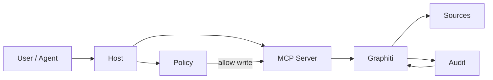
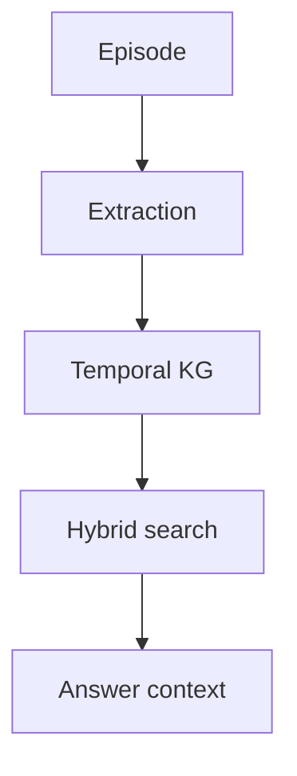
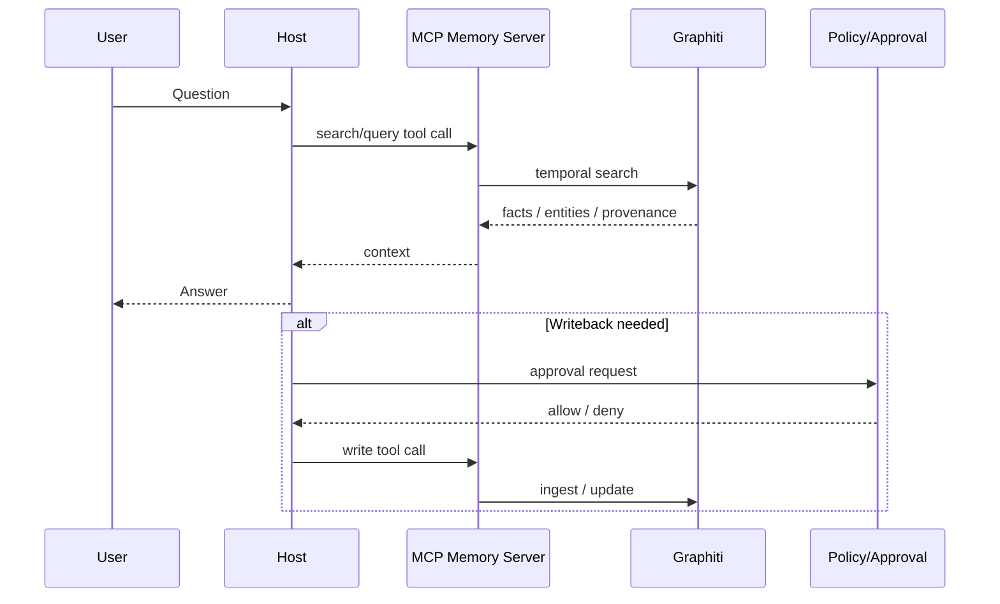
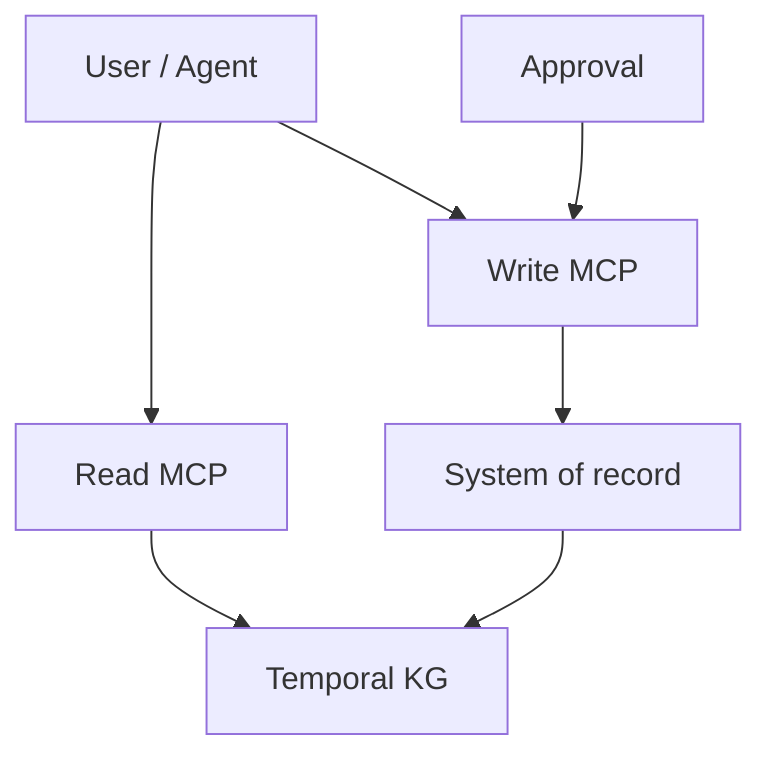
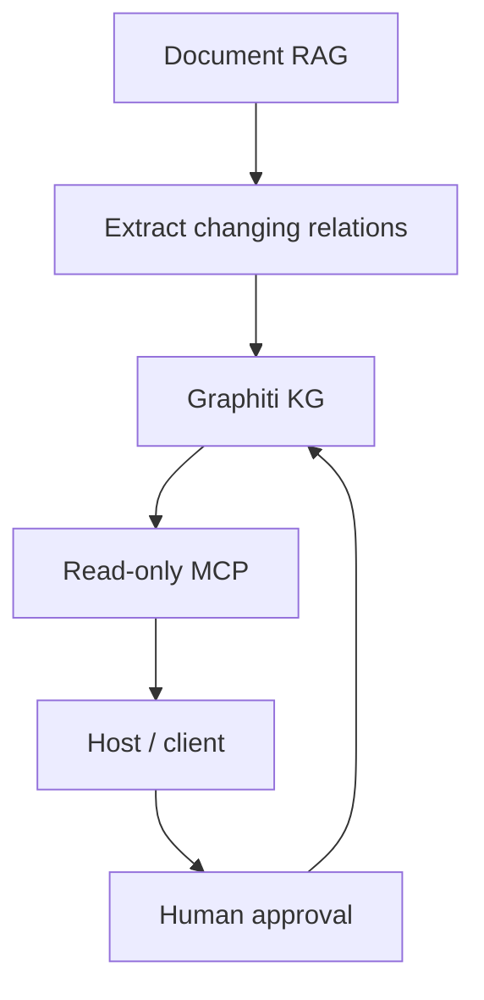

## 1. Executive Summary

By combining Graphiti and MCP, AI agents can be provided with "memory that persists across conversation sessions" and "a standard point of contact from external clients." However, the roles of both are different. Graphiti is the internal representation of memory, and MCP is the interface for how to expose that memory. If this is confused, it will directly lead to practical failures, such as being able to search but with ambiguous permissions, or being able to write but not be able to audit.
To conclude first, the deployment judgment as of 2026 is as follows.

1. Graphiti is suitable for long-term memory that needs to deal with history, relationships, state changes, and evidence. It is especially valuable when you want to preserve information about "who knew what, when, and why."
2. MCP is effective as a standardization layer for distributing storage infrastructure to multiple clients such as Claude Desktop / Cursor / proprietary hosts. However, MCP itself does not resolve memory correctness, authority, reputation, or data models.
3. Temporal knowledge graphs are effective for problems where relationships change, states transition, or where you want to track sources or points in time. On the other hand, it is overkill for static FAQs, one-off document searches, and transaction original management.
4. For personal research, Graphiti or Mem0 are often sufficient. Organizational knowledge should not be limited to Graphiti alone, but document search, structured data, permissions, and audit logs should be placed in separate layers. For business agents, it is safer not to combine storage and execution into the same MCP server.
5. The main candidates as of 2026 are Graphiti/Zep, Mem0, Letta, and GraphRAG. The usage can be divided into "dynamic relational memory," "general-purpose memory layer," "stateful agent," and "graph RAG for static corpora."
   Source note: Graphiti is exposed as Zep's knowledge graph infrastructure, and the documentation provides temporal knowledge graph, hybrid search, custom entity/edge types, and MCP server. MCP is a standard connection layer for host / client / server, and is a specification that exposes tools, resources, and prompts. These are based on [Graphiti docs](https://help.getzep.com/graphiti/graphiti/overview), [Graphiti MCP server README](https://github.com/getzep/graphiti/blob/main/mcp_server/README.md), [MCP specification](https://modelcontextprotocol.io/docs/getting-started/intro).

## 2. The problem Graphiti is trying to solve

Graphiti targets situations where LLM's "short-term memory within the context window" is not enough. Simply summarizing and packing conversation history cannot effectively handle changes in relationships, updates to attributes, contradictions between earlier and later statements, the point of origin, and multiple expressions of the same person or issue. In the context of Graphiti, this becomes a problem that should be treated as a temporal knowledge graph.
Graphiti extracts entities and relationships from episodes and stores them as knowledge graphs with point-in-time information. The official documentation shows that it provides custom entity/edge types, graph namespacing, hybrid search, and MCP server, and is used as Zep's context infrastructure. Zep's public documentation explains that a Graphiti-based memory graph integrates dynamic unstructured and structured business data, and uses bi-temporal treatment to distinguish between past state and capture time.
Source note: See [Graphiti overview](https://help.getzep.com/graphiti/graphiti/overview) and [Graph namespacing](https://help.getzep.com/graphiti/graphiti/graph-namespacing) for an overview of Graphiti. See [Custom entity and edge types](https://help.getzep.com/graphiti/graphiti/custom-entity-and-edge-types) for Graphiti custom entity / edge types. Zep's paper describes temporal memory graphs and bi-temporal models [ZEP: Using Knowledge Graphs to Power LLM Agent Memory](https://blog.getzep.com/content/files/2025/01/ZEP__USING_KNOWLEDGE_GRAPHS_TO_POWER_LLM_AGENT_MEMORY_2025011700.pdf).
Graphiti's value goes beyond simply "saving conversation logs." The goal is to transform the relationships extracted from a conversation into a structure that can be reused in subsequent conversations and tool calls. For example, differences such as "This customer was considering implementation last week, but are now awaiting legal review," "This person in charge has been transferred," and "This case has a different scope from the previous one" are difficult to reconstruct with just a vector search of documents. By creating a graph that is related to time, agents can easily see what is true now and when it became true.

## 3. Differences from traditional RAG / Vector DB / Knowledge Graph

### 3.1 Vector DB

Vector DB is strong in extracting sentences and fragments that are semantically similar. If the requirements are "searching for similar stories," "gathering related documents," or "generating reusable candidates from natural sentences," it will be effective with minimal cost. However, vector DBs usually do not naturally preserve relationship lifetimes, state transitions, sources, negated information, who updated them and when. Therefore, the longer the conversation, the more likely sentences will be mixed up, such as "sentences that are similar but now different" and "sentences that are old but very similar."
Source note: RAG is organized as a way to connect retrieved external knowledge to generation [Lewis et al., 2020](https://arxiv.org/abs/2005.11401). Graphiti's combination of hybrid search and temporal graph is designed to add time, relationships, and grounds to simple semantic retrieval, and the "limitations of vector DB" here are design inferences from this comparison.

### 3.2 Legacy Knowledge Graph

Traditional knowledge graphs have explicit entities/edges/properties, making them suitable for handling relationships. However, in a field where updates are frequent, graphs tend to become static snapshots. There are some operations where the history is stored in a separate table or property, but it is difficult to reuse the agent's memory if the API that asks "when is the relationship?" is weak.
Graphiti's temporality compensates for this. By adding point-in-time information to the knowledge graph, it is possible to handle not only the existence of a relationship, but also when the relationship was established, when it was incorporated, and whether it was later overwritten. Research on temporal knowledge graphs also points out that static graphs miss dynamic evolution and time-dependent relationships.
Source note: The temporal knowledge graph survey shows that static KG is difficult to express temporal changes [Temporal Knowledge Graph Reasoning](https://arxiv.org/abs/2403.04782). Bi-temporal/namespacing/custom edge types on the Graphiti side are based on [Graphiti docs](https://help.getzep.com/graphiti/graphiti/overview) and [custom entity and edge types](https://help.getzep.com/graphiti/graphiti/custom-entity-and-edge-types).

### 3.3 RAG

RAG is designed to search for documents outside the model and use them for answers, and is often the first choice. RAG is the simplest and easiest to operate for document-centered Q&A, policy searches, knowledge bases, and legal, human resources, and internal FAQs. However, RAG is not good at making inferences across issues, customers, personnel, exceptions, approvals, and change history if the search target remains document-based.
Graphiti does not replace RAG, but is similar to the idea of ​​adding "related memories" and "chronological memories" on top of RAG. In practice, a two-step approach of embedding the evidence found in document searches in Graphiti, and drawing the status and history of each entity from Graphiti is likely to be stable in practice.
Source note: The origin of RAG is [Lewis et al., 2020](https://arxiv.org/abs/2005.11401). Graphiti's hybrid search is documented as a design that combines graph retrieval and semantic search [Graphiti overview](https://help.getzep.com/graphiti/graphiti/overview). "Not replacing RAG" here is a practical design reasoning.

## 4. Design to expose the storage infrastructure as an MCP server

MCP is a standard protocol for models to handle external tools, resources, and prompts. Therefore, by exposing Graphiti as an MCP server, MCP-enabled hosts like Claude Desktop and Cursor can reference the same storage infrastructure. While this makes the implementation highly reusable, it also means that the public aspect is expanded.
MCP has three advantages. First, it simplifies client-side integration. Second, the memory server can be decomposed into tool / resource / prompt to separate reading, summarizing, and writing. Third, it is possible to standardize the protocol layer rather than creating a unique API for each agent.
Source note: See [Introduction](https://modelcontextprotocol.io/docs/getting-started/intro) for an introduction to the MCP specification. MCP exposes tools / resources / prompts in the host / client / server relationship. Graphiti's MCP server is located at [Graphiti MCP server README](https://github.com/getzep/graphiti/blob/main/mcp_server/README.md) and targets Claude Desktop / Cursor.
The risks of becoming an MCP are also clear.

1. **Diffusion of privileges**: If memory can be written and updated in addition to reading, malfunctions of clients and models directly become knowledge pollution.
2. **Context Leak**: It is easy to mix one user's memories with another user's conversation. It is necessary to separate namespace and tenant boundary from the beginning.
3. **Excessive writeback**: If the model records the fragments it comes up with, noise and hallucinations will remain in long-term memory.
4. **Difficult to audit**: The more chained tool calls there are, the harder it is to follow the basis for the final decision.
5. **Protocol Dependency**: If you connect anything with MCP, it will seem like it's working while keeping the actual system of record ambiguous.
   The Graphiti MCP server's README is classified as experimental, so it is currently safer to treat it as a "read-oriented memory façade" than to use it as the "sole production copy."
   Source note: The Graphiti MCP server README is experimental and includes instructions for connecting to Claude Desktop / Cursor as an MCP server [Graphiti MCP server README](https://github.com/getzep/graphiti/blob/main/mcp_server/README.md). See [Authorization](https://github.com/modelcontextprotocol/modelcontextprotocol/blob/main/docs/specification/2025-03-26/basic/authorization.mdx) for the concept of MCP authentication/authorization. Here, "reading is safe" is a design inference.

## 5. Situations where temporal knowledge graph is effective for memory and situations where it is not effective

### Effective situations

Temporal knowledge graphs are effective when information changes and the change itself is important.

1. **Relationship changes**: Customer and person in charge, case and status, organization and role change.
2. **Time is important**: “When it happened” is important, and the latest value alone is not enough.
3. **I want to follow the source**: I want to keep the memories obtained from which conversation, which document, and which tool result.
4. **Case Management**: Has multiple-step state transitions, such as inquiry, issue, opportunity, recruitment, and legal review.
5. **Organizational Learning**: Want to reuse past decisions and results to improve next decisions.
   Graphiti's bi-temporal model is well suited for these applications. This is because it is possible to separate not simply "information found" but "when it was observed and when it was effective."
   Source note: Zep's public materials adopt a bi-temporal model and explain that Graphiti is used as a memory graph [ZEP paper](https://blog.getzep.com/content/files/2025/01/ZEP__USING_KNOWLEDGE_GRAPHS_TO_POWER_LLM_AGENT_MEMORY_2025011700.pdf). The arrangement of effective scenes here is based on inference from its structure.

### Situations where it doesn't work

It is also important that temporal KG is not a panacea.

1. **Static FAQ and regulations search**: Simple document searches are faster.
2. **Ephemeral Conversation Context**: Long-term memory is not necessary if only a few turns are enough.
3. **Situation where the original is in another system**: The original of inventory, invoices, contracts, and authorizations should remain at the source of truth and should not be copied to the storage infrastructure.
4. **High-risk decisions**: Final medical, legal, credit, and hiring decisions should not be automated through memory retrieval alone.
5. **Full-text search of large corpora**: If the set of documents is huge and comprehensiveness is more important than relationships, then full-text search and RAG come first.
   In short, temporal KG is effective in areas that require a "semantic network with history." On the other hand, the cost of graphing is often not worth it for simple inquiries about the latest values ​​or wide-area searches of large amounts of documents.

## 6. Implementation pattern

### 6.1 Individual research

In individual studies, the minimal configuration is the most followed. The recommended method is to input journals, paper notes, conversation logs, and important URLs into Graphiti, and search and reuse them via MCP. Here, memory is viewed as "an index for later reuse of one's thoughts." It is suitable for use in keeping track of "what was decided with whom" and "which hypothesis was rejected," which would be lost in document searches alone.
The reason for choosing Graphiti is its ability to handle relationships and time series. Mem0 and Letta are fine, but Graphiti brings the temporal changes of entities and edges to the fore, so it is suitable for research memos and exploration logs.

### 6.2 Organizational knowledge

Organizational knowledge is more difficult to design than personal memory. This is because of authority, departmental boundaries, retention periods, deletion requests, auditing, and distribution of source systems. Therefore, Graphiti should not be used as a standalone knowledge hub, but as part of the following four layers:

1. Document search layer
2. Structured data layer
   3.temporal KG layer
3. Policy/audit/authority layer
   In practice, it is appropriate to enter conversations, email summaries, meeting notes, and case histories in Graphiti, while leaving the original contracts, sales, authority, and inventory in the existing DB. The purpose of organizational knowledge is not to centralize knowledge, but to securely distribute reusable relationships.

### 6.3 Business Agent

In business agents, it is important to separate memory and action. The memory MCP server should be read-heavy, and write should be limited with an authorization flow. Apart from the running MCP server, it is responsible for operations such as CRM, tickets, workflow, and code changes. In this way, you can distinguish between memory contamination and business manipulation.

In this pattern, Graphiti is the "layer for remembering" and the business system is the "layer for finalizing." By separating the two, it is difficult for incorrect memories to corrupt business data.

## 7. Major OSS/Commercial Services in 2026

| Candidates | Positioning                          | Strengths                                                                                 | Points to note                                                                      | Practical maturity |
| ---------- | ------------------------------------ | ----------------------------------------------------------------------------------------- | ----------------------------------------------------------------------------------- | ------------------ | --- | ---- | ------------------------ | ---------------------------------------------------------------------------------------------- | ----------------------------------------------------------- | ---- |
| Graphiti   | OSS temporal knowledge graph engine  | Time series, relationships, evidence, hybrid search, MCP server                           | Still requires a dedicated memory-based design. Graphiti MCP server is experimental | medium             |
| Zep        | Commercial context / memory platform | Graphiti-based managed provision, guidance for organizations, easy to take out operations | Check vendor dependence and data location                                           | Medium to high     |     | Mem0 | OSS / library / platform | General-purpose memory layer, both self-hosted and cloud, wide range from personal to business | Deep semantics of graphs needs to be supplemented by design | High |
| Letta      | stateful agent platform              | Bringing the agent's persistent state, memory blocks, and archival memory to the fore     | Requires operational design for what should be stored in memory                     | Medium to high     |
| GraphRAG   | graph RAG for static corpora         | Extracting, searching, and summarizing relationships among documents                      | Long-term memory and writeback are not the main purpose                             | Medium             |

Source note: Graphiti / Zep see [Graphiti docs](https://help.getzep.com/graphiti/graphiti/overview) and [Zep overview](https://help.getzep.com/overview). Mem0 is [mem0 GitHub](https://github.com/mem0ai/mem0), where official GitHub shows the memory layer and cloud / self-hosted wiring. Letta's official docs/GitHub explain stateful agents and memory blocks/archival memory in [Letta docs](https://docs.letta.com/) and [Letta GitHub](https://github.com/letta-ai/letta). GraphRAG refers to Microsoft's official repository [GraphRAG GitHub](https://github.com/microsoft/graphrag). Maturity is an estimate from public information.

### supplement

Mem0 has the advantage of abstracting memory as a single library/platform and allowing you to choose between self-hosting and cloud storage. Letta treats the agent itself as stateful and has a strong idea of ​​separating memory blocks and archival memory. Graphiti leans toward temporal graphs, with a strong awareness of relationships and time. GraphRAG makes sense primarily for searching static document corpora.
Rather than competing, these are different hierarchies of memory. Graphiti records "relationships and changes." Mem0 provides general purpose memory. Letta continues the "agent state." GraphRAG "makes corpora understandable."

## 8. Cases to introduce / cases to avoid yet

### Cases to be introduced

1. People, projects, relationships, and situations change across conversations.
2. The timing of past statements and observations is important.
3. I want to trace the basis from which that memory was born.
4. I want to reuse the knowledge of teams and organizations rather than individuals.
5. I want to distribute memory to multiple clients, but I want to standardize the API.

### Cases to still avoid

1. All you need is a simple FAQ or document search.
2. The original copy is in the existing business system and you do not want to copy it to the storage infrastructure.
3. Operations regarding authority, auditing, deletion requests, and storage period are not well established.
4. There is no mechanism to evaluate hallucinations and incorrect extraction.
5. You are suddenly trying to place a writable MCP server at the core of business automation.
   The shortest practical route is to first introduce it as a read-only memory server and then open limited writebacks later. If we summarize everything from the beginning as "memory and execution are all MCP," design responsibilities become mixed.

## 9. Recommended policy

If you want to combine Graphiti and MCP, it is best to proceed in the following order.

1. Prepare document RAG first.
2. Put only changing relationships into Graphiti.
3. MCP starts as read-only.
4. Writeback should include approval.
5. Separate storage and execution MCP servers.
6. Create the audit log, evaluation set, and deletion flow first.
   With this order, you can safely use Graphiti as a "temporal relational index" rather than a "long-term memory body." MCP is just a window, so ease of publication should not be used as an excuse for poor design.

## Reference information

- [Graphiti Overview](https://help.getzep.com/graphiti/graphiti/overview)
- [Graphiti Custom Entity and Edge Types](https://help.getzep.com/graphiti/graphiti/custom-entity-and-edge-types)
- [Graphiti Graph Namespacing](https://help.getzep.com/graphiti/graphiti/graph-namespacing)
- [Graphiti MCP server README](https://github.com/getzep/graphiti/blob/main/mcp_server/README.md)
- [Zep Overview](https://help.getzep.com/overview)
- [ZEP: Using Knowledge Graphs to Power LLM Agent Memory](https://blog.getzep.com/content/files/2025/01/ZEP__USING_KNOWLEDGE_GRAPHS_TO_POWER_LLM_AGENT_MEMORY_2025011700.pdf)
- [MCP Introduction](https://modelcontextprotocol.io/docs/getting-started/intro)
- [MCP Authorization](https://github.com/modelcontextprotocol/modelcontextprotocol/blob/main/docs/specification/2025-03-26/basic/authorization.mdx)
- [Mem0 GitHub](https://github.com/mem0ai/mem0)
- [Letta Docs](https://docs.letta.com/)
- [Letta GitHub](https://github.com/letta-ai/letta)
- [GraphRAG GitHub](https://github.com/microsoft/graphrag)
- [Lewis et al., 2020 RAG](https://arxiv.org/abs/2005.11401)
- [Temporal Knowledge Graph Reasoning](https://arxiv.org/abs/2403.04782)
