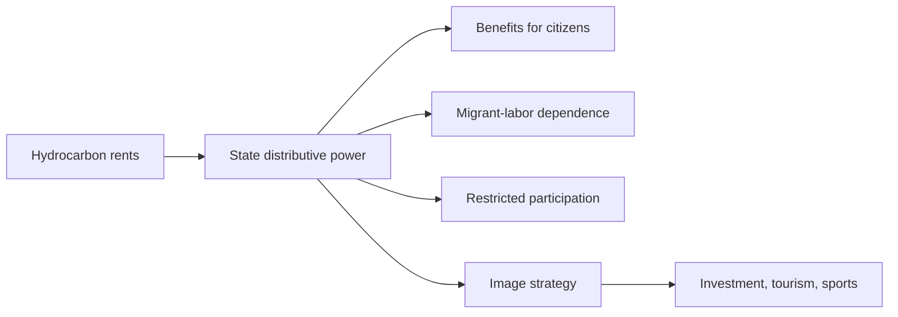

# Modernization and Authoritarianism in the Gulf States

## 1. Executive Summary

Saudi Arabia, the UAE, and Qatar all talk about modernization, but their programs are not democratization projects. Their official strategies use oil and gas revenue to diversify the economy, expand cities, tourism, logistics, finance, tech, and sports, and keep political participation tightly managed. In the Gulf, modernization means controlled change, not liberalization by default. <SourceNote>[World Bank, GCC Economies Update](https://www.worldbank.org/en/region/mena/publication/gcc-economies-update), [Freedom House, Saudi Arabia 2025](https://freedomhouse.org/country/saudi-arabia/freedom-world/2025), [Freedom House, United Arab Emirates 2025](https://freedomhouse.org/country/united-arab-emirates/freedom-world/2025), and [Freedom House, Qatar 2025](https://freedomhouse.org/country/qatar/freedom-world/2025) support this reading.</SourceNote>

The key to this pattern is how hydrocarbon rents shaped state formation. In a tax-based state, representation and taxation tend to be linked. In the Gulf, oil and gas revenue has funded security services, subsidies, public-sector jobs, large infrastructure, housing, and overseas investment, so the state first became a distributor. As a public-information inference, that rentier logic produced a distribution state rather than a tax state, and it prioritized stability over political opening. <SourceNote>[World Bank, GCC Economies Update](https://www.worldbank.org/en/region/mena/publication/gcc-economies-update) and [IMF, Middle East and Central Asia Regional Economic Outlook 2026](https://www.imf.org/en/Publications/REO/MCD) underpin that inference.</SourceNote>

For practical readers, the three countries are easiest to distinguish this way: Saudi Arabia is the largest rentier monarchy and is using top-down reform to reshape domestic life; the UAE is the most polished brand state and combines federation with global-hub politics; Qatar is a small state optimizing gas, sport, media, and mediation. Read that way, the region becomes much less confusing. <SourceNote>[Vision 2030 Official Reports](https://www.vision2030.gov.sa/en/annual-reports/annual-report-2024/), [UAE Government, We the UAE 2031](https://u.ae/en/about-the-uae/strategies-initiatives-and-awards/federal-governments-strategies-and-plans/we-the-uae-2031), and [Qatar National Vision 2030](https://www.gco.gov.qa/en/about-qatar/national-vision2030/) support this comparison.</SourceNote>

For Japan, the practical point is straightforward: Gulf opportunities are real, but they are conditional markets. Energy, ports, construction, logistics, tourism, sports, data centers, and finance all carry labor, compliance, export-control, and reputation risks. The larger the modernization headline, the more important it is to assume strong internal control until proven otherwise. <SourceNote>[Human Rights Watch, World Report 2026](https://www.hrw.org/world-report/2026) and [ILO Qatar programme](https://www.ilo.org/beirut/whatwedo/projects/WCMS_885822/lang--en/index.htm) are useful starting points.</SourceNote>

The diagram is the smallest useful model of Gulf governance. Resource rents support benefits, migration systems, political limits, and outward branding at the same time. <SourceNote>[World Bank, GCC Economies Update](https://www.worldbank.org/en/region/mena/publication/gcc-economies-update) and [Freedom House country reports](https://freedomhouse.org/countries/freedom-world/scores) support this framing.</SourceNote>

## 2. How the Gulf State Bargain Works

The modern Gulf state is better understood as a rentier distribution state than as a tax state. Hydrocarbon revenue allowed rulers to build a first-order ability to distribute benefits before they had to negotiate representation. Royal and ruling families used public-sector employment, subsidies, security services, housing, infrastructure, and selective welfare to construct loyalty, while remaining dependent on external security guarantees. <SourceNote>[IMF, Middle East and Central Asia Regional Economic Outlook 2026](https://www.imf.org/en/Publications/REO/MCD) and [World Bank, GCC Economies Update](https://www.worldbank.org/en/region/mena/publication/gcc-economies-update) support this structure.</SourceNote>

The important implication is that economic diversification does not automatically bring political opening. In fact, the more a state relies on foreign investors, tourists, global events, and international brand value, the more it cares about governance performance and reputational management. That can produce more sophisticated administration without opening the political field. As a public-information inference, Gulf modernization upgrades authoritarianism rather than replacing it. <SourceNote>[Freedom House, Saudi Arabia 2025](https://freedomhouse.org/country/saudi-arabia/freedom-world/2025), [Freedom House, United Arab Emirates 2025](https://freedomhouse.org/country/united-arab-emirates/freedom-world/2025), [Freedom House, Qatar 2025](https://freedomhouse.org/country/qatar/freedom-world/2025), and [World Bank, GCC Economies Update](https://www.worldbank.org/en/region/mena/publication/gcc-economies-update) support this reading.</SourceNote>

The broader Gulf includes Kuwait, Bahrain, and Oman as well, but this report focuses on the three cases where modernization and authoritarian constraints appear most clearly at the same time. <SourceNote>[Freedom House country reports](https://freedomhouse.org/countries/freedom-world/scores) support the broader comparison.</SourceNote>

## 3. A Three-Country Comparison

| Country | Regime core | Modernization banner | Labor structure | External image strategy |
| --- | --- | --- | --- | --- |
| Saudi Arabia | Absolute monarchy. The royal family sits at the center of administration, security, and justice | Vision 2030, Quality of Life Program, tourism, entertainment, sports | Heavy reliance on migrant labor, with improvements in labor oversight but persistent problems | 2034 World Cup, tourism, entertainment, mega-projects |
| UAE | Federation dominated by hereditary rulers. Elections are highly limited | We the UAE 2031, Centennial 2071, global-hub politics | Noncitizens make up the majority of the population, and labor-abuse concerns persist | Soft power, national branding, finance, logistics, tech |
| Qatar | Emirate state. No parties, and the 2024 constitutional change further narrowed electoral space | Qatar National Vision 2030, Third National Development Strategy 2024-2030 | Migrant workers make up the overwhelming majority, and reforms are limited by enforcement gaps | Sports, media, mediation, World Cup legacy |

The main point of the table is that all three states use the language of reform, but their reforms focus on economic reorganization and state redesign rather than political participation. Saudi Arabia reshapes social life from the top down, the UAE sells a low-friction global platform, and Qatar uses small-state agility to punch above its weight. <SourceNote>[Vision 2030 Official Reports](https://www.vision2030.gov.sa/en/annual-reports/annual-report-2024/), [UAE Government, We the UAE 2031](https://u.ae/en/about-the-uae/strategies-initiatives-and-awards/federal-governments-strategies-and-plans/we-the-uae-2031), [Qatar National Vision 2030](https://www.gco.gov.qa/en/about-qatar/national-vision2030/), and [Qatar Third National Development Strategy 2024-2030](https://www.gco.gov.qa/en/about-qatar/strategies-and-vision/third-national-development-strategy-2024-2030/) support that interpretation.</SourceNote>

### 3.1 Saudi Arabia

Saudi modernization is a process of redesigning domestic life under strong state control. The official Vision 2030 materials emphasize diversification, jobs, tourism, quality of life, entertainment, and sports, and the 2024 annual report presents the program as the core of national transformation. Politically, however, there is still no meaningful electoral competition or open power-sharing. <SourceNote>[Vision 2030 Official Reports](https://www.vision2030.gov.sa/en/annual-reports/annual-report-2024/) and [Freedom House, Saudi Arabia 2025](https://freedomhouse.org/country/saudi-arabia/freedom-world/2025) support this point.</SourceNote>

The constraint is most visible in rights and repression. Human Rights Watch describes Saudi Arabia in 2026 as a country where executions, restrictions on expression, migrant-labor exploitation, and pressure on women and dissidents remain serious concerns. Social visibility has expanded, but the authoritarian core remains intact. <SourceNote>[Human Rights Watch, World Report 2026: Saudi Arabia](https://www.hrw.org/world-report/2026/country-chapters/saudi-arabia) supports this assessment.</SourceNote>

### 3.2 The UAE

The UAE is the Gulf's most heavily branded state. Government documents tie We the UAE 2031 and Centennial 2071 to international-city politics, investment, logistics, AI, tourism, space, education, and soft power. Modernization here is designed to attract capital and talent while preserving dynastic authority. <SourceNote>[UAE Government, We the UAE 2031](https://u.ae/en/about-the-uae/strategies-initiatives-and-awards/federal-governments-strategies-and-plans/we-the-uae-2031) and [UAE Government, Centennial 2071](https://u.ae/en/about-the-uae/strategies-initiatives-and-awards/federal-governments-strategies-and-plans/centennial-2071) support this reading.</SourceNote>

Soft power is not the same thing as political freedom. Freedom House still treats the UAE as a heavily restricted political space, and Human Rights Watch continues to highlight labor exploitation and major due-process concerns. As a public-information inference, the UAE's strength is that it makes an open-market environment look easy; its weakness is that this openness barely reaches citizen politics. <SourceNote>[Freedom House, United Arab Emirates 2025](https://freedomhouse.org/country/united-arab-emirates/freedom-world/2025) and [Human Rights Watch, World Report 2026: United Arab Emirates](https://www.hrw.org/world-report/2026/country-chapters/united-arab-emirates) support that reading.</SourceNote>

### 3.3 Qatar

Qatar is small, but its strategy is sharp. Qatar National Vision 2030 and the Third National Development Strategy 2024-2030 link human capital, diversification, social stability, the environment, and governance, while the political space remains narrow. The 2024 constitutional change further reduced the room for elected council politics, making the dynastic character of the state even clearer. <SourceNote>[Qatar National Vision 2030](https://www.gco.gov.qa/en/about-qatar/national-vision2030/), [Qatar Third National Development Strategy 2024-2030](https://www.gco.gov.qa/en/about-qatar/strategies-and-vision/third-national-development-strategy-2024-2030/), and [Freedom House, Qatar 2025](https://freedomhouse.org/country/qatar/freedom-world/2025) support this point.</SourceNote>

Qatar's strength is that LNG, mediation, sport, and media reinforce one another. But dependence on migrant labor is extreme, and ILO-backed reforms still face enforcement gaps. The post-World Cup image improved, but that does not mean the rights problem disappeared. <SourceNote>[ILO, Qatar labour reform programme](https://www.ilo.org/beirut/whatwedo/projects/WCMS_885822/lang--en/index.htm) and [Human Rights Watch, World Report 2026: Qatar](https://www.hrw.org/world-report/2026/country-chapters/qatar) support this point.</SourceNote>

## 4. Migrant Labor and the Citizen/Noncitizen Boundary

The most important social divide in the Gulf is the boundary between citizens and noncitizens. Public benefits and many public jobs are reserved for citizens, while construction, household work, logistics, hospitality, infrastructure, cleaning, and parts of IT operations rely on migrant labor. That dual structure speeds growth, but it also creates a persistent protection gap. <SourceNote>[World Bank, GCC Economies Update](https://www.worldbank.org/en/region/mena/publication/gcc-economies-update) and [ILO Qatar programme](https://www.ilo.org/beirut/whatwedo/projects/WCMS_885822/lang--en/index.htm) support this structure.</SourceNote>

### Saudi Arabia

Saudi labor reform has moved forward, but the risk of exploitation has not disappeared. Greater labor-market flexibility and some rule changes do not eliminate employer-dominant practices, passport retention, delayed wages, long hours, or constraints on changing jobs. Vision 2030's employment agenda expands national hiring, but it also makes migrant labor easier to manage and control. <SourceNote>[Human Rights Watch, World Report 2026: Saudi Arabia](https://www.hrw.org/world-report/2026/country-chapters/saudi-arabia) and [Vision 2030 Official Reports](https://www.vision2030.gov.sa/en/annual-reports/annual-report-2024/) support this point.</SourceNote>

### The UAE

The UAE is one of the most extreme cases of migrant-labor dependence. The inflow of workers sustains urban growth, but workers still face limits on job mobility, household labor protections, and collective rights. HRW continues to point to exploitation and arbitrary detention, and the contrast between modern skylines and fragile labor protections is very visible. <SourceNote>[Human Rights Watch, World Report 2026: United Arab Emirates](https://www.hrw.org/world-report/2026/country-chapters/united-arab-emirates) and [Freedom House, United Arab Emirates 2025](https://freedomhouse.org/country/united-arab-emirates/freedom-world/2025) support this point.</SourceNote>

### Qatar

In Qatar, the government and the ILO have advanced reforms on minimum wages, job mobility, and exit restrictions. But the population and labor structure are so skewed that weak enforcement can hollow out rights on the ground. Even after the World Cup, reform on paper and actual remedy for workers remain different questions. <SourceNote>[ILO, Qatar labour reform programme](https://www.ilo.org/beirut/whatwedo/projects/WCMS_885822/lang--en/index.htm) and [Human Rights Watch, World Report 2026: Qatar](https://www.hrw.org/world-report/2026/country-chapters/qatar) support this point.</SourceNote>

## 5. What Investment, Sports, and Tourism Are Trying to Do

The Gulf's image strategy is not just public relations. First, it attracts investment and tourism by signaling credibility. Second, it absorbs youth expectations by creating jobs and new urban experiences. Third, it softens international criticism by building diplomatic assets. As a public-information inference, sports, expos, mega-events, museums, and global conferences are used to diversify the economy and manage reputation at the same time. <SourceNote>[Vision 2030 Official Reports](https://www.vision2030.gov.sa/en/annual-reports/annual-report-2024/), [UAE Government, We the UAE 2031](https://u.ae/en/about-the-uae/strategies-initiatives-and-awards/federal-governments-strategies-and-plans/we-the-uae-2031), and [Qatar GCO strategic partnerships](https://www.gco.gov.qa/en/about-qatar/strategies-and-vision/strategic-partnerships/) support that interpretation.</SourceNote>

In Saudi Arabia, tourism, entertainment, and sports sit at the center of Vision 2030, and the country's 2034 FIFA World Cup hosting rights are part of that same logic. The point is not only to attract investment; it is also to test whether a highly controlled state can run a global event while presenting itself as new. <SourceNote>[Vision 2030 Official Reports](https://www.vision2030.gov.sa/en/annual-reports/annual-report-2024/) and [FIFA, Saudi Arabia 2034 host selection](https://www.fifa.com/tournaments/mens/worldcup/saudiarabia2034) support this point.</SourceNote>

In the UAE, soft power and national branding are built into the state itself. Government messaging presents the country as an international city, a safe place for investment, a hub for culture, and a competitive administration. The important point is that this branding improves governance efficiency far more than it expands political competition. <SourceNote>[UAE Government, Centennial 2071](https://u.ae/en/about-the-uae/strategies-initiatives-and-awards/federal-governments-strategies-and-plans/centennial-2071) and [UAE Government, soft power strategy](https://u.ae/en/about-the-uae/strategies-initiatives-and-awards/federal-governments-strategies-and-plans/soft-power-strategy) support this point.</SourceNote>

Qatar has used sport and media to prove that a small state can still sit at the center of global attention. The Qatar Government Communications Office publicizes strategic partnerships linking technology, media, sport, and digital innovation, and the country continues to build on that visibility after the World Cup. But international attention does not erase rights criticism. <SourceNote>[Qatar GCO strategic partnerships](https://www.gco.gov.qa/en/about-qatar/strategies-and-vision/strategic-partnerships/), [Freedom House, Qatar 2025](https://freedomhouse.org/country/qatar/freedom-world/2025), and [Human Rights Watch, World Report 2026: Qatar](https://www.hrw.org/world-report/2026/country-chapters/qatar) support this point.</SourceNote>

## 6. Practical Reading Rules

For Japanese firms and policymakers, the Gulf should be treated as a conditional market, not just a wealthy market. Projects can be attractive, but they also carry labor, data, anti-bribery, export-control, contract, reputation, and geopolitical risks. In construction, energy, logistics, tourism, finance, and sports-related business, it is better to verify labor protection and enforcement capacity before assuming that reform headlines equal liberalization. <SourceNote>[World Bank, GCC Economies Update](https://www.worldbank.org/en/region/mena/publication/gcc-economies-update) and [Human Rights Watch, World Report 2026](https://www.hrw.org/world-report/2026) support this warning.</SourceNote>

The practical checklist is short:

1. Check where hydrocarbon revenue is being redistributed.
1. Distinguish political participation from economic administration.
1. Verify whether migrant-labor protections work in practice, not just on paper.
1. Ask how sports, tourism, and investment events affect human-rights and compliance exposure.

Those four questions make it easier to separate the appearance of modernization from the reality of governance. <SourceNote>[Freedom House country reports](https://freedomhouse.org/countries/freedom-world/scores), [ILO Qatar programme](https://www.ilo.org/beirut/whatwedo/projects/WCMS_885822/lang--en/index.htm), and [Human Rights Watch, World Report 2026](https://www.hrw.org/world-report/2026) support this checklist.</SourceNote>

## 7. Limits and Watchpoints

This report has three limits. First, official Gulf strategies are promotional documents, so targets must be separated from outcomes. Second, labor conditions are visible enough in international reports to identify the pattern, but nonpublic bargaining and security decisions remain hard to observe. Third, Gulf policy can move quickly, so assumptions can change within months. <SourceNote>[World Bank, GCC Economies Update](https://www.worldbank.org/en/region/mena/publication/gcc-economies-update), [ILO Qatar programme](https://www.ilo.org/beirut/whatwedo/projects/WCMS_885822/lang--en/index.htm), and [Human Rights Watch, World Report 2026](https://www.hrw.org/world-report/2026) support these limits.</SourceNote>

The next thing to watch is not just the price of oil and gas, but how each state reallocates that revenue and whether rights protection becomes enforceable on the ground. Gulf modernization will continue, but much of it is likely to strengthen authoritarian rule rather than replace it. <SourceNote>[Freedom House, Saudi Arabia 2025](https://freedomhouse.org/country/saudi-arabia/freedom-world/2025), [Freedom House, United Arab Emirates 2025](https://freedomhouse.org/country/united-arab-emirates/freedom-world/2025), and [Freedom House, Qatar 2025](https://freedomhouse.org/country/qatar/freedom-world/2025) support this conclusion.</SourceNote>

## References

- [World Bank, GCC Economies Update](https://www.worldbank.org/en/region/mena/publication/gcc-economies-update)
- [IMF, Middle East and Central Asia Regional Economic Outlook 2026](https://www.imf.org/en/Publications/REO/MCD)
- [Freedom House, Saudi Arabia 2025](https://freedomhouse.org/country/saudi-arabia/freedom-world/2025)
- [Freedom House, United Arab Emirates 2025](https://freedomhouse.org/country/united-arab-emirates/freedom-world/2025)
- [Freedom House, Qatar 2025](https://freedomhouse.org/country/qatar/freedom-world/2025)
- [Vision 2030 Official Reports](https://www.vision2030.gov.sa/en/annual-reports/annual-report-2024/)
- [UAE Government, We the UAE 2031](https://u.ae/en/about-the-uae/strategies-initiatives-and-awards/federal-governments-strategies-and-plans/we-the-uae-2031)
- [UAE Government, Centennial 2071](https://u.ae/en/about-the-uae/strategies-initiatives-and-awards/federal-governments-strategies-and-plans/centennial-2071)
- [Qatar National Vision 2030](https://www.gco.gov.qa/en/about-qatar/national-vision2030/)
- [Qatar Third National Development Strategy 2024-2030](https://www.gco.gov.qa/en/about-qatar/strategies-and-vision/third-national-development-strategy-2024-2030/)
- [ILO, Qatar labour reform programme](https://www.ilo.org/beirut/whatwedo/projects/WCMS_885822/lang--en/index.htm)
- [Human Rights Watch, World Report 2026](https://www.hrw.org/world-report/2026)
