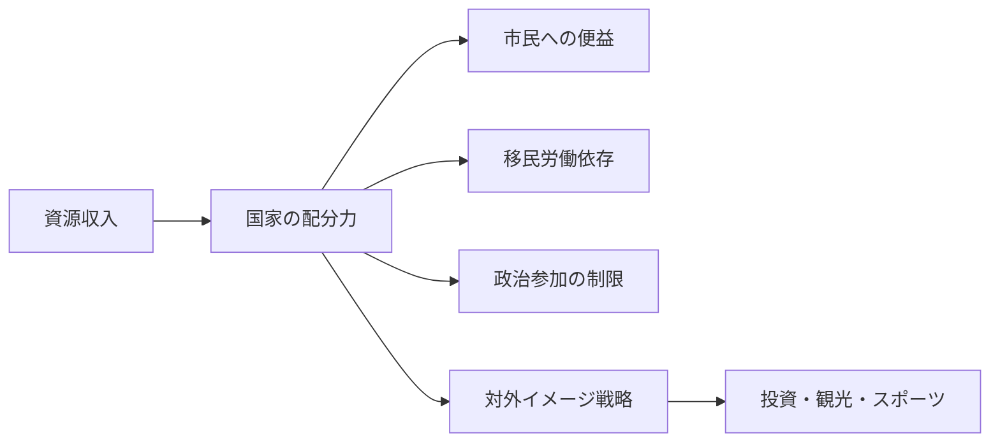

# 湾岸諸国の近代化と権威主義

## 1. エグゼクティブサマリー

サウジアラビア、UAE、カタールは、いずれも「近代化」を掲げているが、その中身は民主化ではない。公式戦略は、石油・ガス収入を使って経済を多角化し、都市、観光、物流、金融、テック、スポーツを伸ばしつつ、政治参加は厳しく制御する設計になっている。つまり、湾岸の近代化は、開放と統制が同時に進む管理された変化である。<SourceNote>[World Bank, GCC Economies Update](https://www.worldbank.org/en/region/mena/publication/gcc-economies-update)、[Freedom House, Saudi Arabia 2025](https://freedomhouse.org/country/saudi-arabia/freedom-world/2025)、[Freedom House, United Arab Emirates 2025](https://freedomhouse.org/country/united-arab-emirates/freedom-world/2025)、[Freedom House, Qatar 2025](https://freedomhouse.org/country/qatar/freedom-world/2025) に基づく。</SourceNote>

この構図を理解する鍵は、資源収入が国家形成をどう変えたかである。課税に依存する国家では、代表要求と納税者の交渉が強くなりやすい。だが湾岸では、石油・ガス収入が治安、補助金、公共部門雇用、巨額インフラ、住宅、対外投資を支え、国家は「集めて配る」能力を先に強めた。公表情報からの推定として、これが湾岸型の租税国家ではなく配分国家を生み、政治的自由の拡大よりも統治の安定を優先させた。<SourceNote>[World Bank, GCC Economies Update](https://www.worldbank.org/en/region/mena/publication/gcc-economies-update)、[IMF, Middle East and Central Asia Regional Economic Outlook 2026](https://www.imf.org/en/Publications/REO/MCD) に基づく。</SourceNote>

地域を見る入口は単純である。サウジアラビアは国内改革と宗教的・政治的統制を同時に進める最大の資源国家、UAEは連邦制とグローバル・ハブ化を組み合わせた最も洗練されたブランド国家、カタールは小国ゆえに天然ガス、スポーツ、メディア、外交仲介を結びつける最適化を進める国家として読むと、かなり整理しやすい。<SourceNote>[Vision 2030 Official Reports](https://www.vision2030.gov.sa/en/annual-reports/annual-report-2024/)、[UAE Government, We the UAE 2031](https://u.ae/en/about-the-uae/strategies-initiatives-and-awards/federal-governments-strategies-and-plans/we-the-uae-2031)、[Qatar National Vision 2030](https://www.gco.gov.qa/en/about-qatar/national-vision2030/) に基づく。</SourceNote>

日本にとって重要なのは、湾岸を「富裕で安定した地域」とだけ見ないことである。エネルギー、港湾、建設、物流、観光、スポーツ、データセンター、金融の案件では、労働監督、人権デューデリジェンス、輸出管理、対外評判のリスクが一緒に動く。近代化の看板が大きいほど、内部統制も強いという前提で見ておいた方が安全である。<SourceNote>[Human Rights Watch, World Report 2026](https://www.hrw.org/world-report/2026) と [ILO Qatar programme](https://www.ilo.org/beirut/whatwedo/projects/WCMS_885822/lang--en/index.htm) に基づく。</SourceNote>

この図は、湾岸の統治を「石油で豊か」という一語で片づけないための最小モデルである。資源収入は、便益供与、移民労働の制度化、政治参加の制限、対外イメージづくりを同時に支える。<SourceNote>[World Bank, GCC Economies Update](https://www.worldbank.org/en/region/mena/publication/gcc-economies-update)、[Freedom House country reports](https://freedomhouse.org/countries/freedom-world/scores) に基づく。</SourceNote>

## 2. 湾岸型の国家形成

湾岸の現代国家は、税収国家というより、資源レント国家として形成された。石油・ガスは、徴税と議会の取引を通じて国家を弱めるのではなく、むしろ国家が先に配分能力を獲得する経路を開いた。王家や首長家は、公共部門雇用、補助金、治安機構、住宅、インフラを通じて忠誠を組み立て、外部には安全保障依存を抱えつつも、内部では限定的な配分で統治を維持してきた。<SourceNote>[IMF, Middle East and Central Asia Regional Economic Outlook 2026](https://www.imf.org/en/Publications/REO/MCD)、[World Bank, GCC Economies Update](https://www.worldbank.org/en/region/mena/publication/gcc-economies-update) に基づく。</SourceNote>

このモデルの重要点は、経済多角化が直ちに政治開放を意味しないことだ。むしろ、資源以外の収入源を増やすほど、国家は投資家、観光客、国際イベント、外資、ブランド評価に敏感になる。その結果、統治は「支持を得るための再分配」から「国際競争に耐える統治品質の演出」へ少しずつ重心を移すが、選挙競争や自由な野党活動が広がるとは限らない。公表情報からの推定として、湾岸の近代化は統治の技術を高度化するのであって、民主化の自動装置ではない。<SourceNote>[Freedom House, Saudi Arabia 2025](https://freedomhouse.org/country/saudi-arabia/freedom-world/2025)、[Freedom House, United Arab Emirates 2025](https://freedomhouse.org/country/united-arab-emirates/freedom-world/2025)、[Freedom House, Qatar 2025](https://freedomhouse.org/country/qatar/freedom-world/2025)、[World Bank, GCC Economies Update](https://www.worldbank.org/en/region/mena/publication/gcc-economies-update) に基づく。</SourceNote>

湾岸全体の比較では、サウジアラビア、UAE、カタールに加えて、クウェート、バーレーン、オマーンも別の位置を占める。ただし本稿では、近代化の看板と権威主義の制約が最もわかりやすく同時に出る3国に焦点を当てる。<SourceNote>[Freedom House country reports](https://freedomhouse.org/countries/freedom-world/scores) に基づく。</SourceNote>

## 3. 三つの国家比較

| 国 | 体制の骨格 | 近代化の看板 | 労働構造 | 対外イメージ戦略 |
| --- | --- | --- | --- | --- |
| サウジアラビア | 絶対王政。王室が行政・安全保障・司法の中枢を握る | Vision 2030、Quality of Life Program、観光・娯楽・スポーツ | 大規模な移民労働への依存、労務監督の改善は進むが問題は残る | 2034年W杯、観光、エンタメ、メガプロジェクト |
| UAE | 首長家中心の連邦制。選挙は限定的で、実権は統治家系が保持 | We the UAE 2031、Centennial 2071、グローバル・ハブ化 | 非国民が人口の大半を占める、労働搾取の懸念が続く | ソフトパワー、国家ブランド、金融・物流・テック |
| カタール | 首長制。政党はなく、2024年の制度変更で選挙制の余地はさらに縮小 | Qatar National Vision 2030、Third National Development Strategy 2024-2030 | 移民労働者が人口の大半を占める、改革はあるが執行格差が大きい | スポーツ、メディア、外交仲介、World Cup legacy |

表の要点は、3国とも「改革」を語るが、その改革は政治参加の拡大よりも、経済の組み替えと統治の再設計に向いていることである。サウジアラビアは国家主導で生活世界を変え、UAEは規制の軽さと国際接続性で魅せ、カタールは小国の機動力を使って存在感を作る。<SourceNote>[Vision 2030 Official Reports](https://www.vision2030.gov.sa/en/annual-reports/annual-report-2024/)、[UAE Government, We the UAE 2031](https://u.ae/en/about-the-uae/strategies-initiatives-and-awards/federal-governments-strategies-and-plans/we-the-uae-2031)、[Qatar National Vision 2030](https://www.gco.gov.qa/en/about-qatar/national-vision2030/)、[Qatar Third National Development Strategy 2024-2030](https://www.gco.gov.qa/en/about-qatar/strategies-and-vision/third-national-development-strategy-2024-2030/) に基づく。</SourceNote>

### 3.1 サウジアラビア

サウジアラビアの近代化は、国家が国内生活をより細かく設計し直す過程として進んでいる。Vision 2030 の公式文書は、経済多角化、雇用、観光、生活の質、娯楽、スポーツを前面に出し、2024年の年次報告でも同プログラムを国家変革の中核として扱っている。だが、政治的には、選挙競争や公開された権力交代の回路はほとんど開いていない。<SourceNote>[Vision 2030 Official Reports](https://www.vision2030.gov.sa/en/annual-reports/annual-report-2024/)、[Freedom House, Saudi Arabia 2025](https://freedomhouse.org/country/saudi-arabia/freedom-world/2025) に基づく。</SourceNote>

ここでの制約は、人権と統治の厳しさに最もはっきり現れる。Human Rights Watch は、2026年時点のサウジを、処刑の多さ、表現の制約、移民労働者への搾取、女性や反体制派への圧力が続く国として位置づけている。つまり、社会の可視性は増しても、権威主義のコアは残る。<SourceNote>[Human Rights Watch, World Report 2026: Saudi Arabia](https://www.hrw.org/world-report/2026/country-chapters/saudi-arabia) に基づく。</SourceNote>

### 3.2 UAE

UAE は、最もブランド化された湾岸国家である。政府文書は We the UAE 2031 と Centennial 2071 を掲げ、国際都市、投資、物流、AI、観光、宇宙、教育、ソフトパワーを結びつける。ここでの近代化は、統治家系の権威を前提に、制度の摩擦を減らして外資と人材を呼び込む方向に設計されている。<SourceNote>[UAE Government, We the UAE 2031](https://u.ae/en/about-the-uae/strategies-initiatives-and-awards/federal-governments-strategies-and-plans/we-the-uae-2031)、[UAE Government, Centennial 2071](https://u.ae/en/about-the-uae/strategies-initiatives-and-awards/federal-governments-strategies-and-plans/centennial-2071) に基づく。</SourceNote>

ただし、ソフトパワーは政治的自由と同義ではない。Freedom House はUAEを依然として強く制限された政治空間として扱い、Human Rights Watch は2025年の大規模拘禁・不公正裁判、移民労働の搾取、労働者の権利侵害を問題視している。公表情報からの推定として、UAE の強みは「開かれた市場」に見える統治環境を作ることであり、弱点はその開放が市民政治にはほとんど波及しない点にある。<SourceNote>[Freedom House, United Arab Emirates 2025](https://freedomhouse.org/country/united-arab-emirates/freedom-world/2025)、[Human Rights Watch, World Report 2026: United Arab Emirates](https://www.hrw.org/world-report/2026/country-chapters/united-arab-emirates) に基づく。</SourceNote>

### 3.3 カタール

カタールは、人口規模が小さいぶん、国家戦略が鋭い。Qatar National Vision 2030 と Third National Development Strategy 2024-2030 は、人的資本、経済多角化、社会の安定、環境、ガバナンスを結びつけるが、政治空間は依然として狭い。2024年の憲法改正で、選挙制のある諮問評議会の余地はさらに縮み、家産国家としての性格がむしろ明確になった。<SourceNote>[Qatar National Vision 2030](https://www.gco.gov.qa/en/about-qatar/national-vision2030/)、[Qatar Third National Development Strategy 2024-2030](https://www.gco.gov.qa/en/about-qatar/strategies-and-vision/third-national-development-strategy-2024-2030/)、[Freedom House, Qatar 2025](https://freedomhouse.org/country/qatar/freedom-world/2025) に基づく。</SourceNote>

カタールの強みは、LNG、外交仲介、スポーツ、メディアを相互に補強させる点にある。だが、移民労働者への依存はきわめて大きく、ILO の改革はあるものの、現場の執行格差は残る。2022年W杯後のイメージは改善したが、それは権利問題の解消を意味しない。<SourceNote>[ILO, Qatar labour reform programme](https://www.ilo.org/beirut/whatwedo/projects/WCMS_885822/lang--en/index.htm)、[Human Rights Watch, World Report 2026: Qatar](https://www.hrw.org/world-report/2026/country-chapters/qatar) に基づく。</SourceNote>

## 4. 移民労働と市民権の線引き

湾岸の近代化で最も重要なのは、国民と非国民の分断である。社会サービスや雇用の多くは国民向けに配分され、建設、家事、物流、接客、インフラ、清掃、IT 運用の一部は移民労働に依存する。この二重構造が、経済成長の速度を上げる一方で、権利保護の空白も生みやすい。<SourceNote>[World Bank, GCC Economies Update](https://www.worldbank.org/en/region/mena/publication/gcc-economies-update)、[ILO Qatar programme](https://www.ilo.org/beirut/whatwedo/projects/WCMS_885822/lang--en/index.htm) に基づく。</SourceNote>

### サウジアラビア

サウジでは、労務制度改革は進んだが、搾取のリスクは消えていない。労働市場の自由化や一部の規制緩和が進んでも、雇用主優位の慣行、パスポート保管、賃金遅配、長時間労働、転職制約は残る。Vision 2030 の雇用拡大は、国民雇用を増やす政策であると同時に、移民労働への依存をより統制しやすくする政策でもある。<SourceNote>[Human Rights Watch, World Report 2026: Saudi Arabia](https://www.hrw.org/world-report/2026/country-chapters/saudi-arabia)、[Vision 2030 Official Reports](https://www.vision2030.gov.sa/en/annual-reports/annual-report-2024/) に基づく。</SourceNote>

### UAE

UAE は、移民労働の比重が最も極端に高い国の一つである。人材流入は都市成長を支えるが、労働者の転職や契約上の自由、家事労働者の保護、集団的権利にはなお制約が多い。HRW は、労働搾取と恣意的拘束の問題を継続的に指摘しており、近代的な街並みと脆弱な労働保護の対比が最も見えやすい。<SourceNote>[Human Rights Watch, World Report 2026: United Arab Emirates](https://www.hrw.org/world-report/2026/country-chapters/united-arab-emirates)、[Freedom House, United Arab Emirates 2025](https://freedomhouse.org/country/united-arab-emirates/freedom-world/2025) に基づく。</SourceNote>

### カタール

カタールでは、ILO と政府の協力で最低賃金、職場移動、出国制限の緩和が進められてきた。それでも、人口構成と雇用構造が極端なため、執行が緩い現場では権利が空洞化しやすい。World Cup の後も、改革の有無と、労働者が実際に救済を受けられるかは別問題である。<SourceNote>[ILO, Qatar labour reform programme](https://www.ilo.org/beirut/whatwedo/projects/WCMS_885822/lang--en/index.htm)、[Human Rights Watch, World Report 2026: Qatar](https://www.hrw.org/world-report/2026/country-chapters/qatar) に基づく。</SourceNote>

## 5. 投資・スポーツ・観光は何を狙うか

湾岸の「イメージ戦略」は、単なる広報ではない。第一に、投資と観光を呼び込むための信頼形成であり、第二に、若年層の期待を吸収する雇用創出であり、第三に、外部からの人権批判を和らげる外交資産でもある。公表情報からの推定として、スポーツ、博覧会、巨大イベント、博物館、国際会議は、経済多角化と評判管理を同時に達成する装置として使われている。<SourceNote>[Vision 2030 Official Reports](https://www.vision2030.gov.sa/en/annual-reports/annual-report-2024/)、[UAE Government, We the UAE 2031](https://u.ae/en/about-the-uae/strategies-initiatives-and-awards/federal-governments-strategies-and-plans/we-the-uae-2031)、[Qatar GCO strategic partnerships](https://www.gco.gov.qa/en/about-qatar/strategies-and-vision/strategic-partnerships/) に基づく。</SourceNote>

サウジアラビアでは、観光、娯楽、スポーツが Vision 2030 の中心テーマであり、2034年の FIFA World Cup 開催権はその延長線上にある。これは国際投資家に「新しいサウジ」を見せる効果を持つが、同時に、国家主導の統制が深いままでも大規模イベントを運営できるか、という試験でもある。<SourceNote>[Vision 2030 Official Reports](https://www.vision2030.gov.sa/en/annual-reports/annual-report-2024/)、[FIFA, Saudi Arabia 2034 host selection](https://www.fifa.com/tournaments/mens/worldcup/saudiarabia2034) に基づく。</SourceNote>

UAE では、ソフトパワーと国家ブランドが制度的に組み込まれている。政府は自らの戦略を、国際都市、投資家向けの安定性、文化交流、競争力のある行政として語る。ここで重要なのは、ブランドの洗練が政治的競争の拡大ではなく、むしろ統治の効率化に向いていることである。<SourceNote>[UAE Government, Centennial 2071](https://u.ae/en/about-the-uae/strategies-initiatives-and-awards/federal-governments-strategies-and-plans/centennial-2071)、[UAE Government, soft power strategy](https://u.ae/en/about-the-uae/strategies-initiatives-and-awards/federal-governments-strategies-and-plans/soft-power-strategy) に基づく。</SourceNote>

カタールは、スポーツとメディアを用いて「小国でも中心になれる」ことを証明しようとしてきた。Qatar GCO は、技術、メディア、スポーツ、デジタル革新を結ぶ戦略的連携を公表しており、World Cup 後もその延長で存在感を維持しようとしている。もっとも、国際的な注目は、権利侵害や表現制約の影を完全には消さない。<SourceNote>[Qatar GCO strategic partnerships](https://www.gco.gov.qa/en/about-qatar/strategies-and-vision/strategic-partnerships/)、[Freedom House, Qatar 2025](https://freedomhouse.org/country/qatar/freedom-world/2025)、[Human Rights Watch, World Report 2026: Qatar](https://www.hrw.org/world-report/2026/country-chapters/qatar) に基づく。</SourceNote>

## 6. 市場近代化リスクの読み方

日本の企業と政策担当者は、湾岸を「買い手の国」としてだけではなく、「統治の条件つき市場」として見るべきである。案件の魅力は高いが、労務、データ、贈賄防止、制裁、契約解除、評判毀損、地政学的変動が同時に乗る。特に建設、エネルギー、物流、観光、金融、スポーツ関連事業では、現地の改革を市場拡大と読み替える前に、実際の権利保護と執行力を確認した方がよい。<SourceNote>[World Bank, GCC Economies Update](https://www.worldbank.org/en/region/mena/publication/gcc-economies-update)、[Human Rights Watch, World Report 2026](https://www.hrw.org/world-report/2026) に基づく。</SourceNote>

実務チェックは次の四つに絞ると使いやすい。

1. どの国が資源収入を何に再配分しているか。
1. 改革が政治参加ではなく、経済管理の改善にとどまっていないか。
1. 移民労働の権利保護が、法文だけでなく現場で機能しているか。
1. スポーツ、観光、投資イベントの評価が、人権・労務・コンプライアンスにどう波及するか。

この4点を見れば、「近代化の見た目」と「統治の実態」を分けやすい。<SourceNote>[Freedom House country reports](https://freedomhouse.org/countries/freedom-world/scores)、[ILO Qatar programme](https://www.ilo.org/beirut/whatwedo/projects/WCMS_885822/lang--en/index.htm)、[Human Rights Watch, World Report 2026](https://www.hrw.org/world-report/2026) に基づく。</SourceNote>

## 7. 限界と今後の注視点

本稿の限界は三つある。第一に、湾岸の公式戦略は自己宣伝色が強く、目標と達成は分けて読む必要がある。第二に、労働者の現場実態は国際機関や NGO の報告でかなり見えるが、非公開の取引や治安判断までは追いにくい。第三に、この地域では政策の変更速度が速く、数か月で前提が変わることがある。<SourceNote>[World Bank, GCC Economies Update](https://www.worldbank.org/en/region/mena/publication/gcc-economies-update)、[ILO Qatar programme](https://www.ilo.org/beirut/whatwedo/projects/WCMS_885822/lang--en/index.htm)、[Human Rights Watch, World Report 2026](https://www.hrw.org/world-report/2026) に基づく。</SourceNote>

したがって、次に見るべきは、資源価格そのものより、資源収入をどう再配分し、どの程度まで権利保護を実装できるかである。湾岸の近代化は続くが、その多くは、政治的自由を増やす方向ではなく、権威主義をアップデートする方向に働いている。<SourceNote>[Freedom House, Saudi Arabia 2025](https://freedomhouse.org/country/saudi-arabia/freedom-world/2025)、[Freedom House, United Arab Emirates 2025](https://freedomhouse.org/country/united-arab-emirates/freedom-world/2025)、[Freedom House, Qatar 2025](https://freedomhouse.org/country/qatar/freedom-world/2025) に基づく。</SourceNote>

## 参考情報

- [World Bank, GCC Economies Update](https://www.worldbank.org/en/region/mena/publication/gcc-economies-update)
- [IMF, Middle East and Central Asia Regional Economic Outlook 2026](https://www.imf.org/en/Publications/REO/MCD)
- [Freedom House, Saudi Arabia 2025](https://freedomhouse.org/country/saudi-arabia/freedom-world/2025)
- [Freedom House, United Arab Emirates 2025](https://freedomhouse.org/country/united-arab-emirates/freedom-world/2025)
- [Freedom House, Qatar 2025](https://freedomhouse.org/country/qatar/freedom-world/2025)
- [Vision 2030 Official Reports](https://www.vision2030.gov.sa/en/annual-reports/annual-report-2024/)
- [UAE Government, We the UAE 2031](https://u.ae/en/about-the-uae/strategies-initiatives-and-awards/federal-governments-strategies-and-plans/we-the-uae-2031)
- [UAE Government, Centennial 2071](https://u.ae/en/about-the-uae/strategies-initiatives-and-awards/federal-governments-strategies-and-plans/centennial-2071)
- [Qatar National Vision 2030](https://www.gco.gov.qa/en/about-qatar/national-vision2030/)
- [Qatar Third National Development Strategy 2024-2030](https://www.gco.gov.qa/en/about-qatar/strategies-and-vision/third-national-development-strategy-2024-2030/)
- [ILO, Qatar labour reform programme](https://www.ilo.org/beirut/whatwedo/projects/WCMS_885822/lang--en/index.htm)
- [Human Rights Watch, World Report 2026](https://www.hrw.org/world-report/2026)
