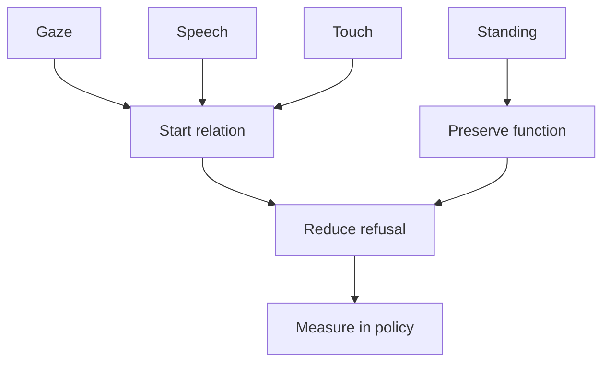

# What Welfare Policy Needs Before Adopting Humanitude

## 1. Executive Summary

Humanitude turns dementia care from a vague appeal to kindness into trainable actions: gaze, speech, touch, and standing support. Humanitude France and Humanitude International describe these as three relational pillars and one identity pillar. Japan, Portugal, and Singapore now have training examples and implementation studies around the method. <SourceNote>[Humanitude International, L'Humanitude](https://humanitude-international.com/l-humanitude) and [Humanitude France, L'Humanitude](https://www.humanitude.fr/l-humanitude/) describe the three relational pillars and one identity pillar.</SourceNote>

The policy test is whether a welfare system can turn dignified care into staff training, shift design, rights protection, family support, and measurement. Japan's dementia basic law and basic plan already emphasize the voice of people living with dementia, decision-making support, and continuity of life in the community. Humanitude can translate those policy words into bathing, transfer, eating, oral care, and toileting practice. <SourceNote>[Japan Ministry of Health, Labour and Welfare, Dementia Basic Act](https://www.mhlw.go.jp/web/t_doc?dataId=82ab9328&dataType=0&pageNo=1) and [Basic Plan for Dementia Policies](https://www.mhlw.go.jp/content/001344090.pdf) support this reading.</SourceNote>

The evidence is encouraging but limited. Studies suggest possible improvements in refusal of care, agitation, psychological symptoms, caregiver burden, empathy, and job satisfaction. Many studies still use short follow-up, single-site designs, quasi-experiments, or pre-post comparisons. A national or municipal adoption plan should therefore treat Humanitude as implementation research. It should measure restraint, psychotropic medication, refusal, falls, staff turnover, family complaints, and participation in daily life. <SourceNote>The scoping review is [Giang et al., Journal of Clinical Nursing](https://onlinelibrary.wiley.com/doi/10.1111/jocn.16477). The Japanese family-caregiver study is [Kobayashi and Honda, BMC Geriatrics](https://pmc.ncbi.nlm.nih.gov/articles/PMC8296621/). A recent care-refusal study is [Journal of Long-Term Care](https://journal.ilpnetwork.org/articles/10.31389/jltc.425).</SourceNote>

## 2. The Core Idea

Humanitude treats care as a relational practice before any procedure touches the body. The caregiver approaches from the front, keeps speaking even when the person does not answer, touches with broad and slow support, and preserves sitting or standing whenever possible. Standing support matters because it protects function and the person's sense of living as an actor. <SourceNote>[Humanitude International, Training approach](https://humanitude-international.com/wp-content/uploads/2021/06/training_approche.pdf) and [Humanitude France, care-team training](https://www.humanitude.fr/formation-equipes-soignantes-du-secteur-sanitaire-ou-medico-social/) present the four pillars, multimodal approach, and management of agitation.</SourceNote>

The method does not rely on staff goodwill alone. It makes familiar acts such as speaking, entering a room, and placing a hand on someone observable and teachable. When a person refuses bathing, the team can change the signal before entering, the position of the gaze, the order of explanation, the way touch begins, and the promise to return later. That level of detail prevents staff from reading refusal only as a behavioural problem.

## 3. Practice Examples

Humanitude usually appears in ordinary care, not in a separate therapeutic room. During bathing, the worker avoids approaching from behind, introduces the encounter from the front, explains the next action, and changes the sequence to fit the person. During oral care, the worker builds gaze, speech, and touch before asking the person to open the mouth. During transfer, the worker tries to preserve the person's own standing movement instead of lifting the body as an object.

A Portuguese continuing-care implementation study followed staff as they learned the Humanitude Care Methodology. The researchers observed changes in the use of care procedures, professional self-assessment, and perceived effects for patients and workers. The study recorded refusal, agitation, non-verbal communication, dignity, and comfort as practical care changes. <SourceNote>[Henriques et al., Implementation of the Humanitude Care Methodology](https://pmc.ncbi.nlm.nih.gov/articles/PMC6336364/) reports action research in a Portuguese Continuing Care Unit.</SourceNote>

Japan has studies involving family caregivers, medical students, oral health professionals, and physicians. In one family-caregiver study, six hours of training plus continuing information were associated with lower caregiver burden after three months. In a physician-training study, video and AI analysis were used to teach acute-care communication with older patients with dementia. These studies show that Humanitude can move beyond residential care into family care, medicine, emergency care, and oral health. <SourceNote>[Kobayashi and Honda, BMC Geriatrics](https://pmc.ncbi.nlm.nih.gov/articles/PMC8296621/) and [BMJ Open, multimodal comprehensive communication skills training](https://bmjopen.bmj.com/content/13/3/e065477) support this section.</SourceNote>

## 4. Effects and Limits

Existing studies point to three likely effects. First, refusal, agitation, and psychological symptoms may decrease. Second, caregivers may gain concrete ways to respond, reducing burden and burnout. Third, professional training may improve empathy and communication in the short term. <SourceNote>[Giang et al., Journal of Clinical Nursing](https://onlinelibrary.wiley.com/doi/10.1111/jocn.16477) reviewed 11 studies on Humanitude. The medical-student empathy study is [BMC Medical Education](https://pmc.ncbi.nlm.nih.gov/articles/PMC8176710/).</SourceNote>

Several policy claims remain unproven. The literature does not yet allow a strong cross-country estimate of long-term effects on restraint, psychotropic medication, hospitalization, falls, turnover, or care cost. A 2025 care-refusal study showed short-term pre-post improvement, while noting the absence of a control group and short follow-up. A policy adoption should measure outcomes across the person, family, staff, and budget instead of relying on the impression that the care feels better. <SourceNote>[Journal of Long-Term Care, Effectiveness of Humanitude Training on Care Refusal in Dementia](https://journal.ilpnetwork.org/articles/10.31389/jltc.425) reports immediate effects and states the limits of control-group absence and short follow-up.</SourceNote>

## 5. Country Policy Contexts

| Country or body | Welfare context | Implementation condition visible in policy |
| --- | --- | --- |
| WHO | Dementia is framed as a public-health, rights, caregiver-support, and community issue. | Member states need awareness, diagnosis, caregiver support, information systems, and research. |
| Japan | Long-term care insurance, community-based integrated care, and the Dementia Basic Act already emphasize participation and decision-making support. | Humanitude can turn the basic plan's person-first language into daily care procedures. |
| France | The method began in France, while the national neurodegenerative-disease strategy covers prevention, diagnosis, home care, institutions, and research. | Humanitude needs to sit inside home-care strengthening, complex case support, facility quality, and caregiver policy. |
| Portugal | The dementia strategy connects regional plans, continuing care, rights, research, training, and evaluation. | The method fits a regional implementation model tied to training and monitoring. |
| United Kingdom | NICE guidance sets expectations for person-centred care, staff training, and carer support. | Even without naming Humanitude, regulators can audit values, preferences, and family support. |
| Singapore | National dementia policy, AIC, DementiaHub, and community supports connect clinical and social care. | A small integrated system can link staff training, family material, and community resources. |

WHO's dementia action plan treats dementia as a public-health issue involving society, caregivers, information, and research. OECD long-term-care work also highlights family-caregiver burden, community care, and poor coordination between health and long-term care as recurring system problems. <SourceNote>[WHO, Global action plan on the public health response to dementia 2017-2025](https://www.who.int/publications/i/item/global-action-plan-on-the-public-health-response-to-dementia-2017---2025) and [OECD, Ageing and long-term care](https://www.oecd.org/en/topics/sub-issues/ageing-and-long-term-care.html) support this framing.</SourceNote>

France's `Stratégie nationale Maladies Neurodégénératives 2025-2030` cites 1.4 million people with Alzheimer's disease or other neurocognitive disorders, 225,000 new cases a year, and growth toward 2050. It sets six axes and 37 measures: changing perceptions, earlier detection, caregiver support, stronger home care, response to complex institutional needs, and research. <SourceNote>[Ministère de la Santé, Stratégie nationale Maladies Neurodégénératives 2025-2030](https://sante.gouv.fr/soins-et-maladies/maladies/maladies-neurodegeneratives/article/la-strategie-nationale-maladies-neurodegeneratives-2025-2030) supports this section.</SourceNote>

Portugal approved its dementia health strategy through `Despacho n.º 5988/2018`, requiring regional dementia plans, quality of life, research, rights, training, and monitoring. In 2026, Portugal updated the governance model for the National Dementia Health Plan. The policy question there is how to connect a care method to regional planning and implementation responsibility. <SourceNote>[Diário da República, Despacho n.º 5988/2018](https://diariodarepublica.pt/dr/detalhe/despacho/5988-2018-115533450) and [Despacho n.º 4762/2026](https://dre.pt/web/guest/pesquisa/-/search/1084035742/details/maximized) support this section.</SourceNote>

NICE NG97 in England recommends person-centred dementia care based on the value, individuality, rights, and preferences of people living with dementia and their carers. Singapore's Ministry of Health explains that the National Dementia Strategy began in 2009 and was updated in 2017, while DementiaHub presents Humanitude's four pillars for caregivers. <SourceNote>[NICE NG97, Person-centred care](https://www.nice.org.uk/guidance/ng97/chapter/Person-centred-care), [Singapore MOH, Dementia plans and subsidy support](https://www.moh.gov.sg/newsroom/dementia-plans-and-subsidy-support-for-dementia-care/), and [DementiaHub.SG, Understanding the Four Pillars of Humanitude](https://www.dementiahub.sg/living-well-with-dementia/understanding-the-four-pillars-of-humanitude/) support this comparison.</SourceNote>

## 6. The Japanese Adoption Test

Japan already has the policy direction: dignity, hope, the person's voice, decision-making support, and life in the community. Humanitude can help turn that direction into care technique. Without institutional support, however, the method will remain a personal skill held by a few trained workers. <SourceNote>[MHLW, Basic Plan for Dementia Policies summary](https://www.mhlw.go.jp/content/001344088.pdf) sets priority goals around the new view of dementia, respect for will, community security, and use of new knowledge and technology.</SourceNote>

Six conditions should shape adoption.

1. Training should not end as a one-time lecture.
1. Bathing, toileting, transfer, meals, and oral care need written procedures.
1. Refusal and agitation should be recorded as expressions of will.
1. Family caregivers need the same vocabulary.
1. Evaluation should include restraint, psychotropic medication, emergency transfer, falls, turnover, and complaints.
1. The person's participation and decision-making support should count in training assessment.

Municipalities should avoid separating long-term care plans, dementia plans, community support centers, dementia cafés, meetings of people living with dementia, and family support. If the same method does not reach these points of contact, care can remain kind in one facility while families stay isolated at home.

## 7. Questions for Future Welfare

The first question is how to standardize dignified care during staff shortages. Humanitude will fail if managers add it as extra kindness on top of existing workloads. It has to enter schedules, care records, handovers, training hours, and manager evaluation.

The second question is how to keep person-centred care from staying at the level of rights language. Respecting a person's will requires techniques to reduce refusal, time to accept refusal, and discretion to return later. If the system does not allow that discretion, workers will be caught between ideals and task volume.

The third question is measurement. Facilities that adopt Humanitude should track care refusal, BPSD, restraint, psychotropic medication, falls, meal intake, oral-care refusal, staff turnover, family satisfaction, and participation in daily activity before and after training. Even without a large research budget, one year of consistent measurement would help municipalities explain whether adoption worked.

## 8. Sources

- [Humanitude International, L'Humanitude](https://humanitude-international.com/l-humanitude)
- [Humanitude France, L'Humanitude](https://www.humanitude.fr/l-humanitude/)
- [WHO, Global action plan on the public health response to dementia 2017-2025](https://www.who.int/publications/i/item/global-action-plan-on-the-public-health-response-to-dementia-2017---2025)
- [Japan MHLW, Dementia Basic Act](https://www.mhlw.go.jp/web/t_doc?dataId=82ab9328&dataType=0&pageNo=1)
- [Japan MHLW, Basic Plan for Dementia Policies](https://www.mhlw.go.jp/content/001344090.pdf)
- [Ministère de la Santé, Stratégie nationale Maladies Neurodégénératives 2025-2030](https://sante.gouv.fr/soins-et-maladies/maladies/maladies-neurodegeneratives/article/la-strategie-nationale-maladies-neurodegeneratives-2025-2030)
- [Diário da República, Despacho n.º 5988/2018](https://diariodarepublica.pt/dr/detalhe/despacho/5988-2018-115533450)
- [NICE NG97, Person-centred care](https://www.nice.org.uk/guidance/ng97/chapter/Person-centred-care)
- [Singapore MOH, Dementia plans and subsidy support](https://www.moh.gov.sg/newsroom/dementia-plans-and-subsidy-support-for-dementia-care/)
- [DementiaHub.SG, Understanding the Four Pillars of Humanitude](https://www.dementiahub.sg/living-well-with-dementia/understanding-the-four-pillars-of-humanitude/)
- [Giang et al., Effects of Humanitude care on people with dementia and caregivers](https://onlinelibrary.wiley.com/doi/10.1111/jocn.16477)
- [Kobayashi and Honda, The effect of a multimodal comprehensive care methodology for family caregivers](https://pmc.ncbi.nlm.nih.gov/articles/PMC8296621/)
- [Henriques et al., Implementation of the Humanitude Care Methodology](https://pmc.ncbi.nlm.nih.gov/articles/PMC6336364/)
