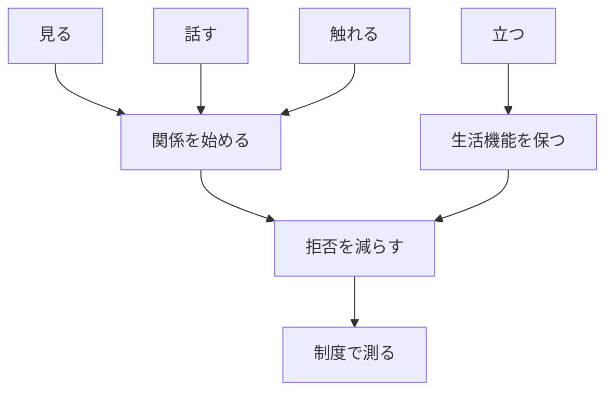

# ユマニチュードを福祉政策に入れる条件

## 1. エグゼクティブサマリー

ユマニチュードは、認知症ケアを「優しく接する」という抽象語で終わらせず、見る、話す、触れる、立つという行為を訓練可能な手順に落とす方法論である。発祥地のフランスでは Humanitude France / International が四つの柱を説明し、日本、ポルトガル、シンガポールでは研修や現場実装の研究が蓄積している。<SourceNote>[Humanitude International, L'Humanitude](https://humanitude-international.com/l-humanitude) と [Humanitude France, L'Humanitude](https://www.humanitude.fr/l-humanitude/) は、三つの関係性の柱と一つのアイデンティティの柱を説明している。</SourceNote>

政策上の焦点は、ユマニチュードを導入するかどうかより、福祉制度が「本人の尊厳を守るケア」を職員研修、勤務設計、権利擁護、家族支援、効果測定まで含めて扱えるかにある。日本の認知症基本法と認知症施策推進基本計画は、本人の声、意思決定支援、地域生活の継続を掲げている。ユマニチュードは、この政策語彙を日々の入浴、移乗、食事、口腔ケア、排泄介助へ翻訳する候補になる。<SourceNote>[厚生労働省, 共生社会の実現を推進するための認知症基本法](https://www.mhlw.go.jp/web/t_doc?dataId=82ab9328&dataType=0&pageNo=1) と [厚生労働省, 認知症施策推進基本計画](https://www.mhlw.go.jp/content/001344090.pdf) に基づく。</SourceNote>

効果研究は、介護拒否、興奮、心理症状、介護者負担、職員の共感や満足度の改善可能性を示している。ただし、研究数は限られ、短期評価、単施設、準実験、前後比較が多い。したがって、国や自治体が採用する場合、標準研修を配るだけでは足りない。拘束、向精神薬、拒否行動、転倒、職員離職、家族苦情、本人の生活参加を同時に測る実装研究として組む必要がある。<SourceNote>Humanitude の効果に関する scoping review は [Giang et al., Journal of Clinical Nursing](https://onlinelibrary.wiley.com/doi/10.1111/jocn.16477)。日本の家族介護者研究は [Kobayashi and Honda, BMC Geriatrics](https://pmc.ncbi.nlm.nih.gov/articles/PMC8296621/)。短期の care refusal 研究は [Journal of Long-Term Care](https://journal.ilpnetwork.org/articles/10.31389/jltc.425) を参照。</SourceNote>

## 2. 考え方: 人格を失わせない技法

ユマニチュードの中核は、ケアを「処置」ではなく、相手に自分が人として扱われていると伝える関係行為として設計する点にある。視線は正面から近づき、声かけは相手が返答しなくても続け、触れるときは広く、ゆっくり、支える。立位や座位を保つ支援は、身体機能だけでなく、自分で生活している感覚を守るための柱になる。<SourceNote>[Humanitude International, Training approach](https://humanitude-international.com/wp-content/uploads/2021/06/training_approche.pdf) と [Humanitude France, équipes soignantes](https://www.humanitude.fr/formation-equipes-soignantes-du-secteur-sanitaire-ou-medico-social/) は、四つの柱、multimodal approach、agitation management を研修内容として示している。</SourceNote>

この方法論は、介護職の善意に依存しない。むしろ、善意だけで行われてきた「声かけ」や「手を添える」行為を、観察、順序、距離、時間、チーム内共有の対象にする。入浴拒否が起きたとき、強く説得するか諦めるかではなく、訪室前の合図、視線の位置、説明の順番、触れる部位、再訪問の約束を変える。この細部が、本人の拒否を「問題行動」とだけ読まない入口になる。

## 3. 現場での実践例

実践は、特別なリハビリ室より、日常の介助場面で起きる。入浴では、職員が背後から近づかず、正面で名乗り、これから行う動作を短く説明し、本人が受け入れやすい順番に変える。口腔ケアでは、口を開けさせる行為の前に、視線、声、手の接触で関係を作る。移乗では、身体を持ち上げるより、本人が立つ動きを残す。ユマニチュードはこのような小さい場面を、ケアの品質として見えるようにする。

ポルトガルの継続ケア単位で行われた実装研究は、職員が Humanitude Care Methodology を学ぶ過程で、ケア手順の実施率、専門職の自己評価、患者への好影響を観察した。研究者は、拒否、興奮、非言語コミュニケーション、尊厳、快適さを現場の変化として記録している。<SourceNote>[Henriques et al., Implementation of the Humanitude Care Methodology](https://pmc.ncbi.nlm.nih.gov/articles/PMC6336364/) は、ポルトガルの Continuing Care Unit での action-research を報告している。</SourceNote>

日本では、家族介護者、医学生、歯科職、医師向けの研修研究がある。家族介護者研究では、6時間の研修と継続的な情報提供の後、介護負担が3か月後に下がった。医師向け研究では、映像とAI分析を使って、認知症患者との急性期コミュニケーションを訓練する試みが行われた。これらは、ユマニチュードが施設介護だけでなく、家族、医療、救急、口腔ケアに広がる可能性を示している。<SourceNote>[Kobayashi and Honda, BMC Geriatrics](https://pmc.ncbi.nlm.nih.gov/articles/PMC8296621/) と [BMJ Open, multimodal comprehensive communication skills training](https://bmjopen.bmj.com/content/13/3/e065477) に基づく。</SourceNote>

## 4. 効果: 期待できることと証明できていないこと

既存研究から期待できる効果は三つある。第一に、本人の拒否、興奮、心理症状が下がる可能性がある。第二に、介護者が「どう接すればよいか」を具体化でき、負担感やバーンアウトが下がる可能性がある。第三に、職員研修が共感やコミュニケーションの短期改善につながる可能性がある。<SourceNote>[Giang et al., Journal of Clinical Nursing](https://onlinelibrary.wiley.com/doi/10.1111/jocn.16477) は、11研究を対象に Humanitude の効果を整理した。医学生の共感研究は [BMC Medical Education](https://pmc.ncbi.nlm.nih.gov/articles/PMC8176710/) を参照。</SourceNote>

証明できていないことも明確である。長期にわたって拘束、向精神薬、入院、転倒、離職率、介護費をどれだけ下げるかは、国際比較できるほどそろっていない。2025年の care refusal 研究も、短期の前後比較であり、著者自身が対照群なし、短期追跡という限界を示している。ユマニチュードを政策に入れるなら、効果を「よいケアらしい」という印象で語らず、本人・家族・職員・財政の四つの指標で測る必要がある。<SourceNote>[Journal of Long-Term Care, Effectiveness of Humanitude Training on Care Refusal in Dementia](https://journal.ilpnetwork.org/articles/10.31389/jltc.425) は即時効果を示す一方で、対照群と長期追跡の制約を明記している。</SourceNote>

## 5. 各国の福祉事情と政策原典

| 国・地域 | 福祉事情 | 政策原典から見える導入条件 |
| --- | --- | --- |
| WHO | 認知症を医療だけでなく公衆衛生、介護者支援、権利、地域社会の課題として扱う。 | 加盟国は認知症の人と介護者の生活改善を目標に、意識啓発、診断、介護者支援、情報システム、研究を進める。 |
| 日本 | 介護保険、地域包括ケア、認知症基本法があり、本人参画と意思決定支援を政策化した。 | ユマニチュードは、本人の声を起点にする基本計画を、日常介助の手順へ落とす研修として位置づけられる。 |
| フランス | 発祥地だが、国の神経変性疾患戦略は予防、診断、在宅、施設、研究を幅広く扱う。 | 方法論単体より、在宅強化、複雑事例、施設ニーズ、介護者支援の中で使う必要がある。 |
| ポルトガル | 継続ケア網と地域計画を通じて、医療・介護・家族支援を接続しようとしている。 | 地域別計画、研修、評価、権利を制度に入れる設計と相性がよい。 |
| 英国 | NICE が本人中心ケア、職員研修、介護者支援をガイドライン化している。 | Humanitude 名でなくても、本人の価値、個別の希望、家族支援を現場監査に入れる余地がある。 |
| シンガポール | 国家認知症戦略、地域支援、AIC、DementiaHub、デジタル支援が連動する。 | 小規模で統合された制度では、研修、地域資源、家族向け教材を同じ導線に乗せやすい。 |

WHO の行動計画は、認知症を単なる高齢者医療ではなく、社会、介護者、情報、研究を含む公衆衛生課題として扱う。OECD も、長期ケアでは家族介護者の負担、地域ケア、医療と介護の連携が制度上の弱点になりやすいと整理している。<SourceNote>[WHO, Global action plan on the public health response to dementia 2017-2025](https://www.who.int/publications/i/item/global-action-plan-on-the-public-health-response-to-dementia-2017---2025) と [OECD, Ageing and long-term care](https://www.oecd.org/en/topics/sub-issues/ageing-and-long-term-care.html) に基づく。</SourceNote>

フランスの `Stratégie nationale Maladies Neurodégénératives 2025-2030` は、1.4 million 人のアルツハイマー病・神経認知症、225,000 の新規症例、2050年に向けた増加見通しを示し、6軸37施策で、見方を変える、早く見つける、介護者を支える、在宅を強める、施設の複雑ニーズに応える、研究を支えると整理している。<SourceNote>[Ministère de la Santé, Stratégie nationale Maladies Neurodégénératives 2025-2030](https://sante.gouv.fr/soins-et-maladies/maladies/maladies-neurodegeneratives/article/la-strategie-nationale-maladies-neurodegeneratives-2025-2030) に基づく。</SourceNote>

ポルトガルは、2018年の `Despacho n.º 5988/2018` で認知症領域の健康戦略を承認し、地域計画、生活の質、研究、権利、研修、継続評価を求めた。2026年には、国家認知症保健計画のガバナンスを更新した。ここでは、方法論の導入だけでなく、地域計画と実施責任をどう結びつけるかが問われる。<SourceNote>[Diário da República, Despacho n.º 5988/2018](https://diariodarepublica.pt/dr/detalhe/despacho/5988-2018-115533450) と [Despacho n.º 4762/2026](https://dre.pt/web/guest/pesquisa/-/search/1084035742/details/maximized) に基づく。</SourceNote>

英国の NICE NG97 は、認知症の人と家族・介護者の価値、個別性、権利、希望を重視する本人中心ケアを推奨している。シンガポールでは、MOH が National Dementia Strategy を2009年に策定し2017年に更新したと説明し、DementiaHub は Humanitude の四つの柱を介護者向けに解説している。<SourceNote>[NICE NG97, Person-centred care](https://www.nice.org.uk/guidance/ng97/chapter/Person-centred-care)、[Singapore MOH, Dementia plans and subsidy support](https://www.moh.gov.sg/newsroom/dementia-plans-and-subsidy-support-for-dementia-care/)、[DementiaHub.SG, Understanding the Four Pillars of Humanitude](https://www.dementiahub.sg/living-well-with-dementia/understanding-the-four-pillars-of-humanitude/) に基づく。</SourceNote>

## 6. 日本で導入するなら何が問われるか

日本では、認知症基本法と基本計画がすでに方向を定めている。本人が尊厳を持って希望ある生活を続けること、本人の声を起点にすること、意思決定支援を整えること、地域生活を続けることが中心である。ユマニチュードは、この理念を現場技法に変える候補だが、制度が支えなければ、研修を受けた一部職員の属人的スキルで終わる。<SourceNote>[厚生労働省, 認知症施策推進基本計画の概要](https://www.mhlw.go.jp/content/001344088.pdf) は、「新しい認知症観」、本人の声、意思決定支援、地域での安心な暮らしを重点目標に置く。</SourceNote>

導入時に問われる条件は六つある。

1. 職員研修を単発講義にしない。
1. 入浴、排泄、移乗、食事、口腔ケアの手順に落とす。
1. 拒否や興奮を、本人の意思表示として記録する。
1. 家族介護者にも同じ言葉で説明する。
1. 拘束、向精神薬、救急搬送、転倒、離職、苦情を評価指標に入れる。
1. 本人参加と意思決定支援を研修評価に入れる。

自治体が導入する場合、介護保険事業計画、認知症施策推進計画、地域包括支援センター、認知症カフェ、本人ミーティング、家族支援を分けて扱わない方がよい。本人の生活を支える接点に同じ方法論が入らなければ、施設では丁寧でも在宅では家族が孤立する、医療機関では説明が通じるがデイサービスでは拒否が増える、という分断が残る。

## 7. これからの福祉での論点

第一の論点は、人手不足下で尊厳あるケアをどう標準化するかである。ユマニチュードは、職員の負担を増やす「追加の優しさ」として入れると失敗しやすい。勤務表、ケア記録、申し送り、研修時間、管理者評価に組み込む必要がある。

第二の論点は、本人中心ケアを権利擁護で終わらせないことだ。本人の意思を尊重するなら、拒否を減らすための技術、拒否を受け止める時間、別の時間に再訪する裁量が必要になる。制度がそれを認めないと、現場は理念と作業量の板挟みになる。

第三の論点は、効果測定である。導入施設は、研修前後で care refusal、BPSD、身体拘束、向精神薬、転倒、食事摂取、口腔ケア拒否、職員離職、家族満足、本人の活動参加を追うべきである。研究費がなくても、同じ指標を1年単位で測れば、自治体は導入の成否を説明しやすくなる。

## 8. 参考情報

- [Humanitude International, L'Humanitude](https://humanitude-international.com/l-humanitude)
- [Humanitude France, L'Humanitude](https://www.humanitude.fr/l-humanitude/)
- [WHO, Global action plan on the public health response to dementia 2017-2025](https://www.who.int/publications/i/item/global-action-plan-on-the-public-health-response-to-dementia-2017---2025)
- [厚生労働省, 共生社会の実現を推進するための認知症基本法](https://www.mhlw.go.jp/web/t_doc?dataId=82ab9328&dataType=0&pageNo=1)
- [厚生労働省, 認知症施策推進基本計画](https://www.mhlw.go.jp/content/001344090.pdf)
- [Ministère de la Santé, Stratégie nationale Maladies Neurodégénératives 2025-2030](https://sante.gouv.fr/soins-et-maladies/maladies/maladies-neurodegeneratives/article/la-strategie-nationale-maladies-neurodegeneratives-2025-2030)
- [Diário da República, Despacho n.º 5988/2018](https://diariodarepublica.pt/dr/detalhe/despacho/5988-2018-115533450)
- [NICE NG97, Person-centred care](https://www.nice.org.uk/guidance/ng97/chapter/Person-centred-care)
- [Singapore MOH, Dementia plans and subsidy support](https://www.moh.gov.sg/newsroom/dementia-plans-and-subsidy-support-for-dementia-care/)
- [DementiaHub.SG, Understanding the Four Pillars of Humanitude](https://www.dementiahub.sg/living-well-with-dementia/understanding-the-four-pillars-of-humanitude/)
- [Giang et al., Effects of Humanitude care on people with dementia and caregivers](https://onlinelibrary.wiley.com/doi/10.1111/jocn.16477)
- [Kobayashi and Honda, The effect of a multimodal comprehensive care methodology for family caregivers](https://pmc.ncbi.nlm.nih.gov/articles/PMC8296621/)
- [Henriques et al., Implementation of the Humanitude Care Methodology](https://pmc.ncbi.nlm.nih.gov/articles/PMC6336364/)
