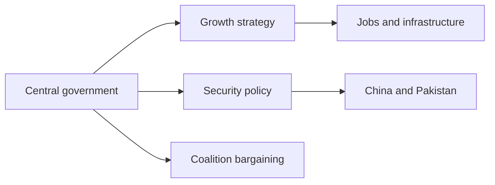
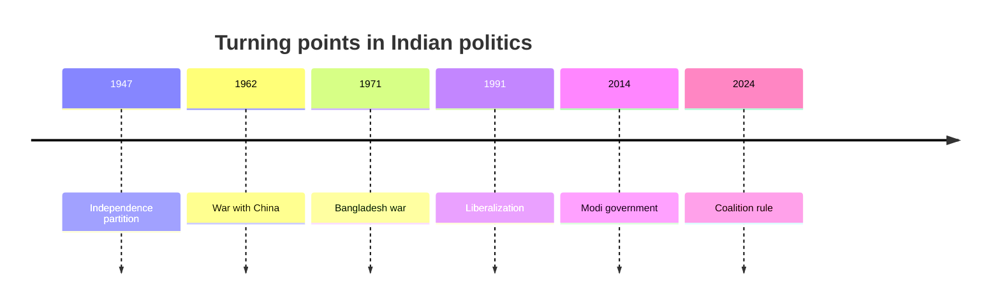

# India Geopolitical Profile 2026

## 1. Executive Summary

India combines population scale, a growing economy, nuclear deterrence, Indian Ocean geography, and Global South diplomacy. India news needs one map that includes security cooperation with the United States, defense and energy ties with Russia, border management with China, and India’s claim to speak for developing countries. <SourceNote>[IMF India country page](https://www.imf.org/en/countries/ind), [The Wilmington Declaration](https://www.mea.gov.in/bilateral-documents.htm?dtl/38320/=), and [India-Russia 23rd Annual Summit joint statement](https://www.mea.gov.in/bilateral-documents.htm?dtl/40410/).</SourceNote>

In the 2024 general election, the BJP lost its single-party majority and kept power through the NDA coalition. This did not erase Prime Minister Narendra Modi’s authority, but it brought state parties, coalition partners, and local interests back into national politics. <SourceNote>[Election Commission of India, General Elections](https://www.eci.gov.in/general-elections) and [Results of the 2024 Indian general election](https://en.wikipedia.org/wiki/Results_of_the_2024_Indian_general_election) show 293 seats for the NDA and 240 seats for the BJP.</SourceNote>

## 2. History and Political System

Modern Indian politics rests on independence and partition in 1947, the 1962 war with China, the 1971 war with Pakistan, the 1991 liberalization, long BJP rule after 2014, and coalition rule after 2024. India is a parliamentary republic, and federalism gives state politics real leverage over national choices.

The BJP linked Hindu nationalism with a growth-state narrative. It offers global status and infrastructure to urban middle classes, welfare and religious mobilization to rural voters, and a large market under state-led investment to firms. Pressure on minorities, media, and NGOs has weakened international democracy assessments. Freedom House rated India Partly Free in 2026 and highlighted pressure on expression, religion, and critics. <SourceNote>[Freedom House, India: Freedom in the World 2026](https://freedomhouse.org/country/india/freedom-world/2026)</SourceNote>

## 3. Security Triangle

India’s security politics turns on China, Pakistan, and the Indian Ocean. Along the China border, militarization and negotiation have moved together since the 2020 Galwan clash. The Indian government said in October 2024 that India and China reached patrolling arrangements along the Line of Actual Control, including Depsang and Demchok, but the border dispute remains. <SourceNote>[Ministry of External Affairs, Rajya Sabha answer on recent border agreements with China](https://www.mea.gov.in/rajya-sabha.htm?dtl/38689/QUESTION+NO+1199+RECENTLY+SIGNED+BORDER+AGREEMENTS+WITH+CHINA=)</SourceNote>

With Pakistan, Kashmir, cross-border terrorism, and nuclear deterrence remain the core issues. Crises may stay short, but domestic politics narrows space for restraint. SIPRI’s 2025 yearbook release warned of rising nuclear risks and noted that India-Pakistan tensions briefly spilled into armed conflict. <SourceNote>[SIPRI, Nuclear risks grow as new arms race looms](https://www.sipri.org/media/press-release/2025/nuclear-risks-grow-new-arms-race-looms-new-sipri-yearbook-out-now)</SourceNote>

## 4. Quad, Russia, and the Global South

India uses the Quad as a framework for China balancing, maritime security, technology, and infrastructure cooperation. The 2024 Wilmington Declaration emphasized health security, infrastructure, connectivity, maritime security, and digital public infrastructure. <SourceNote>[The Wilmington Declaration](https://www.mea.gov.in/bilateral-documents.htm?dtl/38320/=) and [Japan MOFA, Quad Leaders' Meeting](https://www.mofa.go.jp/fp/nsp/page1e_000691_00001.html)</SourceNote>

India also preserves its Russia relationship. Russia remains relevant for defense equipment, energy, UN diplomacy, and BRICS. The 2025 India-Russia joint statement reaffirmed the Special and Privileged Strategic Partnership. <SourceNote>[Ministry of External Affairs, Joint Statement following the 23rd India-Russia Annual Summit](https://www.mea.gov.in/bilateral-documents.htm?dtl/40410/)</SourceNote>

This duality gives India bargaining room. India does not place itself as a U.S. ally, a Chinese dependent, or a Russian satellite. It uses multiple great-power relationships to widen industrial, security, and diplomatic options.

## 5. Economy, Population, and Civil Society

India’s economy gives weight to its foreign policy. The IMF projects 6.5% real GDP growth in 2026, and the World Bank reports 6.5% growth in FY24-25. <SourceNote>[IMF India country page](https://www.imf.org/en/countries/ind) and [World Bank Group, India](https://www.worldbank.org/ext/en/country/india)</SourceNote>

Population scale is an advantage, but it does not deliver a dividend by itself. A young country needs education, jobs, urban infrastructure, courts, and security. Without them, demography can also produce frustration. India should be read through state-level employment, religious conflict, language, caste, and urban-rural differences, not GDP alone.

## 6. Reading India from Japan and East Asia

For Japan, India is both a partner for China balancing and a bargaining counterpart that will not fully accept a U.S.-led hierarchy. Cooperation has room to grow in Indian Ocean sea lanes, digital talent, supply chains, infrastructure, and international institution reform. Friction remains over Russia sanctions, democracy, rights, migration, and religious minority issues.

Three questions make India news easier to read. Can the coalition government still deliver domestic reform? Can crisis management hold on the China and Pakistan fronts? How does India use the Quad, BRICS, and Russia ties at the same time? Those questions connect India as a growth market with India as an autonomous great power.
