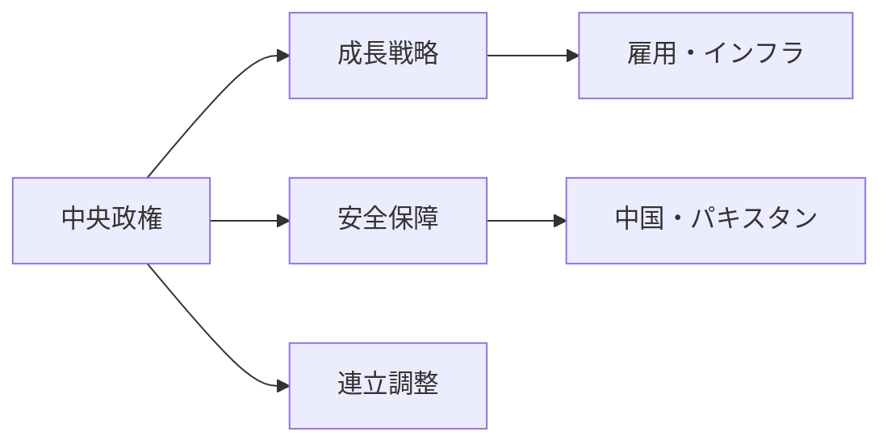
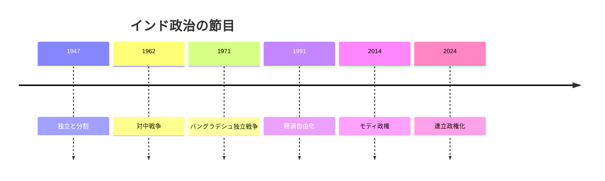

# インドの国際政治プロファイル 2026年版

## 1. エグゼクティブサマリー

インドは、人口規模、成長経済、核抑止、インド洋の地理、グローバルサウス外交を同時に持つ。ニュースを読むときは、米国との安全保障協力、ロシアとの防衛・エネルギー関係、中国との国境管理、途上国代表としての発言力を同じ地図に置く必要がある。<SourceNote>[IMF India country page](https://www.imf.org/en/countries/ind)、[The Wilmington Declaration](https://www.mea.gov.in/bilateral-documents.htm?dtl/38320/=)、[India-Russia 23rd Annual Summit joint statement](https://www.mea.gov.in/bilateral-documents.htm?dtl/40410/) を参照した。</SourceNote>

2024年総選挙で、BJPは単独過半数を失い、NDA連立で政権を維持した。これはモディ首相の権威消失ではなく、州政党、連立相手、地方利害が中央政治へ戻ったことを意味する。<SourceNote>[Election Commission of India, General Elections](https://www.eci.gov.in/general-elections)、[Results of the 2024 Indian general election](https://en.wikipedia.org/wiki/Results_of_the_2024_Indian_general_election) は、NDA 293議席、BJP 240議席という結果を示す。</SourceNote>

## 2. 歴史と政治体制

現代インド政治の記憶は、1947年の独立と分割、1962年の対中戦争、1971年の対パキスタン戦争、1991年の経済自由化、2014年以降のBJP長期政権、2024年の連立化で組み立てられている。国家は議会制共和国で、連邦制と州政治が中央政治を制約する。

BJPはヒンドゥー・ナショナリズムと成長国家の物語を結びつけた。都市中間層には国際的地位とインフラを、地方部には福祉、補助金、宗教的動員を、企業には市場規模と国家主導投資を提示する。一方で、少数派、報道機関、NGOへの圧力は国際的な民主主義評価を下げている。Freedom Houseは2026年版でインドを Partly Free とし、表現、宗教、批判者への圧力を問題にしている。<SourceNote>[Freedom House, India: Freedom in the World 2026](https://freedomhouse.org/country/india/freedom-world/2026)</SourceNote>

## 3. 安全保障の三角形

インドの安全保障は、中国、パキスタン、インド洋の三角形で動く。中国との国境では2020年のガルワン衝突以後、軍事化と交渉が並行した。インド政府は2024年10月、デプサンとデムチョクを含む実効支配線沿いで巡回取り決めに合意したと説明したが、国境問題は残っている。<SourceNote>[Ministry of External Affairs, Rajya Sabha answer on recent border agreements with China](https://www.mea.gov.in/rajya-sabha.htm?dtl/38689/QUESTION+NO+1199+RECENTLY+SIGNED+BORDER+AGREEMENTS+WITH+CHINA=)</SourceNote>

パキスタンとの関係では、カシミール、越境テロ、核抑止が基本線である。軍事危機は短期化しても、国内政治が強硬姿勢を求めるため、危機管理の余地は狭い。SIPRIは2025年版で核リスクの増大を指摘し、インドとパキスタンの緊張が一時的に武力衝突へ広がったことにも触れている。<SourceNote>[SIPRI, Nuclear risks grow as new arms race looms](https://www.sipri.org/media/press-release/2025/nuclear-risks-grow-new-arms-race-looms-new-sipri-yearbook-out-now)</SourceNote>

## 4. クアッド、ロシア、グローバルサウス

インドはクアッドを、対中均衡、海洋安全保障、技術・インフラ協力の枠組みとして使う。2024年のWilmington Declarationは、保健安全保障、インフラ、連結性、海洋安全保障、デジタル公共インフラを掲げた。<SourceNote>[The Wilmington Declaration](https://www.mea.gov.in/bilateral-documents.htm?dtl/38320/=)、[Japan MOFA, Quad Leaders' Meeting](https://www.mofa.go.jp/fp/nsp/page1e_000691_00001.html)</SourceNote>

同時に、インドはロシア関係を維持する。ロシアは、防衛装備、エネルギー、国連外交、BRICSでなお重要である。2025年の印露共同声明は、両国の Special and Privileged Strategic Partnership を再確認した。<SourceNote>[Ministry of External Affairs, Joint Statement following the 23rd India-Russia Annual Summit](https://www.mea.gov.in/bilateral-documents.htm?dtl/40410/)</SourceNote>

この二重性は、交渉余地を広げるための設計である。インドは米国の同盟国、中国への従属国、ロシアの衛星国のどれにも自らを置かない。複数の大国関係を使い、産業、安全保障、外交の選択肢を広げる。

## 5. 経済、人口、市民社会

インド経済は大国政治の基盤である。IMFは2026年の実質GDP成長率を6.5%と見込み、World BankはFY24-25の成長率を6.5%と整理している。<SourceNote>[IMF India country page](https://www.imf.org/en/countries/ind)、[World Bank Group, India](https://www.worldbank.org/ext/en/country/india)</SourceNote>

人口規模は強みだが、自動的な配当ではない。若い国には教育、雇用、都市インフラ、司法、治安が必要であり、これらが不足すると人口構成は不満の源泉にもなる。インドを読むときは、GDPだけでなく、州別雇用、宗教対立、言語、カースト、都市と農村の差を合わせて見る必要がある。

## 6. 日本と東アジアからの読み方

日本にとってインドは、中国抑止の相手であると同時に、米国主導秩序へ全面的には乗らない交渉相手である。インド洋シーレーン、デジタル人材、サプライチェーン、インフラ、国際機関改革では協力の余地が大きい。ロシア制裁、民主主義、人権、移民、宗教的少数派をめぐって摩擦も残る。

インド関連記事では、三つの問いを置くと読みやすい。連立政権は国内改革を進められるか。中国・パキスタン正面で危機管理を保てるか。インドはクアッド、BRICS、ロシア関係を同時にどう使うか。この三点が、成長市場としてのインドと自律的大国としてのインドをつなぐ。
