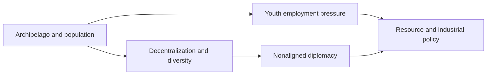
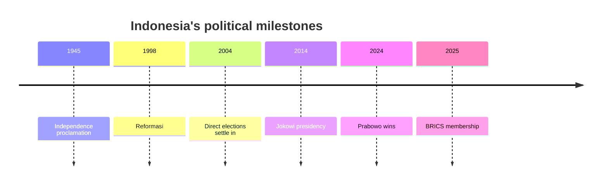

# Indonesia Between Sea Lanes and Minerals

## 1. Executive Summary

Indonesia is an archipelagic state with ASEAN's largest economy and population, where sea lanes, resources, religion, and multiethnic society all sit inside one political space. <SourceNote>[BPS-Statistics Indonesia](https://www.bps.go.id/en/) says the country's 2024 population was 281.6 million, and [World Bank](https://www.worldbank.org/ext/en/country/indonesia) describes Indonesia as ASEAN's largest economy.</SourceNote>

Prabowo's government is trying to handle growth, security, and strategic autonomy at the same time, while treating nickel, the capital move, China, and the United States as one strategic set. <SourceNote>[Presiden RI](https://presidenri.go.id/) currently foregrounds BRICS, forest-fire response, and national projects, while [Kemlu](https://www.kemlu.go.id/berita/siaran-pers/Pages/berita/menlu-sugiono-pada-jakarta-geopolitical-forum-multilateralisme-tidak-bisa-berjalan-autopilot?type=publication) describes bebas aktif as diplomacy that builds bridges instead of joining blocks.</SourceNote>

When you read Indonesia, the key question is not only whether it is a democratic success story, but whether scale can be converted into institutions and jobs.

This diagram shows that Indonesia's external posture is pulled by domestic population pressure and industrial policy. <SourceNote>The structure follows [BPS-Statistics Indonesia](https://www.bps.go.id/en/) and [Kemlu](https://www.kemlu.go.id/berita/siaran-pers/Pages/berita/menlu-sugiono-pada-jakarta-geopolitical-forum-multilateralisme-tidak-bisa-berjalan-autopilot?type=publication); the policy coupling is a public-information inference.</SourceNote>

## 2. History and State Formation

Modern Indonesian political memory is made of the 1945 independence proclamation, the Suharto era, the 1998 Reformasi, and decentralization. <SourceNote>[Sekretariat Negara](https://www.setneg.go.id/baca/index/the_government_statement_on_the_regional_development_policy_22_august_2008) explains decentralization and autonomy as part of reform, and [World Bank](https://documents1.worldbank.org/curated/en/335371468050337376/pdf/32326.pdf) shows how decentralization after 1998 weakened the old centralized order.</SourceNote>

Reformasi kept a strong presidency, but expanded local elections, local finance, civil society, and media space.

The center has weakened, but it has not disappeared, and the balance between Jakarta and the regions is still being renegotiated.

For that reason, Indonesia is both a democratic success story and an unfinished state-building project.

This timeline shows state change moving through independence, authoritarian rule, decentralization, electoral competition, and recent re-centralization. <SourceNote>The outline follows [Sekretariat Negara](https://www.setneg.go.id/baca/index/the_government_statement_on_the_regional_development_policy_22_august_2008) and [Freedom House](https://freedomhouse.org/country/indonesia/freedom-world/2026); the political meaning of each milestone is a public-information inference.</SourceNote>

## 3. Institutions and Power

Indonesia has a directly elected presidential system, and in the February 2024 election Prabowo Subianto and Gibran Rakabuming Raka won and took office in October. <SourceNote>[KPU](https://www.kpu.go.id/dmdocument/1759822082Lembar%20Fakta%20KPU%20edisi%201%20OKE.pdf) shows the Prabowo-Gibran ticket winning 96.21 million votes, and [Presiden RI](https://presidenri.go.id/siaran-pers/prabowo-subianto-dan-gibran-rakabuming-raka-resmi-dilantik-sebagai-presiden-dan-wakil-presiden-ri/) confirms their October 2024 inauguration.</SourceNote>

In institutional terms, the country is democratic, but Freedom House still rates it Partly Free in 2026 and points to systemic corruption, conflict in Papua, and the politicized use of defamation and blasphemy laws. <SourceNote>[Freedom House](https://freedomhouse.org/country/indonesia/freedom-world/2026)</SourceNote>

Elections are regular, but policy does not move all at once when someone wins. Ruling coalitions, parliament, ministries, local governments, religious organizations, and civil society all act as veto points.

| Actor | Role |
| --- | --- |
| Presidency | Sets priorities and personnel |
| DPR and coalition parties | Pass bills and budgets |
| TNI and police | Handle security and order |
| Local governments | Run education, health, transport, and permits |
| Courts and KPK | Draw the line on corruption |
| Media and civil society | Watch legitimacy |

Decentralization means that local politics is not a mere annex to national politics. Budgets, land, mining, schools, hospitals, and permits can all stall or move at the local level, and that changes how national power looks. <SourceNote>[Sekretariat Negara](https://www.setneg.go.id/baca/index/the_government_statement_on_the_regional_development_policy_22_august_2008) treats decentralization as part of reform, and [World Bank](https://documents1.worldbank.org/curated/en/335371468050337376/pdf/32326.pdf) explains how local transfer changed the governing style of the center.</SourceNote>

## 4. ASEAN and Sea Lanes

Indonesia's diplomacy prefers to keep room for manoeuvre rather than become someone else's forward base. <SourceNote>[Kemlu](https://www.kemlu.go.id/berita/siaran-pers/Pages/berita/menlu-sugiono-pada-jakarta-geopolitical-forum-multilateralisme-tidak-bisa-berjalan-autopilot?type=publication) says bebas aktif means not being pulled into exclusive blocs while still building bridges.</SourceNote>

ASEAN's Secretariat is in Jakarta, and Indonesia is one of ASEAN's founding members. <SourceNote>[ASEAN](https://asean.org/agreement-on-the-establishment-of-the-asean-secretariat-bali-24-february-1976/) places the Secretariat in Jakarta, and [ASEAN](https://asean.org/about-asean/) lists Indonesia among the founding members in 1967.</SourceNote>

So ASEAN centrality is not an abstract slogan. It has a geographic home in Indonesia.

In the South China Sea, Indonesia is not a claimant state, but its EEZ in northern Natuna overlaps with China's nine-dash line claim. <SourceNote>[Kemhan](https://www.kemhan.go.id/pothan/2025/09/03/analisis-dampak-konflik-di-laut-china-selatan-terhadap-pertahanan-negara-ditinjau-dari-perspektif-direktorat-jenderal-potensi-pertahanan.html) says Indonesia is not a claimant in the South China Sea, but that the northern Natuna EEZ often overlaps with China's nine-dash line.</SourceNote>

That makes maritime sovereignty a live issue even when Jakarta avoids formal alignment.

Japan's Foreign Ministry treats Indonesia as pivotal to Indo-Pacific stability and as a country facing important sea lanes. <SourceNote>[MFA Japan](https://www.mofa.go.jp/region/asia-paci/indonesia/) and [MFA Japan](https://www.mofa.go.jp/press/release/pressite_000001_02465.html) frame Indonesia as important to Indo-Pacific stability and maritime security cooperation.</SourceNote>

| Counterpart | Issue | Reading |
| --- | --- | --- |
| ASEAN | Centrality and coordination | The base layer |
| China | Natuna, trade, investment | Competition and dependence together |
| United States and Japan | Sea lanes and deterrence | Security and supply-chain partners |
| India and the Gulf | Resources, investment, alternatives | Diversification options |

The point of this table is that Indonesia does not lean cleanly toward any one side. <SourceNote>[Kemlu](https://www.kemlu.go.id/berita/siaran-pers/Pages/berita/menlu-sugiono-pada-jakarta-geopolitical-forum-multilateralisme-tidak-bisa-berjalan-autopilot?type=publication) and [OECD](https://www.oecd.org/en/countries/indonesia.html) show Indonesia trying to widen its strategic room through both BRICS and OECD pathways.</SourceNote>

## 5. A Resource State and Industrial Policy

Indonesia is a major global supplier of nickel ore, and its current industrial policy is centered on downstreaming rather than raw-material exports. <SourceNote>[IMF](https://www.imf.org/en/countries/idn) says Indonesia accounted for roughly 60 percent of global nickel production in 2024, and [ESDM](https://esdm.go.id/en/media-center/news-archives/-nickel-downstreaming-an-obligation) frames nickel downstreaming as an obligation.</SourceNote>

The government is tying this to EV batteries, smelters, mineral processing, and export competitiveness. <SourceNote>[ESDM](https://esdm.go.id/en/media-center/news-archives/kementerian-esdm-belum-putuskan-besaran-rkab-nikel-2026) and [ESDM](https://esdm.go.id/en/media-center/news-archives/jalankan-program-hilirisasi-menteri-bahlil-saksikan-kesepakatan-konsorsium-untuk-ekosistem-baterai-terintegrasi) still treat nickel supply management and an integrated battery ecosystem as core policy tasks in 2026.</SourceNote>

But downstreaming does not automatically create large numbers of high-value jobs. Because smelting is capital-intensive, it may leave wages and tax revenue in the regions without broadening employment enough. That is an inference from public information, but it is the right pressure point.

Nusantara, the capital relocation project, is not just symbolic either. The IKN authority is pushing construction for its second phase, targeting political-capital functions by 2028 and treating the move of central-government functions as a long-term project through 2045. <SourceNote>[IKN](https://ikn.go.id/id/posts/pembangunan-tahap-ii-ikn-terus-berjalan-otorita-ikn-lakukan-evaluasi-berkala) and [IKN](https://ikn.go.id/en/posts/dipa-otorita-ikn-2026-sebesar-rp6-triliun-kepala-otora-ikn-lantik-pejabat-perbendaharaan) show the 2028 political-capital target and the 2026 budget allocation.</SourceNote>

Climate and forests are not a side file. UNFCCC lists Indonesia's Second NDC from 2025, and ASEAN says more than 70 percent of Southeast Asia's peatlands are in Indonesia. <SourceNote>[UNFCCC](https://unfccc.int/NDCREG?field_document_ca_target_id=176) and [ASEAN](https://asean.org/overview/) together show why forests, peatlands, and haze belong in regional-security discussions.</SourceNote>

Forest fires, haze, and land-use monitoring are therefore environmental policy and neighborhood-risk management at the same time.

## 6. Society and Daily Life

Indonesia is Muslim-majority, but it is not a single-religion state. Pew says about 87 percent of the population is Muslim, and the state officially recognizes six religions. <SourceNote>[Pew Research Center](https://www.pewresearch.org/short-reads/2024/03/28/5-facts-about-muslims-and-christians-in-indonesia/) and [U.S. State Department](https://www.state.gov/reports/2023-report-on-international-religious-freedom/indonesia/) cover that frame.</SourceNote>

The World Bank describes the country as a diverse archipelago with more than 300 ethnic groups. <SourceNote>[World Bank](https://www.worldbank.org/ext/en/country/indonesia)</SourceNote>

So it is a mistake to flatten religion, ethnicity, urban and rural life, or Java and the outer islands. Political disputes often attach to the distribution of everyday life and to feelings of dignity, not to faith alone.

The labor market shows why population size is not an automatic advantage. BPS says the labor force was 154.91 million in February 2026, unemployment was 4.68 percent, and underemployment was 7.91 percent in 2025. <SourceNote>[BPS-Statistics Indonesia](https://www.bps.go.id/en/pressrelease/2026/05/05/2574/unemployment-rate-was-4-68-percent-and-the-average-wage-of-employees-was-3-29-million-rupiah-.html) and [BPS-Statistics Indonesia](https://www.bps.go.id/en/statistics-table/2/MTE4MSMy/tingkat-setengah-pengangguran-) provide the labor picture.</SourceNote>

So the youth question is both a demographic dividend and an employment bottleneck. If job quality does not keep up, migration to cities, informal work, and regional stagnation can all rise together.

Freedom House's references to Papua, corruption, online space, and the use of defamation and blasphemy laws show that civil liberties are still not settled. <SourceNote>[Freedom House](https://freedomhouse.org/country/indonesia/freedom-world/2026) and [Freedom House](https://freedomhouse.org/country/indonesia/freedom-net/2025) make that pressure visible.</SourceNote>

## 7. What It Means for Japan and East Asia

For Japan, Indonesia is not a distant emerging market, but a partner where sea lanes, energy, resources, manufacturing, and security overlap. <SourceNote>[MFA Japan](https://www.mofa.go.jp/region/asia-paci/indonesia/) says Japan and Indonesia's 2026 EPA amendment entered into force, and [MFA Japan](https://www.mofa.go.jp/press/release/pressite_000001_02465.html) places Indonesia inside Japan's Indo-Pacific stability agenda.</SourceNote>

The relationship does not end with trade. Japan has to watch nickel, batteries, ports, sea lanes, and supply chains together.

For Japanese companies, local sourcing, local-content rules, regulatory change, and political risk are too slow when they are handled separately. As downstreaming advances, investment decisions become a bundle of smelting, batteries, electricity, logistics, and political bargaining rather than a mining story alone.

From East Asia's security perspective, Indonesia is more than the center of ASEAN. It is a coordination point for managing tension with China, practical cooperation with the United States, and economic-security ties with Japan. <SourceNote>[MFA Japan](https://www.mofa.go.jp/region/asia-paci/indonesia/) and [ASEAN](https://asean.org/) strengthen that reading.</SourceNote>

## 8. Monitoring Points and Limits

Five watchpoints are enough.

Whether Prabowo's coalition can support both growth and security, whether downstreaming reaches jobs and regional distribution, whether Nusantara keeps pace with the 2028 target, whether Natuna and South China Sea pressure rises, and whether the demographic dividend slips into an employment bottleneck.

The public-information inference is that Indonesia's real question is not alignment versus nonalignment.

It is whether the country can turn scale into institutions, jobs, and strategic autonomy without drifting toward heavier oligarchy or sharper coercion.

That balance will shape how Indonesia reads in every future news cycle.
