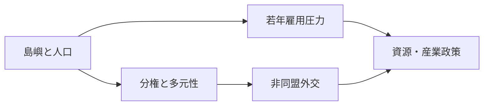
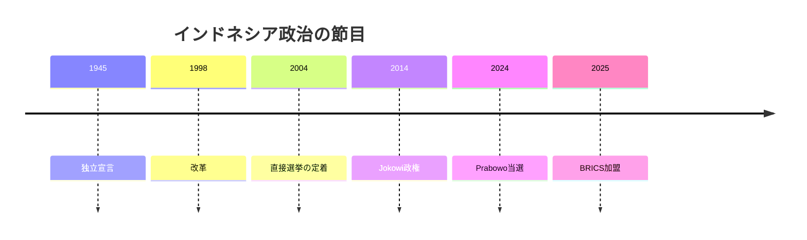

# 海路と鉱物の上に立つ、非同盟のインドネシア

## 1. エグゼクティブサマリー

インドネシアは、ASEAN最大の経済と人口を抱える群島国家であり、海上交通、資源、宗教、多民族社会が一つの政治空間に重なっている。<SourceNote>[BPS-Statistics Indonesia](https://www.bps.go.id/en/) の人口推計は 2024年の人口が 2億8160万人であることを示し、[World Bank](https://www.worldbank.org/ext/en/country/indonesia) はインドネシアを ASEAN 最大の経済として説明している。</SourceNote>

プラボウォ政権は、成長、治安、外交上の自立を同時に追いながら、ニッケル、首都移転、対中関係、対米関係を一本の線で扱おうとしている。<SourceNote>[Presiden RI](https://presidenri.go.id/) の現在の掲示は BRICS、森林火災対策、国家プロジェクトを並べ、[Kemlu](https://www.kemlu.go.id/berita/siaran-pers/Pages/berita/menlu-sugiono-pada-jakarta-geopolitical-forum-multilateralisme-tidak-bisa-berjalan-autopilot?type=publication) は bebas aktif を「ブロックに縛られず、橋をかける外交」と説明している。</SourceNote>

この国を見るときは、民主化の成功例かどうかだけでなく、巨大な人口と鉱物資源を制度と雇用に変えられるかを読むほうがよい。

この図は、インドネシアの対外行動が国内の人口圧力と産業政策に引っ張られていることを示している。<SourceNote>[BPS-Statistics Indonesia](https://www.bps.go.id/en/) と [Kemlu](https://www.kemlu.go.id/berita/siaran-pers/Pages/berita/menlu-sugiono-pada-jakarta-geopolitical-forum-multilateralisme-tidak-bisa-berjalan-autopilot?type=publication) を踏まえた構図であり、政策の連動は公表情報からの推定である。</SourceNote>

## 2. 歴史と国家形成

現代インドネシアの政治記憶は、1945年の独立宣言、スハルトの長期統治、1998年の改革、地方分権化でできている。<SourceNote>[Sekretariat Negara](https://www.setneg.go.id/baca/index/the_government_statement_on_the_regional_development_policy_22_august_2008) は、改革の一面として地方分権と自治が進んだことを説明し、[World Bank](https://documents1.worldbank.org/curated/en/335371468050337376/pdf/32326.pdf) は 1998 年以後の分権化が中央集権体制を崩したことを整理している。</SourceNote>

改革は、強い大統領制を残したまま、地方選挙、地方財政、市民社会、メディア空間を広げた。

その結果、中央権力は弱まったが消えたわけではなく、首都ジャカルタと地方の力関係は今も組み替えが続いている。

この歴史のため、インドネシアは民主化の成功例であると同時に、統治の未完を抱える国でもある。

この年表は、体制の変化が独立、権威主義、地方分権、選挙競争、再中央集権の引き合いで進んだことを示している。<SourceNote>年表の骨格は [Sekretariat Negara](https://www.setneg.go.id/baca/index/the_government_statement_on_the_regional_development_policy_22_august_2008) と [Freedom House](https://freedomhouse.org/country/indonesia/freedom-world/2026) の記述をもとにしており、各節目の政治的意味づけは公表情報からの推定である。</SourceNote>

## 3. 体制と権力配置

インドネシアは直接選挙の大統領制を持ち、2024年2月の選挙でプラボウォ・スビアントとジブラン・ラカブミン・ラカが勝利し、同年10月に就任した。<SourceNote>[KPU](https://www.kpu.go.id/dmdocument/1759822082Lembar%20Fakta%20KPU%20edisi%201%20OKE.pdf) はプラボウォ＝ジブランの 9,621 万票を示し、[Presiden RI](https://presidenri.go.id/siaran-pers/prabowo-subianto-dan-gibran-rakabuming-raka-resmi-dilantik-sebagai-presiden-dan-wakil-presiden-ri/) は 2024 年10月の就任を示している。</SourceNote>

制度上は民主制だが、Freedom House は 2026 年もインドネシアを Partly Free と評価し、体系的な汚職、パプアの紛争、名誉毀損や冒涜罪の政治的運用を指摘している。<SourceNote>[Freedom House](https://freedomhouse.org/country/indonesia/freedom-world/2026)</SourceNote>

選挙は定期的に行われるが、勝敗だけで政策が一気に動くわけではない。与党連合、議会、官僚、地方政府、宗教組織、市民社会がそれぞれ veto point になるからだ。

| アクター | 役割 |
| --- | --- |
| 大統領府 | 政策優先順位と人事の中枢 |
| DPR と連立政党 | 法案と予算の通過点 |
| TNI と警察 | 安保と秩序維持の実務 |
| 地方政府 | 教育、保健、交通、許認可 |
| 司法と KPK | 汚職対策と法の境界 |
| メディアと市民社会 | 正統性の監視 |

分権化のため、地方政治は国政の付属物ではない。予算、土地、採掘、学校、医療、宗教施設の許認可が地方で止まるか動くかで、国政の見え方も変わる。<SourceNote>[Sekretariat Negara](https://www.setneg.go.id/baca/index/the_government_statement_on_the_regional_development_policy_22_august_2008) は分権を改革の一部として位置づけ、[World Bank](https://documents1.worldbank.org/curated/en/335371468050337376/pdf/32326.pdf) は地方移管が中央の統治様式を変えたと説明している。</SourceNote>

## 4. ASEANと海上交通

インドネシアの外交は、同盟に入って誰かの前線基地になるより、自由な裁量を保ったまま複数の相手と話すことを重視する。<SourceNote>[Kemlu](https://www.kemlu.go.id/berita/siaran-pers/Pages/berita/menlu-sugiono-pada-jakarta-geopolitical-forum-multilateralisme-tidak-bisa-berjalan-autopilot?type=publication) は、bebas aktif が「ブロックに引き込まれず、橋をかける」ための外交だと述べている。</SourceNote>

ASEAN の事務局はジャカルタにあり、インドネシアは創設メンバーでもある。<SourceNote>[ASEAN](https://asean.org/agreement-on-the-establishment-of-the-asean-secretariat-bali-24-february-1976/) は事務局の本部をジャカルタに置くと定め、[ASEAN](https://asean.org/about-asean/) は 1967 年の創設メンバーにインドネシアを含めている。</SourceNote>

つまり、ASEAN 中央性は抽象的な標語ではなく、インドネシアの地理に根を持つ実務である。

南シナ海では、インドネシアは主張国ではないが、北ナトゥナの ZEE が中国の nine-dash line の主張と衝突する。<SourceNote>[Kemhan](https://www.kemhan.go.id/pothan/2025/09/03/analisis-dampak-konflik-di-laut-china-selatan-terhadap-pertahanan-negara-ditinjau-dari-perspektif-direktorat-jenderal-potensi-pertahanan.html) は、インドネシアは南シナ海の主張国ではないが、ナトゥナ北部の ZEE が中国の nine-dash line としばしば重なると説明している。</SourceNote>

日本の外務省は、インドネシアをインド太平洋の安定にとって要の国で、重要な海上交通路に面した国として扱っている。<SourceNote>[外務省](https://www.mofa.go.jp/region/asia-paci/indonesia/) と [外務省](https://www.mofa.go.jp/press/release/pressite_000001_02465.html) は、インドネシアをインド太平洋の重要国として扱い、海上安全保障と 2+2 協力を重要テーマとして示している。</SourceNote>

| 相手 | 争点 | 読み方 |
| --- | --- | --- |
| ASEAN | 中央性と協調 | 基盤 |
| 中国 | ナトゥナ、貿易、投資 | 競争と依存の共存 |
| 米国・日本 | 海上交通と抑止 | 安保と供給網の相手 |
| インド・湾岸 | 資源、投資、代替先 | 分散先 |

この表のポイントは、インドネシアがどこか一方にきれいに寄る国ではないことだ。<SourceNote>[Kemlu](https://www.kemlu.go.id/berita/siaran-pers/Pages/berita/menlu-sugiono-pada-jakarta-geopolitical-forum-multilateralisme-tidak-bisa-berjalan-autopilot?type=publication) と [OECD](https://www.oecd.org/en/countries/indonesia.html) は、インドネシアが BRICS と OECD の双方を使いながら戦略的余地を広げようとしていることを示している。</SourceNote>

## 5. 資源国家と産業政策

インドネシアはニッケル鉱石の世界的な供給国であり、いまは原材料輸出よりも国内加工を重視する downstreaming を軸に動いている。<SourceNote>[IMF](https://www.imf.org/en/countries/idn) は 2026 年の概要でインドネシアの 2024 年の世界ニッケル生産シェアがおよそ 60% だと示し、[ESDM](https://esdm.go.id/en/media-center/news-archives/-nickel-downstreaming-an-obligation) はニッケルの下流化を義務として位置づけている。</SourceNote>

政府はこの政策を EV 電池、精錬、鉱物加工、輸出競争力の話につなげている。<SourceNote>[ESDM](https://esdm.go.id/en/media-center/news-archives/kementerian-esdm-belum-putuskan-besaran-rkab-nikel-2026) と [ESDM](https://esdm.go.id/en/media-center/news-archives/jalankan-program-hilirisasi-menteri-bahlil-saksikan-kesepakatan-konsorsium-untuk-ekosistem-baterai-terintegrasi) は、2026 年時点でもニッケル供給管理と統合バッテリー・エコシステムを主要政策として扱っている。</SourceNote>

だが、下流化は自動的に高付加価値雇用を生むわけではない。資本集約型の精錬は、地域に賃金と税収を残しても、雇用の厚みを十分に広げない場合がある。ここは公表情報からの推定だが、政策の見極めどころである。

首都移転の Nusantara も、象徴政策では終わっていない。IKN 当局は 2028 年の政治首都化を目標に第2期工事を進め、中央政府機能の移転を 2045 年までの長期計画として扱っている。<SourceNote>[IKN](https://ikn.go.id/id/posts/pembangunan-tahap-ii-ikn-terus-berjalan-otorita-ikn-lakukan-evaluasi-berkala) と [IKN](https://ikn.go.id/en/posts/dipa-otorita-ikn-2026-sebesar-rp6-triliun-kepala-otora-ikn-lantik-pejabat-perbendaharaan) は、2028 年の政治首都化目標と 2026 年の予算配分を示している。</SourceNote>

一方で、気候と森林は外周の話ではない。UNFCCC の登録簿は 2025 年のインドネシア第二次 NDC を示し、ASEAN の概要は東南アジアの泥炭地の 70% 超がインドネシアにあると説明している。<SourceNote>[UNFCCC](https://unfccc.int/NDCREG?field_document_ca_target_id=176) と [ASEAN](https://asean.org/overview/) を合わせると、森林・泥炭地・煙害は地域安全保障の論点になる。</SourceNote>

森林火災、煙害、土地利用の監視は、環境政策であると同時に、近隣諸国との摩擦管理でもある。

## 6. 社会と市民生活

インドネシアはイスラム教徒が多数派だが、単一宗教国家ではない。Pew は約 87% がムスリムで、国家は六つの宗教を公式に認めていると整理している。<SourceNote>[Pew Research Center](https://www.pewresearch.org/short-reads/2024/03/28/5-facts-about-muslims-and-christians-in-indonesia/) と [U.S. State Department](https://www.state.gov/reports/2023-report-on-international-religious-freedom/indonesia/) を参照。</SourceNote>

World Bank は、この国を 300 を超える民族集団を抱える多様な群島国家と説明している。<SourceNote>[World Bank](https://www.worldbank.org/ext/en/country/indonesia)</SourceNote>

したがって、宗教、民族、都市と地方、ジャワと外島の差を単純化すると外す。政治の争点は、信仰そのものより、生活圏の配分や尊厳の感覚に結びつくことが多い。

労働市場でも、人口の多さは自動的な強みではない。BPS によれば、2026年2月の労働力人口は 1億5491万人、失業率は 4.68% で、2025年の不完全就業率は 7.91% だった。<SourceNote>[BPS-Statistics Indonesia](https://www.bps.go.id/en/pressrelease/2026/05/05/2574/unemployment-rate-was-4-68-percent-and-the-average-wage-of-employees-was-3-29-million-rupiah-.html) と [BPS-Statistics Indonesia](https://www.bps.go.id/en/statistics-table/2/MTE4MSMy/tingkat-setengah-pengangguran-) を参照。</SourceNote>

つまり、若年人口は「人口ボーナス」でもあり「雇用ボトルネック」でもある。仕事の質が追いつかなければ、都市への流入、非正規雇用、地方の停滞が同時に進む。

Freedom House が挙げるパプア、腐敗、オンライン空間、名誉毀損や冒涜罪の運用は、インドネシアの市民的自由がまだ安定した解決に至っていないことを示している。<SourceNote>[Freedom House](https://freedomhouse.org/country/indonesia/freedom-world/2026) と [Freedom House](https://freedomhouse.org/country/indonesia/freedom-net/2025) を参照。</SourceNote>

## 7. 日本・東アジアへの含意

日本にとってインドネシアは、遠い新興国ではなく、海上交通、エネルギー、資源、製造業、安保が重なる相手である。<SourceNote>[外務省](https://www.mofa.go.jp/region/asia-paci/indonesia/) は 2026 年の EPA 改正発効を示し、[外務省](https://www.mofa.go.jp/press/release/pressite_000001_02465.html) は 2026 年の OSA 供与を通じてインドネシアをインド太平洋の安定に重要な国と位置づけている。</SourceNote>

この関係は、貿易だけでは終わらない。日本側は、ニッケル、電池、港湾、海上交通路、サプライチェーンを一体で見る必要がある。

日本企業の実務では、現地調達、ローカルコンテンツ、規制変更、政治リスクを別々に扱うと遅い。downstreaming が進むほど、投資判断は鉱山の話ではなく、精錬、電池、電力、物流、政治交渉の組み合わせになる。

東アジアの安全保障から見ても、インドネシアは ASEAN の真ん中にいるだけではない。中国との緊張管理、米国との実務協力、日本との経済安全保障を同時に扱う調整点になっている。<SourceNote>[外務省](https://www.mofa.go.jp/region/asia-paci/indonesia/) と [ASEAN](https://asean.org/) を合わせると、その読みは強まる。</SourceNote>

## 8. 監視点と限界

今後の監視点は五つで足りる。第一に、プラボウォ政権の連立が経済成長と安全保障の双方を支え続けられるか。第二に、ニッケル下流化が雇用と地域分配まで実装されるか。第三に、Nusantara の工事と財源が 2028 年目標に追いつくか。第四に、ナトゥナと南シナ海をめぐる圧力が高まるか。第五に、人口ボーナスが雇用ボトルネックに変わらないか。

公表情報からの推定として、インドネシアの本当の争点は、同盟か非同盟かではない。

争点は、巨大な人口と資源を、よりよい制度、雇用、対外自律に変えられるかどうかである。

そのバランスが崩れたとき、インドネシアは巨大なままでも、読み方は一気に変わる。
